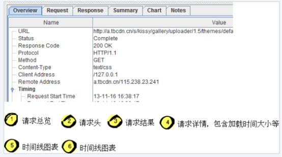
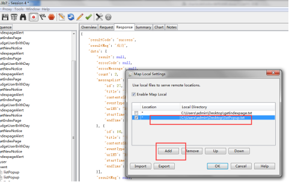

# Charles 安装使用 

一、charles的使用

1.1  charles的说明

Charles其实是一款代理服务器，通过过将自己设置成系统（电脑或者浏览器）的网络访问代理服务器，然后截取请求和请求结果达到分析抓包的目的。该软件是用Java写的，能够在Windows，Mac，Linux上使用。安装Charles的时候要先装好Java环境。

Charles的主要功能：

（1）截取Http 和 Https 网络封包。

（2）支持重发网络请求，方便后端调试。

（3）支持修改网络请求参数。

（4）支持网络请求的截获并动态修改。

（5）支持模拟慢速网络。

1.1.1 charles的下载和安装

1、安装包的下载

（1）进入官网下载地址：http://www.charlesproxy.com/，点击链接下载30天免费试用版本。

 

 

PS：Charles 是收费软件，可以免费试用 30 天。试用期过后，未付费的用户仍然可以继续使用，但是每次使用时间不能超过 30  分钟，并且启动时将会有 10  秒种的延时。因此，该付费方案对广大用户还是相当友好的，即使你长期不付费，也能使用完整的软件功能。只是当你需要长时间进行封包调试时，会因为  Charles 强制关闭而遇到影响。

（2）安装方法下载破解版，安装即可

安装包地址：https://pan.baidu.com/s/1caploU

破解补丁地址：[https://pan.baidu.com/s/1hrRpzda](https://link.jianshu.com?t=https%3A%2F%2Fpan.baidu.com%2Fs%2F1hrRpzda)

(1)按照步骤下载安装第一个安装包；

(2)将破解补丁包粘贴到charles的lib文件下，然后将原来的命名为charles的文件替换掉 即可

 

 

1.1.2 charles与手机/电脑的连接

1.1.2.1 charles与手机端的连接

使手机和电脑在一个局域网内，不一定非要是一个ip段，只要是同一个路由器下就可以了。

（1）首先利用cmd -config命令查看自己电脑的ip地址

 

 

（2）然后在手机端的wifi代理设置那里去进行相关的配置设置。

这里的代理服务器地址填写为电脑的ip地址，然后端口这里写8888（这个是charles的默认设置），如果自己修改了就写成自己所修改的端口就可以了。

 

 

配置完成，会看到一个charles与手机端的连接提示弹窗，选择allo即可。

 

 

（3）手机端抓包https

上述1、2步骤，只针对http请求。由于https协议的特殊性，所以要求电脑端和手机端都需要安装下证书，否则会看到返回的数据都是乱码。

a.电脑端证书下载

 

 

b. 手机端证书下载

在设备上打开这个网址 http://www.charlesproxy.com/getssl 安装 Charles SSL 证书。

注意，同一个手机对应不同电脑上的Charles都要分别下载证书进行认证，因为手机的证书是和电脑端的Charles一一配对的。

 

 

PS：ios手机，需要信任该证书

C.相关配置

选择Proxy | Proxy Settings，弹出proxy设置选项卡，勾选Enable SSL Proxying，在Location部份选择add，按如下图添加，抓取任意站点、443端口的数据。

 

 

1.1.2.2 charles与电脑端的连接

由于charles会自动配置浏览器和工具的代理设置，所以说打开工具直接就已经是抓包状态了。直接打开网页就可以了。

 注意：

（1）Charles支持抓去http、https协议的请求，不支持socket。

（网络上的两个程序通过一个双向的通信连接实现数据的交换，这个连接的一端称为一个socket）

（2）防火墙关掉

1.1.2.3 过滤请求

通常情况下，我们需要对网络请求进行过滤，只监控向指定目录服务器上发送的请求。对于这种需求，以下几种办法：

方法一：在主界面的中部的Filter栏中填入需要过滤出来的关键字。例如我们的服务器的地址是：[www.baidu.com](https://link.jianshu.com?t=http%3A%2F%2Fyuantiku.com%2F),那么只需要在 Filter 栏中填入[www.baidu.com](https://link.jianshu.com?t=http%3A%2F%2Fyuantiku.com%2F)即可。

 

 

方法二：在Charles的菜单栏选择 “Proxy”->”Recording Settings”，然后选择 Include 栏，选择添加一个项目，然后填入需要监控的协议，主机地址，端口号。这样就可以只截取目标网站的封包了。如下图所示：

 

 

通常情况下，我们使用方法一做一些临时性的封包过滤，使用方法二做一些经常性的封包过滤。

方法三：在想过滤的网络请求上右击，选择“Focus”，之后在 Filter 一栏勾选上 Focussed 一项，如下图所示：

这种方式可以临时性的，快速地过滤出一些没有通过关键字的一类网络请求。

 

 

1.2.charle的主界面介绍

1.2.1 界面简介

启动后，页面展示如下：

 

 

1.2.2 显示模式

Charles有两种显示模式，stucture 和sequence。支持来回切换。

(1) Structure形式如下图 优点：可以很清晰的看到请求的[数据结构](https://link.jianshu.com?t=http%3A%2F%2Flib.csdn.net%2Fbase%2Fdatastructure)，而且是以域名划分请求信息的，可以很清晰的去分析和处理数据。

 

 

（2）Sequence形式如下图 优点：可以看到全部请求，这里的结果以数据请求的顺序来显示，最新的请求显示在最下面

 

 

综上，两种形式各有千秋，structure 适合对单一系列的访问请求从宏观上进行把握，可以快速定位。sequence 适合精确定位内容，因为每条sequence 都有size，status等属性信息，方便快速定位这条结果的价值.

对于我自己来说，更倾向于Charles的第一种树状视图，比fiddler的列表视图好的地方在于：多次刷新后的请求会被归纳到树里面，更加一目了然，用fiddler的时候，有点强迫症的同学，都要点击clear，有木有…

1.2.3 工具条简介

 

 

⑴~⑷ session

Charles有个会话(session，不是指http中的session)的概念，可以理解为浏览器中的tab，这个功能在需要调试多个站点页面时很实用，当你刷新页面的时候，只会在当前session中捕获请求。

(PS：ctrl+N创建个新的session，ctrl+W关闭当前session)

⑸垃圾桶———功能是clear，清理掉所有请求显示信息。

⑹搜索关键字（望远镜的那个）———功能是搜索关键字，也可以使用ctrl+f实现，可以设置搜索的范围。

 

 

⑺停止监控

 

 

———功能是领抓去的数据显示或者不显示的设置。 这个本人认为是charles工具很方便的一个，一般都使其为不显示抓取状态，只有当自己[测试](https://link.jianshu.com?t=http%3A%2F%2Flib.csdn.net%2Fbase%2Fsoftwaretest)的时候的前后，在令其为抓取并显示状态。这样可以快准狠的获取到相关自己想要的信息，而不必在一堆数据请求中去寻找。

⑻开启/停止网速模拟

测试时，会用到网速模拟，具体的在后面功能部分介绍，此处略.....

⑼开启停止断点功能

⑽刷新单个请求

⑾编辑请求

编辑修改功能，可以对下图中的请求信息进行修改，修改完毕后点击Execute就可以发送一个修改后的请求数据包。

⑿校验请求的结果

⒀工具

⒁设置

1.2.4 右键请求菜单

右键请求出现菜单，Charles的右键菜单功能比fiddler强大太多了。

 

 

1.2.5 请求详情

请求详情跟fiddler相似，但直观不少：

 

 

1.2.5.1 overview—请求总览

 

 

（1）URL（统一资源定位符）

https:协议方案名

M.xxx.baidu.com:服务器地址，这里是DNS可解析的名称。同事也可以是ipv4d地址名，还可以是[0:0:0:0:0:0:0:1]这样用方括号括起来的IPV6地址名。

App/getindexPage：带层次的文件路径。指定服务器上的文件路径来定位特指的资源。

URL——请求url的路径、文件和查询字符串

Status——状态是否已完成

Notes——备注

Response Code——响应状态码

Protocol——该seesion使用的协议（Http/https/ftp）

SSLssl——协议版本号

Method——该seesion使用的方法（get/post/put等）

Content-Type——响应的content-type头

**Timing** ：

Request Start Time——接收到的第一个请求的第一个字节的时间点

Request End Time——发送到客户端的最后一个响应的最后一个字节的时间

Response Start Time——响应开始时间

Response End Time——响应结束时间

Duration——整个请求—响应持续时间

DNS——所有选中的session解析DNS所花费的时间的总和

Connect——所有选中session建立TCP/IP连接所花费的时间总和

Request——请求耗费时间

Response——响应耗费时间

**Size** 

Request Header——请求头大小

Response Header——响应头大小

Request 

Response 

Total——请求头+响应头字节大小

1.2.5.2 request—请求头

 

 

名词解释：

（1）Appid : 在COM中，安全控制的最小单位是进程，每个进程都有对应的安全控制策略。进程的安全控制策略保存在注册表中，存储位置为：HKCR\AppID\访问权限、启动权限等安全配置信息。开发[COM组件](https://link.jianshu.com?t=https%3A%2F%2Fwww.baidu.com%2Fs%3Fwd%3DCOM%E7%BB%84%E4%BB%B6%26tn%3D44039180_cpr%26fenlei%3Dmv6quAkxTZn0IZRqIHckPjm4nH00T1YdmvFhPyN-n1w-PWKBuAcY0ZwV5Hcvrjm3rH6sPfKWUMw85HfYnjn4nH6sgvPsT6KdThsqpZwYTjCEQLGCpyw9Uz4Bmy-bIi4WUvYETgN-TLwGUv3EnHRLn1b3rjbzn1bzPjTLP1mvn0)时，可以在[COM组件](https://link.jianshu.com?t=https%3A%2F%2Fwww.baidu.com%2Fs%3Fwd%3DCOM%E7%BB%84%E4%BB%B6%26tn%3D44039180_cpr%26fenlei%3Dmv6quAkxTZn0IZRqIHckPjm4nH00T1YdmvFhPyN-n1w-PWKBuAcY0ZwV5Hcvrjm3rH6sPfKWUMw85HfYnjn4nH6sgvPsT6KdThsqpZwYTjCEQLGCpyw9Uz4Bmy-bIi4WUvYETgN-TLwGUv3EnHRLn1b3rjbzn1bzPjTLP1mvn0)对应的CLSID子键下

新建字符串类型的项，名称：AppID，值：该[COM组件](https://link.jianshu.com?t=https%3A%2F%2Fwww.baidu.com%2Fs%3Fwd%3DCOM%E7%BB%84%E4%BB%B6%26tn%3D44039180_cpr%26fenlei%3Dmv6quAkxTZn0IZRqIHckPjm4nH00T1YdmvFhPyN-n1w-PWKBuAcY0ZwV5Hcvrjm3rH6sPfKWUMw85HfYnjn4nH6sgvPsT6KdThsqpZwYTjCEQLGCpyw9Uz4Bmy-bIi4WUvYETgN-TLwGUv3EnHRLn1b3rjbzn1bzPjTLP1mvn0)所在进程的AppID值。

channel：渠道包来源

Contextuuid:设备唯一标识

1.2.5.3 response—请求结果

Json格式，具体含义参考接口文档。（其中raw是原始数据包的状态）

 

 

1.2.5.4 summary—请求详情，包含加载时间等

 

 

1.2.5.5 时间线图表

 

 

1.3 常用的功能

1.3.1 模拟网速功能

在线上环境通常有些因为网速慢导致的bug，在本机无法重现，那时候就很抓瞎，如果嫌远程麻烦，推荐使用throttle。

支持对Bandwidth(带宽)、Utilistation(利用百分比)、Round-trip(往返延迟)、MTU(字节)进行配置，并且支持3G/4G或者其他网络模式。

**！**如果我们只想模拟指定网站的慢速网络，可以再勾选上图中的“Only for selected hosts”项，然后在对话框的下半部分设置中增加指定的 hosts 项即可。

 

 

ADSL：属于DSL技术的一种，全称Asymmetric Digital Subscriber Line（ [非对称数字用户线路](https://link.jianshu.com?t=http%3A%2F%2Fbaike.baidu.com%2Fitem%2F%E9%9D%9E%E5%AF%B9%E7%A7%B0%E6%95%B0%E5%AD%97%E7%94%A8%E6%88%B7%E7%BA%BF%E8%B7%AF)），亦可称作非对称数字用户环路。是一种新的数据传输[方式](https://link.jianshu.com?t=http%3A%2F%2Fbaike.baidu.com%2Fitem%2F%E6%96%B9%E5%BC%8F)。

VDSL：是一种非对称DSL技术，全称Very High Speed Digital Subscriber Line （超高速数字用户线路）。和ADSL技术一样，VDSL也使用双绞线进行语音和数据的传输。VDSL是利用现有[电话](https://link.jianshu.com?t=http%3A%2F%2Fbaike.baidu.com%2Fitem%2F%E7%94%B5%E8%AF%9D)线上安装VDSL，只需在用户侧安装一台VDSL modem。最重要的是，无须为[宽带](https://link.jianshu.com?t=http%3A%2F%2Fbaike.baidu.com%2Fitem%2F%E5%AE%BD%E5%B8%A6)上网而重新布设或变动线路。

Isdn：综合业务数字网（Integrated Services Digital  Network，ISDN）是一个数字电话网络国际标准，是一种典型的电路交换网络系统。在ITU的建议中，ISDN是一种在数字电话网IDN的基础上发展起来的通信网络，ISDN能够支持多种业务，包括电话业务和非电话业务。

1.3.2修改网络请求内容

Charles可以方便地提供网络请求的修改和重发功能。这也可以解决我们，为了修改谋其格请求，或者反复尝试不同参数的网络请求的需求。方法是：只需要在以往的网络请求上点击右键，选择 “Edit”/点击铅笔图标，即可创建一个可编辑的网络请求。如下所示：

 

 

我们可以修改该请求的任何信息，包括URL地址、端口、参数等，之后点击 “Execute” 即可发送该修改后的网络请求（如下图所示）。Charles 支持我们多次修改和发送该请求。

 

 

1.3.3 重复发送网络请求

（1）Repeat：此功能此功能对于测试同学特别有用，可以检验接口的健壮性。对于前端的价值是不需要刷新页面，只需要repeat请求，比如检验代理是否成功，修改请求后执行等。使用方法：选择请求后，右击Repeat就是重复发送一次请求。 

（2）Advanced  Repeat可以自定义重复次数和重复间隔，重复发送多次请求。可以来简单地测试服务器的并发处理能力，方法如下：我们在想打压的网络请求上（POST或 GET 请求均可）右击，然后选择 「Repeat  Advanced」菜单项。然后在弹出的对话框中，选择打压的并发线程数以及打压次数，确定之后，即可开始打压。（iteration:迭代次数，Concurrency:并发数,repeat为时间间隔）。

 

 

1.3.4 修改服务器返回内容

有些时候我们想让服务器返回一些指定的内容，方便我们调试一些特殊情况。例如列表页面为空的情况，数据异常的情况，部分耗时的网络请求超时的情况等。如果没有Charles，要服务器配合构造相应的数据显得会比较麻烦。这个时候，使用 Charles 相关的功能就可以满足我们的需求。

根据具体的需求，Charles提供了 Map 功能、 Rewrite 功能以及 Breakpoints 功能，都可以达到修改服务器返回内容的目的。这三者在功能上的差异是：

△Map功能适合长期地将某一些请求重定向到另一个网络地址或本地文件。

△Rewrite功能适合对网络请求进行一些正则替换。

△Breakpoints功能适合做一些临时性的修改。

1.3.4.1 MAL

在Charles的菜单中，选择 “Tools”->”Map Remote” 或 “Map Local” 即可进入到相应功能的设置页面。

（1）map remote

对于Map Remote功能，我们需要分别填写网络重定向的源地址和目的地址，对于不需要限制的条件，可以留空。

 

 

（2）map local

对于Map Local功能，我们需要填写的重定向的源地址和本地的目标文件。对于有一些复杂的网络请求结果，我们可以先使用 Charles  提供的 “Save Response…” 功能，将请求结果保存到本地（如下图所示），然后稍加修改，成为我们的目标映射文件。

方法是：

1.请求右键—save response，然后另存在自己电脑的某个位置（文件属性必须为.txt）

2.请求右键/tools—MAPlocal，然后添加你刚才保存的文件，点击OK保存

 

 

3.右键请求，选择repeat

4.重新刷新app的页面，会看到数据已经修改过来了。

5.去掉代理配置：取消勾选Tools—Maplocal即可

 

 

1.3.4.2  Rewrite

Map Local在使用的时候，有一个潜在的问题，就是其返回的 Http Response Header  与正常的请求并不一样。这个时候如果客户端校验了 Http Response Header 中的部分内容，就会使得该功能失效。解决办法是同时使用  Map Local 以下面提到的 Rewrite 功能，将相关的 Http 头 Rewrite 成我们希望的内容。

Rewrite功能功能适合对某一类网络请求进行一些正则替换，以达到修改结果的目的。

例如：我们的客户端有一个API请求是获得用户昵称，而我当前的昵称是 “XXXX”。我们想试着直接修改网络返回值，将“XXXX”替换成“测试测试下”。

步骤是：

1.选中请求，然后在Tools—右键选择rewrite功能；

2.在弹出的提示弹窗中，选择add-rules

 

 

3.完成设置之后，右键请求，选择 repeat。然后我们就可以从 Charles 中看到，之后的 API 获得的昵称被自动 Rewrite 成了 测试测试下，如下图所示：

 

 

1.3.5 断点功能（Breakpoints）

上面提供的Rewrite功能最适合做批量和长期的替换，但是很多时候，我们只是想临时修改一次网络请求结果，这个时候，使用 Rewrite 功能虽然也可以达到目的，但是过于麻烦，对于临时性的修改，我们最好使用 Breakpoints 功能。

Breakpoints，当指定的网络请求发生时，Charles 会截获该请求，这个时候，我们可以在 Charles 中临时修改网络请求的返回内容。

Charles能够断到发送请求前(篡改Request)和请求后(篡改Response)。

使用断点修改请求的弊端是，如果开发设置了请求超时时间，那么修改的速度慢了往往即使返回了也没有效果，所以实际测试中使用此方法的场景并不多。

这里以将我的券金额修改为13.00元为例：

（1） 针对接口右键选择"BreakPoints",这样这个接口就被加入到断点状态了；

 

 

（2）需要进一步修改断点的属性，可以在菜单栏"Proxy"–>"Breakpoints Settings"里进行添加删除或者修改，并且可以选择这个断点是在request还是response，还是两者都要。这里只是修改response

 

 

(3)刷新app界面，跳转到断点模版，这个时候你可以在对应状态情况下修改request或者response,然后点击下方按钮“Execute”。点开Edit Response界面，选择JSON格式，格式清晰，方便修改，直接在上面进行数据修改，改成你想要测试的数据，然后点击执行按钮

 

 

(4)再次刷新app界面，然后app返回的是新改的数据，根据返回数据测试客户端显示是否正确

 

 

1.3.6 查看连接本机charles代理的ip

 

 

这里可以看到连接自己charles代理的IP，针对某些不需要的/未知用户，点击remove即可

1.3.7 设置请求的黑名单

不想某些请求发起，直接返回404，可以用黑名单。选择Tools-Blacklist，设置如下图：

 

## HTTPS 无法抓包

Android 7.0 之后抓包 unknown 和证书无效的解决方案（无需改代码）
原创 ShadowySpirits 发布于2018-03-30 14:04:55 阅读数 28275 收藏
展开
背景

使用抓包软件（以 Charles 为例）抓取APP的 https 请求时，Android和Charles都正确安装了证书却出现抓包失败，报错：

Client SSL handshake failed: An unknown issue occurred processing the certificate (certificate_unknown)
抓包失败
原因

Android7.0 之后默认不信任用户添加到系统的CA证书：

    To provide a more consistent and more secure experience across the Android ecosystem, beginning with Android Nougat, compatible devices trust only the standardized system CAs maintained in AOSP.（文档链接）

也就是说对基于 SDK24 及以上的APP来说，即使你在手机上安装了抓包工具的证书也无法抓取 https 请求

解决方案
一、官方解决方案（需修改代码）

    官方文档：https://developer.android.google.cn/training/articles/security-config.html
    详细演示：https://blog.csdn.net/mrxiagc/article/details/75329629

二、将抓包软件的证书安装成系统证书（需ROOT）

系统证书目录：/system/etc/security/cacerts/

其中的每个证书的命名规则如下：
<Certificate_Hash>.<Number>
文件名是一个Hash值，而后缀是一个数字。

文件名可以用下面的命令计算出来：

openssl x509 -subject_hash_old -in <Certificate_File>

后缀名的数字是为了防止文件名冲突的，比如如果两个证书算出的Hash值是一样的话，那么一个证书的后缀名数字可以设置成0，而另一个证书的后缀名数字可以设置成1

操作步骤：

将抓包软件的证书用上述命令计算出 Hash 值，将其改名并复制到系统证书目录

计算 Hash 值

此时你应该可以在 设置->安全->加密与凭据->信任的凭据 的系统标签页看到你新加入的证书，将其启用即可顺利抓包

安装好的CA证书

    点赞 3
    收藏
    分享

# 参考文档

https://blog.csdn.net/ShadowySpirits/article/details/79756274

https://www.jianshu.com/p/b400fd989782

https://www.zzzmode.com/mytools/charles/