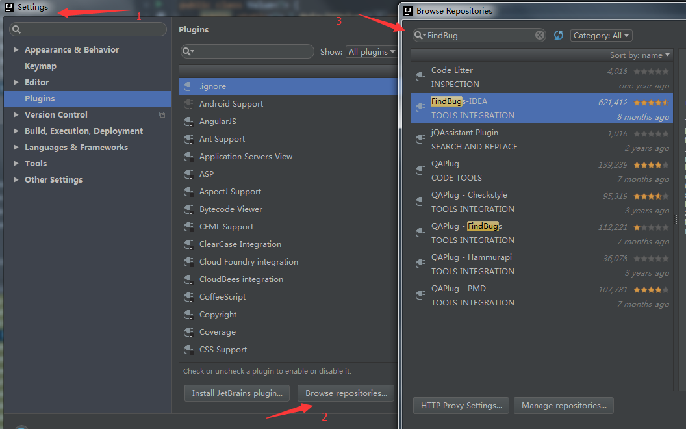
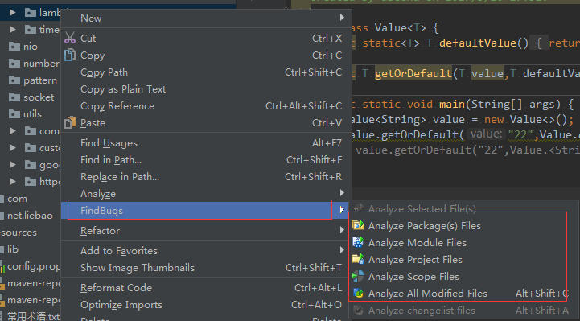
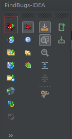

# FindBugs使用

> bug无处不在，但是我们总希望少一点bug。
>
> 最近发现了一款好用的寻找bug的插件，特此记下。

# 一、安装

路径：File-->Settings-->Plugins-->Browse repositories....-->输入FindBugs-IDEA-->点击安装

 

# 二、使用

注意：安装后需要重启idea

 

有各种可选范围

# 三、结果分析

**Bad pratice 编程的坏习惯** 

主要是命名问题,比如类名最好以大写开头,字符串不要使用等号不等号进行比较,可能会有异常最好用try-catch包裹的代码,方法有返回值但被忽略等等,这些如果不想改可以直接忽略.

**Malicious code vulnerability 恶意代码漏洞** 

听起来很吓人呀,主要是一些属性直接使用public让别的类来获取,建议改为private并为其提供get/set方法. 
还有一些public的静态字段,可能会被别的包获取之类的. 
这些也需要根据项目具体情况来,个人意见,在有的不重要类,有时直接公开使用属性,可能更为便捷.如果你认为这些不需要修改,完全可以忽略.

**Dodgy code 糟糕的代码** 

·比如一个double/float被强制转换成int/long可能会导致精度损失,一些接近零的浮点数会被直接截断,事实上我们应该保留. 
在类型转换的时候,我们应该为类型转换提供一个安全的转换方法,因为我们永远不会知道,我们的app在用户手里会发生什么,所以我们要尽可能的去减少这种发生错误的可能.

- 比如使用switch的时候没有提供default。

- 多余的空检查，就是不可能为空的值，增加了不为空判断，这是没有必要的。属于代码冗余

- 不安全的类型转换等等。 

这项太多了，就不一一列举了。

**performance 性能** 

主要是一些无用的代码,比如声明了没有用到的属性等等

**correctness 代码的正确性** 

这一项应该算是最重要的了 
主要是没有对变量进行不为空判定,在特殊情况可能发生空指针异常.

# 四、扩展

1. 点击如下按钮，可分析当前文件，真是太强大了。

2. 有一个默认编码检查的类很烦

**我直接去掉检查了：Dector:DefaultEncodingDector**

# 参考文档：

官网地址

http://findbugs.sourceforge.net/