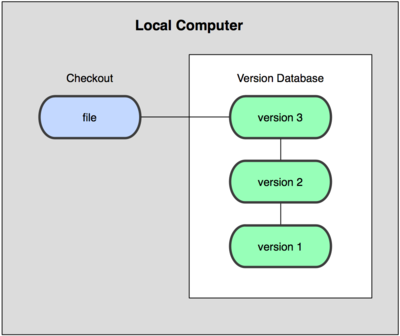
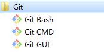
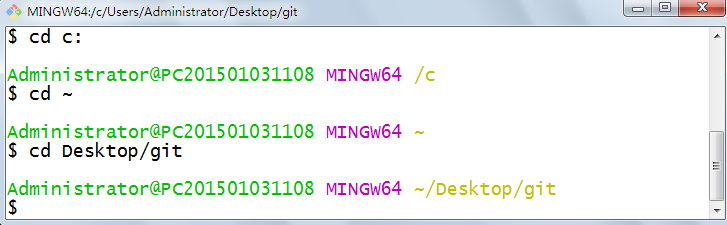
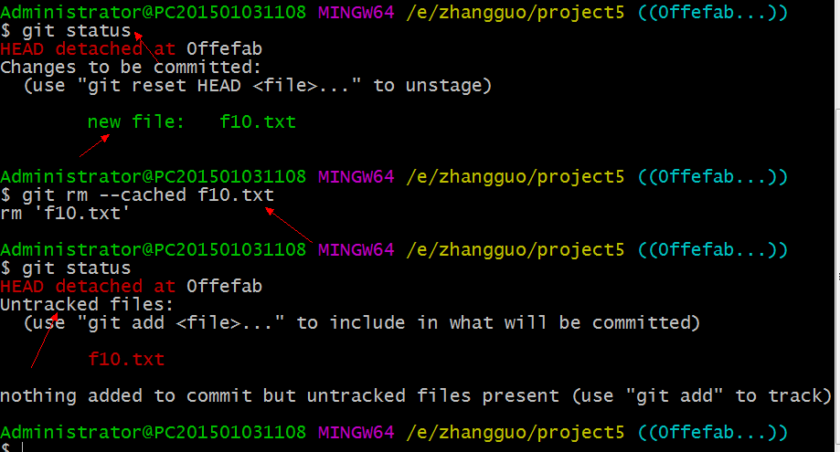
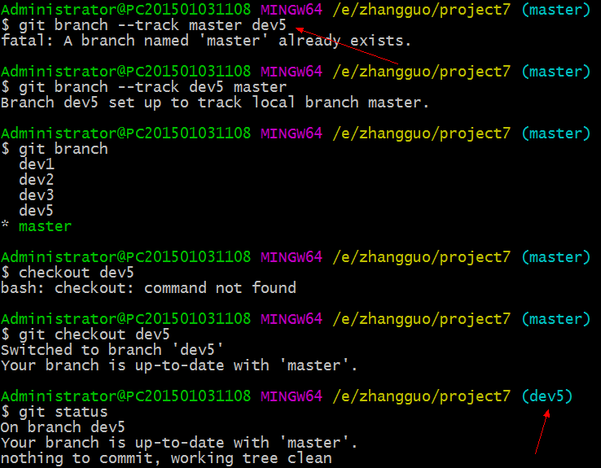
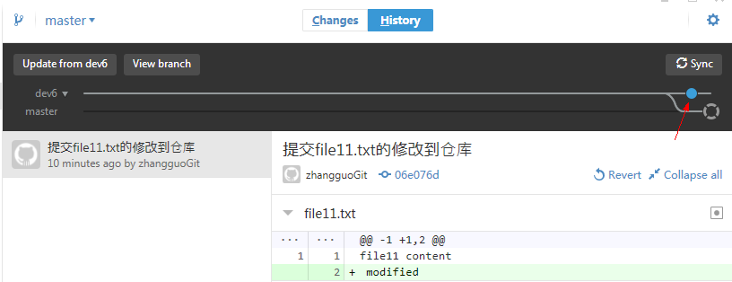
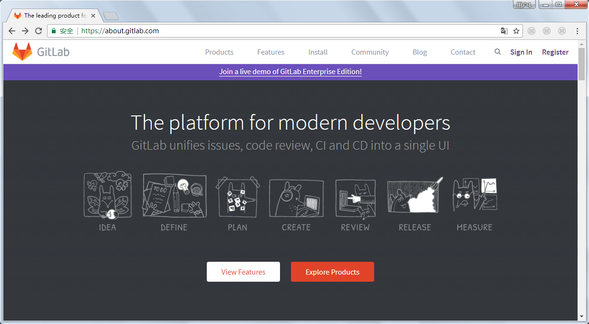

# 一小时学会Git

 

最近要与部门同事一起做技术分享，我选择了Git，因为Git 是一种在全球范围都广受欢迎的版本控制系统。在开发过程中，为了跟踪代码，文档，项目等信息中的变化，版本控制变得前所未有的重要。

# 一、版本控制概要 

工作区 暂存区 本地仓库 远程仓库

## 1.1、什么是版本控制

版本控制（Revision control）是一种在开发的过程中用于管理我们对文件、目录或工程等内容的修改历史，方便查看更改历史记录，备份以便恢复以前的版本的软件工程技术。

- 实现跨区域多人协同开发
- 追踪和记载一个或者多个文件的历史记录
- 组织和保护你的源代码和文档
- 统计工作量
- 并行开发、提高开发效率
- 跟踪记录整个软件的开发过程
- 减轻开发人员的负担，节省时间，同时降低人为错误

简单说就是用于管理多人协同开发项目的技术。

没有进行版本控制或者版本控制本身缺乏正确的流程管理，在软件开发过程中将会引入很多问题，如软件代码的一致性、软件内容的冗余、软件过程的事物性、软件开发过程中的并发性、软件源代码的安全性，以及软件的整合等问题。


## 1.2、常用术语

**1)、仓库（Repository）**
受版本控制的所有文件修订历史的共享数据库

**2)、工作空间（Workspace)**
本地硬盘或Unix 用户帐户上编辑的文件副本

**3)、工作树/区（Working tree）**
工作区中包含了仓库的工作文件。您可以修改的内容和提交更改作为新的提交到仓库。

**4)、暂存区（Staging area）**
暂存区是工作区用来提交更改（commit）前可以暂存工作区的变化。


**5)、索引（Index）**
索引是暂存区的另一种术语。

**6)、签入（Checkin）**
将新版本复制回仓库

**7)、签出（Checkout）**
从仓库中将文件的最新修订版本复制到工作空间

**8)、提交（Commit）**
对各自文件的工作副本做了更改，并将这些更改提交到仓库

**9)、冲突（Conflict）**
多人对同一文件的工作副本进行更改，并将这些更改提交到仓库

**10)、合并（Merge）**
将某分支上的更改联接到此主干或同为主干的另一个分支

**11)、分支（Branch）**
从主线上分离开的副本，默认分支叫master

**12)、锁（Lock）**
获得修改文件的专有权限。

**13)、头（HEAD）**
头是一个象征性的参考，最常用以指向当前选择的分支。

**14)、修订（Revision）**
表示代码的一个版本状态。Git通过用SHA1 hash算法表示的ID来标识不同的版本。

**15)、标记（Tags）**
标记指的是某个分支某个特定时间点的状态。通过标记，可以很方便的切换到标记时的状态。

## 1.3、常见的版本控制器

主流的版本控制器有如下这些：

- **Git**
- **SVN**（Subversion）
- **CVS**（Concurrent Versions System）
- **VSS**（Micorosoft Visual SourceSafe）
- **TFS**（Team Foundation Server）
- Visual Studio Online

版本控制产品非常的多（Perforce、Rational ClearCase、RCS（GNU Revision Control System）、Serena Dimention、SVK、BitKeeper、Monotone、Bazaar、Mercurial、SourceGear Vault），现在影响力最大且使用最广泛的是Git与SVN

## 1.4、版本控制分类

### **1.4.1、本地版本控制**

记录文件每次的更新，可以对每个版本做一个快照，或是记录补丁文件，适合个人用，如RCS。



### **1.4.2、集中版本控制**

所有的版本数据都保存在服务器上，协同开发者从服务器上同步更新或上传自己的修改


所有的版本数据都存在服务器上，用户的本地只有自己以前所同步的版本，如果不连网的话，用户就看不到历史版本，也无法切换版本验证问题，或在不同分支工作。而且，所有数据都保存在单一的服务器上，有很大的风险这个服务器会损坏，这样就会丢失所有的数据，当然可以定期备份。代表产品：SVN、CVS、VSS

### 1.4.3、分布式版本控制

所有版本信息仓库全部同步到本地的每个用户，这样就可以在本地查看所有版本历史，可以离线在本地提交，只需在连网时push到相应的服务器或其他用户那里。由于每个用户那里保存的都是所有的版本数据，只要有一个用户的设备没有问题就可以恢复所有的数据，但这增加了本地存储空间的占用。


## 1.5、Git与SVN最主要区别

SVN是集中式版本控制系统，版本库是集中放在中央服务器的，而工作的时候，用的都是自己的电脑，所以首先要从中央服务器得到最新的版本，然后工作，完成工作后，需要把自己做完的活推送到中央服务器。集中式版本控制系统是必须联网才能工作，对网络带宽要求较高。


 

Git是分布式版本控制系统，没有中央服务器，每个人的电脑就是一个完整的版本库，工作的时候不需要联网了，因为版本都在自己电脑上。协同的方法是这样的：比如说自己在电脑上改了文件A，其他人也在电脑上改了文件A，这时，你们两之间只需把各自的修改推送给对方，就可以互相看到对方的修改了。

# 二、Git安装与配置


## 2.1、什么是Git

Git是目前世界上最先进的分布式版本控制系统。

Git是免费、开源的

最初Git是为辅助 Linux 内核开发的，来替代 BitKeeper


**作者**：Linux和Git之父李纳斯·托沃兹（Linus Benedic Torvalds）1969、芬兰

**优点：**

- 适合分布式开发，强调个体。
- 公共服务器压力和数据量都不会太大。
- 速度快、灵活。
- 任意两个开发者之间可以很容易的解决冲突。
- 离线工作。

**缺点：**

- 模式上比SVN更加复杂。
- 不符合常规思维。
- 代码保密性差，一旦开发者把整个库克隆下来就可以完全公开所有代码和版本信息。

**官网**： https://git-scm.com/

**源码：** https://github.com/git/git/

## 2.2、搭建Git工作环境

### 2.2.1、下载Git

打开 [git官网](https://git-scm.com/)，下载git对应操作系统的版本。


选择版本：


这里我选择下载**[64-bit Git for Windows Setup](https://github.com/git-for-windows/git/releases/download/v2.14.1.windows.1/Git-2.14.1-64-bit.exe)

**


### **2.2.2、安装Git**


选择安装配置信息


一直Next默认就好了，如果需要设置就要仔细读一下安装界面上的选项。


#### linux 安装 Git

```
 yum install git 
```

一路yes  就可以了


### 2.2.3、启动Git

安装成功后在开始菜单中会有Git项，菜单下有3个程序：



**Git Bash：**Unix与Linux风格的命令行，使用最多，推荐最多


与DOS风格的命令有些区别，不习惯可以选择Git CMD

**Git CMD：**Windows风格的命令行


**Git GUI**：图形界面的Git，不建议初学者使用，尽量先熟悉常用命令


点击Create New Repository可以直接创建一个新的仓库。

### 2.2.4、Linux与Mac OS安装Git

Linux安装Git：sudo apt-get install git 命令行就可以安装了。

Mac OS安装Git： https://git-scm.com/download/mac，下载双击.pkg安装

### 2.2.5、Bash基本操作命令

~就是home


进入Bash默认位置，注意标题栏


1）、cd : 改变目录。

　　cd ~ 回Home（windows是当前用户所在目录）

　　

2）、cd . . 回退到上一个目录，直接cd进入默认目录


3）、pwd : 显示当前所在的目录路径。


4）、ls(ll): 都是列出当前目录中的所有文件，只不过ll(两个ll)列出的内容更为详细。


5）、touch : 新建一个文件 如 touch index.js 就会在当前目录下新建一个index.js文件。


6）、rm: 删除一个文件, rm index.js 就会把index.js文件删除。


7）、mkdir: 新建一个目录,就是新建一个文件夹。


8）、rm -r : 删除一个文件夹, rm -r src 删除src目录， 好像不能用通配符。


9）、mv 移动文件, mv index.html src index.html 是我们要移动的文件, src 是目标文件夹,当然, 这样写,必须保证文件和目标文件夹在同一目录下。

10）、reset 重新初始化终端/清屏。

11）、clear 清屏。

12）、history 查看命令历史。


13）、help 帮助。

14）、exit 退出。

15）、#表示注释

16）、输出与注释


17）、创建文件


```
小于号：命令默认从键盘获得的输入，改成从文件，或者其它打开文件以及设备输入

>> 是追加内容

> 是覆盖原有内容
```


 18、显示文件内容 cat

 

## 2.3、Git配置 - git config

### 2.3.1、查看配置 - git config -l

使用git config -l 可以查看现在的git环境详细配置


查看不同级别的配置文件：


```
#查看系统config
git config --system --list
　　
#查看当前用户（global）配置
git config --global  --list
 
#查看当前仓库配置信息
git config --local  --list
```


### 2.3.2、Git配置文件分类

在Windows系统中，Git在$HOME目录中查找.gitconfig文件（一般位于C:\Documents and Settings$USER下）

**Git相关的配置文件有三个：**

1）、 /etc/gitconfig：包含了适用于系统所有用户和所有项目的值。(Win：C:\Program Files\Git\mingw64\etc\gitconfig) --system 系统级


 

2）、~/.gitconfig：只适用于当前登录用户的配置。(Win：C:\Users\Administrator\.gitconfig)  --global 全局


3）、位于git项目目录中的.git/config：适用于特定git项目的配置。(Win：C:\gitProject) --local当前项目

注意：对于同一配置项，三个配置文件的优先级是1<2<3

这里可以直接编辑配置文件，通过命令设置后会响应到这里。

### 2.3.3、设置用户名与邮箱

当你安装Git后首先要做的事情是设置你的用户名称和e-mail地址。这是非常重要的，因为每次Git提交都会使用该信息。它被永远的嵌入到了你的提交中：

```
 　　$ git config --global user.name "zhangguo"  #名称
 　　$ git config --global user.email zhangguo@qq.com   #邮箱
```

只需要做一次这个设置，如果你传递了--global 选项，因为Git将总是会使用该信息来处理你在系统中所做的一切操作。如果你希望在一个特定的项目中使用不同的名称或e-mail地址，你可以在该项目中运行该命令而不要--global选项。 总之--global为全局配置，不加为某个项目的特定配置。


### 2.3.4、添加或删除配置项

**1）、添加配置项** 

```
git config [--local|--global|--system]  section.key value
[--local|--global|--system]  #可选的，对应本地，全局，系统不同级别的设置，请看2.3.2
section.key #区域下的键
value #对应的值
```

--local 项目级

--global 当前用户级

--system 系统级 

例如我们要在student区域下添加一个名称为height值为198的配置项，执行结果如下：


**2）、删除配置项** 

```
git config [--local|--global|--system] --unset section.key
```

 将系统级的height配置项移除


### 2.3.5、更多配置项

```
git config --global color.ui true   #打开所有的默认终端着色
git config --global alias.ci commit   #别名 ci 是commit的别名
[alias]  
co = checkout  
ci = commit  
st = status  
pl = pull  
ps = push  
dt = difftool  
l = log --stat  
cp = cherry-pick  
ca = commit -a  
b = branch 

user.name  #用户名
user.email  #邮箱
core.editor  #文本编辑器  
merge.tool  #差异分析工具  
core.paper "less -N"  #配置显示方式  
color.diff true  #diff颜色配置  
alias.co checkout  #设置别名
git config user.name  #获得用户名
git config core.filemode false  #忽略修改权限的文件  
```

所有config命令参数

```
语法: git config [<options>]        
        
文件位置        
    --global                  #use global config file 使用全局配置文件
    --system                  #use system config file 使用系统配置文件
    --local                   #use repository config file    使用存储库配置文件
    -f, --file <file>         #use given config file    使用给定的配置文件
    --blob <blob-id>          #read config from given blob object    从给定的对象中读取配置
        
动作        
    --get                     #get value: name [value-regex]    获得值：[值]名[正则表达式]
    --get-all                 #get all values: key [value-regex]    获得所有值：[值]名[正则表达式]
    --get-regexp          #get values for regexp: name-regex [value-regex]    得到的值根据正则
    --get-urlmatch            #get value specific for the URL: section[.var] URL    为URL获取特定的值
    --replace-all             #replace all matching variables: name value [value_regex]    替换所有匹配的变量：名称值[ value_regex ]
    --add                     #add a new variable: name value    添加一个新变量：name值
    --unset                   #remove a variable: name [value-regex]    删除一个变量名[值]：正则表达式
    --unset-all               #remove all matches: name [value-regex]    删除所有匹配的正则表达式：名称[值]
    --rename-section          #rename section: old-name new-name    重命名部分：旧名称 新名称
    --remove-section          #remove a section: name    删除部分：名称
    -l, --list                #list all    列出所有
    -e, --edit            #open an editor    打开一个编辑器
    --get-color               #find the color configured: slot [default]    找到配置的颜色：插槽[默认]
    --get-colorbool           #find the color setting: slot [stdout-is-tty]    发现颜色设置：槽[ stdout是TTY ]
        
类型        
    --bool                    #value is "true" or "false"    值是“真”或“假”。
    --int                     #value is decimal number    值是十进制数。
    --bool-or-int             #value is --bool or --int    值--布尔或int
    --path                    #value is a path (file or directory name)    值是路径（文件或目录名）
        
其它        
    -z, --null                #terminate values with NUL byte    终止值与null字节
    --name-only               #show variable names only    只显示变量名
    --includes                #respect include directives on lookup    尊重包括查找指令
    --show-origin             #show origin of config (file, standard input, blob, command line)    显示配置（文件、标准输入、数据块、命令行）的来源
```

# 三、Git理论基础

## 3.1、工作区域

Git本地有三个工作区域：工作目录（Working Directory）、暂存区(Stage/Index)、资源库(Repository或Git Directory)。如果在加上远程的git仓库(Remote Directory)就可以分为四个工作区域。文件在这四个区域之间的转换关系如下：


- Workspace：工作区，就是你平时存放项目代码的地方
- Index / Stage：暂存区，用于临时存放你的改动，事实上它只是一个文件，保存即将提交到文件列表信息
- Repository：仓库区（或本地仓库），就是安全存放数据的位置，这里面有你提交到所有版本的数据。其中HEAD指向最新放入仓库的版本
- Remote：远程仓库，托管代码的服务器，可以简单的认为是你项目组中的一台电脑用于远程数据交换

本地的三个区域确切的说应该是git仓库中HEAD指向的版本


- Directory：使用Git管理的一个目录，也就是一个仓库，包含我们的工作空间和Git的管理空间。
- WorkSpace：需要通过Git进行版本控制的目录和文件，这些目录和文件组成了工作空间。
- .git：存放Git管理信息的目录，初始化仓库的时候自动创建。
- Index/Stage：暂存区，或者叫待提交更新区，在提交进入repo之前，我们可以把所有的更新放在暂存区。
- Local Repo：本地仓库，一个存放在本地的版本库；HEAD会只是当前的开发分支（branch）。
- Stash：隐藏，是一个工作状态保存栈，用于保存/恢复WorkSpace中的临时状态。

## 3.2、工作流程

git的工作流程一般是这样的：

１、在工作目录中添加、修改文件；

２、将需要进行版本管理的文件放入暂存区域；

３、将暂存区域的文件提交到git仓库。

因此，git管理的文件有三种状态：已修改（modified）,已暂存（staged）,已提交(committed)


## 3.3、图解教程

个人认为Git的原理相比别的版本控制器还是复杂一些的，有一份图解教程比较直观：

[图解教程英文原版](https://github.com/MarkLodato/visual-git-guide)

[图解教程中文版](http://www.cnblogs.com/yaozhongxiao/p/3811130.html)


# 四、Git操作

## 4.1、创建工作目录与常用指令

工作目录（WorkSpace)一般就是你希望Git帮助你管理的文件夹，可以是你项目的目录，也可以是一个空目录，建议不要有中文。

日常使用只要记住下图6个命令：


## 4.2、获得GIT仓库

创建本地仓库的方法有两种：一种是创建全新的仓库，另一种是克隆远程仓库。


### 4.2.1、创建全新仓库

需要用GIT管理的项目的根目录执行：

```
# 在当前目录新建一个Git代码库
$ git init
```

**执行：**


**结果：**

 

执行后可以看到，仅仅在项目目录多出了一个.git目录，关于版本等的所有信息都在这个目录里面。

当然如果使用如下命令，可以把创建目录与仓库一起完成：

```
# 新建一个目录，将其初始化为Git代码库
$ git init [project-name]
```

 执行命令与运行结果：


### 4.2.2、克隆远程仓库

 另一种方式是克隆远程目录，由于是将远程服务器上的仓库完全镜像一份至本地，而不是取某一个特定版本，所以用clone而不是checkout，语法格式如下：

```
# 克隆一个项目和它的整个代码历史(版本信息)
$ git clone [url]
```

**执行：**

比如我们要从克隆的远程仓库托管在github上，地址为：https://github.com/zhangguo5/SuperPlus.git，这是一个公开的项目


****

**结果：**


## 4.3、GIT文件操作

版本控制就是对文件的版本控制，要对文件进行修改、提交等操作，首先要知道文件当前在什么状态，不然可能会提交了现在还不想提交的文件，或者要提交的文件没提交上。GIT不关心文件两个版本之间的具体差别，而是关心文件的整体是否有改变，若文件被改变，在添加提交时就生成文件新版本的快照，而判断文件整体是否改变的方法就是用SHA-1算法计算文件的校验和。

### 4.3.1、文件4种状态


- **Untracked**: 未跟踪, 此文件在文件夹中, 但并没有加入到git库, 不参与版本控制. 通过`git add` 状态变为`Staged`.
- **Unmodify**: 文件已经入库, 未修改, 即版本库中的文件快照内容与文件夹中完全一致. 这种类型的文件有两种去处, 如果它被修改, 而变为`Modified`. 如果使用`git rm`移出版本库, 则成为`Untracked`文件
- **Modified**: 文件已修改, 仅仅是修改, 并没有进行其他的操作. 这个文件也有两个去处, 通过`git add`可进入暂存`staged`状态, 使用`git checkout` 则丢弃修改过, 返回到`unmodify`状态, 这个`git checkout`即从库中取出文件, 覆盖当前修改
- **Staged**: 暂存状态. 执行`git commit`则将修改同步到库中, 这时库中的文件和本地文件又变为一致, 文件为`Unmodify`状态. 执行`git reset HEAD filename`取消暂存, 文件状态为`Modified`


### 4.3.2、查看文件状态

上面说文件有4种状态，通过如下命令可以查看到文件的状态：

```
#查看指定文件状态
git status [filename]

#查看所有文件状态
git status
```

命令：


结果：

foo.htm文件的状态为untracked（未跟踪），提示通过git add可以暂存

GIT在这一点做得很好，在输出每个文件状态的同时还说明了怎么操作，像上图就有怎么暂存、怎么跟踪文件、怎么取消暂存的说明。

### 4.3.3、添加文件与目录


工作区（Working Directory）就是你在电脑里能看到的目录。

版本库（Repository）工作区有一个隐藏目录`.git`，这个不算工作区，而是Git的版本库。

Git的版本库里存了很多东西，其中最重要的就是称为stage（或者叫index）的暂存区，还有Git为我们自动创建的第一个分支`master`，以及指向`master`的一个指针叫`HEAD`。

将untracked状态的文件添加到暂存区，语法格式如下：

```
# 添加指定文件到暂存区
$ git add [file1] [file2] ...

# 添加指定目录到暂存区，包括子目录
$ git add [dir]

# 添加当前目录的所有文件到暂存区
$ git add .
```

执行：


### 4.3.4、移除文件与目录（撤销add）


当执行如下命令时，会直接从暂存区删除文件，工作区则不做出改变

```
#直接从暂存区删除文件，工作区则不做出改变
git rm --cached <file>
```

执行命令


通过重写目录树移除add文件：

```
#如果已经用add 命令把文件加入stage了，就先需要从stage中撤销
git reset HEAD <file>...
```

当执行 “git reset HEAD” 命令时，暂存区的目录树会被重写，被 master 分支指向的目录树所替换，但是工作区不受影响。

示例：把f1.txt文件从暂存区撤回工作区


移除所有未跟踪文件

```
#移除所有未跟踪文件
#一般会加上参数-df，-d表示包含目录，-f表示强制清除。
git clean [options] 
```

示例：


移除前：


执行移除：


移除后：


```
#只从stage中删除，保留物理文件
git rm --cached readme.txt 

#不但从stage中删除，同时删除物理文件
git rm readme.txt 

#把a.txt改名为b.txt
git mv a.txt b.txt 
```


当执行提交操作（git commit）时，暂存区的目录树写到版本库（对象库）中，master 分支会做相应的更新。即 master 指向的目录树就是提交时暂存区的目录树。

当执行 “git reset HEAD” 命令时，暂存区的目录树会被重写，被 master 分支指向的目录树所替换，但是工作区不受影响。

当执行 “git rm –cached <file>” 命令时，会直接从暂存区删除文件，工作区则不做出改变。

当执行 “git checkout .” 或者 “git checkout — <file>” 命令时，会用暂存区全部或指定的文件替换工作区的文件。这个操作很危险，会清除工作区中未添加到暂存区的改动。

当执行 “git checkout HEAD .” 或者 “git checkout HEAD <file>” 命令时，会用 HEAD 指向的 master 分支中的全部或者部分文件替换暂存区和以及工作区中的文件。这个命令也是极具危险性的，因为不但会清除工作区中未提交的改动，也会清除暂存区中未提交的改 动。

### 4.3.5、查看文件修改后的差异

git diff用于显示WorkSpace中的文件和暂存区文件的差异

用"git status"只能查看对哪些文件做了改动，如果要看改动了什么，可以用：

```
#查看文件修改后的差异
git diff [files]
```

命令：


 ---a表示修改之前的文件，+++b表示修改后的文件

```
#比较暂存区的文件与之前已经提交过的文件
git diff --cached
```

也可以把WorkSpace中的状态和repo中的状态进行diff，命令如下:

```
#比较repo与工作空间中的文件差异
git diff HEAD~n
```

****

### **4.3.6、签出**

如果仓库中已经存在文件f4.txt，在工作区中对f4修改了，如果想撤销可以使用checkout，签出覆盖

检出命令git checkout是git最常用的命令之一，同时也是一个很危险的命令，因为这条命令会重写工作区

语法：


```
#用法一
git checkout [-q] [<commit>] [--] <paths>...
#用法二
git checkout [<branch>]
#用法三
git checkout [-m] [[-b]--orphan] <new_branch>] [<start_point>]
```


<commit>是可选项，如果省略则相当于从暂存区（index）进行检出


```
$ git checkout branch
#检出branch分支。要完成图中的三个步骤，更新HEAD以指向branch分支，以及用branch  指向的树更新暂存区和工作区。

$ git checkout
#汇总显示工作区、暂存区与HEAD的差异。

$ git checkout HEAD
#同上

$ git checkout -- filename
#用暂存区中filename文件来覆盖工作区中的filename文件。相当于取消自上次执行git add filename以来（如果执行过）的本地修改。

$ git checkout branch -- filename
#维持HEAD的指向不变。用branch所指向的提交中filename替换暂存区和工作区中相   应的文件。注意会将暂存区和工作区中的filename文件直接覆盖。

$ git checkout -- . 或写作 git checkout .
#注意git checkout 命令后的参数为一个点（“.”）。这条命令最危险！会取消所有本地的  #修改（相对于暂存区）。相当于用暂存区的所有文件直接覆盖本地文件，不给用户任何确认的机会！

$ git checkout commit_id -- file_name
#如果不加commit_id，那么git checkout -- file_name 表示恢复文件到本地版本库中最新的状态。
```


示例： 


### 4.3.6、忽略文件

有些时候我们不想把某些文件纳入版本控制中，比如数据库文件，临时文件，设计文件等

在主目录下建立".gitignore"文件，此文件有如下规则：

1. 忽略文件中的空行或以井号（#）开始的行将会被忽略。
2. 可以使用Linux通配符。例如：星号（*）代表任意多个字符，问号（？）代表一个字符，方括号（[abc]）代表可选字符范围，大括号（{string1,string2,...}）代表可选的字符串等。
3. 如果名称的最前面有一个感叹号（!），表示例外规则，将不被忽略。
4. 如果名称的最前面是一个路径分隔符（/），表示要忽略的文件在此目录下，而子目录中的文件不忽略。
5. 如果名称的最后面是一个路径分隔符（/），表示要忽略的是此目录下该名称的子目录，而非文件（默认文件或目录都忽略）。

如：


```
#为注释
*.txt #忽略所有 .txt结尾的文件
!lib.txt #但lib.txt除外
/temp #仅忽略项目根目录下的TODO文件,不包括其它目录temp
build/ #忽略build/目录下的所有文件
doc/*.txt #会忽略 doc/notes.txt 但不包括 doc/server/arch.txt
```


[更多规则请点这里](http://www.cnblogs.com/kevingrace/p/5690241.html)

示例：

创建一个.gitignore文件忽视所有的日志文件


查看状态：


从上图中可以看出2个日志文件并没有添加到暂存区，直接被忽视了。

针对各种语言与项目的Git忽视文件： https://github.com/kaedei/gitignore  https://github.com/github/gitignore

通用的java忽视文件：


```
# Compiled class file
*.class

# Log file
*.log

# BlueJ files
*.ctxt

# Mobile Tools for Java (J2ME)
.mtj.tmp/

# Package Files #
*.jar
*.war
*.ear
*.zip
*.tar.gz
*.rar

# virtual machine crash logs, see http://www.java.com/en/download/help/error_hotspot.xml
hs_err_pid*
```


通用的Visual Studio开发项目忽视文件：

idea忽视文件：


```
.idea/
*.iml
out/
gen/
idea-gitignore.jar
resources/templates.list
resources/gitignore/*
build/
build.properties
junit*.properties
IgnoreLexer.java~
.gradle

/verification
```


 

### 4.3.7、提交

通过add只是将文件或目录添加到了index暂存区，使用commit可以实现将暂存区的文件提交到本地仓库。


```
# 提交暂存区到仓库区
$ git commit -m [message]

# 提交暂存区的指定文件到仓库区
$ git commit [file1] [file2] ... -m [message]

# 提交工作区自上次commit之后的变化，直接到仓库区，跳过了add,对新文件无效
$ git commit -a

# 提交时显示所有diff信息
$ git commit -v

# 使用一次新的commit，替代上一次提交
# 如果代码没有任何新变化，则用来改写上一次commit的提交信息
$ git commit --amend -m [message]

# 重做上一次commit，并包括指定文件的新变化
$ git commit --amend [file1] [file2] ...
```


示例：

提交前的状态


提交：


提交后的状态：


从上图中可以看出暂存区中没有了bar.htm

**修订提交**

如果我们提交过后发现有个文件改错了，或者只是想修改提交说明，这时可以对相应文件做出修改，将修改过的文件通过"git add"添加到暂存区，然后执行以下命令：

```
#修订提交
git commit --amend
```

**撤销提交（commit）**

原理就是放弃工作区和index的改动，同时HEAD指针指向前一个commit对象

```
#撤销上一次的提交
git reset --hard HEAD~1
```

 要通过git log查看提交日志，也可直接指定提交编号或序号

示例：

****

撤销提交
git revert <commit-id>
这条命令会把指定的提交的所有修改回滚，并同时生成一个新的提交。

### 4.3.8、日志与历史

查看提交日志可以使用git log指令，语法格式如下：

```
#查看提交日志
git log [<options>] [<revision range>] [[\--] <path>…?]
```

示例：


"git log --graph"以图形化的方式显示提交历史的关系，这就可以方便地查看提交历史的分支信息，当然是控制台用字符画出来的图形。

"git log -1"则表示显示1行。

使用history可以查看您在bash下输入过的指令：


几乎所有输入过的都被记录下来的，不愧是做版本控制的。

**查看所有分支日志**

"git reflog"中会记录这个仓库中所有的分支的所有更新记录，包括已经撤销的更新。


### 4.3.9、查看文件列表

使用git ls-files指令可以查看指定状态的文件列表，格式如下：

```
#查看指定状态的文件
git ls-files [-z] [-t] [-v] (--[cached|deleted|others|ignored|stage|unmerged|killed|modified])* (-[c|d|o|i|s|u|k|m])*
```

示例：


### 4.3.10、撤销更新

**1）、撤销暂存区更新**

使用"git add"把更新提交到了暂存区。这时"git status"的输出中提示我们可以通过"git reset HEAD <file>..."把暂存区的更新移出到WorkSpace中

示例：f6已经提交，工作区修改，暂存区修改，撤销


**2)、撤销本地仓库更新**

使用git log查看提交日志


撤销提交有两种方式：**使用HEAD指针**和**使用commit id**

在Git中，有一个HEAD指针指向当前分支中最新的提交。当前版本，我们使用"HEAD^"，那么再钱一个版本可以使用"HEAD^^"，如果想回退到更早的提交，可以使用"HEAD~n"。（也就是，HEAD^=HEAD~1，HEAD^^=HEAD~2）

```
git reset --hard HEAD^
git reset --hard HEAD~1
git reset --59cf9334cf957535cb328f22a1579b84db0911e5
```

示例：回退到添加f6

回退前：


回退后：

 

现在又想恢复被撤销的提交可用"git reflog"查看仓库中所有的分支的所有更新记录，包括已经撤销的更新，撤销方法与前面一样。

```
git reset --hard HEAD@{7}
git reset --hard e0e79d7
```

--hard：撤销并删除相应的更新

--soft：撤销相应的更新，把这些更新的内容放到Stage中

### 4.3.11、删除文件

**1）、删除未跟踪文件**

如果文件还是未跟踪状态，直接删除文件就可了，bash中使用rm可以删除文件，示例如下：


**2）、删除已提交文件**

 

-f 强制删除，物理删除了，同时删除工作区和暂存区中的文件

**撤销删除：**

```
#to discard changes in working directory
git checkout -- <file>...
```


**3\**）、删除暂存区的文件，不删除工作区的文件\****

 

使用git reset HEAD <file>...同样可以实现上面的功能

### 4.3.12、文件操作小结


 Git很强大，很灵活，这是毋庸置疑的。但也正因为它的强大造成了它的复杂，因此会有很多奇奇怪怪的问题出现，多用就好了。

## 4.4、GIT分支

分支在GIT中相对较难

分支就是科幻电影里面的平行宇宙，当你正在电脑前努力学习Git的时候，另一个你正在另一个平行宇宙里努力学习SVN。

如果两个平行宇宙互不干扰，那对现在的你也没啥影响。不过，在某个时间点，两个平行宇宙合并了，结果，你既学会了Git又学会了SVN！


分支在实际中有什么用呢？假设你准备开发一个新功能，但是需要两周才能完成，第一周你写了50%的代码，如果立刻提交，由于代码还没写完，不完整的代码库会导致别人不能干活了。如果等代码全部写完再一次提交，又存在丢失每天进度的巨大风险。

现在有了分支，就不用怕了。你创建了一个属于你自己的分支，别人看不到，还继续在原来的分支上正常工作，而你在自己的分支上干活，想提交就提交，直到开发完毕后，再一次性合并到原来的分支上，这样，既安全，又不影响别人工作。

Git分支的速度非常快。

截止到目前，只有一条时间线，在Git里，这个分支叫主分支，即master分支。HEAD严格来说不是指向提交，而是指向master，master才是指向提交的，所以，HEAD指向的就是当前分支。


git分支中常用指令：


```
# 列出所有本地分支
$ git branch

# 列出所有远程分支
$ git branch -r

# 列出所有本地分支和远程分支
$ git branch -a

# 新建一个分支，但依然停留在当前分支
$ git branch [branch-name]

# 新建一个分支，并切换到该分支
$ git checkout -b [branch]

# 新建一个分支，指向指定commit
$ git branch [branch] [commit]

# 新建一个分支，与指定的远程分支建立追踪关系
$ git branch --track [branch] [remote-branch]

# 切换到指定分支，并更新工作区
$ git checkout [branch-name]

# 切换到上一个分支
$ git checkout -

# 建立追踪关系，在现有分支与指定的远程分支之间
$ git branch --set-upstream [branch] [remote-branch]

# 合并指定分支到当前分支
$ git merge [branch]

# 选择一个commit，合并进当前分支
$ git cherry-pick [commit]

# 删除分支
$ git branch -d [branch-name]

# 删除远程分支
$ git push origin --delete [branch-name]
$ git branch -dr [remote/branch]
```


### 4.4.1、新建分支与切换分支

每次提交，Git都把它们串成一条时间线，这条时间线就是一个分支。截止到目前，只有一条时间线，在Git里，这个分支叫主分支，即master分支。HEAD严格来说不是指向提交，而是指向master，master才是指向提交的，所以，HEAD指向的就是当前分支。
一开始的时候，master分支是一条线，Git用master指向最新的提交，再用HEAD指向master，就能确定当前分支，以及当前分支的提交点：


每次提交，master分支都会向前移动一步，这样，随着你不断提交，master分支的线也越来越长：


默认分支是这样的，master是主分支


1）、新建一个分支，但依然停留在当前分支，使用：$ git branch [branch-name]


切换分支到dev1后的结果：


[关于分支廖雪峰解释的比较清楚，我们引用一下](https://www.liaoxuefeng.com/wiki/0013739516305929606dd18361248578c67b8067c8c017b000/001375840038939c291467cc7c747b1810aab2fb8863508000)。

当我们创建新的分支，例如`dev`时，Git新建了一个指针叫`dev`，指向`master`相同的提交，再把`HEAD`指向`dev`，就表示当前分支在`dev`上：


你看，Git创建一个分支很快，因为除了增加一个`dev`指针，改改`HEAD`的指向，工作区的文件都没有任何变化！

不过，从现在开始，对工作区的修改和提交就是针对`dev`分支了，比如新提交一次后，`dev`指针往前移动一步，而`master`指针不变：


假如我们在`dev`上的工作完成了，就可以把`dev`合并到`master`上。Git怎么合并呢？最简单的方法，就是直接把`master`指向`dev`的当前提交，就完成了合并：


所以Git合并分支也很快！就改改指针，工作区内容也不变！

合并完分支后，甚至可以删除`dev`分支。删除`dev`分支就是把`dev`指针给删掉，删掉后，我们就剩下了一条`master`分支：


动画演示：


2）、切换分支，git branch <name>，如果name为-则为上一个分支


切换为上一个分支


3）、新建一个分支，并切换到该分支，$ git checkout -b [branch]


4）、新建一个分支，指向指定commit使用命令：$ git branch [branch] [commit]

 

上面创建了dev3分支且指向了master中首次提交的位置，切换到dev3查看日志如下：


master上本来有两个提交记录的，此时的dev3指向的是第1次提交的位置


 5）、新建一个分支，与指定的远程分支建立追踪关系使用命令：$ git branch --track [branch] [remote-branch]



### 4.4.2、查看分支

1）、列出所有本地分支使用$ git branch


2）、列表所有远程分支使用$ git branch -r


3)、列出所有本地分支和远程分支使用$ git branch -a


### 4.4.3、分支合并

合并指定分支到当前分支使用指令$ git merge [branch]

这里的合并分支就是对分支的指针操作，我们先创建一个分支再合并到主分支：


这里的file11.txt主分支与dev6的内容现在是不同的，因为在dev6中已被修改过，我们可以使用指令查看：


现在我们将dev6合并到主分支中去，从下图中可以看出dev6中有一次提交，而master并没有




合并后在master上查看file11.txt文件内容与dev6上的内容就一样了，合并后dev6中多出的提交在master也拥有了。


### 4.4.4、解决冲突

如果同一个文件在合并分支时都被修改了则会引起冲突，如下所示：

提交前两个分支的状态


在dev6分支中同样修改file11.txt


dev6与master分支中file11.txt文件都被修改且提交了，现在合并分支


提示冲突，现在我们看看file11.txt在master分支中的状态


Git用<<<<<<<，=======，>>>>>>>标记出不同分支的内容，其中<<<HEAD是指主分支修改的内容，>>>>>dev6 是指dev6上修改的内容

解决的办法是我们可以修改冲突文件后重新提交，请注意当前的状态产master | MERGING：


重新提交后冲突解决：


手动解决完冲突后就可以把此文件添 加到索引(index)中去，用git commit命令来提交，就像平时修改了一个文件 一样。

用*git log --graph*命令可以看到分支合并图。


**分支策略**

master主分支应该非常稳定，用来发布新版本，一般情况下不允许在上面工作，工作一般情况下在新建的dev分支上工作，工作完后，比如上要发布，或者说dev分支代码稳定后可以合并到主分支master上来。

### 4.4.5、删除分支

删除本地分支可以使用命令：$ git branch -d [branch-name]，-D（大写）强制删除


删除远程分支可以使用如下指令：

```
$ git push origin --delete [branch-name] 
$ git branch -dr [remote/branch]
```

-d表示删除分支。分支必须完全合并在其上游分支，或者在HEAD上没有设置上游

-r表示远程的意思remotes，如果-dr则表示删除远程分支


## 4.5、Git GUI 操作

通过命令行可以深刻的理解Git，Git GUI或IDE插件却可以更加直观操作Git，常用的Git GUI有如下这些：

### 4.5.1、GitHub for Desktop

全球开发人员交友俱乐部提供的强大工具，功能完善，使用方便。对于使用GitHub的开发人员来说是非常便捷的工具。


GitHub for Desktop不带三方合并工具，你必须自己手动解决冲突才可以。

– 免费
– 同时支持 Windows 和 Mac：对于需要经常在不同的操作系统间切换的开发人员来说非常方便。
– 漂亮的界面：作为每天盯着看的工具，颜值是非常重要的
– 支持Pull Request：直接从客户端提交PR，很方便
– Timeline 支持：直接在时间线上显示每次提交的时间点和大小
– 支持git LFS：存储大文件更加节省空间和高效
– 不支持三方合并：需要借助第三方工具才行

### 4.5.2、Source Tree

SourceTree是老牌的Git GUI管理工具了，也号称是最好用的Git GUI工具。强大，功能丰富，基本操作和高级操作都设计得非常流畅，适合初学者上手，支持Git Flow。


– 免费
– 功能强大：无论你是新手还是重度用户，SourceTree 都会让你觉得很顺手。对于非常重度用户，Source Tree还支持自定义脚本的执行。
– 同时支持 Windows 和 Mac 操作系统
– 同时支持 Git 和 Mercurial 两种 VCS
– 内置GitHub, BitBucket 和 Stash 的支持：直接绑定帐号即可操作远程repo

### 4.5.3、TortoiseGit

小乌龟，SVN的超广泛使用也使得这个超好用的Svn客户端成了几乎每个开发人员的桌面必备软件。小乌龟只提供Windows版本，提供中文版支持的。


– 免费
– 只支持Windows操作系统：与文件管理器的良好集成
– 中文界面
– 与TortoiseSVN一脉相承的操作体验

### 4.5.4、Git集成Gui工具

安装Git时会集成安装Gui工具，在Git菜单下可以找到，特点是：免费、简单、不需要额外安装


## 4.6、IDE集成的Git客户端

对于使用IDE进行开发的程序员来说，可以不离开常用的IDE就直接操作源代码管理系统是最好的选择，以下是我对几个常见的IDE集成的git客户端：

### 4.6.1、Eclipse – Egit

作为Java集成开发环境的代表，Eclipse内置了egit这个插件来提供git的集成支持。实话实说，这个插件的功能非常丰富，无论是普通的clone, commit, pull/push操作；还是复杂一些的git flow都有支持。


### 4.6.2、Visual Studio

VS里面的Git支持已经相当的完善。直接克隆github上的repo


 


### 4.6.3、IntelliJ IDEA


## 4.7、帮助与代码统计

**1）、帮助文档**

完整的安装了Git后有一个官方帮助，这是最权威的资料，方法如下：

比如我们要查看git commit的使用


执行时会打开对应的git帮助文档，其实就在本地，当然您也可以去官网在线搜索，地址是： https://git-scm.com/docs。


**2）、信息查看与统计命令**


```
#统计某人的代码提交量，包括增加，删除：
git log --author="$(git config --get user.name)" --pretty=tformat: --numstat | gawk '{ add += $1 ; subs += $2 ; loc += $1 - $2 } END { printf 
"added lines: %s removed lines : %s total lines: %s\n",add,subs,loc }' -

#仓库提交者排名前 5（如果看全部，去掉 head 管道即可）：
git log --pretty='%aN' | sort | uniq -c | sort -k1 -n -r | head -n 5

#仓库提交者（邮箱）排名前 5：这个统计可能不会太准，因为很多人有不同的邮箱，但会使用相同的名字
git log --pretty=format:%ae | gawk -- '{ ++c[$0]; } END { for(cc in c) printf "%5d %s\n",c[cc],cc; }' | sort -u -n -r | head -n 5 

#贡献者统计：
git log --pretty='%aN' | sort -u | wc -l

#提交数统计：
git log --oneline | wc -l 

# 显示有变更的文件
$ git status

# 显示当前分支的版本历史
$ git log

# 显示commit历史，以及每次commit发生变更的文件
$ git log --stat

# 搜索提交历史，根据关键词
$ git log -S [keyword]

# 显示某个commit之后的所有变动，每个commit占据一行
$ git log [tag] HEAD --pretty=format:%s

# 显示某个commit之后的所有变动，其"提交说明"必须符合搜索条件
$ git log [tag] HEAD --grep feature

# 显示某个文件的版本历史，包括文件改名
$ git log --follow [file]
$ git whatchanged [file]

# 显示指定文件相关的每一次diff
$ git log -p [file]

# 显示过去5次提交
$ git log -5 --pretty --oneline

# 显示所有提交过的用户，按提交次数排序
$ git shortlog -sn

# 显示指定文件是什么人在什么时间修改过
$ git blame [file]

# 显示暂存区和工作区的差异
$ git diff

# 显示暂存区和上一个commit的差异
$ git diff --cached [file]

# 显示工作区与当前分支最新commit之间的差异
$ git diff HEAD

# 显示两次提交之间的差异
$ git diff [first-branch]...[second-branch]

# 显示今天你写了多少行代码
$ git diff --shortstat "@{0 day ago}"

# 显示某次提交的元数据和内容变化
$ git show [commit]

# 显示某次提交发生变化的文件
$ git show --name-only [commit]

# 显示某次提交时，某个文件的内容
$ git show [commit]:[filename]

# 显示当前分支的最近几次提交
$ git reflog
```


示例：


# 五、远程仓库

Git是分布式版本控制系统，同一个Git仓库，可以分布到不同的机器上，但开发参与者必须在同一个网络中，且必须有一个项目的原始版本，通常的办法是让一台电脑充当服务器的角色，每天24小时开机，其他每个人都从这个“服务器”仓库克隆一份到自己的电脑上，并且各自把各自的提交推送到服务器仓库里，也从服务器仓库中拉取别人的提交。完全可以自己搭建一台运行Git的服务器但现在更适合的做法是使用免费的托管平台。

同时相较于传统的代码都是管理到本机或者内网。 一旦本机或者内网机器出问题，代码可能会丢失，使用远端代码仓库将永远存在一个备份。同时也免去了搭建本地代码版本控制服务的繁琐。 云计算时代 Git 以其强大的分支和克隆功能，更加方便了开发者远程协作。

## 5.1、托管平台

Git代码托管平台，首先推荐的是GitHub，好多好的开源项目都来自GitHub，但是GitHub只能新建公开的Git仓库，私有仓库要收费，有时候访问比较卡，如果你做的是一个开源项目，可以首选GitHub。下面推荐几个比较好的Git代码托管平台：

### **5.1.1、GitHub**

关于GItHub相信大家都有耳闻，我就不详细介绍了。GitHub地址： https://github.com/，其首页如图：


### **5.1.2、Gitlab**

对于有些人，提到GitHub就会自然的想到Gitlab,Gitlab支持无限的公有项目和私有项目。Gitlab地址： https://about.gitlab.com/，其首页截图如图：



### **5.1.3、Bitbucket**

bitbucket**免费支持5个开发成员的团队创建无限私有代码托管库**。bitbucket地址：


### **5.1.4、开源中国代码托管**

开源中国一个账号最多可以创建1000个项目，包含公有和私有，开源中国代码托管地址： [http://git.oschina.net/](https://bitbucket.org/)，其首页如图：


### 5.1.5、(推荐)coding.net

谈到coding.net,首先必须提的是速度快，功能与开源中国相似，同样一个账号最多可以创建1000个项目(5个私有)，也支持任务的创建等。coding.net地址： https://coding.net/：


我个人比较推荐Coding.net、GItHub。

当然还有许多，如CSDN，百度，阿里等，欢迎大家比较后推荐。

选择国外的主机请考虑网速，选择国内的主机请考虑稳定与安全性。

## 5.2、申请帐号与设置

因为coding.net免费，可以创建私有项目，且速度不错，这里我们以coding.net为托管平台完成远程仓库的帐号申请与操作。

### 5.2.1、申请帐号

1）、打开 https://coding.net/，点击右上角的注册按钮：


 2)、填写好注册信息通过邮箱或手机验证后注册就成功了。登录到个人首页。


如果是QQ邮箱请注意激活邮件可能会被当着垃圾邮件，到垃圾箱中可以找到。


### 5.2.2、创建项目

登录成功后，点击左侧菜单项目，点击加号新建项目，这里创建的是一个公开项目，没有Readme.md、许可证与忽视文件，原因是如果你本地已经有一个项目了，想提交到远程仓库而新创建的3个文件本地没有，当然有办法但初学避免麻烦这里我就不添加这三个文件了，输入相关信息后点击创建就成功了。


### 5.2.3、提交源代码到远程仓库


从上图可以看出创建地址有两种：

https 类型的：https://git.coding.net/zhangguoGit/project7.git

SSH类型的：git@git.coding.net:zhangguoGit/project7.git

#### HTTPS（推荐轻量级用户使用）

使用加密的网页访问通道读写仓库，使用用户名及密码进行鉴权。 避免重复输入密码，查看 [怎样在每次 Push 时不用重复输入密码](https://coding.net/help/faq/git/git.html#push-)？

> 提示：Git 用户名为 Coding 的账户邮箱或者个性后缀，密码为 Coding 的账户密码。
> 注意：HTTPS 方式 push 大文件可能引发错误，查看 [Push 出错怎么办](https://coding.net/help/faq/git/git.html)？

#### SSH（推荐资深用户或经常推送大型文件用户使用）

SSH全称(Secure SHell)是一种网络协议，顾名思义就是非常安全的shell，主要用于计算机间加密传输。
使用加密通道读写仓库，无单次上传限制，需先设置 [“账户 SSH 公钥”](https://coding.net/help/doc/git/ssh-key.html#ssh-)，完成配对验证。

导入仓库可以将已存在的Git项目或SVN项目直接导入。

在命令行创建项目：


```
#1、创建目录
mkdir project7

#2、进入目录
cd project7

#3、初始化目录为git项目
git init

#4、创建md文件追加内容# project7(一级标题)
echo "# project7" >> README.md

#5、添加说明文件到暂存区
git add README.md

#6、提交到本地仓库并写日志
git commit -m "first commit"

#7、添加远程主机，主机名为origin 地址为https://git.coding.net/zhangguoGit/project7.git
git remote add origin https://git.coding.net/zhangguoGit/project7.git

#8、本地的master分支推送到origin主机，同时指定origin为默认主机，后面就可以不加任何参数使用git push了，-u 参数指定一个默认主机
git push -u origin master
```


如果创建已经创建则只需要第7步与第8步就好了。

### 5.2.4、Markdown文件（.md文件）

Markdown 是一种轻量级标记语言,它允许人们“使用易读易写的纯文本格式编写文档,然后转换成有效的XHTML(或者HTML)文档。

Markdown 语法的目标是：成为一种适用于网络的书写语言。

#### 1.标题

```
# 一级标题`
`## 二级标题`
`### 三级标题`
`#### 四级标题`
`##### 五级标题`
`###### 六级标题
```

\####### 七级标题

效果：


#### 2.列表

分为有序列表和无序列表。

**有序列表**

```
1. 1`
`2. 2`
`3. 3
```

**无序列表**

```
* 1`
`* 2`
`* 3
```

#### 3.引用

```
> 这是引用
```

#### 4.图片和链接

两者格式区别在于“ ! ”。

```

[链接描述](链接地址)
```

#### 5.粗体和斜体

```
**这是粗体**
*这是斜体*
```

#### 6.表格

```
| Tables | Are | Cool |`
`| ------------ |:------------:| -----:|`
`| col 3 is | right-aligned| $1600 |`
`| col 2 is | centered | $12 |`
`| zebra stripes| are neat | &1 |
```

#### 7.代码框

```
用``这个把代码包裹起来
```

#### 8.分割线

输入`***`即可。

示例：

 View Code

对应的HTML:

 View Code

结果：


[在线实时预览](http://tool.oschina.net/markdown/)工具


## 5.3、远程仓库操作

申请到了Git远程仓库的帐号并创建了一个空的远程仓库现在我们就可以结合本地的仓库与远程仓库一起协同工作了，模拟多人协同开发，这里我们全部使用命令完成。

### 5.3.1、常用操作指令


```
# 下载远程仓库的所有变动
$ git fetch [remote]

# 显示所有远程仓库
$ git remote -v

# 显示某个远程仓库的信息
$ git remote show [remote]

# 增加一个新的远程仓库，并命名
$ git remote add [shortname] [url]

# 取回远程仓库的变化，并与本地分支合并
$ git pull [remote] [branch]

# 上传本地指定分支到远程仓库
$ git push [remote] [branch]

# 强行推送当前分支到远程仓库，即使有冲突
$ git push [remote] --force

# 推送所有分支到远程仓库
$ git push [remote] --all

#简单查看远程---所有仓库
git remote  （只能查看远程仓库的名字）#查看单个仓库
git  remote show [remote-branch-name]

#新建远程仓库
git remote add [branchname]  [url]

#修改远程仓库
git remote rename [oldname] [newname]

#删除远程仓库
git remote rm [remote-name]

#获取远程仓库数据
git fetch [remote-name] (获取仓库所有更新，但不自动合并当前分支)
git pull (获取仓库所有更新，并自动合并到当前分支)

#上传数据，如git push origin master
git push [remote-name] [branch]
```


### 5.3.2、git clone 克隆

远程操作的第一步，通常是从远程主机克隆一个版本库，这时就要用到`git clone`命令。

```
$ git clone <版本库的网址>
```

比如，克隆一个上课示例的版本库。

```
$ git clone https://github.com/zhangguo5/AngularJS04_BookStore.git
```

该命令会在本地主机生成一个目录，与远程主机的版本库同名。如果要指定不同的目录名，可以将目录名作为`git clone`命令的第二个参数。

```
$ git clone <版本库的网址> <本地目录名>
```

`git clone`支持多种协议，除了HTTP(s)以外，还支持SSH、Git、本地文件协议等，下面是一些例子。


```
$ git clone http[s]://example.com/path/to/repo.git/
$ git clone ssh://example.com/path/to/repo.git/
$ git clone git://example.com/path/to/repo.git/
$ git clone /opt/git/project.git 
$ git clone file:///opt/git/project.git
$ git clone ftp[s]://example.com/path/to/repo.git/
$ git clone rsync://example.com/path/to/repo.git/
```


SSH协议还有另一种写法。

```
$ git clone [user@]example.com:path/to/repo.git/
```

通常来说，Git协议下载速度最快，SSH协议用于需要用户认证的场合。各种协议优劣的详细讨论请参考 [官方文档](http://git-scm.com/book/en/Git-on-the-Server-The-Protocols)。

示例：


结果：


### 5.3.3、git remote

为了便于管理，Git要求每个远程主机都必须指定一个主机名。`git remote`命令就用于管理主机名。

不带选项的时候，`git remote`命令列出所有远程主机。

```
$ git remote
```

 

使用`-v`选项，可以参看远程主机的网址。

```
$ git remote -v
```

 

上面命令表示，当前只有一台远程主机，叫做origin，以及它的网址。

克隆版本库的时候，所使用的远程主机自动被Git命名为`origin`。如果想用其他的主机名，需要用`git clone`命令的`-o`选项指定。

```
$ git clone -o WeUI https://github.com/Tencent/weui.git
$ git remote
```

 

上面命令表示，克隆的时候，指定远程主机叫做WeUI。

`git remote show`命令加上主机名，可以查看该主机的详细信息。

```
$ git remote show <主机名>
```

 

`git remote add`命令用于添加远程主机。

```
$ git remote add <主机名> <网址>
```

 

`git remote rm`命令用于删除远程主机。

```
$ git remote rm <主机名>
```

 

`git remote rename`命令用于远程主机的改名。

```
$ git remote rename <原主机名> <新主机名>
```

 

### 5.3.4、git fetch

一旦远程主机的版本库有了更新（Git术语叫做commit），需要将这些更新取回本地，这时就要用到`git fetch`命令。

```
$ git fetch <远程主机名>
```

 

上面命令将某个远程主机的更新，全部取回本地。

`git fetch`命令通常用来查看其他人的进程，因为它取回的代码对你本地的开发代码没有影响。

默认情况下，`git fetch`取回所有分支（branch）的更新。如果只想取回特定分支的更新，可以指定分支名。

```
$ git fetch <远程主机名> <分支名>
```

 

比如，取回`origin`主机的`master`分支。

```
$ git fetch origin master
```

所取回的更新，在本地主机上要用"远程主机名/分支名"的形式读取。比如`origin`主机的`master`，就要用`origin/master`读取。

`git branch`命令的`-r`选项，可以用来查看远程分支，`-a`选项查看所有分支。


```
$ git branch -r
origin/master

$ git branch -a
* master
  remotes/origin/master
```


上面命令表示，本地主机的当前分支是`master`，远程分支是`origin/master`。

取回远程主机的更新以后，可以在它的基础上，使用`git checkout`命令创建一个新的分支。

```
$ git checkout -b newBrach origin/master
```

上面命令表示，在`origin/master`的基础上，创建一个新分支。

此外，也可以使用`git merge`命令或者`git rebase`命令，在本地分支上合并远程分支。

```
$ git merge origin/master
# 或者
$ git rebase origin/master
```

上面命令表示在当前分支上，合并`origin/master`。

### 5.3.5、git pull

`git pull`命令的作用是，取回远程主机某个分支的更新，再与本地的指定分支合并。它的完整格式稍稍有点复杂。

```
$ git pull <远程主机名> <远程分支名>:<本地分支名>
```

比如，取回`origin`主机的`next`分支，与本地的`master`分支合并，需要写成下面这样。

```
$ git pull origin next:master
```


如果远程分支是与当前分支合并，则冒号后面的部分可以省略。

```
$ git pull origin next
```

上面命令表示，取回`origin/next`分支，再与当前分支合并。实质上，这等同于先做`git fetch`，再做`git merge`。

```
$ git fetch origin
$ git merge origin/next
```

在某些场合，Git会自动在本地分支与远程分支之间，建立一种追踪关系（tracking）。比如，在`git clone`的时候，所有本地分支默认与远程主机的同名分支，建立追踪关系，也就是说，本地的`master`分支自动"追踪"`origin/master`分支。

Git也允许手动建立追踪关系。

```
git branch --set-upstream master origin/next
```

上面命令指定`master`分支追踪`origin/next`分支。

如果当前分支与远程分支存在追踪关系，`git pull`就可以省略远程分支名。

```
$ git pull origin
```

上面命令表示，本地的当前分支自动与对应的`origin`主机"追踪分支"（remote-tracking branch）进行合并。

如果当前分支只有一个追踪分支，连远程主机名都可以省略。

```
$ git pull
```

上面命令表示，当前分支自动与唯一一个追踪分支进行合并。

如果合并需要采用rebase模式，可以使用`--rebase`选项。

```
$ git pull --rebase <远程主机名> <远程分支名>:<本地分支名>
```

如果远程主机删除了某个分支，默认情况下，`git pull` 不会在拉取远程分支的时候，删除对应的本地分支。这是为了防止，由于其他人操作了远程主机，导致`git pull`不知不觉删除了本地分支。

但是，你可以改变这个行为，加上参数 `-p` 就会在本地删除远程已经删除的分支。

```
$ git pull -p
# 等同于下面的命令
$ git fetch --prune origin 
$ git fetch -p
```

### 5.3.6、git push

`git push`命令用于将本地分支的更新，推送到远程主机。它的格式与`git pull`命令相仿。

```
$ git push <远程主机名> <本地分支名>:<远程分支名>
```

注意，分支推送顺序的写法是<来源地>:<目的地>，所以`git pull`是<远程分支>:<本地分支>，而`git push`是<本地分支>:<远程分支>。

如果省略远程分支名，则表示将本地分支推送与之存在"追踪关系"的远程分支（通常两者同名），如果该远程分支不存在，则会被新建。

```
$ git push origin master
```

 

上面命令表示，将本地的`master`分支推送到`origin`主机的`master`分支。如果后者不存在，则会被新建。

如果省略本地分支名，则表示删除指定的远程分支，因为这等同于推送一个空的本地分支到远程分支。

```
$ git push origin :master
# 等同于
$ git push origin --delete master
```

 

上面命令表示删除`origin`主机的`master`分支。

如果当前分支与远程分支之间存在追踪关系，则本地分支和远程分支都可以省略。

```
$ git push origin
```

上面命令表示，将当前分支推送到`origin`主机的对应分支。


如果是新建分支第一次push，会提示：
　　fatal: The current branch dev1 has no upstream branch.
　　To push the current branch and set the remote as upstream, use
　　git push --set-upstream origin dev1
　　输入这行命令，然后输入用户名和密码，就push成功了。

　　以后的push就只需要输入git push origin

原因是：


```
#因为在git的全局配置中，有一个push.default属性，其决定了git push操作的默认行为。在Git 2.0之前，这个属性的默认被设为'matching'，2.0之后则被更改为了'simple'。

#我们可以通过git version确定当前的git版本（如果小于2.0，更新是个更好的选择），通过git config --global push.default 'option'改变push.default的默认行为（或者也可直接编辑~/.gitconfig文件）。

push.default 有以下几个可选值：
nothing, current, upstream, simple, matching

其用途分别为：
nothing - push操作无效，除非显式指定远程分支，例如git push origin develop（我觉得。。。可以给那些不愿学git的同事配上此项）。
current - push当前分支到远程同名分支，如果远程同名分支不存在则自动创建同名分支。
upstream - push当前分支到它的upstream分支上（这一项其实用于经常从本地分支push/pull到同一远程仓库的情景，这种模式叫做central workflow）。
simple - simple和upstream是相似的，只有一点不同，simple必须保证本地分支和它的远程
upstream分支同名，否则会拒绝push操作。
matching - push所有本地和远程两端都存在的同名分支。
因此如果我们使用了git2.0之前的版本，push.default = matching，git push后则会推送当前分支代码到远程分支，而2.0之后，push.default = simple，如果没有指定当前分支的upstream分支，就会收到上文的fatal提示。
```


如果当前分支只有一个追踪分支，那么主机名都可以省略。

```
$ git push
```

如果当前分支与多个主机存在追踪关系，则可以使用`-u`选项指定一个默认主机，这样后面就可以不加任何参数使用`git push`。

```
$ git push -u origin master
```

上面命令将本地的`master`分支推送到`origin`主机，同时指定`origin`为默认主机，后面就可以不加任何参数使用`git push`了。

不带任何参数的`git push`，默认只推送当前分支，这叫做simple方式。此外，还有一种matching方式，会推送所有有对应的远程分支的本地分支。Git 2.0版本之前，默认采用matching方法，现在改为默认采用simple方式。如果要修改这个设置，可以采用`git config`命令。

```
$ git config --global push.default matching
# 或者
$ git config --global push.default simple
```

还有一种情况，就是不管是否存在对应的远程分支，将本地的所有分支都推送到远程主机，这时需要使用`--all`选项。

```
$ git push --all origin
```

上面命令表示，将所有本地分支都推送到`origin`主机。

如果远程主机的版本比本地版本更新，推送时Git会报错，要求先在本地做`git pull`合并差异，然后再推送到远程主机。这时，如果你一定要推送，可以使用`--force`选项。

```
$ git push --force origin 
```

上面命令使用`--force`选项，结果导致远程主机上更新的版本被覆盖。除非你很确定要这样做，否则应该尽量避免使用`--force`选项。

最后，`git push`不会推送标签（tag），除非使用`--tags`选项。

```
$ git push origin --tags
```

## 5.4、在命令行中同步本地仓库示例

假定我们创建好了一个远程仓库地址为：https://coding.net/u/zhangguo5/p/project7/git，现在我们在本地创建一个项目并同步到远程仓库中。

1）、创建文件添加到暂存区


2）、提交到本地仓库


3）、提交到远程仓库

添加远程主机地址：


推送文件：


结果：


说明：这里我使用的是SSH方式提交的，所有并没有让我输入用户名与密码，如果你使用https方式提交则要配置用户名与邮箱，还要输入密码。

## 5.5、IDEA中Git的使用

工作中多人使用版本控制软件协作开发，常见的应用场景归纳如下：

假设小组中有两个人，组长盖茨，组员艾伦

场景一：盖茨创建项目并提交到远程Git仓库

场景二：艾伦从远程Git仓库上获取项目源码

场景三：艾伦修改了部分源码，提交到远程仓库

场景四：盖茨从远程仓库获取艾伦的提交

场景五：艾伦创建了一个分支并在分支上开发

场景六：艾伦把分支提交到远程Git仓库

场景七：盖茨获取艾伦提交的分支

场景八：盖茨把分支合并到主干

下面来看以上各场景在IDEA中对应的操作。

### 场景一：盖茨创建项目并提交到远程Git仓库

在IDEA中配置Git


测试环境是否正常


创建好项目，这里创建了一个Maven项目，结构如下，当然可以是任意项目：


选择VCS - > Enable Version Control Integration，允许将项目集成到版本控制器中


选择版本控制器类型


完成后当前项目就变成一个Git项目，是工作空间


点击OK后创建完成本地仓库，注意，这里仅仅是本地的。下面把项目源码添加到本地仓库。

下图是Git与提交有关的三个命令对应的操作，Add命令是把文件从IDE的工作目录添加到本地仓库的stage区，Commit命令把stage区的暂存文件提交到当前分支的仓库，并清空stage区。Push命令把本地仓库的提交同步到远程仓库。

IDEA中对操作做了一定的简化，Commit和Push可以在一步中完成。

具体操作，在项目上点击右键，选择Git菜单，如果使用Add则将文件从工作空间提交到暂存库，Commit Directory则是同时完成提交到暂存与本地仓库。


 选择要提交的文件，填写消息


将本地仓库的内容提交到远程仓库


 定义远程地址的别名

 

 输入名称与URL


 点击push将本地仓库的内容推送到远程服务器

 

 提示Push Successful就成功了


 提交后的远程库

 

### 场景二：艾伦从远程Git仓库上获取项目源码

即克隆项目，操作如下：


输入盖茨Push时填写的远程仓库地址


填写仓库地址、要克隆到的父目录与项目目录

接下来按向导操作，即可把项目从远程仓艾伦隆到本地仓库和IDE工作区。

当提示签出成功点击打开就可以看到项目了


下载到本地的文件


其它方法


### 场景三：艾伦修改了部分源码，提交到远程仓库

这个操作和首次提交的流程基本一致，分别是 Add -> Commit -> Push。请参考场景一

 添加一个类，并提交


 

提交到本地仓库


提交到远程仓库


### 场景四：盖茨从远程仓库获取艾伦的提交

获取更新有两个命令：Fetch和Pull，Fetch是从远程仓库下载文件到本地的origin/master，然后可以手动对比修改决定是否合并到本地的master库。Pull则是直接下载并合并。如果各成员在工作中都执行修改前先更新的规范，则可以直接使用Pull方式以简化操作。


选择分支


### 场景五：艾伦创建了一个分支并在分支上开发

建分支也是一个常用的操作，例如临时修改bug、开发不确定是否加入的功能等，都可以创建一个分支，再等待合适的时机合并到主干。

创建流程如下：


选择New Branch并输入一个分支的名称


创建完成后注意IDEA的右下角，如下图，Git: dev表示已经自动切换到dev分支，当前工作在这个分支上。

点击后弹出一个小窗口，在Local Branches中有其他可用的本地分支选项，点击后选择Checkout即可切换当前工作的分支(见场景7操作切换其他分支)。

如下图，点击Checkout


注意，这里创建的分支仅仅在本地仓库，如果想让组长盖茨获取到这个分支，还需要提交到远程仓库。

### 场景六：艾伦把分支提交到远程Git仓库

切换到新建的分支，使用Push功能


提交到远程


艾伦将新开发的功能提交到远程


提交到远程


### 场景七：盖茨获取艾伦提交的分支

使用Pull功能打开更新窗口，点击Remote栏后面的刷新按钮，会在Branches to merge栏中刷新出新的分支。这里并不想做合并，所以不要选中任何分支，直接点击Pull按钮完成操作。

 

更新后，再点击右下角，可以看到在Remote Branches区已经有了新的分支，点击后在弹出的子菜单中选择Checkout as new local branch，在本地仓库中创建该分支。完成后在Local Branches区也会出现该分支的选项，可以按上面的方法，点击后选择Checkout切换。

切换远程分支：


切换本地分支：


### 场景八：盖茨把分支合并到主干

新功能开发完成，体验很好，项目组决定把该功能合并到主干上。

切换到master分支，选择Merge Changes


选择要合并的分支，点击Merge完成


# 六、作业与评分标准

**作业要求：**

1、申请一个远程git帐号，创建一个仓库

2、将本人第一次提升时提交的IDEA作业升级为一个git项目并提交到远程仓库中

3、在git bash下执行: history > mylog.txt，并提交到远程仓库 (把本地执行过的git指令导出到mylog.txt文件中)

**提交内容：**

将您同步的远程仓库地址，如:https://coding.net/u/yourname/p/ideaproject/git 

发送到我的邮箱99510309#qq.com或在当前博客下留言

**提交时间：**

2017-09-28 星期四 中午12：00前

# 七、资源与资料下载

- 权威Git书籍 [ ProGit（中文版）](http://git.oschina.net/progit/)
- git官网： [http://git-scm.com](http://git-scm.com/)
- git手册： http://git-scm.com/docs
- 网友整理的Git@osc教程，请 [点击这里](http://git.oschina.net/oschina/git-osc/wikis/帮助#继续阅读)；
- 一份很好的 Git 入门教程，请 [点击这里](http://www.liaoxuefeng.com/wiki/0013739516305929606dd18361248578c67b8067c8c017b000/001373962845513aefd77a99f4145f0a2c7a7ca057e7570000)；
- [Git图解教程](http://www.cnblogs.com/yaozhongxiao/p/3811130.html)

资料链接: https://pan.baidu.com/s/1c20DVOW 密码: p9ri

[Git教程下载_王亮（大神）](https://pan.baidu.com/s/1qYlw2YS)

 

示例1：

```
Administrator@PC201501031108 MINGW64 ~
$ cd e:

Administrator@PC201501031108 MINGW64 /e
$ mkdir gitDemo

Administrator@PC201501031108 MINGW64 /e
$ cd gitDemo

Administrator@PC201501031108 MINGW64 /e/gitDemo
$ git init #初始化仓库
Initialized empty Git repository in E:/gitDemo/.git/

Administrator@PC201501031108 MINGW64 /e/gitDemo (master)
$ echo Hello
Hello

Administrator@PC201501031108 MINGW64 /e/gitDemo (master)
$ echo file1
file1

Administrator@PC201501031108 MINGW64 /e/gitDemo (master)
$ echo file1 >file1.txt

Administrator@PC201501031108 MINGW64 /e/gitDemo (master)
$ cat file1.txt
file1

Administrator@PC201501031108 MINGW64 /e/gitDemo (master)
$ git status
On branch master

Initial commit

Untracked files:
  (use "git add <file>..." to include in what will be committed

        file1.txt

nothing added to commit but untracked files present (use "git a

Administrator@PC201501031108 MINGW64 /e/gitDemo (master)
$ git add .
warning: LF will be replaced by CRLF in file1.txt.
The file will have its original line endings in your working directory.

Administrator@PC201501031108 MINGW64 /e/gitDemo (master)
$ git status
On branch master

Initial commit

Changes to be committed:
  (use "git rm --cached <file>..." to unstage)

        new file:   file1.txt


Administrator@PC201501031108 MINGW64 /e/gitDemo (master)
$ git commit -m 提交文件file1.txt
[master (root-commit) 3f95f8b] 提交文件file1.txt
file changed, 1 insertion(+)
 create mode 100644 file1.txt

Administrator@PC201501031108 MINGW64 /e/gitDemo (master)
$ git status
On branch master
nothing to commit, working tree clean

Administrator@PC201501031108 MINGW64 /e/gitDemo (master)
$
```


示例2：

```
On branch master

Initial commit

Changes to be committed:
  (use "git rm --cached <file>..." to unstage)

        new file:   file1.txt


Administrator@PC201501031108 MINGW64 /e/gitDemo (master)
$ git commit -m 提交文件file1.txt
[master (root-commit) 3f95f8b] 提交文件file1.txt
file changed, 1 insertion(+)
 create mode 100644 file1.txt

Administrator@PC201501031108 MINGW64 /e/gitDemo (master)
$ git status
On branch master
nothing to commit, working tree clean

Administrator@PC201501031108 MINGW64 /e/gitDemo (master)
$ clear

Administrator@PC201501031108 MINGW64 /e/gitDemo (master)
$ cat file1.txt
file1

Administrator@PC201501031108 MINGW64 /e/gitDemo (master)
$ echo file1_1 >> file1.txt

Administrator@PC201501031108 MINGW64 /e/gitDemo (master)
$ cat file1.txt
file1
file1_1

Administrator@PC201501031108 MINGW64 /e/gitDemo (master)
$ git status
On branch master
Changes not staged for commit:
  (use "git add <file>..." to update what will be committed)
  (use "git checkout -- <file>..." to discard changes in working directory)

        modified:   file1.txt

no changes added to commit (use "git add" and/or "git commit -a")

Administrator@PC201501031108 MINGW64 /e/gitDemo (master)
$ git add file1.txt
warning: LF will be replaced by CRLF in file1.txt.
The file will have its original line endings in your working directory.

Administrator@PC201501031108 MINGW64 /e/gitDemo (master)
$ git status
On branch master
Changes to be committed:
  (use "git reset HEAD <file>..." to unstage)

        modified:   file1.txt


Administrator@PC201501031108 MINGW64 /e/gitDemo (master)
$ git commit -m 修改了file1.txt
[master 69ac343] 修改了file1.txt
file changed, 1 insertion(+)

Administrator@PC201501031108 MINGW64 /e/gitDemo (master)
$ git status
On branch master
nothing to commit, working tree clean

Administrator@PC201501031108 MINGW64 /e/gitDemo (master)
$ echo file1_2 >> file1.txt

Administrator@PC201501031108 MINGW64 /e/gitDemo (master)
$ cat file1.txt
file1
file1_1
file1_2

Administrator@PC201501031108 MINGW64 /e/gitDemo (master)
$ git status
On branch master
Changes not staged for commit:
  (use "git add <file>..." to update what will be committed)
  (use "git checkout -- <file>..." to discard changes in working directory)

        modified:   file1.txt

no changes added to commit (use "git add" and/or "git commit -a")

Administrator@PC201501031108 MINGW64 /e/gitDemo (master)
$ git checkout -- file1.txt

Administrator@PC201501031108 MINGW64 /e/gitDemo (master)
$ git status
On branch master
nothing to commit, working tree clean

Administrator@PC201501031108 MINGW64 /e/gitDemo (master)
$ cat file1.txt
file1
file1_1

Administrator@PC201501031108 MINGW64 /e/gitDemo (master)
$ rm file1.txt

Administrator@PC201501031108 MINGW64 /e/gitDemo (master)
$ ll
total 0

Administrator@PC201501031108 MINGW64 /e/gitDemo (master)
$ ll
total 0

Administrator@PC201501031108 MINGW64 /e/gitDemo (master)
$ git status
On branch master
Changes not staged for commit:
  (use "git add/rm <file>..." to update what will be committed)
  (use "git checkout -- <file>..." to discard changes in working directory)

        deleted:    file1.txt

no changes added to commit (use "git add" and/or "git commit -a")

Administrator@PC201501031108 MINGW64 /e/gitDemo (master)
$ git add /rm
fatal: C:/Program Files/Git/rm: 'C:/Program Files/Git/rm' is outside repository

Administrator@PC201501031108 MINGW64 /e/gitDemo (master)
$ git add
Nothing specified, nothing added.
Maybe you wanted to say 'git add .'?

Administrator@PC201501031108 MINGW64 /e/gitDemo (master)
$ git add  .

Administrator@PC201501031108 MINGW64 /e/gitDemo (master)
$ git status
On branch master
Changes to be committed:
  (use "git reset HEAD <file>..." to unstage)

        deleted:    file1.txt


Administrator@PC201501031108 MINGW64 /e/gitDemo (master)
$ git commit -m 删除文件file1.txt
[master f41e819] 删除文件file1.txt
file changed, 2 deletions(-)
 delete mode 100644 file1.txt

Administrator@PC201501031108 MINGW64 /e/gitDemo (master)
$ git status
On branch master
nothing to commit, working tree clean

Administrator@PC201501031108 MINGW64 /e/gitDemo (master)
$ git log
commit f41e819f45c8871908202f666e920a9326684c75
Author: zhangguoGit <2676656856@qq.com>
Date:   Fri Nov 10 15:17:57 2017 +0800

    删除文件file1.txt

commit 69ac343c49795927291d9bb668ee26bc76ed0eb0
Author: zhangguoGit <2676656856@qq.com>
Date:   Fri Nov 10 15:14:22 2017 +0800

    修改了file1.txt

commit 3f95f8bc24b4dfd5bc6b44f50bdea686d05de993
Author: zhangguoGit <2676656856@qq.com>
Date:   Fri Nov 10 14:56:31 2017 +0800

    提交文件file1.txt

Administrator@PC201501031108 MINGW64 /e/gitDemo (master)
$ echo file2.txt > file2.txt

Administrator@PC201501031108 MINGW64 /e/gitDemo (master)
$ cat file2.txt
file2.txt

Administrator@PC201501031108 MINGW64 /e/gitDemo (master)
$ git add .
warning: LF will be replaced by CRLF in file2.txt.
The file will have its original line endings in your working directory.

Administrator@PC201501031108 MINGW64 /e/gitDemo (master)
$ git commit -m 添加了文件file2.txt
[master 4cc7d2a] 添加了文件file2.txt
file changed, 1 insertion(+)
 create mode 100644 file2.txt

Administrator@PC201501031108 MINGW64 /e/gitDemo (master)
$ git status
On branch master
nothing to commit, working tree clean

Administrator@PC201501031108 MINGW64 /e/gitDemo (master)
$ rm file2.txt

Administrator@PC201501031108 MINGW64 /e/gitDemo (master)
$ git status
On branch master
Changes not staged for commit:
  (use "git add/rm <file>..." to update what will be committed)
  (use "git checkout -- <file>..." to discard changes in working directory)

        deleted:    file2.txt

no changes added to commit (use "git add" and/or "git commit -a")

Administrator@PC201501031108 MINGW64 /e/gitDemo (master)
$ git checkout --file2.txt
error: unknown option `file2.txt'
usage: git checkout [<options>] <branch>
   or: git checkout [<options>] [<branch>] -- <file>...

    -q, --quiet           suppress progress reporting
    -b <branch>           create and checkout a new branch
    -B <branch>           create/reset and checkout a branch
    -l                    create reflog for new branch
    --detach              detach HEAD at named commit
    -t, --track           set upstream info for new branch
    --orphan <new-branch>
                          new unparented branch
    -2, --ours            checkout our version for unmerged files
    -3, --theirs          checkout their version for unmerged files
    -f, --force           force checkout (throw away local modifications)
    -m, --merge           perform a 3-way merge with the new branch
    --overwrite-ignore    update ignored files (default)
    --conflict <style>    conflict style (merge or diff3)
    -p, --patch           select hunks interactively
    --ignore-skip-worktree-bits
                          do not limit pathspecs to sparse entries only
    --ignore-other-worktrees
                          do not check if another worktree is holding the given ref
    --progress            force progress reporting


Administrator@PC201501031108 MINGW64 /e/gitDemo (master)
$ git checkout -- file2.txt

Administrator@PC201501031108 MINGW64 /e/gitDemo (master)
$ git status
On branch master
Changes not staged for commit:
  (use "git add <file>..." to update what will be committed)
  (use "git checkout -- <file>..." to discard changes in working directory)

        modified:   file2.txt

no changes added to commit (use "git add" and/or "git commit -a")

Administrator@PC201501031108 MINGW64 /e/gitDemo (master)
$ git commit -m 修改了file2.txt
On branch master
Changes not staged for commit:
        modified:   file2.txt

no changes added to commit

Administrator@PC201501031108 MINGW64 /e/gitDemo (master)
$ git add .

Administrator@PC201501031108 MINGW64 /e/gitDemo (master)
$ git commit -m 修改了file2.txt
[master c7690b8] 修改了file2.txt
file changed, 11 insertions(+)

Administrator@PC201501031108 MINGW64 /e/gitDemo (master)
$ git status
On branch master
nothing to commit, working tree clean

Administrator@PC201501031108 MINGW64 /e/gitDemo (master)
$ echo '#我的一个git项目' >> README.md

Administrator@PC201501031108 MINGW64 /e/gitDemo (master)
$ git add .
warning: LF will be replaced by CRLF in README.md.
The file will have its original line endings in your working directory.

Administrator@PC201501031108 MINGW64 /e/gitDemo (master)
$ git commit -m 添加readme
[master 30b30aa] 添加readme
file changed, 1 insertion(+)
 create mode 100644 README.md

Administrator@PC201501031108 MINGW64 /e/gitDemo (master)
$ git status
On branch master
nothing to commit, working tree clean

Administrator@PC201501031108 MINGW64 /e/gitDemo (master)
$ git remote add origin https://git.coding.net/zhangguo5/gitDemo.git

Administrator@PC201501031108 MINGW64 /e/gitDemo (master)
$ git remote
origin

Administrator@PC201501031108 MINGW64 /e/gitDemo (master)
$ git push -u origin master
Counting objects: 17, done.
Delta compression using up to 4 threads.
Compressing objects: 100% (8/8), done.
Writing objects: 100% (17/17), 1.55 KiB | 0 bytes/s, done.
Total 17 (delta 0), reused 0 (delta 0)
To https://git.coding.net/zhangguo5/gitDemo.git
 * [new branch]      master -> master
Branch master set up to track remote branch master from origin.

Administrator@PC201501031108 MINGW64 /e/gitDemo (master)
$ e:
bash: e:: command not found

Administrator@PC201501031108 MINGW64 /e/gitDemo
$ cd ..

Administrator@PC201501031108 MINGW64 /e
$ git clone https://git.coding.net/zhangguo5/gitDemo.git
Cloning into 'gitDemo'...
remote: Counting objects: 17, done.
remote: Compressing objects: 100% (8/8), done.
remote: Total 17 (delta 0), reused 0 (delta 0)
Unpacking objects: 100% (17/17), done.

Administrator@PC201501031108 MINGW64 /e
$
```


示例3：

```
clear
 git --version
 git config
 git config --global --list
 cd e:
 cd gitdemo
 cd..
 cd ..
 cd gitDemo
 mkdir project1
 rd project1
 rm project1
 rm --help
 rm project1 -r
 mkdir project1
 cd project1
 echo Hello f1.txt
 echo Hello > f1.txt
 echo Hello Git > f1.txt
 echo Hello Git >> f1.txt
 cat f1.txt
 echo Hello Git >> f1.txt
 echo Hello Git >> f1.txt
 cat f1.txt
 rm f1.txt -f
 clear
 git init #初始化仓库
 cd..
 cd ..
 git init project2
 cd project2
 echo Hello Git > f1.txt
 cat f1.txt
 clear
 git status
 git add -h
 cls
 reset
 git add f1.txt
 git status
 git rm --cached f1.txt
 git status
 echo Hello Git >> f2.txt
 ls
 git add .
 git status
 git commit f1.txt -m 添加了f1.txt文件到本地仓库
 git status
 git commit . -m 添加f2.txt与其它所有文件到本地仓库
 echo f3.txt > f3.txt
 echo f4.txt > f4.txt
 git status
 git add .
 git commit . -m 添加所有文件(f3,f4)
 git commit . -m 添加所有文件f3,f4
 git status
 echo #Git上课示例 >> README.md
 echo 临时文件 > temp.psd
 echo .psd > .gitignore
 git status
 git add .
 git commit -m 初始化仓库
 git status
 git remote add origin https://git.coding.net/zhangguo5/project2.git
 git remote
 git push -u origin master
 echo *.psd > .gitignore
 cat .gitignore
 echo *.psd
 echo "*.psd" > .gitignore
 cat .gitignore
 git status
 git commit -m 修改了gitignore
 git status
 git commit -a -m 修改了gitignore
 git status
 git push -u origin master
 echo a.psd > a.psd
 echo b.txt > b.txt
 git commit -a -m 添加了b.txt与a.psd
 git commit -a -m 添加了b.txt与a.psd
 git add .
 git commit -a -m 添加了b.txt与a.psd
 git status
 git push -u origin master
 echo o "#git上课示例" > README.md
 git add .
 git commit -a -m 添加了README.md
 git push -u origin master
 echo "#git上课示例" > README.md
 git add .
 echo "#git上课示例" > README.md
 git commit -a -m 添加了README.md
 git push -u origin master
 git history
 history


mkdir project2 #创建目录
cd project2  #进入目录
git init  #初始化创建
echo "# project2" >> README.md  #新增一个说明文件
git add README.md
git commit -m "first commit"
git remote add origin https://git.coding.net/zhangguo5/project2.git
git push -u origin master
```


[项目验收标准](https://files.cnblogs.com/files/best/个人项目与团队项目验收标准.zip)

# 八、视频

https://www.bilibili.com/video/av14813510/


# 参看文档

Git 官网

https://git-scm.com/

菜鸟教程

https://www.runoob.com/git/git-tutorial.html

穆雪峰教程

https://www.liaoxuefeng.com/wiki/896043488029600

一小时学会Git

https://www.cnblogs.com/best/p/7474442.html

IDEA切换git分支

https://www.jianshu.com/p/8a5d6a93c0a8