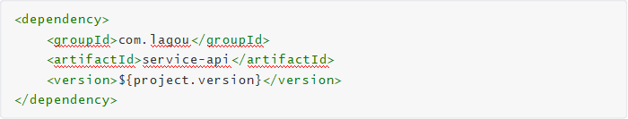
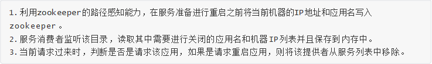
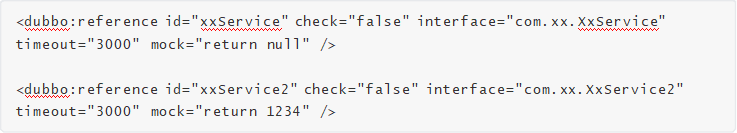
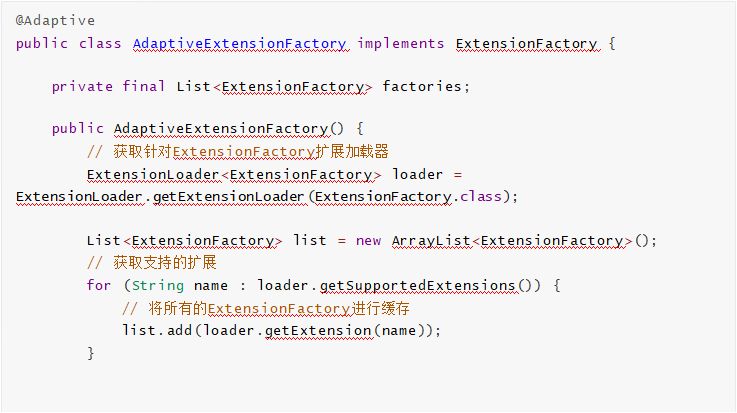
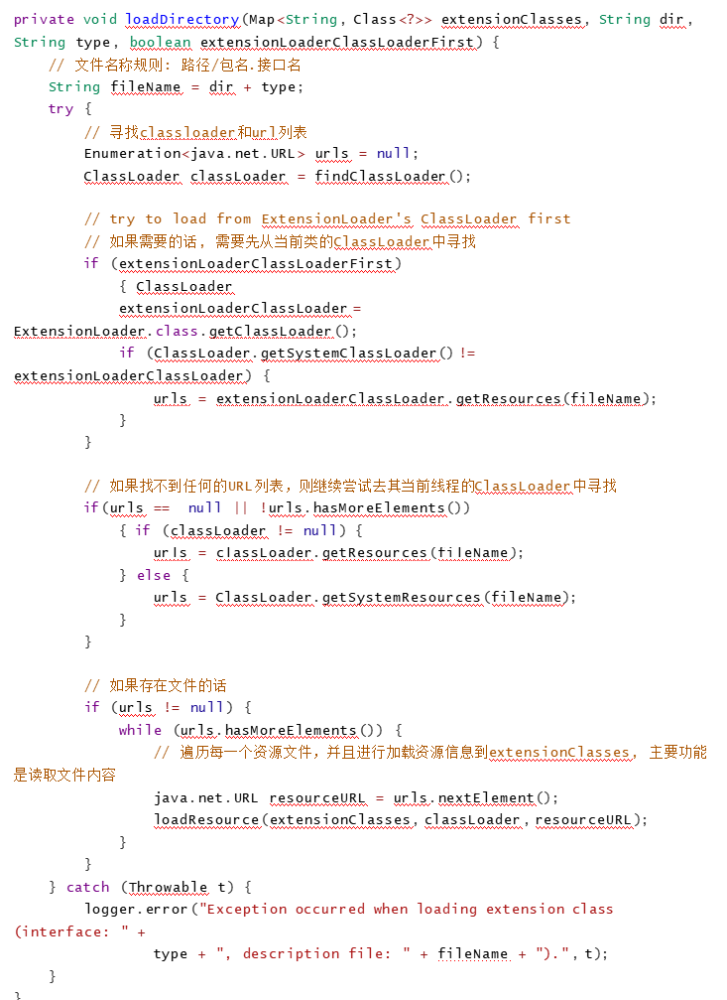
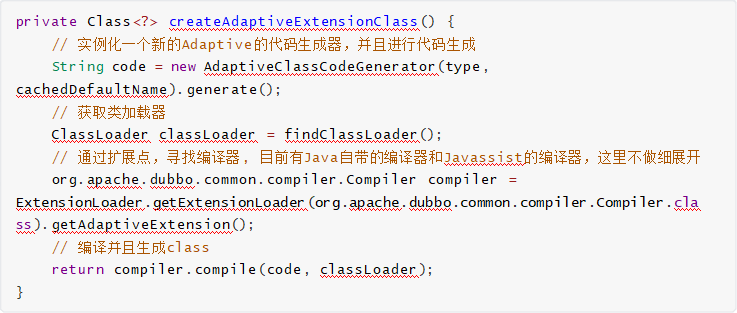
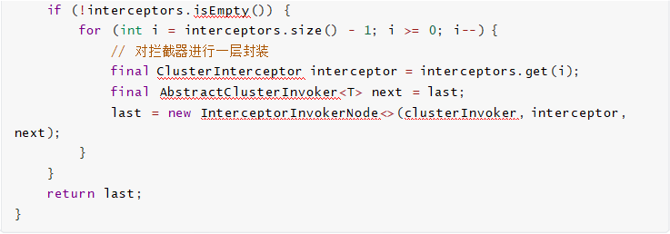

Dubbo源码分析


Dubbo 是一款 高性能的Java RPC 框架

## 主要课程内容

- 第一部分：项目架构演变过程

单体架构 到 微服务架构的演变	拉勾网架构演变

- 第二部分： Dubbo 架构与实战

Dubbo的架构(调用流程 特性) 注册中心 dubbo的开发案例(注解 和 XML) Dubbo的管理控制台Dubbo的相关配置

- 第三部分： Dubbo 高级应用实战

SPI 负载均衡  异步调用  自定义线程池	路由规则 服务降级

- 第四部分： Dubbo 源码分析

Dubbo的整体设计	服务注册与发现的源码剖析 Dubbo扩展SPI分析 集群容器的源码分析	网络通信原理分析


# 第一部分 项目架构演变过程


随着互联网的发展，用户群体逐渐壮大，网站的流量成倍增长，常规的单体架构已无法满足请求压力  暴增和业务的快速迭代，架构的变化势在必行。

## 1、单体架构

单体架构所有模块和功能都集中在一个项目中  ，部署时也是将项目所有功能部整体署到服务器中。如下图：


 

 

- 优点

  - 小项目开发快 成本低架构简单

  - 易于测试易于部署

- 缺点

  - 大项目模块耦合严重 不易开发 维护 沟通成本高新增业务困难

  - 核心业务与边缘业务混合在一块，出现问题互相影响


## 2、垂直架构

根据业务把项目垂直切割成多个项目，因此这种架构称之为垂直架构。

为了避免上面提到的那些问题，我们开始做模块的垂直划分，做垂直划分的原则是基于拉勾的业务特   性，核心目标，第一个是为了业务之间互不影响，第二个是在研发团队的壮大后为了提高效率，减少之  间的依赖。


 

 

- 优点

  - 系统拆分实现了流量分担，解决了并发问题可以针对不同系统进行优化

  - 方便水平扩展，负载均衡，容错率提高

  - 系统间相互独立，互不影响，新的业务迭代时更加高效

- 缺点

  - 服务系统之间接口调用硬编码

  - 搭建集群之后，实现负载均衡比较复杂

  - 服务系统接口调用监控不到位 调用方式不统一服务监控不到位

  - 数据库资源浪费，充斥慢查询，主从同步延迟大

## 3. 分布式架构（SOA )

SOA全称为Service Oriented Architecture，即面向服务的架构 。它是在垂直划分的基础上,将每个项目拆分出多个具备松耦合的服务,一个服务通常以独立的形式存在于操作系统进程中。各个服务之间通过网  络调用，这使得构建在各种各样的系统中的服务可以 以一种统一和通用的方式进行交互。

我们在做了垂直划分以后，模块随之增多，系统之间的RPC逐渐增多，维护的成本也越来越高，一些通  用的业务和模块重复的也越来越多，这个时候上面提到的接口协议不统一、服务无法监控、服务的负载  均衡等问题更加突出，为了解决上面的这些问题，我们将通用的业务逻辑下沉到服务层，通过接口暴   露，供其他业务场景调用。同时引入了阿里巴巴开源的[Dubbo](http://dubbo.apache.org/zh-cn/)，一款高性能、轻量级的开源Java RPC框架，它提供了三大核心能力：面向接口的远程方法调用，智能容错和负载均衡，以及服务自动注册和发  现。


 

 

解释说明:

分层: 按照业务性质分层 每一层要求简单 和 容易维护

应用层: 距离用户最近的一层 也称之为接入层	使用tomcat 作为web容器 接收用户请求 使用下游的dubbo提供的接口来返回数据 并且该层禁止访问数据库

业务服务层:根据具体的业务场景 演变而来的模块 比如 简历投递 职位搜索 职位推荐等基础业务层:拉勾网招聘业务的核心 账号	简历 公司 职位

基础服务层:这一层 是与业务无关的模块 是一些通用的服务

这类服务的特点:请求量大 逻辑简单 特性明显 功能独立消息服务（发邮件 短信 微信）

附件解析 50% 自己上传附件简历 需要解析成pdf

存储层:不同的存储类型 Mysql Mongodb ES fastDFS

分级:按照业务性质分层 同一层的业务也要做好分级 依据业务的重要性进行分级 按照二八定律网站80%的流量 都在核心功能上面 要优先保证核心业务的稳定。

隔离:不同性质 不同重要性的业务做好隔离 包括 业务 缓存 DB 中间件 都要做好隔离 比如 核心业务的数据库 要和活动相关的数据库隔离

调用 :总体上调用要单向 可以跨层调用 但不能出现逆向调用

 

- 优点

  - 服务以接口为粒度，为开发者屏蔽远程调用底层细节	使用Dubbo 面向接口远程方法调用屏蔽了底层调用细节

  - 业务分层以后架构更加清晰 并且每个业务模块职责单一 扩展性更强数据隔离，权限回收，数据访问都通过接口	让系统更加稳定 安全


  - 服务应用本身无状态化	这里的无状态化指的是应用本身不做内存级缓存 而是把数据存入db

  - 服务责任易确定	每个服务可以确定责任人 这样更容易保证服务质量和稳定

- 缺点

  - 粒度控制复杂	如果没有控制好服务的粒度 服务的模块就会越来越多 就会引发 超时 分布式事务等问题

  - 服务接口数量不宜控制 容易引发接口爆炸 所以服务接口建议以业务场景进行单位划分 并对相近的业务做抽象 防止接口爆炸

  - 版本升级兼容困难 尽量不要删除方法 字段 枚举类型的新增字段也可能不兼容

  - 调用链路长 服务质量不可监控	调用链路变长 下游抖动可能会影响到上游业务 最终形成连锁反应 服务质量不稳定 同时链路的变成使得服务质量的监控变得困难

## 4. 微服务架构

微服务架构是一种将单个应用程序  作为一套小型服务开发的方法，每种应用程序都在其自己的进程中独立运行，并使用轻量级机制(通常是HTTP资源的API)进行通信。这些服务是围绕业务功能构建的，可以   通过全自动部署机制进行独立部署。这些服务的集中化管理非常少，它们可以用不同的编程语言编写，  并使用不同的数据存储技术。

微服务是在SOA上做的升华 , 粒度更加细致，微服务架构强调的一个重点是“业务需要彻底的组件化和服务化”。

关于微服务架构的知识,后面Spring Cloud课程中会详细讲解。

 

# 第二部分 Dubbo 架构与实战


## 1、Dubbo 架构概述

### 1.1 什么是Dubbo

Apache Dubbo是一款高性能的Java RPC框架。其前身是阿里巴巴公司开源的一个高性能、轻量级的开源Java RPC框架，可以和Spring框架无缝集成。

### 1.2 Dubbo的特性

参考官网首页	[特性一览](http://dubbo.apache.org/zh-cn/index.html)

### 1.3 Dubbo 的服务治理

服务治理（SOA  governance），企业为了确保项目顺利完成而实施的过程，包括最佳实践、架构原则、治理规程、规律以及其他决定性的因素。服务治理指的是用来管理SOA的采用和实现的过程。

参考官网 [服务治理](http://dubbo.apache.org/zh-cn/docs/user/preface/requirements.html)

 

## 2. Dubbo 处理流程


 

 

节点说明：

 

| 节点 | 角色名称                        |
| -------------- | ----------------------------------------- |
| Provider       | 暴露服务的服务提供方                      |
| Consumer       | 调用远程服务的服务消费方                  |
| Registry       | 服务注册与发现的注册中心                  |
| Monitor        | 统计服务的调用次数和调用时间的监控中心    |
| Container      | 服务运行容器 负责启动 加载 运行服务提供者 |

调用关系说明:

虚线 代表异步调用	实线代表同步访问蓝色虚线 是在启动时完成的功能

红色虚线 是程序运行中执行的功能调用流程:

服务提供者在服务容器启动时 向注册中心 注册自己提供的服务

服务消费者在启动时 向注册中心订阅自己所需的服务

注册中心返回服务提供者地址列表给消费者 如果有变更 注册中心会基于长连接推送变更数据给消费者

服务消费者 从提供者地址列表中 基于软负载均衡算法 选一台提供者进行调用 如果调用失败 则重新选择一台

服务提供者和消费者 在内存中的调用次数 和 调用时间 定时每分钟发送给监控中心

 

## 3、服务注册中心Zookeeper

通过前面的Dubbo架构图可以看到，Registry（服务注册中心）在其中起着至关重要的作用。Dubbo官  方推荐使用Zookeeper作为服务注册中心。Zookeeper 是 Apache Hadoop 的子项目，作为 Dubbo 服务的注册中心，工业强度较高，可用于生产环境，并推荐使用 。

Zookeeper的安装及其使用见上一模块，此处不再赘述。


## 4、Dubbo开发实战

### 4.1 实战案例介绍

在Dubbo中所有的的服务调用都是基于接口去进行双方交互的。双方协定好Dubbo调用中的接口，提  供者来提供实现类并且注册到注册中心上。

调用方则只需要引入该接口，并且同样注册到相同的注册中心上(消费者)。即可利用注册中心来实现集  群感知功能，之后消费者即可对提供者进行调用。

我们所有的项目都是基于Maven去进行创建，这样相互在引用的时候只需要以依赖的形式进行展现就可  以了。

并且这里我们会通过maven的父工程来统一依赖的版本。程序实现分为以下几步骤:

1. 建立maven工程 并且 创建API模块: 用于规范双方接口协定

2. 提供provider模块，引入API模块，并且对其中的服务进行实现。将其注册到注册中心上，对外来 统一提供服务。

3. 提供consumer模块，引入API模块，并且引入与提供者相同的注册中心。再进行服务调用。

### 4.2 开发过程

接口协定

1. 定义maven。


2. 定义接口，这里为了方便，只是写一个基本的方法。


创建接口提供者

 

1. 引入API模块。


2. 引入Dubbo相关依赖，这里为了方便，使用注解方式。


 

3. 编写实现类。注意这里也使用了Dubbo中的@Service 注解来声明他是一个服务的提供者。


 

4. 编写配置文件，用于配置dubbo。比如这里我就叫dubbo-provider.properties ，放入到resources 目录下。


 

dubbo.application.name: 当前提供者的名称

dubbo.protocol.name: 对外提供的时候使用的协议

dubbo.protocol.port: 该服务对外暴露的端口是什么，在消费者使用时，则会使用这个端口并且使用指定的协议与提供者建立连接。

5. 编写启动的main 函数。这里面做的比较简单，主要要注意注解方式中的注册中心这里是使用的本

机2181端口来作为注册中心。


 

创建消费者

1. 引入API模块。


2. 引入Dubbo依赖 ,同服务提供者。

 

3. 编写服务，用于真实的引用dubbo接口并使用。因为这里是示例，所以比较简单一些。这里面@Reference 中所指向的就是真实的第三方服务接口。


 

4. 编写消费者的配置文件。这里比较简单，主要就是指定了当前消费者的名称和注册中心的位置。通  过这个注册中心地址，消费者就会注册到这里并且也可以根据这个注册中心找到真正的提供者列   表。


 

5. 编写启动类，这其中就会当用户在控制台输入了一次换行后，则会发起一次请求。


 

### 4.3 配置方式介绍

下面我们来使用不同的方式来对Dubbo进行配置。每种配置方式各有不同，一般可以分为以下几个。

1. 注解:  基于注解可以快速的将程序配置，无需多余的配置信息，包含提供者和消费者。但是这种方式有一个弊端，有些时候配置信息并不是特别好找，无法快速定位。

2. XML: 一般这种方式我们会和Spring做结合，相关的Service和Reference均使用Spring集成后的。通过这样的方式可以很方便的通过几个文件进行管理整个集群配置。可以快速定位也可以快速更  改。

3. 基于代码方式:  基于代码方式的对上述配置进行配置。这个使用的比较少，这种方式更适用于自己公司对其框架与Dubbo做深度集成时才会使用。

 

### 4.4 XML方式

我们一般XML会结合Spring应用去进行使用，将Service的注册和引用方式都交给Spring去管理。下面我  们还是针对于上面的demo进行实现。

这里我们针对于api模块不做处理，还是使用原先的接口。从提供者和消费者做讲解。这了我们直接通  过spring的方式去做讲解。

provider模块

1. 引入api依赖。


 

2. 引入dubbo依赖。与原先的不同点在于，最后多了spring的依赖引入。


 

3. 编写实现类，不需要引入任何的注解配置。


 

4. 编写dubbo-provider.xml 文件，用于对dubbo进行文件统一配置。并且对刚才的配置进行引入。


 

5. 编写模块启动类。


 

consumer模块

1. 引入api模块。




 

2. 引入dubbo相关。


 

3. 定义spring的配置xml。


 

4. 引入启动模块。因为引用了Spring框架，所以再上一步的helloService会被当做一个bean注入到真  实的环境中。在我们生产级别使用的时候，我们可以通过Spring中的包扫描机制，通过@Autowired 这种机制来进行依赖注入。


 

 

## 5、Dubbo管理控制台 dubbo-admin

### 5.1 作用

主要包含：服务管理 、 路由规则、动态配置、服务降级、访问控制、权重调整、负载均衡等管理功能

如我们在开发时，需要知道Zookeeper注册中心都注册了哪些服务，有哪些消费者来消费这些服务。我  们可以通过部署一个管理中心来实现。其实管理中心就是一个web应用，原来是war(2.6版本以前)包需  要部署到tomcat即可。现在是jar包可以直接通过java命令运行。

### 5.2 控制台安装步骤


### 5.3 使用控制台


 

 

## 6、Dubbo配置项说明


### **6.1** dubbo:application

 

对应 org.apache.dubbo.config.ApplicationConfig, 代表当前应用的信息

1. name: 当前应用程序的名称，在dubbo-admin中我们也可以看到，这个代表这个应用名称。我们在真正时是时也会根据这个参数来进行聚合应用请求。

2. owner: 当前应用程序的负责人，可以通过这个负责人找到其相关的应用列表，用于快速定位到责任人。

3. qosEnable : 是否启动QoS 默认true

4. qosPort : 启动QoS绑定的端口 默认22222

5. qosAcceptForeignIp:	是否允许远程访问 默认是false


### 6.2 dubbo:registry

org.apache.dubbo.config.RegistryConfig,  代表该模块所使用的注册中心。一个模块中的服务可以将其注册到多个注册中心上，也可以注册到一个上。后面再service和reference也会引入这个注册中心。

1. 	id : 当当前服务中provider或者consumer中存在多个注册中心时，则使用需要增加该配置。在一些公司，会通过业务线的不同选择不同的注册中心，所以一般都会配置该值。

2. address : 当前注册中心的访问地址。

3. protocol : 当前注册中心所使用的协议是什么。也可以直接在address 中写入，比如使用zookeeper，就可以写成zookeeper://xx.xx.xx.xx:2181

4. timeout : 当与注册中心不再同一个机房时，大多会把该参数延长。

### 6.3 dubbo:protocol

org.apache.dubbo.config.ProtocolConfig, 指定服务在进行数据传输所使用的协议。

1. id : 在大公司，可能因为各个部门技术栈不同，所以可能会选择使用不同的协议进行交互。这里在多个协议使用时，需要指定。

2. name : 指定协议名称。默认使用dubbo 。


 

### 6.4 dubbo:service

 

org.apache.dubbo.config.ServiceConfig, 用于指定当前需要对外暴露的服务信息，后面也会具体讲解。和dubbo:reference 大致相同。

1. interface : 指定当前需要进行对外暴露的接口是什么。

2. ref : 具体实现对象的引用，一般我们在生产级别都是使用Spring去进行Bean托管的，所以这里面一般也指的是Spring中的BeanId。

3. version : 对外暴露的版本号。不同的版本号，消费者在消费的时候只会根据固定的版本号进行消

费。


 

### 6.5 dubbo:reference

### 

org.apache.dubbo.config.ReferenceConfig, 消费者的配置，这里只做简单说明，后面会具体讲解。


1. id : 指定该Bean在注册到Spring中的id。

2. interface: 服务接口名

3. version : 指定当前服务版本，与服务提供者的版本一致。

4. registry : 指定所具体使用的注册中心地址。这里面也就是使用上面在dubbo:registry 中所声明的id。

 

### **6.6** dubbo:method

 

org.apache.dubbo.config.MethodConfig, 用于在制定的dubbo:service 或者dubbo:reference 中的更具体一个层级，指定具体方法级别在进行RPC操作时候的配置，可以理解为对这上面层级中的配置针  对于具体方法的特殊处理。

1. name : 指定方法名称，用于对这个方法名称的RPC调用进行特殊配置。

2. async: 是否异步 默认false

### 6.7 dubbo:service和dubbo:reference详解

这两个在dubbo中是我们最为常用的部分，其中有一些我们必然会接触到的属性。并且这里会讲到一些  设置上的使用方案。

1. mock: 用于在方法调用出现错误时，当做服务降级来统一对外返回结果，后面我们也会对这个方法做更多的介绍。

2. timeout:  用于指定当前方法或者接口中所有方法的超时时间。我们一般都会根据提供者的时长来具体规定。比如我们在进行第三方服务依赖时可能会对接口的时长做放宽，防止第三方服务不稳定  导致服务受损。

3. check: 用于在启动时，检查生产者是否有该服务。我们一般都会将这个值设置为false，不让其进行检查。因为如果出现模块之间循环引用的话，那么则可能会出现相互依赖，都进行check的话，  那么这两个服务永远也启动不起来。

4. retries: 用于指定当前服务在执行时出现错误或者超时时的重试机制。

1. 注意提供者是否有幂等，否则可能出现数据一致性问题

2. 注意提供者是否有类似缓存机制，如出现大面积错误时，可能因为不停重试导致雪崩

5. executes: 用于在提供者做配置，来确保最大的并行度。

1. 可能导致集群功能无法充分利用或者堵塞

2. 但是也可以启动部分对应用的保护功能

3. 可以不做配置，结合后面的熔断限流使用

### 6.8 其它配置 参考官网

[schema 配置参考手册](http://dubbo.apache.org/zh-cn/docs/user/references/xml/introduction.html)

 

# 第三部分 Dubbo高级实战


## 1、SPI

### 1.1 SPI简介

SPI 全称为 (Service Provider Interface) ，是JDK内置的一种服务提供发现机制。 目前有不少框架用它来做服务的扩展发现，简单来说，它就是一种动态替换发现的机制。使用SPI机制的优势是实现解耦，  使得第三方服务模块的装配控制逻辑与调用者的业务代码分离。


### 1.2 JDK中的SPI


Java中如果想要使用SPI功能，先提供标准服务接口，然后再提供相关接口实现和调用者。这样就可以通  过SPI机制中约定好的信息进行查询相应的接口实现。

SPI遵循如下约定：

1、当服务提供者提供了接口的一种具体实现后，在META-INF/services目录下创建一个以“接口全 限定名”为命名的文件，内容为实现类的全限定名；

2、接口实现类所在的jar包放在主程序的classpath中；

3、主程序通过java.util.ServiceLoader动态装载实现模块，它通过扫描META-INF/services目录下 的配置文件找到实现类的全限定名，把类加载到JVM；

4、SPI的实现类必须携带一个无参构造方法；

 

 

### 1.3 Dubbo中的SPI

dubbo中大量的使用了SPI来作为扩展点，通过实现同一接口的前提下，可以进行定制自己的实现类。  比如比较常见的协议，负载均衡，都可以通过SPI的方式进行定制化，自己扩展。Dubbo中已经存在的  所有已经实现好的扩展点。


 

下图中则是Dubbo中默认提供的负载均衡策略。


### 1.4 Dubbo中扩展点使用方式

我们使用三个项目来演示Dubbo中扩展点的使用方式，一个主项目main，一个服务接口项目api，一个  服务实现项目impl。

api项目创建

（1） 导入坐标 dubbo

（2） 创建接口

在接口上 使用@SPI

 

impl项目创建

（1） 导入 api项目 的依赖

（2） 建立实现类，为了表达支持多个实现的目的，这里分别创建两个实现。分别为

HumanHelloService 和DogHelloService 。

（3） SPI进行声明操作，在resources 目录下创建目录META-INF/dubbo 目录，在目录下创建名称为com.lagou.dubbo.study.spi.demo.api.HelloService的文件，文件内部配置两个实现类名称和对应的全  限定名：


main项目创建

（1） 导入坐标	接口项目 和 实现类项目

（2） 创建DubboSpiMain和原先调用的方式不太相同， dubbo 有对其进行自我重新实现 需要借助ExtensionLoader，创建新的运行项目。这里demo中的示例和java中的功能相同，查询出所有的已知实现，并且调用

（3） dubbo自己做SPI的目的


### 1.5 Dubbo SPI中的Adaptive功能

Dubbo中的Adaptive功能，主要解决的问题是如何动态的选择具体的扩展点。通过getAdaptiveExtension 统一对指定接口对应的所有扩展点进行封装，通过URL的方式对扩展点来进行动态选择。  (dubbo中所有的注册信息都是通过URL的形式进行处理的。)这里同样采用相同的方式进行实现。

（1） 创建接口


api中的 HelloService 扩展如下方法, 与原先类似，在sayHello中增加 Adaptive 注解，并且在参数中提供URL参数.注意这里的URL参数的类为 org.apache.dubbo.common.URL

其中@SP可以指定一个字符串参数，用于指明该SPI的默认实现。

（2） 创建实现类

与上面Service实现类代码相似，只需增加URL形参即可

（3） 编写DubboAdaptiveMain


最后在获取的时候方式有所改变，需要传入URL参数，并且在参数中指定具体的实现类参数 如:


注意：

因为在这里只是临时测试，所以为了保证URL规范，前面的信息均为测试值即可，关键的点在于hello.service 参数，这个参数的值指定的就是具体的实现方式。关于为什么叫hello.service 是因为这个接口的名称，其中后面的大写部分被dubbo自动转码为. 分割。

通过getAdaptiveExtension 来提供一个统一的类来对所有的扩展点提供支持(底层对所有的扩展点进行封装)。

调用时通过参数中增加URL 对象来实现动态的扩展点使用。

如果URL没有提供该参数，则该方法会使用默认在 SPI 注解中声明的实现。

 

 

### 1.6 Dubbo调用时拦截操作

与很多框架一样，Dubbo也存在拦截（过滤）机制，可以通过该机制在执行目标程序前后执行我们指定  的代码。

Dubbo的Filter机制，是专门为服务提供方和服务消费方调用过程进行拦截设计的，每次远程方法执

行，该拦截都会被执行。这样就为开发者提供了非常方便的扩展性，比如为dubbo接口实现ip白名单功  能、监控功能 、日志记录等。

步骤如下：

（1） 实现org.apache.dubbo.rpc.Filter 接口

（2） 使用org.apache.dubbo.common.extension.Activate 接口进行对类进行注册 通过group 可以指定生产端 消费端 如:


 

（3） 计算方法运行时间的代码实现


（4）在META-INF.dubbo 中新建org.apache.dubbo.rpc.Filter 文件，并将当前类的全名写入


 

注意：一般类似于这样的功能都是单独开发依赖的，所以再使用方的项目中只需要引入依赖，在调用接  口时，该方法便会自动拦截。

 

## 2、负载均衡策略

### 2.1 负载均衡基本配置

负载均衡（Load Balance）, 其实就是将请求分摊到多个操作单元上进行执行，从而共同完成工作任务。

负载均衡策略主要用于客户端存在多个提供者时进行选择某个提供者。

在集群负载均衡时，Dubbo 提供了多种均衡策略（包括随机、轮询、最少活跃调用数、一致性

Hash），缺省为random随机调用。

这块儿主要是来自于[官方文档](http://dubbo.apache.org/zh-cn/docs/user/demos/loadbalance.html)，已经写得很详细了

配置负载均衡策略，既可以在服务提供者一方配置，也可以在服务消费者一方配置，如下：


 


 

 

### 2.2 自定义负载均衡器

负载均衡器在Dubbo中的SPI接口是org.apache.dubbo.rpc.cluster.LoadBalance , 可以通过实现这个接口来实现自定义的负载均衡规则。

（1） 自定义负载均衡器

在上一节的案例基础上创建名称为dubbo-spi-loadbalance的Maven模块，并创建负载均衡器

OnlyFirstLoadbalancer。这里功能只是简单的选取所有机器中的第一个(按照字母排序 + 端口排序)。

（2） 配置负载均衡器

在dubbo-spi-loadbalance工程的META-INF/dubbo 目录下新建org.apache.dubbo.rpc.cluster.LoadBalance 文件，并将当前类的全名写入


 

（3） 在服务提供者工程实现类中编写用于测试负载均衡效果的方法 启动不同端口时 方法返回的信息不同

（4） 启动多个服务 要求他们使用同一个接口注册到同一个注册中心 但是他们的dubbo通信端口不同


（5） 在服务消费方指定自定义负载均衡器 onlyFirst

（6） 测试自定义负载均衡的效果

 

 

 

## 3、异步调用

Dubbo不只提供了堵塞式的的同步调用，同时提供了异步调用的方式。这种方式主要应用于提供者接口  响应耗时明显，消费者端可以利用调用接口的时间去做一些其他的接口调用,利用Future 模式来异步等待和获取结果即可。这种方式可以大大的提升消费者端的利用率。  目前这种方式可以通过XML的方式进行引入。

### 3.1 异步调用实现

（1） 为了能够模拟等待，通过 int timeToWait参数，标明需要休眠多少毫秒后才会进行返回。


 

（2） 接口实现 为了模拟调用耗时 可以让线程等待一段时间

（3） 在消费者端，配置异步调用  注意消费端默认超时时间1000毫秒  如果提供端耗时大于1000毫秒会出现超时

可以通过改变消费端的超时时间 通过timeout属性设置即可单位毫秒


（4）测试，我们休眠100毫秒，然后再去进行获取结果。方法在同步调用时的返回值是空，我们可以通过RpcContext.getContext().getFuture() 来进行获取Future对象来进行后续的结果等待操作。

### 3.2 异步调用特殊说明

需要特别说明的是，该方式的使用，请确保dubbo的版本在2.5.4及以后的版本使用。 原因在于在2.5.3 及之前的版本使用的时候，会出现异步状态传递问题。

比如我们的服务调用关系是A -> B -> C , 这时候如果A向B发起了异步请求，在错误的版本时，B向C发起的请求也会连带的产生异步请求。这是因为在底层实现层面，他是通过RPCContext 中的attachment 实现的。在A向B发起异步请求时，会在attachment 中增加一个异步标示字段来表明异步等待结果。B在接受到A中的请求时，会通过该字段来判断是否是异步处理。但是由于值传递问题，B向  C发起时同样会将该值进行传递，导致C误以为需要异步结果，导致返回空。这个问题在2.5.4及以后的  版本[进行了修正](https://github.com/apache/dubbo/blob/47ee52d122fb6f0462ed99530cfe462c591feac8/dubbo-rpc/dubbo-rpc-api/src/main/java/org/apache/dubbo/rpc/filter/ContextFilter.java#L70-L71)。

 

## 4、线程池

### 4.1 Dubbo已有线程池

dubbo在使用时，都是通过创建真实的业务线程池进行操作的。目前已知的线程池模型有两个和java中  的相互对应:


fix:  表示创建固定大小的线程池。也是Dubbo默认的使用方式，默认创建的执行线程数为200，并且是没有任何等待队列的。所以再极端的情况下可能会存在问题，比如某个操作大量执行时，可能  存在堵塞的情况。后面也会讲相关的处理办法。

)cache:  创建非固定大小的线程池，当线程不足时，会自动创建新的线程。但是使用这种的时候需要注意，如果突然有高TPS的请求过来，方法没有及时完成，则会造成大量的线程创建，对系统的CPU和负载都是压力，执行越多反而会拖慢整个系统。

### 4.2 自定义线程池

在真实的使用过程中可能会因为使用fix模式的线程池，导致具体某些业务场景因为线程池中的线程数量  不足而产生错误，而很多业务研发是对这些无感知的，只有当出现错误的时候才会去查看告警或者通过  客户反馈出现严重的问题才去查看，结果发现是线程池满了。所以可以在创建线程池的时，通过某些手  段对这个线程池进行监控，这样就可以进行及时的扩缩容机器或者告警。下面的这个程序就是这样子   的，会在创建线程池后进行对其监控，并且及时作出相应处理。

（1） 线程池实现, 这里主要是基于对FixedThreadPool 中的实现做扩展出线程监控的部分

```java
public class WatchingThreadPool extends FixedThreadPool implements Runnable { private static final Logger LOGGER =

LoggerFactory.getLogger(WatchingThreadPool.class);

 

 

private static final double ALARM_PERCENT = 0.90;

private final Map<URL, ThreadPoolExecutor> THREAD_POOLS = new ConcurrentHashMap<>();

public WatchingThreadPool() {

// 每隔3秒打印线程使用情况

Executors.newSingleThreadScheduledExecutor()

.scheduleWithFixedDelay(this, 1,3, TimeUnit.SECONDS);

}

 

 

@Override

public Executor getExecutor(URL url) {

// 从父类中创建线程池

final Executor executor = super.getExecutor(url); if (executor instanceof ThreadPoolExecutor) {

THREAD_POOLS.put(url, ((ThreadPoolExecutor) executor));

}

return executor;

}

 

@Override

public void run() {

// 遍历线程池，如果超出指定的部分，进行操作，比如接入公司的告警系统或者短信平台

for (Map.Entry<URL, ThreadPoolExecutor> entry : THREAD_POOLS.entrySet())

{

final URL url = entry.getKey();

final ThreadPoolExecutor executor = entry.getValue();

 

// 当前执行中的线程数

final int activeCount = executor.getActiveCount();

// 总计线程数

final int poolSize = executor.getCorePoolSize();

usedNum);

double used = (double)activeCount / poolSize; final int usedNum = (int) (used * 100);

LOGGER.info("线程池执行状态:[{}/{}]:{}%", activeCount, poolSize,


```


 

（2）SPI声明，创建文件META-INF/dubbo/org.apache.dubbo.common.threadpool.ThreadPool


（3） 在服务提供方项目引入该依赖

（4） 在服务提供方项目中设置使用该线程池生成器


（5） 接下来需要做的就是模拟整个流程，因为该线程当前是每1秒抓一次数据，所以我们需要对该方法  的提供者超过1秒的时间(比如这里用休眠Thread.sleep )，消费者则需要启动多个线程来并行执行，来模拟整个并发情况。

（6） 在调用方则尝试简单通过for循环启动多个线程来执行 查看服务提供方的监控情况

 

## 5、路由规则

路由是决定一次请求中需要发往目标机器的重要判断，通过对其控制可以决定请求的目标机器。我们可  以通过创建这样的规则来决定一个请求会交给哪些服务器去处理。

### 5.1 路由规则快速入门

（1） 提供两个提供者(一台本机作为提供者，一台为其他的服务器)，每个提供者会在调用时可以返回不  同的信息 以区分提供者。

（2） 针对于消费者，我们这里通过一个死循环，每次等待用户输入，再进行调用，来模拟真实的请求  情况。

通过调用的返回值 确认具体的提供者。

（3） 我们通过ipconfig来查询到我们的IP地址，并且单独启动一个客户端，来进行如下配置(这里假设  我们希望隔离掉本机的请求，都发送到另外一台机器上)。


 

（4） 通过这个程序执行后，我们就通过消费端不停的发起请求，看到真实的请求都发到了除去本机以  外的另外一台机器上。

 

### 5.2 路由规则详解

通过上面的程序，我们实际本质上就是通过在zookeeper中保存一个节点数据，来记录路由规则。消费  者会通过监听这个服务的路径，来感知整个服务的路由规则配置，然后进行适配。这里主要介绍路由配  置的参数。具体请[参考文档](http://dubbo.apache.org/zh-cn/docs/user/demos/routing-rule-deprecated.html), 这里只对关键的参数做说明。

 

表示路由规则的类型，支持条件路由规则和脚本路由规则，可扩展，必填。 表示对所有 IP 地址生效，如果只想对某个 IP 的生效，请填入具体 IP，必填。

表示只对指定服务生效，必填。表示该数据为动态配置类型，必填。

dynamic : 是否为持久数据，当指定服务重启时是否继续生效。必填。

runtime : 是否在设置规则时自动缓存规则，如果设置为true则会影响部分性能。

rule : 是整个路由最关键的配置，用于配置路由规则。

... => ... 在这里=> 前面的就是表示消费者方的匹配规则，可以不填(代表全部)。=> 后方则必须填写，表示当请求过来时，如果选择提供者的配置。官方这块儿也给出了详细的示例，可以按照  那里来讲。

其中使用最多的便是host 参数。 必填。

### 5.3 路由与上线系统结合

当公司到了一定的规模之后，一般都会有自己的上线系统，专门用于服务上线。方便后期进行维护和记 录的追查。我们去想象这样的一个场景，一个dubbo的提供者要准备进行上线，一般都提供多台提供者  来同时在线上提供服务。这时候一个请求刚到达一个提供者，提供者却进行了关闭操作。那么此次请求 就应该认定为失败了。所以基于这样的场景，我们可以通过路由的规则，把预发布(灰度)的机器进行从  机器列表中移除。并且等待一定的时间，让其把现有的请求处理完成之后再进行关闭服务。同时，在启 动时，同样需要等待一定的时间，以免因为尚未重启结束，就已经注册上去。等启动到达一定时间之   后，再进行开启流量操作。

实现主体思路





（1）引入Curator 框架，用于方便操作Zookeeper

（2）编写Zookeeper的操作类，用于方便进行zookeeper处理

（3）编写需要进行预发布的路径管理器，用于缓存和监听所有的待灰度机器信息列表。

（4）编写路由类(实现org.apache.dubbo.rpc.cluster.Router )，主要目的在于对ReadyRestartInstances 中的数据进行处理，并且移除路由调用列表中正在重启中的服务。

（5）由于Router 机制比较特殊，所以需要利用一个专门的RouterFactory 来生成，原因在于并不是所有的都需要添加路由，所以需要利用@Activate 来锁定具体哪些服务才需要生成使用。


（6）对RouterFactory 进行注册，同样放入到META-INF/dubbo/org.apache.dubbo.rpc.cluster.RouterFactory 文件中。


 

（7）将dubbo-spi-router项目引入至consumer 项目的依赖中。

（8）这时直接启动程序，还是利用上面中所写好的consumer 程序进行执行，确认各个provider 可以正常执行。

（9）单独写一个main 函数来进行将某台实例设置为启动中的状态，比如这里我们认定为当前这台机器中的service-provider 这个提供者需要进行重启操作。


 

（10）执行完成后，再次进行尝试通过 consumer 进行调用，即可看到当前这台机器没有再发送任何请求

（11）一般情况下，当机器重启到一定时间后，我们可以再通过 removeRestartingInstance 方法对这个机器设定为既可以继续执行。

（12）调用完成后，我们再次通过 consumer 去调用，即可看到已经再次恢当前机器的请求参数。

 

## 6、服务动态降级

### 6.1 什么是服务降级

服务降级，当服务器压力剧增的情况下，根据当前业务情况及流量对一些服务有策略的降低服务级别，  以释放服务器资源，保证核心任务的正常运行。

### 6.2 为什么要服务降级


而为什么要使用服务降级，这是防止分布式服务发生雪崩效应，什么是雪崩？就是蝴蝶效应，当一个请  求发生超时，一直等待着服务响应，那么在高并发情况下，很多请求都是因为这样一直等着响应，直到  服务资源耗尽产生宕机，而宕机之后会导致分布式其他服务调用该宕机的服务也会出现资源耗尽宕机，  这样下去将导致整个分布式服务都瘫痪，这就是雪崩。

### 6.3 dubbo 服务降级实现方式

第一种 在 dubbo 管理控制台配置服务降级屏蔽和容错

mock=force:return+null

表示消费方对该服务的方法调用都直接返回 null 值，不发起远程调用。用来屏蔽不重要服务不可用时对调用方的影响。

mock=fail:return+null

表示消费方对该服务的方法调用在失败后，再返回 null 值，不抛异常。用来容忍不重要服务不稳定时对调用方的影响。


第二种 指定返回简单值或者null





 

如果是标注 则使用@Reference(mock="return null") @Reference(mock="return 简单值") 也支持 @Reference(mock="force:return null")

第三种 使用java代码 动态写入配置中心


第四种 整合整合 hystrix 会在后期SpringCloud课程中详细讲解


# 第四部分 Dubbo源码剖析


## 1、源码下载和编译

源码下载、编译和导入步骤如下：

（1）dubbo的项目在github中的地址为: https://github.com/apache/dubbo

（2）进入需要进行下载的地址，执行git clone https://github.com/apache/dubbo.git

（3）为了防止master中代码不稳定，进入dubbo项目 cd dubbo 可以切入到最近的release分支git checkout 2.7.6-release

（4）进行本地编译，进入dubbo项目cd dubbo , 进行编译操作mvn clean install -DskipTests

（5）使用IDE引入项目。

 

## 2、架构整体设计

### 2.1 Dubbo调用关系说明


在这里主要由四部分组成:

Provider: 暴露服务的服务提供方

Protocol 负责提供者和消费者之间协议交互数据Service 真实的业务服务信息 可以理解成接口 和 实现Container Dubbo的运行环境

Consumer: 调用远程服务的服务消费方

Protocol 负责提供者和消费者之间协议交互数据

Cluster 感知提供者端的列表信息

Proxy	可以理解成 提供者的服务调用代理类 由它接管 Consumer中的接口调用逻辑Registry: 注册中心，用于作为服务发现和路由配置等工作，提供者和消费者都会在这里进行注册Monitor: 用于提供者和消费者中的数据统计，比如调用频次，成功失败次数等信息。


启动和执行流程说明:

提供者端启动 容器负责把Service信息加载 并通过Protocol 注册到注册中心

消费者端启动 通过监听提供者列表来感知提供者信息 并在提供者发生改变时 通过注册中心及时通知消费端

消费方发起 请求	通过Proxy模块

利用Cluster模块 来选择真实的要发送给的提供者信息交由Consumer中的Protocol 把信息发送给提供者

提供者同样需要通过 Protocol 模块来处理消费者的信息最后由真正的服务提供者 Service 来进行处理

 

 

### 2.2 整体的调用链路


说明	淡绿色代表了 服务生产者的范围	淡蓝色 代表了服务消费者的范围 红色箭头代表了调用的方向

业务逻辑层	RPC层(远程过程调用)	Remoting (远程数据传输)

整体链路调用的流程:

1. 消费者通过Interface进行方法调用 统一交由消费者端的 Proxy 通过ProxyFactory 来进行代理对象的创建 使用到了 jdk javassist技术


2. 交给Filter 这个模块 做一个统一的过滤请求 在SPI案例中涉及过

3. 接下来会进入最主要的Invoker调用逻辑

通过Directory 去配置中新读取信息 最终通过list方法获取所有的Invoker 通过Cluster模块 根据选择的具体路由规则 来选取Invoker列表

通过LoadBalance模块 根据负载均衡策略 选择一个具体的Invoker 来处理我们的请求如果执行中出现错误 并且Consumer阶段配置了重试机制 则会重新尝试执行

4. 继续经过Filter 进行执行功能的前后封装 Invoker 选择具体的执行协议

5. 客户端 进行编码和序列化 然后发送数据

6. 到达Consumer中的 Server 在这里进行 反编码 和 反序列化的接收数据

7. 使用Exporter选择执行器

8. 交给Filter 进行一个提供者端的过滤 到达 Invoker 执行器

9. 通过Invoker 调用接口的具体实现 然后返回

 

### 2.3 Dubbo源码整体设计


 

图例说明：

图中左边淡蓝背景的为服务消费方使用的接口，右边淡绿色背景的为服务提供方使用的接口，位于  中轴线上的为双方都用到的接口。


图中从下至上分为十层，各层均为单向依赖，右边的黑色箭头代表层之间的依赖关系，每一层都可  以剥离上层被复用，其中，Service 和 Config 层为 API，其它各层均为 SPI。

图中绿色小块的为扩展接口，蓝色小块为实现类，图中只显示用于关联各层的实现类。

图中蓝色虚线为初始化过程，即启动时组装链，红色实线为方法调用过程，即运行时调时链，紫色  三角箭头为继承，可以把子类看作父类的同一个节点，线上的文字为调用的方法。

 

Dubbo源码整体设计与调用链路十分相似。只不过这里可以看到接口的一些具体实现以及左侧也  有更为详细的层次划分，我们在后面的源码解析时也会着重介绍其中比较重要的模块实现。

 

分层介绍:

Business 业务逻辑层

service 业务层 包括我们的业务代码 比如 接口 实现类 直接面向开发者

RPC层 远程过程调用层

config 配置层	对外提供配置 以ServiceConfig ReferenceConfig 为核心 可以直接初始化配置类 也可以解析配置文件生成

proxy 服务代理层 无论是生产者 还是消费者 框架都会产生一个代理类 整个过程对上层透明 就是业务层对远程调用无感

registry 注册中心层	封装服务地址的注册与发现	以服务的URL为中心

cluster 路由层 (集群容错层) 提供了多个提供者的路由和负载均衡 并且它桥接注册中心 以

Invoker为核心

monitor 监控层 RPC调用相关的信息 如 调用次数 成功失败的情况 调用时间等 在这一层完成

protocol 远程调用层 封装RPC调用 无论是服务的暴露 还是 服务的引用 都是在Protocol中作为主功能入口 负责Invoker的整个生命周期 Dubbo中所有的模型都向Invoker靠拢

Remoting层 远程数据传输层

exchange 信息交换层 封装请求和响应的模式 如把请求由同步 转换成异步

transport 网络传输层	统一网络传输的接口 比如 netty 和 mina 统一为一个网络传输接口

serialize 数据序列化层 负责管理整个框架中的数据传输的序列化 和反序列化

 

## 3、服务注册与消费源码剖析

### 3.1 注册中心Zookeeper剖析

注册中心是Dubbo的重要组成部分，主要用于服务的注册与发现，我们可以选择Redis、Nacos、

Zookeeper作为Dubbo的注册中心，Dubbo推荐用户使用Zookeeper作为注册中心。

注册中心Zookeeper目录结构

我们使用一个最基本的服务的注册与消费的Demo来进行说明。

例如：只有一个提供者和消费者。 com.lagou.service.HelloService 为我们所提供的服务。


则Zookeeper的目录结构如下：


可以在这里看到所有的都是在dubbo层级下的

dubbo跟节点下面是当前所拥有的接口名称，如果有多个接口，则会以多个子节点的形式展开 每个服务下面又分别有四个配置项

 

consumers: 当前服务下面所有的消费者列表(URL) providers: 当前服务下面所有的提供者列表(URL)

configuration: 当前服务下面的配置信息信息，provider或者consumer会通过读取这里的配置信息来获取配置

routers:  当消费者在进行获取提供者的时，会通过这里配置好的路由来进行适配匹配规则。可以看到，dubbo基本上很多时候都是通过URL的形式来进行交互获取数据的，在URL中也会保存  很多的信息。后面也会对URL的规则做详细介绍。


 

通过这张图我们可以了解到如下信息:


提供者会在providers 目录下进行自身的进行注册。

消费者会在consumers 目录下进行自身注册，并且监听provider 目录，以此通过监听提供者增加或者减少，实现服务发现。

Monitor模块会对整个服务级别做监听，用来得知整体的服务情况。以此就能更多的对整体情况做  监控。

 

 

### 3.2 服务的注册过程分析

服务注册(暴露)过程


 

首先类拿到对外提供服务的实际类 ref(如：HelloServiceImpl),然后通过

接口实现类中的到这一步就完成具体服务到

方法使用 ref 生成一个的转化。接下来就是


转换到

实例， 的过程。

查看ServiceConfig 类

重点查看 ProxyFactory 和 Protocol 类型的属性 以及 ref


下面我们就看一下Invoker 转换成 Exporter的过程其中会涉及到 RegistryService接口


接口 和 注册provider到注册中心流程的过程


（1） RegistryService代码解读,这块儿的代码比较简单，主要是对指定的路径进行注册，解绑，监听和  取消监听，查询操作。也是注册中心中最为基础的类。


 

（2）我们再来看RegistryFactory ，是通过他来生成真实的注册中心。通过这种方式，也可以保证一个应用中可以使用多个注册中心。可以看到这里也是通过不同的protocol参数，来选择不同的协议。


 

（3）下面我们就来跟踪一下，一个服务是如何注册到注册中心上去的。其中比较关键的一个类是RegistryProtocol ，他负责管理整个注册中心相关协议。并且统一对外提供服务。这里我们主要以RegistryProtocol.export 方法作为入口，这个方法主要的作用就是将我们需要执行的信息注册并且导出。


```java
// 获取当前提供者需要注册的地址

// dubbo://192.168.1.102:20880/com.lagou.service.HelloService? anyhost=true&application=dubbo-demo-annotation- provider&bind.ip=192.168.1.102&bind.port=20880&deprecated=false&dubbo=2.0.2&dyna mic=true&generic=false&interface=com.lagou.service.HelloService&methods=sayHello

,sayHelloWithPrint,sayHelloWithTransmission,sayHelloWithException&pid=30998&rele ase=2.7.5&side=provider&telnet=clear,exit,help,status,log,ls,ps,cd,pwd,invoke,tr ace,count,select,shutdown×tamp=1583906801486

URL providerUrl = getProviderUrl(originInvoker);

 

// 获取进行注册override协议的访问地址

// provider://192.168.1.102:20880/com.lagou.service.HelloService? anyhost=true&application=dubbo-demo-annotation- provider&bind.ip=192.168.1.102&bind.port=20880&category=configurators&check=fals e&deprecated=false&dubbo=2.0.2&dynamic=true&generic=false&interface=com.lagou.se rvice.HelloService&methods=sayHello,sayHelloWithPrint,sayHelloWithTransmission,s ayHelloWithException&pid=30998&release=2.7.5&side=provider&telnet=clear,exit,hel p,status,log,ls,ps,cd,pwd,invoke,trace,count,select,shutdown×tamp=158390680 1486

final URL overrideSubscribeUrl = getSubscribedOverrideUrl(providerUrl);

// 增加override的监听器

final OverrideListener overrideSubscribeListener = new OverrideListener(overrideSubscribeUrl, originInvoker);

overrideListeners.put(overrideSubscribeUrl, overrideSubscribeListener);

 

// 根据现有的override协议，对注册地址进行改写操作

providerUrl = overrideUrlWithConfig(providerUrl, overrideSubscribeListener);

// 对当前的服务进行本地导出

// 完成后即可在看到本地的20880端口号已经启动，并且暴露服务

final ExporterChangeableWrapper<T> exporter = doLocalExport(originInvoker, providerUrl);

 

// 获取真实的注册中心, 比如我们常用的ZookeeperRegistry final Registry registry = getRegistry(originInvoker);

//  获取当前服务需要注册到注册中心的providerURL，主要用于去除一些没有必要的参数(比如在本地导出时所使用的qos参数等值)

// dubbo://192.168.1.102:20880/com.lagou.service.HelloService? anyhost=true&application=dubbo-demo-annotation- provider&deprecated=false&dubbo=2.0.2&dynamic=true&generic=false&interface=com.l agou.service.HelloService&methods=sayHello,sayHelloWithPrint,sayHelloWithTransmi ssion,sayHelloWithException&pid=30998&release=2.7.5&side=provider&telnet=clear,e xit,help,status,log,ls,ps,cd,pwd,invoke,trace,count,select,shutdown×tamp=15 83906801486

final URL registeredProviderUrl = getUrlToRegistry(providerUrl, registryUrl);

// 获取当前url是否需要进行注册参数

boolean register = providerUrl.getParameter(REGISTER_KEY, true); if (register) {

// 将当前的提供者注册到注册中心上去

register(registryUrl, registeredProviderUrl);

}

 

//  对override协议进行注册，用于在接收到override请求时做适配,这种方式用于适配2.6.x及之前的版本(混用)

registry.subscribe(overrideSubscribeUrl, overrideSubscribeListener);

 

// 设置当前导出中的相关信息

exporter.setRegisterUrl(registeredProviderUrl);

```


 

（4）下面我们再来看看register 方法, 这里面做的比较简单，主要是从RegistoryFactory 中获取注册中心，并且进行地址注册。


（5） 这里我们再跟里面的register方法之前，先来介绍一下Registry中的类目录结构


| \|   | \|   | \|   | \|   | +-   | ZookeeperRegistry |
| ---- | ---- | ---- | ---- | ---- | ----------------- |
| \|   | \|   | \|   | \|   | +-   | NacosRegistry     |
| \|   | \|   | \|   | \|   | +-   | ...               |

 

目录结构描述如下：

在这里每个层级代表继承自父级

这里面RegistryService 就是我们之前所讲对外提供注册机制的接口。

其下面Registry 也同样是一个接口，是对RegistryService 的集成，并且继承了Node 接口， 说明注册中心也是基于URL去做的。

AbstractRegistry 是对注册中心的封装，其主要会对本地注册地址的封装，主要功能在于远程

注册中心不可用的时候，可以采用本地的注册中心来使用。

FailbackRegistry 从名字中可以看出来，失败自动恢复，后台记录失败请求，定时重发功能。最深的一层则更多是真实的第三方渠道实现。

 

（6）下面我们来看一下在FailbackRegistry 中的实现, 可以在这里看到他的主要作用是调用第三方的实现方式，并且在出现错误时增加重试机制。


 


 

（7）下面我们再来看看Zookeeper中 doRegister 方法的实现, 可以看到这里的实现也比较简单，关键在于toUrlPath 方法的实现。关于dynamic 的值，我们也在上面有看到，他的URL也是true的。


（8）解读toUrlPath 方法。可以看到这里的实现也是比较简单，也验证了我们之前的路径规则。


  


 

 

### 3.3 URL规则详解 和 服务本地缓存

3.3.1 URL规则详解

URL地址如下：


URL主要有以下几部分组成：

protocol: 协议，一般像我们的provider 或者consumer 在这里都是人为具体的协议

host: 当前provider 或者其他协议所具体针对的地址，比较特殊的像override 协议所指定的

host就是 0.0.0.0 代表所有的机器都生效

port: 和上面相同，代表所处理的端口号

path: 服务路径，在provider 或者consumer 等其他中代表着我们真实的业务接口

key=value: 这些则代表具体的参数，这里我们可以理解为对这个地址的配置。比如我们provider

中需要具体机器的服务应用名，就可以是一个配置的方式设置上去。

注意：Dubbo中的URL与java中的URL是有一些区别的，如下：

这里提供了针对于参数的parameter 的增加和减少(支持动态更改) 提供缓存功能，对一些基础的数据做缓存.


3.3.2 服务本地缓存

在上面我们有讲到dubbo有对路径进行本地缓存操作。这里我们就对本地缓存进行讲解。

dubbo调用者需要通过注册中心（例如：ZK）注册信息，获取提供者，但是如果频繁往从ZK获取信  息，肯定会存在单点故障问题，所以dubbo提供了将提供者信息缓存在本地的方法。

Dubbo在订阅注册中心的回调处理逻辑当中会保存服务提供者信息到本地缓存文件当中（同步/异步两  种方式），以URL纬度进行全量保存。

Dubbo在服务引用过程中会创建registry对象并加载本地缓存文件，会优先订阅注册中心，订阅注册中  心失败后会访问本地缓存文件内容获取服务提供信息。


（1） 首先从构造方法讲起,  这里方法比较简单，主要用于确定需要保存的文件信息。并且从系统中读取已有的配置信息。


（2）我们可以看到这个类中最为关键的一个属性为properties ，我们可以通过寻找，得知这个属性的设置值只有在一个地方: saveProperties ，我们来看一下这个方法。这里也有一个我们值得关注的点，就是基于版本号的的更改。


 

 

（3） 下面我们再来看看是如何进行保存文件的。这里的实现也比较简单，主要比较关键的代码在于利  用文件级锁来保证同一时间只会有一个线程执行。


 

 

### 3.4 Dubbo 消费过程分析

服务消费流程


 


首先类的方法调用 createProxy() ,期间 使用Protocol 调用方法生成实例(如上图中的红色部分)，这是服务消费的关键。接下来使用ProxyFactory把转换为客户端需要的接口(如：HelloService)。

 

 

## 4、Dubbo扩展SPI源码剖析

SPI在之前都有使用过，其中最重要的类就是ExtensionLoader ，它是所有Dubbo中SPI的入口。


我们通过分析源码来学习ExtensionLoader 是怎么加载的。这里会具体介绍org.apache.dubbo.common.extension.ExtensionLoader.getExtensionLoader 和org.apache.dubbo.common.extension.ExtensionLoader.getExtension 方法。

getExtensionLoader	获取扩展点加载器 并加载所对应的所有的扩展点实现

getExtension 根据name 获取扩展的指定实现

### 4.1 getExtensionLoader 加载过程

（1）是如何进行实例化ExtensionLoader 的

```java
private static <T> boolean withExtensionAnnotation(Class<T> type) {

// 包含`@SPI`注解在接口上

return type.isAnnotationPresent(SPI.class);

}

public static <T> ExtensionLoader<T> getExtensionLoader(Class<T> type) { @SuppressWarnings("unchecked")

// 必须传入类型
if (type == null) {

throw new IllegalArgumentException("Extension type	null");

}

// 必须是接口类型

if (!type.isInterface()) {

throw new IllegalArgumentException("Extension type (" + type + ") is not an interface!");

}

// 必须包含SPI的注解

if (!withExtensionAnnotation(type)) {

throw new IllegalArgumentException("Extension type (" + type +

") is not an extension, because it is NOT annotated with @" + SPI.class.getSimpleName() + "!");

}
// 尝试从已经加载过的数据中去读取(缓存功能) ExtensionLoader<T> loader = (ExtensionLoader<T>)

EXTENSION_LOADERS.get(type);

if (loader == null) {

// 如果没有的话，才会进行初始化，并且放入到缓存汇总EXTENSION_LOADERS.putIfAbsent(type, new ExtensionLoader<T>(type)); loader = (ExtensionLoader<T>) EXTENSION_LOADERS.get(type);

}

return loader;

}

```

（2）具体看一下ExtensionLoader 的构造器函数,  这里他的实现比较简单，并没有做太多的操作。主要是对type进行赋值操作，然后获取 ExtensionFactory 对象。


 

（3）具体再来关注一下ExtensionFactory 是做什么用的, 从这里我们可以大概的看出来，他是通过传入扩展点类型和真正的名称来获取扩展的。这里就和我们SPI中的具体名称实现相挂钩。


 

（4）可 以 在 dubbo-common/src/main/resources/META- INF/dubbo/internal/org.apache.dubbo.common.extension.ExtensionFactory 中看到，他默认有三个实现的提供


 

（5）可以看到在AdaptiveExtensionFactory 中是使用@Adaptive 标记的。这里可以通过类名基本看出来，他其实最主要的作用是进行代理其他的ExtensionFactory。其中比较重要的方法在于getSupportedExtensions 方法，获取所有支持的扩展信息实现。





 

（6）获取所有支持的扩展信息实现: ExtensionLoader.getSupportedExtensions ，这里可以看到， 其实比较关键的方法在于getExtensionClasses 方法


（7）观察getExtensionClasses 的实现,可以看到这里其实主要做的就是一件事情，防止重复被加载，所以真正的的实现还需要专门去查看loadExtensionClasses 方法

在我们通过名称获取扩展类之前,首先需要根据配置文件解析出扩展类名称到扩展类的映射关系表

classes

之后再根据扩展项名称 从映射关系表中获取取对应的扩展类即可。相关过程代码分析如下


（8）观察loadExtensionClasses 方法实现。这里主要做了两件事情。1: 加载当前SPI的默认实现。2: 加载这个类的所有扩展点实现，并且按照name和Class对象的形式存储，下面会专门针对于cacheDefaultExtensionName 和loadDirectory 方法做说明


 

观察cacheDefaultExtensionName 方法实现。这里面的是实现比较简单，主要用于读取注解中value 值来获取到默认的名称。


观察loadDirectory 方法实现。这里的主要功能是从这个文件夹中寻找真正的文件列表，并且对其中的文件内容解析并且放入到extensionClasses Map中，具体解析文件的内容实现，还要参考loadResource 实现。



 

（9）进行观察loadResource 实现，主要是用于读取文件操作，并且将方法交由loadClass 来加载类信息。加载类信息也是最重要的方法所在。


```java

try (BufferedReader reader = new BufferedReader(new InputStreamReader(resourceURL.openStream(), StandardCharsets.UTF_8))) {

String line;

while ((line = reader.readLine()) != null) {

// 截取文件#前面的内容

final int ci = line.indexOf('#'); if (ci >= 0) {

line = line.substring(0, ci);

}

line = line.trim();

 

// 如果有内容的话

if (line.length() > 0) { try {

// 则进行加载key=value的形式数据

String name = null;

int i = line.indexOf('='); if (i > 0) {

name = line.substring(0, i).trim(); line = line.substring(i + 1).trim();

}

if (line.length() > 0) {

// 对类信息进行加载操作

loadClass(extensionClasses, resourceURL, Class.forName(line, true, classLoader), name);

}

} catch (Throwable t) { IllegalStateException e = new

IllegalStateException("Failed to load extension class (interface: " + type + ", class line: " + line + ") in " + resourceURL + ", cause: " + t.getMessage(), t);

exceptions.put(line, e);

}

}

}

}

} catch (Throwable t) {

logger.error("Exception occurred when loading extension class (interface: " +

type + ", class file: " + resourceURL + ") in " + resourceURL,

t);

}

}
```


（10）观察 loadClass 类的实现，可以看到这里是最终进行完成类映射的地方。关于Adaptive中的类实现原理，我们放在这个章节中的偏后面进行细讲。


```java


if (clazz.isAnnotationPresent(Adaptive.class)) { cacheAdaptiveClass(clazz);

} else if (isWrapperClass(clazz)) {

// 判断是否是wapper类型, 是否构造函数中有该接口类型的传入

// wrapper类型的意思是，对当前的扩展点实现封装功能处理cacheWrapperClass(clazz);

} else {

clazz.getConstructor();

// 寻找他是否已经定义过了名称, 这里就不继续往里面细看了,主要是获取当前类的org.apache.dubbo.common.Extension注解，如果有的话就使用这个名称，否则的话就是用当前类的  简单名称

if (StringUtils.isEmpty(name)) {

name = findAnnotationName(clazz); if (name.length() == 0) {

throw new IllegalStateException("No such extension name for the class " + clazz.getName() + " in the config " + resourceURL);

}

}

 

// 否则的话，就对这个名称和class做映射关系String[] names = NAME_SEPARATOR.split(name); if (ArrayUtils.isNotEmpty(names)) {

// 如果当前类拥有Activate注解，则将其进行添加到cachedActivates对象中，意味着需要执行

cacheActivateClass(clazz, names[0]);

// 进行名称映射保存

for (String n : names) { cacheName(clazz, n);

saveInExtensionClass(extensionClasses, clazz, n);

}

}

}

}

```

当执行完这几个方法之后，会对一下几个字段进行更新:

cachedAdaptiveClass: 当前Extension类型对应的AdaptiveExtension类型(只能一个) cachedWrapperClasses: 当前Extension类型对应的所有Wrapper实现类型(无顺序) cachedActivates: 当前Extension实现自动激活实现缓存(map,无序)

cachedNames: 扩展点实现类对应的名称(如配置多个名称则值为第一个)

 

### 4.2 根据name获取扩展点的方法 getExtension

（1）getExtension 方法实现。这里面同样主要作用是根据name对扩展点进行处理和进行加锁来创建真实的引用，其中都是有使用缓存来处理。


 

（2）下面来看看getOrCreateHolder 是如何保证缓存的。


 

（3）然后我们再来看看createExtension 的实现，他是具体根据扩展的class名称来进行创建实例的类。这里也是创建扩展点类的主要实现。下面我们也对其他扩展点注册的方法做说明。


 

 

 

（4）injectExtension 方法观察


 

 

### 4.3 Adaptive功能实现原理

Adaptive的主要功能是对所有的扩展点进行封装为一个类，通过URL传入参数的时动态选择需要使用的 扩展点。其底层的实现原理就是动态代理，这里我们会通过源码的形式告诉大家，他是如何通过动态代  理进行加载的。

（1）这里我们getAdaptiveExtension 方法讲起，这个里面就是真正获取该类。这里可以看到，ExtentionLoader 中大量的使用了Holder和加锁的方式去进行唯一创建。


（2）这里我们继续从createAdaptiveExtension 来去查看实现。这里主要是进行了一些方法封装。


 


（3）具体再来看createAdaptiveExtensionClass 方法。这里主要是进行生成Adaptive的代码，并且进行编译生成class。




 

（4）具体通过AdaptiveClassLoaderCodeGenerator.generate 方法来进行实现真正的代码生成。


 

（5）这里主要对其中的每一个方法来做处理。具体主要观看generateMethod 方法。这里的很多方法主要是依赖反射机制去进行方法封装，最终拼接为一个最终字符串。其中最关键的方法在于generateMethodContent 方法来生成代理功能。


（6）generateMethodContent 方法解读。这块儿更推荐通过debug的形式走进来, 看代码也更直接了当(就可以直接按照常用功能中的SPI章节来debug)。这部分也是整个Adaptive中最为核心的代码，包括  获取扩展点名称并且执行。


```java


if (urlTypeIndex != -1) {

// 增加判断url不为空的代码

code.append(generateUrlNullCheck(urlTypeIndex));

} else {

// 获取这个方法中的所有参数列表

// 寻找每个参数中是否有"get"开头的方法，并且返回值是URL的

// 如果有则同样认定为找到，否则抛出异常

code.append(generateUrlAssignmentIndirectly(method));

}
// 获取扩展点的适配名称
String[] value = getMethodAdaptiveValue(adaptiveAnnotation);

// 判断是否有参数是Invocation类
// 这里判断的主要目的在于，拥有Invocation时，则获取扩展名称的方式发生改变
// 存在Invocation时，通过getMethodParameter，否则通过getParameter来执行
// getMethodParameter是dubboURL中特有的，用于将"test.a"转换为"testA"的形式boolean hasInvocation = hasInvocationArgument(method);

// 增加有Invocation类时的不为空判断
code.append(generateInvocationArgumentNullCheck(method));
// 生成获取扩展点名称的方法
code.append(generateExtNameAssignment(value, hasInvocation));
// 检查扩展点不能为空
code.append(generateExtNameNullCheck(value));
// 获取扩展点实现
code.append(generateExtensionAssignment());
// 返回扩展点中的真实调用
code.append(generateReturnAndInvocation(method));

}
return code.toString();
}
```


## 5、集群容错源码剖析

在对集群相关代码进行分析之前，这里有必要先来介绍一下集群容错的所有组件。包含 Cluster、Cluster Invoker、Directory、Router 和 LoadBalance 等。


 

 

集群工作过程可分为两个阶段，第一个阶段是在服务消费者初始化期间，集群  Cluster 实现类为服务消费者创建 Cluster Invoker 实例，即上图中的 merge 操作。第二个阶段是在服务消费者进行远程调用时。以 FailoverClusterInvoker 为例，该类型 Cluster Invoker 首先会调用 Directory 的 list 方法列举Invoker 列表（可将 Invoker 简单理解为服务提供者）。Directory 的用途是保存 Invoker列表，可简单类比为 List。其实现类 RegistryDirectory 是一个动态服务目录，可感知注册中心配置的变化，它所持有的 Invoker 列表会随着注册中心内容的变化而变化。每次变化后，RegistryDirectory 会动态增删Invoker，并调用 Router 的 route 方法进行路由，过滤掉不符合路由规则的 Invoker。当FailoverClusterInvoker 拿到 Directory 返回的 Invoker 列表后，它会通过 LoadBalance 从 Invoker 列表中选择一个 Invoker。最后 FailoverClusterInvoker 会将参数传给 LoadBalance 选择出的 Invoker 实例的 invoke 方法，进行真正的远程调用。

 

Dubbo 主要提供了这样几种容错方式：

Failover Cluster - 失败自动切换 失败时会重试其它服务器

Failfast Cluster - 快速失败	请求失败后快速返回异常结果 不重试

Failsafe Cluster - 失败安全 出现异常 直接忽略 会对请求做负载均衡Failback Cluster - 失败自动恢复 请求失败后 会自动记录请求到失败队列中Forking Cluster - 并行调用多个服务提供者 其中有一个返回 则立即返回结果

### 5.1 信息缓存接口Directory

Directory是Dubbo中的一个接口，主要用于缓存当前可以被调用的提供者列表信息。我们在消费者进  行调用时都会通过这个接口来获取所有的提供者列表，再进行后续处理。

（1）我们先来看看Directory 接口，这里比较简单，我们可以通过Directory 来找到指定服务中的提供者信息列表。


（2）Directory 中有一个基础的实现类，主要是对一些通用的方法封装，主要还是依靠真正的实现。其中可以看看AbstractDirectory中的list 方法。通过这个方式我们能知道，真正实现还是依靠于真正子类汇总的doList 方法。


 

（3）我们可以继续往下看，他的实现子类是RegistryDirectory#doList 方法。我们可以看到这里的实现也相对比较简单，主要依靠routerChain去决定真实返回的提供者列表。


 

（4）路由是如何获取Invoker 列表的呢? 我们观察这个方法: RegistryProtocol.refer ,这里面也是Invoker 生成的部分关键代码。


```java


// url: registry://127.0.0.1:2181/org.apache.dubbo.registry.RegistryService? application=dubbo-demo-annotation- consumer&dubbo=2.0.2&pid=7170&refer=application%3Ddubbo-demo-annotation- consumer%26dubbo%3D2.0.2%26init%3Dfalse%26interface%3Dcom.lagou.service.HelloSer vice%26methods%3DsayHello%2CsayHelloWithPrint%2CsayHelloWithTransmission%2CsayHe lloWithException%26pid%3D7170%26register.ip%3D192.168.1.102%26release%3D2.7.5%26 side%3Dconsumer%26sticky%3Dfalse%26timestamp%3D1583995964957®istry=zookeeper& release=2.7.5×tamp=1583995964996

public <T> Invoker<T> refer(Class<T> type, URL url) throws RpcException {

//  获取注册中心的地址URL(主要用于转换协议)，比如我们是使用的zookeeper，那么他就会转换为zookeeper://

url = getRegistryUrl(url);

// 获取注册中心配置信息

Registry registry = registryFactory.getRegistry(url); if (RegistryService.class.equals(type)) {

return proxyFactory.getInvoker((T) registry, type, url);

}

 

// 适用于多个分组时使用

Map<String, String> qs = StringUtils.parseQueryString(url.getParameterAndDecoded(REFER_KEY));

String group = qs.get(GROUP_KEY);

if (group != null && group.length() > 0) {

if ((COMMA_SPLIT_PATTERN.split(group)).length > 1 || "*".equals(group))

{

return doRefer(getMergeableCluster(), registry, type, url);

}

}

 

// 真正进行构建invoker和我们上面的Directory return doRefer(cluster, registry, type, url);

}
```

（5） 下面我们再来仔细跟踪doRefer 方法, 这里面就是最主要产生Directory并且注册和监听的主要代码逻辑。我们所需要的routerChain 也是在这里产生的。


 

 

 

（6）回到RouterChain#route 方法。这里所做的就是依次遍历所有的路由，然后分别执行并返回。这也就是整体的路由规则的实现。


 

 

### 5.2 路由规则实现原理

这里我们具体来讲解一下RouterChain 中的Router 是如何实现的。这里我们主要对

ConditionRouter 的实现来做说明。

（1） 可以看到这个类中有两个属性比较关键，这两个属性也是判断的关键。


（2）我们可以看到每一个MatchPair 都有这两个属性,分别表示满足的条件和不满足的具体条件。


 

（3）下面我们先跳过生成规则的代码，先从如何选择Invoker入手。可以看到整体的流程也比较简单， 主要在于判断( matchWhen )和选择( matchThen )的逻辑。


```java
public <T> List<Invoker<T>> route(List<Invoker<T>> invokers, URL url, Invocation invocation) throws RpcException {

// 不启用的时，则直接返回提供者的列表

if (!enabled) { return invokers;
}
// 如果不存在任何invoker则直接返回
if (CollectionUtils.isEmpty(invokers)) { return invokers;
}
try {
// 判断是否满足判断条件，不满足直接返回列表
if (!matchWhen(url, invocation)) { return invokers;
}
List<Invoker<T>> result = new ArrayList<Invoker<T>>(); if (thenCondition == null) {
logger.warn("The current consumer in the service blacklist. consumer: " + NetUtils.getLocalHost() + ", service: " + url.getServiceKey());
return result;
}
// 依次判断每一个invoker的url是否满足条件
for (Invoker<T> invoker : invokers) {
if (matchThen(invoker.getUrl(), url)) { result.add(invoker);
}
}
// 如果不为空则直接返回
if (!result.isEmpty()) { 
return result;
} else if (force) {
// 如果为空，并且必须要走这个条件时，则直接返回空
logger.warn("The route result is empty and force execute. consumer: " + NetUtils.getLocalHost() + ", service: " + url.getServiceKey() + ", router: " + url.getParameterAndDecoded(RULE_KEY));

return result;
}
} catch (Throwable t) {
logger.error("Failed to execute condition router rule: " + getUrl() + ", invokers: " + invokers + ", cause: " + t.getMessage(), t);
}
return invokers;
}
```


（4）可以看到这里判断条件是尽量的简单，甚至可以为空，主要在于判定when 以及是否匹配then规则。两者最终底层都是调用的matchCondition 方法，我们在看他实现逻辑之前，先来确定一下condition 中都存储了什么样的信息。


 

（5）最后我们再来看看他是如何生成整个路由规则的。我们跟进ConditionRouter#init 方法，其中比较关键的方法为parseRule ， when 和then 的规则都是相同的。


（6）parseRule 方法实现。


```java


// 1. "" host

// 2. "=" 1.1.1.x

// 3. "&" host

// 4. "!=" 1.1.1.2

// ....

final Matcher matcher = ROUTE_PATTERN.matcher(rule); while (matcher.find()) { // Try to match one by one

// 分隔符

String separator = matcher.group(1);

// 内容

String content = matcher.group(2);

// 如果不存在分隔符

// 则认为是首个判断

if (StringUtils.isEmpty(separator)) { pair = new MatchPair();

// 则直接放入当前condition

condition.put(content, pair);

}

// 如果是"&"则代表并且

else if ("&".equals(separator)) {

// 如果当前的when或者then中不包含该判定条件则添加则放入

// 否则当前的condition就需要拿出来

if (condition.get(content)	null) { pair = new MatchPair(); condition.put(content, pair);

} else {

pair = condition.get(content);

}

}

// The Value in the KV part. else if ("=".equals(separator)) {

if (pair == null) {

throw new ParseException("Illegal route rule \""

\+ rule + "\", The error char '" + separator

\+ "' at index " + matcher.start() + " before \""

\+ content + "\".", matcher.start());

}

 

// 如果是等于的比较，则需要将值放入matches中values = pair.matches; values.add(content);

}

// The Value in the KV part.

else if ("!=".equals(separator)) { if (pair	null) {

throw new ParseException("Illegal route rule \""

\+ rule + "\", The error char '" + separator

\+ "' at index " + matcher.start() + " before \""

\+ content + "\".", matcher.start());

}

 

// 如果为不等于，则需要放入到不等于中values = pair.mismatches; values.add(content);

}

// 如果values是多个的话

else if (",".equals(separator)) { // Should be separated by ','


```


 

 

 

### 5.3 Cluster组件

下面我们再来看看再Dubbo中也是很关键的组件:  Cluster 。它主要用于代理真正的Invoker执行时做处理，提供了多种容错方案。

（1）我们首先来看一下他的接口定义。这里我们在之前也有见到过( doRefer ),那里也是真正调用它来生成的位置。


 

（2）下面我们再来看一下他提供的几种实现，Cluster和Registry 采用了相同的类方式，都提供了

Abstract 类来进行统一的封装。




 

（3）下面我们看看failover 里面都做了些什么。这里面比较简单，只是进行new了一个新的

Invoker。


（4） 


我们通过观察Invoker接口得知，其中最关键的方式是 invoke 方法。我们也可以看到，他也是通过Abstract 进行了一层封装。其中我们来看看他的invoke 方法实现。


（5）我们再来细关注一下FailoverClusterInvoker 中的doInvoke 方法是怎么做的。这里的方法也是很简单，主要是通过for循环的形式来达到重试次数的目的，并且每次重试否会重新走一遍路由等规  则。


```java

public Result doInvoke(Invocation invocation, final List<Invoker<T>> invokers, LoadBalance loadbalance) throws RpcException {

// 如果没有任何的invoker则抛出异常

List<Invoker<T>> copyInvokers = invokers; checkInvokers(copyInvokers, invocation);

 

// 获取这个方法最大的重试次数

String methodName = RpcUtils.getMethodName(invocation);

int len = getUrl().getMethodParameter(methodName, RETRIES_KEY, DEFAULT_RETRIES) + 1;

if (len <= 0) { len = 1;

}

 

// 通过for循环的形式表示可以重试的次数

RpcException le = null; // last exception.

List<Invoker<T>> invoked = new ArrayList<Invoker<T>>(copyInvokers.size());

// invoked invokers.

Set<String> providers = new HashSet<String>(len); for (int i = 0; i < len; i++) {

if (i > 0) {

// 每次都执行一次是否关闭当前consumer的判断

checkWhetherDestroyed();

// 重新获取一遍invoker列表

copyInvokers = list(invocation);

// 再次进行一次存在invoker的检查

checkInvokers(copyInvokers, invocation);

}

 

// 选择具体的invoker(交给负载均衡)

Invoker<T> invoker = select(loadbalance, invocation, copyInvokers, invoked);

 

// 增加到已经执行过得invoker列表中invoked.add(invoker); RpcContext.getContext().setInvokers((List) invoked); try {

// 让其真正的去进行执行操作

Result result = invoker.invoke(invocation); if (le != null && logger.isWarnEnabled()) {

logger.warn("Although retry the method " + methodName

\+ " in the service " + getInterface().getName()

\+ " was successful by the provider " + invoker.getUrl().getAddress()

\+ ", but there have been failed providers " + providers

\+ " (" + providers.size() + "/" + copyInvokers.size()

\+ ") from the registry " + directory.getUrl().getAddress()

\+ " on the consumer " + NetUtils.getLocalHost()

\+ " using the dubbo version " + Version.getVersion() +


". Last error is: "

 

 

}


 

\+ le.getMessage(), le);


return result;

} catch (RpcException e) {

// 如果是业务异常则直接抛出

if (e.isBiz()) {


 
```


 

### 5.4 负载均衡实现原理

通过上面一小节我们也有看到在Cluster 中经过负载选择真正Invoker 的代码，这里我们再来细追踪是如何负载均衡的。

（1）再次来看看LoadBalance 接口定义。这里默认选择了随机算法。


### 5.5 Invoker执行逻辑

Invoker就是我们真实执行请求的组件。这里也会衍生出我们真正的 Dubbo 或者Grpc 等其他协议的请求。

（1） 我们依旧先来看一下接口定义:


（2）Invoker 同样具有AbstractInvoker ，其中我们重点关注一下invoke 方法。这里同样主要做的是基础信息封装，并且将请求真正的子类。这里面的子类主要是DubboInvoker


```java
public Result invoke(Invocation inv) throws RpcException {

// 判断系统是否已经关闭

if (destroyed.get()) {

logger.warn("Invoker for service " + this + " on consumer " + NetUtils.getLocalHost() + " is destroyed, "

\+ ", dubbo version is " + Version.getVersion() + ", this invoker should not be used any longer");

}

RpcInvocation invocation = (RpcInvocation) inv; invocation.setInvoker(this);

 

// 设置所有的RPCContext中的附加信息

if (CollectionUtils.isNotEmptyMap(attachment)) { invocation.addAttachmentsIfAbsent(attachment);

}

Map<String, String> contextAttachments = RpcContext.getContext().getAttachments();

if (CollectionUtils.isNotEmptyMap(contextAttachments)) { invocation.addAttachments(contextAttachments);

}
// 获取执行的模式
invocation.setInvokeMode(RpcUtils.getInvokeMode(url, invocation));

// 设置执行id，主要用于适配异步模式使用

RpcUtils.attachInvocationIdIfAsync(getUrl(), invocation);

 

// 交给子类进行真正的执行AsyncRpcResult asyncResult; try {

asyncResult = (AsyncRpcResult) doInvoke(invocation);

} catch (InvocationTargetException e) {

// 业务异常

Throwable te = e.getTargetException(); if (te == null) {


```


 

（3）我们再来看看DubboInvoker 中的doInvoke 方法。这里看到，他其实底层更多的是依赖底层真正的客户端实现。


```java
protected Result doInvoke(final Invocation invocation) throws Throwable { RpcInvocation inv = (RpcInvocation) invocation;

final String methodName = RpcUtils.getMethodName(invocation); inv.setAttachment(PATH_KEY, getUrl().getPath()); inv.setAttachment(VERSION_KEY, version);

 

// 传输的客户端

ExchangeClient currentClient; if (clients.length == 1) {

currentClient = clients[0];

} else {

currentClient = clients[index.getAndIncrement() % clients.length];

}

 

 

try {

// 是否返回值，也就是相当于发送了一个指令，不在乎服务端的返回

// 通常适用于异步请求

boolean isOneway = RpcUtils.isOneway(getUrl(), invocation);

// 获取超时的配置

int timeout = getUrl().getMethodPositiveParameter(methodName, TIMEOUT_KEY, DEFAULT_TIMEOUT);

if (isOneway) {

// 如果不需要返回值信息(异步)

boolean isSent = getUrl().getMethodParameter(methodName, Constants.SENT_KEY, false);


// 发送命令

currentClient.send(inv, isSent);

// 告知为异步的结果

return AsyncRpcResult.newDefaultAsyncResult(invocation);

} else {

// 获取真正执行的线程池(ThreadPool中的SPI)

ExecutorService executor = getCallbackExecutor(getUrl(), inv);

// 发送请求并且等待结果

CompletableFuture<AppResponse> appResponseFuture = currentClient.request(inv, timeout, executor).thenApply(obj

-> (AppResponse) obj);

// 在2.6.x中使用，设置完成的额结果信息

FutureContext.getContext().setCompatibleFuture(appResponseFuture);

// 创建新的结果信息并且返回

AsyncRpcResult result = new AsyncRpcResult(appResponseFuture, inv); result.setExecutor(executor);

return result;

}

} catch (TimeoutException e) {

throw new RpcException(RpcException.TIMEOUT_EXCEPTION, "Invoke remote method timeout. method: " + invocation.getMethodName() + ", provider: " + getUrl() + ", cause: " + e.getMessage(), e);

} catch (RemotingException e) {

throw new RpcException(RpcException.NETWORK_EXCEPTION, "Failed to invoke remote method: " + invocation.getMethodName() + ", provider: " + getUrl() + ", cause: " + e.getMessage(), e);

}

}

```

（4）我们再来详细追踪一下ExchangeClient 接口，发现他有一个最关键的方法。位于ExchangeChannel 接口中。


（5）他底层真实的实现方式是HeaderExchangeClient 来进行处理的。可以看到他只是交给了真实的渠道channel 进行数据处理。


（6）这里的channel 会交HeaderExchangeChannel 来进行封装。我们来看看他的实现。这里我们需要细看一下Request对象的组成和DefaultFuture里面了做了些什么。这里的 Channle 对象是通过Transporter 这个SPI进行创建的。这里我们先不细跟了。我们所熟知的Netty协议就是在这里创建

的。


 

 

 

## 6、网络通信原理剖析

主要讲解Dubbo在网络中如何进行通信的。由于请求都是基于TCP的，那么Dubbo中是如何处理粘包和  拆包的问题，这里我们也会有讲解。

dubbo协议采用固定长度的消息头（16字节）和不定长度的消息体来进行数据传输，消息头定义了底层  框架（netty）在IO线程处理时需要的信息，协议的报文格式如下：

### 6.1 数据包结构讲解


 

 

协议详情

Magic - Magic High & Magic Low (16 bits) 标识协议版本号，Dubbo 协议：0xdabb Serialization ID (5 bit)

标识序列化类型：比如 fastjson 的值为6。

Event (1 bit)

标识是否是事件消息，例如，心跳事件。如果这是一个事件，则设置为1。

2 Way (1 bit)

仅在 Req/Res 为1（请求）时才有用，标记是否期望从服务器返回值。如果需要来自服务器的返回值，则设置为1。

Req/Res (1 bit)

标识是请求或响应。请求： 1; 响应： 0。Status (8 bits)

仅在 Req/Res 为0（响应）时有用，用于标识响应的状态。

20 - OK

30 - CLIENT_TIMEOUT

31 - SERVER_TIMEOUT

40 - BAD_REQUEST

50 - BAD_RESPONSE

60 - SERVICE_NOT_FOUND

70 - SERVICE_ERROR

80 - SERVER_ERROR

90 - CLIENT_ERROR

100 - SERVER_THREADPOOL_EXHAUSTED_ERROR

Request ID (64 bits)


标识唯一请求。类型为long。

Data Length (32 bits)

序列化后的内容长度（可变部分），按字节计数。int类型。


Variable Part

被特定的序列化类型（由序列化 ID 标识）序列化后，每个部分都是一个 byte [] 或者 byte

如果是请求包 ( Req/Res = 1)，则每个部分依次为： Dubbo version

Service name

Service version Method name

Method parameter types Method arguments Attachments

如果是响应包（Req/Res = 0），则每个部分依次为：

返回值类型(byte)，标识从服务器端返回的值类型： 返回空值：RESPONSE_NULL_VALUE 2

正常响应值： RESPONSE_VALUE 1

异 常 ：RESPONSE_WITH_EXCEPTION 0

返回值：从服务端返回的响应bytes

注意：对于(Variable Part)变长部分，当前版本的Dubbo 框架使用json序列化时，在每部分内容间额外增加了换行符作为分隔，请在Variable Part的每个part后额外增加换行符， 如：


优点

协议设计上很紧凑，能用 1 个 bit 表示的，不会用一个 byte 来表示，比如 boolean 类型的标识。请求、响应的 header 一致，通过序列化器对 content 组装特定的内容，代码实现起来简单。

可以改进的点

类似于 http 请求，通过 header 就可以确定要访问的资源，而 Dubbo 需要涉及到用特定序列化协议才可以将服务名、方法、方法签名解析出来，并且这些资源定位符是 string 类型或者 string 数组，很容易转成 bytes，因此可以组装到 header 中。类似于 http2 的 header 压缩，对于 rpc 调用的资源也可以协商出来一个int来标识，从而提升性能，如果在header 上组装资源定位符的话，该功能则更易实现。

通过 req/res 是否是请求后，可以精细定制协议，去掉一些不需要的标识和添加一些特定的标识。比如status , twoWay 标识可以严格定制，去掉冗余标识。还有超时时间是作为 Dubbo 的

进行传输的，理论上应该放到请求协议的header中，因为超时是网络请求中必不可


少的。提到

，通过实现可以看到

中有一些是跟协议 content 中已有


的字段是重复的，比如 path 和version 等字段，这些会增大协议尺寸。

Dubbo 会将服务名

com.alibaba.middleware.hsf.guide.api.param.ModifyOrderPriceParam ，转换为


Lcom/alibaba/middleware/hsf/guide/api/param/ModifyOrderPriceParam;  ，理论上是不必要的，最后追加一个; 即可。

Dubbo 协议没有预留扩展字段，没法新增标识，扩展性不太好，比如新增响应上下文 的功能，只有改协议版本号的方式，但是这样要求客户端和服务端的版本都进行升级，对于分布式场景很不友  好。

 

### 6.2 数据协议ExchangeCodec详解

这里我们来看ExchangeCodec 类，这个也是Dubbo在进行数据传输中的数据协议类。

（1） 我们先来看看他的常量定义。


（2）这个类中encode 和decode 分别用于将数据发送到ByteBuffer 中，还有就是将其反向的转换为对象。encode中的Request就是我们之前所讲的Request对象。


（3）查看encodeRequest 方法。这里也验证了我们之前所讲的header内容。


 ```java

// 是否是单向还是双向的(异步) if (req.isTwoWay()) {

header[2] |= FLAG_TWOWAY;

}

// 是否为事件(心跳)

if (req.isEvent()) { header[2] |= FLAG_EVENT;

}

 

// 写 入 当 前 的 请 求 ID Bytes.long2bytes(req.getId(), header, 4);

 

// 保存当前写入的位置，将其写入的位置往后面偏移,保留出写入内容大小的位置，先进行写入body

内容

int savedWriteIndex = buffer.writerIndex(); buffer.writerIndex(savedWriteIndex + HEADER_LENGTH); ChannelBufferOutputStream bos = new ChannelBufferOutputStream(buffer); ObjectOutput out = serialization.serialize(channel.getUrl(), bos);

// 按照数据内容的不同，来写入不同的内容

if (req.isEvent()) {

encodeEventData(channel, out, req.getData());

} else {

encodeRequestData(channel, out, req.getData(), req.getVersion());

}

out.flushBuffer();

if (out instanceof Cleanable) { ((Cleanable) out).cleanup();

}

bos.flush();

bos.close();

 

// 记录body中写入的长度

int len = bos.writtenBytes(); checkPayload(channel, len);

// 将其写入到header中的位置中

Bytes.int2bytes(len, header, 12);

 

// 发送到buffer中buffer.writerIndex(savedWriteIndex); buffer.writeBytes(header); // write header.

buffer.writerIndex(savedWriteIndex + HEADER_LENGTH + len);

}

```


 

（4）真正的encodeRequestData 在子类DubboCodec 中


 

（5）下面我们再来看看encodeResponse 方法实现。一样的，这里可以看到和写入request相似。


 

（6） 在encode中我们再来看看真正encode的内容。 encodeResponseData 同样位于DubboCodec

中。


 

（7） 解码 decode


 

（8） 这时候我们再来看看解析响应中的信息处理。


 

 

6.3 处理粘包和拆包问题


```java
Object msg;

int saveReaderIndex;

 

 

try {

// decode object. do {

saveReaderIndex = message.readerIndex(); try {

msg = codec.decode(channel, message);

} catch (IOException e) { buffer =

 

org.apache.dubbo.remoting.buffer.ChannelBuffers.EMPTY_BUFFER;

throw e;

}

if (msg == Codec2.DecodeResult.NEED_MORE_INPUT) {

// 读索引message.readerIndex(saveReaderIndex); break;

} else {

if (saveReaderIndex == message.readerIndex()) { buffer =

 

org.apache.dubbo.remoting.buffer.ChannelBuffers.EMPTY_BUFFER;

throw new IOException("Decode without read data.");

}

if (msg != null) { Channels.fireMessageReceived(ctx, msg,

event.getRemoteAddress());

}

}

} while (message.readable());

} finally {

// 判断消息是否可读

if (message.readable()) { message.discardReadBytes(); buffer = message;

} else {

buffer

=

org.apache.dubbo.remoting.buffer.ChannelBuffers.EMPTY_BUFFER;

}

NettyChannel.removeChannelIfDisconnected(ctx.getChannel());

}

}

```


## 附录

https://www.jianshu.com/p/9aa7346cac52