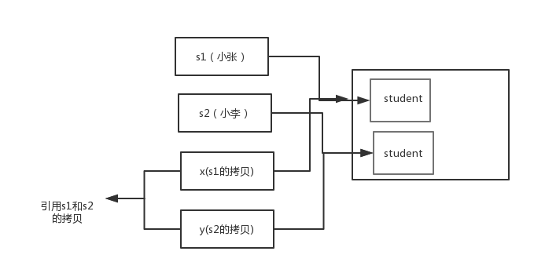
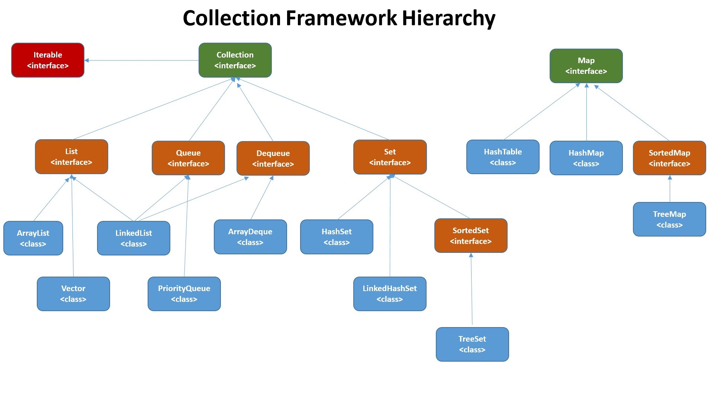

# 第一部分 JAVA 基础


## 1. Java 基本功


### 1.1. Java 入门


#### 1.1.1. Java 语言有哪些特点

1. 简单易学；
2. 面向对象（封装，继承，多态）；
3. 平台无关性（ Java 虚拟机实现平台无关性）；
4. 可靠性；
5. 安全性；
6. 支持多线程
7. 支持网络编程并且很方便（ Java 语言诞生本身就是为简化网络编程设计的，因此 Java 语言不仅支持网络编程而且很方便）；
8. 编译与解释并存；


#### 1.1.2. JDK 和 JRE 理解

**Java 虚拟机（JVM）**

Java 虚拟机（JVM）是运行 Java 字节码的虚拟机。JVM 有针对不同系统的特定实现（Windows，Linux，macOS），目的是使用相同的字节码，它们都会给出相同的结果。

**什么是字节码?采用字节码的好处是什么?**

> 在 Java 中，JVM 可以理解的代码就叫做`字节码`（即扩展名为 `.class` 的文件），它不面向任何特定的处理器，只面向虚拟机。Java 语言通过字节码的方式，在一定程度上解决了传统解释型语言执行效率低的问题，同时又保留了解释型语言可移植的特点。所以 Java 程序运行时比较高效，而且，由于字节码并不针对一种特定的机器，因此，Java 程序无须重新编译便可在多种不同操作系统的计算机上运行。

**Java 程序从源代码到运行一般有下面 3 步：**


我们需要格外注意的是 .class->机器码 这一步。在这一步 JVM 类加载器首先加载字节码文件，然后通过解释器逐行解释执行，这种方式的执行速度会相对比较慢。而且，有些方法和代码块是经常需要被调用的(也就是所谓的热点代码)，所以后面引进了 JIT 编译器，而 JIT 属于运行时编译。当 JIT 编译器完成第一次编译后，其会将字节码对应的机器码保存下来，下次可以直接使用。而我们知道，机器码的运行效率肯定是高于 Java 解释器的。这也解释了我们为什么经常会说 Java 是编译与解释共存的语言。

> HotSpot 采用了惰性评估(Lazy Evaluation)的做法，根据二八定律，消耗大部分系统资源的只有那一小部分的代码（热点代码），而这也就是 JIT 所需要编译的部分。JVM 会根据代码每次被执行的情况收集信息并相应地做出一些优化，因此执行的次数越多，它的速度就越快。JDK 9 引入了一种新的编译模式 AOT(Ahead of Time Compilation)，它是直接将字节码编译成机器码，这样就避免了 JIT 预热等各方面的开销。JDK 支持分层编译和 AOT 协作使用。但是 ，AOT 编译器的编译质量是肯定比不上 JIT 编译器的。

**总结：**

Java 虚拟机（JVM）是运行 Java 字节码的虚拟机。JVM 有针对不同系统的特定实现（Windows，Linux，macOS），目的是使用相同的字节码，它们都会给出相同的结果。字节码和不同系统的 JVM 实现是 Java 语言“一次编译，随处可以运行”的关键所在。

**JDK 和 JRE 概念**

JDK 是 Java Development Kit，它是功能齐全的 Java SDK。它拥有 JRE 所拥有的一切，还有编译器（javac）和工具（如 javadoc 和 jdb）。它能够创建和编译程序。

JRE 是 Java 运行时环境。它是运行已编译 Java 程序所需的所有内容的集合，包括 Java 虚拟机（JVM），Java 类库，java 命令和其他的一些基础构件。但是，它不能用于创建新程序。

如果你只是为了运行一下 Java 程序的话，那么你只需要安装 JRE 就可以了。如果你需要进行一些 Java 编程方面的工作，那么你就需要安装 JDK 了。但是，这不是绝对的。有时，即使您不打算在计算机上进行任何 Java 开发，仍然需要安装 JDK。例如，如果要使用 JSP 部署 Web 应用程序，那么从技术上讲，您只是在应用程序服务器中运行 Java 程序。那你为什么需要 JDK 呢？因为应用程序服务器会将 JSP 转换为 Java servlet，并且需要使用 JDK 来编译 servlet。


#### 1.1.3. Oracle JDK 和 OpenJDK 的对比

可能在看这个问题之前很多人和我一样并没有接触和使用过 OpenJDK 。那么 Oracle 和 OpenJDK 之间是否存在重大差异？下面我通过收集到的一些资料，为你解答这个被很多人忽视的问题。

对于 Java 7，没什么关键的地方。OpenJDK 项目主要基于 Sun 捐赠的 HotSpot 源代码。此外，OpenJDK 被选为 Java 7 的参考实现，由 Oracle 工程师维护。关于 JVM，JDK，JRE 和 OpenJDK 之间的区别，Oracle 博客帖子在 2012 年有一个更详细的答案：

> 问：OpenJDK 存储库中的源代码与用于构建 Oracle JDK 的代码之间有什么区别？
>
> 答：非常接近 - 我们的 Oracle JDK 版本构建过程基于 OpenJDK 7 构建，只添加了几个部分，例如部署代码，其中包括 Oracle 的 Java 插件和 Java WebStart 的实现，以及一些封闭的源代码派对组件，如图形光栅化器，一些开源的第三方组件，如 Rhino，以及一些零碎的东西，如附加文档或第三方字体。展望未来，我们的目的是开源 Oracle JDK 的所有部分，除了我们考虑商业功能的部分。

**总结：**

1. Oracle JDK 大概每 6 个月发一次主要版本，而 OpenJDK 版本大概每三个月发布一次。但这不是固定的，我觉得了解这个没啥用处。详情参见：[Java SE Release Cadence的更新和常见问题解答](https://blogs.oracle.com/java-platform-group/update-and-faq-on-the-java-se-release-cadence) 。
2. OpenJDK 是一个参考模型并且是完全开源的，而 Oracle JDK 是 OpenJDK 的一个实现，并不是完全开源的；
3. Oracle JDK 比 OpenJDK 更稳定。OpenJDK 和 Oracle JDK 的代码几乎相同，但 Oracle JDK 有更多的类和一些错误修复。因此，如果您想开发企业/商业软件，我建议您选择 Oracle JDK，因为它经过了彻底的测试和稳定。某些情况下，有些人提到在使用 OpenJDK 可能会遇到了许多应用程序崩溃的问题，但是，只需切换到 Oracle JDK 就可以解决问题；
4. 在响应性和 JVM 性能方面，Oracle JDK 与 OpenJDK 相比提供了更好的性能；
5. Oracle JDK 不会为即将发布的版本提供长期支持，用户每次都必须通过更新到最新版本获得支持来获取最新版本；
6. Oracle JDK 根据二进制代码许可协议获得许可，而 OpenJDK 根据 GPL v2 许可获得许可。


#### 1.1.4. Java 和 C++的区别

我知道很多人没学过 C++，但是面试官就是没事喜欢拿咱们 Java 和 C++ 比呀！没办法！！！就算没学过 C++，也要记下来！

- 都是面向对象的语言，都支持封装、继承和多态
- Java 不提供指针来直接访问内存，程序内存更加安全
- Java 的类是单继承的，C++ 支持多重继承；虽然 Java 的类不可以多继承，但是接口可以多继承。
- Java 有自动内存管理机制，不需要程序员手动释放无用内存
- **在 C 语言中，字符串或字符数组最后都会有一个额外的字符‘\0’来表示结束。但是，Java 语言中没有结束符这一概念。** 这是一个值得深度思考的问题，具体原因推荐看这篇文章： [Java与C语言在字符串结束符上的区别](https://blog.csdn.net/sszgg2006/article/details/49148189)


#### 1.1.5. Java 应用程序和小程序的主类的不同

一个程序中可以有多个类，但只能有一个类是主类。在 Java 应用程序中，这个主类是指包含 main（）方法的类。而在 Java 小程序中，这个主类是一个继承自系统类 JApplet 或 Applet 的子类。

应用程序的主类不一定要求是 public 类，但小程序的主类要求必须是 public 类。主类是 Java 程序执行的入口点。


#### 1.1.6. Java 应用程序与小程序的差别

简单说应用程序是从主线程启动(也就是 `main()` 方法)。applet 小程序没有 `main()` 方法，主要是嵌在浏览器页面上运行(调用`init()`或者`run()`来启动)，嵌入浏览器这点跟 flash 的小游戏类似。


#### 1.1.7. import java 和 javax 有什么区别

刚开始的时候 JavaAPI 所必需的包是 java 开头的包，javax 当时只是扩展 API 包来使用。然而随着时间的推移，javax 逐渐地扩展成为 Java API 的组成部分。但是，将扩展从 javax 包移动到 java 包确实太麻烦了，最终会破坏一堆现有的代码。因此，最终决定 javax 包将成为标准 API 的一部分。

所以，实际上 java 和 javax 没有区别。这都是一个名字。


#### 1.1.8. 为什么说 Java 语言“编译与解释并存”

高级编程语言按照程序的执行方式分为编译型和解释型两种。简单来说，编译型语言是指编译器针对特定的操作系统将源代码一次性翻译成可被该平台执行的机器码；解释型语言是指解释器对源程序逐行解释成特定平台的机器码并立即执行。比如，你想阅读一本英文名著，你可以找一个英文翻译人员帮助你阅读，
有两种选择方式，你可以先等翻译人员将全本的英文名著（也就是源码）都翻译成汉语，再去阅读，也可以让翻译人员翻译一段，你在旁边阅读一段，慢慢把书读完。

Java 语言既具有编译型语言的特征，也具有解释型语言的特征，因为 Java 程序要经过先编译，后解释两个步骤，由 Java 编写的程序需要先经过编译步骤，生成字节码（\*.class 文件），这种字节码必须由 Java 解释器来解释执行。因此，我们可以认为 Java 语言编译与解释并存。


### 1.2. Java 语法


#### 1.2.1. 字符型常量和字符串常量的区别

1. 形式上: 字符常量是单引号引起的一个字符; 字符串常量是双引号引起的若干个字符
2. 含义上: 字符常量相当于一个整型值( ASCII 值),可以参加表达式运算; 字符串常量代表一个地址值(该字符串在内存中存放位置)
3. 占内存大小 字符常量只占 2 个字节; 字符串常量占若干个字节 (**注意： char 在 Java 中占两个字节**)


#### 1.2.2. 关于注释

Java 中的注释有三种：

1. 单行注释

2. 多行注释

3. 文档注释。

在我们编写代码的时候，如果代码量比较少，我们自己或者团队其他成员还可以很轻易地看懂代码，但是当项目结构一旦复杂起来，我们就需要用到注释了。注释并不会执行，是我们程序员写给自己看的，注释是你的代码说明书，能够帮助看代码的人快速地理清代码之间的逻辑关系。因此，在写程序的时候随手加上注释是一个非常好的习惯。

《Clean Code》这本书明确指出：

> **代码的注释不是越详细越好。实际上好的代码本身就是注释，我们要尽量规范和美化自己的代码来减少不必要的注释。**
>
> **若编程语言足够有表达力，就不需要注释，尽量通过代码来阐述。**
>
> 举个例子：
>
> 去掉下面复杂的注释，只需要创建一个与注释所言同一事物的函数即可
>
> ```java
> // check to see if the employee is eligible for full benefits
> if ((employee.flags & HOURLY_FLAG) && (employee.age > 65))
> ```
>
> 应替换为
>
> ```java
> if (employee.isEligibleForFullBenefits())
> ```


#### 1.2.3. 标识符和关键字的区别

在我们编写程序的时候，需要大量地为程序、类、变量、方法等取名字，于是就有了标识符，简单来说，标识符就是一个名字。但是有一些标识符，Java 语言已经赋予了其特殊的含义，只能用于特定的地方，这种特殊的标识符就是关键字。因此，关键字是被赋予特殊含义的标识符。比如，在我们的日常生活中 ，“警察局”这个名字已经被赋予了特殊的含义，所以如果你开一家店，店的名字不能叫“警察局”，“警察局”就是我们日常生活中的关键字。


#### 1.2.4. Java中有哪些常见的关键字

|                      |          |            |          |              |            |           |        |
| -------------------- | -------- | ---------- | -------- | ------------ | ---------- | --------- | ------ |
| 访问控制             | private  | protected  | public   |              |            |           |        |
| 类，方法和变量修饰符 | abstract | class      | extends  | final        | implements | interface | native |
|                      | new      | static     | strictfp | synchronized | transient  | volatile  |        |
| 程序控制             | break    | continue   | return   | do           | while      | if        | else   |
|                      | for      | instanceof | switch   | case         | default    |           |        |
| 错误处理             | try      | catch      | throw    | throws       | finally    |           |        |
| 包相关               | import   | package    |          |              |            |           |        |
| 基本类型             | boolean  | byte       | char     | double       | float      | int       | long   |
|                      | short    | null       | true     | false        |            |           |        |
| 变量引用             | super    | this       | void     |              |            |           |        |
| 保留字               | goto     | const      |          |              |            |           |        |


#### 1.2.5. 自增自减运算符

在写代码的过程中，常见的一种情况是需要某个整数类型变量增加 1 或减少 1，Java 提供了一种特殊的运算符，用于这种表达式，叫做自增运算符（++)和自减运算符（--）。

++和--运算符可以放在操作数之前，也可以放在操作数之后，当运算符放在操作数之前时，先自增/减，再赋值；当运算符放在操作数之后时，先赋值，再自增/减。例如，当“b=++a”时，先自增（自己增加 1），再赋值（赋值给 b）；当“b=a++”时，先赋值(赋值给 b)，再自增（自己增加 1）。也就是，++a 输出的是 a+1 的值，a++输出的是 a 值。用一句口诀就是：“符号在前就先加/减，符号在后就后加/减”。


#### 1.2.6. continue、break、和return的区别

在循环结构中，当循环条件不满足或者循环次数达到要求时，循环会正常结束。但是，有时候可能需要在循环的过程中，当发生了某种条件之后 ，提前终止循环，这就需要用到下面几个关键词：

1. continue ：指跳出当前的这一次循环，继续下一次循环。
2. break ：指跳出整个循环体，继续执行循环下面的语句。

return 用于跳出所在方法，结束该方法的运行。return 一般有两种用法：

1. `return;` ：直接使用 return 结束方法执行，用于没有返回值函数的方法
2. `return value;` ：return 一个特定值，用于有返回值函数的方法


#### 1.2.7. Java泛型、类型擦除、常用的通配符

Java 泛型（generics）是 JDK 5 中引入的一个新特性, 泛型提供了编译时类型安全检测机制，该机制允许程序员在编译时检测到非法的类型。泛型的本质是参数化类型，也就是说所操作的数据类型被指定为一个参数。

**Java的泛型是伪泛型，这是因为Java在编译期间，所有的泛型信息都会被擦掉，这也就是通常所说类型擦除 。** 更多关于类型擦除的问题，可以查看这篇文章：[《Java泛型类型擦除以及类型擦除带来的问题》](https://www.cnblogs.com/wuqinglong/p/9456193.html) 。

```java
List<Integer> list = new ArrayList<>();

list.add(12);
//这里直接添加会报错
list.add("a");
Class<? extends List> clazz = list.getClass();
Method add = clazz.getDeclaredMethod("add", Object.class);
//但是通过反射添加，是可以的
add.invoke(list, "kl");

System.out.println(list)
```

泛型一般有三种使用方式:泛型类、泛型接口、泛型方法。

**1.泛型类**：

```java
//此处T可以随便写为任意标识，常见的如T、E、K、V等形式的参数常用于表示泛型
//在实例化泛型类时，必须指定T的具体类型
public class Generic<T>{ 
   
    private T key;

    public Generic(T key) { 
        this.key = key;
    }

    public T getKey(){ 
        return key;
    }
}
```

如何实例化泛型类：

```java
Generic<Integer> genericInteger = new Generic<Integer>(123456);
```

**2.泛型接口** ：

```java
public interface Generator<T> {
    public T method();
}
```

实现泛型接口，不指定类型：

```java
class GeneratorImpl<T> implements Generator<T>{
    @Override
    public T method() {
        return null;
    }
}
```

实现泛型接口，指定类型：

```java
class GeneratorImpl<T> implements Generator<String>{
    @Override
    public String method() {
        return "hello";
    }
}
```

**3.泛型方法** ：

```java
public static < E > void printArray(E[] inputArray)
{         
    for (E element : inputArray){        
        System.out.printf("%s ", element);
    }
    System.out.println();
}
```

使用：

```java
// 创建不同类型数组： Integer, Double 和 Character
Integer[] intArray = { 1, 2, 3 };
String[] stringArray = { "Hello", "World" };
printArray(intArray); 
printArray(stringArray); 
```

**常用的通配符为： T，E，K，V，？**

- ？ 表示不确定的 java 类型
- T (type) 表示具体的一个java类型
- K V (key value) 分别代表java键值中的Key Value
- E (element) 代表Element

更多关于Java 泛型中的通配符可以查看这篇文章：[《聊一聊-JAVA 泛型中的通配符 T，E，K，V，？》](https://juejin.im/post/5d5789d26fb9a06ad0056bd9)


#### 1.2.8. ==和equals的区别

**`==`** : 它的作用是判断两个对象的地址是不是相等。即判断两个对象是不是同一个对象。(**基本数据类型==比较的是值，引用数据类型==比较的是内存地址**)

> 因为 Java 只有值传递，所以，对于 ==  来说，不管是比较基本数据类型，还是引用数据类型的变量，其本质比较的都是值，只是引用类型变量存的值是对象的地址。

`equals()` : 它的作用也是判断两个对象是否相等，它不能用于比较基本数据类型的变量。`equals()`方法存在于`Object`类中，而`Object`类是所有类的直接或间接父类。

`Object`类`equals()`方法：

```java
public boolean equals(Object obj) {
     return (this == obj);
}
```

`equals()` 方法存在两种使用情况：

- 情况 1：类没有覆盖 `equals()`方法。则通过` equals()`比较该类的两个对象时，等价于通过“==”比较这两个对象。使用的默认是 `Object`类`equals()`方法。
- 情况 2：类覆盖了 `equals()`方法。一般，我们都覆盖 `equals()`方法来两个对象的内容相等；若它们的内容相等，则返回 true(即，认为这两个对象相等)。

**举个例子：**

```java
public class test1 {
    public static void main(String[] args) {
        String a = new String("ab"); // a 为一个引用
        String b = new String("ab"); // b为另一个引用,对象的内容一样
        String aa = "ab"; // 放在常量池中
        String bb = "ab"; // 从常量池中查找
        if (aa == bb) // true
            System.out.println("aa==bb");
        if (a == b) // false，非同一对象
            System.out.println("a==b");
        if (a.equals(b)) // true
            System.out.println("aEQb");
        if (42 == 42.0) { // true
            System.out.println("true");
        }
    }
}
```

**说明：**

- `String` 中的 `equals` 方法是被重写过的，因为 `Object` 的 `equals` 方法是比较的对象的内存地址，而 `String` 的 `equals` 方法比较的是对象的值。
- 当创建 `String` 类型的对象时，虚拟机会在常量池中查找有没有已经存在的值和要创建的值相同的对象，如果有就把它赋给当前引用。如果没有就在常量池中重新创建一个 `String` 对象。

`String`类`equals()`方法：

```java
public boolean equals(Object anObject) {
    if (this == anObject) {
        return true;
    }
    if (anObject instanceof String) {
        String anotherString = (String)anObject;
        int n = value.length;
        if (n == anotherString.value.length) {
            char v1[] = value;
            char v2[] = anotherString.value;
            int i = 0;
            while (n-- != 0) {
                if (v1[i] != v2[i])
                    return false;
                i++;
            }
            return true;
        }
    }
    return false;
}
```


#### 1.2.9. hashCode()与 equals()

面试官可能会问你：“你重写过 `hashcode` 和 `equals `么，为什么重写 `equals` 时必须重写 `hashCode` 方法？”

**1)hashCode()介绍:**

`hashCode()` 的作用是获取哈希码，也称为散列码；它实际上是返回一个 int 整数。这个哈希码的作用是确定该对象在哈希表中的索引位置。`hashCode() `定义在 JDK 的 `Object` 类中，这就意味着 Java 中的任何类都包含有 `hashCode()` 函数。另外需要注意的是： `Object` 的 hashcode 方法是本地方法，也就是用 c 语言或 c++ 实现的，该方法通常用来将对象的 内存地址 转换为整数之后返回。

```java
public native int hashCode();
```

散列表存储的是键值对(key-value)，它的特点是：能根据“键”快速的检索出对应的“值”。这其中就利用到了散列码！（可以快速找到所需要的对象）

**2)为什么要有 hashCode？**

我们以“`HashSet` 如何检查重复”为例子来说明为什么要有 hashCode？

当你把对象加入 `HashSet` 时，`HashSet` 会先计算对象的 hashcode 值来判断对象加入的位置，同时也会与其他已经加入的对象的 hashcode 值作比较，如果没有相符的 hashcode，`HashSet` 会假设对象没有重复出现。但是如果发现有相同 hashcode 值的对象，这时会调用 equals（）方法来检查 hashcode 相等的对象是否真的相同。如果两者相同，`HashSet` 就不会让其加入操作成功。如果不同的话，就会重新散列到其他位置。（摘自我的 Java 启蒙书《Head fist java》第二版）。这样我们就大大减少了 equals 的次数，相应就大大提高了执行速度。

**3)为什么重写 `equals` 时必须重写 `hashCode` 方法？**

如果两个对象相等，则 hashcode 一定也是相同的。两个对象相等,对两个对象分别调用 equals 方法都返回 true。但是，两个对象有相同的 hashcode 值，它们也不一定是相等的 。**因此，equals 方法被覆盖过，则 `hashCode` 方法也必须被覆盖。**

>  `hashCode()`的默认行为是对堆上的对象产生独特值。如果没有重写 `hashCode()`，则该 class 的两个对象无论如何都不会相等（即使这两个对象指向相同的数据）

**4)为什么两个对象有相同的 hashcode 值，它们也不一定是相等的？**

在这里解释一位小伙伴的问题。以下内容摘自《Head Fisrt Java》。

因为 `hashCode()` 所使用的杂凑算法也许刚好会让多个对象传回相同的杂凑值。越糟糕的杂凑算法越容易碰撞，但这也与数据值域分布的特性有关（所谓碰撞也就是指的是不同的对象得到相同的 `hashCode`。

我们刚刚也提到了 `HashSet`,如果 `HashSet` 在对比的时候，同样的 hashcode 有多个对象，它会使用 `equals()` 来判断是否真的相同。也就是说 `hashcode` 只是用来缩小查找成本。


更多关于 `hashcode()` 和 `equals()` 的内容可以查看：[Java hashCode() 和 equals()的若干问题解答](https://www.cnblogs.com/skywang12345/p/3324958.html)


### 1.3. 基本数据类型

#### 1.3.1. Java中的几种基本数据类型

Java**中**有8种基本数据类型，分别为：

1. 6种数字类型 ：byte、short、int、long、float、double
2. 1种字符类型：char
3. 1中布尔型：boolean。 

**基本数据类型**

JAVA中一共有八种基本数据类型，他们分别是 
byte、short、int、long、float、double、char、boolean

| 类型    | 型别   | 字节  | 位数 | 默认值  | 取值范围                      | 包装器类型 |
| ------- | ------ | ----- | ---- | ------- | ----------------------------- | ---------- |
| byte    | 整型   | 1byte | 1    | 0       | -27 ~ 27-1                    | Byte       |
| short   | 整型   | 2byte | 2    | 0       | -215 ~ 215-1                  | Short      |
| int     | 整型   | 4byte | 4    | 0       | -231 ~ 231-1                  | Integer    |
| long    | 整型   | 8byte | 8    | 0L      | -263 ~ 263-1                  | Long       |
| float   | 浮点型 | 4byte | 4    | 0f      | 3.402823e+38 ~ 1.401298e-45   | Float      |
| double  | 浮点型 | 8byte | 8    | 0d      | 1.797693e+308~ 4.9000000e-324 | Double     |
| char    | 文本型 | 2byte | 2    | 'u0000' | 0~216-1                       | Character  |
| boolean | 布尔型 | 1byte | 1    | false   | true/false                    | Boolean    |

对于boolean，官方文档未明确定义，它依赖于 JVM 厂商的具体实现。逻辑上理解是占用 1位，但是实际中会考虑计算机高效存储因素。

注意：

1. Java 里使用 long 类型的数据一定要在数值后面加上 **L**，否则将作为整型解析：
2. `char a = 'h'`char :单引号，`String a = "hello"` :双引号


#### 1.3.2. 自动装箱与拆箱

- **装箱**：将基本类型用它们对应的引用类型包装起来；
- **拆箱**：将包装类型转换为基本数据类型；

更多内容见：[深入剖析 Java 中的装箱和拆箱](https://www.cnblogs.com/dolphin0520/p/3780005.html)


#### 1.3.3. 8种基本类型的包装类和常量池

**Java 基本类型的包装类的大部分都实现了常量池技术，即 Byte,Short,Integer,Long,Character,Boolean；前面 4 种包装类默认创建了数值[-128，127] 的相应类型的缓存数据，Character创建了数值在[0,127]范围的缓存数据，Boolean 直接返回True Or False。如果超出对应范围仍然会去创建新的对象。** 为啥把缓存设置为[-128，127]区间？（[参见issue/461](https://github.com/Snailclimb/JavaGuide/issues/461)）性能和资源之间的权衡。

```java
public static Boolean valueOf(boolean b) {
    return (b ? TRUE : FALSE);
}
```

```java
private static class CharacterCache {         
    private CharacterCache(){}
          
    static final Character cache[] = new Character[127 + 1];          
    static {             
        for (int i = 0; i < cache.length; i++)                 
            cache[i] = new Character((char)i);         
    }   
}
```

两种浮点数类型的包装类 Float,Double 并没有实现常量池技术。**

```java
		Integer i1 = 33;
		Integer i2 = 33;
		System.out.println(i1 == i2);// 输出 true
		Integer i11 = 333;
		Integer i22 = 333;
		System.out.println(i11 == i22);// 输出 false
		Double i3 = 1.2;
		Double i4 = 1.2;
		System.out.println(i3 == i4);// 输出 false
```

**Integer 缓存源代码：** 

```java
/**
*此方法将始终缓存-128 到 127（包括端点）范围内的值，并可以缓存此范围之外的其他值。
*/
    public static Integer valueOf(int i) {
        if (i >= IntegerCache.low && i <= IntegerCache.high)
            return IntegerCache.cache[i + (-IntegerCache.low)];
        return new Integer(i);
    }

```

**应用场景：**

1. Integer i1=40；Java 在编译的时候会直接将代码封装成 Integer i1=Integer.valueOf(40);，从而使用常量池中的对象。
2. Integer i1 = new Integer(40);这种情况下会创建新的对象。

```java
  Integer i1 = 40;
  Integer i2 = new Integer(40);
  System.out.println(i1==i2);//输出 false
```

**Integer 比较更丰富的一个例子:**

```java
  Integer i1 = 40;
  Integer i2 = 40;
  Integer i3 = 0;
  Integer i4 = new Integer(40);
  Integer i5 = new Integer(40);
  Integer i6 = new Integer(0);
  
  System.out.println("i1=i2   " + (i1 == i2));
  System.out.println("i1=i2+i3   " + (i1 == i2 + i3));
  System.out.println("i1=i4   " + (i1 == i4));
  System.out.println("i4=i5   " + (i4 == i5));
  System.out.println("i4=i5+i6   " + (i4 == i5 + i6));   
  System.out.println("40=i5+i6   " + (40 == i5 + i6));     
```

结果：

```
i1=i2   true
i1=i2+i3   true
i1=i4   false
i4=i5   false
i4=i5+i6   true
40=i5+i6   true
```

解释：

语句 i4 == i5 + i6，因为+这个操作符不适用于 Integer 对象，首先 i5 和 i6 进行自动拆箱操作，进行数值相加，即 i4 == 40。然后 Integer 对象无法与数值进行直接比较，所以 i4 自动拆箱转为 int 值 40，最终这条语句转为 40 == 40 进行数值比较。


### 1.4. 方法（函数）


#### 1.4.1. 方法的返回值在类的方法里的作用

方法的返回值是指我们获取到的某个方法体中的代码执行后产生的结果！（前提是该方法可能产生结果）。返回值的作用是接收出结果，使得它可以用于其他的操作！


#### 1.4.2. 为什么 Java 中只有值传递？

首先回顾一下在程序设计语言中有关将参数传递给方法（或函数）的一些专业术语。**按值调用(call by value)表示方法接收的是调用者提供的值，而按引用调用（call by reference)表示方法接收的是调用者提供的变量地址。一个方法可以修改传递引用所对应的变量值，而不能修改传递值调用所对应的变量值。** 它用来描述各种程序设计语言（不只是 Java)中方法参数传递方式。

**Java 程序设计语言总是采用按值调用。也就是说，方法得到的是所有参数值的一个拷贝，也就是说，方法不能修改传递给它的任何参数变量的内容。**

**下面通过 3 个例子来给大家说明**

> **example 1**

```java
public static void main(String[] args) {
    int num1 = 10;
    int num2 = 20;

    swap(num1, num2);

    System.out.println("num1 = " + num1);
    System.out.println("num2 = " + num2);
}

public static void swap(int a, int b) {
    int temp = a;
    a = b;
    b = temp;

    System.out.println("a = " + a);
    System.out.println("b = " + b);
}
```

**结果：**

```
a = 20
b = 10
num1 = 10
num2 = 20
```

**解析：**


在 swap 方法中，a、b 的值进行交换，并不会影响到 num1、num2。因为，a、b 中的值，只是从 num1、num2 的复制过来的。也就是说，a、b 相当于 num1、num2 的副本，副本的内容无论怎么修改，都不会影响到原件本身。

**通过上面例子，我们已经知道了一个方法不能修改一个基本数据类型的参数，而对象引用作为参数就不一样，请看 example2.**

> **example 2**

```java
	public static void main(String[] args) {
		int[] arr = { 1, 2, 3, 4, 5 };
		System.out.println(arr[0]);
		change(arr);
		System.out.println(arr[0]);
	}

	public static void change(int[] array) {
		// 将数组的第一个元素变为0
		array[0] = 0;
	}
```

**结果：**

```
1
0
```

**解析：**


array 被初始化 arr 的拷贝也就是一个对象的引用，也就是说 array 和 arr 指向的是同一个数组对象。 因此，外部对引用对象的改变会反映到所对应的对象上。

**通过 example2 我们已经看到，实现一个改变对象参数状态的方法并不是一件难事。理由很简单，方法得到的是对象引用的拷贝，对象引用及其他的拷贝同时引用同一个对象。**

**很多程序设计语言（特别是，C++和 Pascal)提供了两种参数传递的方式：值调用和引用调用。有些程序员（甚至本书的作者）认为 Java 程序设计语言对对象采用的是引用调用，实际上，这种理解是不对的。由于这种误解具有一定的普遍性，所以下面给出一个反例来详细地阐述一下这个问题。**

> **example 3**

```java
public class Test {

	public static void main(String[] args) {
		// TODO Auto-generated method stub
		Student s1 = new Student("小张");
		Student s2 = new Student("小李");
		Test.swap(s1, s2);
		System.out.println("s1:" + s1.getName());
		System.out.println("s2:" + s2.getName());
	}

	public static void swap(Student x, Student y) {
		Student temp = x;
		x = y;
		y = temp;
		System.out.println("x:" + x.getName());
		System.out.println("y:" + y.getName());
	}
}
```

**结果：**

```
x:小李
y:小张
s1:小张
s2:小李
```

**解析：**

交换之前：



交换之后：


通过上面两张图可以很清晰的看出： **方法并没有改变存储在变量 s1 和 s2 中的对象引用。swap 方法的参数 x 和 y 被初始化为两个对象引用的拷贝，这个方法交换的是这两个拷贝**

> **总结**

Java 程序设计语言对对象采用的不是引用调用，实际上，对象引用是按
值传递的。

下面再总结一下 Java 中方法参数的使用情况：

- 一个方法不能修改一个基本数据类型的参数（即数值型或布尔型）。
- 一个方法可以改变一个对象参数的状态。
- 一个方法不能让对象参数引用一个新的对象。

**参考：**

《Java 核心技术卷 Ⅰ》基础知识第十版第四章 4.5 小节


#### 1.4.3. 重载和重写的区别

> 重载就是同样的一个方法能够根据输入数据的不同，做出不同的处理
>
> 重写就是当子类继承自父类的相同方法，输入数据一样，但要做出有别于父类的响应时，你就要覆盖父类方法

**重载** overload

发生在同一个类中，方法名必须相同，参数类型不同、个数不同、顺序不同，方法返回值和访问修饰符可以不同。

下面是《Java 核心技术》对重载这个概念的介绍：

> **重载:如果有多个方法有相同的名字,不同的参数,变产生了重载.**
>
> **Java允许重载任何方法,而不只是构造方法.因此,要完整地描述一个方法,**
>
> **需要指出方法名以及参数类型.这叫做方法的签名(signature).**
>
> **返回类型不是方法签名的一部分.就是说,不能有两个名字相同、参数类型也相同**
>
> **却返回不同类型值的方法.**
>
> **例:**
>
> ```java
> // String类有4个称为indexOf的共有方法.它们的签名是
> indexOf(int)
> indexOf(int,int)
> indexOf(String)
> indexOf(String,int)
> ```

**综上：重载就是同一个类中多个同名方法根据不同的传参来执行不同的逻辑处理。**

**重写** override

重写发生在运行期，是子类对父类的允许访问的方法的实现过程进行重新编写。

1. 返回值类型、方法名、参数列表必须相同，抛出的异常范围小于等于父类，访问修饰符范围大于等于父类。
2. 如果父类方法访问修饰符为 private/final/static 则子类就不能重写该方法，但是被 static 修饰的方法能够被再次声明。
3. 构造方法无法被重写

**综上：重写就是子类对父类方法的重新改造，外部样子不能改变，内部逻辑可以改变**

**暖心的 Guide 哥最后再来个图标总结一下！**

| 区别点     | 重载方法 | 重写方法                                       |
| :--------- | :------- | :--------------------------------------------- |
| 发生范围   | 同一个类 | 子类 中                                        |
| 参数列表   | 必须修改 | 一定不能修改                                   |
| 返回类型   | 可修改   | 一定不能修改                                   |
| 异常       | 可修改   | 可以减少或删除，一定不能抛出新的或者更广的异常 |
| 访问修饰符 | 可修改   | 一定不能做更严格的限制（可以降低限制）         |
| 发生阶段   | 编译期   | 运行期                                         |


#### 1.4.4. 深拷贝 vs 浅拷贝

1. **浅拷贝**：对基本数据类型进行值传递，对引用数据类型进行引用传递般的拷贝，此为浅拷贝。
2. **深拷贝**：对基本数据类型进行值传递，对引用数据类型，创建一个新的对象，并复制其内容，此为深拷贝。


#### 1.4.5. 方法的四种类型

1、无参数无返回值的方法

```java
// 无参数无返回值的方法(如果方法没有返回值，不能不写，必须写void，表示没有返回值)
public void f1() {
    System.out.println("无参数无返回值的方法");
}
```

2、有参数无返回值的方法

```java
/**
* 有参数无返回值的方法
* 参数列表由零组到多组“参数类型+形参名”组合而成，多组参数之间以英文逗号（,）隔开，形参类型和形参名之间以英文空格隔开
*/
public void f2(int a, String b, int c) {
    System.out.println(a + "-->" + b + "-->" + c);
}
```

3、有返回值无参数的方法

```java
// 有返回值无参数的方法（返回值可以是任意的类型,在函数里面必须有return关键字返回对应的类型）
public int f3() {
    System.out.println("有返回值无参数的方法");
    return 2;
}
```

4、有返回值有参数的方法

```java
// 有返回值有参数的方法
public int f4(int a, int b) {
    return a * b;
}
```

5、return 在无返回值方法的特殊使用

```java
// return在无返回值方法的特殊使用
public void f5(int a) {
    if (a>10) {
    return;//表示结束所在方法 （f5方法）的执行,下方的输出语句不会执行
}
    System.out.println(a);
}
```


## 2. Java 面向对象

### 2.1. 类和对象

#### 2.1.1. 面向对象和面向过程的区别

- **面向过程** ：**面向过程性能比面向对象高。** 因为类调用时需要实例化，开销比较大，比较消耗资源，所以当性能是最重要的考量因素的时候，比如单片机、嵌入式开发、Linux/Unix 等一般采用面向过程开发。但是，**面向过程没有面向对象易维护、易复用、易扩展。**
- **面向对象** ：**面向对象易维护、易复用、易扩展。** 因为面向对象有封装、继承、多态性的特性，所以可以设计出低耦合的系统，使系统更加灵活、更加易于维护。但是，**面向对象性能比面向过程低**。

参见 issue : [面向过程 ：面向过程性能比面向对象高？？](https://github.com/Snailclimb/JavaGuide/issues/431)

> 这个并不是根本原因，面向过程也需要分配内存，计算内存偏移量，Java 性能差的主要原因并不是因为它是面向对象语言，而是 Java 是半编译语言，最终的执行代码并不是可以直接被 CPU 执行的二进制机械码。
>
> 而面向过程语言大多都是直接编译成机械码在电脑上执行，并且其它一些面向过程的脚本语言性能也并不一定比 Java 好。


#### 2.1.2. 构造器 Constructor 是否可被重写

Constructor 不能被 override（重写）,但是可以 overload（重载）,所以你可以看到一个类中有多个构造函数的情况。


#### 2.1.3. 无参构造方法的作用

Java 程序在执行子类的构造方法之前，如果没有用 `super()`来调用父类特定的构造方法，则会调用父类中“没有参数的构造方法”。因此，如果父类中只定义了有参数的构造方法，而在子类的构造方法中又没有用 `super()`来调用父类中特定的构造方法，则编译时将发生错误，因为 Java 程序在父类中找不到没有参数的构造方法可供执行。解决办法是在父类里加上一个不做事且没有参数的构造方法。


#### 2.1.4. 成员变量与局部变量的区别

1. 从语法形式上看:成员变量是属于类的，而局部变量是在方法中定义的变量或是方法的参数；成员变量可以被 public,private,static 等修饰符所修饰，而局部变量不能被访问控制修饰符及 static 所修饰；但是，成员变量和局部变量都能被 final 所修饰。
2. 从变量在内存中的存储方式来看:如果成员变量是使用`static`修饰的，那么这个成员变量是属于类的，如果没有使用`static`修饰，这个成员变量是属于实例的。而对象存在于堆内存，局部变量则存在于栈内存。
3. 从变量在内存中的生存时间上看:成员变量是对象的一部分，它随着对象的创建而存在，而局部变量随着方法的调用而自动消失。
4. 成员变量如果没有被赋初值:则会自动以类型的默认值而赋值（一种情况例外:被 final 修饰的成员变量也必须显式地赋值），而局部变量则不会自动赋值。


#### 2.1.5. 对象实体与对象引用有何不同

创建一个对象用  new 运算符，new 创建对象实例（对象实例在堆内存中），对象引用指向对象实例（对象引用存放在栈内存中）。一个对象引用可以指向 0 个或 1 个对象（一根绳子可以不系气球，也可以系一个气球）;一个对象可以有 n 个引用指向它（可以用 n 条绳子系住一个气球）。


#### 2.1.6. 构造方法的作用

主要作用是完成对类对象的初始化工作。可以执行。因为一个类即使没有声明构造方法也会有默认的不带参数的构造方法。如果我们自己添加了类的构造方法（无论是否有参），Java 就不会再添加默认的无参数的构造方法了，这时候，就不能直接 new 一个对象而不传递参数了，所以我们一直在不知不觉地使用构造方法，这也是为什么我们在创建对象的时候后面要加一个括号（因为要调用无参的构造方法）。如果我们重载了有参的构造方法，记得都要把无参的构造方法也写出来（无论是否用到），因为这可以帮助我们在创建对象的时候少踩坑。


#### 2.1.7. 构造方法的特性

1. 名字与类名相同。
2. 没有返回值，但不能用 void 声明构造函数。
3. 生成类的对象时自动执行，无需调用。


#### 2.1.8. super() 的目的

帮助子类做初始化工作。


#### 2.1.9. 对象相等与引用相等有什么不同

对象的相等，比的是内存中存放的内容是否相等。而引用相等，比较的是他们指向的内存地址是否相等。


### 2.2. 面向对象三大特征


#### 2.2.1. 封装

封装是指把一个对象的状态信息（也就是属性）隐藏在对象内部，不允许外部对象直接访问对象的内部信息。但是可以提供一些可以被外界访问的方法来操作属性。就好像我们看不到挂在墙上的空调的内部的零件信息（也就是属性），但是可以通过遥控器（方法）来控制空调。如果属性不想被外界访问，我们大可不必提供方法给外界访问。但是如果一个类没有提供给外界访问的方法，那么这个类也没有什么意义了。就好像如果没有空调遥控器，那么我们就无法操控空凋制冷，空调本身就没有意义了（当然现在还有很多其他方法 ，这里只是为了举例子）。

```java
public class Student {
    private int id;//id属性私有化
    private String name;//name属性私有化

    //获取id的方法
    public int getId() {
        return id;
    }

    //设置id的方法
    public void setId(int id) {
        this.id = id;
    }

    //获取name的方法
    public String getName() {
        return name;
    }

    //设置name的方法
    public void setName(String name) {
        this.name = name;
    }
}
```


#### 2.2.2. 继承

不同类型的对象，相互之间经常有一定数量的共同点。例如，小明同学、小红同学、小李同学，都共享学生的特性（班级、学号等）。同时，每一个对象还定义了额外的特性使得他们与众不同。例如小明的数学比较好，小红的性格惹人喜爱；小李的力气比较大。继承是使用已存在的类的定义作为基础建立新类的技术，新类的定义可以增加新的数据或新的功能，也可以用父类的功能，但不能选择性地继承父类。通过使用继承，可以快速地创建新的类，可以提高代码的重用，程序的可维护性，节省大量创建新类的时间 ，提高我们的开发效率。

**关于继承如下 3 点请记住：**

1. 子类拥有父类对象所有的属性和方法（包括私有属性和私有方法），但是父类中的私有属性和方法子类是无法访问，**只是拥有**。
2. 子类可以拥有自己属性和方法，即子类可以对父类进行扩展。
3. 子类可以用自己的方式实现父类的方法。（以后介绍）。


#### 2.2.3. 多态

多态，顾名思义，表示一个对象具有多种的状态。具体表现为父类的引用指向子类的实例。

**多态的特点:**

- 对象类型和引用类型之间具有继承（类）/实现（接口）的关系；
- 对象类型不可变，引用类型可变；
- 方法具有多态性，属性不具有多态性；
- 引用类型变量发出的方法调用的到底是哪个类中的方法，必须在程序运行期间才能确定；
- 多态不能调用“只在子类存在但在父类不存在”的方法；
- 如果子类重写了父类的方法，真正执行的是子类覆盖的方法，如果子类没有覆盖父类的方法，执行的是父类的方法。


### 2.3. 修饰符


#### 2.3.1. 静态方法可以调用非静态成员吗

由于静态方法可以不通过对象进行调用，因此在静态方法里，不能调用其他非静态变量，也不可以访问非静态变量成员。


#### 2.3.2. 静态方法和实例方法有何不同

1. 在外部调用静态方法时，可以使用"类名.方法名"的方式，也可以使用"对象名.方法名"的方式。而实例方法只有后面这种方式。也就是说，调用静态方法可以无需创建对象。

2. 静态方法在访问本类的成员时，只允许访问静态成员（即静态成员变量和静态方法），而不允许访问实例成员变量和实例方法；实例方法则无此限制。


#### 2.3.3. 常见关键字总结

详见笔主的这篇文章: [final，static，this，super关键字总结](https://snailclimb.gitee.io/javaguide/#/docs/java/basic/final,static,this,super?id=finalstaticthissuper-关键字总结)


### 2.4. 接口和抽象类


#### 2.4.1. 接口和抽象类的区别

1. 接口的方法默认是 public，所有方法在接口中不能有实现(Java 8 开始接口方法可以有默认实现），而抽象类可以有非抽象的方法。
2. 接口中除了 static、final 变量，不能有其他变量，而抽象类中则不一定。
3. 一个类可以实现多个接口，但只能实现一个抽象类。接口自己本身可以通过 extends 关键字扩展多个接口。
4. 接口方法默认修饰符是 public，抽象方法可以有 public、protected 和 default 这些修饰符（抽象方法就是为了被重写所以不能使用 private 关键字修饰！）。
5. 从设计层面来说，抽象是对类的抽象，是一种模板设计，而接口是对行为的抽象，是一种行为的规范。

> 备注：
>
> 1. 在 JDK8 中，接口也可以定义静态方法，可以直接用接口名调用。实现类和实现是不可以调用的。如果同时实现两个接口，接口中定义了一样的默认方法，则必须重写，不然会报错。(详见 issue:[https://github.com/Snailclimb/JavaGuide/issues/146](https://github.com/Snailclimb/JavaGuide/issues/146)。
> 2. jdk9 的接口被允许定义私有方法 。

总结一下 jdk7~jdk9 Java 中接口概念的变化（[相关阅读](https://www.geeksforgeeks.org/private-methods-java-9-interfaces/)）：

1. 在 jdk 7 或更早版本中，接口里面只能有常量变量和抽象方法。这些接口方法必须由选择实现接口的类实现。
2. jdk8 的时候接口可以有默认方法和静态方法功能。
3. Jdk 9 在接口中引入了私有方法和私有静态方法。


### 2.5. 其它重要知识点

#### 2.5.1. StringBuffer 和 StringBuilder 的区别

简单的来说：`String` 类中使用 final 关键字修饰字符数组来保存字符串，`private final char value[]`，所以` String` 对象是不可变的。

> 补充（来自[issue 675](https://github.com/Snailclimb/JavaGuide/issues/675)）：在 Java 9 之后，String 类的实现改用 byte 数组存储字符串 `private final byte[] value`;

而 `StringBuilder` 与 `StringBuffer` 都继承自 `AbstractStringBuilder` 类，在 `AbstractStringBuilder` 中也是使用字符数组保存字符串`char[]value` 但是没有用 `final` 关键字修饰，所以这两种对象都是可变的。

`StringBuilder` 与 `StringBuffer` 的构造方法都是调用父类构造方法也就是`AbstractStringBuilder` 实现的，大家可以自行查阅源码。

`AbstractStringBuilder.java`

```java
abstract class AbstractStringBuilder implements Appendable, CharSequence {
    /**
     * The value is used for character storage.
     */
    char[] value;

    /**
     * The count is the number of characters used.
     */
    int count;

    AbstractStringBuilder(int capacity) {
        value = new char[capacity];
    }}
```

**线程安全性**

`String` 中的对象是不可变的，也就可以理解为常量，线程安全。`AbstractStringBuilder` 是 `StringBuilder` 与 `StringBuffer` 的公共父类，定义了一些字符串的基本操作，如 `expandCapacity`、`append`、`insert`、`indexOf` 等公共方法。`StringBuffer` 对方法加了同步锁或者对调用的方法加了同步锁，所以是线程安全的。`StringBuilder` 并没有对方法进行加同步锁，所以是非线程安全的。

**性能**

每次对 `String` 类型进行改变的时候，都会生成一个新的 `String` 对象，然后将指针指向新的 `String` 对象。`StringBuffer` 每次都会对 `StringBuffer` 对象本身进行操作，而不是生成新的对象并改变对象引用。相同情况下使用 `StringBuilder` 相比使用 `StringBuffer` 仅能获得 10%~15% 左右的性能提升，但却要冒多线程不安全的风险。

**对于三者使用的总结：**

1. 操作少量的数据: 适用 `String`
2. 单线程操作字符串缓冲区下操作大量数据: 适用 `StringBuilder`
3. 多线程操作字符串缓冲区下操作大量数据: 适用 `StringBuffer`


#### 2.5.2. Object 类的常见方法总结

Object 类是一个特殊的类，是所有类的父类。它主要提供了以下 11 个方法：

```java
public final native Class<?> getClass()//native方法，用于返回当前运行时对象的Class对象，使用了final关键字修饰，故不允许子类重写。

public native int hashCode() //native方法，用于返回对象的哈希码，主要使用在哈希表中，比如JDK中的HashMap。
public boolean equals(Object obj)//用于比较2个对象的内存地址是否相等，String类对该方法进行了重写用户比较字符串的值是否相等。

protected native Object clone() throws CloneNotSupportedException//naitive方法，用于创建并返回当前对象的一份拷贝。一般情况下，对于任何对象 x，表达式 x.clone() != x 为true，x.clone().getClass() == x.getClass() 为true。Object本身没有实现Cloneable接口，所以不重写clone方法并且进行调用的话会发生CloneNotSupportedException异常。

public String toString()//返回类的名字@实例的哈希码的16进制的字符串。建议Object所有的子类都重写这个方法。

public final native void notify()//native方法，并且不能重写。唤醒一个在此对象监视器上等待的线程(监视器相当于就是锁的概念)。如果有多个线程在等待只会任意唤醒一个。

public final native void notifyAll()//native方法，并且不能重写。跟notify一样，唯一的区别就是会唤醒在此对象监视器上等待的所有线程，而不是一个线程。

public final native void wait(long timeout) throws InterruptedException//native方法，并且不能重写。暂停线程的执行。注意：sleep方法没有释放锁，而wait方法释放了锁 。timeout是等待时间。

public final void wait(long timeout, int nanos) throws InterruptedException//多了nanos参数，这个参数表示额外时间（以毫微秒为单位，范围是 0-999999）。 所以超时的时间还需要加上nanos毫秒。

public final void wait() throws InterruptedException//跟之前的2个wait方法一样，只不过该方法一直等待，没有超时时间这个概念

protected void finalize() throws Throwable { }//实例被垃圾回收器回收的时候触发的操作

```


#### 2.5.3. == 与 equals(重要)

**==** : 它的作用是判断两个对象的地址是不是相等。即，判断两个对象是不是同一个对象(基本数据类型==比较的是值，引用数据类型==比较的是内存地址)。

**equals()** : 它的作用也是判断两个对象是否相等。但它一般有两种使用情况：

- 情况 1：类没有覆盖 equals() 方法。则通过 equals() 比较该类的两个对象时，等价于通过“==”比较这两个对象。
- 情况 2：类覆盖了 equals() 方法。一般，我们都覆盖 equals() 方法来比较两个对象的内容是否相等；若它们的内容相等，则返回 true (即，认为这两个对象相等)。

**举个例子：**

```java
public class test1 {
    public static void main(String[] args) {
        String a = new String("ab"); // a 为一个引用
        String b = new String("ab"); // b为另一个引用,对象的内容一样
        String aa = "ab"; // 放在常量池中
        String bb = "ab"; // 从常量池中查找
        if (aa == bb) // true
            System.out.println("aa==bb");
        if (a == b) // false，非同一对象
            System.out.println("a==b");
        if (a.equals(b)) // true
            System.out.println("aEQb");
        if (42 == 42.0) { // true
            System.out.println("true");
        }
    }
}
```

**说明：**

- String 中的 equals 方法是被重写过的，因为 object 的 equals 方法是比较的对象的内存地址，而 String 的 equals 方法比较的是对象的值。
- 当创建 String 类型的对象时，虚拟机会在常量池中查找有没有已经存在的值和要创建的值相同的对象，如果有就把它赋给当前引用。如果没有就在常量池中重新创建一个 String 对象。


#### 2.5.4. hashCode 与 equals (重要)

面试官可能会问你：“你重写过 hashcode 和 equals 么，为什么重写 equals 时必须重写 hashCode 方法？”

**hashCode（）介绍**

hashCode() 的作用是获取哈希码，也称为散列码；它实际上是返回一个 int 整数。这个哈希码的作用是确定该对象在哈希表中的索引位置。hashCode() 定义在 JDK 的 Object.java 中，这就意味着 Java 中的任何类都包含有 hashCode() 函数。

散列表存储的是键值对(key-value)，它的特点是：能根据“键”快速的检索出对应的“值”。这其中就利用到了散列码！（可以快速找到所需要的对象）

**为什么要有 hashCode**

**我们先以“HashSet 如何检查重复”为例子来说明为什么要有 hashCode：** 当你把对象加入 HashSet 时，HashSet 会先计算对象的 hashcode 值来判断对象加入的位置，同时也会与该位置其他已经加入的对象的 hashcode 值作比较，如果没有相符的 hashcode，HashSet 会假设对象没有重复出现。但是如果发现有相同 hashcode 值的对象，这时会调用 `equals()`方法来检查 hashcode 相等的对象是否真的相同。如果两者相同，HashSet 就不会让其加入操作成功。如果不同的话，就会重新散列到其他位置。（摘自我的 Java 启蒙书《Head first java》第二版）。这样我们就大大减少了 equals 的次数，相应就大大提高了执行速度。

通过我们可以看出：`hashCode()` 的作用就是**获取哈希码**，也称为散列码；它实际上是返回一个 int 整数。这个**哈希码的作用**是确定该对象在哈希表中的索引位置。**`hashCode()`在散列表中才有用，在其它情况下没用**。在散列表中 hashCode() 的作用是获取对象的散列码，进而确定该对象在散列表中的位置。

**hashCode（）与 equals（）的相关规定**

1. 如果两个对象相等，则 hashcode 一定也是相同的
2. 两个对象相等,对两个对象分别调用 equals 方法都返回 true
3. 两个对象有相同的 hashcode 值，它们也不一定是相等的
4. **因此，equals 方法被覆盖过，则 hashCode 方法也必须被覆盖**
5. hashCode() 的默认行为是对堆上的对象产生独特值。如果没有重写 hashCode()，则该 class 的两个对象无论如何都不会相等（即使这两个对象指向相同的数据）

推荐阅读：[Java hashCode() 和 equals()的若干问题解答](https://www.cnblogs.com/skywang12345/p/3324958.html)


#### 2.5.5. Java 序列化 transient 关键字

对于不想进行序列化的变量，使用 transient 关键字修饰。

transient 关键字的作用是：阻止实例中那些用此关键字修饰的的变量序列化；当对象被反序列化时，被 transient 修饰的变量值不会被持久化和恢复。transient 只能修饰变量，不能修饰类和方法。


#### 2.5.6. 获取用键盘输入常用的两种方法

方法 1：通过 Scanner

```java
Scanner input = new Scanner(System.in);
String s  = input.nextLine();
input.close();
```

方法 2：通过 BufferedReader

```java
BufferedReader input = new BufferedReader(new InputStreamReader(System.in));
String s = input.readLine();
```


## 3. Java 核心技术


### 3.1. 集合


#### 3.1.1. Collections 工具类和 Arrays 工具类

详见笔主的这篇文章:  [Collections 工具类和 Arrays 工具类常见方法](https://gitee.com/SnailClimb/JavaGuide/blob/master/docs/java/basic/Arrays,CollectionsCommonMethods.md#collections-工具类和-arrays-工具类常见方法)


### 3.2. 异常


#### 3.2.1. Java 异常类层次结构图


<p style="font-size:13px;text-align:right">图片来自：https://simplesnippets.tech/exception-handling-in-java-part-1/</p>


<p style="font-size:13px;text-align:right">图片来自：https://chercher.tech/java-programming/exceptions-java</p>

在 Java 中，所有的异常都有一个共同的祖先 java.lang 包中的 **Throwable 类**。Throwable： 有两个重要的子类：**Exception（异常）** 和 **Error（错误）** ，二者都是 Java 异常处理的重要子类，各自都包含大量子类。

**Error（错误）:是程序无法处理的错误**，表示运行应用程序中较严重问题。大多数错误与代码编写者执行的操作无关，而表示代码运行时 JVM（Java 虚拟机）出现的问题。例如，Java 虚拟机运行错误（Virtual MachineError），当 JVM 不再有继续执行操作所需的内存资源时，将出现 OutOfMemoryError。这些异常发生时，Java 虚拟机（JVM）一般会选择线程终止。

这些错误表示故障发生于虚拟机自身、或者发生在虚拟机试图执行应用时，如 Java 虚拟机运行错误（Virtual MachineError）、类定义错误（NoClassDefFoundError）等。这些错误是不可查的，因为它们在应用程序的控制和处理能力之 外，而且绝大多数是程序运行时不允许出现的状况。对于设计合理的应用程序来说，即使确实发生了错误，本质上也不应该试图去处理它所引起的异常状况。在 Java 中，错误通过 Error 的子类描述。

**Exception（异常）:是程序本身可以处理的异常**。</font>Exception 类有一个重要的子类 **RuntimeException**。RuntimeException 异常由 Java 虚拟机抛出。**NullPointerException**（要访问的变量没有引用任何对象时，抛出该异常）、**ArithmeticException**（算术运算异常，一个整数除以 0 时，抛出该异常）和 **ArrayIndexOutOfBoundsException** （下标越界异常）。

**注意：异常和错误的区别：异常能被程序本身处理，错误是无法处理。**


#### 3.2.2. Throwable 类常用方法

- **`public string getMessage()`**:返回异常发生时的简要描述
- **`public string toString()`**:返回异常发生时的详细信息
- **`public string getLocalizedMessage()`**:返回异常对象的本地化信息。使用 `Throwable` 的子类覆盖这个方法，可以生成本地化信息。如果子类没有覆盖该方法，则该方法返回的信息与 `getMessage（）`返回的结果相同
- **`public void printStackTrace()`**:在控制台上打印 `Throwable` 对象封装的异常信息


#### 3.2.3. try-catch-finally

- **try 块：** 用于捕获异常。其后可接零个或多个 catch 块，如果没有 catch 块，则必须跟一个 finally 块。
- **catch 块：** 用于处理 try 捕获到的异常。
- **finally 块：** 无论是否捕获或处理异常，finally 块里的语句都会被执行。当在 try 块或 catch 块中遇到 return 语句时，finally 语句块将在方法返回之前被执行。

**在以下 4 种特殊情况下，finally 块不会被执行：**

1. 在 finally 语句块第一行发生了异常。 因为在其他行，finally 块还是会得到执行
2. 在前面的代码中用了 System.exit(int)已退出程序。 exit 是带参函数 ；若该语句在异常语句之后，finally 会执行
3. 程序所在的线程死亡。
4. 关闭 CPU。

下面这部分内容来自 issue:<https://github.com/Snailclimb/JavaGuide/issues/190>。

**注意：** 当 try 语句和 finally 语句中都有 return 语句时，在方法返回之前，finally 语句的内容将被执行，并且 finally 语句的返回值将会覆盖原始的返回值。如下：

```java
public class Test {
    public static int f(int value) {
        try {
            return value * value;
        } finally {
            if (value == 2) {
                return 0;
            }
        }
    }
}
```

如果调用 `f(2)`，返回值将是 0，因为 finally 语句的返回值覆盖了 try 语句块的返回值。


#### 3.2.4. 使用 `try-with-resources` 来代替`try-catch-finally`

《Effecitve Java》中明确指出：

> 面对必须要关闭的资源，我们总是应该优先使用try-with-resources而不是`try-finally`。随之产生的代码更简短，更清晰，产生的异常对我们也更有用。`try-with-resources`语句让我们更容易编写必须要关闭的资源的代码，若采用`try-finally`则几乎做不到这点。

Java 中类似于`InputStream`、`OutputStream` 、`Scanner` 、`PrintWriter`等的资源都需要我们调用`close()`方法来手动关闭，一般情况下我们都是通过`try-catch-finally`语句来实现这个需求，如下：

```java
//读取文本文件的内容
Scanner scanner = null;
try {
    scanner = new Scanner(new File("D://read.txt"));
    while (scanner.hasNext()) {
        System.out.println(scanner.nextLine());
    }
} catch (FileNotFoundException e) {
    e.printStackTrace();
} finally {
    if (scanner != null) {
        scanner.close();
    }
}
```

使用Java 7之后的 `try-with-resources` 语句改造上面的代码:

```java
try (Scanner scanner = new Scanner(new File("test.txt"))) {
    while (scanner.hasNext()) {
        System.out.println(scanner.nextLine());
    }
} catch (FileNotFoundException fnfe) {
    fnfe.printStackTrace();
}
```

当然多个资源需要关闭的时候，使用 `try-with-resources`  实现起来也非常简单，如果你还是用`try-catch-finally`可能会带来很多问题。

通过使用分号分隔，可以在`try-with-resources`块中声明多个资源：


### 3.3. 多线程


#### 3.3.1. 简述线程、程序、进程的基本概念

**线程**与进程相似，但线程是一个比进程更小的执行单位。一个进程在其执行的过程中可以产生多个线程。与进程不同的是同类的多个线程共享同一块内存空间和一组系统资源，所以系统在产生一个线程，或是在各个线程之间作切换工作时，负担要比进程小得多，也正因为如此，线程也被称为轻量级进程。

**程序**是含有指令和数据的文件，被存储在磁盘或其他的数据存储设备中，也就是说程序是静态的代码。

**进程**是程序的一次执行过程，是系统运行程序的基本单位，因此进程是动态的。系统运行一个程序即是一个进程从创建，运行到消亡的过程。简单来说，一个进程就是一个执行中的程序，它在计算机中一个指令接着一个指令地执行着，同时，每个进程还占有某些系统资源如 CPU 时间，内存空间，文件，输入输出设备的使用权等等。换句话说，当程序在执行时，将会被操作系统载入内存中。
线程是进程划分成的更小的运行单位。线程和进程最大的不同在于基本上各进程是独立的，而各线程则不一定，因为同一进程中的线程极有可能会相互影响。从另一角度来说，进程属于操作系统的范畴，主要是同一段时间内，可以同时执行一个以上的程序，而线程则是在同一程序内几乎同时执行一个以上的程序段。

#### 3.3.2. 线程有哪些基本状态

Java 线程在运行的生命周期中的指定时刻只可能处于下面 6 种不同状态的其中一个状态（图源《Java 并发编程艺术》4.1.4 节）。


线程在生命周期中并不是固定处于某一个状态而是随着代码的执行在不同状态之间切换。Java 线程状态变迁如下图所示（图源《Java 并发编程艺术》4.1.4 节）：


由上图可以看出：

线程创建之后它将处于 **NEW（新建）** 状态，调用 `start()` 方法后开始运行，线程这时候处于 **READY（可运行）** 状态。可运行状态的线程获得了 cpu 时间片（timeslice）后就处于 **RUNNING（运行）** 状态。

> 操作系统隐藏 Java 虚拟机（JVM）中的 READY 和 RUNNING 状态，它只能看到 RUNNABLE 状态（图源：[HowToDoInJava](https://howtodoinjava.com/)：[Java Thread Life Cycle and Thread States](https://howtodoinjava.com/java/multi-threading/java-thread-life-cycle-and-thread-states/)），所以 Java 系统一般将这两个状态统称为 **RUNNABLE（运行中）** 状态 。


当线程执行 `wait()`方法之后，线程进入 **WAITING（等待）**状态。进入等待状态的线程需要依靠其他线程的通知才能够返回到运行状态，而 **TIME_WAITING(超时等待)** 状态相当于在等待状态的基础上增加了超时限制，比如通过 `sleep（long millis）`方法或 `wait（long millis）`方法可以将 Java 线程置于 TIMED WAITING 状态。当超时时间到达后 Java 线程将会返回到 RUNNABLE 状态。当线程调用同步方法时，在没有获取到锁的情况下，线程将会进入到 **BLOCKED（阻塞）** 状态。线程在执行 Runnable 的`run()`方法之后将会进入到 **TERMINATED（终止）** 状态。

### 3.4. 文件与 I\O 流

#### 3.4.1. Java 中 IO 流分为几种?

- 按照流的流向分，可以分为输入流和输出流；
- 按照操作单元划分，可以划分为字节流和字符流；
- 按照流的角色划分为节点流和处理流。

Java Io 流共涉及 40 多个类，这些类看上去很杂乱，但实际上很有规则，而且彼此之间存在非常紧密的联系， Java I0 流的 40 多个类都是从如下 4 个抽象类基类中派生出来的。

- InputStream/Reader: 所有的输入流的基类，前者是字节输入流，后者是字符输入流。
- OutputStream/Writer: 所有输出流的基类，前者是字节输出流，后者是字符输出流。

按操作方式分类结构图：


按操作对象分类结构图：


**既然有了字节流,为什么还要有字符流?**

问题本质想问：**不管是文件读写还是网络发送接收，信息的最小存储单元都是字节，那为什么 I/O 流操作要分为字节流操作和字符流操作呢？**

回答：字符流是由 Java 虚拟机将字节转换得到的，问题就出在这个过程还算是非常耗时，并且，如果我们不知道编码类型就很容易出现乱码问题。所以， I/O 流就干脆提供了一个直接操作字符的接口，方便我们平时对字符进行流操作。如果音频文件、图片等媒体文件用字节流比较好，如果涉及到字符的话使用字符流比较好。

**BIO,NIO,AIO 有什么区别?**

- **BIO (Blocking I/O):** 同步阻塞 I/O 模式，数据的读取写入必须阻塞在一个线程内等待其完成。在活动连接数不是特别高（小于单机 1000）的情况下，这种模型是比较不错的，可以让每一个连接专注于自己的 I/O 并且编程模型简单，也不用过多考虑系统的过载、限流等问题。线程池本身就是一个天然的漏斗，可以缓冲一些系统处理不了的连接或请求。但是，当面对十万甚至百万级连接的时候，传统的 BIO 模型是无能为力的。因此，我们需要一种更高效的 I/O 处理模型来应对更高的并发量。
- **NIO (Non-blocking/New I/O):** NIO 是一种同步非阻塞的 I/O 模型，在 Java 1.4 中引入了 NIO 框架，对应 java.nio 包，提供了 Channel , Selector，Buffer 等抽象。NIO 中的 N 可以理解为 Non-blocking，不单纯是 New。它支持面向缓冲的，基于通道的 I/O 操作方法。 NIO 提供了与传统 BIO 模型中的 `Socket` 和 `ServerSocket` 相对应的 `SocketChannel` 和 `ServerSocketChannel` 两种不同的套接字通道实现,两种通道都支持阻塞和非阻塞两种模式。阻塞模式使用就像传统中的支持一样，比较简单，但是性能和可靠性都不好；非阻塞模式正好与之相反。对于低负载、低并发的应用程序，可以使用同步阻塞 I/O 来提升开发速率和更好的维护性；对于高负载、高并发的（网络）应用，应使用 NIO 的非阻塞模式来开发
- **AIO (Asynchronous I/O):** AIO 也就是 NIO 2。在 Java 7 中引入了 NIO 的改进版 NIO 2,它是异步非阻塞的 IO 模型。异步 IO 是基于事件和回调机制实现的，也就是应用操作之后会直接返回，不会堵塞在那里，当后台处理完成，操作系统会通知相应的线程进行后续的操作。AIO 是异步 IO 的缩写，虽然 NIO 在网络操作中，提供了非阻塞的方法，但是 NIO 的 IO 行为还是同步的。对于 NIO 来说，我们的业务线程是在 IO 操作准备好时，得到通知，接着就由这个线程自行进行 IO 操作，IO 操作本身是同步的。查阅网上相关资料，我发现就目前来说 AIO 的应用还不是很广泛，Netty 之前也尝试使用过 AIO，不过又放弃了。

## 4. 参考

- https://stackoverflow.com/questions/1906445/what-is-the-difference-between-jdk-and-jre
- https://www.educba.com/oracle-vs-openjdk/
- https://stackoverflow.com/questions/22358071/differences-between-oracle-jdk-and-openjdk?answertab=active#tab-top


# 第二部分 JAVA疑难点

## 1. 基础

### 1.1. 正确使用 equals 方法

Object的equals方法容易抛空指针异常，应使用常量或确定有值的对象来调用 equals。 

举个例子：

```java
// 不能使用一个值为null的引用类型变量来调用非静态方法，否则会抛出异常
String str = null;
if (str.equals("SnailClimb")) {
  System.out.println("Yes");
} else {
  System.out.println("No");
}
```

运行上面的程序会抛出空指针异常，但是我们把第二行的条件判断语句改为下面这样的话，就不会抛出空指针异常，else 语句块得到执行。：

```java
"SnailClimb".equals(str);// false 
```

不过更推荐使用 `java.util.Objects#equals`(JDK7 引入的工具类)。

```java
Objects.equals(null,"SnailClimb");// false
```

我们看一下`java.util.Objects#equals`的源码就知道原因了。

```java
public static boolean equals(Object a, Object b) {
    // 可以避免空指针异常。如果a==null的话此时a.equals(b)就不会得到执行，避免出现空指针异常。
    return (a == b) || (a != null && a.equals(b));
}
```

**注意：**

Reference:[Java中equals方法造成空指针异常的原因及解决方案](https://blog.csdn.net/tick_tock97/article/details/72824894)

- 每种原始类型都有默认值一样，如int默认值为 0，boolean 的默认值为 false，null 是任何引用类型的默认值，不严格的说是所有 Object 类型的默认值。
- 可以使用 == 或者 != 操作来比较null值，但是不能使用其他算法或者逻辑操作。在Java中`null == null`将返回true。
- 不能使用一个值为null的引用类型变量来调用非静态方法，否则会抛出异常

### 1.2. 整型包装类值的比较

所有整型包装类对象值的比较必须使用equals方法，推荐使用 `java.util.Objects#equals`。

先看下面这个例子：

```java
Integer x = 3;
Integer y = 3;
System.out.println(x == y);// true
Integer a = new Integer(3);
Integer b = new Integer(3);
System.out.println(a == b);//false
System.out.println(a.equals(b));//true
```

当使用自动装箱方式创建一个Integer对象时，当数值在-128 ~127时，会将创建的 Integer 对象缓存起来，当下次再出现该数值时，直接从缓存中取出对应的Integer对象。所以上述代码中，x和y引用的是相同的Integer对象。	

**注意：**如果你的IDE(IDEA/Eclipse)上安装了阿里巴巴的p3c插件，这个插件如果检测到你用 ==的话会报错提示，推荐安装一个这个插件，很不错。

### 1.3. BigDecimal

1.3.1. BigDecimal 的用处

《阿里巴巴Java开发手册》中提到：**浮点数之间的等值判断，基本数据类型不能用==来比较，包装数据类型不能用 equals 来判断。** 具体原理和浮点数的编码方式有关，这里就不多提了，我们下面直接上实例：

```java
float a = 1.0f - 0.9f;
float b = 0.9f - 0.8f;
System.out.println(a);// 0.100000024
System.out.println(b);// 0.099999964
System.out.println(a == b);// false
```

具有基本数学知识的我们很清楚的知道输出并不是我们想要的结果（**精度丢失**），我们如何解决这个问题呢？一种很常用的方法是：**使用使用 BigDecimal 来定义浮点数的值，再进行浮点数的运算操作。**

```java
BigDecimal a = new BigDecimal("1.0");
BigDecimal b = new BigDecimal("0.9");
BigDecimal c = new BigDecimal("0.8");
BigDecimal x = a.subtract(b);// 0.1
BigDecimal y = b.subtract(c);// 0.1
System.out.println(x.equals(y));// true 
```

1.3.2. BigDecimal 的大小比较

`a.compareTo(b)` : 返回 -1 表示小于，0 表示 等于， 1表示 大于。

```java
BigDecimal a = new BigDecimal("1.0");
BigDecimal b = new BigDecimal("0.9");
System.out.println(a.compareTo(b));// 1
```

1.3.3. BigDecimal 保留几位小数

通过 `setScale`方法设置保留几位小数以及保留规则。保留规则有挺多种，不需要记，IDEA会提示。

```java
BigDecimal m = new BigDecimal("1.255433");
BigDecimal n = m.setScale(3,BigDecimal.ROUND_HALF_DOWN);
System.out.println(n);// 1.255
```

1.3.4. BigDecimal 的使用注意事项

注意：我们在使用BigDecimal时，为了防止精度丢失，推荐使用它的 **BigDecimal(String)** 构造方法来创建对象。

《阿里巴巴Java开发手册》对这部分内容也有提到如下图所示。

```
10.【强制】为了防止精度损失，禁止使用构造方法 BigDecimal(double)的方式把 double 值转化为 BigDecimal 对象。

说明：BigDecimal(double)存在精度损失风险，在精确计算或值比较的场景中可能会导致业务逻辑异常。

如：BigDecimal g = new BigDecimal(0.1f); 实际的存储值为：0.10000000149

正例：优先推荐入参为 String 的构造方法，或使用 BigDecimal 的 valueOf 方法，此方法内部其实执行了Double 的 toString，而 Double 的 toString 按 double 的实际能表达的精度对尾数进行了截断。

BigDecimal recommend1 = new BigDecimal("0.1");
BigDecimal recommend2 = BigDecimal.valueOf(0.1)
```


1.3.5. 总结

BigDecimal 主要用来操作（大）浮点数，BigInteger 主要用来操作大整数（超过 long 类型）。

BigDecimal 的实现利用到了 BigInteger, 所不同的是 BigDecimal 加入了小数位的概念

### 1.4. 基本数据类型与包装数据类型

Reference:《阿里巴巴Java开发手册》

- 【强制】所有的 POJO 类属性必须使用包装数据类型。
- 【强制】RPC 方法的返回值和参数必须使用包装数据类型。
- 【推荐】所有的局部变量使用基本数据类型。

比如我们如果自定义了一个Student类,其中有一个属性是成绩score,如果用Integer而不用int定义,一次考试,学生可能没考,值是null,也可能考了,但考了0分,值是0,这两个表达的状态明显不一样.

**说明** :POJO 类属性没有初值是提醒使用者在需要使用时，必须自己显式地进行赋值，任何 NPE 问题，或者入库检查，都由使用者来保证。

**正例** : 数据库的查询结果可能是 null，因为自动拆箱，用基本数据类型接收有 NPE 风险。

**反例** : 比如显示成交总额涨跌情况，即正负 x%，x 为基本数据类型，调用的 RPC 服务，调用不成功时，返回的是默认值，页面显示为 0%，这是不合理的，应该显示成中划线。所以包装数据类型的 null 值，能够表示额外的信息，如:远程调用失败，异常退出。

## 2. 集合

### 2.1. Arrays.asList()使用指南

最近使用`Arrays.asList()`遇到了一些坑，然后在网上看到这篇文章：[Java Array to List Examples](http://javadevnotes.com/java-array-to-list-examples) 感觉挺不错的，但是还不是特别全面。所以，自己对于这块小知识点进行了简单的总结。

#### 2.1.1. 简介

`Arrays.asList()`在平时开发中还是比较常见的，我们可以使用它将一个数组转换为一个List集合。

```java
String[] myArray = { "Apple", "Banana", "Orange" }； 
List<String> myList = Arrays.asList(myArray);
//上面两个语句等价于下面一条语句
List<String> myList = Arrays.asList("Apple","Banana", "Orange");
```

JDK 源码对于这个方法的说明：

```java
/**
 *返回由指定数组支持的固定大小的列表。此方法作为基于数组和基于集合的API之间的桥梁，与           Collection.toArray()结合使用。返回的List是可序列化并实现RandomAccess接口。
 */ 
public static <T> List<T> asList(T... a) {
    return new ArrayList<>(a);
}
```

#### 2.1.2. 工具类 Arrays.asList

`Arrays.asList()`将数组转换为集合后,底层其实还是数组，《阿里巴巴Java 开发手册》对于这个方法有如下描述：

```
8.【强制】使用工具类 Arrays.asList()把数组转换成集合时，不能使用其修改集合相关的方法，它的 add/remove/clear 方法会抛出 UnsupportedOperationException 异常。

说明：asList 的返回对象是一个 Arrays 内部类，并没有实现集合的修改方法。Arrays.asList 体现的是适配器模式，只是转换接口，后台的数据仍是数组。

String[] str = new String[] { "yang", "hao" };
List list = Arrays.asList(str);
```


#### 2.1.3. 使用时的注意事项总结

**传递的数组必须是对象数组，而不是基本类型。** 

`Arrays.asList()`是泛型方法，传入的对象必须是对象数组。

```java
int[] myArray = { 1, 2, 3 };
List myList = Arrays.asList(myArray);
System.out.println(myList.size());// 1
System.out.println(myList.get(0));// 数组地址值
System.out.println(myList.get(1));// 报错：ArrayIndexOutOfBoundsException
int [] array=(int[]) myList.get(0);
System.out.println(array[0]);//1
```

当传入一个原生数据类型数组时，`Arrays.asList()` 的真正得到的参数就不是数组中的元素，而是数组对象本身！此时List 的唯一元素就是这个数组，这也就解释了上面的代码。

我们使用包装类型数组就可以解决这个问题。

```java
Integer[] myArray = { 1, 2, 3 };
```

**使用集合的修改方法:`add()`、`remove()`、`clear()`会抛出异常。**

```java
List myList = Arrays.asList(1, 2, 3);
myList.add(4);// 运行时报错：UnsupportedOperationException
myList.remove(1);// 运行时报错：UnsupportedOperationException
myList.clear();// 运行时报错：UnsupportedOperationException
```

`Arrays.asList()` 方法返回的并不是 `java.util.ArrayList` ，而是 `java.util.Arrays` 的一个内部类,这个内部类并没有实现集合的修改方法或者说并没有重写这些方法。

```java
List myList = Arrays.asList(1, 2, 3);
System.out.println(myList.getClass());// class java.util.Arrays$ArrayList
```

下图是`java.util.Arrays$ArrayList`的简易源码，我们可以看到这个类重写的方法有哪些。

```java
  private static class ArrayList<E> extends AbstractList<E>
        implements RandomAccess, java.io.Serializable
    {
        ...

        @Override
        public E get(int index) {
          ...
        }

        @Override
        public E set(int index, E element) {
          ...
        }

        @Override
        public int indexOf(Object o) {
          ...
        }

        @Override
        public boolean contains(Object o) {
           ...
        }

        @Override
        public void forEach(Consumer<? super E> action) {
          ...
        }

        @Override
        public void replaceAll(UnaryOperator<E> operator) {
          ...
        }

        @Override
        public void sort(Comparator<? super E> c) {
          ...
        }
    }
```

我们再看一下`java.util.AbstractList`的`remove()`方法，这样我们就明白为啥会抛出`UnsupportedOperationException`。

```java
public E remove(int index) {
    throw new UnsupportedOperationException();
}
```

#### 2.1.4. 如何正确的将数组转换为ArrayList

stackoverflow：https://dwz.cn/vcBkTiTW

**1. 自己动手实现（教育目的）**

```java
//JDK1.5+
static <T> List<T> arrayToList(final T[] array) {
  final List<T> l = new ArrayList<T>(array.length);

  for (final T s : array) {
    l.add(s);
  }
  return (l);
}
```

```java
Integer [] myArray = { 1, 2, 3 };
System.out.println(arrayToList(myArray).getClass());//class java.util.ArrayList
```

**2. 最简便的方法(推荐)**

```java
List list = new ArrayList<>(Arrays.asList("a", "b", "c"))
```

**3. 使用 Java8 的Stream(推荐)**

```java
Integer [] myArray = { 1, 2, 3 };
List myList = Arrays.stream(myArray).collect(Collectors.toList());
//基本类型也可以实现转换（依赖boxed的装箱操作）
int [] myArray2 = { 1, 2, 3 };
List myList = Arrays.stream(myArray2).boxed().collect(Collectors.toList());
```

**4. 使用 Guava(推荐)**

对于不可变集合，你可以使用[`ImmutableList`](https://github.com/google/guava/blob/master/guava/src/com/google/common/collect/ImmutableList.java)类及其[`of()`](https://github.com/google/guava/blob/master/guava/src/com/google/common/collect/ImmutableList.java#L101)与[`copyOf()`](https://github.com/google/guava/blob/master/guava/src/com/google/common/collect/ImmutableList.java#L225)工厂方法：（参数不能为空）

```java
List<String> il = ImmutableList.of("string", "elements");  // from varargs
List<String> il = ImmutableList.copyOf(aStringArray);      // from array
```

对于可变集合，你可以使用[`Lists`](https://github.com/google/guava/blob/master/guava/src/com/google/common/collect/Lists.java)类及其[`newArrayList()`](https://github.com/google/guava/blob/master/guava/src/com/google/common/collect/Lists.java#L87)工厂方法：

```java
List<String> l1 = Lists.newArrayList(anotherListOrCollection);    // from collection
List<String> l2 = Lists.newArrayList(aStringArray);               // from array
List<String> l3 = Lists.newArrayList("or", "string", "elements"); // from varargs
```

**5. 使用 Apache Commons Collections**

```java
List<String> list = new ArrayList<String>();
CollectionUtils.addAll(list, str);
```

### 2.2. Collection.toArray()方法使用的坑

该方法是一个泛型方法：`<T> T[] toArray(T[] a);` 如果`toArray`方法中没有传递任何参数的话返回的是`Object`类型数组。

```java
String [] s= new String[]{
    "dog", "lazy", "a", "over", "jumps", "fox", "brown", "quick", "A"
};
List<String> list = Arrays.asList(s);
Collections.reverse(list);
s=list.toArray(new String[0]);//没有指定类型的话会报错
```

由于JVM优化，`new String[0]`作为`Collection.toArray()`方法的参数现在使用更好，`new String[0]`就是起一个模板的作用，指定了返回数组的类型，0是为了节省空间，因为它只是为了说明返回的类型。详见：<https://shipilev.net/blog/2016/arrays-wisdom-ancients/>

### 2.3. 不要在 foreach 循环 remove 操作

如果要进行`remove`操作，可以调用迭代器的 `remove `方法而不是集合类的 remove 方法。因为如果列表在任何时间从结构上修改创建迭代器之后，以任何方式除非通过迭代器自身`remove/add`方法，迭代器都将抛出一个`ConcurrentModificationException`,这就是单线程状态下产生的 **fail-fast 机制**。

> **fail-fast 机制** ：多个线程对 fail-fast 集合进行修改的时，可能会抛出ConcurrentModificationException，单线程下也会出现这种情况，上面已经提到过。

`java.util`包下面的所有的集合类都是fail-fast的，而`java.util.concurrent`包下面的所有的类都是fail-safe的。

以下引用阿里巴巴Java开发手册

```
11.【强制】不要在 foreach 循环里进行元素的 remove/add 操作。remove 元素请使用Iterator 方式，如果并发操作，需要对 Iterator 对象加锁。

正例：

List<String> list = new ArrayList<>(); 
list.add("1"); 
list.add("2"); 
Iterator<String> iterator = list.iterator(); 
while (iterator.hasNext()) { 
    String item = iterator.next(); 
    if (删除元素的条件) {
        iterator.remove(); 
    } 
}

反例：

for (String item : list) { 
    if ("1".equals(item)) { 
        list.remove(item); 
    } 
}

说明：以上代码的执行结果肯定会出乎大家的意料，那么试一下把“1”换成“2”，会是同样的结果吗？
```


# 第三部分 JAVA集合面试

剖析面试最常见问题之 Java 集合框架

## 1. 集合概述

### 1.1. Java 集合概览

从下图可以看出，在 Java 中除了以 `Map` 结尾的类之外， 其他类都实现了 `Collection` 接口。

并且，以 `Map` 结尾的类都实现了 `Map` 接口。



### 1.2. 说说 List,Set,Map 三者的区别？

- `List`(对付顺序的好帮手)： 存储的元素是有序的、可重复的。
- `Set`(注重独一无二的性质): 存储的元素是无序的、不可重复的。
- `Map`(用 Key 来搜索的专家): 使用键值对（kye-value）存储，类似于数学上的函数 y=f(x)，“x”代表 key，"y"代表 value，Key 是无序的、不可重复的，value 是无序的、可重复的，每个键最多映射到一个值。

### 1.3. 集合框架底层数据结构总结

先来看一下 `Collection` 接口下面的集合。

#### 1.3.1. List

- `Arraylist`： `Object[]`数组
- `Vector`：`Object[]`数组
- `LinkedList`： 双向链表(JDK1.6 之前为循环链表，JDK1.7 取消了循环)

#### 1.3.2. Set

- `HashSet`（无序，唯一）: 基于 `HashMap` 实现的，底层采用 `HashMap` 来保存元素
- `LinkedHashSet`：`LinkedHashSet` 是 `HashSet` 的子类，并且其内部是通过 `LinkedHashMap` 来实现的。有点类似于我们之前说的 `LinkedHashMap` 其内部是基于 `HashMap` 实现一样，不过还是有一点点区别的
- `TreeSet`（有序，唯一）： 红黑树(自平衡的排序二叉树)

再来看看 `Map` 接口下面的集合。

#### 1.3.3. Map

- `HashMap`： JDK1.8 之前 HashMap 由数组+链表组成的，数组是 HashMap 的主体，链表则是主要为了解决哈希冲突而存在的（“拉链法”解决冲突）。JDK1.8 以后在解决哈希冲突时有了较大的变化，当链表长度大于阈值（默认为 8）（将链表转换成红黑树前会判断，如果当前数组的长度小于 64，那么会选择先进行数组扩容，而不是转换为红黑树）时，将链表转化为红黑树，以减少搜索时间
- `LinkedHashMap`： `LinkedHashMap` 继承自 `HashMap`，所以它的底层仍然是基于拉链式散列结构即由数组和链表或红黑树组成。另外，`LinkedHashMap` 在上面结构的基础上，增加了一条双向链表，使得上面的结构可以保持键值对的插入顺序。同时通过对链表进行相应的操作，实现了访问顺序相关逻辑。详细可以查看：[《LinkedHashMap 源码详细分析（JDK1.8）》](https://www.imooc.com/article/22931)
- `Hashtable`： 数组+链表组成的，数组是 HashMap 的主体，链表则是主要为了解决哈希冲突而存在的
- `TreeMap`： 红黑树（自平衡的排序二叉树）

### 1.4. 如何选用集合?

主要根据集合的特点来选用，比如我们需要根据键值获取到元素值时就选用 `Map` 接口下的集合，需要排序时选择 `TreeMap`,不需要排序时就选择 `HashMap`,需要保证线程安全就选用 `ConcurrentHashMap`。

当我们只需要存放元素值时，就选择实现`Collection` 接口的集合，需要保证元素唯一时选择实现 `Set` 接口的集合比如 `TreeSet` 或 `HashSet`，不需要就选择实现 `List` 接口的比如 `ArrayList` 或 `LinkedList`，然后再根据实现这些接口的集合的特点来选用。

### 1.5. 为什么要使用集合？

当我们需要保存一组类型相同的数据的时候，我们应该是用一个容器来保存，这个容器就是数组，但是，使用数组存储对象具有一定的弊端，
因为我们在实际开发中，存储的数据的类型是多种多样的，于是，就出现了“集合”，集合同样也是用来存储多个数据的。

数组的缺点是一旦声明之后，长度就不可变了；同时，声明数组时的数据类型也决定了该数组存储的数据的类型；而且，数组存储的数据是有序的、可重复的，特点单一。
但是集合提高了数据存储的灵活性，Java 集合不仅可以用来存储不同类型不同数量的对象，还可以保存具有映射关系的数据

### 1.6. Iterator 迭代器

#### 1.6.1. 迭代器 Iterator 是什么？

```java
public interface Iterator<E> {
    //集合中是否还有元素
    boolean hasNext();
    //获得集合中的下一个元素
    E next();
    ......
}
```

`Iterator` 对象称为迭代器（设计模式的一种），迭代器可以对集合进行遍历，但每一个集合内部的数据结构可能是不尽相同的，所以每一个集合存和取都很可能是不一样的，虽然我们可以人为地在每一个类中定义 `hasNext()` 和 `next()` 方法，但这样做会让整个集合体系过于臃肿。于是就有了迭代器。

迭代器是将这样的方法抽取出接口，然后在每个类的内部，定义自己迭代方式，这样做就规定了整个集合体系的遍历方式都是 `hasNext()`和`next()`方法，使用者不用管怎么实现的，会用即可。迭代器的定义为：提供一种方法访问一个容器对象中各个元素，而又不需要暴露该对象的内部细节。

#### 1.6.2. 迭代器 Iterator 有啥用？

`Iterator` 主要是用来遍历集合用的，它的特点是更加安全，因为它可以确保，在当前遍历的集合元素被更改的时候，就会抛出 `ConcurrentModificationException` 异常。

#### 1.6.3. 如何使用？

我们通过使用迭代器来遍历 `HashMap`，演示一下 迭代器 Iterator 的使用。

```java
Map<Integer, String> map = new HashMap();
map.put(1, "Java");
map.put(2, "C++");
map.put(3, "PHP");
Iterator<Map.Entry<Integer, String>> iterator = map.entrySet().iterator();
while (iterator.hasNext()) {
  Map.Entry<Integer, String> entry = iterator.next();
  System.out.println(entry.getKey() + entry.getValue());
}
```

### 1.7. 有哪些集合是线程不安全的

我们常用的 `Arraylist` ,`LinkedList`,`Hashmap`,`HashSet`,`TreeSet`,`TreeMap`，`PriorityQueue` 都不是线程安全的。解决办法很简单，可以使用线程安全的集合来代替。

如果你要使用线程安全的集合的话， `java.util.concurrent` 包中提供了很多并发容器供你使用：

1. `ConcurrentHashMap`: 可以看作是线程安全的 `HashMap`
2. `CopyOnWriteArrayList`:可以看作是线程安全的 `ArrayList`，在读多写少的场合性能非常好，远远好于 `Vector`.
3. `ConcurrentLinkedQueue`:高效的并发队列，使用链表实现。可以看做一个线程安全的 `LinkedList`，这是一个非阻塞队列。
4. `BlockingQueue`: 这是一个接口，JDK 内部通过链表、数组等方式实现了这个接口。表示阻塞队列，非常适合用于作为数据共享的通道。
5. `ConcurrentSkipListMap` :跳表的实现。这是一个`Map`，使用跳表的数据结构进行快速查找。

## 2. Collection 子接口之 List

### 2.1. Arraylist 和 Vector 的区别?

1. ArrayList 是 List 的主要实现类，底层使用 Object[ ]存储，适用于频繁的查找工作，线程不安全 ；
2. Vector 是 List 的古老实现类，底层使用 Object[ ]存储，线程安全的。

### 2.2. Arraylist 与 LinkedList 区别?

1. **是否保证线程安全：** `ArrayList` 和 `LinkedList` 都是不同步的，也就是不保证线程安全；
2. **底层数据结构：** `Arraylist` 底层使用的是 **`Object` 数组**；`LinkedList` 底层使用的是 **双向链表** 数据结构（JDK1.6 之前为循环链表，JDK1.7 取消了循环。注意双向链表和双向循环链表的区别，下面有介绍到！）
3. **插入和删除是否受元素位置的影响：** ① **`ArrayList` 采用数组存储，所以插入和删除元素的时间复杂度受元素位置的影响。** 比如：执行`add(E e)`方法的时候， `ArrayList` 会默认在将指定的元素追加到此列表的末尾，这种情况时间复杂度就是 O(1)。但是如果要在指定位置 i 插入和删除元素的话（`add(int index, E element)`）时间复杂度就为 O(n-i)。因为在进行上述操作的时候集合中第 i 和第 i 个元素之后的(n-i)个元素都要执行向后位/向前移一位的操作。 ② **`LinkedList` 采用链表存储，所以对于`add(E e)`方法的插入，删除元素时间复杂度不受元素位置的影响，近似 O(1)，如果是要在指定位置`i`插入和删除元素的话（`(add(int index, E element)`） 时间复杂度近似为`o(n))`因为需要先移动到指定位置再插入。**
4. **是否支持快速随机访问：** `LinkedList` 不支持高效的随机元素访问，而 `ArrayList` 支持。快速随机访问就是通过元素的序号快速获取元素对象(对应于`get(int index)`方法)。
5. **内存空间占用：** ArrayList 的空 间浪费主要体现在在 list 列表的结尾会预留一定的容量空间，而 LinkedList 的空间花费则体现在它的每一个元素都需要消耗比 ArrayList 更多的空间（因为要存放直接后继和直接前驱以及数据）。

#### 2.2.1. 补充内容:双向链表和双向循环链表

**双向链表：** 包含两个指针，一个 prev 指向前一个节点，一个 next 指向后一个节点。

> 另外推荐一篇把双向链表讲清楚的文章：[https://juejin.im/post/5b5d1a9af265da0f47352f14](https://juejin.im/post/5b5d1a9af265da0f47352f14)


**双向循环链表：** 最后一个节点的 next 指向 head，而 head 的 prev 指向最后一个节点，构成一个环。


#### 2.2.2. 补充内容:RandomAccess 接口

```java
public interface RandomAccess {
}
```

查看源码我们发现实际上 `RandomAccess` 接口中什么都没有定义。所以，在我看来 `RandomAccess` 接口不过是一个标识罢了。标识什么？ 标识实现这个接口的类具有随机访问功能。

在 `binarySearch（)` 方法中，它要判断传入的 list 是否 `RamdomAccess` 的实例，如果是，调用`indexedBinarySearch()`方法，如果不是，那么调用`iteratorBinarySearch()`方法

```java
    public static <T>
    int binarySearch(List<? extends Comparable<? super T>> list, T key) {
        if (list instanceof RandomAccess || list.size()<BINARYSEARCH_THRESHOLD)
            return Collections.indexedBinarySearch(list, key);
        else
            return Collections.iteratorBinarySearch(list, key);
    }
```

`ArrayList` 实现了 `RandomAccess` 接口， 而 `LinkedList` 没有实现。为什么呢？我觉得还是和底层数据结构有关！`ArrayList` 底层是数组，而 `LinkedList` 底层是链表。数组天然支持随机访问，时间复杂度为 O(1)，所以称为快速随机访问。链表需要遍历到特定位置才能访问特定位置的元素，时间复杂度为 O(n)，所以不支持快速随机访问。，`ArrayList` 实现了 `RandomAccess` 接口，就表明了他具有快速随机访问功能。 `RandomAccess` 接口只是标识，并不是说 `ArrayList` 实现 `RandomAccess` 接口才具有快速随机访问功能的！

### 2.3. 说一说 ArrayList 的扩容机制吧

详见笔主的这篇文章:[通过源码一步一步分析 ArrayList 扩容机制](https://github.com/Snailclimb/JavaGuide/blob/master/docs/java/collection/ArrayList-Grow.md)

## 3. Collection 子接口之 Set

### 3.1. comparable 和 Comparator 的区别

- `comparable` 接口实际上是出自`java.lang`包 它有一个 `compareTo(Object obj)`方法用来排序
- `comparator`接口实际上是出自 java.util 包它有一个`compare(Object obj1, Object obj2)`方法用来排序

一般我们需要对一个集合使用自定义排序时，我们就要重写`compareTo()`方法或`compare()`方法，当我们需要对某一个集合实现两种排序方式，比如一个 song 对象中的歌名和歌手名分别采用一种排序方法的话，我们可以重写`compareTo()`方法和使用自制的`Comparator`方法或者以两个 Comparator 来实现歌名排序和歌星名排序，第二种代表我们只能使用两个参数版的 `Collections.sort()`.

#### 3.1.1. Comparator 定制排序

```java
        ArrayList<Integer> arrayList = new ArrayList<Integer>();
        arrayList.add(-1);
        arrayList.add(3);
        arrayList.add(3);
        arrayList.add(-5);
        arrayList.add(7);
        arrayList.add(4);
        arrayList.add(-9);
        arrayList.add(-7);
        System.out.println("原始数组:");
        System.out.println(arrayList);
        // void reverse(List list)：反转
        Collections.reverse(arrayList);
        System.out.println("Collections.reverse(arrayList):");
        System.out.println(arrayList);

        // void sort(List list),按自然排序的升序排序
        Collections.sort(arrayList);
        System.out.println("Collections.sort(arrayList):");
        System.out.println(arrayList);
        // 定制排序的用法
        Collections.sort(arrayList, new Comparator<Integer>() {

            @Override
            public int compare(Integer o1, Integer o2) {
                return o2.compareTo(o1);
            }
        });
        System.out.println("定制排序后：");
        System.out.println(arrayList);
```

Output:

```
原始数组:
[-1, 3, 3, -5, 7, 4, -9, -7]
Collections.reverse(arrayList):
[-7, -9, 4, 7, -5, 3, 3, -1]
Collections.sort(arrayList):
[-9, -7, -5, -1, 3, 3, 4, 7]
定制排序后：
[7, 4, 3, 3, -1, -5, -7, -9]
```

#### 3.1.2. 重写 compareTo 方法实现按年龄来排序

```java
// person对象没有实现Comparable接口，所以必须实现，这样才不会出错，才可以使treemap中的数据按顺序排列
// 前面一个例子的String类已经默认实现了Comparable接口，详细可以查看String类的API文档，另外其他
// 像Integer类等都已经实现了Comparable接口，所以不需要另外实现了
public  class Person implements Comparable<Person> {
    private String name;
    private int age;

    public Person(String name, int age) {
        super();
        this.name = name;
        this.age = age;
    }

    public String getName() {
        return name;
    }

    public void setName(String name) {
        this.name = name;
    }

    public int getAge() {
        return age;
    }

    public void setAge(int age) {
        this.age = age;
    }

    /**
     * T重写compareTo方法实现按年龄来排序
     */
    @Override
    public int compareTo(Person o) {
        if (this.age > o.getAge()) {
            return 1;
        }
        if (this.age < o.getAge()) {
            return -1;
        }
        return 0;
    }
}

```

```java
    public static void main(String[] args) {
        TreeMap<Person, String> pdata = new TreeMap<Person, String>();
        pdata.put(new Person("张三", 30), "zhangsan");
        pdata.put(new Person("李四", 20), "lisi");
        pdata.put(new Person("王五", 10), "wangwu");
        pdata.put(new Person("小红", 5), "xiaohong");
        // 得到key的值的同时得到key所对应的值
        Set<Person> keys = pdata.keySet();
        for (Person key : keys) {
            System.out.println(key.getAge() + "-" + key.getName());

        }
    }
```

Output：

```
5-小红
10-王五
20-李四
30-张三
```

### 3.2. 无序性和不可重复性的含义是什么

1、什么是无序性？无序性不等于随机性 ，无序性是指存储的数据在底层数组中并非按照数组索引的顺序添加 ，而是根据数据的哈希值决定的。

2、什么是不可重复性？不可重复性是指添加的元素按照 equals()判断时 ，返回 false，需要同时重写 equals()方法和 HashCode()方法。

### 3.3. HashSet LinkedHashSet TreeSet

HashSet 是 Set 接口的主要实现类 ，HashSet 的底层是 HashMap，线程不安全的，可以存储 null 值；

LinkedHashSet 是 HashSet 的子类，能够按照添加的顺序遍历；

TreeSet 底层使用红黑树，能够按照添加元素的顺序进行遍历，排序的方式有自然排序和定制排序。

## 4. Map 接口

### 4.1. HashMap 和 Hashtable 的区别

1. **线程是否安全：** HashMap 是非线程安全的，HashTable 是线程安全的,因为 HashTable 内部的方法基本都经过`synchronized` 修饰。（如果你要保证线程安全的话就使用 ConcurrentHashMap 吧！）；
2. **效率：** 因为线程安全的问题，HashMap 要比 HashTable 效率高一点。另外，HashTable 基本被淘汰，不要在代码中使用它；
3. **对 Null key 和 Null value 的支持：** HashMap 可以存储 null 的 key 和 value，但 null 作为键只能有一个，null 作为值可以有多个；HashTable 不允许有 null 键和 null 值，否则会抛出 NullPointerException。
4. **初始容量大小和每次扩充容量大小的不同 ：** ① 创建时如果不指定容量初始值，Hashtable 默认的初始大小为 11，之后每次扩充，容量变为原来的 2n+1。HashMap 默认的初始化大小为 16。之后每次扩充，容量变为原来的 2 倍。② 创建时如果给定了容量初始值，那么 Hashtable 会直接使用你给定的大小，而 HashMap 会将其扩充为 2 的幂次方大小（HashMap 中的`tableSizeFor()`方法保证，下面给出了源代码）。也就是说 HashMap 总是使用 2 的幂作为哈希表的大小,后面会介绍到为什么是 2 的幂次方。
5. **底层数据结构：** JDK1.8 以后的 HashMap 在解决哈希冲突时有了较大的变化，当链表长度大于阈值（默认为 8）（将链表转换成红黑树前会判断，如果当前数组的长度小于 64，那么会选择先进行数组扩容，而不是转换为红黑树）时，将链表转化为红黑树，以减少搜索时间。Hashtable 没有这样的机制。

**HashMap 中带有初始容量的构造函数：**

```java
    public HashMap(int initialCapacity, float loadFactor) {
        if (initialCapacity < 0)
            throw new IllegalArgumentException("Illegal initial capacity: " +
                                               initialCapacity);
        if (initialCapacity > MAXIMUM_CAPACITY)
            initialCapacity = MAXIMUM_CAPACITY;
        if (loadFactor <= 0 || Float.isNaN(loadFactor))
            throw new IllegalArgumentException("Illegal load factor: " +
                                               loadFactor);
        this.loadFactor = loadFactor;
        this.threshold = tableSizeFor(initialCapacity);
    }
     public HashMap(int initialCapacity) {
        this(initialCapacity, DEFAULT_LOAD_FACTOR);
    }
```

下面这个方法保证了 HashMap 总是使用 2 的幂作为哈希表的大小。

```java
    /**
     * Returns a power of two size for the given target capacity.
     */
    static final int tableSizeFor(int cap) {
        int n = cap - 1;
        n |= n >>> 1;
        n |= n >>> 2;
        n |= n >>> 4;
        n |= n >>> 8;
        n |= n >>> 16;
        return (n < 0) ? 1 : (n >= MAXIMUM_CAPACITY) ? MAXIMUM_CAPACITY : n + 1;
    }
```

### 4.2. HashMap 和 HashSet 区别

如果你看过 `HashSet` 源码的话就应该知道：HashSet 底层就是基于 HashMap 实现的。（HashSet 的源码非常非常少，因为除了 `clone()`、`writeObject()`、`readObject()`是 HashSet 自己不得不实现之外，其他方法都是直接调用 HashMap 中的方法。

|              HashMap               |                           HashSet                            |
| :--------------------------------: | :----------------------------------------------------------: |
|          实现了 Map 接口           |                        实现 Set 接口                         |
|             存储键值对             |                          仅存储对象                          |
|   调用 `put()`向 map 中添加元素    |              调用 `add()`方法向 Set 中添加元素               |
| HashMap 使用键（Key）计算 Hashcode | HashSet 使用成员对象来计算 hashcode 值，对于两个对象来说 hashcode 可能相同，所以 equals()方法用来判断对象的相等性， |

### 4.3. HashMap 和 TreeMap 区别

`TreeMap` 和`HashMap` 都继承自`AbstractMap` ，但是需要注意的是`TreeMap`它还实现了`NavigableMap`接口和`SortedMap` 接口。


实现 `NavigableMap` 接口让 `TreeMap` 有了对集合内元素的搜索的能力。

实现`SortMap`接口让 `TreeMap` 有了对集合中的元素根据键排序的能力。默认是按 key 的升序排序，不过我们也可以指定排序的比较器。示例代码如下：

```java
/**
 * @author shuang.kou
 * @createTime 2020年06月15日 17:02:00
 */
public class Person {
    private Integer age;

    public Person(Integer age) {
        this.age = age;
    }

    public Integer getAge() {
        return age;
    }


    public static void main(String[] args) {
        TreeMap<Person, String> treeMap = new TreeMap<>(new Comparator<Person>() {
            @Override
            public int compare(Person person1, Person person2) {
                int num = person1.getAge() - person2.getAge();
                return Integer.compare(num, 0);
            }
        });
        treeMap.put(new Person(3), "person1");
        treeMap.put(new Person(18), "person2");
        treeMap.put(new Person(35), "person3");
        treeMap.put(new Person(16), "person4");
        treeMap.entrySet().stream().forEach(personStringEntry -> {
            System.out.println(personStringEntry.getValue());
        });
    }
}
```

输出:

```
person1
person4
person2
person3
```

可以看出，`TreeMap` 中的元素已经是按照 `Person` 的 age 字段的升序来排列了。

上面，我们是通过传入匿名内部类的方式实现的，你可以将代码替换成 Lambda 表达式实现的方式：

```java
TreeMap<Person, String> treeMap = new TreeMap<>((person1, person2) -> {
  int num = person1.getAge() - person2.getAge();
  return Integer.compare(num, 0);
});
```

**综上，相比于`HashMap`来说 `TreeMap` 主要多了对集合中的元素根据键排序的能力以及对集合内元素的搜索的能力。**

### 4.4. HashSet 如何检查重复

当你把对象加入`HashSet`时，HashSet 会先计算对象的`hashcode`值来判断对象加入的位置，同时也会与其他加入的对象的 hashcode 值作比较，如果没有相符的 hashcode，HashSet 会假设对象没有重复出现。但是如果发现有相同 hashcode 值的对象，这时会调用`equals()`方法来检查 hashcode 相等的对象是否真的相同。如果两者相同，HashSet 就不会让加入操作成功。（摘自我的 Java 启蒙书《Head fist java》第二版）

**hashCode()与 equals()的相关规定：**

1. 如果两个对象相等，则 hashcode 一定也是相同的
2. 两个对象相等,对两个 equals 方法返回 true
3. 两个对象有相同的 hashcode 值，它们也不一定是相等的
4. 综上，equals 方法被覆盖过，则 hashCode 方法也必须被覆盖
5. hashCode()的默认行为是对堆上的对象产生独特值。如果没有重写 hashCode()，则该 class 的两个对象无论如何都不会相等（即使这两个对象指向相同的数据）。

**==与 equals 的区别**

对于基本类型来说，== 比较的是值是否相等；

对于引用类型来说，== 比较的是两个引用是否指向同一个对象地址（两者在内存中存放的地址（堆内存地址）是否指向同一个地方）；

对于引用类型（包括包装类型）来说，equals 如果没有被重写，对比它们的地址是否相等；如果 equals()方法被重写（例如 String），则比较的是地址里的内容。

### 4.5. HashMap 的底层实现

#### 4.5.1. JDK1.8 之前

JDK1.8 之前 `HashMap` 底层是 **数组和链表** 结合在一起使用也就是 **链表散列**。**HashMap 通过 key 的 hashCode 经过扰动函数处理过后得到 hash 值，然后通过 (n - 1) & hash 判断当前元素存放的位置（这里的 n 指的是数组的长度），如果当前位置存在元素的话，就判断该元素与要存入的元素的 hash 值以及 key 是否相同，如果相同的话，直接覆盖，不相同就通过拉链法解决冲突。**

**所谓扰动函数指的就是 HashMap 的 hash 方法。使用 hash 方法也就是扰动函数是为了防止一些实现比较差的 hashCode() 方法 换句话说使用扰动函数之后可以减少碰撞。**

**JDK 1.8 HashMap 的 hash 方法源码:**

JDK 1.8 的 hash 方法 相比于 JDK 1.7 hash 方法更加简化，但是原理不变。

```java
    static final int hash(Object key) {
      int h;
      // key.hashCode()：返回散列值也就是hashcode
      // ^ ：按位异或
      // >>>:无符号右移，忽略符号位，空位都以0补齐
      return (key == null) ? 0 : (h = key.hashCode()) ^ (h >>> 16);
  }
```

对比一下 JDK1.7 的 HashMap 的 hash 方法源码.

```java
static int hash(int h) {
    // This function ensures that hashCodes that differ only by
    // constant multiples at each bit position have a bounded
    // number of collisions (approximately 8 at default load factor).

    h ^= (h >>> 20) ^ (h >>> 12);
    return h ^ (h >>> 7) ^ (h >>> 4);
}
```

相比于 JDK1.8 的 hash 方法 ，JDK 1.7 的 hash 方法的性能会稍差一点点，因为毕竟扰动了 4 次。

所谓 **“拉链法”** 就是：将链表和数组相结合。也就是说创建一个链表数组，数组中每一格就是一个链表。若遇到哈希冲突，则将冲突的值加到链表中即可。


#### 4.5.2. JDK1.8 之后

相比于之前的版本， JDK1.8 之后在解决哈希冲突时有了较大的变化，当链表长度大于阈值（默认为 8）（将链表转换成红黑树前会判断，如果当前数组的长度小于 64，那么会选择先进行数组扩容，而不是转换为红黑树）时，将链表转化为红黑树，以减少搜索时间。


> TreeMap、TreeSet 以及 JDK1.8 之后的 HashMap 底层都用到了红黑树。红黑树就是为了解决二叉查找树的缺陷，因为二叉查找树在某些情况下会退化成一个线性结构。

### 4.6. HashMap 的长度为什么是 2 的幂次方

为了能让 HashMap 存取高效，尽量较少碰撞，也就是要尽量把数据分配均匀。我们上面也讲到了过了，Hash 值的范围值-2147483648 到 2147483647，前后加起来大概 40 亿的映射空间，只要哈希函数映射得比较均匀松散，一般应用是很难出现碰撞的。但问题是一个 40 亿长度的数组，内存是放不下的。所以这个散列值是不能直接拿来用的。用之前还要先做对数组的长度取模运算，得到的余数才能用来要存放的位置也就是对应的数组下标。这个数组下标的计算方法是“ `(n - 1) & hash`”。（n 代表数组长度）。这也就解释了 HashMap 的长度为什么是 2 的幂次方。

**这个算法应该如何设计呢？**

我们首先可能会想到采用%取余的操作来实现。但是，重点来了：**“取余(%)操作中如果除数是 2 的幂次则等价于与其除数减一的与(&)操作（也就是说 hash%length==hash&(length-1)的前提是 length 是 2 的 n 次方；）。”** 并且 **采用二进制位操作 &，相对于%能够提高运算效率，这就解释了 HashMap 的长度为什么是 2 的幂次方。**

### 4.7. HashMap 多线程操作导致死循环问题

主要原因在于并发下的 Rehash 会造成元素之间会形成一个循环链表。不过，jdk 1.8 后解决了这个问题，但是还是不建议在多线程下使用 HashMap,因为多线程下使用 HashMap 还是会存在其他问题比如数据丢失。并发环境下推荐使用 ConcurrentHashMap 。

详情请查看：<https://coolshell.cn/articles/9606.html>

### 4.8. HashMap 有哪几种常见的遍历方式

[HashMap 的 7 种遍历方式与性能分析！](https://mp.weixin.qq.com/s/Zz6mofCtmYpABDL1ap04ow)

### 4.9. ConcurrentHashMap和Hashtable

ConcurrentHashMap 和 Hashtable 的区别主要体现在实现线程安全的方式上不同。

- **底层数据结构：** JDK1.7 的 ConcurrentHashMap 底层采用 **分段的数组+链表** 实现，JDK1.8 采用的数据结构跟 HashMap1.8 的结构一样，数组+链表/红黑二叉树。Hashtable 和 JDK1.8 之前的 HashMap 的底层数据结构类似都是采用 **数组+链表** 的形式，数组是 HashMap 的主体，链表则是主要为了解决哈希冲突而存在的；
- **实现线程安全的方式（重要）：** ① **在 JDK1.7 的时候，ConcurrentHashMap（分段锁）** 对整个桶数组进行了分割分段(Segment)，每一把锁只锁容器其中一部分数据，多线程访问容器里不同数据段的数据，就不会存在锁竞争，提高并发访问率。 **到了 JDK1.8 的时候已经摒弃了 Segment 的概念，而是直接用 Node 数组+链表+红黑树的数据结构来实现，并发控制使用 synchronized 和 CAS 来操作。（JDK1.6 以后 对 synchronized 锁做了很多优化）** 整个看起来就像是优化过且线程安全的 HashMap，虽然在 JDK1.8 中还能看到 Segment 的数据结构，但是已经简化了属性，只是为了兼容旧版本；② **Hashtable(同一把锁)** :使用 synchronized 来保证线程安全，效率非常低下。当一个线程访问同步方法时，其他线程也访问同步方法，可能会进入阻塞或轮询状态，如使用 put 添加元素，另一个线程不能使用 put 添加元素，也不能使用 get，竞争会越来越激烈效率越低。

**两者的对比图：**

**HashTable:**


<p style="text-align:right;font-size:13px;color:gray">http://www.cnblogs.com/chengxiao/p/6842045.html></p>

**JDK1.7 的 ConcurrentHashMap：**


<p style="text-align:right;font-size:13px;color:gray">http://www.cnblogs.com/chengxiao/p/6842045.html></p>

**JDK1.8 的 ConcurrentHashMap：**


JDK1.8 的 `ConcurrentHashMap` 不在是 **Segment 数组 + HashEntry 数组 + 链表**，而是 **Node 数组 + 链表 / 红黑树**。不过，Node 只能用于链表的情况，红黑树的情况需要使用 **`TreeNode`**。当冲突链表达到一定长度时，链表会转换成红黑树。

### 4.10. ConcurrentHashMap 底层实现

#### 4.10.1. JDK1.7（上面有示意图）

首先将数据分为一段一段的存储，然后给每一段数据配一把锁，当一个线程占用锁访问其中一个段数据时，其他段的数据也能被其他线程访问。

**ConcurrentHashMap 是由 Segment 数组结构和 HashEntry 数组结构组成**。

Segment 实现了 ReentrantLock,所以 Segment 是一种可重入锁，扮演锁的角色。HashEntry 用于存储键值对数据。

```java
static class Segment<K,V> extends ReentrantLock implements Serializable {
}
```

一个 ConcurrentHashMap 里包含一个 Segment 数组。Segment 的结构和 HashMap 类似，是一种数组和链表结构，一个 Segment 包含一个 HashEntry 数组，每个 HashEntry 是一个链表结构的元素，每个 Segment 守护着一个 HashEntry 数组里的元素，当对 HashEntry 数组的数据进行修改时，必须首先获得对应的 Segment 的锁。

#### 4.10.2. JDK1.8 （上面有示意图）

ConcurrentHashMap 取消了 Segment 分段锁，采用 CAS 和 synchronized 来保证并发安全。数据结构跟 HashMap1.8 的结构类似，数组+链表/红黑二叉树。Java 8 在链表长度超过一定阈值（8）时将链表（寻址时间复杂度为 O(N)）转换为红黑树（寻址时间复杂度为 O(log(N))）

synchronized 只锁定当前链表或红黑二叉树的首节点，这样只要 hash 不冲突，就不会产生并发，效率又提升 N 倍。

## 5. Collections 工具类

Collections 工具类常用方法:

1. 排序
2. 查找,替换操作
3. 同步控制(不推荐，需要线程安全的集合类型时请考虑使用 JUC 包下的并发集合)

### 5.1. 排序操作

```java
void reverse(List list)//反转
void shuffle(List list)//随机排序
void sort(List list)//按自然排序的升序排序
void sort(List list, Comparator c)//定制排序，由Comparator控制排序逻辑
void swap(List list, int i , int j)//交换两个索引位置的元素
void rotate(List list, int distance)//旋转。当distance为正数时，将list后distance个元素整体移到前面。当distance为负数时，将 list的前distance个元素整体移到后面
```

### 5.2. 查找,替换操作

```java
int binarySearch(List list, Object key)//对List进行二分查找，返回索引，注意List必须是有序的
int max(Collection coll)//根据元素的自然顺序，返回最大的元素。 类比int min(Collection coll)
int max(Collection coll, Comparator c)//根据定制排序，返回最大元素，排序规则由Comparatator类控制。类比int min(Collection coll, Comparator c)
void fill(List list, Object obj)//用指定的元素代替指定list中的所有元素。
int frequency(Collection c, Object o)//统计元素出现次数
int indexOfSubList(List list, List target)//统计target在list中第一次出现的索引，找不到则返回-1，类比int lastIndexOfSubList(List source, list target).
boolean replaceAll(List list, Object oldVal, Object newVal), 用新元素替换旧元素
```

### 5.3. 同步控制

`Collections` 提供了多个`synchronizedXxx()`方法·，该方法可以将指定集合包装成线程同步的集合，从而解决多线程并发访问集合时的线程安全问题。

我们知道 `HashSet`，`TreeSet`，`ArrayList`,`LinkedList`,`HashMap`,`TreeMap` 都是线程不安全的。`Collections` 提供了多个静态方法可以把他们包装成线程同步的集合。

**最好不要用下面这些方法，效率非常低，需要线程安全的集合类型时请考虑使用 JUC 包下的并发集合。**

方法如下：

```java
synchronizedCollection(Collection<T>  c) //返回指定 collection 支持的同步（线程安全的）collection。
synchronizedList(List<T> list)//返回指定列表支持的同步（线程安全的）List。
synchronizedMap(Map<K,V> m) //返回由指定映射支持的同步（线程安全的）Map。
synchronizedSet(Set<T> s) //返回指定 set 支持的同步（线程安全的）set。
```

## 6. 其他重要问题

### 6.1. 什么是快速失败(fail-fast)

**快速失败(fail-fast)** 是 Java 集合的一种错误检测机制。**在使用迭代器对集合进行遍历的时候，我们在多线程下操作非安全失败(fail-safe)的集合类可能就会触发 fail-fast 机制，导致抛出 `ConcurrentModificationException` 异常。 另外，在单线程下，如果在遍历过程中对集合对象的内容进行了修改的话也会触发 fail-fast 机制。**

> 注：增强 for 循环也是借助迭代器进行遍历。

举个例子：多线程下，如果线程 1 正在对集合进行遍历，此时线程 2 对集合进行修改（增加、删除、修改），或者线程 1 在遍历过程中对集合进行修改，都会导致线程 1 抛出 `ConcurrentModificationException` 异常。

**为什么呢？**

每当迭代器使用 `hashNext()`/`next()`遍历下一个元素之前，都会检测 `modCount` 变量是否为 `expectedModCount` 值，是的话就返回遍历；否则抛出异常，终止遍历。

如果我们在集合被遍历期间对其进行修改的话，就会改变 `modCount` 的值，进而导致 `modCount != expectedModCount` ，进而抛出 `ConcurrentModificationException` 异常。

> 注：通过 `Iterator` 的方法修改集合的话会修改到 `expectedModCount` 的值，所以不会抛出异常。

```java
final void checkForComodification() {
    if (modCount != expectedModCount)
        throw new ConcurrentModificationException();
}
```

好吧！相信大家已经搞懂了快速失败(fail-fast)机制以及它的原理。

我们再来趁热打铁，看一个阿里巴巴手册相关的规定：

```
11.【强制】不要在 foreach 循环里进行元素的 remove/add 操作。remove 元素请使用Iterator 方式，如果并发操作，需要对 Iterator 对象加锁。
正例：
List<String> list = new ArrayList<>(); 
list.add("1"); 
list.add("2"); 
Iterator<String> iterator = list.iterator(); 
while (iterator.hasNext()) { 
    String item = iterator.next(); 
    if (删除元素的条件) {
        iterator.remove(); 
    } 
}
反例：
for (String item : list) { 
    if ("1".equals(item)) { 
        list.remove(item); 
    } 
}
说明：以上代码的执行结果肯定会出乎大家的意料，那么试一下把“1”换成“2”，会是同样的结果吗？
```

有了前面讲的基础，我们应该知道：使用 `Iterator` 提供的 `remove` 方法，可以修改到 `expectedModCount` 的值。所以，才不会再抛出`ConcurrentModificationException` 异常。

### 6.2. 什么是安全失败(fail-safe)呢

明白了快速失败(fail-fast)之后，安全失败(fail-safe)我们就很好理解了。

采用安全失败机制的集合容器，在遍历时不是直接在集合内容上访问的，而是先复制原有集合内容，在拷贝的集合上进行遍历。所以，在遍历过程中对原集合所作的修改并不能被迭代器检测到，故不会抛 `ConcurrentModificationException` 异常。

### 6.3. Arrays.asList()避坑指南

最近使用`Arrays.asList()`遇到了一些坑，然后在网上看到这篇文章：[Java Array to List Examples](http://javadevnotes.com/java-array-to-list-examples) 感觉挺不错的，但是还不是特别全面。所以，自己对于这块小知识点进行了简单的总结。

#### 6.3.1. 简介

`Arrays.asList()`在平时开发中还是比较常见的，我们可以使用它将一个数组转换为一个 List 集合。

```java
String[] myArray = { "Apple", "Banana", "Orange" }；
List<String> myList = Arrays.asList(myArray);
//上面两个语句等价于下面一条语句
List<String> myList = Arrays.asList("Apple","Banana", "Orange");
```

JDK 源码对于这个方法的说明：

```java
/**
 *返回由指定数组支持的固定大小的列表。此方法作为基于数组和基于集合的API之间的桥梁，与           Collection.toArray()结合使用。返回的List是可序列化并实现RandomAccess接口。
 */
public static <T> List<T> asList(T... a) {
    return new ArrayList<>(a);
}
```

#### 6.3.2. 工具类 Arrays.asList()使用

`Arrays.asList()`将数组转换为集合后, 底层其实还是数组，《阿里巴巴 Java 开发手册》对于这个方法有如下描述：

```
8.【强制】使用工具类 Arrays.asList()把数组转换成集合时，不能使用其修改集合相关的方法，它的 add/remove/clear 方法会抛出 UnsupportedOperationException 异常。

说明：asList 的返回对象是一个 Arrays 内部类，并没有实现集合的修改方法。Arrays.asList 体现的是适配器模式，只是转换接口，后台的数据仍是数组。

String[] str = new String[] { "yang", "hao" };
List list = Arrays.asList(str);

第一种情况：list.add("yangguanbao"); 运行时异常。

第二种情况：str[0] = "changed"; 也会随之修改，反之亦然。
```


#### 6.3.3. 使用时的注意事项总结

**传递的数组必须是对象数组，而不是基本类型。**

`Arrays.asList()`是泛型方法，传入的对象必须是对象数组。

```java
int[] myArray = { 1, 2, 3 };
List myList = Arrays.asList(myArray);
System.out.println(myList.size());//1
System.out.println(myList.get(0));//数组地址值
System.out.println(myList.get(1));//报错：ArrayIndexOutOfBoundsException
int [] array=(int[]) myList.get(0);
System.out.println(array[0]);//1
```

当传入一个原生数据类型数组时，`Arrays.asList()` 的真正得到的参数就不是数组中的元素，而是数组对象本身！此时 List 的唯一元素就是这个数组，这也就解释了上面的代码。

我们使用包装类型数组就可以解决这个问题。

```java
Integer[] myArray = { 1, 2, 3 };
```

**使用集合的修改方法:`add()`、`remove()`、`clear()`会抛出异常。**

```java
List myList = Arrays.asList(1, 2, 3);
myList.add(4);//运行时报错：UnsupportedOperationException
myList.remove(1);//运行时报错：UnsupportedOperationException
myList.clear();//运行时报错：UnsupportedOperationException
```

`Arrays.asList()` 方法返回的并不是 `java.util.ArrayList` ，而是 `java.util.Arrays` 的一个内部类,这个内部类并没有实现集合的修改方法或者说并没有重写这些方法。

```java
List myList = Arrays.asList(1, 2, 3);
System.out.println(myList.getClass());//class java.util.Arrays$ArrayList
```

下图是`java.util.Arrays$ArrayList`的简易源码，我们可以看到这个类重写的方法有哪些。

```java
  private static class ArrayList<E> extends AbstractList<E>
        implements RandomAccess, java.io.Serializable
    {
        ...

        @Override
        public E get(int index) {
          ...
        }

        @Override
        public E set(int index, E element) {
          ...
        }

        @Override
        public int indexOf(Object o) {
          ...
        }

        @Override
        public boolean contains(Object o) {
           ...
        }

        @Override
        public void forEach(Consumer<? super E> action) {
          ...
        }

        @Override
        public void replaceAll(UnaryOperator<E> operator) {
          ...
        }

        @Override
        public void sort(Comparator<? super E> c) {
          ...
        }
    }
```

我们再看一下`java.util.AbstractList`的`remove()`方法，这样我们就明白为啥会抛出`UnsupportedOperationException`。

```java
public E remove(int index) {
    throw new UnsupportedOperationException();
}
```


# 第四部分 集合源码深度剖析

## HashMap 深度剖析

HashMap 主要用来存放键值对，它基于哈希表的Map接口实现</font>，是常用的Java集合之一。 

JDK1.8 之前 HashMap 由 数组+链表 组成的，数组是 HashMap 的主体，链表则是主要为了解决哈希冲突而存在的（“拉链法”解决冲突）.JDK1.8 以后在解决哈希冲突时有了较大的变化，当链表长度大于阈值（默认为 8）时，将链表转化为红黑树（将链表转换成红黑树前会判断，如果当前数组的长度小于 64，那么会选择先进行数组扩容，而不是转换为红黑树），以减少搜索时间，具体可以参考 `treeifyBin`方法。

## HashMap底层数据结构分析

### JDK1.8之前

JDK1.8 之前 HashMap 底层是 **数组和链表** 结合在一起使用也就是 **链表散列**。**HashMap 通过 key 的 hashCode 经过扰动函数处理过后得到 hash  值，然后通过 `(n - 1) & hash` 判断当前元素存放的位置（这里的 n 指的是数组的长度），如果当前位置存在元素的话，就判断该元素与要存入的元素的 hash 值以及 key 是否相同，如果相同的话，直接覆盖，不相同就通过拉链法解决冲突。**

**所谓扰动函数指的就是 HashMap 的 hash 方法。使用 hash 方法也就是扰动函数是为了防止一些实现比较差的 hashCode() 方法 换句话说使用扰动函数之后可以减少碰撞。**

**JDK 1.8 HashMap 的 hash 方法源码:**

JDK 1.8 的 hash方法 相比于 JDK 1.7 hash 方法更加简化，但是原理不变。

  ```java
      static final int hash(Object key) {
        int h;
        // key.hashCode()：返回散列值也就是hashcode
        // ^ ：按位异或
        // >>>:无符号右移，忽略符号位，空位都以0补齐
        return (key == null) ? 0 : (h = key.hashCode()) ^ (h >>> 16);
    }
  ```

对比一下 JDK1.7的 HashMap 的 hash 方法源码.

```java
static int hash(int h) {
    // This function ensures that hashCodes that differ only by
    // constant multiples at each bit position have a bounded
    // number of collisions (approximately 8 at default load factor).

    h ^= (h >>> 20) ^ (h >>> 12);
    return h ^ (h >>> 7) ^ (h >>> 4);
}
```

相比于 JDK1.8 的 hash 方法 ，JDK 1.7 的 hash 方法的性能会稍差一点点，因为毕竟扰动了 4 次。

所谓 **“拉链法”** 就是：将链表和数组相结合。也就是说创建一个链表数组，数组中每一格就是一个链表。若遇到哈希冲突，则将冲突的值加到链表中即可。


### JDK1.8之后

相比于之前的版本，jdk1.8在解决哈希冲突时有了较大的变化，当链表长度大于阈值（默认为8）时，将链表转化为红黑树，以减少搜索时间。


**类的属性：**

```java
public class HashMap<K,V> extends AbstractMap<K,V> implements Map<K,V>, Cloneable, Serializable {
    // 序列号
    private static final long serialVersionUID = 362498820763181265L;    
    // 默认的初始容量是16
    static final int DEFAULT_INITIAL_CAPACITY = 1 << 4;   
    // 最大容量
    static final int MAXIMUM_CAPACITY = 1 << 30; 
    // 默认的填充因子
    static final float DEFAULT_LOAD_FACTOR = 0.75f;
    // 当桶(bucket)上的结点数大于这个值时会转成红黑树
    static final int TREEIFY_THRESHOLD = 8; 
    // 当桶(bucket)上的结点数小于这个值时树转链表
    static final int UNTREEIFY_THRESHOLD = 6;
    // 桶中结构转化为红黑树对应的table的最小大小
    static final int MIN_TREEIFY_CAPACITY = 64;
    // 存储元素的数组，总是2的幂次倍
    transient Node<k,v>[] table; 
    // 存放具体元素的集
    transient Set<map.entry<k,v>> entrySet;
    // 存放元素的个数，注意这个不等于数组的长度。
    transient int size;
    // 每次扩容和更改map结构的计数器
    transient int modCount;   
    // 临界值 当实际大小(容量*填充因子)超过临界值时，会进行扩容
    int threshold;
    // 加载因子
    final float loadFactor;
}
```

- **loadFactor加载因子**

  loadFactor加载因子是控制数组存放数据的疏密程度，loadFactor越趋近于1，那么   数组中存放的数据(entry)也就越多，也就越密，也就是会让链表的长度增加，loadFactor越小，也就是趋近于0，数组中存放的数据(entry)也就越少，也就越稀疏。

  **loadFactor太大导致查找元素效率低，太小导致数组的利用率低，存放的数据会很分散。loadFactor的默认值为0.75f是官方给出的一个比较好的临界值**。 

  给定的默认容量为 16，负载因子为 0.75。Map 在使用过程中不断的往里面存放数据，当数量达到了 16 * 0.75 = 12 就需要将当前 16 的容量进行扩容，而扩容这个过程涉及到 rehash、复制数据等操作，所以非常消耗性能。

- **threshold**

  **threshold = capacity * loadFactor**，**当Size>=threshold**的时候，那么就要考虑对数组的扩增了，也就是说，这个的意思就是 **衡量数组是否需要扩增的一个标准**。

**Node节点类源码:**

```java
// 继承自 Map.Entry<K,V>
static class Node<K,V> implements Map.Entry<K,V> {
       final int hash;// 哈希值，存放元素到hashmap中时用来与其他元素hash值比较
       final K key;//键
       V value;//值
       // 指向下一个节点
       Node<K,V> next;
       Node(int hash, K key, V value, Node<K,V> next) {
            this.hash = hash;
            this.key = key;
            this.value = value;
            this.next = next;
        }
        public final K getKey()        { return key; }
        public final V getValue()      { return value; }
        public final String toString() { return key + "=" + value; }
        // 重写hashCode()方法
        public final int hashCode() {
            return Objects.hashCode(key) ^ Objects.hashCode(value);
        }

        public final V setValue(V newValue) {
            V oldValue = value;
            value = newValue;
            return oldValue;
        }
        // 重写 equals() 方法
        public final boolean equals(Object o) {
            if (o == this)
                return true;
            if (o instanceof Map.Entry) {
                Map.Entry<?,?> e = (Map.Entry<?,?>)o;
                if (Objects.equals(key, e.getKey()) &&
                    Objects.equals(value, e.getValue()))
                    return true;
            }
            return false;
        }
}
```

**树节点类源码:**

```java
static final class TreeNode<K,V> extends LinkedHashMap.Entry<K,V> {
        TreeNode<K,V> parent;  // 父
        TreeNode<K,V> left;    // 左
        TreeNode<K,V> right;   // 右
        TreeNode<K,V> prev;    // needed to unlink next upon deletion
        boolean red;           // 判断颜色
        TreeNode(int hash, K key, V val, Node<K,V> next) {
            super(hash, key, val, next);
        }
        // 返回根节点
        final TreeNode<K,V> root() {
            for (TreeNode<K,V> r = this, p;;) {
                if ((p = r.parent) == null)
                    return r;
                r = p;
       }
```

## HashMap源码分析

### 构造方法

HashMap 中有四个构造方法，它们分别如下：

```java
    // 默认构造函数。
    public HashMap() {
        this.loadFactor = DEFAULT_LOAD_FACTOR; // all   other fields defaulted
     }
     
     // 包含另一个“Map”的构造函数
     public HashMap(Map<? extends K, ? extends V> m) {
         this.loadFactor = DEFAULT_LOAD_FACTOR;
         putMapEntries(m, false);//下面会分析到这个方法
     }
     
     // 指定“容量大小”的构造函数
     public HashMap(int initialCapacity) {
         this(initialCapacity, DEFAULT_LOAD_FACTOR);
     }
     
     // 指定“容量大小”和“加载因子”的构造函数
     public HashMap(int initialCapacity, float loadFactor) {
         if (initialCapacity < 0)
             throw new IllegalArgumentException("Illegal initial capacity: " + initialCapacity);
         if (initialCapacity > MAXIMUM_CAPACITY)
             initialCapacity = MAXIMUM_CAPACITY;
         if (loadFactor <= 0 || Float.isNaN(loadFactor))
             throw new IllegalArgumentException("Illegal load factor: " + loadFactor);
         this.loadFactor = loadFactor;
         this.threshold = tableSizeFor(initialCapacity);
     }
```

**putMapEntries方法：**

```java
final void putMapEntries(Map<? extends K, ? extends V> m, boolean evict) {
    int s = m.size();
    if (s > 0) {
        // 判断table是否已经初始化
        if (table == null) { // pre-size
            // 未初始化，s为m的实际元素个数
            float ft = ((float)s / loadFactor) + 1.0F;
            int t = ((ft < (float)MAXIMUM_CAPACITY) ?
                    (int)ft : MAXIMUM_CAPACITY);
            // 计算得到的t大于阈值，则初始化阈值
            if (t > threshold)
                threshold = tableSizeFor(t);
        }
        // 已初始化，并且m元素个数大于阈值，进行扩容处理
        else if (s > threshold)
            resize();
        // 将m中的所有元素添加至HashMap中
        for (Map.Entry<? extends K, ? extends V> e : m.entrySet()) {
            K key = e.getKey();
            V value = e.getValue();
            putVal(hash(key), key, value, false, evict);
        }
    }
}
```

### put方法

HashMap只提供了put用于添加元素，putVal方法只是给put方法调用的一个方法，并没有提供给用户使用。

**对putVal方法添加元素的分析如下：**

- ①如果定位到的数组位置没有元素 就直接插入。
- ②如果定位到的数组位置有元素就和要插入的key比较，如果key相同就直接覆盖，如果key不相同，就判断p是否是一个树节点，如果是就调用`e = ((TreeNode<K,V>)p).putTreeVal(this, tab, hash, key, value)`将元素添加进入。如果不是就遍历链表插入(插入的是链表尾部)。

ps:下图有一个小问题，来自 [issue#608](https://github.com/Snailclimb/JavaGuide/issues/608)指出：直接覆盖之后应该就会 return，不会有后续操作。参考 JDK8 HashMap.java 658 行。


```java
public V put(K key, V value) {
    return putVal(hash(key), key, value, false, true);
}

final V putVal(int hash, K key, V value, boolean onlyIfAbsent,
                   boolean evict) {
    Node<K,V>[] tab; Node<K,V> p; int n, i;
    // table未初始化或者长度为0，进行扩容
    if ((tab = table) == null || (n = tab.length) == 0)
        n = (tab = resize()).length;
    // (n - 1) & hash 确定元素存放在哪个桶中，桶为空，新生成结点放入桶中(此时，这个结点是放在数组中)
    if ((p = tab[i = (n - 1) & hash]) == null)
        tab[i] = newNode(hash, key, value, null);
    // 桶中已经存在元素
    else {
        Node<K,V> e; K k;
        // 比较桶中第一个元素(数组中的结点)的hash值相等，key相等
        if (p.hash == hash &&
            ((k = p.key) == key || (key != null && key.equals(k))))
                // 将第一个元素赋值给e，用e来记录
                e = p;
        // hash值不相等，即key不相等；为红黑树结点
        else if (p instanceof TreeNode)
            // 放入树中
            e = ((TreeNode<K,V>)p).putTreeVal(this, tab, hash, key, value);
        // 为链表结点
        else {
            // 在链表最末插入结点
            for (int binCount = 0; ; ++binCount) {
                // 到达链表的尾部
                if ((e = p.next) == null) {
                    // 在尾部插入新结点
                    p.next = newNode(hash, key, value, null);
                    // 结点数量达到阈值，转化为红黑树
                    if (binCount >= TREEIFY_THRESHOLD - 1) // -1 for 1st
                        treeifyBin(tab, hash);
                    // 跳出循环
                    break;
                }
                // 判断链表中结点的key值与插入的元素的key值是否相等
                if (e.hash == hash &&
                    ((k = e.key) == key || (key != null && key.equals(k))))
                    // 相等，跳出循环
                    break;
                // 用于遍历桶中的链表，与前面的e = p.next组合，可以遍历链表
                p = e;
            }
        }
        // 表示在桶中找到key值、hash值与插入元素相等的结点
        if (e != null) { 
            // 记录e的value
            V oldValue = e.value;
            // onlyIfAbsent为false或者旧值为null
            if (!onlyIfAbsent || oldValue == null)
                //用新值替换旧值
                e.value = value;
            // 访问后回调
            afterNodeAccess(e);
            // 返回旧值
            return oldValue;
        }
    }
    // 结构性修改
    ++modCount;
    // 实际大小大于阈值则扩容
    if (++size > threshold)
        resize();
    // 插入后回调
    afterNodeInsertion(evict);
    return null;
} 
```

**我们再来对比一下 JDK1.7 put方法的代码**

**对于put方法的分析如下：**

- ①如果定位到的数组位置没有元素 就直接插入。
- ②如果定位到的数组位置有元素，遍历以这个元素为头结点的链表，依次和插入的key比较，如果key相同就直接覆盖，不同就采用头插法插入元素。

```java
public V put(K key, V value)
    if (table == EMPTY_TABLE) { 
    inflateTable(threshold); 
}  
    if (key == null)
        return putForNullKey(value);
    int hash = hash(key);
    int i = indexFor(hash, table.length);
    for (Entry<K,V> e = table[i]; e != null; e = e.next) { // 先遍历
        Object k;
        if (e.hash == hash && ((k = e.key) == key || key.equals(k))) {
            V oldValue = e.value;
            e.value = value;
            e.recordAccess(this);
            return oldValue; 
        }
    }

    modCount++;
    addEntry(hash, key, value, i);  // 再插入
    return null;
}
```


### get方法

```java
public V get(Object key) {
    Node<K,V> e;
    return (e = getNode(hash(key), key)) == null ? null : e.value;
}

final Node<K,V> getNode(int hash, Object key) {
    Node<K,V>[] tab; Node<K,V> first, e; int n; K k;
    if ((tab = table) != null && (n = tab.length) > 0 &&
        (first = tab[(n - 1) & hash]) != null) {
        // 数组元素相等
        if (first.hash == hash && // always check first node
            ((k = first.key) == key || (key != null && key.equals(k))))
            return first;
        // 桶中不止一个节点
        if ((e = first.next) != null) {
            // 在树中get
            if (first instanceof TreeNode)
                return ((TreeNode<K,V>)first).getTreeNode(hash, key);
            // 在链表中get
            do {
                if (e.hash == hash &&
                    ((k = e.key) == key || (key != null && key.equals(k))))
                    return e;
            } while ((e = e.next) != null);
        }
    }
    return null;
}
```

### resize方法

进行扩容，会伴随着一次重新hash分配，并且会遍历hash表中所有的元素，是非常耗时的。在编写程序中，要尽量避免resize。

```java
final Node<K,V>[] resize() {
    Node<K,V>[] oldTab = table;
    int oldCap = (oldTab == null) ? 0 : oldTab.length;
    int oldThr = threshold;
    int newCap, newThr = 0;
    if (oldCap > 0) {
        // 超过最大值就不再扩充了，就只好随你碰撞去吧
        if (oldCap >= MAXIMUM_CAPACITY) {
            threshold = Integer.MAX_VALUE;
            return oldTab;
        }
        // 没超过最大值，就扩充为原来的2倍
        else if ((newCap = oldCap << 1) < MAXIMUM_CAPACITY && oldCap >= DEFAULT_INITIAL_CAPACITY)
            newThr = oldThr << 1; // double threshold
    }
    else if (oldThr > 0) // initial capacity was placed in threshold
        newCap = oldThr;
    else { 
        // signifies using defaults
        newCap = DEFAULT_INITIAL_CAPACITY;
        newThr = (int)(DEFAULT_LOAD_FACTOR * DEFAULT_INITIAL_CAPACITY);
    }
    // 计算新的resize上限
    if (newThr == 0) {
        float ft = (float)newCap * loadFactor;
        newThr = (newCap < MAXIMUM_CAPACITY && ft < (float)MAXIMUM_CAPACITY ? (int)ft : Integer.MAX_VALUE);
    }
    threshold = newThr;
    @SuppressWarnings({"rawtypes","unchecked"})
        Node<K,V>[] newTab = (Node<K,V>[])new Node[newCap];
    table = newTab;
    if (oldTab != null) {
        // 把每个bucket都移动到新的buckets中
        for (int j = 0; j < oldCap; ++j) {
            Node<K,V> e;
            if ((e = oldTab[j]) != null) {
                oldTab[j] = null;
                if (e.next == null)
                    newTab[e.hash & (newCap - 1)] = e;
                else if (e instanceof TreeNode)
                    ((TreeNode<K,V>)e).split(this, newTab, j, oldCap);
                else { 
                    Node<K,V> loHead = null, loTail = null;
                    Node<K,V> hiHead = null, hiTail = null;
                    Node<K,V> next;
                    do {
                        next = e.next;
                        // 原索引
                        if ((e.hash & oldCap) == 0) {
                            if (loTail == null)
                                loHead = e;
                            else
                                loTail.next = e;
                            loTail = e;
                        }
                        // 原索引+oldCap
                        else {
                            if (hiTail == null)
                                hiHead = e;
                            else
                                hiTail.next = e;
                            hiTail = e;
                        }
                    } while ((e = next) != null);
                    // 原索引放到bucket里
                    if (loTail != null) {
                        loTail.next = null;
                        newTab[j] = loHead;
                    }
                    // 原索引+oldCap放到bucket里
                    if (hiTail != null) {
                        hiTail.next = null;
                        newTab[j + oldCap] = hiHead;
                    }
                }
            }
        }
    }
    return newTab;
}
```

## HashMap常用方法测试

```java
package map;

import java.util.Collection;
import java.util.HashMap;
import java.util.Set;

public class HashMapDemo {

    public static void main(String[] args) {
        HashMap<String, String> map = new HashMap<String, String>();
        // 键不能重复，值可以重复
        map.put("san", "张三");
        map.put("si", "李四");
        map.put("wu", "王五");
        map.put("wang", "老王");
        map.put("wang", "老王2");// 老王被覆盖
        map.put("lao", "老王");
        System.out.println("-------直接输出hashmap:-------");
        System.out.println(map);
        /**
         * 遍历HashMap
         */
        // 1.获取Map中的所有键
        System.out.println("-------foreach获取Map中所有的键:------");
        Set<String> keys = map.keySet();
        for (String key : keys) {
            System.out.print(key+"  ");
        }
        System.out.println();//换行
        // 2.获取Map中所有值
        System.out.println("-------foreach获取Map中所有的值:------");
        Collection<String> values = map.values();
        for (String value : values) {
            System.out.print(value+"  ");
        }
        System.out.println();//换行
        // 3.得到key的值的同时得到key所对应的值
        System.out.println("-------得到key的值的同时得到key所对应的值:-------");
        Set<String> keys2 = map.keySet();
        for (String key : keys2) {
            System.out.print(key + "：" + map.get(key)+"   ");

        }
        /**
         * 如果既要遍历key又要value，那么建议这种方式，因为如果先获取keySet然后再执行map.get(key)，map内部会执行两次遍历。
         * 一次是在获取keySet的时候，一次是在遍历所有key的时候。
         */
        // 当我调用put(key,value)方法的时候，首先会把key和value封装到
        // Entry这个静态内部类对象中，把Entry对象再添加到数组中，所以我们想获取
        // map中的所有键值对，我们只要获取数组中的所有Entry对象，接下来
        // 调用Entry对象中的getKey()和getValue()方法就能获取键值对了
        Set<java.util.Map.Entry<String, String>> entrys = map.entrySet();
        for (java.util.Map.Entry<String, String> entry : entrys) {
            System.out.println(entry.getKey() + "--" + entry.getValue());
        }
        
        /**
         * HashMap其他常用方法
         */
        System.out.println("after map.size()："+map.size());
        System.out.println("after map.isEmpty()："+map.isEmpty());
        System.out.println(map.remove("san"));
        System.out.println("after map.remove()："+map);
        System.out.println("after map.get(si)："+map.get("si"));
        System.out.println("after map.containsKey(si)："+map.containsKey("si"));
        System.out.println("after containsValue(李四)："+map.containsValue("李四"));
        System.out.println(map.replace("si", "李四2"));
        System.out.println("after map.replace(si, 李四2):"+map);
    }

}
```


## ConcurrentHashMap 深度剖析


## ConcurrentHashMap 1.7 深度剖析

### 1. 存储结构


Java 7 中 ConcurrentHashMap 的存储结构如上图，ConcurrnetHashMap 由很多个 Segment  组合，而每一个 Segment 是一个类似于 HashMap 的结构，所以每一个 HashMap 的内部可以进行扩容。但是 Segment 的个数一旦**初始化就不能改变**，默认 Segment 的个数是 16 个，你也可以认为 ConcurrentHashMap 默认支持最多 16 个线程并发。

### 2. 初始化

通过 ConcurrentHashMap 的无参构造探寻 ConcurrentHashMap 的初始化流程。

```java
    /**
     * Creates a new, empty map with a default initial capacity (16),
     * load factor (0.75) and concurrencyLevel (16).
     */
    public ConcurrentHashMap() {
        this(DEFAULT_INITIAL_CAPACITY, DEFAULT_LOAD_FACTOR, DEFAULT_CONCURRENCY_LEVEL);
    }
```

无参构造中调用了有参构造，传入了三个参数的默认值，他们的值是。

```java
    /**
     * 默认初始化容量
     */
    static final int DEFAULT_INITIAL_CAPACITY = 16;

    /**
     * 默认负载因子
     */
    static final float DEFAULT_LOAD_FACTOR = 0.75f;

    /**
     * 默认并发级别
     */
    static final int DEFAULT_CONCURRENCY_LEVEL = 16;
```

接着看下这个有参构造函数的内部实现逻辑。

```java
@SuppressWarnings("unchecked")
public ConcurrentHashMap(int initialCapacity,float loadFactor, int concurrencyLevel) {
    // 参数校验
    if (!(loadFactor > 0) || initialCapacity < 0 || concurrencyLevel <= 0)
        throw new IllegalArgumentException();
    // 校验并发级别大小，大于 1<<16，重置为 65536
    if (concurrencyLevel > MAX_SEGMENTS)
        concurrencyLevel = MAX_SEGMENTS;
    // Find power-of-two sizes best matching arguments
    // 2的多少次方
    int sshift = 0;
    int ssize = 1;
    // 这个循环可以找到 concurrencyLevel 之上最近的 2的次方值
    while (ssize < concurrencyLevel) {
        ++sshift;
        ssize <<= 1;
    }
    // 记录段偏移量
    this.segmentShift = 32 - sshift;
    // 记录段掩码
    this.segmentMask = ssize - 1;
    // 设置容量
    if (initialCapacity > MAXIMUM_CAPACITY)
        initialCapacity = MAXIMUM_CAPACITY;
    // c = 容量 / ssize ，默认 16 / 16 = 1，这里是计算每个 Segment 中的类似于 HashMap 的容量
    int c = initialCapacity / ssize;
    if (c * ssize < initialCapacity)
        ++c;
    int cap = MIN_SEGMENT_TABLE_CAPACITY;
    //Segment 中的类似于 HashMap 的容量至少是2或者2的倍数
    while (cap < c)
        cap <<= 1;
    // create segments and segments[0]
    // 创建 Segment 数组，设置 segments[0]
    Segment<K,V> s0 = new Segment<K,V>(loadFactor, (int)(cap * loadFactor),
                         (HashEntry<K,V>[])new HashEntry[cap]);
    Segment<K,V>[] ss = (Segment<K,V>[])new Segment[ssize];
    UNSAFE.putOrderedObject(ss, SBASE, s0); // ordered write of segments[0]
    this.segments = ss;
}
```

总结一下在 Java 7 中 ConcurrnetHashMap 的初始化逻辑。

1. 必要参数校验。
2. 校验并发级别 concurrencyLevel 大小，如果大于最大值，重置为最大值。无惨构造**默认值是 16.**
3. 寻找并发级别 concurrencyLevel 之上最近的 **2 的幂次方**值，作为初始化容量大小，**默认是 16**。
4. 记录 segmentShift 偏移量，这个值为【容量 =  2 的N次方】中的 N，在后面 Put 时计算位置时会用到。**默认是 32 - sshift = 28**.
5. 记录 segmentMask，默认是 ssize - 1 = 16 -1 = 15.
6. **初始化 segments[0]**，**默认大小为 2**，**负载因子 0.75**，**扩容阀值是 2*0.75=1.5**，插入第二个值时才会进行扩容。

### 3. put

接着上面的初始化参数继续查看 put 方法源码。

```java
/**
 * Maps the specified key to the specified value in this table.
 * Neither the key nor the value can be null.
 *
 * <p> The value can be retrieved by calling the <tt>get</tt> method
 * with a key that is equal to the original key.
 *
 * @param key key with which the specified value is to be associated
 * @param value value to be associated with the specified key
 * @return the previous value associated with <tt>key</tt>, or
 *         <tt>null</tt> if there was no mapping for <tt>key</tt>
 * @throws NullPointerException if the specified key or value is null
 */
public V put(K key, V value) {
    Segment<K,V> s;
    if (value == null)
        throw new NullPointerException();
    int hash = hash(key);
    // hash 值无符号右移 28位（初始化时获得），然后与 segmentMask=15 做与运算
    // 其实也就是把高4位与segmentMask（1111）做与运算
    int j = (hash >>> segmentShift) & segmentMask;
    if ((s = (Segment<K,V>)UNSAFE.getObject          // nonvolatile; recheck
         (segments, (j << SSHIFT) + SBASE)) == null) //  in ensureSegment
        // 如果查找到的 Segment 为空，初始化
        s = ensureSegment(j);
    return s.put(key, hash, value, false);
}

/**
 * Returns the segment for the given index, creating it and
 * recording in segment table (via CAS) if not already present.
 *
 * @param k the index
 * @return the segment
 */
@SuppressWarnings("unchecked")
private Segment<K,V> ensureSegment(int k) {
    final Segment<K,V>[] ss = this.segments;
    long u = (k << SSHIFT) + SBASE; // raw offset
    Segment<K,V> seg;
    // 判断 u 位置的 Segment 是否为null
    if ((seg = (Segment<K,V>)UNSAFE.getObjectVolatile(ss, u)) == null) {
        Segment<K,V> proto = ss[0]; // use segment 0 as prototype
        // 获取0号 segment 里的 HashEntry<K,V> 初始化长度
        int cap = proto.table.length;
        // 获取0号 segment 里的 hash 表里的扩容负载因子，所有的 segment 的 loadFactor 是相同的
        float lf = proto.loadFactor;
        // 计算扩容阀值
        int threshold = (int)(cap * lf);
        // 创建一个 cap 容量的 HashEntry 数组
        HashEntry<K,V>[] tab = (HashEntry<K,V>[])new HashEntry[cap];
        if ((seg = (Segment<K,V>)UNSAFE.getObjectVolatile(ss, u)) == null) { // recheck
            // 再次检查 u 位置的 Segment 是否为null，因为这时可能有其他线程进行了操作
            Segment<K,V> s = new Segment<K,V>(lf, threshold, tab);
            // 自旋检查 u 位置的 Segment 是否为null
            while ((seg = (Segment<K,V>)UNSAFE.getObjectVolatile(ss, u))
                   == null) {
                // 使用CAS 赋值，只会成功一次
                if (UNSAFE.compareAndSwapObject(ss, u, null, seg = s))
                    break;
            }
        }
    }
    return seg;
}
```

上面的源码分析了 ConcurrentHashMap 在 put 一个数据时的处理流程，下面梳理下具体流程。

1. 计算要 put 的 key 的位置，获取指定位置的 Segment。

2. 如果指定位置的 Segment 为空，则初始化这个 Segment.

   **初始化 Segment 流程：**

   1. 检查计算得到的位置的 Segment 是否为null.
   2. 为 null 继续初始化，使用 Segment[0] 的容量和负载因子创建一个 HashEntry 数组。
   3. 再次检查计算得到的指定位置的 Segment 是否为null.
   4. 使用创建的 HashEntry 数组初始化这个 Segment.
   5. 自旋判断计算得到的指定位置的 Segment 是否为null，使用 CAS 在这个位置赋值为 Segment.

3. Segment.put 插入 key,value 值。

上面探究了获取 Segment 段和初始化 Segment 段的操作。最后一行的 Segment 的 put 方法还没有查看，继续分析。

```java
final V put(K key, int hash, V value, boolean onlyIfAbsent) {
    // 获取 ReentrantLock 独占锁，获取不到，scanAndLockForPut 获取。
    HashEntry<K,V> node = tryLock() ? null : scanAndLockForPut(key, hash, value);
    V oldValue;
    try {
        HashEntry<K,V>[] tab = table;
        // 计算要put的数据位置
        int index = (tab.length - 1) & hash;
        // CAS 获取 index 坐标的值
        HashEntry<K,V> first = entryAt(tab, index);
        for (HashEntry<K,V> e = first;;) {
            if (e != null) {
                // 检查是否 key 已经存在，如果存在，则遍历链表寻找位置，找到后替换 value
                K k;
                if ((k = e.key) == key ||
                    (e.hash == hash && key.equals(k))) {
                    oldValue = e.value;
                    if (!onlyIfAbsent) {
                        e.value = value;
                        ++modCount;
                    }
                    break;
                }
                e = e.next;
            }
            else {
                // first 有值没说明 index 位置已经有值了，有冲突，链表头插法。
                if (node != null)
                    node.setNext(first);
                else
                    node = new HashEntry<K,V>(hash, key, value, first);
                int c = count + 1;
                // 容量大于扩容阀值，小于最大容量，进行扩容
                if (c > threshold && tab.length < MAXIMUM_CAPACITY)
                    rehash(node);
                else
                    // index 位置赋值 node，node 可能是一个元素，也可能是一个链表的表头
                    setEntryAt(tab, index, node);
                ++modCount;
                count = c;
                oldValue = null;
                break;
            }
        }
    } finally {
        unlock();
    }
    return oldValue;
}
```

由于 Segment 继承了 ReentrantLock，所以 Segment 内部可以很方便的获取锁，put 流程就用到了这个功能。

1. tryLock() 获取锁，获取不到使用  **`scanAndLockForPut`** 方法继续获取。

2. 计算 put 的数据要放入的 index 位置，然后获取这个位置上的 HashEntry 。

3. 遍历 put 新元素，为什么要遍历？因为这里获取的 HashEntry 可能是一个空元素，也可能是链表已存在，所以要区别对待。

   如果这个位置上的 **HashEntry 不存在**：

   1. 如果当前容量大于扩容阀值，小于最大容量，**进行扩容**。
   2. 直接头插法插入。

   如果这个位置上的 **HashEntry 存在**：

   1. 判断链表当前元素 Key 和 hash 值是否和要 put 的 key 和 hash 值一致。一致则替换值
   2. 不一致，获取链表下一个节点，直到发现相同进行值替换，或者链表表里完毕没有相同的。
      1. 如果当前容量大于扩容阀值，小于最大容量，**进行扩容**。
      2. 直接链表头插法插入。

4. 如果要插入的位置之前已经存在，替换后返回旧值，否则返回 null.

这里面的第一步中的 scanAndLockForPut 操作这里没有介绍，这个方法做的操作就是不断的自旋 `tryLock()` 获取锁。当自旋次数大于指定次数时，使用 `lock()` 阻塞获取锁。在自旋时顺表获取下 hash 位置的 HashEntry。

```java
private HashEntry<K,V> scanAndLockForPut(K key, int hash, V value) {
    HashEntry<K,V> first = entryForHash(this, hash);
    HashEntry<K,V> e = first;
    HashEntry<K,V> node = null;
    int retries = -1; // negative while locating node
    // 自旋获取锁
    while (!tryLock()) {
        HashEntry<K,V> f; // to recheck first below
        if (retries < 0) {
            if (e == null) {
                if (node == null) // speculatively create node
                    node = new HashEntry<K,V>(hash, key, value, null);
                retries = 0;
            }
            else if (key.equals(e.key))
                retries = 0;
            else
                e = e.next;
        }
        else if (++retries > MAX_SCAN_RETRIES) {
            // 自旋达到指定次数后，阻塞等到只到获取到锁
            lock();
            break;
        }
        else if ((retries & 1) == 0 &&
                 (f = entryForHash(this, hash)) != first) {
            e = first = f; // re-traverse if entry changed
            retries = -1;
        }
    }
    return node;
}

```

### 4. 扩容 rehash

ConcurrentHashMap 的扩容只会扩容到原来的两倍。老数组里的数据移动到新的数组时，位置要么不变，要么变为 index+ oldSize，参数里的 node 会在扩容之后使用链表**头插法**插入到指定位置。

```java
private void rehash(HashEntry<K,V> node) {
    HashEntry<K,V>[] oldTable = table;
    // 老容量
    int oldCapacity = oldTable.length;
    // 新容量，扩大两倍
    int newCapacity = oldCapacity << 1;
    // 新的扩容阀值 
    threshold = (int)(newCapacity * loadFactor);
    // 创建新的数组
    HashEntry<K,V>[] newTable = (HashEntry<K,V>[]) new HashEntry[newCapacity];
    // 新的掩码，默认2扩容后是4，-1是3，二进制就是11。
    int sizeMask = newCapacity - 1;
    for (int i = 0; i < oldCapacity ; i++) {
        // 遍历老数组
        HashEntry<K,V> e = oldTable[i];
        if (e != null) {
            HashEntry<K,V> next = e.next;
            // 计算新的位置，新的位置只可能是不便或者是老的位置+老的容量。
            int idx = e.hash & sizeMask;
            if (next == null)   //  Single node on list
                // 如果当前位置还不是链表，只是一个元素，直接赋值
                newTable[idx] = e;
            else { // Reuse consecutive sequence at same slot
                // 如果是链表了
                HashEntry<K,V> lastRun = e;
                int lastIdx = idx;
                // 新的位置只可能是不便或者是老的位置+老的容量。
                // 遍历结束后，lastRun 后面的元素位置都是相同的
                for (HashEntry<K,V> last = next; last != null; last = last.next) {
                    int k = last.hash & sizeMask;
                    if (k != lastIdx) {
                        lastIdx = k;
                        lastRun = last;
                    }
                }
                // ，lastRun 后面的元素位置都是相同的，直接作为链表赋值到新位置。
                newTable[lastIdx] = lastRun;
                // Clone remaining nodes
                for (HashEntry<K,V> p = e; p != lastRun; p = p.next) {
                    // 遍历剩余元素，头插法到指定 k 位置。
                    V v = p.value;
                    int h = p.hash;
                    int k = h & sizeMask;
                    HashEntry<K,V> n = newTable[k];
                    newTable[k] = new HashEntry<K,V>(h, p.key, v, n);
                }
            }
        }
    }
    // 头插法插入新的节点
    int nodeIndex = node.hash & sizeMask; // add the new node
    node.setNext(newTable[nodeIndex]);
    newTable[nodeIndex] = node;
    table = newTable;
}
```

有些同学可能会对最后的两个 for 循环有疑惑，这里第一个 for 是为了寻找这样一个节点，这个节点后面的所有 next 节点的新位置都是相同的。然后把这个作为一个链表赋值到新位置。第二个 for 循环是为了把剩余的元素通过头插法插入到指定位置链表。这样实现的原因可能是基于概率统计，有深入研究的同学可以发表下意见。

### 5. get

到这里就很简单了，get 方法只需要两步即可。

1. 计算得到 key 的存放位置。
2. 遍历指定位置查找相同 key 的 value 值。

```java
public V get(Object key) {
    Segment<K,V> s; // manually integrate access methods to reduce overhead
    HashEntry<K,V>[] tab;
    int h = hash(key);
    long u = (((h >>> segmentShift) & segmentMask) << SSHIFT) + SBASE;
    // 计算得到 key 的存放位置
    if ((s = (Segment<K,V>)UNSAFE.getObjectVolatile(segments, u)) != null &&
        (tab = s.table) != null) {
        for (HashEntry<K,V> e = (HashEntry<K,V>) UNSAFE.getObjectVolatile
                 (tab, ((long)(((tab.length - 1) & h)) << TSHIFT) + TBASE);
             e != null; e = e.next) {
            // 如果是链表，遍历查找到相同 key 的 value。
            K k;
            if ((k = e.key) == key || (e.hash == h && key.equals(k)))
                return e.value;
        }
    }
    return null;
}
```

## ConcurrentHashMap 1.8 深度剖析

### 1. 存储结构


可以发现 Java8 的 ConcurrentHashMap  相对于 Java7 来说变化比较大，不再是之前的 **Segment 数组 + HashEntry 数组 + 链表**，而是 **Node 数组 + 链表 / 红黑树**。当冲突链表达到一定长度时，链表会转换成红黑树。

### 2. 初始化 initTable

```java
/**
 * Initializes table, using the size recorded in sizeCtl.
 */
private final Node<K,V>[] initTable() {
    Node<K,V>[] tab; int sc;
    while ((tab = table) == null || tab.length == 0) {
        ／／　如果 sizeCtl < 0 ,说明另外的线程执行CAS 成功，正在进行初始化。
        if ((sc = sizeCtl) < 0)
            // 让出 CPU 使用权
            Thread.yield(); // lost initialization race; just spin
        else if (U.compareAndSwapInt(this, SIZECTL, sc, -1)) {
            try {
                if ((tab = table) == null || tab.length == 0) {
                    int n = (sc > 0) ? sc : DEFAULT_CAPACITY;
                    @SuppressWarnings("unchecked")
                    Node<K,V>[] nt = (Node<K,V>[])new Node<?,?>[n];
                    table = tab = nt;
                    sc = n - (n >>> 2);
                }
            } finally {
                sizeCtl = sc;
            }
            break;
        }
    }
    return tab;
}
```

从源码中可以发现 ConcurrentHashMap 的初始化是通过**自旋和 CAS** 操作完成的。里面需要注意的是变量 `sizeCtl` ，它的值决定着当前的初始化状态。

1. -1  说明正在初始化
2. -N 说明有N-1个线程正在进行扩容
3. 表示 table 初始化大小，如果 table 没有初始化
4. 表示 table 容量，如果 table　已经初始化。

### 3. put

直接过一遍 put 源码。

```java
public V put(K key, V value) {
    return putVal(key, value, false);
}

/** Implementation for put and putIfAbsent */
final V putVal(K key, V value, boolean onlyIfAbsent) {
    // key 和 value 不能为空
    if (key == null || value == null) throw new NullPointerException();
    int hash = spread(key.hashCode());
    int binCount = 0;
    for (Node<K,V>[] tab = table;;) {
        // f = 目标位置元素
        Node<K,V> f; int n, i, fh;// fh 后面存放目标位置的元素 hash 值
        if (tab == null || (n = tab.length) == 0)
            // 数组桶为空，初始化数组桶（自旋+CAS)
            tab = initTable();
        else if ((f = tabAt(tab, i = (n - 1) & hash)) == null) {
            // 桶内为空，CAS 放入，不加锁，成功了就直接 break 跳出
            if (casTabAt(tab, i, null,new Node<K,V>(hash, key, value, null)))
                break;  // no lock when adding to empty bin
        }
        else if ((fh = f.hash) == MOVED)
            tab = helpTransfer(tab, f);
        else {
            V oldVal = null;
            // 使用 synchronized 加锁加入节点
            synchronized (f) {
                if (tabAt(tab, i) == f) {
                    // 说明是链表
                    if (fh >= 0) {
                        binCount = 1;
                        // 循环加入新的或者覆盖节点
                        for (Node<K,V> e = f;; ++binCount) {
                            K ek;
                            if (e.hash == hash &&
                                ((ek = e.key) == key ||
                                 (ek != null && key.equals(ek)))) {
                                oldVal = e.val;
                                if (!onlyIfAbsent)
                                    e.val = value;
                                break;
                            }
                            Node<K,V> pred = e;
                            if ((e = e.next) == null) {
                                pred.next = new Node<K,V>(hash, key,
                                                          value, null);
                                break;
                            }
                        }
                    }
                    else if (f instanceof TreeBin) {
                        // 红黑树
                        Node<K,V> p;
                        binCount = 2;
                        if ((p = ((TreeBin<K,V>)f).putTreeVal(hash, key,
                                                       value)) != null) {
                            oldVal = p.val;
                            if (!onlyIfAbsent)
                                p.val = value;
                        }
                    }
                }
            }
            if (binCount != 0) {
                if (binCount >= TREEIFY_THRESHOLD)
                    treeifyBin(tab, i);
                if (oldVal != null)
                    return oldVal;
                break;
            }
        }
    }
    addCount(1L, binCount);
    return null;
}
```

1. 根据 key 计算出 hashcode 。

2. 判断是否需要进行初始化。

3. 即为当前 key 定位出的 Node，如果为空表示当前位置可以写入数据，利用 CAS 尝试写入，失败则自旋保证成功。

4. 如果当前位置的 `hashcode == MOVED == -1`,则需要进行扩容。

5. 如果都不满足，则利用 synchronized 锁写入数据。

6. 如果数量大于 `TREEIFY_THRESHOLD` 则要转换为红黑树。

### 4. get

get 流程比较简单，直接过一遍源码。

```java
public V get(Object key) {
    Node<K,V>[] tab; Node<K,V> e, p; int n, eh; K ek;
    // key 所在的 hash 位置
    int h = spread(key.hashCode());
    if ((tab = table) != null && (n = tab.length) > 0 &&
        (e = tabAt(tab, (n - 1) & h)) != null) {
        // 如果指定位置元素存在，头结点hash值相同
        if ((eh = e.hash) == h) {
            if ((ek = e.key) == key || (ek != null && key.equals(ek)))
                // key hash 值相等，key值相同，直接返回元素 value
                return e.val;
        }
        else if (eh < 0)
            // 头结点hash值小于0，说明正在扩容或者是红黑树，find查找
            return (p = e.find(h, key)) != null ? p.val : null;
        while ((e = e.next) != null) {
            // 是链表，遍历查找
            if (e.hash == h &&
                ((ek = e.key) == key || (ek != null && key.equals(ek))))
                return e.val;
        }
    }
    return null;
}
```

总结一下 get 过程：

1. 根据 hash 值计算位置。
2. 查找到指定位置，如果头节点就是要找的，直接返回它的 value.
3. 如果头节点 hash 值小于 0 ，说明正在扩容或者是红黑树，查找之。
4. 如果是链表，遍历查找之。

总结：

总的来说 ConcruuentHashMap 在 Java8 中相对于 Java7 来说变化还是挺大的，

## ConcruuentHashMap 总结

Java7 中 ConcruuentHashMap 使用的分段锁，也就是每一个 Segment 上同时只有一个线程可以操作，每一个 Segment 都是一个类似 HashMap 数组的结构，它可以扩容，它的冲突会转化为链表。但是 Segment 的个数一但初始化就不能改变。

Java8 中的 ConcruuentHashMap  使用的 Synchronized 锁加 CAS 的机制。结构也由 Java7 中的 **Segment 数组 + HashEntry 数组 + 链表** 进化成了  **Node 数组 + 链表 / 红黑树**，Node 是类似于一个 HashEntry 的结构。它的冲突再达到一定大小时会转化成红黑树，在冲突小于一定数量时又退回链表。

有些同学可能对 Synchronized 的性能存在疑问，其实 Synchronized 锁自从引入锁升级策略后，性能不再是问题，有兴趣的同学可以自己了解下 Synchronized 的**锁升级**。


## ArrayList 深度剖析

ArrayList 的底层是数组队列，相当于动态数组。与 Java 中的数组相比，它的容量能动态增长。在添加大量元素前，应用程序可以使用`ensureCapacity`操作来增加 ArrayList 实例的容量。这可以减少递增式再分配的数量。
    
   它继承于 **AbstractList**，实现了 **List**, **RandomAccess**, **Cloneable**, **java.io.Serializable** 这些接口。
    
   在我们学数据结构的时候就知道了线性表的顺序存储，插入删除元素的时间复杂度为**O（n）**,求表长以及增加元素，取第 i   元素的时间复杂度为**O（1）**

　  ArrayList 继承了AbstractList，实现了List。它是一个数组队列，提供了相关的添加、删除、修改、遍历等功能。

　　ArrayList 实现了**RandomAccess 接口**， RandomAccess 是一个标志接口，表明实现这个这个接口的 List 集合是支持**快速随机访问**的。在 ArrayList 中，我们即可以通过元素的序号快速获取元素对象，这就是快速随机访问。

　　ArrayList 实现了**Cloneable 接口**，即覆盖了函数 clone()，**能被克隆**。

　　ArrayList 实现**java.io.Serializable 接口**，这意味着ArrayList**支持序列化**，**能通过序列化去传输**。

　　和 Vector 不同，**ArrayList 中的操作不是线程安全的**！所以，建议在单线程中才使用 ArrayList，而在多线程中可以选择 Vector 或者  CopyOnWriteArrayList。

### ArrayList核心源码

```java
package java.util;

import java.util.function.Consumer;
import java.util.function.Predicate;
import java.util.function.UnaryOperator;


public class ArrayList<E> extends AbstractList<E>
        implements List<E>, RandomAccess, Cloneable, java.io.Serializable
{
    private static final long serialVersionUID = 8683452581122892189L;

    /**
     * 默认初始容量大小
     */
    private static final int DEFAULT_CAPACITY = 10;

    /**
     * 空数组（用于空实例）。
     */
    private static final Object[] EMPTY_ELEMENTDATA = {};

     //用于默认大小空实例的共享空数组实例。
      //我们把它从EMPTY_ELEMENTDATA数组中区分出来，以知道在添加第一个元素时容量需要增加多少。
    private static final Object[] DEFAULTCAPACITY_EMPTY_ELEMENTDATA = {};

    /**
     * 保存ArrayList数据的数组
     */
    transient Object[] elementData; // non-private to simplify nested class access

    /**
     * ArrayList 所包含的元素个数
     */
    private int size;

    /**
     * 带初始容量参数的构造函数（用户可以在创建ArrayList对象时自己指定集合的初始大小）
     */
    public ArrayList(int initialCapacity) {
        if (initialCapacity > 0) {
            //如果传入的参数大于0，创建initialCapacity大小的数组
            this.elementData = new Object[initialCapacity];
        } else if (initialCapacity == 0) {
            //如果传入的参数等于0，创建空数组
            this.elementData = EMPTY_ELEMENTDATA;
        } else {
            //其他情况，抛出异常
            throw new IllegalArgumentException("Illegal Capacity: "+
                                               initialCapacity);
        }
    }

    /**
     *默认无参构造函数
     *DEFAULTCAPACITY_EMPTY_ELEMENTDATA 为0.初始化为10，也就是说初始其实是空数组 当添加第一个元素的时候数组容量才变成10
     */
    public ArrayList() {
        this.elementData = DEFAULTCAPACITY_EMPTY_ELEMENTDATA;
    }

    /**
     * 构造一个包含指定集合的元素的列表，按照它们由集合的迭代器返回的顺序。
     */
    public ArrayList(Collection<? extends E> c) {
        //将指定集合转换为数组
        elementData = c.toArray();
        //如果elementData数组的长度不为0
        if ((size = elementData.length) != 0) {
            // 如果elementData不是Object类型数据（c.toArray可能返回的不是Object类型的数组所以加上下面的语句用于判断）      
            if (elementData.getClass() != Object[].class)
                //将原来不是Object类型的elementData数组的内容，赋值给新的Object类型的elementData数组
                elementData = Arrays.copyOf(elementData, size, Object[].class);
        } else {
            // 其他情况，用空数组代替
            this.elementData = EMPTY_ELEMENTDATA;
        }
    }

    /**
     * 修改这个ArrayList实例的容量是列表的当前大小。 应用程序可以使用此操作来最小化ArrayList实例的存储。 
     */
    public void trimToSize() {
        modCount++;
        if (size < elementData.length) {
            elementData = (size == 0)
              ? EMPTY_ELEMENTDATA
              : Arrays.copyOf(elementData, size);
        }
    }
//下面是ArrayList的扩容机制
//ArrayList的扩容机制提高了性能，如果每次只扩充一个，
//那么频繁的插入会导致频繁的拷贝，降低性能，而ArrayList的扩容机制避免了这种情况。
    /**
     * 如有必要，增加此ArrayList实例的容量，以确保它至少能容纳元素的数量
     * @param   minCapacity   所需的最小容量
     */
    public void ensureCapacity(int minCapacity) {
        //如果是true，minExpand的值为0，如果是false,minExpand的值为10
        int minExpand = (elementData != DEFAULTCAPACITY_EMPTY_ELEMENTDATA)
            // any size if not default element table
            ? 0
            // larger than default for default empty table. It's already
            // supposed to be at default size.
            : DEFAULT_CAPACITY;
        //如果最小容量大于已有的最大容量
        if (minCapacity > minExpand) {
            ensureExplicitCapacity(minCapacity);
        }
    }
   //得到最小扩容量
    private void ensureCapacityInternal(int minCapacity) {
        if (elementData == DEFAULTCAPACITY_EMPTY_ELEMENTDATA) {
              // 获取“默认的容量”和“传入参数”两者之间的最大值
            minCapacity = Math.max(DEFAULT_CAPACITY, minCapacity);
        }

        ensureExplicitCapacity(minCapacity);
    }
  //判断是否需要扩容
    private void ensureExplicitCapacity(int minCapacity) {
        modCount++;

        // overflow-conscious code
        if (minCapacity - elementData.length > 0)
            //调用grow方法进行扩容，调用此方法代表已经开始扩容了
            grow(minCapacity);
    }

    /**
     * 要分配的最大数组大小
     */
    private static final int MAX_ARRAY_SIZE = Integer.MAX_VALUE - 8;

    /**
     * ArrayList扩容的核心方法。
     */
    private void grow(int minCapacity) {
        // oldCapacity为旧容量，newCapacity为新容量
        int oldCapacity = elementData.length;
        //将oldCapacity 右移一位，其效果相当于oldCapacity /2，
        //我们知道位运算的速度远远快于整除运算，整句运算式的结果就是将新容量更新为旧容量的1.5倍，
        int newCapacity = oldCapacity + (oldCapacity >> 1);
        //然后检查新容量是否大于最小需要容量，若还是小于最小需要容量，那么就把最小需要容量当作数组的新容量，
        if (newCapacity - minCapacity < 0)
            newCapacity = minCapacity;
        //再检查新容量是否超出了ArrayList所定义的最大容量，
        //若超出了，则调用hugeCapacity()来比较minCapacity和 MAX_ARRAY_SIZE，
        //如果minCapacity大于MAX_ARRAY_SIZE，则新容量则为Interger.MAX_VALUE，否则，新容量大小则为 MAX_ARRAY_SIZE。
        if (newCapacity - MAX_ARRAY_SIZE > 0)
            newCapacity = hugeCapacity(minCapacity);
        // minCapacity is usually close to size, so this is a win:
        elementData = Arrays.copyOf(elementData, newCapacity);
    }
    //比较minCapacity和 MAX_ARRAY_SIZE
    private static int hugeCapacity(int minCapacity) {
        if (minCapacity < 0) // overflow
            throw new OutOfMemoryError();
        return (minCapacity > MAX_ARRAY_SIZE) ?
            Integer.MAX_VALUE :
            MAX_ARRAY_SIZE;
    }

    /**
     *返回此列表中的元素数。 
     */
    public int size() {
        return size;
    }

    /**
     * 如果此列表不包含元素，则返回 true 。
     */
    public boolean isEmpty() {
        //注意=和==的区别
        return size == 0;
    }

    /**
     * 如果此列表包含指定的元素，则返回true 。
     */
    public boolean contains(Object o) {
        //indexOf()方法：返回此列表中指定元素的首次出现的索引，如果此列表不包含此元素，则为-1 
        return indexOf(o) >= 0;
    }

    /**
     *返回此列表中指定元素的首次出现的索引，如果此列表不包含此元素，则为-1 
     */
    public int indexOf(Object o) {
        if (o == null) {
            for (int i = 0; i < size; i++)
                if (elementData[i]==null)
                    return i;
        } else {
            for (int i = 0; i < size; i++)
                //equals()方法比较
                if (o.equals(elementData[i]))
                    return i;
        }
        return -1;
    }

    /**
     * 返回此列表中指定元素的最后一次出现的索引，如果此列表不包含元素，则返回-1。.
     */
    public int lastIndexOf(Object o) {
        if (o == null) {
            for (int i = size-1; i >= 0; i--)
                if (elementData[i]==null)
                    return i;
        } else {
            for (int i = size-1; i >= 0; i--)
                if (o.equals(elementData[i]))
                    return i;
        }
        return -1;
    }

    /**
     * 返回此ArrayList实例的浅拷贝。 （元素本身不被复制。） 
     */
    public Object clone() {
        try {
            ArrayList<?> v = (ArrayList<?>) super.clone();
            //Arrays.copyOf功能是实现数组的复制，返回复制后的数组。参数是被复制的数组和复制的长度
            v.elementData = Arrays.copyOf(elementData, size);
            v.modCount = 0;
            return v;
        } catch (CloneNotSupportedException e) {
            // 这不应该发生，因为我们是可以克隆的
            throw new InternalError(e);
        }
    }

    /**
     *以正确的顺序（从第一个到最后一个元素）返回一个包含此列表中所有元素的数组。 
     *返回的数组将是“安全的”，因为该列表不保留对它的引用。 （换句话说，这个方法必须分配一个新的数组）。
     *因此，调用者可以自由地修改返回的数组。 此方法充当基于阵列和基于集合的API之间的桥梁。
     */
    public Object[] toArray() {
        return Arrays.copyOf(elementData, size);
    }

    /**
     * 以正确的顺序返回一个包含此列表中所有元素的数组（从第一个到最后一个元素）; 
     *返回的数组的运行时类型是指定数组的运行时类型。 如果列表适合指定的数组，则返回其中。 
     *否则，将为指定数组的运行时类型和此列表的大小分配一个新数组。 
     *如果列表适用于指定的数组，其余空间（即数组的列表数量多于此元素），则紧跟在集合结束后的数组中的元素设置为null 。
     *（这仅在调用者知道列表不包含任何空元素的情况下才能确定列表的长度。） 
     */
    @SuppressWarnings("unchecked")
    public <T> T[] toArray(T[] a) {
        if (a.length < size)
            // 新建一个运行时类型的数组，但是ArrayList数组的内容
            return (T[]) Arrays.copyOf(elementData, size, a.getClass());
            //调用System提供的arraycopy()方法实现数组之间的复制
        System.arraycopy(elementData, 0, a, 0, size);
        if (a.length > size)
            a[size] = null;
        return a;
    }

    // Positional Access Operations

    @SuppressWarnings("unchecked")
    E elementData(int index) {
        return (E) elementData[index];
    }

    /**
     * 返回此列表中指定位置的元素。
     */
    public E get(int index) {
        rangeCheck(index);

        return elementData(index);
    }

    /**
     * 用指定的元素替换此列表中指定位置的元素。 
     */
    public E set(int index, E element) {
        //对index进行界限检查
        rangeCheck(index);

        E oldValue = elementData(index);
        elementData[index] = element;
        //返回原来在这个位置的元素
        return oldValue;
    }

    /**
     * 将指定的元素追加到此列表的末尾。 
     */
    public boolean add(E e) {
        ensureCapacityInternal(size + 1);  // Increments modCount!!
        //这里看到ArrayList添加元素的实质就相当于为数组赋值
        elementData[size++] = e;
        return true;
    }

    /**
     * 在此列表中的指定位置插入指定的元素。 
     *先调用 rangeCheckForAdd 对index进行界限检查；然后调用 ensureCapacityInternal 方法保证capacity足够大；
     *再将从index开始之后的所有成员后移一个位置；将element插入index位置；最后size加1。
     */
    public void add(int index, E element) {
        rangeCheckForAdd(index);

        ensureCapacityInternal(size + 1);  // Increments modCount!!
        //arraycopy()这个实现数组之间复制的方法一定要看一下，下面就用到了arraycopy()方法实现数组自己复制自己
        System.arraycopy(elementData, index, elementData, index + 1,
                         size - index);
        elementData[index] = element;
        size++;
    }

    /**
     * 删除该列表中指定位置的元素。 将任何后续元素移动到左侧（从其索引中减去一个元素）。 
     */
    public E remove(int index) {
        rangeCheck(index);

        modCount++;
        E oldValue = elementData(index);

        int numMoved = size - index - 1;
        if (numMoved > 0)
            System.arraycopy(elementData, index+1, elementData, index,
                             numMoved);
        elementData[--size] = null; // clear to let GC do its work
      //从列表中删除的元素 
        return oldValue;
    }

    /**
     * 从列表中删除指定元素的第一个出现（如果存在）。 如果列表不包含该元素，则它不会更改。
     *返回true，如果此列表包含指定的元素
     */
    public boolean remove(Object o) {
        if (o == null) {
            for (int index = 0; index < size; index++)
                if (elementData[index] == null) {
                    fastRemove(index);
                    return true;
                }
        } else {
            for (int index = 0; index < size; index++)
                if (o.equals(elementData[index])) {
                    fastRemove(index);
                    return true;
                }
        }
        return false;
    }

    /*
     * Private remove method that skips bounds checking and does not
     * return the value removed.
     */
    private void fastRemove(int index) {
        modCount++;
        int numMoved = size - index - 1;
        if (numMoved > 0)
            System.arraycopy(elementData, index+1, elementData, index,
                             numMoved);
        elementData[--size] = null; // clear to let GC do its work
    }

    /**
     * 从列表中删除所有元素。 
     */
    public void clear() {
        modCount++;

        // 把数组中所有的元素的值设为null
        for (int i = 0; i < size; i++)
            elementData[i] = null;

        size = 0;
    }

    /**
     * 按指定集合的Iterator返回的顺序将指定集合中的所有元素追加到此列表的末尾。
     */
    public boolean addAll(Collection<? extends E> c) {
        Object[] a = c.toArray();
        int numNew = a.length;
        ensureCapacityInternal(size + numNew);  // Increments modCount
        System.arraycopy(a, 0, elementData, size, numNew);
        size += numNew;
        return numNew != 0;
    }

    /**
     * 将指定集合中的所有元素插入到此列表中，从指定的位置开始。
     */
    public boolean addAll(int index, Collection<? extends E> c) {
        rangeCheckForAdd(index);

        Object[] a = c.toArray();
        int numNew = a.length;
        ensureCapacityInternal(size + numNew);  // Increments modCount

        int numMoved = size - index;
        if (numMoved > 0)
            System.arraycopy(elementData, index, elementData, index + numNew,
                             numMoved);

        System.arraycopy(a, 0, elementData, index, numNew);
        size += numNew;
        return numNew != 0;
    }

    /**
     * 从此列表中删除所有索引为fromIndex （含）和toIndex之间的元素。
     *将任何后续元素移动到左侧（减少其索引）。
     */
    protected void removeRange(int fromIndex, int toIndex) {
        modCount++;
        int numMoved = size - toIndex;
        System.arraycopy(elementData, toIndex, elementData, fromIndex,
                         numMoved);

        // clear to let GC do its work
        int newSize = size - (toIndex-fromIndex);
        for (int i = newSize; i < size; i++) {
            elementData[i] = null;
        }
        size = newSize;
    }

    /**
     * 检查给定的索引是否在范围内。
     */
    private void rangeCheck(int index) {
        if (index >= size)
            throw new IndexOutOfBoundsException(outOfBoundsMsg(index));
    }

    /**
     * add和addAll使用的rangeCheck的一个版本
     */
    private void rangeCheckForAdd(int index) {
        if (index > size || index < 0)
            throw new IndexOutOfBoundsException(outOfBoundsMsg(index));
    }

    /**
     * 返回IndexOutOfBoundsException细节信息
     */
    private String outOfBoundsMsg(int index) {
        return "Index: "+index+", Size: "+size;
    }

    /**
     * 从此列表中删除指定集合中包含的所有元素。 
     */
    public boolean removeAll(Collection<?> c) {
        Objects.requireNonNull(c);
        //如果此列表被修改则返回true
        return batchRemove(c, false);
    }

    /**
     * 仅保留此列表中包含在指定集合中的元素。
     *换句话说，从此列表中删除其中不包含在指定集合中的所有元素。 
     */
    public boolean retainAll(Collection<?> c) {
        Objects.requireNonNull(c);
        return batchRemove(c, true);
    }


    /**
     * 从列表中的指定位置开始，返回列表中的元素（按正确顺序）的列表迭代器。
     *指定的索引表示初始调用将返回的第一个元素为next 。 初始调用previous将返回指定索引减1的元素。 
     *返回的列表迭代器是fail-fast 。 
     */
    public ListIterator<E> listIterator(int index) {
        if (index < 0 || index > size)
            throw new IndexOutOfBoundsException("Index: "+index);
        return new ListItr(index);
    }

    /**
     *返回列表中的列表迭代器（按适当的顺序）。 
     *返回的列表迭代器是fail-fast 。
     */
    public ListIterator<E> listIterator() {
        return new ListItr(0);
    }

    /**
     *以正确的顺序返回该列表中的元素的迭代器。 
     *返回的迭代器是fail-fast 。 
     */
    public Iterator<E> iterator() {
        return new Itr();
    }

  
```

### <font face="楷体" id="1" id="5">ArrayList源码分析</font>

####  System.arraycopy和Arrays.copyOf

　　通过上面源码我们发现这两个实现数组复制的方法被广泛使用而且很多地方都特别巧妙。比如下面<font color="red">add(int index, E element)</font>方法就很巧妙的用到了<font color="red">arraycopy()方法</font>让数组自己复制自己实现让index开始之后的所有成员后移一个位置:

```java 
    /**
     * 在此列表中的指定位置插入指定的元素。 
     *先调用 rangeCheckForAdd 对index进行界限检查；然后调用 ensureCapacityInternal 方法保证capacity足够大；
     *再将从index开始之后的所有成员后移一个位置；将element插入index位置；最后size加1。
     */
    public void add(int index, E element) {
        rangeCheckForAdd(index);

        ensureCapacityInternal(size + 1);  // Increments modCount!!
        //arraycopy()方法实现数组自己复制自己
        //elementData:源数组;index:源数组中的起始位置;elementData：目标数组；index + 1：目标数组中的起始位置； size - index：要复制的数组元素的数量；
        System.arraycopy(elementData, index, elementData, index + 1, size - index);
        elementData[index] = element;
        size++;
    }
```

又如toArray()方法中用到了copyOf()方法

```java
    /**
     *以正确的顺序（从第一个到最后一个元素）返回一个包含此列表中所有元素的数组。 
     *返回的数组将是“安全的”，因为该列表不保留对它的引用。 （换句话说，这个方法必须分配一个新的数组）。
     *因此，调用者可以自由地修改返回的数组。 此方法充当基于阵列和基于集合的API之间的桥梁。
     */
    public Object[] toArray() {
    //elementData：要复制的数组；size：要复制的长度
        return Arrays.copyOf(elementData, size);
    }
```

**两者联系与区别**:

**联系：**
看两者源代码可以发现`copyOf()`内部调用了`System.arraycopy()`方法
**区别：**

1. arraycopy()需要目标数组，将原数组拷贝到你自己定义的数组里，而且可以选择拷贝的起点和长度以及放入新数组中的位置
2. copyOf()是系统自动在内部新建一个数组，并返回该数组。

#### ArrayList 核心扩容技术

```java
//下面是ArrayList的扩容机制
//ArrayList的扩容机制提高了性能，如果每次只扩充一个，
//那么频繁的插入会导致频繁的拷贝，降低性能，而ArrayList的扩容机制避免了这种情况。
    /**
     * 如有必要，增加此ArrayList实例的容量，以确保它至少能容纳元素的数量
     * @param   minCapacity   所需的最小容量
     */
    public void ensureCapacity(int minCapacity) {
        int minExpand = (elementData != DEFAULTCAPACITY_EMPTY_ELEMENTDATA)
            // any size if not default element table
            ? 0
            // larger than default for default empty table. It's already
            // supposed to be at default size.
            : DEFAULT_CAPACITY;

        if (minCapacity > minExpand) {
            ensureExplicitCapacity(minCapacity);
        }
    }
   //得到最小扩容量
    private void ensureCapacityInternal(int minCapacity) {
        if (elementData == DEFAULTCAPACITY_EMPTY_ELEMENTDATA) {
              // 获取默认的容量和传入参数的较大值
            minCapacity = Math.max(DEFAULT_CAPACITY, minCapacity);
        }

        ensureExplicitCapacity(minCapacity);
    }
  //判断是否需要扩容,上面两个方法都要调用
    private void ensureExplicitCapacity(int minCapacity) {
        modCount++;

        // 如果说minCapacity也就是所需的最小容量大于保存ArrayList数据的数组的长度的话，就需要调用grow(minCapacity)方法扩容。
        //这个minCapacity到底为多少呢？举个例子在添加元素(add)方法中这个minCapacity的大小就为现在数组的长度加1
        if (minCapacity - elementData.length > 0)
            //调用grow方法进行扩容，调用此方法代表已经开始扩容了
            grow(minCapacity);
    }

```

```java
    /**
     * ArrayList扩容的核心方法。
     */
    private void grow(int minCapacity) {
       //elementData为保存ArrayList数据的数组
       ///elementData.length求数组长度elementData.size是求数组中的元素个数
        // oldCapacity为旧容量，newCapacity为新容量
        int oldCapacity = elementData.length;
        //将oldCapacity 右移一位，其效果相当于oldCapacity /2，
        //我们知道位运算的速度远远快于整除运算，整句运算式的结果就是将新容量更新为旧容量的1.5倍，
        int newCapacity = oldCapacity + (oldCapacity >> 1);
        //然后检查新容量是否大于最小需要容量，若还是小于最小需要容量，那么就把最小需要容量当作数组的新容量，
        if (newCapacity - minCapacity < 0)
            newCapacity = minCapacity;
        //再检查新容量是否超出了ArrayList所定义的最大容量，
        //若超出了，则调用hugeCapacity()来比较minCapacity和 MAX_ARRAY_SIZE，
        //如果minCapacity大于MAX_ARRAY_SIZE，则新容量则为Interger.MAX_VALUE，否则，新容量大小则为 MAX_ARRAY_SIZE。
        if (newCapacity - MAX_ARRAY_SIZE > 0)
            newCapacity = hugeCapacity(minCapacity);
        // minCapacity is usually close to size, so this is a win:
        elementData = Arrays.copyOf(elementData, newCapacity);
    }
    
```

　　扩容机制代码已经做了详细的解释。另外值得注意的是大家很容易忽略的一个运算符：**移位运算符**
　　**简介**：移位运算符就是在二进制的基础上对数字进行平移。按照平移的方向和填充数字的规则分为三种:<font color="red"><<(左移)</font>、<font color="red">>>(带符号右移)</font>和<font color="red">>>>(无符号右移)</font>。
　　**作用**：**对于大数据的2进制运算,位移运算符比那些普通运算符的运算要快很多,因为程序仅仅移动一下而已,不去计算,这样提高了效率,节省了资源**
　　比如这里：int newCapacity = oldCapacity + (oldCapacity >> 1);
右移一位相当于除2，右移n位相当于除以 2 的 n 次方。这里 oldCapacity 明显右移了1位所以相当于oldCapacity /2。

**另外需要注意的是：**

1. java 中的**length 属性**是针对数组说的,比如说你声明了一个数组,想知道这个数组的长度则用到了 length 这个属性.

2. java 中的**length()方法**是针对字  符串String说的,如果想看这个字符串的长度则用到 length()这个方法.

3. .java 中的**size()方法**是针对泛型集合说的,如果想看这个泛型有多少个元素,就调用此方法来查看!


#### 内部类

```java
    (1)private class Itr implements Iterator<E>  
    (2)private class ListItr extends Itr implements ListIterator<E>  
    (3)private class SubList extends AbstractList<E> implements RandomAccess  
    (4)static final class ArrayListSpliterator<E> implements Spliterator<E>  
```

　　ArrayList有四个内部类，其中的**Itr是实现了Iterator接口**，同时重写了里面的**hasNext()**， **next()**， **remove()** 等方法；其中的**ListItr** 继承 **Itr**，实现了**ListIterator接口**，同时重写了**hasPrevious()**， **nextIndex()**， **previousIndex()**， **previous()**， **set(E e)**， **add(E e)** 等方法，所以这也可以看出了 **Iterator和ListIterator的区别:** ListIterator在Iterator的基础上增加了添加对象，修改对象，逆向遍历等方法，这些是Iterator不能实现的。

### <font face="楷体" id="6"> ArrayList经典Demo</font>

```java
package list;
import java.util.ArrayList;
import java.util.Iterator;

public class ArrayListDemo {

    public static void main(String[] srgs){
         ArrayList<Integer> arrayList = new ArrayList<Integer>();

         System.out.printf("Before add:arrayList.size() = %d\n",arrayList.size());

         arrayList.add(1);
         arrayList.add(3);
         arrayList.add(5);
         arrayList.add(7);
         arrayList.add(9);
         System.out.printf("After add:arrayList.size() = %d\n",arrayList.size());

         System.out.println("Printing elements of arrayList");
         // 三种遍历方式打印元素
         // 第一种：通过迭代器遍历
         System.out.print("通过迭代器遍历:");
         Iterator<Integer> it = arrayList.iterator();
         while(it.hasNext()){
             System.out.print(it.next() + " ");
         }
         System.out.println();

         // 第二种：通过索引值遍历
         System.out.print("通过索引值遍历:");
         for(int i = 0; i < arrayList.size(); i++){
             System.out.print(arrayList.get(i) + " ");
         }
         System.out.println();

         // 第三种：for循环遍历
         System.out.print("for循环遍历:");
         for(Integer number : arrayList){
             System.out.print(number + " ");
         }

         // toArray用法
         // 第一种方式(最常用)
         Integer[] integer = arrayList.toArray(new Integer[0]);

         // 第二种方式(容易理解)
         Integer[] integer1 = new Integer[arrayList.size()];
         arrayList.toArray(integer1);

         // 抛出异常，java不支持向下转型
         //Integer[] integer2 = new Integer[arrayList.size()];
         //integer2 = arrayList.toArray();
         System.out.println();

         // 在指定位置添加元素
         arrayList.add(2,2);
         // 删除指定位置上的元素
         arrayList.remove(2);    
         // 删除指定元素
         arrayList.remove((Object)3);
         // 判断arrayList是否包含5
         System.out.println("ArrayList contains 5 is: " + arrayList.contains(5));

         // 清空ArrayList
         arrayList.clear();
         // 判断ArrayList是否为空
         System.out.println("ArrayList is empty: " + arrayList.isEmpty());
    }
}
```


## ArrayList扩容

### 一、 先从 ArrayList 的构造函数说起

**ArrayList有三种方式来初始化，构造方法源码如下：**

```java
   /**
     * 默认初始容量大小
     */
    private static final int DEFAULT_CAPACITY = 10;
    

    private static final Object[] DEFAULTCAPACITY_EMPTY_ELEMENTDATA = {};

    /**
     *默认构造函数，使用初始容量10构造一个空列表(无参数构造)
     */
    public ArrayList() {
        this.elementData = DEFAULTCAPACITY_EMPTY_ELEMENTDATA;
    }
    
    /**
     * 带初始容量参数的构造函数。（用户自己指定容量）
     */
    public ArrayList(int initialCapacity) {
        if (initialCapacity > 0) {//初始容量大于0
            //创建initialCapacity大小的数组
            this.elementData = new Object[initialCapacity];
        } else if (initialCapacity == 0) {//初始容量等于0
            //创建空数组
            this.elementData = EMPTY_ELEMENTDATA;
        } else {//初始容量小于0，抛出异常
            throw new IllegalArgumentException("Illegal Capacity: "+
                                               initialCapacity);
        }
    }


   /**
    *构造包含指定collection元素的列表，这些元素利用该集合的迭代器按顺序返回
    *如果指定的集合为null，throws NullPointerException。 
    */
     public ArrayList(Collection<? extends E> c) {
        elementData = c.toArray();
        if ((size = elementData.length) != 0) {
            // c.toArray might (incorrectly) not return Object[] (see 6260652)
            if (elementData.getClass() != Object[].class)
                elementData = Arrays.copyOf(elementData, size, Object[].class);
        } else {
            // replace with empty array.
            this.elementData = EMPTY_ELEMENTDATA;
        }
    }

```

细心的同学一定会发现 ：**以无参数构造方法创建 ArrayList 时，实际上初始化赋值的是一个空数组。当真正对数组进行添加元素操作时，才真正分配容量。即向数组中添加第一个元素时，数组容量扩为10。** 下面在我们分析 ArrayList 扩容时会讲到这一点内容！

### 二、一步一步分析 ArrayList 扩容机制

这里以无参构造函数创建的 ArrayList 为例分析

1. 先来看 `add` 方法

```java
    /**
     * 将指定的元素追加到此列表的末尾。 
     */
    public boolean add(E e) {
   //添加元素之前，先调用ensureCapacityInternal方法
        ensureCapacityInternal(size + 1);  // Increments modCount!!
        //这里看到ArrayList添加元素的实质就相当于为数组赋值
        elementData[size++] = e;
        return true;
    }
```

2. 再来看看 `ensureCapacityInternal()` 方法

可以看到 `add` 方法 首先调用了`ensureCapacityInternal(size + 1)`

```java
   //得到最小扩容量
    private void ensureCapacityInternal(int minCapacity) {
        if (elementData == DEFAULTCAPACITY_EMPTY_ELEMENTDATA) {
              // 获取默认的容量和传入参数的较大值
            minCapacity = Math.max(DEFAULT_CAPACITY, minCapacity);
        }

        ensureExplicitCapacity(minCapacity);
    }
```

**当 要 add 进第1个元素时，minCapacity为1，在Math.max()方法比较后，minCapacity 为10。**

3. `ensureExplicitCapacity()` 方法 

如果调用 `ensureCapacityInternal()` 方法就一定会进过（执行）这个方法，下面我们来研究一下这个方法的源码！

```java
  //判断是否需要扩容
    private void ensureExplicitCapacity(int minCapacity) {
        modCount++;

        // overflow-conscious code
        if (minCapacity - elementData.length > 0)
            //调用grow方法进行扩容，调用此方法代表已经开始扩容了
            grow(minCapacity);
    }

```

我们来仔细分析一下：

- 当我们要 add 进第1个元素到 ArrayList 时，elementData.length 为0 （因为还是一个空的 list），因为执行了 `ensureCapacityInternal()` 方法 ，所以 minCapacity 此时为10。此时，`minCapacity - elementData.length > 0 `成立，所以会进入 `grow(minCapacity)` 方法。
- 当add第2个元素时，minCapacity 为2，此时e lementData.length(容量)在添加第一个元素后扩容成 10 了。此时，`minCapacity - elementData.length > 0 ` 不成立，所以不会进入 （执行）`grow(minCapacity)` 方法。
- 添加第3、4···到第10个元素时，依然不会执行grow方法，数组容量都为10。

直到添加第11个元素，minCapacity(为11)比elementData.length（为10）要大。进入grow方法进行扩容。

4. `grow()` 方法 

```java
    /**
     * 要分配的最大数组大小
     */
    private static final int MAX_ARRAY_SIZE = Integer.MAX_VALUE - 8;

    /**
     * ArrayList扩容的核心方法。
     */
    private void grow(int minCapacity) {
        // oldCapacity为旧容量，newCapacity为新容量
        int oldCapacity = elementData.length;
        //将oldCapacity 右移一位，其效果相当于oldCapacity /2，
        //我们知道位运算的速度远远快于整除运算，整句运算式的结果就是将新容量更新为旧容量的1.5倍，
        int newCapacity = oldCapacity + (oldCapacity >> 1);
        //然后检查新容量是否大于最小需要容量，若还是小于最小需要容量，那么就把最小需要容量当作数组的新容量，
        if (newCapacity - minCapacity < 0)
            newCapacity = minCapacity;
       // 如果新容量大于 MAX_ARRAY_SIZE,进入(执行) `hugeCapacity()` 方法来比较 minCapacity 和 MAX_ARRAY_SIZE，
       //如果minCapacity大于最大容量，则新容量则为`Integer.MAX_VALUE`，否则，新容量大小则为 MAX_ARRAY_SIZE 即为 `Integer.MAX_VALUE - 8`。
        if (newCapacity - MAX_ARRAY_SIZE > 0)
            newCapacity = hugeCapacity(minCapacity);
        // minCapacity is usually close to size, so this is a win:
        elementData = Arrays.copyOf(elementData, newCapacity);
    }
```

**int newCapacity = oldCapacity + (oldCapacity >> 1),所以 ArrayList 每次扩容之后容量都会变为原来的 1.5 倍左右（oldCapacity为偶数就是1.5倍，否则是1.5倍左右）！**  奇偶不同，比如 ：10+10/2 = 15, 33+33/2=49。如果是奇数的话会丢掉小数.

>   ">>"（移位运算符）：>>1 右移一位相当于除2，右移n位相当于除以 2 的 n 次方。这里 oldCapacity 明显右移了1位所以相当于oldCapacity /2。对于大数据的2进制运算,位移运算符比那些普通运算符的运算要快很多,因为程序仅仅移动一下而已,不去计算,这样提高了效率,节省了资源 　

**我们再来通过例子探究一下`grow()` 方法 ：**

- 当add第1个元素时，oldCapacity 为0，经比较后第一个if判断成立，newCapacity = minCapacity(为10)。但是第二个if判断不会成立，即newCapacity 不比 MAX_ARRAY_SIZE大，则不会进入 `hugeCapacity` 方法。数组容量为10，add方法中 return true,size增为1。
- 当add第11个元素进入grow方法时，newCapacity为15，比minCapacity（为11）大，第一个if判断不成立。新容量没有大于数组最大size，不会进入hugeCapacity方法。数组容量扩为15，add方法中return true,size增为11。
- 以此类推······

**这里补充一点比较重要，但是容易被忽视掉的知识点：**

- java 中的 `length `属性是针对数组说的,比如说你声明了一个数组,想知道这个数组的长度则用到了 length 这个属性.
- java 中的 `length()` 方法是针对字符串说的,如果想看这个字符串的长度则用到 `length()` 这个方法.
- java 中的 `size()` 方法是针对泛型集合说的,如果想看这个泛型有多少个元素,就调用此方法来查看!

5. `hugeCapacity()` 方法。

从上面 `grow()` 方法源码我们知道： 如果新容量大于 MAX_ARRAY_SIZE,进入(执行) `hugeCapacity()` 方法来比较 minCapacity 和 MAX_ARRAY_SIZE，如果minCapacity大于最大容量，则新容量则为`Integer.MAX_VALUE`，否则，新容量大小则为 MAX_ARRAY_SIZE 即为 `Integer.MAX_VALUE - 8`。 


```java
    private static int hugeCapacity(int minCapacity) {
        if (minCapacity < 0) // overflow
            throw new OutOfMemoryError();
        //对minCapacity和MAX_ARRAY_SIZE进行比较
        //若minCapacity大，将Integer.MAX_VALUE作为新数组的大小
        //若MAX_ARRAY_SIZE大，将MAX_ARRAY_SIZE作为新数组的大小
        //MAX_ARRAY_SIZE = Integer.MAX_VALUE - 8;
        return (minCapacity > MAX_ARRAY_SIZE) ?
            Integer.MAX_VALUE :
            MAX_ARRAY_SIZE;
    }
```


### 三、`System.arraycopy` 和 `Arrays.copyOf`


阅读源码的话，我们就会发现 ArrayList 中大量调用了这两个方法。比如：我们上面讲的扩容操作以及`add(int index, E element)`、`toArray()` 等方法中都用到了该方法！

3.1 `System.arraycopy()` 方法

```java
    /**
     * 在此列表中的指定位置插入指定的元素。 
     *先调用 rangeCheckForAdd 对index进行界限检查；然后调用 ensureCapacityInternal 方法保证capacity足够大；
     *再将从index开始之后的所有成员后移一个位置；将element插入index位置；最后size加1。
     */
    public void add(int index, E element) {
        rangeCheckForAdd(index);

        ensureCapacityInternal(size + 1);  // Increments modCount!!
        //arraycopy()方法实现数组自己复制自己
        //elementData:源数组;index:源数组中的起始位置;elementData：目标数组；index + 1：目标数组中的起始位置； size - index：要复制的数组元素的数量；
        System.arraycopy(elementData, index, elementData, index + 1, size - index);
        elementData[index] = element;
        size++;
    }
```

我们写一个简单的方法测试以下：

```java
public class ArraycopyTest {

	public static void main(String[] args) {
		// TODO Auto-generated method stub
		int[] a = new int[10];
		a[0] = 0;
		a[1] = 1;
		a[2] = 2;
		a[3] = 3;
		System.arraycopy(a, 2, a, 3, 3);
		a[2]=99;
		for (int i = 0; i < a.length; i++) {
			System.out.print(a[i] + " ");
		}
	}

}
```

结果：

```
0 1 99 2 3 0 0 0 0 0 
```

3.2 `Arrays.copyOf()`方法

```java
   /**
     以正确的顺序返回一个包含此列表中所有元素的数组（从第一个到最后一个元素）; 返回的数组的运行时类型是指定数组的运行时类型。 
     */
    public Object[] toArray() {
    //elementData：要复制的数组；size：要复制的长度
        return Arrays.copyOf(elementData, size);
    }
```

个人觉得使用 `Arrays.copyOf()`方法主要是为了给原有数组扩容，测试代码如下：

```java
public class ArrayscopyOfTest {

	public static void main(String[] args) {
		int[] a = new int[3];
		a[0] = 0;
		a[1] = 1;
		a[2] = 2;
		int[] b = Arrays.copyOf(a, 10);
		System.out.println("b.length"+b.length);
	}
}
```

结果：

```
10
```

3.3 两者联系和区别

**联系：** 

看两者源代码可以发现 copyOf() 内部实际调用了 `System.arraycopy()` 方法 

**区别：**

`arraycopy()` 需要目标数组，将原数组拷贝到你自己定义的数组里或者原数组，而且可以选择拷贝的起点和长度以及放入新数组中的位置 `copyOf()` 是系统自动在内部新建一个数组，并返回该数组。

### 四、`ensureCapacity`方法

ArrayList 源码中有一个 `ensureCapacity` 方法不知道大家注意到没有，这个方法 ArrayList 内部没有被调用过，所以很显然是提供给用户调用的，那么这个方法有什么作用呢？

```java
    /**
    如有必要，增加此 ArrayList 实例的容量，以确保它至少可以容纳由minimum capacity参数指定的元素数。
     *
     * @param   minCapacity   所需的最小容量
     */
    public void ensureCapacity(int minCapacity) {
        int minExpand = (elementData != DEFAULTCAPACITY_EMPTY_ELEMENTDATA)
            // any size if not default element table
            ? 0
            // larger than default for default empty table. It's already
            // supposed to be at default size.
            : DEFAULT_CAPACITY;

        if (minCapacity > minExpand) {
            ensureExplicitCapacity(minCapacity);
        }
    }

```

**最好在 add 大量元素之前用 `ensureCapacity` 方法，以减少增量重新分配的次数**

我们通过下面的代码实际测试以下这个方法的效果：

```java
public class EnsureCapacityTest {
	public static void main(String[] args) {
		ArrayList<Object> list = new ArrayList<Object>();
		final int N = 10000000;
		long startTime = System.currentTimeMillis();
		for (int i = 0; i < N; i++) {
			list.add(i);
		}
		long endTime = System.currentTimeMillis();
		System.out.println("使用ensureCapacity方法前："+(endTime - startTime));

	}
}
```

运行结果：

```
使用ensureCapacity方法前：2158
```

```java
public class EnsureCapacityTest {
    public static void main(String[] args) {
        ArrayList<Object> list = new ArrayList<Object>();
        final int N = 10000000;
        list = new ArrayList<Object>();
        long startTime1 = System.currentTimeMillis();
        list.ensureCapacity(N);
        for (int i = 0; i < N; i++) {
            list.add(i);
        }
        long endTime1 = System.currentTimeMillis();
        System.out.println("使用ensureCapacity方法后："+(endTime1 - startTime1));
    }
}
```

运行结果：

```
使用ensureCapacity方法前：1773
```

通过运行结果，我们可以看出向 ArrayList 添加大量元素之前最好先使用`ensureCapacity` 方法，以减少增量重新分配的次数。


# 第五部分 J2EE基础知识


## Servlet总结

在Java Web程序中，**Servlet**主要负责接收用户请求 `HttpServletRequest`,在`doGet()`,`doPost()`中做相应的处理，并将回应`HttpServletResponse`反馈给用户。**Servlet** 可以设置初始化参数，供Servlet内部使用。一个Servlet类只会有一个实例，在它初始化时调用`init()`方法，销毁时调用`destroy()`方法**。**Servlet需要在web.xml中配置（MyEclipse中创建Servlet会自动配置），**一个Servlet可以设置多个URL访问**。**Servlet不是线程安全**，因此要谨慎使用类变量。

## 阐述Servlet和CGI的区别?

CGI的不足之处:

1，需要为每个请求启动一个操作CGI程序的系统进程。如果请求频繁，这将会带来很大的开销。

2，需要为每个请求加载和运行一个CGI程序，这将带来很大的开销 

3，需要重复编写处理网络协议的代码以及编码，这些工作都是非常耗时的。

Servlet的优点:

1，只需要启动一个操作系统进程以及加载一个JVM，大大降低了系统的开销

2，如果多个请求需要做同样处理的时候，这时候只需要加载一个类，这也大大降低了开销

3，所有动态加载的类可以实现对网络协议以及请求解码的共享，大大降低了工作量。

4，Servlet能直接和Web服务器交互，而普通的CGI程序不能。Servlet还能在各个程序之间共享数据，使数据库连接池之类的功能很容易实现。

补充：Sun Microsystems公司在1996年发布Servlet技术就是为了和CGI进行竞争，Servlet是一个特殊的Java程序，一个基于Java的Web应用通常包含一个或多个Servlet类。Servlet不能够自行创建并执行，它是在Servlet容器中运行的，容器将用户的请求传递给Servlet程序，并将Servlet的响应回传给用户。通常一个Servlet会关联一个或多个JSP页面。以前CGI经常因为性能开销上的问题被诟病，然而Fast CGI早就已经解决了CGI效率上的问题，所以面试的时候大可不必信口开河的诟病CGI，事实上有很多你熟悉的网站都使用了CGI技术。

参考：《javaweb整合开发王者归来》P7

## Servlet生命周期

Servlet接口定义了5个方法，其中**前三个方法与Servlet生命周期相关**：

- `void init(ServletConfig config) throws ServletException`
- `void service(ServletRequest req, ServletResponse resp) throws ServletException, java.io.IOException`
- `void destroy()`
- `java.lang.String getServletInfo()`
- `ServletConfig getServletConfig()`

**生命周期：** **Web容器加载Servlet并将其实例化后，Servlet生命周期开始**，容器运行其**init()方法**进行Servlet的初始化；请求到达时调用Servlet的**service()方法**，service()方法会根据需要调用与请求对应的**doGet或doPost**等方法；当服务器关闭或项目被卸载时服务器会将Servlet实例销毁，此时会调用Servlet的**destroy()方法**。**init方法和destroy方法只会执行一次，service方法客户端每次请求Servlet都会执行**。Servlet中有时会用到一些需要初始化与销毁的资源，因此可以把初始化资源的代码放入init方法中，销毁资源的代码放入destroy方法中，这样就不需要每次处理客户端的请求都要初始化与销毁资源。

参考：《javaweb整合开发王者归来》P81

## get和post请求的区别

get和post请求实际上是没有区别，大家可以自行查询相关文章（参考文章：[https://www.cnblogs.com/logsharing/p/8448446.html](https://www.cnblogs.com/logsharing/p/8448446.html)，知乎对应的问题链接：[get和post区别？](https://www.zhihu.com/question/28586791)）！

可以把 get 和 post 当作两个不同的行为，两者并没有什么本质区别，底层都是 TCP 连接。 get请求用来从服务器上获得资源，而post是用来向服务器提交数据。比如你要获取人员列表可以用 get 请求，你需要创建一个人员可以用 post 。这也是 Restful  API 最基本的一个要求。

推荐阅读：

- https://www.zhihu.com/question/28586791
- https://mp.weixin.qq.com/s?__biz=MzI3NzIzMzg3Mw==&mid=100000054&idx=1&sn=71f6c214f3833d9ca20b9f7dcd9d33e4#rd

## 什么情况下调用doGet()和doPost()

Form标签里的method的属性为get时调用doGet()，为post时调用doPost()。

## 转发(Forward)和重定向(Redirect)的区别

**转发是服务器行为，重定向是客户端行为。**

**转发（Forward）**
通过RequestDispatcher对象的forward（HttpServletRequest request,HttpServletResponse response）方法实现的。RequestDispatcher可以通过HttpServletRequest 的getRequestDispatcher()方法获得。例如下面的代码就是跳转到login_success.jsp页面。

```java
     request.getRequestDispatcher("login_success.jsp").forward(request, response);
```

**重定向（Redirect）**  是利用服务器返回的状态码来实现的。客户端浏览器请求服务器的时候，服务器会返回一个状态码。服务器通过 `HttpServletResponse` 的 `setStatus(int status)` 方法设置状态码。如果服务器返回301或者302，则浏览器会到新的网址重新请求该资源。

1. **从地址栏显示来说**

forward是服务器请求资源,服务器直接访问目标地址的URL,把那个URL的响应内容读取过来,然后把这些内容再发给浏览器.浏览器根本不知道服务器发送的内容从哪里来的,所以它的地址栏还是原来的地址.
redirect是服务端根据逻辑,发送一个状态码,告诉浏览器重新去请求那个地址.所以地址栏显示的是新的URL.

2. **从数据共享来说**

forward:转发页面和转发到的页面可以共享request里面的数据.
redirect:不能共享数据.

3. **从运用地方来说**

forward:一般用于用户登陆的时候,根据角色转发到相应的模块.
redirect:一般用于用户注销登陆时返回主页面和跳转到其它的网站等

4. 从效率来说

forward:高.
redirect:低.

## 自动刷新(Refresh)

自动刷新不仅可以实现一段时间之后自动跳转到另一个页面，还可以实现一段时间之后自动刷新本页面。Servlet中通过HttpServletResponse对象设置Header属性实现自动刷新例如：

```java
Response.setHeader("Refresh","5;URL=http://localhost:8080/servlet/example.htm");
```

其中5为时间，单位为秒。URL指定就是要跳转的页面（如果设置自己的路径，就会实现每过5秒自动刷新本页面一次）


## Servlet与线程安全

**Servlet不是线程安全的，多线程并发的读写会导致数据不同步的问题。** 解决的办法是尽量不要定义name属性，而是要把name变量分别定义在doGet()和doPost()方法内。虽然使用synchronized(name){}语句块可以解决问题，但是会造成线程的等待，不是很科学的办法。
注意：多线程的并发的读写Servlet类属性会导致数据不同步。但是如果只是并发地读取属性而不写入，则不存在数据不同步的问题。因此Servlet里的只读属性最好定义为final类型的。

参考：《javaweb整合开发王者归来》P92


## JSP和Servlet是什么关系

其实这个问题在上面已经阐述过了，Servlet是一个特殊的Java程序，它运行于服务器的JVM中，能够依靠服务器的支持向浏览器提供显示内容。JSP本质上是Servlet的一种简易形式，JSP会被服务器处理成一个类似于Servlet的Java程序，可以简化页面内容的生成。Servlet和JSP最主要的不同点在于，Servlet的应用逻辑是在Java文件中，并且完全从表示层中的HTML分离开来。而JSP的情况是Java和HTML可以组合成一个扩展名为.jsp的文件。有人说，Servlet就是在Java中写HTML，而JSP就是在HTML中写Java代码，当然这个说法是很片面且不够准确的。JSP侧重于视图，Servlet更侧重于控制逻辑，在MVC架构模式中，JSP适合充当视图（view）而Servlet适合充当控制器（controller）。

## JSP工作原理

JSP是一种Servlet，但是与HttpServlet的工作方式不太一样。HttpServlet是先由源代码编译为class文件后部署到服务器下，为先编译后部署。而JSP则是先部署后编译。JSP会在客户端第一次请求JSP文件时被编译为HttpJspPage类（接口Servlet的一个子类）。该类会被服务器临时存放在服务器工作目录里面。下面通过实例给大家介绍。
工程JspLoginDemo下有一个名为login.jsp的Jsp文件，把工程第一次部署到服务器上后访问这个Jsp文件，我们发现这个目录下多了下图这两个东东。
.class文件便是JSP对应的Servlet。编译完毕后再运行class文件来响应客户端请求。以后客户端访问login.jsp的时候，Tomcat将不再重新编译JSP文件，而是直接调用class文件来响应客户端请求。

由于JSP只会在客户端第一次请求的时候被编译 ，因此第一次请求JSP时会感觉比较慢，之后就会感觉快很多。如果把服务器保存的class文件删除，服务器也会重新编译JSP。

开发Web程序时经常需要修改JSP。Tomcat能够自动检测到JSP程序的改动。如果检测到JSP源代码发生了改动。Tomcat会在下次客户端请求JSP时重新编译JSP，而不需要重启Tomcat。这种自动检测功能是默认开启的，检测改动会消耗少量的时间，在部署Web应用的时候可以在web.xml中将它关掉。

参考：《javaweb整合开发王者归来》P97

## JSP有哪些内置对象、作用分别是什么

[JSP内置对象 - CSDN博客 ](http://blog.csdn.net/qq_34337272/article/details/64310849 ) 

JSP有9个内置对象：

- request：封装客户端的请求，其中包含来自GET或POST请求的参数；
- response：封装服务器对客户端的响应；
- pageContext：通过该对象可以获取其他对象；
- session：封装用户会话的对象；
- application：封装服务器运行环境的对象；
- out：输出服务器响应的输出流对象；
- config：Web应用的配置对象；
- page：JSP页面本身（相当于Java程序中的this）；
- exception：封装页面抛出异常的对象。


## Request对象的主要方法有哪些

- setAttribute(String name,Object)：设置名字为name的request 的参数值 
- getAttribute(String name)：返回由name指定的属性值 
- getAttributeNames()：返回request 对象所有属性的名字集合，结果是一个枚举的实例 
- getCookies()：返回客户端的所有 Cookie 对象，结果是一个Cookie 数组 
- getCharacterEncoding() ：返回请求中的字符编码方式 = getContentLength() ：返回请求的 Body的长度 
- getHeader(String name) ：获得HTTP协议定义的文件头信息 
- getHeaders(String name) ：返回指定名字的request Header 的所有值，结果是一个枚举的实例 
- getHeaderNames() ：返回所以request Header 的名字，结果是一个枚举的实例 
- getInputStream() ：返回请求的输入流，用于获得请求中的数据 
- getMethod() ：获得客户端向服务器端传送数据的方法 
- getParameter(String name) ：获得客户端传送给服务器端的有 name指定的参数值 
- getParameterNames() ：获得客户端传送给服务器端的所有参数的名字，结果是一个枚举的实例 
- getParameterValues(String name)：获得有name指定的参数的所有值 
- getProtocol()：获取客户端向服务器端传送数据所依据的协议名称 
- getQueryString() ：获得查询字符串 
- getRequestURI() ：获取发出请求字符串的客户端地址 
- getRemoteAddr()：获取客户端的 IP 地址 
- getRemoteHost() ：获取客户端的名字 
- getSession([Boolean create]) ：返回和请求相关 Session 
- getServerName() ：获取服务器的名字 
- getServletPath()：获取客户端所请求的脚本文件的路径 
- getServerPort()：获取服务器的端口号 
- removeAttribute(String name)：删除请求中的一个属性 

## getAttribute和getParameter区别

**从获取方向来看：**

`getParameter()`是获取 POST/GET 传递的参数值；

`getAttribute()`是获取对象容器中的数据值；

**从用途来看：**

`getParameter()`用于客户端重定向时，即点击了链接或提交按扭时传值用，即用于在用表单或url重定向传值时接收数据用。

`getAttribute()` 用于服务器端重定向时，即在 sevlet 中使用了 forward 函数,或 struts 中使用了
mapping.findForward。 getAttribute 只能收到程序用 setAttribute 传过来的值。

另外，可以用 `setAttribute()`,`getAttribute()` 发送接收对象.而 `getParameter()` 显然只能传字符串。
`setAttribute()` 是应用服务器把这个对象放在该页面所对应的一块内存中去，当你的页面服务器重定向到另一个页面时，应用服务器会把这块内存拷贝另一个页面所对应的内存中。这样`getAttribute()`就能取得你所设下的值，当然这种方法可以传对象。session也一样，只是对象在内存中的生命周期不一样而已。`getParameter()`只是应用服务器在分析你送上来的 request页面的文本时，取得你设在表单或 url 重定向时的值。

**总结：**

`getParameter()`返回的是String,用于读取提交的表单中的值;（获取之后会根据实际需要转换为自己需要的相应类型，比如整型，日期类型啊等等）

`getAttribute()`返回的是Object，需进行转换,可用`setAttribute()`设置成任意对象，使用很灵活，可随时用

## include指令include的行为的区别

**include指令：** JSP可以通过include指令来包含其他文件。被包含的文件可以是JSP文件、HTML文件或文本文件。包含的文件就好像是该JSP文件的一部分，会被同时编译执行。 语法格式如下： 
<%@ include file="文件相对 url 地址" %>

i**nclude动作：** `<jsp:include>`动作元素用来包含静态和动态的文件。该动作把指定文件插入正在生成的页面。语法格式如下：
<jsp:include page="相对 URL 地址" flush="true" />

## JSP九大内置对象，七大动作，三大指令

[JSP九大内置对象，七大动作，三大指令总结](http://blog.csdn.net/qq_34337272/article/details/64310849)

## 讲解JSP中的四种作用域

JSP中的四种作用域包括page、request、session和application，具体来说：

- **page**代表与一个页面相关的对象和属性。
- **request**代表与Web客户机发出的一个请求相关的对象和属性。一个请求可能跨越多个页面，涉及多个Web组件；需要在页面显示的临时数据可以置于此作用域。
- **session**代表与某个用户与服务器建立的一次会话相关的对象和属性。跟某个用户相关的数据应该放在用户自己的session中。
- **application**代表与整个Web应用程序相关的对象和属性，它实质上是跨越整个Web应用程序，包括多个页面、请求和会话的一个全局作用域。

## 如何实现JSP或Servlet的单线程模式

对于JSP页面，可以通过page指令进行设置。
`<%@page isThreadSafe="false"%>`

对于Servlet，可以让自定义的Servlet实现SingleThreadModel标识接口。

说明：如果将JSP或Servlet设置成单线程工作模式，会导致每个请求创建一个Servlet实例，这种实践将导致严重的性能问题（服务器的内存压力很大，还会导致频繁的垃圾回收），所以通常情况下并不会这么做。

## 实现会话跟踪的技术有哪些

1. **使用Cookie**

向客户端发送Cookie

```java
Cookie c =new Cookie("name","value"); //创建Cookie 
c.setMaxAge(60*60*24); //设置最大时效，此处设置的最大时效为一天
response.addCookie(c); //把Cookie放入到HTTP响应中
```

从客户端读取Cookie

```java
String name ="name"; 
Cookie[]cookies =request.getCookies(); 
if(cookies !=null){ 
   for(int i= 0;i<cookies.length;i++){ 
    Cookie cookie =cookies[i]; 
    if(name.equals(cookis.getName())) 
    //something is here. 
    //you can get the value 
    cookie.getValue(); 
       
   }
 }

```

**优点:** 数据可以持久保存，不需要服务器资源，简单，基于文本的Key-Value

**缺点:** 大小受到限制，用户可以禁用Cookie功能，由于保存在本地，有一定的安全风险。

2. URL 重写

在URL中添加用户会话的信息作为请求的参数，或者将唯一的会话ID添加到URL结尾以标识一个会话。 

**优点：** 在Cookie被禁用的时候依然可以使用

**缺点：** 必须对网站的URL进行编码，所有页面必须动态生成，不能用预先记录下来的URL进行访问。

3.隐藏的表单域

```html
<input type="hidden" name ="session" value="..."/>
```

**优点：** Cookie被禁时可以使用

**缺点：** 所有页面必须是表单提交之后的结果。

4. HttpSession


 在所有会话跟踪技术中，HttpSession对象是最强大也是功能最多的。当一个用户第一次访问某个网站时会自动创建 HttpSession，每个用户可以访问他自己的HttpSession。可以通过HttpServletRequest对象的getSession方 法获得HttpSession，通过HttpSession的setAttribute方法可以将一个值放在HttpSession中，通过调用 HttpSession对象的getAttribute方法，同时传入属性名就可以获取保存在HttpSession中的对象。与上面三种方式不同的 是，HttpSession放在服务器的内存中，因此不要将过大的对象放在里面，即使目前的Servlet容器可以在内存将满时将HttpSession 中的对象移到其他存储设备中，但是这样势必影响性能。添加到HttpSession中的值可以是任意Java对象，这个对象最好实现了 Serializable接口，这样Servlet容器在必要的时候可以将其序列化到文件中，否则在序列化时就会出现异常。

## Cookie和Session的的区别

Cookie 和 Session都是用来跟踪浏览器用户身份的会话方式，但是两者的应用场景不太一样。

 **Cookie 一般用来保存用户信息** 比如①我们在 Cookie 中保存已经登录过得用户信息，下次访问网站的时候页面可以自动帮你登录的一些基本信息给填了；②一般的网站都会有保持登录也就是说下次你再访问网站的时候就不需要重新登录了，这是因为用户登录的时候我们可以存放了一个 Token 在 Cookie 中，下次登录的时候只需要根据 Token 值来查找用户即可(为了安全考虑，重新登录一般要将 Token 重写)；③登录一次网站后访问网站其他页面不需要重新登录。**Session 的主要作用就是通过服务端记录用户的状态。** 典型的场景是购物车，当你要添加商品到购物车的时候，系统不知道是哪个用户操作的，因为 HTTP 协议是无状态的。服务端给特定的用户创建特定的 Session 之后就可以标识这个用户并且跟踪这个用户了。

Cookie 数据保存在客户端(浏览器端)，Session 数据保存在服务器端。

Cookie 存储在客户端中，而Session存储在服务器上，相对来说 Session 安全性更高。如果使用 Cookie 的一些敏感信息不要写入 Cookie 中，最好能将 Cookie 信息加密然后使用到的时候再去服务器端解密。


# 第六部分 JAVA新特性

大家好，我是Guide哥！这篇文章来自读者的投稿，经过了两次较大的改动，两周的完善终于完成。Java 8新特性见这里：[Java8新特性最佳指南](https://mp.weixin.qq.com/s?__biz=Mzg2OTA0Njk0OA==&mid=2247484744&idx=1&sn=9db31dca13d327678845054af75efb74&chksm=cea24a83f9d5c3956f4feb9956b068624ab2fdd6c4a75fe52d5df5dca356a016577301399548&token=1082669959&lang=zh_CN&scene=21#wechat_redirect) 。

*Guide 哥：别人家的特性都用了几年了，我 Java 才出来，哈哈！真实！*

## Java9

发布于 2017 年 9 月 21 日 。作为 Java8 之后 3 年半才发布的新版本，Java 9 带 来了很多重大的变化其中最重要的改动是 Java 平台模块系统的引入,其他还有诸如集合、Stream 流

### Java 平台模块系统

Java 平台模块系统，也就是 Project Jigsaw，把模块化开发实践引入到了 Java 平台中。在引入了模块系统之后，JDK 被重新组织成 94 个模块。Java 应用可以通过新增的 jlink 工具，创建出只包含所依赖的 JDK 模块的自定义运行时镜像。这样可以极大的减少 Java 运行时环境的大小。

Java 9 模块的重要特征是在其工件（artifact）的根目录中包含了一个描述模块的 module-info.class 文 件。 工件的格式可以是传统的 JAR 文件或是 Java 9 新增的 JMOD 文件。

### Jshell

jshell 是 Java 9 新增的一个实用工具。为 Java 提供了类似于 Python 的实时命令行交互工具。

在 Jshell 中可以直接输入表达式并查看其执行结果

### 集合、Stream 和 Optional

- 增加 了 `List.of()`、`Set.of()`、`Map.of()` 和 `Map.ofEntries()`等工厂方法来创建不可变集合，比如`List.of("Java", "C++");`、`Map.of("Java", 1, "C++", 2)`;（这部分内容有点参考 Guava 的味道）
- `Stream` 中增加了新的方法 `ofNullable`、`dropWhile`、`takeWhile` 和 `iterate` 方法。`Collectors` 中增加了新的方法 `filtering` 和 `flatMapping`
- `Optional` 类中新增了 `ifPresentOrElse`、`or` 和 `stream` 等方法

### 进程 API

Java 9 增加了 `ProcessHandle` 接口，可以对原生进程进行管理，尤其适合于管理长时间运行的进程

### 平台日志 API 和服务

Java 9 允许为 JDK 和应用配置同样的日志实现。新增了 `System.LoggerFinder` 用来管理 JDK 使 用的日志记录器实现。JVM 在运行时只有一个系统范围的 `LoggerFinder` 实例。

我们可以通过添加自己的 `System.LoggerFinder` 实现来让 JDK 和应用使用 SLF4J 等其他日志记录框架。

### 反应式流 （ Reactive Streams ）

- 在 Java9 中的 `java.util.concurrent.Flow` 类中新增了反应式流规范的核心接口
- Flow 中包含了 `Flow.Publisher`、`Flow.Subscriber`、`Flow.Subscription` 和 `Flow.Processor` 等 4 个核心接口。Java 9 还提供了`SubmissionPublisher` 作为`Flow.Publisher` 的一个实现。

### 变量句柄

- 变量句柄是一个变量或一组变量的引用，包括静态域，非静态域，数组元素和堆外数据结构中的组成部分等
- 变量句柄的含义类似于已有的方法句柄`MethodHandle`
- 由 Java 类`java.lang.invoke.VarHandle` 来表示，可以使用类 `java.lang.invoke.MethodHandles.Lookup` 中的静态工厂方法来创建 `VarHandle` 对 象

### 改进方法句柄（Method Handle）

- 方法句柄从 Java7 开始引入，Java9 在类`java.lang.invoke.MethodHandles` 中新增了更多的静态方法来创建不同类型的方法句柄

### 其它新特性

- **接口私有方法** ：Java 9 允许在接口中使用私有方法
- **try-with-resources 增强** ：在 try-with-resources 语句中可以使用 effectively-final 变量（什么是 effectively-final 变量，见这篇文章 [http://ilkinulas.github.io/programming/java/2016/03/27/effectively-final-java.html](http://ilkinulas.github.io/programming/java/2016/03/27/effectively-final-java.html)）
- **类 `CompletableFuture` 中增加了几个新的方法（`completeAsync` ，`orTimeout` 等）**
- **Nashorn 引擎的增强** ：Nashorn 从 Java8 开始引入的 JavaScript 引擎，Java9 对 Nashorn 做了些增强，实现了一些 ES6 的新特性
- **I/O 流的新特性** ：增加了新的方法来读取和复制 InputStream 中包含的数据
- **改进应用的安全性能** ：Java 9 新增了 4 个 SHA- 3 哈希算法，SHA3-224、SHA3-256、SHA3-384 和 S HA3-512
- ......

## Java10

发布于 2018 年 3 月 20 日，最知名的特性应该是 var 关键字（局部变量类型推断）的引入了，其他还有垃圾收集器改善、GC 改进、性能提升、线程管控等一批新特性

### var 关键字

- **介绍** :提供了 var 关键字声明局部变量：`var list = new ArrayList<String>(); // ArrayList<String>`
- **局限性** ：只能用于带有构造器的**局部变量**和 for 循环中

_Guide 哥：实际上 Lombok 早就体用了一个类似的关键字，使用它可以简化代码，但是可能会降低程序的易读性、可维护性。一般情况下，我个人都不太推荐使用。_

### 不可变集合

**list，set，map 提供了静态方法`copyOf()`返回入参集合的一个不可变拷贝（以下为 JDK 的源码）**

```java
static <E> List<E> copyOf(Collection<? extends E> coll) {
    return ImmutableCollections.listCopy(coll);
}
```

**`java.util.stream.Collectors`中新增了静态方法，用于将流中的元素收集为不可变的集合**

### Optional

- 新增了`orElseThrow()`方法来在没有值时抛出异常

### 并行全垃圾回收器 G1

从 Java9 开始 G1 就了默认的垃圾回收器，G1 是以一种低延时的垃圾回收器来设计的，旨在避免进行 Full GC,但是 Java9 的 G1 的 FullGC 依然是使用单线程去完成标记清除算法,这可能会导致垃圾回收期在无法回收内存的时候触发 Full GC。

为了最大限度地减少 Full GC 造成的应用停顿的影响，从 Java10 开始，G1 的 FullGC 改为并行的标记清除算法，同时会使用与年轻代回收和混合回收相同的并行工作线程数量，从而减少了 Full GC 的发生，以带来更好的性能提升、更大的吞吐量。

### 应用程序类数据共享

在 Java 5 中就已经引入了类数据共享机制 (Class Data Sharing，简称 CDS)，允许将一组类预处理为共享归档文件，以便在运行时能够进行内存映射以减少 Java 程序的启动时间，当多个 Java 虚拟机（JVM）共享相同的归档文件时，还可以减少动态内存的占用量，同时减少多个虚拟机在同一个物理或虚拟的机器上运行时的资源占用

Java 10 在现有的 CDS 功能基础上再次拓展，以允许应用类放置在共享存档中。CDS 特性在原来的 bootstrap 类基础之上，扩展加入了应用类的 CDS (Application Class-Data Sharing) 支持。其原理为：在启动时记录加载类的过程，写入到文本文件中，再次启动时直接读取此启动文本并加载。设想如果应用环境没有大的变化，启动速度就会得到提升

### 其他特性

- **线程-局部管控**：Java 10 中线程管控引入 JVM 安全点的概念，将允许在不运行全局 JVM 安全点的情况下实现线程回调，由线程本身或者 JVM 线程来执行，同时保持线程处于阻塞状态，这种方式使得停止单个线程变成可能，而不是只能启用或停止所有线程

- **备用存储装置上的堆分配**：Java 10 中将使得 JVM 能够使用适用于不同类型的存储机制的堆，在可选内存设备上进行堆内存分配
- **统一的垃圾回收接口**：Java 10 中，hotspot/gc 代码实现方面，引入一个干净的 GC 接口，改进不同 GC 源代码的隔离性，多个 GC 之间共享的实现细节代码应该存在于辅助类中。统一垃圾回收接口的主要原因是：让垃圾回收器（GC）这部分代码更加整洁，便于新人上手开发，便于后续排查相关问题。

## Java11

Java11 于 2018 年 9 月 25 日正式发布，这是很重要的一个版本！Java 11 和 2017 年 9 月份发布的 Java 9 以及 2018 年 3 月份发布的 Java 10 相比，其最大的区别就是：在长期支持(Long-Term-Support)方面，**Oracle 表示会对 Java 11 提供大力支持，这一支持将会持续至 2026 年 9 月。这是据 Java 8 以后支持的首个长期版本。**


### 字符串加强

Java 11 增加了一系列的字符串处理方法，如以下所示。

_Guide 哥：说白点就是多了层封装，JDK 开发组的人没少看市面上常见的工具类框架啊!_

```java
//判断字符串是否为空
" ".isBlank();//true
//去除字符串首尾空格
" Java ".strip();// "Java" 
//去除字符串首部空格
" Java ".stripLeading();   // "Java "  
//去除字符串尾部空格
" Java ".stripTrailing();  // " Java"  
//重复字符串多少次
"Java".repeat(3);             // "JavaJavaJava"  

//返回由行终止符分隔的字符串集合。
"A\nB\nC".lines().count();    // 3 
"A\nB\nC".lines().collect(Collectors.toList()); 
```

### ZGC：可伸缩低延迟垃圾收集器

**ZGC 即 Z Garbage Collector**，是一个可伸缩的、低延迟的垃圾收集器。

ZGC 主要为了满足如下目标进行设计：

- GC 停顿时间不超过 10ms
- 即能处理几百 MB 的小堆，也能处理几个 TB 的大堆
- 应用吞吐能力不会下降超过 15%（与 G1 回收算法相比）
- 方便在此基础上引入新的 GC 特性和利用 colord
- 针以及 Load barriers 优化奠定基础
- 当前只支持 Linux/x64 位平台

ZGC 目前 **处在实验阶段**，只支持 Linux/x64 平台

### 标准 HTTP Client 升级

Java 11 对 Java 9 中引入并在 Java 10 中进行了更新的 Http Client API 进行了标准化，在前两个版本中进行孵化的同时，Http Client 几乎被完全重写，并且现在完全支持异步非阻塞。

并且，Java11 中，Http Client 的包名由 `jdk.incubator.http` 改为`java.net.http`，该 API 通过 `CompleteableFuture` 提供非阻塞请求和响应语义。

使用起来也很简单，如下：

```java
var request = HttpRequest.newBuilder()  

    .uri(URI.create("https://javastack.cn"))  

    .GET()  

    .build();  

var client = HttpClient.newHttpClient();  

// 同步  

HttpResponse<String> response = client.send(request, HttpResponse.BodyHandlers.ofString());  

System.out.println(response.body());  

// 异步  

client.sendAsync(request, HttpResponse.BodyHandlers.ofString())  

    .thenApply(HttpResponse::body)  

    .thenAccept(System.out::println); 


```

### 简化启动单个源代码文件的方法

- 增强了 Java 启动器，使其能够运行单一文件的 Java 源代码。此功能允许使用 Java 解释器直接执行 Java 源代码。源代码在内存中编译，然后由解释器执行。唯一的约束在于所有相关的类必须定义在同一个 Java 文件中
- 对于 Java 初学者并希望尝试简单程序的人特别有用，并且能和 jshell 一起使用
- 一定能程度上增强了使用 Java 来写脚本程序的能力

### 用于 Lambda 参数的局部变量语法

- 从 Java 10 开始，便引入了局部变量类型推断这一关键特性。类型推断允许使用关键字 var 作为局部变量的类型而不是实际类型，编译器根据分配给变量的值推断出类型
- Java 10 中对 var 关键字存在几个限制
  - 只能用于局部变量上
  - 声明时必须初始化
  - 不能用作方法参数
  - 不能在 Lambda 表达式中使用
- Java11 开始允许开发者在 Lambda 表达式中使用 var 进行参数声明

### 其他特性

- 新的垃圾回收器 Epsilon，一个完全消极的 GC 实现，分配有限的内存资源，最大限度的降低内存占用和内存吞吐延迟时间
- 低开销的 Heap Profiling：Java 11 中提供一种低开销的 Java 堆分配采样方法，能够得到堆分配的 Java 对象信息，并且能够通过 JVMTI 访问堆信息
- TLS1.3 协议：Java 11 中包含了传输层安全性（TLS）1.3 规范（RFC 8446）的实现，替换了之前版本中包含的 TLS，包括 TLS 1.2，同时还改进了其他 TLS 功能，例如 OCSP 装订扩展（RFC 6066，RFC 6961），以及会话散列和扩展主密钥扩展（RFC 7627），在安全性和性能方面也做了很多提升
- 飞行记录器：飞行记录器之前是商业版 JDK 的一项分析工具，但在 Java 11 中，其代码被包含到公开代码库中，这样所有人都能使用该功能了

## Java12

### 增强 Switch

- 传统的 switch 语法存在容易漏写 break 的问题，而且从代码整洁性层面来看，多个 break 本质也是一种重复

- Java12 提供了 swtich 表达式，使用类似 lambda 语法条件匹配成功后的执行块，不需要多写 break

- 作为预览特性加入，需要在`javac`编译和`java`运行时增加参数`--enable-preview`

  ```java
  switch (day) {
      case MONDAY, FRIDAY, SUNDAY -> System.out.println(6);
      case TUESDAY                -> System.out.println(7);
      case THURSDAY, SATURDAY     -> System.out.println(8);
      case WEDNESDAY              -> System.out.println(9);
  }
  ```

### 数字格式化工具类

- `NumberFormat` 新增了对复杂的数字进行格式化的支持

  ```java
  NumberFormat fmt = NumberFormat.getCompactNumberInstance(Locale.US, NumberFormat.Style.SHORT);
  String result = fmt.format(1000);
   System.out.println(result); // 输出为 1K，计算工资是多少K更方便了。。。
  ```

### Shenandoah GC

- Redhat 主导开发的 Pauseless GC 实现，主要目标是 99.9% 的暂停小于 10ms，暂停与堆大小无关等
- 和 Java11 开源的 ZGC 相比（需要升级到 JDK11 才能使用），Shenandoah GC 有稳定的 JDK8u 版本，在 Java8 占据主要市场份额的今天有更大的可落地性

### G1 收集器提升

- **Java12 为默认的垃圾收集器 G1 带来了两项更新:**
  - 可中止的混合收集集合：JEP344 的实现，为了达到用户提供的停顿时间目标，JEP 344 通过把要被回收的区域集（混合收集集合）拆分为强制和可选部分，使 G1 垃圾回收器能中止垃圾回收过程。 G1 可以中止可选部分的回收以达到停顿时间目标
  - 及时返回未使用的已分配内存：JEP346 的实现，增强 G1 GC，以便在空闲时自动将 Java 堆内存返回给操作系统

## Java13

### 引入 yield 关键字到 Switch 中

- `Switch` 表达式中就多了一个关键字用于跳出 `Switch` 块的关键字 `yield`，主要用于返回一个值

- `yield`和 `return` 的区别在于：`return` 会直接跳出当前循环或者方法，而 `yield` 只会跳出当前 `Switch` 块，同时在使用 `yield` 时，需要有 `default` 条件

  ```java
   private static String descLanguage(String name) {
          return switch (name) {
              case "Java": yield "object-oriented, platform independent and secured";
              case "Ruby": yield "a programmer's best friend";
              default: yield name +" is a good language";
          };
   }
  ```

### 文本块

- 解决 Java 定义多行字符串时只能通过换行转义或者换行连接符来变通支持的问题，引入**三重双引号**来定义多行文本

- 两个`"""`中间的任何内容都会被解释为字符串的一部分，包括换行符

  ```java
  String json ="{\n" +
                "   \"name\":\"mkyong\",\n" +
                "   \"age\":38\n" +
                "}\n";   // 未支持文本块之前
  ```

  ```java
   String json = """
                  {
                      "name":"mkyong",
                      "age":38
                  }
                  """;
  ```

### 增强 ZGC 释放未使用内存

- 在 Java 11 中是实验性的引入的 ZGC 在实际的使用中存在未能主动将未使用的内存释放给操作系统的问题
- ZGC 堆由一组称为 ZPages 的堆区域组成。在 GC 周期中清空 ZPages 区域时，它们将被释放并返回到页面缓存 **ZPageCache** 中，此缓存中的 ZPages 按最近最少使用（LRU）的顺序，并按照大小进行组织
- 在 Java 13 中，ZGC 将向操作系统返回被标识为长时间未使用的页面，这样它们将可以被其他进程重用

### SocketAPI 重构

- Java 13 为 Socket API 带来了新的底层实现方法，并且在 Java 13 中是默认使用新的 Socket 实现，使其易于发现并在排除问题同时增加可维护性

### 动态应用程序类-数据共享

- Java 13 中对 Java 10 中引入的 应用程序类数据共享进行了进一步的简化、改进和扩展，即：**允许在 Java 应用程序执行结束时动态进行类归档**，具体能够被归档的类包括：所有已被加载，但不属于默认基层 CDS 的应用程序类和引用类库中的类

## Java14

### record 关键字

- 简化数据类的定义方式，使用 record 代替 class 定义的类，只需要声明属性，就可以在获得属性的访问方法，以及 toString，hashCode,equals 方法

- 类似于使用 Class 定义类，同时使用了 lomobok 插件，并打上了`@Getter,@ToString,@EqualsAndHashCode`注解

- 作为预览特性引入

  ```java
  /**
   * 这个类具有两个特征
   * 1. 所有成员属性都是final
   * 2. 全部方法由构造方法，和两个成员属性访问器组成（共三个）
   * 那么这种类就很适合使用record来声明
   */
  final class Rectangle implements Shape {
      final double length;
      final double width;
  
      public Rectangle(double length, double width) {
          this.length = length;
          this.width = width;
      }
  
      double length() { return length; }
      double width() { return width; }
  }
  /**
   * 1. 使用record声明的类会自动拥有上面类中的三个方法
   * 2. 在这基础上还附赠了equals()，hashCode()方法以及toString()方法
   * 3. toString方法中包括所有成员属性的字符串表示形式及其名称
   */
  record Rectangle(float length, float width) { }
  ```

### 空指针异常精准提示

- 通过 JVM 参数中添加`-XX:+ShowCodeDetailsInExceptionMessages`，可以在空指针异常中获取更为详细的调用信息，更快的定位和解决问题

  ```java
  a.b.c.i = 99; // 假设这段代码会发生空指针
  ```

  ```java
  Exception in thread "main" java.lang.NullPointerException:
          Cannot read field 'c' because 'a.b' is null.
      at Prog.main(Prog.java:5) // 增加参数后提示的异常中很明确的告知了哪里为空导致
  ```

### switch 的增强终于转正

- JDK12 引入的 switch（预览特性）在 JDK14 变为正式版本，不需要增加参数来启用，直接在 JDK14 中就能使用
- 主要是用`->`来替代以前的`:`+`break`；另外就是提供了 yield 来在 block 中返回值

_Before Java 14_

```java
switch (day) {
    case MONDAY:
    case FRIDAY:
    case SUNDAY:
        System.out.println(6);
        break;
    case TUESDAY:
        System.out.println(7);
        break;
    case THURSDAY:
    case SATURDAY:
        System.out.println(8);
        break;
    case WEDNESDAY:
        System.out.println(9);
        break;
}
```

_Java 14 enhancements_

```java
switch (day) {
    case MONDAY, FRIDAY, SUNDAY -> System.out.println(6);
    case TUESDAY                -> System.out.println(7);
    case THURSDAY, SATURDAY     -> System.out.println(8);
    case WEDNESDAY              -> System.out.println(9);
}
```

### instanceof 增强

- instanceof 主要在**类型强转前探测对象的具体类型**，然后执行具体的强转

- 新版的 instanceof 可以在判断的是否属于具体的类型同时完成转换

```java
Object obj = "我是字符串";
if(obj instanceof String str){
	System.out.println(str);
}
```

### 其他特性

- 从 Java11 引入的 ZGC 作为继 G1 过后的下一代 GC 算法，从支持 Linux 平台到 Java14 开始支持 MacOS 和 Window（个人感觉是终于可以在日常开发工具中先体验下 ZGC 的效果了，虽然其实 G1 也够用）
- 移除了 CMS 垃圾收集器（功成而退）
- 新增了 jpackage 工具，标配将应用打成 jar 包外，还支持不同平台的特性包，比如 linux 下的`deb`和`rpm`，window 平台下的`msi`和`exe`

## 总结

### 关于预览特性

- 先贴一段 oracle 官网原文：`This is a preview feature, which is a feature whose design, specification, and implementation are complete, but is not permanent, which means that the feature may exist in a different form or not at all in future JDK releases. To compile and run code that contains preview features, you must specify additional command-line options.`
- 这是一个预览功能，该功能的设计，规格和实现是完整的，但不是永久性的，这意味着该功能可能以其他形式存在或在将来的 JDK 版本中根本不存在。 要编译和运行包含预览功能的代码，必须指定其他命令行选项。
- 就以`switch`的增强为例子，从 Java12 中推出，到 Java13 中将继续增强，直到 Java14 才正式转正进入 JDK 可以放心使用，不用考虑后续 JDK 版本对其的改动或修改
- 一方面可以看出 JDK 作为标准平台在增加新特性的严谨态度，另一方面个人认为是对于预览特性应该采取审慎使用的态度。特性的设计和实现容易，但是其实际价值依然需要在使用中去验证

### JVM 虚拟机优化

- 每次 Java 版本的发布都伴随着对 JVM 虚拟机的优化，包括对现有垃圾回收算法的改进，引入新的垃圾回收算法，移除老旧的不再适用于今天的垃圾回收算法等
- 整体优化的方向是**高效，低时延的垃圾回收表现**
- 对于日常的应用开发者可能比较关注新的语法特性，但是从一个公司角度来说，在考虑是否升级 Java 平台时更加考虑的是**JVM 运行时的提升**


## 参考信息

- IBM Developer Java9 <https://www.ibm.com/developerworks/cn/java/the-new-features-of-Java-9/>
- Guide to Java10 <https://www.baeldung.com/java-10-overview>
- Java 10 新特性介绍<https://www.ibm.com/developerworks/cn/java/the-new-features-of-Java-10/index.html>
- IBM Devloper Java11 <https://www.ibm.com/developerworks/cn/java/the-new-features-of-Java-11/index.html>
- Java 11 – Features and Comparison： <https://www.geeksforgeeks.org/java-11-features-and-comparison/>
- Oracle Java12 ReleaseNote <https://www.oracle.com/technetwork/java/javase/12all-relnotes-5211423.html#NewFeature>
- Oracle Java13 ReleaseNote <https://www.oracle.com/technetwork/java/javase/13all-relnotes-5461743.html#NewFeature>
- New Java13 Features <https://www.baeldung.com/java-13-new-features>
- Java13 新特性概述 <https://www.ibm.com/developerworks/cn/java/the-new-features-of-Java-13/index.html>
- Oracle Java14 record <https://docs.oracle.com/en/java/javase/14/language/records.html>
- java14-features <https://www.techgeeknext.com/java/java14-features>