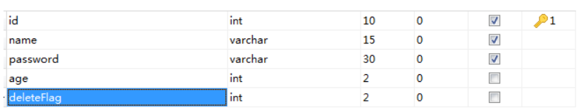
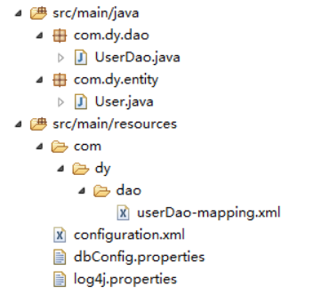
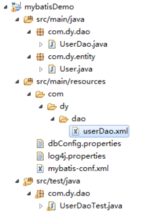
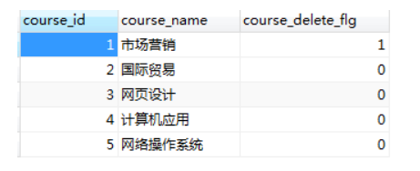
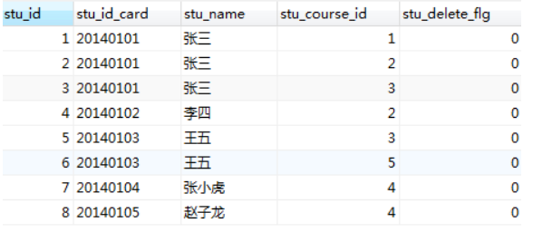
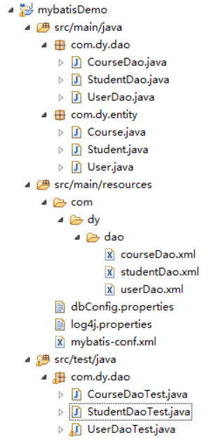
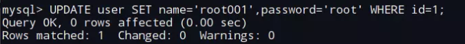

# MyBatis源码分析


参考文档：

https://www.cnblogs.com/dongying/p/4031382.html


# 一、Mybatis入门


最近两年 springmvc + mybatis 的在这种搭配还是蛮火的，楼主我呢，也从来没真正去接触过mybatis, 趁近日得闲，  就去学习一下mybatis吧。 本次拟根据自己的学习进度，做一次关于mybatis 的一系列教程， 记录自己的学习历程，  同时也给还没接触过mybatis的朋友探一次道。本系列教程拟  由浅（使用）入深（分析mybatis源码实现），故可能需要好长几天才能更新完。好啦，下面就开始本次的mybatis 学习之旅啦，  本次为第一篇教程， 就先简单地写个demo, 一起来认识一下mybatis吧。　　

　　为了方便，我使用了maven， 至于maven怎么使用， 我就不做介绍了。没用过maven的， 也不影响阅读。

## 1. Mybatis环境搭建及简单实例

1.新建web项目， 添加依赖包：mybatis包、数据库驱动包(我使用的是mysql)、日志包(我使用的是log4j)， 由于我的是maven项目， 那么添加依赖包就简单了，直接在pom.xml添加依赖即可。

pom.xml:

```xml
<dependencies>
    <!-- 添加junit -->
    <dependency>
        <groupId>junit</groupId>
        <artifactId>junit</artifactId>
        <version>4.11</version>
        <scope>test</scope>
    </dependency>

    <!-- 添加log4j -->
    <dependency>
        <groupId>log4j</groupId>
        <artifactId>log4j</artifactId>
        <version>1.2.16</version>
    </dependency>

    <!-- 添加mybatis -->
    <dependency>
        <groupId>org.mybatis</groupId>
        <artifactId>mybatis</artifactId>
        <version>3.2.6</version>
    </dependency>

    <!-- 添加mysql驱动 -->
    <dependency>
        <groupId>mysql</groupId>
        <artifactId>mysql-connector-java</artifactId>
        <version>5.1.12</version>
    </dependency>

</dependencies>
```


2.配置log4j, 配置mybatis

　　在classpath建立一个用于配置log4j的配置文件log4j.properties,  再建立一个用于配置Mybatis的配置文件configuration.xml（文件可随便命名）。log4j的配置，我就不多说，这儿主要说一下configuration.xml:

```xml
<?xml version="1.0" encoding="UTF-8" ?>
<!DOCTYPE configuration
  PUBLIC "-//mybatis.org//DTD Config 3.0//EN"
  "http://mybatis.org/dtd/mybatis-3-config.dtd">
<configuration>

  <!-- 指定properties配置文件， 我这里面配置的是数据库相关 -->
  <properties resource="dbConfig.properties"></properties>

  <!-- 指定Mybatis使用log4j -->
  <settings>
     <setting name="logImpl" value="LOG4J"/>
  </settings>

  <environments default="development">
    <environment id="development">
      <transactionManager type="JDBC"/>
      <dataSource type="POOLED">
          <!--
          如果上面没有指定数据库配置的properties文件，那么此处可以这样直接配置
        <property name="driver" value="com.mysql.jdbc.Driver"/>
        <property name="url" value="jdbc:mysql://localhost:3306/test1"/>
        <property name="username" value="root"/>
        <property name="password" value="root"/>
         -->

         <!-- 上面指定了数据库配置文件， 配置文件里面也是对应的这四个属性 -->
         <property name="driver" value="${driver}"/>
         <property name="url" value="${url}"/>
         <property name="username" value="${username}"/>
         <property name="password" value="${password}"/>

      </dataSource>
    </environment>
  </environments>

  <!-- 映射文件，mybatis精髓， 后面才会细讲 -->
  <mappers>
    <mapper resource="com/dy/dao/userDao-mapping.xml"/>
  </mappers>

</configuration>
```

3.开始写Demo

首先，在mysql数据库test1建立一张表user:




然后，开始编写java代码。

看看我的项目结构：



先编写一个实体类User: User类用于与User表相对应。

User:

```java
package com.dy.entity;

public class User {

    private int id;
    private String name;
    private String password;
    private int age;
    private int deleteFlag;

    public int getId() {
        return id;
    }
    public void setId(int id) {
        this.id = id;
    }
    public String getName() {
        return name;
    }
    public void setName(String name) {
        this.name = name;
    }
    public String getPassword() {
        return password;
    }
    public void setPassword(String password) {
        this.password = password;
    }
    public int getAge() {
        return age;
    }
    public void setAge(int age) {
        this.age = age;
    }
    public int getDeleteFlag() {
        return deleteFlag;
    }
    public void setDeleteFlag(int deleteFlag) {
        this.deleteFlag = deleteFlag;
    }

}
```

再编写一个UserDao 接口：

UserDao:

```java
package com.dy.dao;

import java.util.List;

import com.dy.entity.User;

public interface UserDao {

    public void insert(User user);

    public User findUserById (int userId);

    public List<User> findAllUsers();

}
```


再编写一个userDao-mapping.xml （可随便命名）:

userDao-mapping.xml:

```xml
<?xml version="1.0" encoding="UTF-8" ?>
<!DOCTYPE mapper
PUBLIC "-//ibatis.apache.org//DTD Mapper 3.0//EN"
"http://ibatis.apache.org/dtd/ibatis-3-mapper.dtd">
<mapper namespace="com.dy.dao.UserDao">

   <select id="findUserById" resultType="com.dy.entity.User" >
      select * from user where id = #{id}
   </select>

</mapper>
```


userDao-mapping.xml相当于是UserDao的实现， 同时也将User实体类与数据表User成功关联起来。

4.下面编写junit测试代码UserDaoTest：

UserDaoTest:


```
public class UserDaoTest {

    @Test
    public void findUserById() {
        SqlSession sqlSession = getSessionFactory().openSession();
        UserDao userMapper = sqlSession.getMapper(UserDao.class);
        User user = userMapper.findUserById(2);
        Assert.assertNotNull("没找到数据", user);
    }

    //Mybatis 通过SqlSessionFactory获取SqlSession, 然后才能通过SqlSession与数据库进行交互
    private static SqlSessionFactory getSessionFactory() {
        SqlSessionFactory sessionFactory = null;
        String resource = "configuration.xml";
        try {
            sessionFactory = new SqlSessionFactoryBuilder().build(Resources
                    .getResourceAsReader(resource));
        } catch (IOException e) {
            e.printStackTrace();
        }
        return sessionFactory;
    }

}
```

好啦，这样一个简单的mybatis 的demo就能成功运行啦。通过这个demo, 应该你就也能初步看出mybatis的运行机制，如果不清楚，也没关系。从下一篇文章开始，才开始正式讲解mybatis。


# 二、配置简介（mybatis源码篇）


本次，将简单介绍一下Mybatis的配置文件：

上次例子中，我们以 SqlSessionFactoryBuilder 去创建 SqlSessionFactory,  那么，我们就先从SqlSessionFactoryBuilder入手， 咱们先看看源码是怎么实现的：

SqlSessionFactoryBuilder源码片段：

```java
public class SqlSessionFactoryBuilder {

  //Reader读取mybatis配置文件，传入构造方法
  //除了Reader外，其实还有对应的inputStream作为参数的构造方法，
  //这也体现了mybatis配置的灵活性
  public SqlSessionFactory build(Reader reader) {
    return build(reader, null, null);
  }

  public SqlSessionFactory build(Reader reader, String environment) {
    return build(reader, environment, null);
  }

  //mybatis配置文件 + properties, 此时mybatis配置文件中可以不配置properties，也能使用${}形式
  public SqlSessionFactory build(Reader reader, Properties properties) {
    return build(reader, null, properties);
  }

  //通过XMLConfigBuilder解析mybatis配置，然后创建SqlSessionFactory对象
  public SqlSessionFactory build(Reader reader, String environment, Properties properties) {
    try {
      XMLConfigBuilder parser = new XMLConfigBuilder(reader, environment, properties);
      //下面看看这个方法的源码
      return build(parser.parse());
    } catch (Exception e) {
      throw ExceptionFactory.wrapException("Error building SqlSession.", e);
    } finally {
      ErrorContext.instance().reset();
      try {
        reader.close();
      } catch (IOException e) {
        // Intentionally ignore. Prefer previous error.
      }
    }
  }

  public SqlSessionFactory build(Configuration config) {
    return new DefaultSqlSessionFactory(config);
  }
}
```

通过源码，我们可以看到SqlSessionFactoryBuilder 通过XMLConfigBuilder 去解析我们传入的mybatis的配置文件， 下面就接着看看 XMLConfigBuilder 部分源码：

```java
/**
 * mybatis 配置文件解析
 */
public class XMLConfigBuilder extends BaseBuilder {
    public XMLConfigBuilder(InputStream inputStream, String environment, Properties props) {
        this(new XPathParser(inputStream, true, props, new XMLMapperEntityResolver()), environment, props);
    }

    private XMLConfigBuilder(XPathParser parser, String environment, Properties props) {
        super(new Configuration());
        ErrorContext.instance().resource("SQL Mapper Configuration");
        this.configuration.setVariables(props);
        this.parsed = false;
        this.environment = environment;
        this.parser = parser;
    }

    //外部调用此方法对mybatis配置文件进行解析
    public Configuration parse() {
        if (parsed) {
            throw new BuilderException("Each XMLConfigBuilder can only be used once.");
        }
        parsed = true;
        //从根节点configuration
        parseConfiguration(parser.evalNode("/configuration"));
        return configuration;
    }

    //此方法就是解析configuration节点下的子节点
    //由此也可看出，我们在configuration下面能配置的节点为以下10个节点
    private void parseConfiguration(XNode root) {
        try {
            propertiesElement(root.evalNode("properties")); //issue #117 read properties first
            typeAliasesElement(root.evalNode("typeAliases"));
            pluginElement(root.evalNode("plugins"));
            objectFactoryElement(root.evalNode("objectFactory"));
            objectWrapperFactoryElement(root.evalNode("objectWrapperFactory"));
            settingsElement(root.evalNode("settings"));
            environmentsElement(root.evalNode("environments")); // read it after objectFactory and objectWrapperFactory issue #631
            databaseIdProviderElement(root.evalNode("databaseIdProvider"));
            typeHandlerElement(root.evalNode("typeHandlers"));
            mapperElement(root.evalNode("mappers"));
        } catch (Exception e) {
            throw new BuilderException("Error parsing SQL Mapper Configuration. Cause: " + e, e);
        }
    }
}
```

通过以上源码，我们就能看出，在mybatis的配置文件中：

1.configuration节点为根节点。

2.在configuration节点之下，我们可以配置10个子节点，  分别为：properties、typeAliases、plugins、objectFactory、objectWrapperFactory、settings、environments、databaseIdProvider、typeHandlers、mappers。


# 三、配置详解之properties与environments


我们通过对mybatis源码的简单分析，可看出，在mybatis配置文件中，在configuration根节点下面，可配置properties、typeAliases、plugins、objectFactory、objectWrapperFactory、settings、environments、databaseIdProvider、typeHandlers、mappers这些节点。那么本次，就会先介绍properties节点和environments节点。

　　为了让大家能够更好地阅读mybatis源码，我先简单的给大家示例一下properties的使用方法。　

```xml
<configuration>
    <!-- 方法一： 从外部指定properties配置文件, 除了使用resource属性指定外，还可通过url属性指定url
  <properties resource="dbConfig.properties"></properties>
  -->
    <!-- 方法二： 直接配置为xml -->
    <properties>
        <property name="driver" value="com.mysql.jdbc.Driver"/>
        <property name="url" value="jdbc:mysql://localhost:3306/test1"/>
        <property name="username" value="root"/>
        <property name="password" value="root"/>
    </properties>
```

那么，我要是 两种方法都同时用了，那么哪种方法优先？

　　当以上两种方法都xml配置优先， 外部指定properties配置其次。至于为什么，接下来的源码分析会提到，请留意一下。

　　再看一下envirements元素节点的使用方法吧：

```xml
<environments default="development">
    <environment id="development">
        <transactionManager type="JDBC"/>
        <dataSource type="POOLED">
            <!--
          如果上面没有指定数据库配置的properties文件，那么此处可以这样直接配置 
        <property name="driver" value="com.mysql.jdbc.Driver"/>
        <property name="url" value="jdbc:mysql://localhost:3306/test1"/>
        <property name="username" value="root"/>
        <property name="password" value="root"/>
         -->

            <!-- 上面指定了数据库配置文件， 配置文件里面也是对应的这四个属性 -->
            <property name="driver" value="${driver}"/>
            <property name="url" value="${url}"/>
            <property name="username" value="${username}"/>
            <property name="password" value="${password}"/>

        </dataSource>
    </environment>

    <!-- 我再指定一个environment -->
    <environment id="test">
        <transactionManager type="JDBC"/>
        <dataSource type="POOLED">
            <property name="driver" value="com.mysql.jdbc.Driver"/>
            <!-- 与上面的url不一样 -->
            <property name="url" value="jdbc:mysql://localhost:3306/demo"/>
            <property name="username" value="root"/>
            <property name="password" value="root"/>
        </dataSource>
    </environment>

</environments>
```

environments元素节点可以配置多个environment子节点， 怎么理解呢？ 

　　假如我们系统的开发环境和正式环境所用的数据库不一样（这是肯定的），  那么可以设置两个environment,  两个id分别对应开发环境（dev）和正式环境（final），那么通过配置environments的default属性就能选择对应的environment了， 例如，我将environments的deault属性的值配置为dev, 那么就会选择dev的environment。 至于这个是怎么实现的，  下面源码就会讲。

　　好啦，上面简单给大家介绍了一下properties 和 environments 的配置， 接下来就正式开始看源码了：

　　上次我们说过mybatis 是通过XMLConfigBuilder这个类在解析mybatis配置文件的，那么本次就接着看看XMLConfigBuilder对于properties和environments的解析：

XMLConfigBuilder：

```java
public class XMLConfigBuilder extends BaseBuilder {

    private boolean parsed;
    //xml解析器
    private XPathParser parser;
    private String environment;

    //上次说到这个方法是在解析mybatis配置文件中能配置的元素节点
    //今天首先要看的就是properties节点和environments节点
    private void parseConfiguration(XNode root) {
        try {
          //解析properties元素
          propertiesElement(root.evalNode("properties")); //issue #117 read properties first
          typeAliasesElement(root.evalNode("typeAliases"));
          pluginElement(root.evalNode("plugins"));
          objectFactoryElement(root.evalNode("objectFactory"));
          objectWrapperFactoryElement(root.evalNode("objectWrapperFactory"));
          settingsElement(root.evalNode("settings"));
          //解析environments元素
          environmentsElement(root.evalNode("environments")); // read it after objectFactory and objectWrapperFactory issue #631
          databaseIdProviderElement(root.evalNode("databaseIdProvider"));
          typeHandlerElement(root.evalNode("typeHandlers"));
          mapperElement(root.evalNode("mappers"));
        } catch (Exception e) {
          throw new BuilderException("Error parsing SQL Mapper Configuration. Cause: " + e, e);
        }
    }


    //下面就看看解析properties的具体方法
    private void propertiesElement(XNode context) throws Exception {
        if (context != null) {
          //将子节点的 name 以及value属性set进properties对象
          //这儿可以注意一下顺序，xml配置优先， 外部指定properties配置其次
          Properties defaults = context.getChildrenAsProperties();
          //获取properties节点上 resource属性的值
          String resource = context.getStringAttribute("resource");
          //获取properties节点上 url属性的值, resource和url不能同时配置
          String url = context.getStringAttribute("url");
          if (resource != null && url != null) {
            throw new BuilderException("The properties element cannot specify both a URL and a resource based property file reference.  Please specify one or the other.");
          }
          //把解析出的properties文件set进Properties对象
          if (resource != null) {
            defaults.putAll(Resources.getResourceAsProperties(resource));
          } else if (url != null) {
            defaults.putAll(Resources.getUrlAsProperties(url));
          }
          //将configuration对象中已配置的Properties属性与刚刚解析的融合
          //configuration这个对象会装载所解析mybatis配置文件的所有节点元素，以后也会频频提到这个对象
          //既然configuration对象用有一系列的get/set方法， 那是否就标志着我们可以使用java代码直接配置？
          //答案是肯定的， 不过使用配置文件进行配置，优势不言而喻
          Properties vars = configuration.getVariables();
          if (vars != null) {
            defaults.putAll(vars);
          }
          //把装有解析配置propertis对象set进解析器， 因为后面可能会用到
          parser.setVariables(defaults);
          //set进configuration对象
          configuration.setVariables(defaults);
        }
    }

    //下面再看看解析enviroments元素节点的方法
    private void environmentsElement(XNode context) throws Exception {
        if (context != null) {
            if (environment == null) {
                //解析environments节点的default属性的值
                //例如: <environments default="development">
                environment = context.getStringAttribute("default");
            }
            //递归解析environments子节点
            for (XNode child : context.getChildren()) {
                //<environment id="development">, 只有enviroment节点有id属性，那么这个属性有何作用？
                //environments 节点下可以拥有多个 environment子节点
                //类似于这样： <environments default="development"><environment id="development">...</environment><environment id="test">...</environments>
                //意思就是我们可以对应多个环境，比如开发环境，测试环境等， 由environments的default属性去选择对应的enviroment
                String id = child.getStringAttribute("id");
                //isSpecial就是根据由environments的default属性去选择对应的enviroment
                if (isSpecifiedEnvironment(id)) {
                    //事务， mybatis有两种：JDBC 和 MANAGED, 配置为JDBC则直接使用JDBC的事务，配置为MANAGED则是将事务托管给容器，
                    TransactionFactory txFactory = transactionManagerElement(child.evalNode("transactionManager"));
                    //enviroment节点下面就是dataSource节点了，解析dataSource节点（下面会贴出解析dataSource的具体方法）
                    DataSourceFactory dsFactory = dataSourceElement(child.evalNode("dataSource"));
                    DataSource dataSource = dsFactory.getDataSource();
                    Environment.Builder environmentBuilder = new Environment.Builder(id)
                          .transactionFactory(txFactory)
                          .dataSource(dataSource);
                    //老规矩，会将dataSource设置进configuration对象
                    configuration.setEnvironment(environmentBuilder.build());
                }
            }
        }
    }

    //下面看看dataSource的解析方法
    private DataSourceFactory dataSourceElement(XNode context) throws Exception {
        if (context != null) {
            //dataSource的连接池
            String type = context.getStringAttribute("type");
            //子节点 name, value属性set进一个properties对象
            Properties props = context.getChildrenAsProperties();
            //创建dataSourceFactory
            DataSourceFactory factory = (DataSourceFactory) resolveClass(type).newInstance();
            factory.setProperties(props);
            return factory;
        }
        throw new BuilderException("Environment declaration requires a DataSourceFactory.");
    }
}
```

通过以上对mybatis源码的解读，相信大家对mybatis的配置又有了一个深入的认识。

　　还有一个问题， 上面我们看到，在配置dataSource的时候使用了 ${driver} 这种表达式， 这种形式是怎么解析的？其实，是通过PropertyParser这个类解析：

PropertyParser：

```java
/**
 * 这个类解析${}这种形式的表达式
 */
public class PropertyParser {

  public static String parse(String string, Properties variables) {
    VariableTokenHandler handler = new VariableTokenHandler(variables);
    GenericTokenParser parser = new GenericTokenParser("${", "}", handler);
    return parser.parse(string);
  }

  private static class VariableTokenHandler implements TokenHandler {
    private Properties variables;

    public VariableTokenHandler(Properties variables) {
      this.variables = variables;
    }

    public String handleToken(String content) {
      if (variables != null && variables.containsKey(content)) {
        return variables.getProperty(content);
      }
      return "${" + content + "}";
    }
  }
}
```

好啦，以上就是对于properties 和 environments元素节点的分析，比较重要的都在对于源码的注释中标出。本次文章到此结束，接下来的文章会继续分析其他节点的配置。


# 四、配置详解之typeAliases别名

上篇文章《[深入浅出Mybatis系列（三）---配置详解之properties与environments（mybatis源码篇）](http://www.cnblogs.com/dongying/p/4036796.html)》 介绍了properties与environments， 本篇继续讲剩下的配置节点之一：typeAliases。 typeAliases节点主要用来设置别名，其实这是挺好用的一个功能， 通过配置别名，我们不用再指定完整的包名，并且还能取别名。

　　例如： 我们在使用 com.demo.entity. UserEntity 的时候，我们可以直接配置一个别名user, 这样以后在配置文件中要使用到com.demo.entity. UserEntity的时候，直接使用User即可。

　　就以上例为例，我们来实现一下，看看typeAliases的配置方法：　　

```xml
<configuration>
    <typeAliases>
      <!--
      通过package, 可以直接指定package的名字， mybatis会自动扫描你指定包下面的javabean,
      并且默认设置一个别名，默认的名字为： javabean 的首字母小写的非限定类名来作为它的别名。
      也可在javabean 加上注解@Alias 来自定义别名， 例如： @Alias(user) 
      <package name="com.dy.entity"/>
       -->
      <typeAlias alias="UserEntity" type="com.dy.entity.User"/>
  </typeAliases>
  
  ......
  
</configuration>
```

再写一段测试代码，看看有没生效：（我只写一段伪代码）

```java
Configuration con = sqlSessionFactory.getConfiguration();
Map<String, Class<?>> typeMap = con.getTypeAliasRegistry().getTypeAliases();
for(Entry<String, Class<?>> entry: typeMap.entrySet()) {
    System.out.println(entry.getKey() + " ================> " + entry.getValue().getSimpleName());
}
```

=======================================我是源码分割线==============================================

上面给大家简单介绍了typeAliases的用法， 接下来就看看Mybatis中的源码了：

老规矩，先从对xml的解析讲起：

```java
/**
 * 解析typeAliases节点
 */
private void typeAliasesElement(XNode parent) {
    if (parent != null) {
        for (XNode child : parent.getChildren()) {
            //如果子节点是package, 那么就获取package节点的name属性， mybatis会扫描指定的package
            if ("package".equals(child.getName())) {
                String typeAliasPackage = child.getStringAttribute("name");
                //TypeAliasRegistry 负责管理别名， 这儿就是通过TypeAliasRegistry 进行别名注册， 下面就会看看TypeAliasRegistry源码
                configuration.getTypeAliasRegistry().registerAliases(typeAliasPackage);
            } else {
                //如果子节点是typeAlias节点，那么就获取alias属性和type的属性值
                String alias = child.getStringAttribute("alias");
                String type = child.getStringAttribute("type");
                try {
                    Class<?> clazz = Resources.classForName(type);
                    if (alias == null) {
                        typeAliasRegistry.registerAlias(clazz);
                    } else {
                        typeAliasRegistry.registerAlias(alias, clazz);
                    }
                } catch (ClassNotFoundException e) {
                    throw new BuilderException("Error registering typeAlias for '" + alias + "'. Cause: " + e, e);
                }
            }
        }
    }
}
```

重要的源码在这儿：

TypeAliasRegistry：

```java
public class TypeAliasRegistry {

    //这就是核心所在啊， 原来别名就仅仅通过一个HashMap来实现， key为别名， value就是别名对应的类型（class对象）
    private final Map<String, Class<?>> TYPE_ALIASES = new HashMap<String, Class<?>>();

    /**
   * 以下就是mybatis默认为我们注册的别名
   */
    public TypeAliasRegistry() {
        registerAlias("string", String.class);

        registerAlias("byte", Byte.class);
        registerAlias("long", Long.class);
        registerAlias("short", Short.class);
        registerAlias("int", Integer.class);
        registerAlias("integer", Integer.class);
        registerAlias("double", Double.class);
        registerAlias("float", Float.class);
        registerAlias("boolean", Boolean.class);

        registerAlias("byte[]", Byte[].class);
        registerAlias("long[]", Long[].class);
        registerAlias("short[]", Short[].class);
        registerAlias("int[]", Integer[].class);
        registerAlias("integer[]", Integer[].class);
        registerAlias("double[]", Double[].class);
        registerAlias("float[]", Float[].class);
        registerAlias("boolean[]", Boolean[].class);

        registerAlias("_byte", byte.class);
        registerAlias("_long", long.class);
        registerAlias("_short", short.class);
        registerAlias("_int", int.class);
        registerAlias("_integer", int.class);
        registerAlias("_double", double.class);
        registerAlias("_float", float.class);
        registerAlias("_boolean", boolean.class);

        registerAlias("_byte[]", byte[].class);
        registerAlias("_long[]", long[].class);
        registerAlias("_short[]", short[].class);
        registerAlias("_int[]", int[].class);
        registerAlias("_integer[]", int[].class);
        registerAlias("_double[]", double[].class);
        registerAlias("_float[]", float[].class);
        registerAlias("_boolean[]", boolean[].class);

        registerAlias("date", Date.class);
        registerAlias("decimal", BigDecimal.class);
        registerAlias("bigdecimal", BigDecimal.class);
        registerAlias("biginteger", BigInteger.class);
        registerAlias("object", Object.class);

        registerAlias("date[]", Date[].class);
        registerAlias("decimal[]", BigDecimal[].class);
        registerAlias("bigdecimal[]", BigDecimal[].class);
        registerAlias("biginteger[]", BigInteger[].class);
        registerAlias("object[]", Object[].class);

        registerAlias("map", Map.class);
        registerAlias("hashmap", HashMap.class);
        registerAlias("list", List.class);
        registerAlias("arraylist", ArrayList.class);
        registerAlias("collection", Collection.class);
        registerAlias("iterator", Iterator.class);

        registerAlias("ResultSet", ResultSet.class);
    }


    /**
   * 处理别名， 直接从保存有别名的hashMap中取出即可
   */
    @SuppressWarnings("unchecked")
    public <T> Class<T> resolveAlias(String string) {
        try {
            if (string == null) return null;
            String key = string.toLowerCase(Locale.ENGLISH); // issue #748
            Class<T> value;
            if (TYPE_ALIASES.containsKey(key)) {
                value = (Class<T>) TYPE_ALIASES.get(key);
            } else {
                value = (Class<T>) Resources.classForName(string);
            }
            return value;
        } catch (ClassNotFoundException e) {
            throw new TypeException("Could not resolve type alias '" + string + "'.  Cause: " + e, e);
        }
    }

    /**
   * 配置文件中配置为package的时候， 会调用此方法，根据配置的报名去扫描javabean ，然后自动注册别名
   * 默认会使用 Bean 的首字母小写的非限定类名来作为它的别名
   * 也可在javabean 加上注解@Alias 来自定义别名， 例如： @Alias(user)
   */
    public void registerAliases(String packageName){
        registerAliases(packageName, Object.class);
    }

    public void registerAliases(String packageName, Class<?> superType){
        ResolverUtil<Class<?>> resolverUtil = new ResolverUtil<Class<?>>();
        resolverUtil.find(new ResolverUtil.IsA(superType), packageName);
        Set<Class<? extends Class<?>>> typeSet = resolverUtil.getClasses();
        for(Class<?> type : typeSet){
            // Ignore inner classes and interfaces (including package-info.java)
            // Skip also inner classes. See issue #6
            if (!type.isAnonymousClass() && !type.isInterface() && !type.isMemberClass()) {
                registerAlias(type);
            }
        }
    }

    public void registerAlias(Class<?> type) {
        String alias = type.getSimpleName();
        Alias aliasAnnotation = type.getAnnotation(Alias.class);
        if (aliasAnnotation != null) {
            alias = aliasAnnotation.value();
        } 
        registerAlias(alias, type);
    }

    //这就是注册别名的本质方法， 其实就是向保存别名的hashMap新增值而已， 呵呵， 别名的实现太简单了，对吧
    public void registerAlias(String alias, Class<?> value) {
        if (alias == null) throw new TypeException("The parameter alias cannot be null");
        String key = alias.toLowerCase(Locale.ENGLISH); // issue #748
        if (TYPE_ALIASES.containsKey(key) && TYPE_ALIASES.get(key) != null && !TYPE_ALIASES.get(key).equals(value)) {
            throw new TypeException("The alias '" + alias + "' is already mapped to the value '" + TYPE_ALIASES.get(key).getName() + "'.");
        }
        TYPE_ALIASES.put(key, value);
    }

    public void registerAlias(String alias, String value) {
        try {
            registerAlias(alias, Resources.classForName(value));
        } catch (ClassNotFoundException e) {
            throw new TypeException("Error registering type alias "+alias+" for "+value+". Cause: " + e, e);
        }
    }

    /**
   * 获取保存别名的HashMap, Configuration对象持有对TypeAliasRegistry的引用，因此，如果需要，我们可以通过Configuration对象获取
   */
    public Map<String, Class<?>> getTypeAliases() {
        return Collections.unmodifiableMap(TYPE_ALIASES);
    }

}
```

由源码可见，设置别名的原理就这么简单，Mybatis默认给我们设置了不少别名，在上面代码中都可以见到。

好啦，本篇内容就是这么简单，到此为止。 下篇将继续讲解还没讲完的配置节点。


# 五、TypeHandler简介及配置

上篇文章《[深入浅出Mybatis系列（四）---配置详解之typeAliases别名（mybatis源码篇）](http://www.cnblogs.com/dongying/p/4037678.html)》为大家介绍了mybatis中别名的使用，以及其源码。本篇将为大家介绍TypeHandler， 并简单分析其源码。

Mybatis中的TypeHandler是什么？

　　无论是 MyBatis  在预处理语句（PreparedStatement）中设置一个参数时，还是从结果集中取出一个值时，都会用类型处理器将获取的值以合适的方式转换成  Java 类型。Mybatis默认为我们实现了许多TypeHandler,  当我们没有配置指定TypeHandler时，Mybatis会根据参数或者返回结果的不同，默认为我们选择合适的TypeHandler处理。

那么，Mybatis为我们实现了哪些TypeHandler呢?  我们怎么自定义实现一个TypeHandler ?  这些都会在接下来的mybatis的源码中看到。

在看源码之前，还是像之前一样，先看看怎么配置吧？

配置TypeHandler:

```xml
<configuration>
    <typeHandlers>
      <!-- 
          当配置package的时候，mybatis会去配置的package扫描TypeHandler
          <package name="com.dy.demo"/>
       -->
      
      <!-- handler属性直接配置我们要指定的TypeHandler -->
      <typeHandler handler=""/>
      
      <!-- javaType 配置java类型，例如String, 如果配上javaType, 那么指定的typeHandler就只作用于指定的类型 -->
      <typeHandler javaType="" handler=""/>
      
      <!-- jdbcType 配置数据库基本数据类型，例如varchar, 如果配上jdbcType, 那么指定的typeHandler就只作用于指定的类型  -->
      <typeHandler jdbcType="" handler=""/>
      
      <!-- 也可两者都配置 -->
      <typeHandler javaType="" jdbcType="" handler=""/>
      
  </typeHandlers>
  
  ......
  
</configuration>
```

上面简单介绍了一下TypeHandler,  下面就看看mybatis中TypeHandler的源码了。


```java
/**
 * 解析typeHandlers节点
 */
private void typeHandlerElement(XNode parent) throws Exception {
    if (parent != null) {
        for (XNode child : parent.getChildren()) {
            //子节点为package时，获取其name属性的值，然后自动扫描package下的自定义typeHandler
            if ("package".equals(child.getName())) {
                String typeHandlerPackage = child.getStringAttribute("name");
                typeHandlerRegistry.register(typeHandlerPackage);
            } else {
                //子节点为typeHandler时， 可以指定javaType属性， 也可以指定jdbcType, 也可两者都指定
                //javaType 是指定java类型
                //jdbcType 是指定jdbc类型（数据库类型： 如varchar）
                String javaTypeName = child.getStringAttribute("javaType");
                String jdbcTypeName = child.getStringAttribute("jdbcType");
                //handler就是我们配置的typeHandler
                String handlerTypeName = child.getStringAttribute("handler");
                //resolveClass方法就是我们上篇文章所讲的TypeAliasRegistry里面处理别名的方法
                Class<?> javaTypeClass = resolveClass(javaTypeName);
                //JdbcType是一个枚举类型，resolveJdbcType方法是在获取枚举类型的值
                JdbcType jdbcType = resolveJdbcType(jdbcTypeName);
                Class<?> typeHandlerClass = resolveClass(handlerTypeName);
                //注册typeHandler, typeHandler通过TypeHandlerRegistry这个类管理
                if (javaTypeClass != null) {
                    if (jdbcType == null) {
                        typeHandlerRegistry.register(javaTypeClass, typeHandlerClass);
                    } else {
                        typeHandlerRegistry.register(javaTypeClass, jdbcType, typeHandlerClass);
                    }
                } else {
                    typeHandlerRegistry.register(typeHandlerClass);
                }
            }
        }
    }
}
```

接下来看看TypeHandler的管理注册类：

TypeHandlerRegistry：

```java
/**
 * typeHandler注册管理类
 */
public final class TypeHandlerRegistry {

    //源码一上来，二话不说，几个大大的HashMap就出现，这不又跟上次讲的typeAliases的注册类似么

    //基本数据类型与其包装类
    private static final Map<Class<?>, Class<?>> reversePrimitiveMap = new HashMap<Class<?>, Class<?>>() {
        private static final long serialVersionUID = 1L;
        {
            put(Byte.class, byte.class);
            put(Short.class, short.class);
            put(Integer.class, int.class);
            put(Long.class, long.class);
            put(Float.class, float.class);
            put(Double.class, double.class);
            put(Boolean.class, boolean.class);
            put(Character.class, char.class);
        }
    };

    //这几个MAP不用说就知道存的是什么东西吧，命名的好处
    private final Map<JdbcType, TypeHandler<?>> JDBC_TYPE_HANDLER_MAP = new EnumMap<JdbcType, TypeHandler<?>>(JdbcType.class);
    private final Map<Type, Map<JdbcType, TypeHandler<?>>> TYPE_HANDLER_MAP = new HashMap<Type, Map<JdbcType, TypeHandler<?>>>();
    private final TypeHandler<Object> UNKNOWN_TYPE_HANDLER = new UnknownTypeHandler(this);
    private final Map<Class<?>, TypeHandler<?>> ALL_TYPE_HANDLERS_MAP = new HashMap<Class<?>, TypeHandler<?>>();

    //就像上篇文章讲的typeAliases一样，mybatis也默认给我们注册了不少的typeHandler
    //具体如下
    public TypeHandlerRegistry() {
        register(Boolean.class, new BooleanTypeHandler());
        register(boolean.class, new BooleanTypeHandler());
        register(JdbcType.BOOLEAN, new BooleanTypeHandler());
        register(JdbcType.BIT, new BooleanTypeHandler());

        register(Byte.class, new ByteTypeHandler());
        register(byte.class, new ByteTypeHandler());
        register(JdbcType.TINYINT, new ByteTypeHandler());

        register(Short.class, new ShortTypeHandler());
        register(short.class, new ShortTypeHandler());
        register(JdbcType.SMALLINT, new ShortTypeHandler());

        register(Integer.class, new IntegerTypeHandler());
        register(int.class, new IntegerTypeHandler());
        register(JdbcType.INTEGER, new IntegerTypeHandler());

        register(Long.class, new LongTypeHandler());
        register(long.class, new LongTypeHandler());

        register(Float.class, new FloatTypeHandler());
        register(float.class, new FloatTypeHandler());
        register(JdbcType.FLOAT, new FloatTypeHandler());

        register(Double.class, new DoubleTypeHandler());
        register(double.class, new DoubleTypeHandler());
        register(JdbcType.DOUBLE, new DoubleTypeHandler());

        register(String.class, new StringTypeHandler());
        register(String.class, JdbcType.CHAR, new StringTypeHandler());
        register(String.class, JdbcType.CLOB, new ClobTypeHandler());
        register(String.class, JdbcType.VARCHAR, new StringTypeHandler());
        register(String.class, JdbcType.LONGVARCHAR, new ClobTypeHandler());
        register(String.class, JdbcType.NVARCHAR, new NStringTypeHandler());
        register(String.class, JdbcType.NCHAR, new NStringTypeHandler());
        register(String.class, JdbcType.NCLOB, new NClobTypeHandler());
        register(JdbcType.CHAR, new StringTypeHandler());
        register(JdbcType.VARCHAR, new StringTypeHandler());
        register(JdbcType.CLOB, new ClobTypeHandler());
        register(JdbcType.LONGVARCHAR, new ClobTypeHandler());
        register(JdbcType.NVARCHAR, new NStringTypeHandler());
        register(JdbcType.NCHAR, new NStringTypeHandler());
        register(JdbcType.NCLOB, new NClobTypeHandler());

        register(Object.class, JdbcType.ARRAY, new ArrayTypeHandler());
        register(JdbcType.ARRAY, new ArrayTypeHandler());

        register(BigInteger.class, new BigIntegerTypeHandler());
        register(JdbcType.BIGINT, new LongTypeHandler());

        register(BigDecimal.class, new BigDecimalTypeHandler());
        register(JdbcType.REAL, new BigDecimalTypeHandler());
        register(JdbcType.DECIMAL, new BigDecimalTypeHandler());
        register(JdbcType.NUMERIC, new BigDecimalTypeHandler());

        register(Byte[].class, new ByteObjectArrayTypeHandler());
        register(Byte[].class, JdbcType.BLOB, new BlobByteObjectArrayTypeHandler());
        register(Byte[].class, JdbcType.LONGVARBINARY, new BlobByteObjectArrayTypeHandler());
        register(byte[].class, new ByteArrayTypeHandler());
        register(byte[].class, JdbcType.BLOB, new BlobTypeHandler());
        register(byte[].class, JdbcType.LONGVARBINARY, new BlobTypeHandler());
        register(JdbcType.LONGVARBINARY, new BlobTypeHandler());
        register(JdbcType.BLOB, new BlobTypeHandler());

        register(Object.class, UNKNOWN_TYPE_HANDLER);
        register(Object.class, JdbcType.OTHER, UNKNOWN_TYPE_HANDLER);
        register(JdbcType.OTHER, UNKNOWN_TYPE_HANDLER);

        register(Date.class, new DateTypeHandler());
        register(Date.class, JdbcType.DATE, new DateOnlyTypeHandler());
        register(Date.class, JdbcType.TIME, new TimeOnlyTypeHandler());
        register(JdbcType.TIMESTAMP, new DateTypeHandler());
        register(JdbcType.DATE, new DateOnlyTypeHandler());
        register(JdbcType.TIME, new TimeOnlyTypeHandler());

        register(java.sql.Date.class, new SqlDateTypeHandler());
        register(java.sql.Time.class, new SqlTimeTypeHandler());
        register(java.sql.Timestamp.class, new SqlTimestampTypeHandler());

        // issue #273
        register(Character.class, new CharacterTypeHandler());
        register(char.class, new CharacterTypeHandler());
    }

    public boolean hasTypeHandler(Class<?> javaType) {
        return hasTypeHandler(javaType, null);
    }

    public boolean hasTypeHandler(TypeReference<?> javaTypeReference) {
        return hasTypeHandler(javaTypeReference, null);
    }

    public boolean hasTypeHandler(Class<?> javaType, JdbcType jdbcType) {
        return javaType != null && getTypeHandler((Type) javaType, jdbcType) != null;
    }

    public boolean hasTypeHandler(TypeReference<?> javaTypeReference, JdbcType jdbcType) {
        return javaTypeReference != null && getTypeHandler(javaTypeReference, jdbcType) != null;
    }

    public TypeHandler<?> getMappingTypeHandler(Class<? extends TypeHandler<?>> handlerType) {
        return ALL_TYPE_HANDLERS_MAP.get(handlerType);
    }

    public <T> TypeHandler<T> getTypeHandler(Class<T> type) {
        return getTypeHandler((Type) type, null);
    }

    public <T> TypeHandler<T> getTypeHandler(TypeReference<T> javaTypeReference) {
        return getTypeHandler(javaTypeReference, null);
    }

    public TypeHandler<?> getTypeHandler(JdbcType jdbcType) {
        return JDBC_TYPE_HANDLER_MAP.get(jdbcType);
    }

    public <T> TypeHandler<T> getTypeHandler(Class<T> type, JdbcType jdbcType) {
        return getTypeHandler((Type) type, jdbcType);
    }

    public <T> TypeHandler<T> getTypeHandler(TypeReference<T> javaTypeReference, JdbcType jdbcType) {
        return getTypeHandler(javaTypeReference.getRawType(), jdbcType);
    }

    private <T> TypeHandler<T> getTypeHandler(Type type, JdbcType jdbcType) {
        Map<JdbcType, TypeHandler<?>> jdbcHandlerMap = TYPE_HANDLER_MAP.get(type);
        TypeHandler<?> handler = null;
        if (jdbcHandlerMap != null) {
            handler = jdbcHandlerMap.get(jdbcType);
            if (handler == null) {
                handler = jdbcHandlerMap.get(null);
            }
        }
        if (handler == null && type != null && type instanceof Class && Enum.class.isAssignableFrom((Class<?>) type)) {
            handler = new EnumTypeHandler((Class<?>) type);
        }
        @SuppressWarnings("unchecked")
        // type drives generics here
        TypeHandler<T> returned = (TypeHandler<T>) handler;
        return returned;
    }

    public TypeHandler<Object> getUnknownTypeHandler() {
        return UNKNOWN_TYPE_HANDLER;
    }

    public void register(JdbcType jdbcType, TypeHandler<?> handler) {
        JDBC_TYPE_HANDLER_MAP.put(jdbcType, handler);
    }

    //
    // REGISTER INSTANCE
    //

    /**
   * 只配置了typeHandler, 没有配置jdbcType 或者javaType
   */
    @SuppressWarnings("unchecked")
    public <T> void register(TypeHandler<T> typeHandler) {
        boolean mappedTypeFound = false;
        //在自定义typeHandler的时候，可以加上注解MappedTypes 去指定关联的javaType
        //因此，此处需要扫描MappedTypes注解
        MappedTypes mappedTypes = typeHandler.getClass().getAnnotation(MappedTypes.class);
        if (mappedTypes != null) {
            for (Class<?> handledType : mappedTypes.value()) {
                register(handledType, typeHandler);
                mappedTypeFound = true;
            }
        }
        // @since 3.1.0 - try to auto-discover the mapped type
        if (!mappedTypeFound && typeHandler instanceof TypeReference) {
            try {
                TypeReference<T> typeReference = (TypeReference<T>) typeHandler;
                register(typeReference.getRawType(), typeHandler);
                mappedTypeFound = true;
            } catch (Throwable t) {
                // maybe users define the TypeReference with a different type and are not assignable, so just ignore it
            }
        }
        if (!mappedTypeFound) {
            register((Class<T>) null, typeHandler);
        }
    }

    /**
   * 配置了typeHandlerhe和javaType
   */
    public <T> void register(Class<T> javaType, TypeHandler<? extends T> typeHandler) {
        register((Type) javaType, typeHandler);
    }

    private <T> void register(Type javaType, TypeHandler<? extends T> typeHandler) {
        //扫描注解MappedJdbcTypes
        MappedJdbcTypes mappedJdbcTypes = typeHandler.getClass().getAnnotation(MappedJdbcTypes.class);
        if (mappedJdbcTypes != null) {
            for (JdbcType handledJdbcType : mappedJdbcTypes.value()) {
                register(javaType, handledJdbcType, typeHandler);
            }
            if (mappedJdbcTypes.includeNullJdbcType()) {
                register(javaType, null, typeHandler);
            }
        } else {
            register(javaType, null, typeHandler);
        }
    }

    public <T> void register(TypeReference<T> javaTypeReference, TypeHandler<? extends T> handler) {
        register(javaTypeReference.getRawType(), handler);
    }

    /**
   * typeHandlerhe、javaType、jdbcType都配置了
   */
    public <T> void register(Class<T> type, JdbcType jdbcType, TypeHandler<? extends T> handler) {
        register((Type) type, jdbcType, handler);
    }

    /**
   * 注册typeHandler的核心方法
   * 就是向Map新增数据而已
   */
    private void register(Type javaType, JdbcType jdbcType, TypeHandler<?> handler) {
        if (javaType != null) {
            Map<JdbcType, TypeHandler<?>> map = TYPE_HANDLER_MAP.get(javaType);
            if (map == null) {
                map = new HashMap<JdbcType, TypeHandler<?>>();
                TYPE_HANDLER_MAP.put(javaType, map);
            }
            map.put(jdbcType, handler);
            if (reversePrimitiveMap.containsKey(javaType)) {
                register(reversePrimitiveMap.get(javaType), jdbcType, handler);
            }
        }
        ALL_TYPE_HANDLERS_MAP.put(handler.getClass(), handler);
    }

    //
    // REGISTER CLASS
    //

    // Only handler type

    public void register(Class<?> typeHandlerClass) {
        boolean mappedTypeFound = false;
        MappedTypes mappedTypes = typeHandlerClass.getAnnotation(MappedTypes.class);
        if (mappedTypes != null) {
            for (Class<?> javaTypeClass : mappedTypes.value()) {
                register(javaTypeClass, typeHandlerClass);
                mappedTypeFound = true;
            }
        }
        if (!mappedTypeFound) {
            register(getInstance(null, typeHandlerClass));
        }
    }

    // java type + handler type

    public void register(Class<?> javaTypeClass, Class<?> typeHandlerClass) {
        register(javaTypeClass, getInstance(javaTypeClass, typeHandlerClass));
    }

    // java type + jdbc type + handler type

    public void register(Class<?> javaTypeClass, JdbcType jdbcType, Class<?> typeHandlerClass) {
        register(javaTypeClass, jdbcType, getInstance(javaTypeClass, typeHandlerClass));
    }

    // Construct a handler (used also from Builders)

    @SuppressWarnings("unchecked")
    public <T> TypeHandler<T> getInstance(Class<?> javaTypeClass, Class<?> typeHandlerClass) {
        if (javaTypeClass != null) {
            try {
                Constructor<?> c = typeHandlerClass.getConstructor(Class.class);
                return (TypeHandler<T>) c.newInstance(javaTypeClass);
            } catch (NoSuchMethodException ignored) {
                // ignored
            } catch (Exception e) {
                throw new TypeException("Failed invoking constructor for handler " + typeHandlerClass, e);
            }
        }
        try {
            Constructor<?> c = typeHandlerClass.getConstructor();
            return (TypeHandler<T>) c.newInstance();
        } catch (Exception e) {
            throw new TypeException("Unable to find a usable constructor for " + typeHandlerClass, e);
        }
    }


    /**
   * 根据指定的pacakge去扫描自定义的typeHander，然后注册
   */
    public void register(String packageName) {
        ResolverUtil<Class<?>> resolverUtil = new ResolverUtil<Class<?>>();
        resolverUtil.find(new ResolverUtil.IsA(TypeHandler.class), packageName);
        Set<Class<? extends Class<?>>> handlerSet = resolverUtil.getClasses();
        for (Class<?> type : handlerSet) {
            //Ignore inner classes and interfaces (including package-info.java) and abstract classes
            if (!type.isAnonymousClass() && !type.isInterface() && !Modifier.isAbstract(type.getModifiers())) {
                register(type);
            }
        }
    }

    // get information

    /**
   * 通过configuration对象可以获取已注册的所有typeHandler
   */
    public Collection<TypeHandler<?>> getTypeHandlers() {
        return Collections.unmodifiableCollection(ALL_TYPE_HANDLERS_MAP.values());
    }

}
```

由源码可以看到， mybatis为我们实现了那么多TypeHandler,  随便打开一个TypeHandler，看其源码，都可以看到，它继承自一个抽象类：BaseTypeHandler， 那么我们是不是也能通过继承BaseTypeHandler，从而实现自定义的TypeHandler ? 答案是肯定的， 那么现在下面就为大家演示一下自定义TypeHandler:

=====================================================自定义TypeHandler分割线============================================================

ExampleTypeHandler:

```java
@MappedJdbcTypes(JdbcType.VARCHAR)  //此处如果不用注解指定jdbcType, 那么，就可以在配置文件中通过"jdbcType"属性指定， 同理， javaType 也可通过 @MappedTypes指定
public class ExampleTypeHandler extends BaseTypeHandler<String> {

    @Override
    public void setNonNullParameter(PreparedStatement ps, int i, String parameter, JdbcType jdbcType) throws SQLException {
        ps.setString(i, parameter);
    }

    @Override
    public String getNullableResult(ResultSet rs, String columnName) throws SQLException {
        return rs.getString(columnName);
    }

    @Override
    public String getNullableResult(ResultSet rs, int columnIndex) throws SQLException {
        return rs.getString(columnIndex);
    }

    @Override
    public String getNullableResult(CallableStatement cs, int columnIndex) throws SQLException {
        return cs.getString(columnIndex);
    }
}
```

然后，就该配置我们的自定义TypeHandler了：

```xml
<configuration>
  <typeHandlers>
      <!-- 由于自定义的TypeHandler在定义时已经通过注解指定了jdbcType, 所以此处不用再配置jdbcType -->
      <typeHandler handler="ExampleTypeHandler"/>
  </typeHandlers>
  
  ......
  
</configuration>
```

也就是说，我们在自定义TypeHandler的时候，可以在TypeHandler通过@MappedJdbcTypes指定jdbcType, 通过 @MappedTypes 指定javaType, 如果没有使用注解指定，那么我们就需要在配置文件中配置。

好啦，本篇文章到此结束。


# 六、objectFactory、plugins、mappers简介与配置

上篇文章《[深入浅出Mybatis系列（五）---TypeHandler简介及配置（mybatis源码篇）](http://www.cnblogs.com/dongying/p/4040435.html)》简单看了一下TypeHandler， 本次将结束对于mybatis的配置文件的学习， 本次涉及到剩下没提及到的几个节点的配置：objectFactory、databaseIdProvider、plugins、mappers。

那么，接下来，就简单介绍一下这几个配置的作用吧：

1、objectFactory是干什么的？ 需要配置吗？

　　MyBatis  每次创建结果对象的新实例时，它都会使用一个对象工厂（ObjectFactory）实例来完成。默认的对象工厂需要做的仅仅是实例化目标类，要么通过默认构造方法，要么在参数映射存在的时候通过参数构造方法来实例化。默认情况下，我们不需要配置，mybatis会调用默认实现的objectFactory。 除非我们要自定义ObjectFactory的实现， 那么我们才需要去手动配置。

　　那么怎么自定义实现ObjectFactory？ 怎么配置呢？

　　自定义ObjectFactory只需要去继承DefaultObjectFactory（是ObjectFactory接口的实现类），并重写其方法即可。具体的，本处不多说，后面再具体讲解。

　　写好了ObjectFactory, 仅需做如下配置： 

```xml
<configuration>
    ......
    <objectFactory type="org.mybatis.example.ExampleObjectFactory">
        <property name="someProperty" value="100"/>
    </objectFactory>
    ......
</configuration
```

2、plugin有何作用？ 需要配置吗？

　　plugins 是一个可选配置。mybatis中的plugin其实就是个interceptor， 它可以拦截Executor  、ParameterHandler 、ResultSetHandler 、StatementHandler  的部分方法，处理我们自己的逻辑。Executor就是真正执行sql语句的东西， ParameterHandler  是处理我们传入参数的，还记得前面讲TypeHandler的时候提到过，mybatis默认帮我们实现了不少的typeHandler,  当我们不显示配置typeHandler的时候，mybatis会根据参数类型自动选择合适的typeHandler执行，其实就是ParameterHandler 在选择。ResultSetHandler 就是处理返回结果的。

　  怎么自定义plugin ? 怎么配置？

　  要自定义一个plugin, 需要去实现Interceptor接口， 这儿不细说， 后面实战部分会详细讲解。定义好之后，配置如下：

```xml
<configuration>
    ......
    <plugins>
        <plugin interceptor="org.mybatis.example.ExamplePlugin">
            <property name="someProperty" value="100"/>
        </plugin>
    </plugins>
    ......
</configuration>
```

3、mappers, 这下引出mybatis的核心之一了，mappers作用 ? 需要配置吗？

　　mappers 节点下，配置我们的mapper映射文件， 所谓的mapper映射文件，就是让mybatis  用来建立数据表和javabean映射的一个桥梁。在我们实际开发中，通常一个mapper文件对应一个dao接口，  这个mapper可以看做是dao的实现。所以,mappers必须配置。

　　那么怎么配置呢？

```xml
<configuration>
    ......
    <mappers>
        <!-- 第一种方式：通过resource指定 -->
        <mapper resource="com/dy/dao/userDao.xml"/>

        <!-- 第二种方式， 通过class指定接口，进而将接口与对应的xml文件形成映射关系
             不过，使用这种方式必须保证 接口与mapper文件同名(不区分大小写)， 
             我这儿接口是UserDao,那么意味着mapper文件为UserDao.xml 
     <mapper class="com.dy.dao.UserDao"/>
      -->

        <!-- 第三种方式，直接指定包，自动扫描，与方法二同理 
      <package name="com.dy.dao"/>
      -->
        <!-- 第四种方式：通过url指定mapper文件位置
      <mapper url="file://........"/>
       -->
    </mappers>
    ......
</configuration>
```

本篇仅作简单介绍， 更高级的使用以及其实现原理，会在后面的实战部分进行详细讲解。

这几个节点的解析源码，与之前提到的那些节点的解析类似，故此处不再讲。 我将源码折叠， 需要的可以打开看看。

```java
/**
 * objectFactory 节点解析
 */
private void objectFactoryElement(XNode context) throws Exception {
    if (context != null) {
        //读取type属性的值， 接下来进行实例化ObjectFactory, 并set进 configuration
        //到此，简单讲一下configuration这个对象，其实它里面主要保存的都是mybatis的配置
        String type = context.getStringAttribute("type");
        //读取propertie的值， 根据需要可以配置， mybatis默认实现的objectFactory没有使用properties
        Properties properties = context.getChildrenAsProperties();

        ObjectFactory factory = (ObjectFactory) resolveClass(type).newInstance();
        factory.setProperties(properties);
        configuration.setObjectFactory(factory);
    }
}


/**
   * plugins 节点解析
   */
private void pluginElement(XNode parent) throws Exception {
    if (parent != null) {
        for (XNode child : parent.getChildren()) {
            String interceptor = child.getStringAttribute("interceptor");
            Properties properties = child.getChildrenAsProperties();
            //由此可见，我们在定义一个interceptor的时候，需要去实现Interceptor, 这儿先不具体讲，以后会详细讲解
            Interceptor interceptorInstance = (Interceptor) resolveClass(interceptor).newInstance();
            interceptorInstance.setProperties(properties);
            configuration.addInterceptor(interceptorInstance);
        }
    }
}

/**
   * mappers 节点解析
   * 这是mybatis的核心之一，这儿先简单介绍，在接下来的文章会对它进行分析
   */
private void mapperElement(XNode parent) throws Exception {
    if (parent != null) {
        for (XNode child : parent.getChildren()) {
            if ("package".equals(child.getName())) {
                //如果mappers节点的子节点是package, 那么就扫描package下的文件, 注入进configuration
                String mapperPackage = child.getStringAttribute("name");
                configuration.addMappers(mapperPackage);
            } else {
                String resource = child.getStringAttribute("resource");
                String url = child.getStringAttribute("url");
                String mapperClass = child.getStringAttribute("class");
                //resource, url, class 三选一

                if (resource != null && url == null && mapperClass == null) {
                    ErrorContext.instance().resource(resource);
                    InputStream inputStream = Resources.getResourceAsStream(resource);
                    //mapper映射文件都是通过XMLMapperBuilder解析
                    XMLMapperBuilder mapperParser = new XMLMapperBuilder(inputStream, configuration, resource, configuration.getSqlFragments());
                    mapperParser.parse();
                } else if (resource == null && url != null && mapperClass == null) {
                    ErrorContext.instance().resource(url);
                    InputStream inputStream = Resources.getUrlAsStream(url);
                    XMLMapperBuilder mapperParser = new XMLMapperBuilder(inputStream, configuration, url, configuration.getSqlFragments());
                    mapperParser.parse();
                } else if (resource == null && url == null && mapperClass != null) {
                    Class<?> mapperInterface = Resources.classForName(mapperClass);
                    configuration.addMapper(mapperInterface);
                } else {
                    throw new BuilderException("A mapper element may only specify a url, resource or class, but not more than one.");
                }
            }
        }
    }
}
```

本次就简单的到此结束， 从下篇文章开始，将会开始接触到mybatis的核心部分，不过首先还是要讲mapper文件的配置及使用， 并通过源码进一步深入核心。


# 七、mapper映射文件配置之insert、update、delete

上篇文章《[深入浅出Mybatis系列（六）---objectFactory、plugins、mappers简介与配置](http://www.cnblogs.com/dongying/p/4046488.html)》简单地给mybatis的配置画上了一个句号。那么从本篇文章开始，将会介绍mapper映射文件的配置， 这是mybatis的核心之一，一定要学好。在mapper文件中，以mapper作为根节点，其下面可以配置的元素节点有： select,  insert, update, delete, cache, cache-ref, resultMap, sql 。

本篇文章将简单介绍 insert, update, delete 的配置及使用，以后会对mybatis的源码进行深入讲解。

相信，看到insert, update, delete， 我们就知道其作用了，顾名思义嘛，myabtis 作为持久层框架，必须要对CRUD啊。

好啦，咱们就先来看看 insert, update, delete 怎么配置， 能配置哪些元素吧：

```xml
<?xml version="1.0" encoding="UTF-8" ?>   
<!DOCTYPE mapper   
PUBLIC "-//ibatis.apache.org//DTD Mapper 3.0//EN"  
"http://ibatis.apache.org/dtd/ibatis-3-mapper.dtd"> 

<!-- mapper 为根元素节点， 一个namespace对应一个dao -->
<mapper namespace="com.dy.dao.UserDao">

    <insert
      <!-- 1. id （必须配置）
        id是命名空间中的唯一标识符，可被用来代表这条语句。 
        一个命名空间（namespace） 对应一个dao接口, 
        这个id也应该对应dao里面的某个方法（相当于方法的实现），因此id 应该与方法名一致 -->
      
      id="insertUser"
      
      <!-- 2. parameterType （可选配置, 默认为mybatis自动选择处理）
        将要传入语句的参数的完全限定类名或别名， 如果不配置，mybatis会通过ParameterHandler 根据参数类型默认选择合适的typeHandler进行处理
        parameterType 主要指定参数类型，可以是int, short, long, string等类型，也可以是复杂类型（如对象） -->
      
      parameterType="com.demo.User"
      
      <!-- 3. flushCache （可选配置，默认配置为true）
        将其设置为 true，任何时候只要语句被调用，都会导致本地缓存和二级缓存都会被清空，默认值：true（对应插入、更新和删除语句） -->
      
      flushCache="true"
      
      <!-- 4. statementType （可选配置，默认配置为PREPARED）
        STATEMENT，PREPARED 或 CALLABLE 的一个。这会让 MyBatis 分别使用 Statement，PreparedStatement 或 CallableStatement，默认值：PREPARED。 -->
      
      statementType="PREPARED"
      
      <!-- 5. keyProperty (可选配置， 默认为unset)
        （仅对 insert 和 update 有用）唯一标记一个属性，MyBatis 会通过 getGeneratedKeys 的返回值或者通过 insert 语句的 selectKey 子元素设置它的键值，默认：unset。如果希望得到多个生成的列，也可以是逗号分隔的属性名称列表。 -->
      
      keyProperty=""
      
      <!-- 6. keyColumn     (可选配置)
        （仅对 insert 和 update 有用）通过生成的键值设置表中的列名，这个设置仅在某些数据库（像 PostgreSQL）是必须的，当主键列不是表中的第一列的时候需要设置。如果希望得到多个生成的列，也可以是逗号分隔的属性名称列表。 -->
      
      keyColumn=""
      
      <!-- 7. useGeneratedKeys (可选配置， 默认为false)
        （仅对 insert 和 update 有用）这会令 MyBatis 使用 JDBC 的 getGeneratedKeys 方法来取出由数据库内部生成的主键（比如：像 MySQL 和 SQL Server 这样的关系数据库管理系统的自动递增字段），默认值：false。  -->
      
      useGeneratedKeys="false"
      
      <!-- 8. timeout  (可选配置， 默认为unset, 依赖驱动)
        这个设置是在抛出异常之前，驱动程序等待数据库返回请求结果的秒数。默认值为 unset（依赖驱动）。 -->
      timeout="20">

    <update
      id="updateUser"
      parameterType="com.demo.User"
      flushCache="true"
      statementType="PREPARED"
      timeout="20">

    <delete
      id="deleteUser"
      parameterType="com.demo.User"
      flushCache="true"
      statementType="PREPARED"
      timeout="20">
</mapper>
```

以上就是一个模板配置， 哪些是必要配置，哪些是根据自己实际需求，看一眼就知道了。

下面， 还是用第一篇文章《[深入浅出Mybatis系列（一）---Mybatis入门](http://www.cnblogs.com/dongying/p/4031382.html)》里面的demo来示例吧：

数据库 （user表）：

| 字段       | 类型    |
| ---------- | ------- |
| id         | int     |
| name       | varchar |
| password   | varchar |
| age        | int     |
| deleteFlag | int     |

我项目结构：



User.java:

```java
package com.dy.entity;

public class User {

    private int id;
    private String name;
    private String password;
    private int age;
    private int deleteFlag;
    
    public int getId() {
        return id;
    }
    public void setId(int id) {
        this.id = id;
    }
    public String getName() {
        return name;
    }
    public void setName(String name) {
        this.name = name;
    }
    public String getPassword() {
        return password;
    }
    public void setPassword(String password) {
        this.password = password;
    }
    public int getAge() {
        return age;
    }
    public void setAge(int age) {
        this.age = age;
    }
    public int getDeleteFlag() {
        return deleteFlag;
    }
    public void setDeleteFlag(int deleteFlag) {
        this.deleteFlag = deleteFlag;
    }
    
}
```

UserDao.java:

```java
package com.dy.dao;

import com.dy.entity.User;

public interface UserDao {

    public void insertUser (User user);

    public void updateUser (User user);

    public void deleteUser (User user);

}
```

userDao.xml:

```xml
<?xml version="1.0" encoding="UTF-8" ?>   
<!DOCTYPE mapper   
PUBLIC "-//ibatis.apache.org//DTD Mapper 3.0//EN"  
"http://ibatis.apache.org/dtd/ibatis-3-mapper.dtd"> 

<mapper namespace="com.dy.dao.UserDao">
   
   <!-- 对应userDao中的insertUser方法，  -->
   <insert id="insertUser" parameterType="com.dy.entity.User">
           insert into user(id, name, password, age, deleteFlag) 
               values(#{id}, #{name}, #{password}, #{age}, #{deleteFlag})
   </insert>
   
   <!-- 对应userDao中的updateUser方法 -->
   <update id="updateUser" parameterType="com.dy.entity.User">
           update user set name = #{name}, password = #{password}, age = #{age}, deleteFlag = #{deleteFlag}
               where id = #{id};
   </update>
    
   <!-- 对应userDao中的deleteUser 方法 --> 
   <delete id="deleteUser" parameterType="com.dy.entity.User">
           delete from user where id = #{id};
   </delete>
</mapper>
```

这样，一个简单的映射关系就建立了。仔细观察上面parameterType,  "com.dy.entity.User"，包名要是再长点呢，每次都这样写，写得蛋疼了。别忘了之前讲的 typeAliases（别名）， 那么这个地方，用上别名，岂不是技能跟蛋疼的长长的包名说拜拜了。好啦，咱们配上别名，在哪儿配？ 当然是在mybatis 的全局配置文件（我这儿名字是mybatis-conf.xml）， 不要认为是在mapper的配置文件里面配置哈。

mybatis-conf.xml:

```xml
<typeAliases>
    <!--
      通过package, 可以直接指定package的名字， mybatis会自动扫描你指定包下面的javabean,
      并且默认设置一个别名，默认的名字为： javabean 的首字母小写的非限定类名来作为它的别名。
      也可在javabean 加上注解@Alias 来自定义别名， 例如： @Alias(user) 
      <package name="com.dy.entity"/>
       -->
    <typeAlias alias="user" type="com.dy.entity.User"/>
</typeAliases>
```

这样，一个别名就取好了，咱们可以把上面的 com.dy.entity.User 都直接改为user 了。 这多方便呀！

我这儿数据库用的是mysql, 我把user表的主键id 设置了自动增长， 以上代码运行正常， 那么问题来了（当然，我不是要问学挖掘机哪家强），我要是换成oracle数据库怎么办？ oracle 可是不支持id自增长啊？ 怎么办？请看下面：

```xml
<!-- 对应userDao中的insertUser方法，  -->
<insert id="insertUser" parameterType="com.dy.entity.User">
    <!-- oracle等不支持id自增长的，可根据其id生成策略，先获取id 

        <selectKey resultType="int" order="BEFORE" keyProperty="id">
              select seq_user_id.nextval as id from dual
        </selectKey>

        -->   
    insert into user(id, name, password, age, deleteFlag) 
    values(#{id}, #{name}, #{password}, #{age}, #{deleteFlag})
</insert>
```

同理，如果我们在使用mysql的时候，想在数据插入后返回插入的id, 我们也可以使用 selectKey 这个元素：

```xml
<!-- 对应userDao中的insertUser方法，  -->
<insert id="insertUser" parameterType="com.dy.entity.User">
    <!-- oracle等不支持id自增长的，可根据其id生成策略，先获取id 

        <selectKey resultType="int" order="BEFORE" keyProperty="id">
              select seq_user_id.nextval as id from dual
        </selectKey>

        --> 

    <!-- mysql插入数据后，获取id -->
    <selectKey keyProperty="id" resultType="int" order="AFTER" >
        SELECT LAST_INSERT_ID() as id
    </selectKey>

    insert into user(id, name, password, age, deleteFlag) 
    values(#{id}, #{name}, #{password}, #{age}, #{deleteFlag})
</insert>
```

同理，如果我们在使用mysql的时候，想在数据插入后返回插入的id, 我们也可以使用 selectKey 这个元素：

```xml
<!-- 对应userDao中的insertUser方法，  -->
<insert id="insertUser" parameterType="com.dy.entity.User">
    <!-- oracle等不支持id自增长的，可根据其id生成策略，先获取id 

        <selectKey resultType="int" order="BEFORE" keyProperty="id">
              select seq_user_id.nextval as id from dual
        </selectKey>

        --> 

    <!-- mysql插入数据后，获取id -->
    <selectKey keyProperty="id" resultType="int" order="AFTER" >
        SELECT LAST_INSERT_ID() as id
    </selectKey>

    insert into user(id, name, password, age, deleteFlag) 
    values(#{id}, #{name}, #{password}, #{age}, #{deleteFlag})
</insert>
```

这儿，我们就简单提一下 <selectKey> 这个元素节点吧:

```xml
<selectKey
        <!-- selectKey 语句结果应该被设置的目标属性。如果希望得到多个生成的列，也可以是逗号分隔的属性名称列表。 -->
        keyProperty="id"
        <!-- 结果的类型。MyBatis 通常可以推算出来，但是为了更加确定写上也不会有什么问题。MyBatis 允许任何简单类型用作主键的类型，包括字符串。如果希望作用于多个生成的列，则可以使用一个包含期望属性的 Object 或一个 Map。 -->
        resultType="int"
        <!-- 这可以被设置为 BEFORE 或 AFTER。如果设置为 BEFORE，那么它会首先选择主键，设置 keyProperty 然后执行插入语句。如果设置为 AFTER，那么先执行插入语句，然后是 selectKey 元素 - 这和像 Oracle 的数据库相似，在插入语句内部可能有嵌入索引调用。 -->
        order="BEFORE"
        <!-- 与前面相同，MyBatis 支持 STATEMENT，PREPARED 和 CALLABLE 语句的映射类型，分别代表 PreparedStatement 和 CallableStatement 类型。 -->
        statementType="PREPARED">
```

好啦，本篇文章主要介绍了insert, update, delete的配置及用法。 下篇文章将介绍复杂的 select相关的配置及用法， 待这些都讲完后，会先根据源码分析一下mybatis的整个运行流程，然后再深入mybatis的用法。

本篇文章到此结束！

附上demo 下载地址：http://pan.baidu.com/s/1gdtKf5L

需要的可以下载。


# 八、mapper映射文件配置之select、resultMap

上篇《[深入浅出Mybatis系列（七）---mapper映射文件配置之insert、update、delete](http://www.cnblogs.com/dongying/p/4048828.html)》介绍了insert、update、delete的用法，本篇将介绍select、resultMap的用法。select无疑是我们最常用，也是最复杂的，mybatis通过resultMap能帮助我们很好地进行高级映射。下面就开始看看select 以及 resultMap的用法：

先看select的配置吧：

```xml
<select
        <!--  1. id （必须配置）
        id是命名空间中的唯一标识符，可被用来代表这条语句。 
        一个命名空间（namespace） 对应一个dao接口, 
        这个id也应该对应dao里面的某个方法（相当于方法的实现），因此id 应该与方法名一致  -->
     
     id="selectPerson"
     
     <!-- 2. parameterType （可选配置, 默认为mybatis自动选择处理）
        将要传入语句的参数的完全限定类名或别名， 如果不配置，mybatis会通过ParameterHandler 根据参数类型默认选择合适的typeHandler进行处理
        parameterType 主要指定参数类型，可以是int, short, long, string等类型，也可以是复杂类型（如对象） -->
     parameterType="int"
     
     <!-- 3. resultType (resultType 与 resultMap 二选一配置)
         resultType用以指定返回类型，指定的类型可以是基本类型，可以是java容器，也可以是javabean -->
     resultType="hashmap"
     
     <!-- 4. resultMap (resultType 与 resultMap 二选一配置)
         resultMap用于引用我们通过 resultMap标签定义的映射类型，这也是mybatis组件高级复杂映射的关键 -->
     resultMap="personResultMap"
     
     <!-- 5. flushCache (可选配置)
         将其设置为 true，任何时候只要语句被调用，都会导致本地缓存和二级缓存都会被清空，默认值：false -->
     flushCache="false"
     
     <!-- 6. useCache (可选配置)
         将其设置为 true，将会导致本条语句的结果被二级缓存，默认值：对 select 元素为 true -->
     useCache="true"
     
     <!-- 7. timeout (可选配置) 
         这个设置是在抛出异常之前，驱动程序等待数据库返回请求结果的秒数。默认值为 unset（依赖驱动）-->
     timeout="10000"
     
     <!-- 8. fetchSize (可选配置) 
         这是尝试影响驱动程序每次批量返回的结果行数和这个设置值相等。默认值为 unset（依赖驱动)-->
     fetchSize="256"
     
     <!-- 9. statementType (可选配置) 
         STATEMENT，PREPARED 或 CALLABLE 的一个。这会让 MyBatis 分别使用 Statement，PreparedStatement 或 CallableStatement，默认值：PREPARED-->
     statementType="PREPARED"
     
     <!-- 10. resultSetType (可选配置) 
         FORWARD_ONLY，SCROLL_SENSITIVE 或 SCROLL_INSENSITIVE 中的一个，默认值为 unset （依赖驱动）-->
     resultSetType="FORWARD_ONLY">
```

配置看起来总是这么多，不过实际常用的配置也就那么几个， 根据自己的需要吧，上面都已注明是否必须配置。

下面还是上个demo及时练练手吧：

------------------------------------------------------------------------下面是针对select  的练手demo---------------------------------------------------------------------------------------

数据库：新增两张表（t_course, t_student）

t_course:



t_student:



其中，1个student可选择多个course进行学习。

我们还是拿上篇文章的demo, 继续写：

增加后，项目目录如下所示：




Course.java:

```java
package com.dy.entity;

public class Course {

    private int id;
    private String name; 
    private int deleteFlag;

    public int getId() {
        return id;
    }
    public void setId(int id) {
        this.id = id;
    }
    public String getName() {
        return name;
    }
    public void setName(String name) {
        this.name = name;
    }
    public int getDeleteFlag() {
        return deleteFlag;
    }
    public void setDeleteFlag(int deleteFlag) {
        this.deleteFlag = deleteFlag;
    }

}
```


Student.java:

```java
package com.dy.entity;

import java.util.List;

public class Student {

    private int id;
    private String idCard;
    private String name;
    private List<Course> courseList;
    private int deleteFlag;
    
    public Student(int id, String idCard, String name, List<Course> courseList, int deleteFlag) {
        this.id = id;
        this.idCard = idCard;
        this.name = name;
        this.courseList = courseList;
        this.deleteFlag = deleteFlag;
    }
    
    public int getId() {
        return id;
    }
    public void setId(int id) {
        this.id = id;
    }
    public String getIdCard() {
        return idCard;
    }
    public void setIdCard(String idCard) {
        this.idCard = idCard;
    }
    public String getName() {
        return name;
    }
    public void setName(String name) {
        this.name = name;
    }
    public List<Course> getCourseList() {
        return courseList;
    }
    public void setCourseList(List<Course> courseList) {
        this.courseList = courseList;
    }
    public int getDeleteFlag() {
        return deleteFlag;
    }
    public void setDeleteFlag(int deleteFlag) {
        this.deleteFlag = deleteFlag;
    }
}
```

CourseDao.java:

```java
package com.dy.dao;

import com.dy.entity.Course;

public interface CourseDao {

    public Course findCourseById(int courseId);
    
}
```

StudentDao.java:

```java
package com.dy.dao;


import com.dy.entity.Student;

public interface StudentDao {

    public Student findStudentById(String idCard);
}
```

courseDao.xml:

```xml
<mapper namespace="com.dy.dao.CourseDao">
    
    <!-- 
        1.此处直接将resultType 设置为course, 一看就知道我设置了别名吧，如果没有设置别名，那么resultType = com.dy.entity.Course。
         2.可能细心的你会发现：Course.java中的属性名与数据库字段名不一致，下面，我就在sql语句中用了as, 使之匹配，当然方法不止一种，
             在学习了resultMap之后，你能看到一种更直观优雅的方式去将javabean中的属性与数据库字段名保持一致
         3.findCourseById 与CourseDao中findCourseById方法对应， 那么传入的参数名称以及类型也应该保持对应关系。
         4.可以看到，在sql语句中，通过#{}表达式可以获取参数。
         5.下面这条sql语句，实际上的形式是怎么样的？还记得之前说过，mybatis默认为preparedStatement吧，那么，用我们jdbc代码来看，它其实就是：
             select course_id as id, course_name as name, course_delete_flg as deleteFlag from t_course where course_id=?
     -->
    <select id="findCourseById"  resultType="course" >
        select course_id as id, course_name as name, course_delete_flg as deleteFlag from t_course where course_id=#{courseId}
    </select>
    
</mapper>
```

CourseDaoTest.java:

```java
package com.dy.dao;

import java.io.IOException;

import org.apache.ibatis.io.Resources;
import org.apache.ibatis.session.SqlSession;
import org.apache.ibatis.session.SqlSessionFactory;
import org.apache.ibatis.session.SqlSessionFactoryBuilder;
import org.junit.Test;

import com.dy.entity.Course;

public class CourseDaoTest {

    @Test
    public void findCourseById() {
        SqlSessionFactory sqlSessionFactory = getSessionFactory();
        SqlSession sqlSession = sqlSessionFactory.openSession(); 
        CourseDao courseDao = sqlSession.getMapper(CourseDao.class);
        Course course = courseDao.findCourseById(1);
    }
    
    
    //Mybatis 通过SqlSessionFactory获取SqlSession, 然后才能通过SqlSession与数据库进行交互
    private static SqlSessionFactory getSessionFactory() {  
        SqlSessionFactory sessionFactory = null;  
        String resource = "mybatis-conf.xml";  
        try {  
            sessionFactory = new SqlSessionFactoryBuilder().build(Resources  
                    .getResourceAsReader(resource));
        } catch (IOException e) {  
            e.printStackTrace();  
        }  
        return sessionFactory;  
    }  
}
```

上面的示例，我们针对course, 简单演示了 select的用法， 不过有个问题值得思考： 一个student可以对应多个course,  那么，在mybatis中如何处理这种一对多， 甚至于多对多，一对一的关系呢？

这儿，就不得不提到 resultMap 这个东西， mybatis的resultMap功能可谓十分强大，能够处理复杂的关系映射， 那么resultMap 该怎么配置呢？ 别急，这就来了：

resultMap的配置：

```xml
<!-- 
        1.type 对应类型，可以是javabean, 也可以是其它
        2.id 必须唯一， 用于标示这个resultMap的唯一性，在使用resultMap的时候，就是通过id指定
     -->
    <resultMap type="" id="">
    
        <!-- id, 唯一性，注意啦，这个id用于标示这个javabean对象的唯一性， 不一定会是数据库的主键（不要把它理解为数据库对应表的主键） 
            property属性对应javabean的属性名，column对应数据库表的列名
            （这样，当javabean的属性与数据库对应表的列名不一致的时候，就能通过指定这个保持正常映射了）
        -->
        <id property="" column=""/>
        
        <!-- result与id相比， 对应普通属性 -->    
        <result property="" column=""/>
        
        <!-- 
            constructor对应javabean中的构造方法
         -->
        <constructor>
            <!-- idArg 对应构造方法中的id参数 -->
            <idArg column=""/>
            <!-- arg 对应构造方法中的普通参数 -->
            <arg column=""/>
        </constructor>
        
        <!-- 
            collection，对应javabean中容器类型, 是实现一对多的关键 
            property 为javabean中容器对应字段名
            column 为体现在数据库中列名
            ofType 就是指定javabean中容器指定的类型
        -->
        <collection property="" column="" ofType=""></collection>
        
        <!-- 
            association 为关联关系，是实现N对一的关键。
            property 为javabean中容器对应字段名
            column 为体现在数据库中列名
            javaType 指定关联的类型
         -->
        <association property="" column="" javaType=""></association>
</resultMap>
```

好啦，知道resutMap怎么配置后，咱们立即接着上面的demo来练习一下吧：

------------------------------------------------------------------下面是用resultMap处理一对多关系的映射的示例-------------------------------------------------------------

一个student对应多个course， 典型的一对多，咱们就来看看mybatis怎么配置这种映射吧：

studentDao.xml:

```xml
<mapper namespace="com.dy.dao.StudentDao">

    <!-- 这儿定义一个resultMap -->
    <resultMap type="student" id="studentMap">
    
        <!-- 
            数据库中主键是id, 但是我这儿却是指定idCard为主键，为什么？ 
            刚刚讲了，id用来表示唯一性， 我们可以认为只要idCard一样，那么他就是同一个学生。
            如果此处用数据库中id， 那么mybatis将会认为数据库中每条记录都是一个student, 这显然不符合逻辑
        -->
        <id property="idCard" column="stu_id_card"/>
        <result property="id" column="stu_id"/>
        <result property="name" column="stu_name"/>
        <result property="deleteFlag" column="stu_delete_flg"/>
        
        <!-- 
            这儿就是实现一对多的关键。 
            在Student中，courseList为List<Course>, 因此，ofType也应该与之对应（当然，我用了别名，不然要蛋疼的写全名了）。
            collection的子标签是在指定Course的映射关系（由于Course的javabean的属性名与数据库的列名不一致）
        -->
        <collection property="courseList" column="stu_course_id" ofType="Course">
            <id property="id" column="course_id"/>
            <result property="name" column="course_name"/>
            <result property="deleteFlag" column="course_delete_flg"/>
        </collection>
    </resultMap>
    
    <!-- 这儿将返回类型设置成了上面指定的studentMap -->
    <select id="findStudentById" resultMap="studentMap">
        SELECT s.*, c.* FROM t_student s LEFT JOIN t_course c ON s.stu_course_id=c.course_id WHERE s.stu_id_card=#{idCard}
    </select>
    
</mapper>
```

StudentDaoTest.java:

```java
package com.dy.dao;

import java.io.IOException;
import java.util.List;

import org.apache.ibatis.io.Resources;
import org.apache.ibatis.session.SqlSession;
import org.apache.ibatis.session.SqlSessionFactory;
import org.apache.ibatis.session.SqlSessionFactoryBuilder;
import org.junit.Test;

import com.dy.entity.Course;
import com.dy.entity.Student;

public class StudentDaoTest {

    @Test
    public void findCourseById() {
        SqlSessionFactory sqlSessionFactory = getSessionFactory();
        SqlSession sqlSession = sqlSessionFactory.openSession(); 
        StudentDao studentDao = sqlSession.getMapper(StudentDao.class);
        Student student = studentDao.findStudentById("20140101");
        List<Course> courseList = student.getCourseList();
        for (Course course: courseList) {
            System.out.println(course.getId() + "   " + course.getName());
        }
    }
    
    
    //Mybatis 通过SqlSessionFactory获取SqlSession, 然后才能通过SqlSession与数据库进行交互
    private static SqlSessionFactory getSessionFactory() {  
        SqlSessionFactory sessionFactory = null;  
        String resource = "mybatis-conf.xml";  
        try {  
            sessionFactory = new SqlSessionFactoryBuilder().build(Resources  
                    .getResourceAsReader(resource));
        } catch (IOException e) {  
            e.printStackTrace();  
        }  
        return sessionFactory;  
    }  
}
```

相信通过以上demo， 大家也能够使用mybatis的select 和 resultMap的用法了。上面demo只演示了一对多的映射，其实多对一、多对多也与它类似，所以我就没演示了，有兴趣的可以自己动手再做做。

好啦，本次就写到这儿了。（PS，生病一周了，所以到现在才更新博客）。

另附上demo, 需要的童鞋可以前往下载：

demo 下载地址：http://pan.baidu.com/s/1qWjsDzA


# MyBatis架构原理-架构设计


## MyBatis初始化过程


## 源码剖析-执行SQL流程

SqlSession

SqlSession 是一个接口， 他有两个实现类：DefaultSqlSession(默认)


## MyBatis执行器Executor源码剖析


## MyBatis StatementHandler源码剖析


## MyBatis的mapper代理方式getMapper源码剖析


## MyBatis的invoke方法源码剖析


## 设计模式-构建者设计模式


## 设计模式-工厂模式


## 设计模式-代理模式


# 常见问题


## MyBatis insert 返回id或对象

转载： https://www.cnblogs.com/ws563573095/p/10301809.html

一、背景描述

　　1、在有些场景中，需要根据之前插入的返回值如id（甚至是对象）来设置后续插入，如第一次参入的是父表，后续的是子表的情况。 　　

　　2、如诉讼案件中，存在案件实体表（案件相关人信息，包括原告/被告的代理）entity以及表示代理人和原处理人关系的表relation,后者中要持有实体中代理的id和被代理人的id(parentId)

　因为一个案件常包括很多实体，所以为了方便，实体插入后需要返回带id的实体对象，然后遍历构造代理关系记录。

二、技术分析

　　1、mybatis单挑记录插入返回id(在入参的id属性中，直接返回的依然是影响的行数)

　　　　a、mybatis展示　　　

```xml
<insert id="insertSelective" keyProperty="id" parameterType="DO"  useGeneratedKeys="true">
    insert into fuji_base_entity(ID,*****)
    values(#{id,jdbcType=INTEGER},****)
</insert>
```

　　　　b、keyProperty：获取数据库生成的id放到哪个属性中

　　　　c、useGeneratedKeys：是否使用JDBC的getGenereatedKeys方法获取主键并赋值到keyProperty设置的领域模型属性中

　　PS:   数据库不支持自增的情况（如oracle）

　　　　　　a、mybatis展示　

```xml
<insert id="add" parameterType="EStudent">
    <selectKey keyProperty="id" resultType="_long" order="BEFORE">
        select CAST(RANDOM * 100000 as INTEGER) a FROM SYSTEM.SYSDUMMY1
    </selectKey>
    insert into TStudent(id, name, age) values(#{id}, #{name}, #{age})
</insert>
```

　　　　　　b、order必须是BEFORE,表示在insert执行前处理 　　　　　　

　　　　　　c、keyProperty表示获取的主键存放的属性值 　　

　　　　　　d、selectKey一般在oracle中表示获取序列值

　　2、mybatis批量记录插入返回id

　　　　a、mybatis展示　

```xml
<insert id="insertAuthor" useGeneratedKeys="true"
    keyProperty="id">
  insert into Author (username, password, email, bio) values
  <foreach item="item" collection="list" separator=",">
    (#{item.username}, #{item.password}, #{item.email}, #{item.bio})
  </foreach>
</insert>
```

　　　　b、依然的userGeneratedKeys和keyProperty

　　　　c、入参必须是list，返回是也是回写list中对象的id字段

　　　　d、升级Mybatis版本到3.3.1

　　3、mybatis批量记录插入返回包含id的的对象

　　1、同上2

　　2、循环处理上1　　

三、其他方法返回

　　1、insert操作

　　　　a、默认返回的是插入的记录数

　　2、update操作

　　　　a、底层执行中update操作分两步：查询匹配的记录 和 更新这些结论。 　　　

　　　　b、默认情况下，mybatis的update方法返回的结果是匹配上的记录数，针对同一条sql被执行了两边的情况下影响数为零情况无法判断。

　　　　

　　　　c、此时，若想update返回的值为受影响的记录数据就需要在声明数据链接是添加设置，如：jdbc:mysql://localhost:3306/ssm?useAffectedRows=true

　　3、delete操作

　　　　a、删除的记录数


