# Spring Data 源码剖析

Spring Data Jpa 是应用于Dao层的一个框架，简化数据库开发的，作用和Mybatis框架一样，但是在使用方式和底层机制是有所不同的。最明显的一个特点，Spring Data Jpa 开发Dao的时候，很多场景我们连sql语句都不需要开发。由Spring出品。

主要课程内容Spring Data JPA 介绍回顾Spring Data JPA、JPA规范和Hibernate之间的关系Spring Data JPA 应用（基于案例）使用步骤接口方法、使用方式Spring Data JPA 执行过程源码分析


# 第一部分 Spring Data JPA 概述

- 什么是 Spring Data JPA

https://spring.io/projects/spring-data-jpa#overview

```
Spring Data JPA, part of the larger Spring Data family, makes it easy to easily implement JPA based repositories. This module deals with enhanced support for JPA based data access layers. It makes it easier to build Spring-powered applications that use data access technologies.

Implementing a data access layer of an application has been cumbersome for quite a while. Too much boilerplate code has to be written to execute simple queries as well as perform pagination, and auditing. Spring Data JPA aims to significantly improve the implementation of data access layers by reducing the effort to the amount that’s actually needed. As a developer you write your repository interfaces, including custom finder methods, and Spring will provide the implementation automatically.

Features

    Sophisticated support to build repositories based on Spring and JPA
    Support for Querydsl predicates and thus type-safe JPA queries
    Transparent auditing of domain class
    Pagination support, dynamic query execution, ability to integrate custom data access code
    Validation of @Query annotated queries at bootstrap time
    Support for XML based entity mapping
    JavaConfig based repository configuration by introducing @EnableJpaRepositories.

```


Spring Data JPA 是 Spring 基于JPA 规范的基础上封装的一套 JPA 应用框架，可使开发者用极简的代码即可实现对数据库的访问和操作。它提供了包括增删改查等在内的常用功能！学习并使用Spring Data JPA 可以极大提高开发效率。

说明：Spring Data JPA 极大简化了数据访问层代码。

如何简化呢？使用了Spring Data JPA，我们Dao层中只需要写接口，不需要写实现类，就自动具有了增删改查、分⻚查询等方法

使用Spring Data JPA 很多场景下不需要我们自己写sql语句

- Spring Data 家族

```
Currently, the release train contains the following modules:

    Spring Data Commons
    Spring Data JPA
    Spring Data KeyValue
    Spring Data LDAP
    Spring Data MongoDB
    Spring Data Redis
    Spring Data REST
    Spring Data for Apache Cassandra
    Spring Data for Apache Geode
    Spring Data for Apache Solr
    Spring Data for Pivotal GemFire
    Spring Data Couchbase (community module)
    Spring Data Elasticsearch (community module)
    Spring Data Neo4j (community module)

```


# 第二部分 Spring Data JPA，JPA规范和Hibernate之间的关系

Spring Data JPA 是 Spring 提供的一个封装了JPA 操作的框架，而 JPA 仅仅是规范，单独使用规范无法具体做什么，那么Spring Data JPA 、 JPA规范以及 Hibernate （JPA 规范的一种实现）之间的关系是什么？

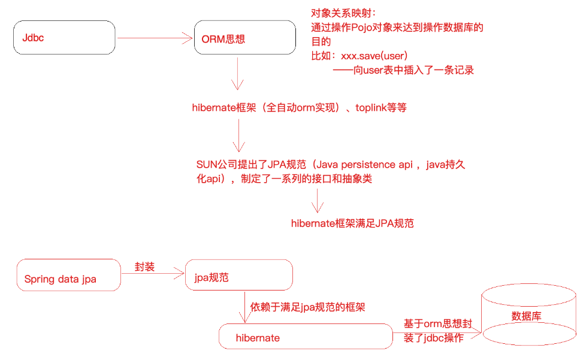

JPA 是一套规范，内部是由接口和抽象类组成的，Hiberanate 是一套成熟的 ORM 框架，而且Hiberanate 实现了 JPA 规范，所以可以称 Hiberanate 为 JPA 的一种实现方式，我们使用 JPA 的 API 编程，意味着站在更高的⻆度去看待问题（面向接口编程）。

Spring Data JPA 是 Spring 提供的一套对 JPA 操作更加高级的封装，是在 JPA 规范下的专⻔用来进行数据持久化的解决方案。


# 第三部分 Spring Data JPA 应用

- 需求：使用 Spring Data JPA 完成对 tb_resume 表（简历表）的Dao 层操作（增删改查，排序，分⻚等）
- 数据表设计

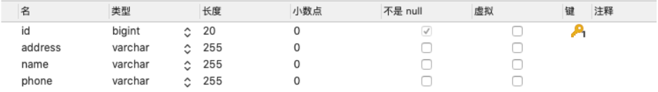

- 初始化Sql语句

```sql
SET NAMES utf8mb4;
SET FOREIGN_KEY_CHECKS = 0;
-- ------------------------------ Table structure for tb_resume-- ----------------------------
DROP TABLE IF EXISTS `tb_resume`;

CREATE TABLE `tb_resume` (  
    `id` bigint(20) NOT NULL AUTO_INCREMENT,  
    `address` varchar(255) DEFAULT NULL,  
    `name` varchar(255) DEFAULT NULL,  
    `phone` varchar(255) DEFAULT NULL,  
    PRIMARY KEY (`id`)
) ENGINE=InnoDB AUTO_INCREMENT=1 DEFAULT CHARSET=utf8;
-- ------------------------------ Records of tb_resume-- ----------------------------BEGIN;
INSERT INTO `tb_resume` VALUES (1, '北京', '张三', '131000000');
INSERT INTO `tb_resume` VALUES (2, '上海', '李四', '151000000');
INSERT INTO `tb_resume` VALUES (3, '广州', '王五', '153000000');
COMMIT;
SET FOREIGN_KEY_CHECKS = 1;
```


### 第 1 节 Spring Data JPA 开发步骤梳理

- 构建工程
  - 创建工程导入坐标（Java框架于我们而言就是一堆jar）
  - 配置 Spring 的配置文件（配置指定框架执行的细节）
  - 编写实体类 Resume，使用 JPA 注解配置映射关系
  - 编写一个符合 Spring Data JPA 的 Dao 层接口（ResumeDao接口）
- 操作 ResumeDao 接口对象完成 Dao 层开发


### 第 2 节 Spring Data JPA 开发实现

- 导入坐标

```xml
<?xml version="1.0" encoding="UTF-8"?>
<project xmlns="http://maven.apache.org/POM/4.0.0"
         xmlns:xsi="http://www.w3.org/2001/XMLSchema-instance"
         xsi:schemaLocation="http://maven.apache.org/POM/4.0.0 http://maven.apache.org/xsd/maven-4.0.0.xsd">
    <modelVersion>4.0.0</modelVersion>

    <groupId>com.lagou.demo</groupId>
    <artifactId>spring-data-jpa</artifactId>
    <version>1.0-SNAPSHOT</version>


    <dependencies><!--单元测试jar-->
        <dependency>
            <groupId>junit</groupId>
            <artifactId>junit</artifactId>
            <version>4.12</version>
            <scope>test</scope>
        </dependency><!--spring-data-jpa 需要引入的jar,start-->
        <dependency>
            <groupId>org.springframework.data</groupId>
            <artifactId>spring-data-jpa</artifactId>
            <version>2.1.8.RELEASE</version>
        </dependency>
        <dependency>
            <groupId>javax.el</groupId>
            <artifactId>javax.el-api</artifactId>
            <version>3.0.1-b04</version>
        </dependency>
        <dependency>
            <groupId>org.glassfish.web</groupId>
            <artifactId>javax.el</artifactId>
            <version>2.2.6</version>
        </dependency><!--spring-data-jpa 需要引入的jar,end--><!--spring 相关jar,start-->
        <dependency>
            <groupId>org.springframework</groupId>
            <artifactId>spring-aop</artifactId>
            <version>5.1.12.RELEASE</version>
        </dependency>
        <dependency>
            <groupId>org.aspectj</groupId>
            <artifactId>aspectjweaver</artifactId>
            <version>1.8.13</version>
        </dependency>
        <dependency>
            <groupId>org.springframework</groupId>
            <artifactId>spring-context</artifactId>
            <version>5.1.12.RELEASE</version>
        </dependency>
        <dependency>
            <groupId>org.springframework</groupId>
            <artifactId>spring-context-support</artifactId>
            <version>5.1.12.RELEASE</version>
        </dependency><!--spring对orm框架的支持包-->
        <dependency>
            <groupId>org.springframework</groupId>
            <artifactId>spring-orm</artifactId>
            <version>5.1.12.RELEASE</version>
        </dependency>
        <dependency>
            <groupId>org.springframework</groupId>
            <artifactId>spring-beans</artifactId>
            <version>5.1.12.RELEASE</version>
        </dependency>
        <dependency>
            <groupId>org.springframework</groupId>
            <artifactId>spring-core</artifactId>
            <version>5.1.12.RELEASE</version>
        </dependency><!--spring 相关jar,end--><!--hibernate相关jar包,start-->
        <dependency>
            <groupId>org.hibernate</groupId>
            <artifactId>hibernate-core</artifactId>
            <version>5.4.0.Final</version>
        </dependency><!--hibernate对jpa的实现jar-->
        <dependency>
            <groupId>org.hibernate</groupId>
            <artifactId>hibernate-entitymanager</artifactId>
            <version>5.4.0.Final</version>
        </dependency>
        <dependency>
            <groupId>org.hibernate</groupId>
            <artifactId>hibernate-validator</artifactId>
            <version>5.4.0.Final</version>
        </dependency><!--hibernate相关jar包,end--><!--mysql 数据库驱动jar-->
        <dependency>
            <groupId>mysql</groupId>
            <artifactId>mysql-connector-java</artifactId>
            <version>5.1.46</version>
        </dependency><!--druid连接池-->
        <dependency>
            <groupId>com.alibaba</groupId>
            <artifactId>druid</artifactId>
            <version>1.1.21</version>
        </dependency><!--spring-test-->
        <dependency>
            <groupId>org.springframework</groupId>
            <artifactId>spring-test</artifactId>
            <version>5.1.12.RELEASE</version>
        </dependency>
    </dependencies>


    <build>
        <plugins>
            <plugin>
                <groupId>org.springframework.boot</groupId>
                <artifactId>spring-boot-maven-plugin</artifactId>
                <version>2.3.6.RELEASE</version>
                <configuration>

                </configuration>
                <executions>
                    <execution>
                        <goals>
                            <goal>repackage</goal>
                        </goals>
                    </execution>
                </executions>
            </plugin>
        </plugins>

    </build>

</project>
```


- 配置 Spring 的配置文件

```xml
<?xmlversion="1.0" encoding="UTF-8"?>

<beans xmlns="http://www.springframework.org/schema/beans" xmlns:context="http://www.springframework.org/schema/context"
       xmlns:jpa="http://www.springframework.org/schema/data/jpa">
    <!--对Spring和SpringDataJPA进行配置-->
    <!--1、创建数据库连接池druid-->
    <!--引入外部资源文件-->
    <context:property-placeholder location="classpath:jdbc.properties"/>
    <!--第三方jar中的bean定义在xml中-->

    <bean id="dataSource" class="com.alibaba.druid.pool.DruidDataSource">
        <property name="driverClassName" value="${jdbc.driver}"/>
        <property name="url" value="${jdbc.url}"/>
        <property name="username" value="${jdbc.username}"/>
        <property name="password" value="${jdbc.password}"/>
    </bean>

    <bean id="dataSource" class="com.alibaba.druid.pool.DruidDataSource">
        <property name="driverClassName" value="${jdbc.driver}"/>
        <property name="url" value="${jdbc.url}"/>
        <property name="username" value="${jdbc.username}"/>
        <property name="password" value="${jdbc.password}"/>
    </bean>
    <!--2、配置一个JPA中非常重要的对象,entityManagerFactoryentityManager类似于mybatis中的SqlSessionentityManagerFactory类似于Mybatis中的SqlSessionFactory-->
    <bean id
                  ="entityManagerFactory"
          class="org.springframework.orm.jpa.LocalContainerEntityManagerFactoryBean">
        <!--配置一些细节.......--><!--配置数据源-->
        <property name="dataSource" ref="dataSource"/>
        <!--配置包扫描（pojo实体类所在的包）-->
        <property name
                          ="packagesToScan" value="com.lagou.edu.pojo"/>
        <!--指定jpa的具体实现，也就是hibernate-->
        <property name="persistenceProvider">
            <bean class="org.hibernate.jpa.HibernatePersistenceProvider">
            </bean>
        </property>
        <!--jpa方言配置,不同的jpa实现对于类似于beginTransaction等细节实现起来是不一样的，所以传入JpaDialect具体的实现类-->
        <property name="jpaDialect">
            <bean class="org.springframework.orm.jpa.vendor.HibernateJpaDialect"></bean>
        </property><!--配置具体provider，hibearnte框架的执行细节-->
        <property name="jpaVendorAdapter">
            <bean class="org.springframework.orm.jpa.vendor.HibernateJpaVendorAdapter">
                <!--定义hibernate框架的一些细节-->
                <!--配置数据表是否自动创建因为我们会建立pojo和数据表之间的映射关系程序启动时，如果数据表还没有创建，是否要程序给创建一下-->
                <property name="generateDdl"
                          value="false"/>
                <!--指定数据库的类型hibernate本身是个dao层框架，可以支持多种数据库类型的，这里就指定本次使用的什么数据库-->
                <property name="database"
                          value="MYSQL"/>
                <!--配置数据库的方言hiberante可以帮助我们拼装sql语句，但是不同的数据库sql语法是不同的，所以需要我们注入具体的数据库方言-->
                <property name="databasePlatform"
                          value="org.hibernate.dialect.MySQLDialect"/>
                <!--是否显示sql操作数据库时，是否打印sql-->
                <property name="showSql" value="true"/>
            </bean>
        </property>
    </bean>
    <!--3、引用上面创建的entityManagerFactory<jpa:repositories> 配置jpa的dao层细节base-package:指定dao层接口所在包-->
    <jpa:repositories base-package="com.lagou.edu.dao" entity-manager-factory-ref="entityManagerFactory"
                      transaction-manager-ref="transactionManager"/>
    <!--4、事务管理器配置jdbcTemplate/mybatis 使用的是DataSourceTransactionManagerjpa规范：JpaTransactionManager-->
    <bean id="transactionManager" class="org.springframework.orm.jpa.JpaTransactionManager">
        <property name="entityManagerFactory" ref="entityManagerFactory"/>
    </bean>
    <!--5、声明式事务配置-->
    <!--<tx:annotation-driven/>--><!--6、配置spring包扫描-->
    <context:component-scan base-package="com.lagou.edu"/>
</beans>
```


- 编写实体类 Resume，使用 JPA 注解配置映射关系

```java
package com.lagou.edu.pojo;

import javax.persistence.*;

/** 
 * 简历实体类（在类中要使用注解建立实体类和数据表之间的映射关系以及属性和字段的映射关系）
 * 1、实体类和数据表映射关系* @Entity* @Table
 * 2、实体类属性和表字段的映射关系* @Id 标识主键* @GeneratedValue 标识主键的生成策略* @Column 建立属性和字段映射
 * */
@Entity
@Table(name = "tb_resume")
public class Resume {

    /**
     * 生成策略经常使用的两种：
     * GenerationType.IDENTITY:依赖数据库中主键自增功能  Mysql
     * GenerationType.SEQUENCE:依靠序列来产生主键     Oracle
     */
    @Id
    @GeneratedValue(strategy = GenerationType.IDENTITY)
    @Column(name = "id")
    private Long id;

    @Column(name = "name")

    private String name;

    @Column(name = "address")
    private String address;

    @Column(name = "phone")
    private String phone;

    public Long getId() {
        return id;
    }

    public void setId(Long id) {
        this.id = id;
    }

    public String getName() {
        return name;
    }

    public void setName(String name) {
        this.name = name;
    }

    public String getAddress() {
        return address;
    }

    public void setAddress(String address) {
        this.address = address;
    }

    public String getPhone() {
        return phone;
    }

    public void setPhone(String phone) {
        this.phone = phone;
    }

    @Override
    public String toString() {
        return "Resume{" + "id=" + id + ", name='" + name + '\'' + ", address='" 
            + address + '\'' + ", phone='" + phone + '\'' + '}';
    }
}
```

编写 ResumeDao 接口

```java
package com.lagou.edu.dao;

import com.lagou.edu.pojo.Resume;
import org.springframework.data.jpa.repository.JpaRepository;
import org.springframework.data.jpa.repository.JpaSpecificationExecutor;
import org.springframework.data.jpa.repository.Query;

import java.util.List;

/**
 * 一个符合SpringDataJpa要求的Dao层接口是需要继承JpaRepository和JpaSpecificationExecutor
 * JpaRepository<操作的实体类类型,主键类型>
 * 封装了基本的CRUD操作** JpaSpecificationExecutor<操作的实体类类型>
 * 封装了复杂的查询（分⻚、排序等）
 **/
public interface ResumeDao extends JpaRepository<Resume, Long>, JpaSpecificationExecutor<Resume> {

    /**
     * 查询
     * @param id
     * @param name
     * @return
     */
    @Query("from Resume  where id=?1 and name=?2")
    public List<Resume> findByJql(Long id, String name);

    /**
     * 使用原生sql语句查询，需要将nativeQuery属性设置为true，默认为false（jpql）
     *
     * @param name
     * @param address
     * @return
     **/
    @Query(value = "select * from tb_resume  where name like ?1 andaddress like ?2", nativeQuery = true)
    public List<Resume> findBySql(String name, String address);

}
```

- 操作 ResumeDao 接口完成 Dao 层开发（客户端测试）

```java
package com.lagou.edu.dao;

import com.lagou.edu.dao.dao.ResumeDao;
import com.lagou.edu.dao.pojo.Resume;
import org.junit.Test;
import org.junit.runner.RunWith;
import org.springframework.beans.factory.annotation.Autowired;
import org.springframework.data.domain.*;
import org.springframework.test.context.ContextConfiguration;
import org.springframework.test.context.junit4.SpringJUnit4ClassRunner;

import java.util.List;
import java.util.Optional;

/**
 * @author 周壮
 * @date : 2020/12/1 11:21
 * @Description:
 */

@RunWith(SpringJUnit4ClassRunner.class)
@ContextConfiguration(locations = {"classpath:applicationContext.xml"})
public class ResumeDaoTest {

    // 要测试IOC哪个对象注入即可
    @Autowired
    private ResumeDao resumeDao;

    /*** dao层接口调用，分成两块：* 1、基础的增删改查* 2、专⻔针对查询的详细分析使用*/

    @Test
    public void testFindById() {
        // 早期的版本 dao.findOne(id);
        /*
            select resume0_.id as id1_0_0_,resume0_.address as address2_0_0_, 
            resume0_.name as name3_0_0_,resume0_.phone as phone4_0_0_ 
            from tb_resume resume0_where resume0_.id=?
        */

        Optional<Resume> optional = resumeDao.findById(1L);
        Resume resume = optional.get();
        System.out.println(resume);
    }

    @Test
    public void testFindOne() {
        Resume resume = new Resume();
        resume.setId(1L);
        resume.setName("张三");
        Example<Resume> example = Example.of(resume);
        Optional<Resume> one = resumeDao.findOne(example);
        Resume resume1 = one.get();
        System.out.println(resume1);
    }

    @Test
    public void testSave() {
        // 新增和更新都使用save方法，通过传入的对象的主键有无来区分，
        // 没有主键信息那就是新增，有主键信息就是更新
        Resume resume = new Resume();
        resume.setId(5L);
        resume.setName("赵六六");
        resume.setAddress("成都");
        resume.setPhone("132000000");
        Resume save = resumeDao.save(resume);
        System.out.println(save);

    }

    @Test
    public void testDelete() {
        resumeDao.deleteById(5L);
    }

    @Test
    public void testFindAll() {
        List<Resume> list = resumeDao.findAll();
        for (int i = 0; i < list.size(); i++) {
            Resume resume = list.get(i);
            System.out.println(resume);
        }
    }

    @Test
    public void testSort() {
        Sort sort = new Sort(Sort.Direction.DESC, "id");
        List<Resume> list = resumeDao.findAll(sort);
        for (int i = 0; i < list.size(); i++) {
            Resume resume = list.get(i);
            System.out.println(resume);
        }
    }

    @Test
    public void testPage() {

        /** 第一个参数：当前查询的⻚数，从0开始* 第二个参数：每⻚查询的数量*/
        Pageable pageable = PageRequest.of(0, 2);

        //Pageable pageable = new PageRequest(0,2);
        Page<Resume> all = resumeDao.findAll(pageable);
        System.out.println(all);
        /*for (int  i = 0; i < list.size(); i++) {Resume resume =  list.get(i);System.out.println(resume);}*/
    }

    @Test
    public void testJpql() {
        List<Resume> list = resumeDao.findByJql(1L, "张三");
        for (int i = 0; i < list.size(); i++) {
            Resume resume = list.get(i);
            System.out.println(resume);
        }
    }

    @Test
    public void testSql() {
        List<Resume> list = resumeDao.findBySql("李%", "上海%");
        for (int i = 0; i < list.size(); i++) {
            Resume resume = list.get(i);
            System.out.println(resume);
        }
    }

}
```


# 第四部分Spring Data JPA 执行过程源码分析


Spring Data Jpa 源码很少有人去分析，原因如下：

1）Spring Data Jpa 地位没有之前学习的框架高，大家习惯把它当成一个工具来用了，不愿意对它进行源码层次的解读

2）开发Dao接口（ResumeDao），接口的实现对象肯定是通过动态代理来完成的（增强），代理对象的产生过程追源码很难追，特别特别讲究技巧

在这里，老师就带着大家走一遭源码源码剖析的主要的过程，就是代理对象产生的过程

我们发现resumeDao是一个代理对象，这个代理对象的类型是SimpleJapRepository


### 第1 节疑问：这个代理对象是怎么产生，过程怎样

以往：如果要给一个对象产生代理对象，我们知道是在AbstractApplicationContext的refresh方法中，那么能不能在这个方法中找到什么我们当前场景的线索

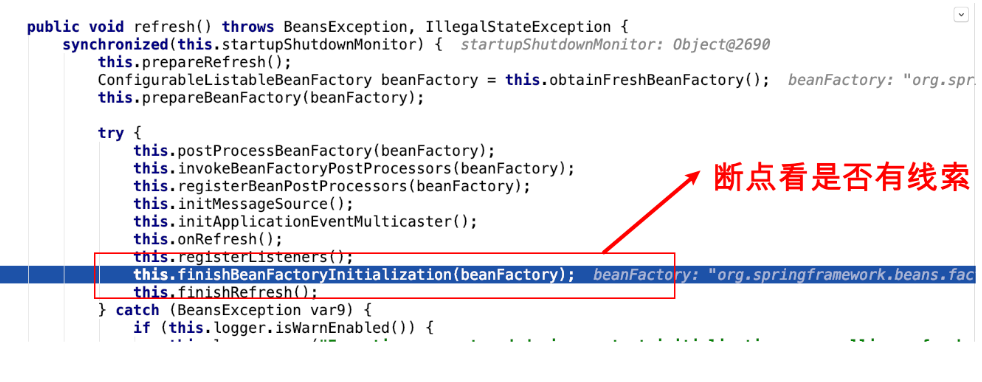

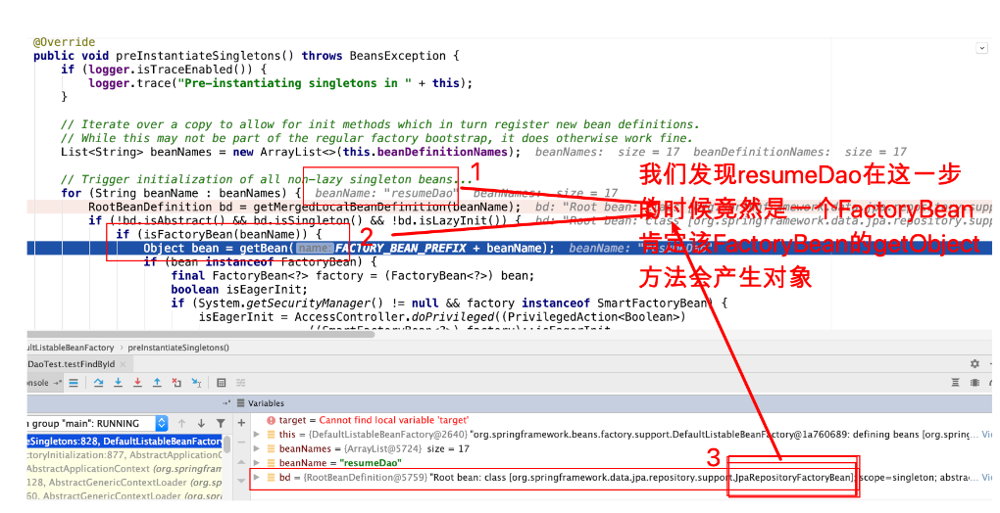

新的疑问又来了？

问题1：为什么会给它指定为一个JpaRespositoryFactoryBean（getObject方法返回具体的对象）

问题2：指定这个FactoryBean是在什么时候发生的

首先解决问题2：

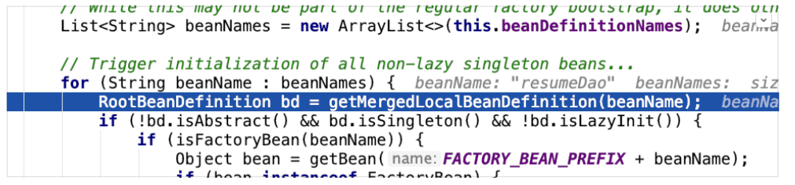

传入一个resumeDao就返回了一个已经指定class为JpaRepositoryFactoryBean的BeanDefinition对象了，那么应该在上图中的get时候就有了，所以断点进入

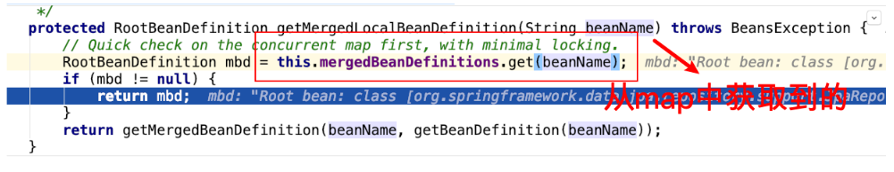

问题来了，什么时候put到map中去的？我们定位到了一个方法在做这件事

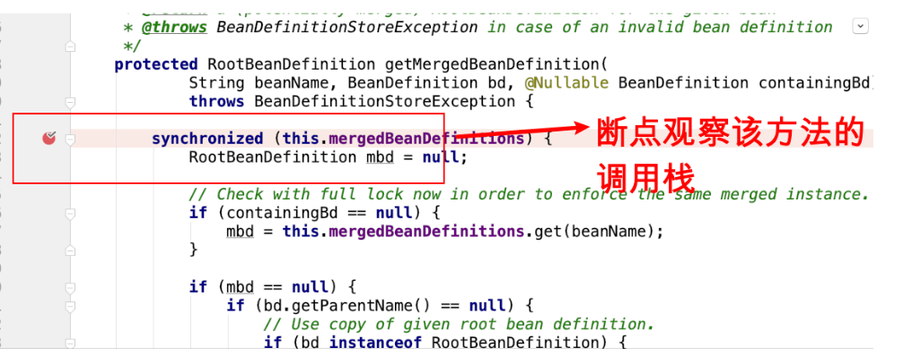

我们发现，传入该方法的时候，BeanDefintion中的class就已经被指定为FactoryBean了，那么观察该方法的调用栈

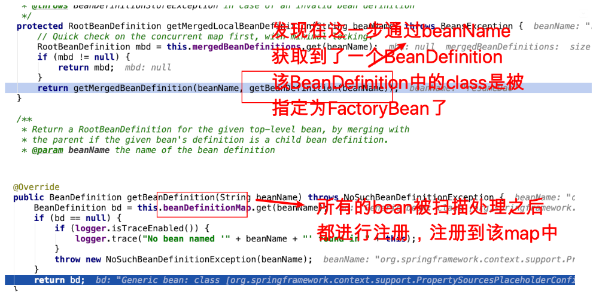

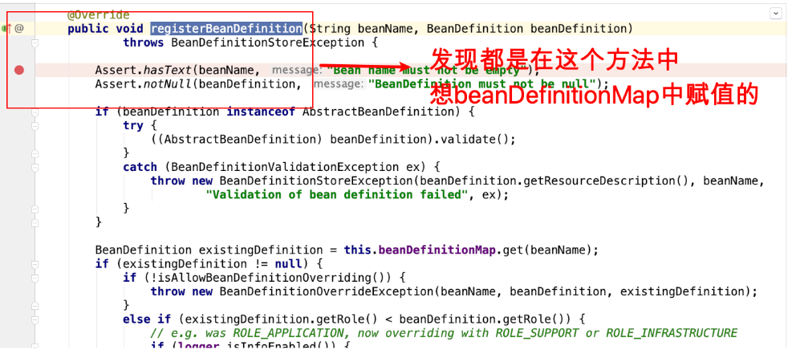

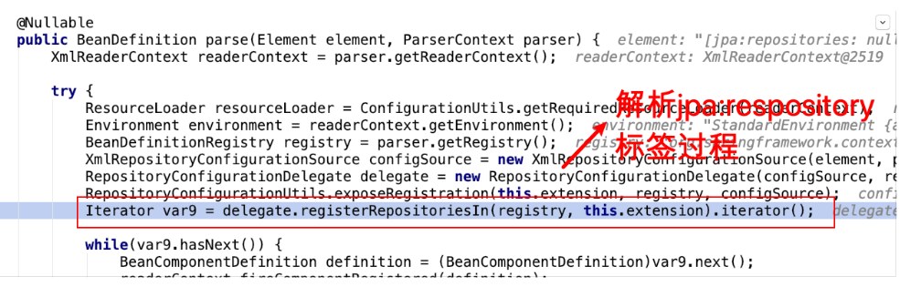

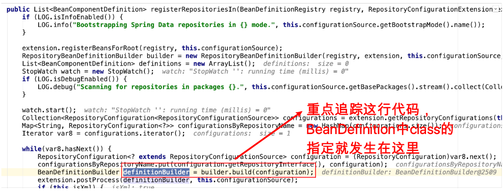

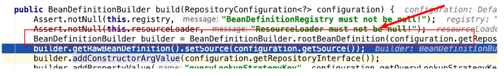

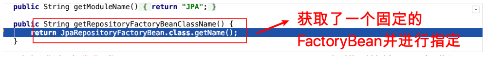

通过上述追踪我们发现，<jpa:repository basePackage，扫描到的接口，在进行BeanDefintion

注册时候，class会被固定的指定为JpaRepositoryFacotryBean

至此，问题2 追踪完毕

那么接下来，我们再来追踪问题1 JpaRespositoryFactoryBean是一个什么样的类

它是一个FactoryBean，我们重点关注FactoryBean的getObject方法

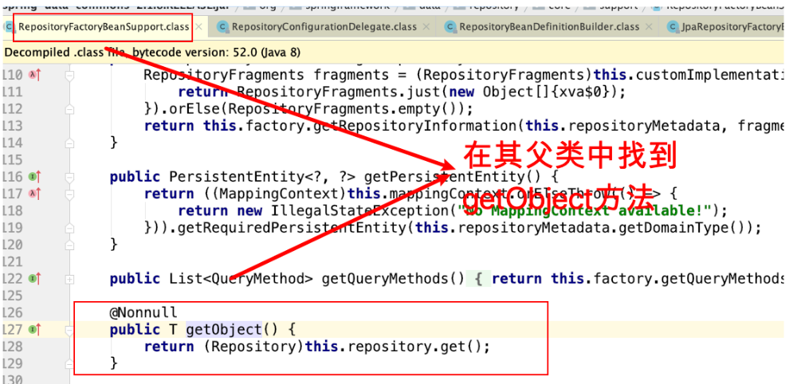


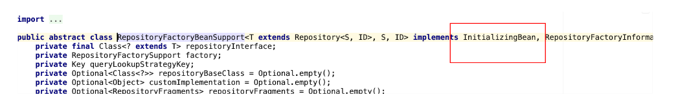


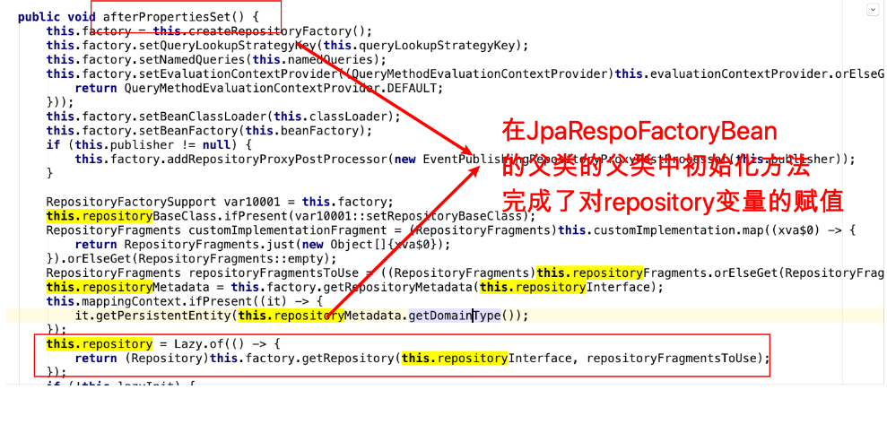

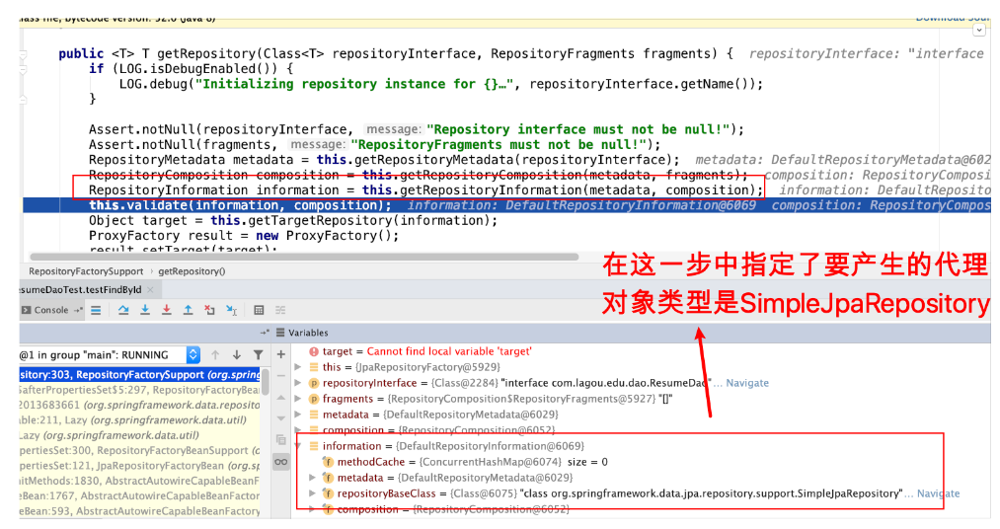

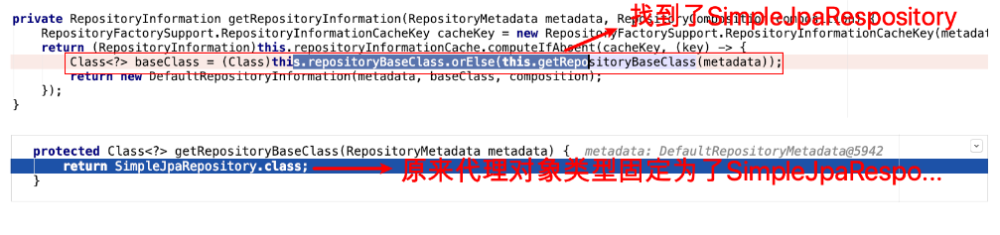

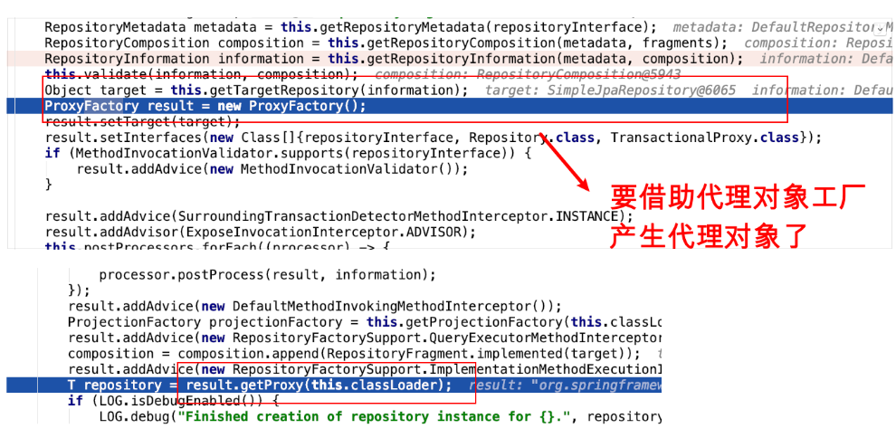

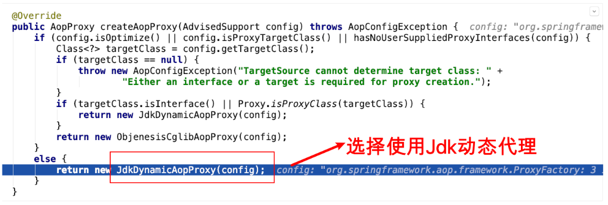

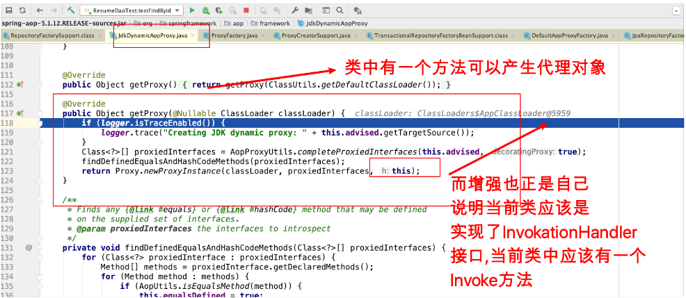


由此可⻅，JdkDynamicAopProxy会生成一个代理对象类型为SimpleJpaRespository，而该对象的增强逻辑就在JdkDynamicAopProxy类的invoke方法中

至此，问题1追踪完毕。

### 第 2 节疑问：这个代理对象类型SimpleJapRepository有什么特别的

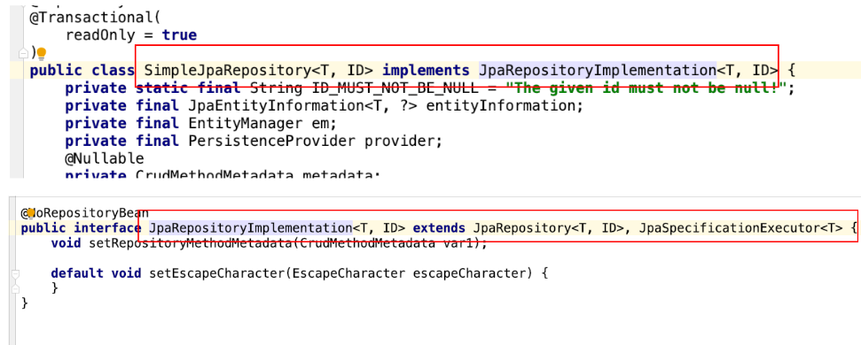

原来SimpleJpaRepository类实现了JpaRepository接口和JpaSpecificationExecutor接口

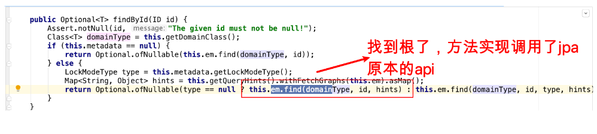


