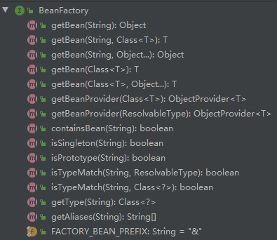
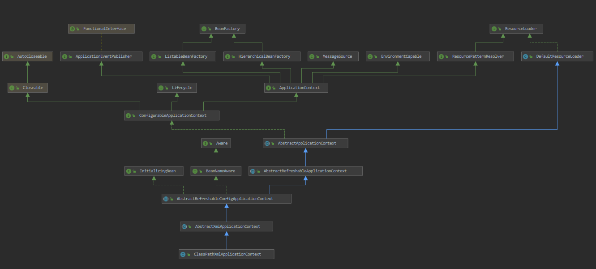
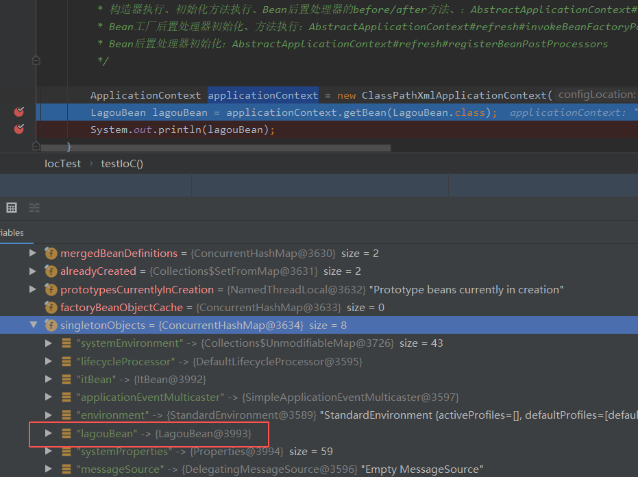
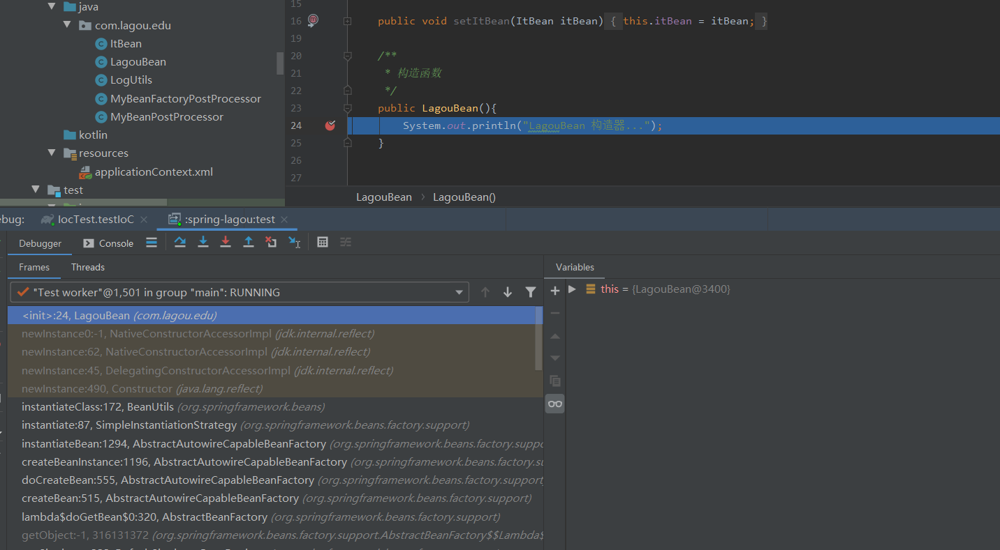
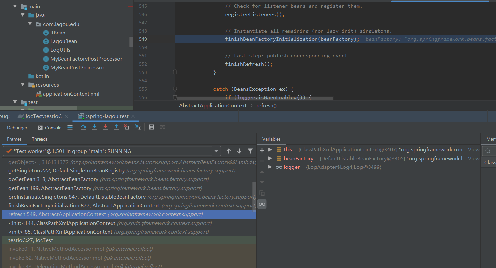
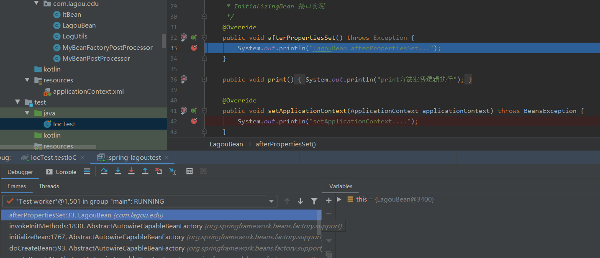
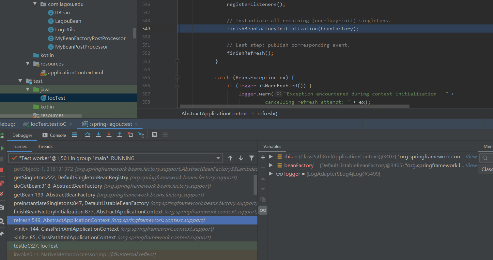

# Spring Framework


## Spring相关教程/资料

### 官网相关

- [Spring官网](https://spring.io/)、[Spring系列主要项目](https://spring.io/projects)、[Spring官网指南](https://spring.io/guides)、[官方文档](https://spring.io/docs/reference)

## 系统学习教程

### 文档

-  [极客学院Spring Wiki](http://wiki.jikexueyuan.com/project/spring/)
-  [Spring W3Cschool教程 ](https://www.w3cschool.cn/wkspring/f6pk1ic8.html)

### 视频

- [网易云课堂—精通java教程Spring框架开发](http://study.163.com/course/courseMain.htm?courseId=1004475015#/courseDetail?tab=1&35)
- [慕课网相关视频](https://www.imooc.com/)


## 面试必备知识点

### SpringAOP,IOC实现原理

AOP实现原理、动态代理和静态代理、Spring IOC的初始化过程、IOC原理、自己实现怎么实现一个IOC容器？这些东西都是经常会被问到的。

推荐阅读：

- [自己动手实现的 Spring IOC 和 AOP - 上篇](http://www.coolblog.xyz/2018/01/18/自己动手实现的-Spring-IOC-和-AOP-上篇/)

- [自己动手实现的 Spring IOC 和 AOP - 下篇](http://www.coolblog.xyz/2018/01/18/自己动手实现的-Spring-IOC-和-AOP-下篇/)

### AOP

AOP思想的实现一般都是基于 **代理模式** ，在JAVA中一般采用JDK动态代理模式，但是我们都知道，**JDK动态代理模式只能代理接口而不能代理类**。因此，Spring AOP 会这样子来进行切换，因为Spring AOP 同时支持 CGLIB、ASPECTJ、JDK动态代理。

- 如果目标对象的实现类实现了接口，Spring AOP 将会采用 JDK 动态代理来生成 AOP 代理类；
- 如果目标对象的实现类没有实现接口，Spring AOP 将会采用 CGLIB 来生成 AOP 代理类——不过这个选择过程对开发者完全透明、开发者也无需关心。

推荐阅读：

- [静态代理、JDK动态代理、CGLIB动态代理讲解](http://www.cnblogs.com/puyangsky/p/6218925.html) ：我们知道AOP思想的实现一般都是基于 **代理模式** ，所以在看下面的文章之前建议先了解一下静态代理以及JDK动态代理、CGLIB动态代理的实现方式。
- [Spring AOP 入门](https://juejin.im/post/5aa7818af265da23844040c6) ：带你入门的一篇文章。这篇文章主要介绍了AOP中的基本概念：5种类型的通知（Before，After，After-returning，After-throwing，Around）；Spring中对AOP的支持：AOP思想的实现一般都是基于代理模式，在Java中一般采用JDK动态代理模式，Spring AOP 同时支持 CGLIB、ASPECTJ、JDK动态代理，
- [Spring AOP 基于AspectJ注解如何实现AOP](https://juejin.im/post/5a55af9e518825734d14813f) ： **AspectJ是一个AOP框架，它能够对java代码进行AOP编译（一般在编译期进行），让java代码具有AspectJ的AOP功能（当然需要特殊的编译器）**，可以这样说AspectJ是目前实现AOP框架中最成熟，功能最丰富的语言，更幸运的是，AspectJ与java程序完全兼容，几乎是无缝关联，因此对于有java编程基础的工程师，上手和使用都非常容易。Spring注意到AspectJ在AOP的实现方式上依赖于特殊编译器(ajc编译器)，因此Spring很机智回避了这点，转向采用动态代理技术的实现原理来构建Spring AOP的内部机制（动态织入），这是与AspectJ（静态织入）最根本的区别。**Spring 只是使用了与 AspectJ 5 一样的注解，但仍然没有使用 AspectJ 的编译器，底层依是动态代理技术的实现，因此并不依赖于 AspectJ 的编译器**。 Spring AOP虽然是使用了那一套注解，其实实现AOP的底层是使用了动态代理(JDK或者CGLib)来动态植入。至于AspectJ的静态植入，不是本文重点，所以只提一提。
- [探秘Spring AOP（慕课网视频，很不错）](https://www.imooc.com/learn/869):慕课网视频，讲解的很不错，详细且深入
- [spring源码剖析（六）AOP实现原理剖析](https://blog.csdn.net/fighterandknight/article/details/51209822) :通过源码分析Spring AOP的原理

### IOC

- [[Spring框架]Spring IOC的原理及详解](https://www.cnblogs.com/wang-meng/p/5597490.html)
- [Spring IOC核心源码学习](https://yikun.github.io/2015/05/29/Spring-IOC核心源码学习/) :比较简短，推荐阅读。
- [Spring IOC 容器源码分析](https://javadoop.com/post/spring-ioc) :强烈推荐，内容详尽，而且便于阅读。
- [Bean初始化过程](https://www.qzztf.com/2019/08/21/Bean%E5%88%9D%E5%A7%8B%E5%8C%96/#Bean-%E5%AE%9E%E4%BE%8B%E5%8C%96)


## Spring事务管理

- [可能是最漂亮的Spring事务管理详解](https://juejin.im/post/5b00c52ef265da0b95276091)
- [Spring编程式和声明式事务实例讲解](https://juejin.im/post/5b010f27518825426539ba38)

### Spring单例与线程安全

- [Spring框架中的单例模式（源码解读）](http://www.cnblogs.com/chengxuyuanzhilu/p/6404991.html):单例模式是一种常用的软件设计模式。通过单例模式可以保证系统中一个类只有一个实例。spring依赖注入时，使用了 多重判断加锁 的单例模式。

### Spring源码阅读

阅读源码不仅可以加深我们对Spring设计思想的理解，提高自己的编码水平，还可以让自己在面试中如鱼得水。下面的是Github上的一个开源的Spring源码阅读，大家有时间可以看一下，当然你如果有时间也可以自己慢慢研究源码。

 - [spring-core](https://github.com/seaswalker/Spring/blob/master/note/Spring.md)
- [spring-aop](https://github.com/seaswalker/Spring/blob/master/note/spring-aop.md)
- [spring-context](https://github.com/seaswalker/Spring/blob/master/note/spring-context.md)
- [spring-task](https://github.com/seaswalker/Spring/blob/master/note/spring-task.md)
- [spring-transaction](https://github.com/seaswalker/Spring/blob/master/note/spring-transaction.md)
- [spring-mvc](https://github.com/seaswalker/Spring/blob/master/note/spring-mvc.md)
- [guava-cache](https://github.com/seaswalker/Spring/blob/master/note/guava-cache.md)


# Spring 高级框架


## 第一部分 Spring概述

第1节 Spring 简介

> 百度：Spring是于2003 年兴起的一个轻量级的Java 开发框架，由Rod Johnson创建。简单来说，Spring是一个分层的JavaSE/EE full-stack(一站式) 轻量级开源框架。

> Spring官网：Spring makes Java simple. modern. productive. reactive. cloud-read.


第2节 Spring发展历程

1997年 IBM 提出了EJB的思想； 1998年，SUN 制定开发标准规范EJB1.0； 1999年，EJB 1.1发

布； 2001年，EJB 2.0发布； 2003年，EJB 2.1发布； 2006年，EJB 3.0发布；

Rod Johnson（spring之⽗）Expert One-to-One J2EE Design and Development(2002) 阐述了J2EE使⽤EJB开发设计的优

点及解决⽅案

Expert One-to-One J2EE Development without EJB(2004) 阐述了J2EE开发不使⽤EJB的解决

⽅式（Spring雏形）

2017 年 9 ⽉份发布了 Spring 的最新版本 Spring 5.0 通⽤版（GA）

第3节 Spring的优势


第4节 Spring的核心结构

#### 1）Core Container核心容器

core部分包含4个模块：
 1、spring-core：依赖注入IoC与DI的最基本实现
 2、spring-beans：Bean工厂与bean的装配
 3、spring-context：spring的context上下文即IoC容器
 4、spring-expression：spring表达式语言

#### 2）数据访问/集成

数据访问/集成层包括 JDBC，ORM，OXM，JMS 和事务处理模块（简）

#### 3）Web

Web 层由 Web，Web-MVC，Web-Socket 和 Web-Portlet 组成 （简）

#### 4）AOP

AOP：提供了面向切面编程的实现，让你可以定义方法拦截器和切点，从而将逻辑代码分开，降低代码间的耦合性。
 Aspects：提供了对AspectJ的集成支持，这是一个功能强大且成熟的面向方面编程（AOP）框架。
 WebSocket：提供了一个在Web应用中高效、双向的通信工具。
 Instrumentation：提供了在特定的应用服务器中使用类工具的支持和类加载器实现。

#### 5）Test

支持使用JUnit和TestNG对Spring组件进行测试。


第5节 Spring框架版本


## 第二部分 核心思想


## 第三部分 手写实现IOC和AOP


## 第四部分 Spring IOC应用


## 第五部分 Spring IOC源码深度剖析


> **Spring源码学习的好处：**
>
> 培养代码架构思维，深入理解Spring框架，写出优雅的代码，装逼
>
> **Spring源码学习的原则：**
>
> 定焦原则：定目标，抓主线
>
> 宏观原则：站在上帝视角，关注源码结构和流程（淡化某行代码的编写细节）
>
> **Spring源码学习的技巧：**
>
> 断点：debug模式  观察调用栈
>
> 反调：Find Usages
>
> 经验：Spring框架中doXXX是具体干活的方法
>
> **Spring源码学习的构建：**
>
> 下载源码（GitHub）5.1.2 
>
> https://github.com/spring-projects/spring-framework/
>
> 安装gradle 版本5.6.3   idea 2019.2  JDK 11.0.5 
>
> 
>
> 导入 需要耗费一定的时间
>
> 编译工程 （顺序  core -> oxm -> content -> beans -> aspects -> aop）工程 -> tasks -> other -> compileTestJava


### 第一节 Spring IOC 容器初始化主流程

#### 1.1 Spring IOC容器的继承体系

IoC容器是Spring的核心模块，是抽象了对象管理、依赖关系管理的框架解决方案。Spring提供了很多的容器，其中BeanFactory是顶层容器（根容器），不能被实例化，它定义了所有IoC容器必须遵从的一套原则，具体的容器实现可以增加额外的功能，比如我们常用到的ApplicationContext， 其下更具体的实现如ClassPathXmlApplication 则是包含了解析xml等一系列的内容，AnnotationConfigApplicationContext 则是包含了注解解析等一系列的内容。Spring IoC容器继承体系非常聪明，需要使用哪个层次用哪个层次即可，不必使用功能大而全的。


BeanFactory顶层接口方法栈如下：



BeanFactory 容器继承体系

选择 ClassPathXmlApplicationContext 查询继承关系， 快捷键Ctrl + Alt + u




> 参考：spring的beanFactory继承体系
>
> https://www.cnblogs.com/sunrainlyb/p/11668490.html
>
> 参考：Spring IOC-BeanFactory的继承体系结构
>
> https://blog.csdn.net/chenzitaojay/article/details/46716071

通过其接口设计，我们可以看到我们一贯使用的ApplicationContext除了继承BeanFactory的子接口，还继承了ResourceLoader、MessageSource等接口，因此其提供的功能也就更丰富了。

下面我们以ClasspathXmlApplicationContext为例，深入源码说明IoC容器的初始化流程。


#### 1.2 Bean生命周期关键时机点

**思路：** 创建一个类DemoBean, 让其实现几个特殊的接口，并分别在接口实现的构造器、接口方法中断点，观察线程调用栈，分析出Bean对象创建和管理关键点的触发时机。

DemoBean类

```java
import org.springframework.beans.BeansException;
import org.springframework.beans.factory.InitializingBean;
import org.springframework.context.ApplicationContext;
import org.springframework.context.ApplicationContextAware;

public class DemoBean implements InitializingBean, ApplicationContextAware {

	private ItBean itBean;

	public void setItBean(ItBean itBean) {
		this.itBean = itBean;
	}

	/**
	 * 构造函数
	 */
	public LagouBean(){
		System.out.println("LagouBean 构造器...");
	}


	/**
	 * InitializingBean 接口实现
	 */
	public void afterPropertiesSet() throws Exception {
		System.out.println("LagouBean afterPropertiesSet...");
	}

	public void print() {
		System.out.println("print方法业务逻辑执行");
	}

	@Override
	public void setApplicationContext(ApplicationContext applicationContext) throws BeansException {
		System.out.println("setApplicationContext....");
	}
}
```

BeanPostProcessor 接口实现类

```java
import org.springframework.beans.BeansException;
import org.springframework.beans.factory.config.BeanPostProcessor;
import org.springframework.stereotype.Component;

/**
 * @Author 应癫
 * @create 2019/12/3 16:59
 */
public class MyBeanPostProcessor implements BeanPostProcessor {

	public MyBeanPostProcessor() {
		System.out.println("BeanPostProcessor 实现类构造函数...");
	}

	@Override
	public Object postProcessBeforeInitialization(Object bean, String beanName) throws BeansException {
		if("lagouBean".equals(beanName)) {
			System.out.println("BeanPostProcessor 实现类 postProcessBeforeInitialization 方法被调用中......");
		}
		return bean;
	}

	@Override
	public Object postProcessAfterInitialization(Object bean, String beanName) throws BeansException {
		if("lagouBean".equals(beanName)) {
			System.out.println("BeanPostProcessor 实现类 postProcessAfterInitialization 方法被调用中......");
		}
		return bean;
	}
}
```

BeanFactoryPostProcessor 接口实现类

```java

import org.springframework.beans.BeansException;
import org.springframework.beans.factory.config.BeanFactoryPostProcessor;
import org.springframework.beans.factory.config.ConfigurableListableBeanFactory;
import org.springframework.stereotype.Component;

/**
 * @Author 应癫
 * @create 2019/12/3 16:56
 */
public class MyBeanFactoryPostProcessor implements BeanFactoryPostProcessor {

	public MyBeanFactoryPostProcessor() {
		System.out.println("BeanFactoryPostProcessor的实现类构造函数...");
	}

	@Override
	public void postProcessBeanFactory(ConfigurableListableBeanFactory beanFactory) throws BeansException {
		System.out.println("BeanFactoryPostProcessor的实现方法调用中......");
	}
}
```

ApplicationContext.xml

```xml
<?xml version="1.0" encoding="UTF-8"?>
<beans xmlns="http://www.springframework.org/schema/beans"
	   xmlns:aop="http://www.springframework.org/schema/aop"
	   xmlns:xsi="http://www.w3.org/2001/XMLSchema-instance"
	   xsi:schemaLocation="
	    http://www.springframework.org/schema/beans
        https://www.springframework.org/schema/beans/spring-beans.xsd
        http://www.springframework.org/schema/aop
        https://www.springframework.org/schema/aop/spring-aop.xsd
">

	<!--循环依赖问题-->
	<bean id="lagouBean" class="com.lagou.edu.LagouBean">
		<property name="ItBean" ref="itBean"/>
	</bean>
	<bean id="itBean" class="com.lagou.edu.ItBean">
		<property name="LagouBean" ref="lagouBean"/>
	</bean>


	<!--<bean id="myBeanFactoryPostProcessor" class="com.lagou.edu.MyBeanFactoryPostProcessor"/>
	<bean id="myBeanPostProcessor" class="com.lagou.edu.MyBeanPostProcessor"/>-->


	<!--<bean id="lagouBean" class="com.lagou.edu.LagouBean">
	</bean>-->


	<!--aop配置-->
	<!--横切逻辑-->
	<!--<bean id="logUtils" class="com.lagou.edu.LogUtils">
	</bean>

	<aop:config>
		<aop:aspect ref="logUtils">
			<aop:before method="beforeMethod" pointcut="execution(public void com.lagou.edu.LagouBean.print())"/>
		</aop:aspect>
	</aop:config>-->


</beans>
```

IoC 容器源码分析用例

```java
import com.lagou.edu.LagouBean;
import org.junit.Test;
import org.springframework.context.ApplicationContext;
import org.springframework.context.support.ClassPathXmlApplicationContext;

/**
 * @Author 应癫
 */
public class IocTest {

	/**
	 *  Ioc 容器源码分析基础案例
	 */
	@Test
	public void testIoC() {
		// ApplicationContext是容器的高级接口，BeanFacotry（顶级容器/根容器，规范了/定义了容器的基础行为）
		// Spring应用上下文，官方称之为 IoC容器（错误的认识：容器就是map而已；准确来说，map是ioc容器的一个成员，
		// 叫做单例池, singletonObjects,容器是一组组件和过程的集合，包括BeanFactory、单例池、BeanPostProcessor等以及之间的协作流程）

		/**
		 * Ioc容器创建管理Bean对象的，Spring Bean是有生命周期的
		 * 构造器执行、初始化方法执行、Bean后置处理器的before/after方法、：AbstractApplicationContext#refresh#finishBeanFactoryInitialization
		 * Bean工厂后置处理器初始化、方法执行：AbstractApplicationContext#refresh#invokeBeanFactoryPostProcessors
		 * Bean后置处理器初始化：AbstractApplicationContext#refresh#registerBeanPostProcessors
		 */

		ApplicationContext applicationContext = new ClassPathXmlApplicationContext("classpath:applicationContext.xml");
		LagouBean lagouBean = applicationContext.getBean(LagouBean.class);
		System.out.println(lagouBean);
	}


	/**
	 *  Ioc 容器源码分析基础案例
	 */
	@Test
	public void testAOP() {
		ApplicationContext applicationContext = new ClassPathXmlApplicationContext("classpath:applicationContext.xml");
		LagouBean lagouBean = applicationContext.getBean(LagouBean.class);
		lagouBean.print();
	}
}

```

(1) 分析Bean的创建是在容器初始化时还是在getBean时




根据断点调试，我们发现，在未设置延迟加载的前提下，Bean的创建是在容器初始化过程中完成的。

（2） 分析构造函数调用情况








（3）分析InitializingBean 之 afterPropertiesSet 初始化方法调用情况






通过如上观察，我们发现InitializingBean 中 afterPropertiesSet方法的调用时机也是在AbstractApplicationContext类refresh方法的finishBeanFactoryInitialization(beanFactory);

(4) 分析BeanFactoryPOstProcessor 初始化和调用情况

分别在构造函数、postProcessBeanFactory 方法处打断点，观察调用栈，发现BeanFactoryPostProcessor 初始化在AbstractApplicationContext类refresh方法的invokeBeanFactoryPostProcessors(beanFactory);

postProcessBeanFactory 调用在AbstractApplicationContext类refresh方法的invokeBeanFactoryPostProcessors(beanFactory);


(5) 分析BeanPostProcessor 初始化和调用情况

分别在构造函数、postProcessBeanFactory 方法处打断点，观察调用栈，发现BeanPostProcessor 初始化在AbstractApplicationContext 类refresh 方法的registerBeanPostProcessors(beanFactory);

postProcessBeforeInitialization 调用在AbstractApplicationContext 类refresh 方法的finishBeanFactoryInitialization（beanFactory）;

postProcessAfterInitialization（beanFactory）;

(6) 总结

根据上面的调试分析， 我们发现Bean对象创建的几个关键时机点代码层级的调用都在AbstractApplicationContext 类的refresh方法中， 可见这个方法对于Spring IoC容器初始化来说相当关键， 汇总如下：

| 关键点                            | 触发代码                                                     |
| --------------------------------- | ------------------------------------------------------------ |
| 构造器                            | refresh#finishBeanFactoryInitialization(beanFactory)(beanFactory) |
| BeanFactoryPostProcessor 初始化   | refresh#invokeBeanFactoryPostProcessors(beanFactory)         |
| BeanFactoryPostProcessor 方法调用 | refresh#invokeBeanFactoryPostProcessors(beanFactory)         |
| BeanPostProcessor 初始化          | registerBeanPostProcessors(beanFactory)                      |
| BeanPostProcessor方法调用         | refresh#finishBeanFactoryInitialization(beanFactory)         |


 


## 第六部分 Spring AOP应用


## 第七部分 Spring AOP源码深度剖析


Spring ⾼级框架（讲师：应癫）


ssh = spring + struts + hibernate ssm = spring + springmvc + mybatis

spring全家桶：脚⼿架框架springboot、微服务框架springcloud等等

 

 

# Spring 高级框架


 

Spring 概述（基本情况） 核⼼思想 IoC 和 AOP

⼿写实现 IoC 和 AOP（⾃定义spring框架） Spring IoC ⾼级应⽤

基础知识

⾼级特性

Spring IoC 源码深度剖析

设计⾮常优雅设计模式

注意：原则、⽅法和技巧

Spring AOP ⾼级应⽤

声明式事务控制

Spring AOP 源码深度剖析

必要的笔记、必要的图、通俗易懂的语⾔化解知识难点

# 第⼀部分 Spring 概述


## 第1节 Spring 简介

Spring 是分层的 full-stack（全栈） 轻量级开源框架，以 IoC 和 AOP 为内核，提供了展现层 Spring MVC   和业务层事务管理等众多的企业级应⽤技术，还能整合开源世界众多著名的第三⽅框架和类库，已经成为使⽤最多的 Java EE 企业应⽤开源框架。

Spring 官⽅⽹址：http://spring.io/

我们经常说的 Spring 其实指的是Spring Framework（spring 框架）。

## 第2节 Spring 发展历程

1997年 IBM 提出了EJB的思想； 1998年，SUN 制定开发标准规范EJB1.0； 1999年，EJB 1.1发布； 2001年，EJB 2.0发布； 2003年，EJB 2.1发布； 2006年，EJB 3.0发布；

Rod Johnson（spring之⽗）


Expert One-to-One J2EE Design and Development(2002) 阐述了J2EE使⽤EJB开发设计的优点及解决⽅案

Expert One-to-One J2EE Development without EJB(2004) 阐述了J2EE开发不使⽤EJB的解决

⽅式（Spring雏形）

2017 年 9 ⽉份发布了 Spring 的最新版本 Spring 5.0 通⽤版（GA）

## 第3节 Spring 的优势

整个 Spring 优势，传达出⼀个信号，Spring 是⼀个综合性，且有很强的思想性框架，每学习⼀天，就能体会到它的⼀些优势。

#### ⽅便解耦，简化开发

通过Spring提供的IoC容器，可以将对象间的依赖关系交由Spring进⾏控制，避免硬编码所造成的    过度程序耦合。⽤户也不必再为单例模式类、属性⽂件解析等这些很底层的需求编写代码，可以更    专注于上层的应⽤。

#### AOP编程的⽀持

通过Spring的AOP功能，⽅便进⾏⾯向切⾯的编程，许多不容易⽤传统OOP实现的功能可以通过

AOP轻松应付。

#### 声明式事务的⽀持

@Transactional

可以将我们从单调烦闷的事务管理代码中解脱出来，通过声明式⽅式灵活的进⾏事务的管理，提⾼    开发效率和质量。

#### ⽅便程序的测试

可以⽤⾮容器依赖的编程⽅式进⾏⼏乎所有的测试⼯作，测试不再是昂贵的操作，⽽是随⼿可做的    事情。

#### ⽅便集成各种优秀框架

Spring可以降低各种框架的使⽤难度，提供了对各种优秀框架（Struts、Hibernate、Hessian、Quartz等）的直接⽀持。

#### 降低JavaEE API的使⽤难度

Spring对JavaEE   API（如JDBC、JavaMail、远程调⽤等）进⾏了薄薄的封装层，使这些API的使⽤难度⼤为降低。

#### 源码是经典的 Java 学习范例

Spring的源代码设计精妙、结构清晰、匠⼼独⽤，处处体现着⼤师对Java设计模式灵活运⽤以及对 Java技术的⾼深造诣。它的源代码⽆意是Java技术的最佳实践的范例。

## 第4节 Spring 的核⼼结构

Spring是⼀个分层⾮常清晰并且依赖关系、职责定位⾮常明确的轻量级框架，主要包括⼏个⼤模块：数    据处理模块、Web模块、AOP（Aspect Oriented Programming）/Aspects模块、Core Container模块和 Test 模块，如下图所示，Spring依靠这些基本模块，实现了⼀个令⼈愉悦的融合了现有解决⽅案的零侵⼊的轻量级框架。


 

 

Spring核⼼容器（Core Container） 容器是Spring框架最核⼼的部分，它管理着Spring应⽤中bean的创建、配置和管理。在该模块中，包括了Spring   bean⼯⼚，它为Spring提供了DI的功能。基于bean⼯⼚，我们还会发现有多种Spring应⽤上下⽂的实现。所有的Spring模块都构建于核⼼容器之上。

⾯向切⾯编程（AOP）/Aspects Spring对⾯向切⾯编程提供了丰富的⽀持。这个模块是Spring应

⽤系统中开发切⾯的基础，与DI⼀样，AOP可以帮助应⽤对象解耦。

数据访问与集成（Data Access/Integration）

Spring的JDBC和DAO模块封装了⼤量样板代码，这样可以使得数据库代码变得简洁，也可以更专   注于我们的业务，还可以避免数据库资源释放失败⽽引起的问题。 另外，Spring AOP为数据访问提供了事务管理服务，同时Spring还对ORM进⾏了集成，如Hibernate、MyBatis等。该模块由JDBC、Transactions、ORM、OXM 和 JMS 等模块组成。

Web   该模块提供了SpringMVC框架给Web应⽤，还提供了多种构建和其它应⽤交互的远程调⽤⽅案。 SpringMVC框架在Web层提升了应⽤的松耦合⽔平。

Test 为了使得开发者能够很⽅便的进⾏测试，Spring提供了测试模块以致⼒于Spring应⽤的测试。 通过该模块，Spring为使⽤Servlet、JNDI等编写单元测试提供了⼀系列的mock对象实现。

## 第5节 Spring 框架版本


 

 


|      |                                                              |
| ---- | ------------------------------------------------------------ |
|      |  |

Spring Framework不同版本对 Jdk 的要求


JDK 11.0.5

IDE idea 2019 Maven 3.6.x

# 第⼆部分 核⼼思想


注意：IOC和AOP不是spring提出的，在spring之前就已经存在，只不过更偏向于理论化，spring在技    术层次把这两个思想做了⾮常好的实现（Java）

## 第1节 IoC

### **1.1** 什么是IoC？

IoC Inversion of Control (控制反转/反转控制)，注意它是⼀个技术思想，不是⼀个技术实现描述的事情：Java开发领域对象的创建，管理的问题

传统开发⽅式：⽐如类A依赖于类B，往往会在类A中new⼀个B的对象


IoC思想下开发⽅式：我们不⽤⾃⼰去new对象了，⽽是由IoC容器（Spring框架）去帮助我们实例化对    象并且管理它，我们需要使⽤哪个对象，去问IoC容器要即可

我们丧失了⼀个权利（创建、管理对象的权利）,得到了⼀个福利（不⽤考虑对象的创建、管理等⼀系列    事情）

为什么叫做控制反转？

控制：指的是对象创建（实例化、管理）的权利

反转：控制权交给外部环境了（spring框架、IoC容器）


|      |                                                              |
| ---- | ------------------------------------------------------------ |
|      |  |

 


### **1.2** IoC解决了什么问题

#### IoC解决对象之间的耦合问题


 

 

**1.3** IoC 和 DI 的 区 别 DI：Dependancy Injection（依赖注⼊） 怎么理解：

IOC和DI描述的是同⼀件事情，只不过⻆度不⼀样罢了


|      |                                                              |
| ---- | ------------------------------------------------------------ |
|      |  |

 


 

## 第2节 AOP

### **2.1** 什么是AOP

AOP: Aspect oriented Programming ⾯向切⾯编程/⾯向⽅⾯编程

AOP是OOP的延续，从OOP说起


OOP三⼤特征：封装、继承和多态oop是⼀种垂直继承体系


|      |                                                              |
| ---- | ------------------------------------------------------------ |
|      |  |

 


 

OOP编程思想可以解决⼤多数的代码重复问题，但是有⼀些情况是处理不了的，⽐如下⾯的在顶级⽗类Animal中的多个⽅法中相同位置出现了重复代码，OOP就解决不了


|      |                                                              |
| ---- | ------------------------------------------------------------ |
|      |  |

 


横切逻辑代码

 


|      |                                                              |
| ---- | ------------------------------------------------------------ |
|      |  |

 


 

 

横切逻辑代码存在什么问题：

横切代码重复问题

横切逻辑代码和业务代码混杂在⼀起，代码臃肿，维护不⽅便

AOP出场，AOP独辟蹊径提出横向抽取机制，将横切逻辑代码和业务逻辑代码分析


|      |                                                              |
| ---- | ------------------------------------------------------------ |
|      |  |

 


代码拆分容易，那么如何在不改变原有业务逻辑的情况下，悄⽆声息的把横切逻辑代码应⽤到原有的业    务逻辑中，达到和原来⼀样的效果，这个是⽐较难的

### **2.2** AOP在解决什么问题

在不改变原有业务逻辑情况下，增强横切逻辑代码，根本上解耦合，避免横切逻辑代码重复

**
**

### **2.3** 为什么叫做⾯向切⾯编程

「切」：指的是横切逻辑，原有业务逻辑代码我们不能动，只能操作横切逻辑代码，所以⾯向横切逻辑

「⾯」：横切逻辑代码往往要影响的是很多个⽅法，每⼀个⽅法都如同⼀个点，多个点构成⾯，有⼀个

⾯的概念在⾥⾯

 

 

# 第三部分 ⼿写实现 IoC 和 AOP


上⼀部分我们理解了 IoC 和 AOP 思想，我们先不考虑 Spring 是如何实现这两个思想的，此处准备了⼀个『银⾏转账』的案例，请分析该案例在代码层次有什么问题   ？分析之后使⽤我们已有知识解决这些问题（痛点）。其实这个过程我们就是在⼀步步分析并⼿写实现 IoC 和 AOP。

## 第1节 银⾏转账案例界⾯


|      |                                          |
| ---- | ---------------------------------------- |
|      |  |

 


第2节 银⾏转账案例表结构


|      |                                                              |
| ---- | ------------------------------------------------------------ |
|      |  |

 


 

第3节 银⾏转账案例代码调⽤关系


 

 

第4节 银⾏转账案例关键代码

TransferServlet


|      |                                                              |
| ---- | ------------------------------------------------------------ |
|      |  |

 


* @author 应 癫

*/

@WebServlet(name="transferServlet",urlPatterns = "/transferServlet") public class TransferServlet extends HttpServlet {

 

 

// 1. 实例化service层对象

private TransferService transferService = new TransferServiceImpl();

 

 

@Override

protected void doGet(HttpServletRequest req, HttpServletResponse resp) throws ServletException, IOException {

doPost(req,resp);

}

 

 

@Override

protected void doPost(HttpServletRequest req, HttpServletResponse resp) throws ServletException, IOException {

 

// 设置请求体的字符编码

req.setCharacterEncoding("UTF-8");

 

 

String fromCardNo = req.getParameter("fromCardNo"); String toCardNo = req.getParameter("toCardNo"); String moneyStr = req.getParameter("money");

int money = Integer.parseInt(moneyStr); Result result = new Result();

try {

 

// 2. 调⽤service层⽅法transferService.transfer(fromCardNo,toCardNo,money); result.setStatus("200");

} catch (Exception e) { e.printStackTrace(); result.setStatus("201"); result.setMessage(e.toString());

}

 

// 响 应resp.setContentType("application/json;charset=utf-8"); resp.getWriter().print(JsonUtils.object2Json(result));

}

}

 

 

TransferService接⼝及实现类


|      |                                                              |
| ---- | ------------------------------------------------------------ |
|      |  |

 


 

AccountDao层接⼝及基于Jdbc的实现类


|      |                                                              |
| ---- | ------------------------------------------------------------ |
|      |  |

 


 

JdbcAccountDaoImpl（Jdbc技术实现Dao层接⼝）

 

package com.lagou.edu.dao.impl;

 

 

import com.lagou.edu.pojo.Account; import com.lagou.edu.dao.AccountDao; import com.lagou.edu.utils.DruidUtils;

 

import java.sql.Connection;

import java.sql.PreparedStatement; import java.sql.ResultSet;

 

/**

\* @author 应 癫

*/

public class JdbcAccountDaoImpl implements AccountDao {

 

 

 

@Override

public Account queryAccountByCardNo(String cardNo) throws Exception {

//从连接池获取连接

Connection con = DruidUtils.getInstance().getConnection(); String sql = "select * from account where cardNo=?"; PreparedStatement preparedStatement = con.prepareStatement(sql); preparedStatement.setString(1,cardNo);

ResultSet resultSet = preparedStatement.executeQuery();

 

 

Account account = new Account(); while(resultSet.next()) {

account.setCardNo(resultSet.getString("cardNo")); account.setName(resultSet.getString("name")); account.setMoney(resultSet.getInt("money"));

}

 

 

resultSet.close(); preparedStatement.close(); con.close();

 

return account;

}


 

## 第5节 银⾏转账案例代码问题分析


|      |                                                              |
| ---- | ------------------------------------------------------------ |
|      |  |

 


（1） 问题⼀：在上述案例实现中，service 层实现类在使⽤ dao 层对象时，直接在TransferServiceImpl 中通过 AccountDao accountDao = new JdbcAccountDaoImpl() 获得了 dao层对象，然⽽⼀个 new 关键字却将 TransferServiceImpl 和 dao 层具体的⼀个实现类JdbcAccountDaoImpl 耦合在了⼀起，如果说技术架构发⽣⼀些变动，dao 层的实现要使⽤其它技术，

⽐如 Mybatis，思考切换起来的成本？每⼀个 new 的地⽅都需要修改源代码，重新编译，⾯向接⼝开发的意义将⼤打折扣？

（2） 问题⼆：service 层代码没有竟然还没有进⾏事务控制 ？！如果转账过程中出现异常，将可能导致数据库数据错乱，后果可能会很严重，尤其在⾦融业务。

## 第6节 问题解决思路


针对问题⼀思考：

实例化对象的⽅式除了 new 之外，还有什么技术？反射 (需要把类的全限定类名配置在xml

中)

考虑使⽤设计模式中的⼯⼚模式解耦合，另外项⽬中往往有很多对象需要实例化，那就在⼯⼚中使

⽤反 射技术实例化对象，⼯⼚模式很合适


|      |                                                              |
| ---- | ------------------------------------------------------------ |
|      |  |

 


 

更进⼀步，代码中能否只声明所需实例的接⼝类型，不出现 new 也不出现⼯⼚类的字眼，如下图？ 能！声明⼀个变量并提供 set ⽅法，在反射的时候将所需要的对象注⼊进去吧


|      |                                                              |
| ---- | ------------------------------------------------------------ |
|      |  |

 


针对问题⼆思考：

service 层没有添加事务控制，怎么办？没有事务就添加上事务控制，⼿动控制 JDBC 的Connection 事务，但要注意将Connection和当前线程绑定（即保证⼀个线程只有⼀个Connection，这样操作才针对的是同⼀个 Connection，进⽽控制的是同⼀个事务）


 

 

## 第7节 案例代码改造

（1） 针对问题⼀的代码改造

beans.xml


|      |                                                              |
| ---- | ------------------------------------------------------------ |
|      |  |

 


 

增加 BeanFactory.java


|      |                                                              |
| ---- | ------------------------------------------------------------ |
|      |  |

 


 

/**

\* @author 应 癫

*/

public class BeanFactory {

 

 

/**

\* ⼯⼚类的两个任务

\* 任务⼀：加载解析xml，读取xml中的bean信息，通过反射技术实例化bean对象，然后放⼊

map待⽤

\* 任务⼆：提供接⼝⽅法根据id从map中获取bean（静态⽅法）

*/

private static Map<String,Object> map = new HashMap<>(); static {

InputStream resourceAsStream = BeanFactory.class.getClassLoader().getResourceAsStream("beans.xml");

SAXReader saxReader = new SAXReader(); try {

Document document = saxReader.read(resourceAsStream); Element rootElement = document.getRootElement(); List<Element> list = rootElement.selectNodes("//bean");

 

// 实例化bean对象

for (int i = 0; i < list.size(); i++) { Element element =	list.get(i);

String id = element.attributeValue("id"); String clazz = element.attributeValue("class");

 

Class<?> aClass = Class.forName(clazz); Object o = aClass.newInstance(); map.put(id,o);

}

 

// 维护bean之间的依赖关系

List<Element> propertyNodes = rootElement.selectNodes("//property");

for (int i = 0; i < propertyNodes.size(); i++) { Element element =	propertyNodes.get(i);

// 处理property元素

String name = element.attributeValue("name"); String ref = element.attributeValue("ref");

 

 

 

 

String parentId = element.getParent().attributeValue("id");

Object parentObject = map.get(parentId);


 

修改 TransferServlet


|      |                                          |
| ---- | ---------------------------------------- |
|      |  |

 


修改 TransferServiceImpl


 

 

（2） 

|      |                                                              |
| ---- | ------------------------------------------------------------ |
|      |  |

针对问题⼆的改造  增加 ConnectionUtils


 

增加 TransactionManager 事务管理器类


|      |                                                              |
| ---- | ------------------------------------------------------------ |
|      |  |

 


 

增加 ProxyFactory 代理⼯⼚类


 

package com.lagou.edu.factory;

 

 

import com.lagou.edu.utils.TransactionManager;

 

 

import java.lang.reflect.InvocationHandler; import java.lang.reflect.Method;

import java.lang.reflect.Proxy;

 

 

/**

\* @author 应 癫

*/

public class ProxyFactory {

private TransactionManager transactionManager; public void setTransactionManager(TransactionManager

transactionManager) {

this.transactionManager = transactionManager;

}

 

 

public Object getProxy(Object target) {

return Proxy.newProxyInstance(this.getClass().getClassLoader(), target.getClass().getInterfaces(), new InvocationHandler() {

@Override

public Object invoke(Object proxy, Method method, Object[] args) throws Throwable {

 

Object result = null; try{

// 开启事务

transactionManager.beginTransaction();

// 调⽤原有业务逻辑

result = method.invoke(target,args);

// 提交事务

transactionManager.commit();

}catch(Exception e) { e.printStackTrace();

// 回滚事务

transactionManager.rollback();

 

// 异常向上抛出,便于servlet中捕获

throw e.getCause();

}

 

return result;

}

});

}

}


 

修改 beans.xml

 

<?xml version="1.0" encoding="UTF-8" ?>

<!--跟标签beans，⾥⾯配置⼀个⼜⼀个的bean⼦标签，每⼀个bean⼦标签都代表⼀个类的配置--

\>

<beans>

<!--id标识对象，class是类的全限定类名-->

<bean id="accountDao" class="com.lagou.edu.dao.impl.JdbcAccountDaoImpl">

<property name="ConnectionUtils" ref="connectionUtils"/>

</bean>

<bean id="transferService" class="com.lagou.edu.service.impl.TransferServiceImpl">

<!--set+ name 之后锁定到传值的set⽅法了，通过反射技术可以调⽤该⽅法传⼊对应


的值-->


<property name="AccountDao" ref="accountDao"></property>


</bean>

 

 

 

<!--配置新增的三个Bean-->

<bean id="connectionUtils" class="com.lagou.edu.utils.ConnectionUtils"></bean>

 

<!--事务管理器-->

<bean id="transactionManager" class="com.lagou.edu.utils.TransactionManager">

<property name="ConnectionUtils" ref="connectionUtils"/>

</bean>

 

<!--代理对象⼯⼚-->

<bean id="proxyFactory" class="com.lagou.edu.factory.ProxyFactory">

<property name="TransactionManager" ref="transactionManager"/>

</bean>

</beans>

 

修改 JdbcAccountDaoImpl


|      |                                                              |
| ---- | ------------------------------------------------------------ |
|      |  |

 


import java.sql.ResultSet;

 

 

/**

\* @author 应 癫

*/

public class JdbcAccountDaoImpl implements AccountDao { private ConnectionUtils connectionUtils;

public void setConnectionUtils(ConnectionUtils connectionUtils) { this.connectionUtils = connectionUtils;

}

 

 

@Override

public Account queryAccountByCardNo(String cardNo) throws Exception {

//从连接池获取连接

// Connection con = DruidUtils.getInstance().getConnection(); Connection con = connectionUtils.getCurrentThreadConn(); String sql = "select * from account where cardNo=?";

PreparedStatement preparedStatement = con.prepareStatement(sql); preparedStatement.setString(1,cardNo);

ResultSet resultSet = preparedStatement.executeQuery();

 

 

Account account = new Account(); while(resultSet.next()) {

account.setCardNo(resultSet.getString("cardNo")); account.setName(resultSet.getString("name")); account.setMoney(resultSet.getInt("money"));

}

 

 

resultSet.close(); preparedStatement.close();

//con.close();

 

return account;

}

 

@Override

public int updateAccountByCardNo(Account account) throws Exception {

 

// 从连接池获取连接

// 改造为：从当前线程当中获取绑定的connection连接

//Connection con = DruidUtils.getInstance().getConnection(); Connection con = connectionUtils.getCurrentThreadConn(); String sql = "update account set money=? where cardNo=?";

PreparedStatement preparedStatement = con.prepareStatement(sql); preparedStatement.setInt(1,account.getMoney()); preparedStatement.setString(2,account.getCardNo());

int i = preparedStatement.executeUpdate();


 

修改 TransferServlet

 

package com.lagou.edu.servlet;

 

 

import com.lagou.edu.factory.BeanFactory; import com.lagou.edu.factory.ProxyFactory;

import com.lagou.edu.service.impl.TransferServiceImpl; import com.lagou.edu.utils.JsonUtils;

import com.lagou.edu.pojo.Result;

import com.lagou.edu.service.TransferService;

 

 

import javax.servlet.ServletException; import javax.servlet.annotation.WebServlet; import javax.servlet.http.HttpServlet;

import javax.servlet.http.HttpServletRequest; import javax.servlet.http.HttpServletResponse; import java.io.IOException;

 

/**

\* @author 应 癫

*/

@WebServlet(name="transferServlet",urlPatterns = "/transferServlet") public class TransferServlet extends HttpServlet {

 

// 1. 实例化service层对象

//private TransferService transferService = new TransferServiceImpl();

//private TransferService transferService = (TransferService) BeanFactory.getBean("transferService");

 

// 从⼯⼚获取委托对象（委托对象是增强了事务控制的功能）

 

// ⾸先从BeanFactory获取到proxyFactory代理⼯⼚的实例化对象

private ProxyFactory proxyFactory = (ProxyFactory) BeanFactory.getBean("proxyFactory");

private TransferService transferService = (TransferService) proxyFactory.getJdkProxy(BeanFactory.getBean("transferService")) ;

 

@Override

protected void doGet(HttpServletRequest req, HttpServletResponse resp) throws ServletException, IOException {

doPost(req,resp);


 

# 第四部分 Spring IOC 应⽤


 

## 第1节 Spring IoC基础


 

 

### **1.1** BeanFactory与ApplicationContext区别

BeanFactory是Spring框架中IoC容器的顶层接⼝,它只是⽤来定义⼀些基础功能,定义⼀些基础规范,⽽ApplicationContext是它的⼀个⼦接⼝，所以ApplicationContext是具备BeanFactory提供的全部功能   的。

通常，我们称BeanFactory为SpringIOC的基础容器，ApplicationContext是容器的⾼级接⼝，⽐

BeanFactory要拥有更多的功能，⽐如说国际化⽀持和资源访问（xml，java配置类）等等


启动 IoC 容器的⽅式

Java环境下启动IoC容器

ClassPathXmlApplicationContext：从类的根路径下加载配置⽂件（推荐使⽤） FileSystemXmlApplicationContext：从磁盘路径上加载配置⽂件AnnotationConfigApplicationContext：纯注解模式下启动Spring容器

Web环境下启动IoC容器

从xml启动容器


|      |                                                              |
| ---- | ------------------------------------------------------------ |
|      |  |

 


 

从配置类启动容器


|      |                                                              |
| ---- | ------------------------------------------------------------ |
|      |  |

 


 

### **1.2** 纯xml模式

本部分内容我们不采⽤⼀⼀讲解知识点的⽅式，⽽是采⽤Spring IoC 纯 xml 模式改造我们前⾯⼿写的

IoC 和 AOP 实现，在改造的过程中，把各个知识点串起来。

xml ⽂件头


|      |                                                              |
| ---- | ------------------------------------------------------------ |
|      |  |

 


 

实例化Bean的三种⽅式

⽅式⼀：使⽤⽆参构造函数

在默认情况下，它会通过反射调⽤⽆参构造函数来创建对象。如果类中没有⽆参构造函数，将创建    失败。


|      |                                                              |
| ---- | ------------------------------------------------------------ |
|      |  |

 


 

⽅式⼆：使⽤静态⽅法创建

在实际开发中，我们使⽤的对象有些时候并不是直接通过构造函数就可以创建出来的，它可能在创    建的过程 中会做很多额外的操作。此时会提供⼀个创建对象的⽅法，恰好这个⽅法是static修饰的

⽅法，即是此种情 况。

例如，我们在做Jdbc操作时，会⽤到java.sql.Connection接⼝的实现类，如果是mysql数据库，那   么⽤的就 是JDBC4Connection，但是我们不会去写 JDBC4Connection connection = new JDBC4Connection() ，因 为我们要注册驱动，还要提供URL和凭证信息，

⽤DriverManager.getConnection ⽅法来获取连接。


那么在实际开发中，尤其早期的项⽬没有使⽤Spring框架来管理对象的创建，但是在设计时使⽤了

⼯⼚模式   解耦，那么当接⼊spring之后，⼯⼚类创建对象就具有和上述例⼦相同特征，即可采⽤此种⽅式配置。


|      |                                                              |
| ---- | ------------------------------------------------------------ |
|      |  |

 


 

⽅式三：使⽤实例化⽅法创建

此种⽅式和上⾯静态⽅法创建其实类似，区别是⽤于获取对象的⽅法不再是static修饰的了，⽽是    类中的⼀ 个普通⽅法。此种⽅式⽐静态⽅法创建的使⽤⼏率要⾼⼀些。

在早期开发的项⽬中，⼯⼚类中的⽅法有可能是静态的，也有可能是⾮静态⽅法，当是⾮静态⽅法    时，即可 采⽤下⾯的配置⽅式：


|      |                                                              |
| ---- | ------------------------------------------------------------ |
|      |  |

 


 

Bean的X及⽣命周期作⽤范围的改变

在spring框架管理Bean对象的创建时，Bean对象默认都是单例的，但是它⽀持配置的⽅式改   变作⽤范围。作⽤范围官⽅提供的说明如下图：


|      |                                                              |
| ---- | ------------------------------------------------------------ |
|      |  |

 


在上图中提供的这些选项中，我们实际开发中⽤到最多的作⽤范围就是singleton（单例模式）和

prototype（原型模式，也叫多例模式）。配置⽅式参考下⾯的代码：


|      |                                                              |
| ---- | ------------------------------------------------------------ |
|      |  |

 


不同作⽤范围的⽣命周期

#### 单例模式：singleton

对象出⽣：当创建容器时，对象就被创建了。对象活着：只要容器在，对象⼀直活着。

对象死亡：当销毁容器时，对象就被销毁了。

⼀句话总结：单例模式的bean对象⽣命周期与容器相同。

#### 多例模式：prototype

对象出⽣：当使⽤对象时，创建新的对象实例。对象活着：只要对象在使⽤中，就⼀直活着。

对象死亡：当对象⻓时间不⽤时，被java的垃圾回收器回收了。

⼀句话总结：多例模式的bean对象，spring框架只负责创建，不负责销毁。

Bean标签属性

在基于xml的IoC配置中，bean标签是最基础的标签。它表示了IoC容器中的⼀个对象。换句话说，如果⼀个对象想让spring管理，在XML的配置中都需要使⽤此标签配置，Bean标签的属性如   下：

id属性： ⽤于给bean提供⼀个唯⼀标识。在⼀个标签内部，标识必须唯⼀。

class属性：⽤于指定创建Bean对象的全限定类名。

name属性：⽤于给bean提供⼀个或多个名称。多个名称⽤空格分隔。

factory-bean属性：⽤于指定创建当前bean对象的⼯⼚bean的唯⼀标识。当指定了此属性之后，

class属性失效。

factory-method属性：⽤于指定创建当前bean对象的⼯⼚⽅法，如配合factory-bean属性使⽤， 则class属性失效。如配合class属性使⽤，则⽅法必须是static的。

scope属性：⽤于指定bean对象的作⽤范围。通常情况下就是singleton。当要⽤到多例模式时，    可以配置为prototype。

init-method属性：⽤于指定bean对象的初始化⽅法，此⽅法会在bean对象装配后调⽤。必须是

⼀个⽆参⽅法。

destory-method属性：⽤于指定bean对象的销毁⽅法，此⽅法会在bean对象销毁前执⾏。它只能为scope是singleton时起作⽤。

DI 依赖注⼊的xml配置依赖注⼊分类

按照注⼊的⽅式分类

构造函数注⼊：顾名思义，就是利⽤带参构造函数实现对类成员的数据赋值。 set⽅法注⼊：它是通过类成员的set⽅法实现数据的注⼊。（使⽤最多的） 按照注⼊的数据类型分类

#### 基本类型和String

注⼊的数据类型是基本类型或者是字符串类型的数据。

#### 其他Bean类型


注⼊的数据类型是对象类型，称为其他Bean的原因是，这个对象是要求出现在IoC容器   中的。那么针对当前Bean来说，就是其他Bean了。

#### 复杂类型（集合类型）

注⼊的数据类型是Aarry，List，Set，Map，Properties中的⼀种类型。


|      |                                                              |
| ---- | ------------------------------------------------------------ |
|      |  |

依赖注⼊的配置实现之构造函数注⼊   顾名思义，就是利⽤构造函数实现对类成员的赋值。它的使⽤要求是，类中提供的构造函数参数个数必须和配置的参数个数⼀致，且数据类型匹配。同时需要注意的是，当没有⽆参构造时，则必须提供构造函数参数的注⼊，否则Spring   框架会报错。


 

 

在使⽤构造函数注⼊时，涉及的标签是 constructor-arg ，该标签有如下属性： name：⽤于给构造函数中指定名称的参数赋值。                      index：⽤于给构造函数中指定索引位置的参数赋值。                  value：⽤于指定基本类型或者String类型的数据。

ref：⽤于指定其他Bean类型的数据。写的是其他bean的唯⼀标识。  依赖注⼊的配置实现之set⽅法注⼊

顾名思义，就是利⽤字段的set⽅法实现赋值的注⼊⽅式。此种⽅式在实际开发中是使⽤最多的注

⼊⽅式。


 


|      |                                                              |
| ---- | ------------------------------------------------------------ |
|      |  |

 


 

在使⽤set⽅法注⼊时，需要使⽤          property     标签，该标签属性如下： name：指定注⼊时调⽤的set⽅法名称。（注：不包含set这三个字⺟,druid连接池指定属性名称） value：指定注⼊的数据。它⽀持基本类型和String类型。                                ref：指定注⼊的数据。它⽀持其他bean类型。写的是其他bean的唯⼀标识。

复杂数据类型注⼊   ⾸先，解释⼀下复杂类型数据，它指的是集合类型数据。集合分为两类，⼀类是List结构（数组结构），⼀类是Map接⼝（键值对） 。

接下来就是注⼊的⽅式的选择，只能在构造函数和set⽅法中选择，我们的示例选⽤set⽅法注⼊。


 


 

 

在List结构的集合数据注⼊时， array , list , set 这三个标签通⽤，另外注值的value 标签内部可以直接写值，也可以使⽤bean 标签配置⼀个对象，或者⽤ref 标签引⽤⼀个已经配合的bean 的唯⼀标识。

在Map结构的集合数据注⼊时， map 标签使⽤entry ⼦标签实现数据注⼊， entry 标签可以使

⽤key和value属性指定存⼊map中的数据。使⽤value-ref属性指定已经配置好的bean的引⽤。同时entry 标签中也可以使⽤ref 标签，但是不能使⽤bean 标签。⽽property 标签中不能使

⽤ref 或者bean 标签引⽤对象

### **1.3** xml与注解相结合模式

注意：

1） 实际企业开发中，纯xml模式使⽤已经很少了

2） 引⼊注解功能，不需要引⼊额外的jar

3） xml+注解结合模式，xml⽂件依然存在，所以，spring IOC容器的启动仍然从加载xml开始


4） 哪些bean的定义写在xml中，哪些bean的定义使⽤注解

#### 第三⽅jar中的bean定义在xml，⽐如德鲁伊数据库连接池

⾃⼰开发的bean定义使⽤注解

 

 

xml中标签与注解的对应（IoC）

 

| xml形式 | 对应的注解形式                                     |
| --------------------------- | ------------------------------------------------------------ |
| 标签                        | @Component("accountDao")，注解加在类上bean的id属性内容直接配置在注解后⾯如果不配置，默认定义个这个bean的id为类   的类名⾸字⺟⼩写；另外，针对分层代码开发提供了@Componenet的三种别名@Controller、@Service、@Repository分别⽤于控制层类、服务层类、dao层类的bean定义，这   四个注解的⽤法完全⼀样，只是为了更清晰的区分⽽已 |
| 标签的scope属性             | @Scope("prototype")，默认单例，注解加在类上                  |
| 标签的init- method 属性     | @PostConstruct，注解加在⽅法上，该⽅法就是初始化后调⽤的⽅法 |
| 标签的destory- method 属性  | @PreDestory，注解加在⽅法上，该⽅法就是销毁前调⽤的⽅法      |

DI 依赖注⼊的注解实现⽅式

@Autowired（推荐使⽤）

@Autowired为Spring提供的注解，需要导⼊包org.springframework.beans.factory.annotation.Autowired。

@Autowired采取的策略为按照类型注⼊。


|      |                                                              |
| ---- | ------------------------------------------------------------ |
|      |  |

 


 

如上代码所示，这样装配回去spring容器中找到类型为AccountDao的类，然后将其注⼊进来。这    样会产⽣⼀个问题，当⼀个类型有多个bean值的时候，会造成⽆法选择具体注⼊哪⼀个的情况，   这个时候我们需要配合着@Qualifier使⽤。

@Qualifier告诉Spring具体去装配哪个对象。


 

这个时候我们就可以通过类型和名称定位到我们想注⼊的对象。

#### @Resource

@Resource 注解由 J2EE 提供，需要导⼊包 javax.annotation.Resource。@Resource 默认按照 ByName ⾃动注⼊。


|      |                                                              |
| ---- | ------------------------------------------------------------ |
|      |  |

 


 


 


|      |                                           |
| ---- | ----------------------------------------- |
|      |  |

 


 

 

#### 注意:

如果同时指定了 name 和 type，则从Spring上下⽂中找到唯⼀匹配的bean进⾏装配，找不到则抛出异常。

如果指定了   name，则从上下⽂中查找名称（id）匹配的bean进⾏装配，找不到则抛出异常。

如果指定了   type，则从上下⽂中找到类似匹配的唯⼀bean进⾏装配，找不到或是找到多个， 都会抛出异常。

如果既没有指定name，⼜没有指定type，则⾃动按照byName⽅式进⾏装配；


@Resource 在 Jdk 11中已经移除，如果要使⽤，需要单独引⼊jar包


|      |                                                              |
| ---- | ------------------------------------------------------------ |
|      |  |

 


 

### **1.4** 纯注解模式

改造xm+注解模式，将xml中遗留的内容全部以注解的形式迁移出去，最终删除xml，从Java配置类启动

#### 对应注解

@Configuration 注解，表名当前类是⼀个配置类

@ComponentScan 注解，替代 context:component-scan


@PropertySource，引⼊外部属性配置⽂件@Import 引⼊其他配置类

@Value 对变量赋值，可以直接赋值，也可以使⽤ ${} 读取资源配置⽂件中的信息

@Bean 将⽅法返回对象加⼊ SpringIOC 容器

## 第2节 Spring IOC⾼级特性

### **2.1** lazy-Init 延迟加载

Bean的延迟加载（延迟创建）

ApplicationContext 容器的默认⾏为是在启动服务器时将所有 singleton bean 提前进⾏实例化。提前实例化意味着作为初始化过程的⼀部分，ApplicationContext 实例会创建并配置所有的singleton bean。

⽐如：


|      |                                                              |
| ---- | ------------------------------------------------------------ |
|      |  |

 


 

lazy-init="false"，⽴即加载，表示在spring启动时，⽴刻进⾏实例化。

如果不想让⼀个singleton bean 在 ApplicationContext实现初始化时被提前实例化，那么可以将bean

设置为延迟实例化。


|      |                                           |
| ---- | ----------------------------------------- |
|      |  |

 


 

设置 lazy-init 为 true 的 bean 将不会在 ApplicationContext 启动时提前被实例化，⽽是第⼀次向容器通过 getBean 索取 bean 时实例化的。

如果⼀个设置了⽴即加载的 bean1，引⽤了⼀个延迟加载的 bean2 ，那么 bean1 在容器启动时被实例化，⽽ bean2 由于被 bean1 引⽤，所以也被实例化，这种情况也符合延时加载的 bean 在第⼀次调⽤时才被实例化的规则。

也可以在容器层次中通过在 元素上使⽤ "default-lazy-init" 属性来控制延时初始化。如下⾯配置：


|      |                                                              |
| ---- | ------------------------------------------------------------ |
|      |  |

 


 

如果⼀个 bean 的 scope 属性为 scope="pototype" 时，即使设置了 lazy-init="false"，容器启动时也不会实例化bean，⽽是调⽤ getBean ⽅法实例化的。

#### 应⽤场景

（1） 开启延迟加载⼀定程度提⾼容器启动和运转性能


（2） 对于不常使⽤的 Bean 设置延迟加载，这样偶尔使⽤的时候再加载，不必要从⼀开始该 Bean 就占

⽤资源

### **2.2** FactoryBean 和 BeanFactory

BeanFactory接⼝是容器的顶级接⼝，定义了容器的⼀些基础⾏为，负责⽣产和管理Bean的⼀个⼯⼚，    具体使⽤它下⾯的⼦接⼝类型，⽐如ApplicationContext；此处我们重点分析FactoryBean

Spring中Bean有两种，⼀种是普通Bean，⼀种是⼯⼚Bean（FactoryBean），FactoryBean可以⽣成   某⼀个类型的Bean实例（返回给我们），也就是说我们可以借助于它⾃定义Bean的创建过程。

Bean创建的三种⽅式中的静态⽅法和实例化⽅法和FactoryBean作⽤类似，FactoryBean使⽤较多，尤   其在Spring框架⼀些组件中会使⽤，还有其他框架和Spring框架整合时使⽤


|      |                                                              |
| ---- | ------------------------------------------------------------ |
|      |  |

 


 

Company类


|      |                                                              |
| ---- | ------------------------------------------------------------ |
|      |  |

 


 

CompanyFactoryBean类


|      |                                                              |
| ---- | ------------------------------------------------------------ |
|      |  |

 


 

xml配置


|      |                                                              |
| ---- | ------------------------------------------------------------ |
|      |  |

 


 

测试，获取FactoryBean产⽣的对象


|      |                                                              |
| ---- | ------------------------------------------------------------ |
|      |  |

 


 

测试，获取FactoryBean，需要在id之前添加“&”


 

### **2.3** 后置处理器

Spring提供了两种后处理bean的扩展接⼝，分别为 BeanPostProcessor 和

BeanFactoryPostProcessor，两者在使⽤上是有所区别的。

⼯⼚初始化（BeanFactory）—> Bean对象

在BeanFactory初始化之后可以使⽤BeanFactoryPostProcessor进⾏后置处理做⼀些事情

在Bean对象实例化（并不是Bean的整个⽣命周期完成）之后可以使⽤BeanPostProcessor进⾏后置处   理做⼀些事情

注意：对象不⼀定是springbean，⽽springbean⼀定是个对象

SpringBean的⽣命周期

**2.3.1** BeanPostProcessor

BeanPostProcessor是针对Bean级别的处理，可以针对某个具体的Bean.


|      |                                                              |
| ---- | ------------------------------------------------------------ |
|      |  |

 


该接⼝提供了两个⽅法，分别在Bean的初始化⽅法前和初始化⽅法后执⾏，具体这个初始化⽅法指的是    什么⽅法，类似我们在定义bean时，定义了init-method所指定的⽅法

定义⼀个类实现了BeanPostProcessor，默认是会对整个Spring容器中所有的bean进⾏处理。如果要对    具体的某个bean处理，可以通过⽅法参数判断，两个类型参数分别为Object和String，第⼀个参数是每   个bean的实例，第⼆个参数是每个bean的name或者id属性的值。所以我们可以通过第⼆个参数，来判   断我们将要处理的具体的bean。

注意：处理是发⽣在Spring容器的实例化和依赖注⼊之后。

#### **2.3.2** BeanFactoryPostProcessor

BeanFactory级别的处理，是针对整个Bean的⼯⼚进⾏处理，典型应

⽤:PropertyPlaceholderConfigurer


|      |                                           |
| ---- | ----------------------------------------- |
|      |  |

 


此接⼝只提供了⼀个⽅法，⽅法参数为ConfigurableListableBeanFactory，该参数类型定义了⼀些⽅法


 

 

其中有个⽅法名为getBeanDefinition的⽅法，我们可以根据此⽅法，找到我们定义bean 的

BeanDefinition对象。然后我们可以对定义的属性进⾏修改，以下是BeanDefinition中的⽅法


 

 

⽅法名字类似我们bean标签的属性，setBeanClassName对应bean标签中的class属性，所以当我们拿    到BeanDefinition对象时，我们可以⼿动修改bean标签中所定义的属性值。

BeanDefinition对象：我们在 XML 中定义的 bean标签，Spring 解析 bean 标签成为⼀个 JavaBean， 这个JavaBean 就是 BeanDefinition

注意：调⽤ BeanFactoryPostProcessor ⽅法时，这时候bean还没有实例化，此时 bean 刚被解析成

BeanDefinition对象

# 第五部分 Spring IOC源码深度剖析


 

好处：提⾼培养代码架构思维、深⼊理解框架原则

定焦原则：抓主线

宏观原则：站在上帝视⻆，关注源码结构和业务流程（淡化具体某⾏代码的编写细节）   读源码的⽅法和技巧

断点（观察调⽤栈）


反调（Find Usages）

经验（spring框架中doXXX，做具体处理的地⽅）

Spring源码构建

下载源码（github）

安装gradle 5.6.3（类似于maven） Idea 2019.1 Jdk 11.0.5

导⼊（耗费⼀定时间）

编译⼯程（顺序：core-oxm-context-beans-aspects-aop）

⼯程—>tasks—>compileTestJava

## 第1节 Spring IoC容器初始化主体流程

### **1.1** Spring IoC的容器体系

IoC容器是Spring的核⼼模块，是抽象了对象管理、依赖关系管理的框架解决⽅案。Spring 提供了很多的容器，其中 BeanFactory 是顶层容器（根容器），不能被实例化，它定义了所有 IoC 容器 必须遵从的⼀套原则，具体的容器实现可以增加额外的功能，⽐如我们常⽤到的ApplicationContext，其下更具    体 的 实 现 如 ClassPathXmlApplicationContext 包 含 了 解 析 xml 等 ⼀ 系 列 的 内 容 ， AnnotationConfigApplicationContext 则是包含了注解解析等⼀系列的内容。Spring IoC 容器继承体系

⾮常聪明，需要使⽤哪个层次⽤哪个层次即可，不必使⽤功能⼤⽽全的。


|      |                                           |
| ---- | ----------------------------------------- |
|      |  |

BeanFactory 顶级接⼝⽅法栈如下


BeanFactory 容器继承体系


 

 

通过其接⼝设计，我们可以看到我们⼀贯使⽤的  ApplicationContext  除了继承BeanFactory的⼦接⼝， 还继承了ResourceLoader、MessageSource等接⼝，因此其提供的功能也就更丰富了。

下⾯我们以 ClasspathXmlApplicationContext 为例，深⼊源码说明 IoC 容器的初始化流程。

### **1.2** Bean⽣命周期关键时机点

思路：创建⼀个类 LagouBean ，让其实现⼏个特殊的接⼝，并分别在接⼝实现的构造器、接⼝⽅法中断点，观察线程调⽤栈，分析出 Bean 对象创建和管理关键点的触发时机。

LagouBean类


|      |                                                              |
| ---- | ------------------------------------------------------------ |
|      |  |

 


 

BeanPostProcessor 接⼝实现类

 

package com.lagou;

 

 

import org.springframework.beans.BeansException;

import org.springframework.beans.factory.config.BeanPostProcessor; import org.springframework.stereotype.Component;

 

/**

\* @Author 应 癫

\* @create 2019/12/3 16:59

*/

public class MyBeanPostProcessor implements BeanPostProcessor {

 

 

public MyBeanPostProcessor() { System.out.println("BeanPostProcessor 实现类构造函数...");

}

 

 

@Override

public Object postProcessBeforeInitialization(Object bean, String beanName) throws BeansException {

if("lagouBean".equals(beanName)) {

System.out.println("BeanPostProcessor 实现类

postProcessBeforeInitialization ⽅法被调⽤中	");

}

return bean;

}

 

 

@Override

public Object postProcessAfterInitialization(Object bean, String beanName) throws BeansException {

if("lagouBean".equals(beanName)) {

System.out.println("BeanPostProcessor 实现类

postProcessAfterInitialization ⽅法被调⽤中	");

}

return bean;

}

}


 

BeanFactoryPostProcessor 接⼝实现类


|      |                                                              |
| ---- | ------------------------------------------------------------ |
|      |  |

 


 

applicationContext.xml


|      |                                                              |
| ---- | ------------------------------------------------------------ |
|      |  |

 


 

IoC 容器源码分析⽤例


 

#### **（1）** 分析 Bean 的创建是在容器初始化时还是在 getBean 时

根据断点调试，我们发现，在未设置延迟加载的前提下，Bean 的创建是在容器初始化过程中完成的。

#### **（2）** 分析构造函数调⽤情况

观察调

⽤栈


 

 

通过如上观察，我们发现构造函数的调⽤时机在AbstractApplicationContext类refresh⽅法的

finishBeanFactoryInitialization(beanFactory)处;

#### **（3）** 分析 InitializingBean 之 afterPropertiesSet 初始化⽅法调⽤情况

观察调⽤栈

 

通过如上观察，我们发现 InitializingBean中afterPropertiesSet ⽅法的调⽤时机也是在

AbstractApplicationContext类refresh⽅法的finishBeanFactoryInitialization(beanFactory);

#### **（4）** 分析BeanFactoryPostProcessor 初始化和调⽤情况


分别在构造函数、postProcessBeanFactory ⽅法处打断点，观察调⽤栈，发现

BeanFactoryPostProcessor 初始化在AbstractApplicationContext类refresh⽅法的

invokeBeanFactoryPostProcessors(beanFactory);

postProcessBeanFactory 调⽤在AbstractApplicationContext类refresh⽅法的

invokeBeanFactoryPostProcessors(beanFactory);

#### **（5）** 分析 BeanPostProcessor 初始化和调⽤情况

分别在构造函数、postProcessBeanFactory ⽅法处打断点，观察调⽤栈，发现

BeanPostProcessor 初始化在AbstractApplicationContext类refresh⽅法的

registerBeanPostProcessors(beanFactory);

postProcessBeforeInitialization 调⽤在AbstractApplicationContext类refresh⽅法的

finishBeanFactoryInitialization(beanFactory);

postProcessAfterInitialization 调⽤在AbstractApplicationContext类refresh⽅法的

finishBeanFactoryInitialization(beanFactory);

#### **（6）** 总结

根据上⾯的调试分析，我们发现 Bean对象创建的⼏个关键时机点代码层级的调⽤都在AbstractApplicationContext 类 的 refresh ⽅法中，可⻅这个⽅法对于Spring IoC 容器初始化来说相当关键，汇总如下：

 

| 关键点                  | 触发代码                                           |
| --------------------------------- | ------------------------------------------------------------ |
| 构造器                            | refresh#finishBeanFactoryInitialization(beanFactory)(beanFactory) |
| BeanFactoryPostProcessor 初始化   | refresh#invokeBeanFactoryPostProcessors(beanFactory)         |
| BeanFactoryPostProcessor ⽅法调⽤ | refresh#invokeBeanFactoryPostProcessors(beanFactory)         |
| BeanPostProcessor 初始化          | registerBeanPostProcessors(beanFactory)                      |
| BeanPostProcessor ⽅法调⽤        | refresh#finishBeanFactoryInitialization(beanFactory)          |

### **1.3** Spring IoC容器初始化主流程

由上分析可知，Spring IoC 容器初始化的关键环节就在 AbstractApplicationContext#refresh() ⽅法中

，我们查看 refresh ⽅法来俯瞰容器创建的主体流程，主体流程下的具体⼦流程我们后⾯再来讨论。


|      |                                                              |
| ---- | ------------------------------------------------------------ |
|      |  |

 


ConfigurableListableBeanFactory beanFactory = obtainFreshBeanFactory();

 


 

载器等）

 

 

 

 

 

 

 

 

⾏

 

 

 

 

 

 

 

 

 

bean

// 第三步：BeanFactory的预准备⼯作（BeanFactory进⾏⼀些设置，⽐如context的类加

prepareBeanFactory(beanFactory); try {

// 第四步：BeanFactory准备⼯作完成后进⾏的后置处理⼯作

postProcessBeanFactory(beanFactory);

 

// 第五步：实例化并调⽤实现了BeanFactoryPostProcessor接⼝的Bean invokeBeanFactoryPostProcessors(beanFactory);

 

// 第六步：注册BeanPostProcessor（Bean的后置处理器），在创建bean的前后等执

 

registerBeanPostProcessors(beanFactory);

 

// 第七步：初始化MessageSource组件（做国际化功能；消息绑定，消息解析）；

initMessageSource();

 

// 第⼋步：初始化事件派发器

initApplicationEventMulticaster();

 

// 第九步：⼦类重写这个⽅法，在容器刷新的时候可以⾃定义逻辑

onRefresh();

 

// 第⼗步：注册应⽤的监听器。就是注册实现了ApplicationListener接⼝的监听器

 

registerListeners();

 

 

/*

第⼗⼀步：

初始化所有剩下的⾮懒加载的单例bean

初始化创建⾮懒加载⽅式的单例Bean实例（未设置属性） 填充属性

初始化⽅法调⽤（⽐如调⽤afterPropertiesSet⽅法、init-method⽅法） 调⽤BeanPostProcessor（后置处理器）对实例bean进⾏后置处


*/

finishBeanFactoryInitialization(beanFactory);

 

/*

第⼗⼆步：

完成context的刷新。主要是调⽤LifecycleProcessor的onRefresh()⽅法，并且发布事件	（ContextRefreshedEvent）

*/

finishRefresh();

}


 

## 第2节 BeanFactory创建流程

### **2.1** 获取BeanFactory⼦流程

时序图如下

 

 

 

 

 

 

 

 

 

 

 

 

 

 

 

 

 

 

 

 

### **2.2** BeanDefinition加载解析及注册⼦流程

#### **（1）** 该⼦流程涉及到如下⼏个关键步骤

Resource定位：指对BeanDefinition的资源定位过程。通俗讲就是找到定义Javabean信息的XML⽂   件，并将其封装成Resource对象。

BeanDefinition载⼊ ：把⽤户定义好的Javabean表示为IoC容器内部的数据结构，这个容器内部的数据结构就是BeanDefinition。

#### 注册BeanDefinition到 IoC 容器

**（2）** 过程分析

**
**

Step 1：⼦流程⼊⼝在 AbstractRefreshableApplicationContext#refreshBeanFactory ⽅法中


|      |                                           |
| ---- | ----------------------------------------- |
|      |  |

 


Step 2：依次调⽤多个类的 loadBeanDefinitions ⽅法 —> AbstractXmlApplicationContext —> AbstractBeanDefinitionReader —> XmlBeanDefinitionReader ⼀直执⾏到XmlBeanDefinitionReader 的 doLoadBeanDefinitions ⽅法


|      |                                           |
| ---- | ----------------------------------------- |
|      |  |

 


Step 3：我们重点观察XmlBeanDefinitionReader 类的 registerBeanDefinitions ⽅法，期间产⽣了多次重载调⽤，我们定位到最后⼀个


 

 

此处我们关注两个地⽅：⼀个createRederContext⽅法，⼀个是DefaultBeanDefinitionDocumentReader类的registerBeanDefinitions⽅法，先进⼊createRederContext ⽅法看看


|      |                                                              |
| ---- | ------------------------------------------------------------ |
|      |  |

 


我们可以看到，此处 Spring ⾸先完成了 NamespaceHandlerResolver 的初始化。我们再进⼊ registerBeanDefinitions ⽅法中追踪，调⽤了

DefaultBeanDefinitionDocumentReader#registerBeanDefinitions ⽅法


|      |                                           |
| ---- | ----------------------------------------- |
|      |  |

 


进⼊ doRegisterBeanDefinitions ⽅法

 


|      |                                           |
| ---- | ----------------------------------------- |
|      |  |

进⼊ parseBeanDefinitions ⽅法


进⼊ parseDefaultElement ⽅法


|      |                                                              |
| ---- | ------------------------------------------------------------ |
|      |  |

 


进⼊ processBeanDefinition ⽅法


 

 

⾄此，注册流程结束，我们发现，所谓的注册就是把封装的 XML 中定义的 Bean信息封装为BeanDefinition 对象之后放⼊⼀个Map中，BeanFactory 是以 Map 的结构组织这些 BeanDefinition 的。


|      |                                           |
| ---- | ----------------------------------------- |
|      |  |

 


可以在DefaultListableBeanFactory中看到此Map的定义


|      |                                                              |
| ---- | ------------------------------------------------------------ |
|      |  |

 


 

#### **（3）** 时序图

**
**

第3节 Bean创建流程

通过最开始的关键时机点分析，我们知道Bean创建⼦流程⼊⼝在


|      |                                           |
| ---- | ----------------------------------------- |
|      |  |

AbstractApplicationContext#refresh()⽅法的finishBeanFactoryInitialization(beanFactory) 处


进⼊finishBeanFactoryInitialization


|      |                                           |
| ---- | ----------------------------------------- |
|      |  |

 


继续进⼊DefaultListableBeanFactory类的preInstantiateSingletons⽅法，我们找到下⾯部分的   代码，看到⼯⼚Bean或者普通Bean，最终都是通过getBean的⽅法获取实例


 

 

继续跟踪下去，我们进⼊到了AbstractBeanFactory类的doGetBean⽅法，这个⽅法中的代码很   多，我们直接找到核⼼部分


|      |                                           |
| ---- | ----------------------------------------- |
|      |  |

 


接着进⼊到AbstractAutowireCapableBeanFactory类的⽅法，找到以下代码部分


|      |                                           |
| ---- | ----------------------------------------- |
|      |  |

 


|      |                                           |
| ---- | ----------------------------------------- |
|      |  |

进⼊doCreateBean⽅法看看，该⽅法我们关注两块重点区域  创建Bean实例，此时尚未设置属性


给Bean填充属性，调⽤初始化⽅法，应⽤BeanPostProcessor后置处理器

 

 

## 第4节 lazy-init 延迟加载机制原理

lazy-init 延迟加载机制分析

普通 Bean 的初始化是在容器启动初始化阶段执⾏的，⽽被lazy-init=true修饰的 bean 则是在从容器⾥第⼀次进⾏context.getBean() 时进⾏触发。Spring 启动的时候会把所有bean信息(包括XML和注解)解析转化成Spring能够识别的BeanDefinition并存到Hashmap⾥供下⾯的初始化时⽤，然后对每个BeanDefinition 进⾏处理，如果是懒加载的则在容器初始化阶段不处理，其他的则在容器初始化阶段进

⾏初始化并依赖注⼊。


|      |                                                              |
| ---- | ------------------------------------------------------------ |
|      |  |

 


 

总结

对于被修饰为lazy-init的bean Spring 容器初始化阶段不会进⾏ init 并且依赖注⼊，当第⼀次进⾏getBean时候才进⾏初始化并依赖注⼊

对于⾮懒加载的bean，getBean的时候会从缓存⾥头获取，因为容器初始化阶段 Bean 已经初始化完成并缓存了起来

## 第5节 Spring IoC循环依赖问题

### **5.1** 什么是循环依赖

循环依赖其实就是循环引⽤，也就是两个或者两个以上的 Bean 互相持有对⽅，最终形成闭环。⽐如A 依赖于B，B依赖于C，C⼜依赖于A。

 


|      |                                           |
| ---- | ----------------------------------------- |
|      |  |

 


注意，这⾥不是函数的循环调⽤，是对象的相互依赖关系。循环调⽤其实就是⼀个死循环，除⾮有终结    条件。

Spring中循环依赖场景有：

构造器的循环依赖（构造器注⼊）

Field 属性的循环依赖（set注⼊）

其中，构造器的循环依赖问题⽆法解决，只能拋出  BeanCurrentlyInCreationException  异常，在解决属性循环依赖时，spring采⽤的是提前暴露对象的⽅法。

### **5.2** 循环依赖处理机制

单例 bean 构造器参数循环依赖（⽆法解决）

prototype 原型 bean循环依赖（⽆法解决）

对于原型bean的初始化过程中不论是通过构造器参数循环依赖还是通过setXxx⽅法产⽣循环依    赖，Spring都 会直接报错处理。

AbstractBeanFactory.doGetBean()⽅法：


|      |                                                              |
| ---- | ------------------------------------------------------------ |
|      |  |

 


 

 

在获取bean之前如果这个原型bean正在被创建则直接抛出异常。原型bean在创建之前会进⾏标记    这个beanName正在被创建，等创建结束之后会删除标记


|      |                                                              |
| ---- | ------------------------------------------------------------ |
|      |  |

 


 

总结：Spring 不⽀持原型 bean 的循环依赖。

单例bean通过setXxx或者@Autowired进⾏循环依赖


Spring 的循环依赖的理论依据基于 Java 的引⽤传递，当获得对象的引⽤时，对象的属性是可以延后设置的，但是构造器必须是在获取引⽤之前

Spring通过setXxx或者@Autowired⽅法解决循环依赖其实是通过提前暴露⼀个ObjectFactory对   象来完成的，简单来说ClassA在调⽤构造器完成对象初始化之后，在调⽤ClassA的setClassB⽅法    之前就把ClassA实例化的对象通过ObjectFactory提前暴露到Spring容器中。

Spring容器初始化ClassA通过构造器初始化对象后提前暴露到Spring容器。


|      |                                                              |
| ---- | ------------------------------------------------------------ |
|      |  |

 


 

ClassA调⽤setClassB⽅法，Spring⾸先尝试从容器中获取ClassB，此时ClassB不存在Spring

容器中。

Spring容器初始化ClassB，同时也会将ClassB提前暴露到Spring容器中

ClassB调⽤setClassA⽅法，Spring从容器中获取ClassA ，因为第⼀步中已经提前暴露了

ClassA，因此可以获取到ClassA实例

ClassA通过spring容器获取到ClassB，完成了对象初始化操作。这样ClassA和ClassB都完成了对象初始化操作，解决了循环依赖问题。

# 第六部分 Spring AOP 应⽤


AOP本质：在不改变原有业务逻辑的情况下增强横切逻辑，横切逻辑代码往往是权限校验代码、⽇志代    码、事务控制代码、性能监控代码。

## 第1节 AOP 相关术语

### **1.1** 业务主线

在讲解AOP术语之前，我们先来看⼀下下⾯这两张图，它们就是第三部分案例需求的扩展（针对这些扩    展的需求，我们只进⾏分析，在此基础上去进⼀步回顾AOP，不进⾏实现）


 

 

上图描述的就是未采⽤AOP思想设计的程序，当我们红⾊框中圈定的⽅法时，会带来⼤量的重复劳动。    程序中充斥着⼤量的重复代码，使我们程序的独⽴性很差。⽽下图中是采⽤了AOP思想设计的程序，它    把红框部分的代码抽取出来的同时，运⽤动态代理技术，在运⾏期对需要使⽤的业务逻辑⽅法进⾏增强。


 

 

### **1.2** AOP 术语

**
**

| 名词                                               | 解释                                               |
| ------------------------------------------------------------ | ------------------------------------------------------------ |
| Joinpoint(连接点)              | 它指的是那些可以⽤于把增强代码加⼊到业务主线中的点，那么由上图中我们可   以看出，这些点指的就是⽅法。在⽅法执⾏的前后通过动态代理技术加⼊增强的   代码。在Spring框架AOP思想的技术实现中，也只⽀持⽅法类型的连接点。 |
| Pointcut(切⼊点)     | 它指的是那些已经把增强代码加⼊到业务主线进来之后的连接点。由上图中，我   们看出表现层transfer ⽅法就只是连接点，因为判断访问权限的功能并没有对其增强。 |
| Advice(通知/增强) | 它指的是切⾯类中⽤于提供增强功能的⽅法。并且不同的⽅法增强的时机是不⼀  样的。⽐如，开启事务肯定要在业务⽅法执⾏之前执⾏；提交事务要在业务⽅法  正常执⾏之后执⾏，⽽回滚事务要在业务⽅法执⾏产⽣异常之后执⾏等等。那么  这些就是通知的类型。其分类有：前置通知 后置通知 异常通知 最终通知 环绕通知。 |
| Target(⽬标对象)               | 它指的是代理的⽬标对象。即被代理对象。                       |
| Proxy(代理)                    | 它指的是⼀个类被AOP织⼊增强后，产⽣的代理类。即代理对象。    |
| Weaving(织⼊)        | 它指的是把增强应⽤到⽬标对象来创建新的代理对象的过程。spring采⽤动态代   理织⼊，⽽AspectJ采⽤编译期织⼊和类装载期织⼊。 |
| Aspect(切⾯)         | 它指定是增强的代码所关注的⽅⾯，把这些相关的增强代码定义到⼀个类中，这   个类就是切⾯类。例如，事务切⾯，它⾥⾯定义的⽅法就是和事务相关的，像开   启事务，提交事务，回滚事务等等，不会定义其他与事务⽆关的⽅法。我们前⾯   的案例中TrasnactionManager 就是⼀个切⾯。 |

 

连接点：⽅法开始时、结束时、正常运⾏完毕时、⽅法异常时等这些特殊的时机点，我们称之为连接    点，项⽬中每个⽅法都有连接点，连接点是⼀种候选点

切⼊点：指定AOP思想想要影响的具体⽅法是哪些，描述感兴趣的⽅法

Advice增强：

第⼀个层次：指的是横切逻辑

第⼆个层次：⽅位点（在某⼀些连接点上加⼊横切逻辑，那么这些连接点就叫做⽅位点，描述的是具体    的特殊时机）

 

Aspect切⾯：切⾯概念是对上述概念的⼀个综合Aspect切⾯= 切⼊点+增强

= 切⼊点（锁定⽅法） + ⽅位点（锁定⽅法中的特殊时机）+ 横切逻辑

#### 众多的概念，⽬的就是为了锁定要在哪个地⽅插⼊什么横切逻辑代码

**
**

第2节 Spring中AOP的代理选择

Spring 实现AOP思想使⽤的是动态代理技术

默认情况下，Spring会根据被代理对象是否实现接⼝来选择使⽤JDK还是CGLIB。当被代理对象没有实现    任何接⼝时，Spring会选择CGLIB。当被代理对象实现了接⼝，Spring会选择JDK官⽅的代理技术，不过    我们可以通过配置的⽅式，让Spring强制使⽤CGLIB。

## 第3节 Spring中AOP的配置⽅式

在Spring的AOP配置中，也和IoC配置⼀样，⽀持3类配置⽅式。  第⼀类：使⽤XML配置

第⼆类：使⽤XML+注解组合配置

第三类：使⽤纯注解配置

## 第4节 Spring中AOP实现

需求：横切逻辑代码是打印⽇志，希望把打印⽇志的逻辑织⼊到⽬标⽅法的特定位置(service层transfer

⽅法)

### **4.1** XML 模式

Spring是模块化开发的框架，使⽤aop就引⼊aop的jar

坐标


|      |                                                              |
| ---- | ------------------------------------------------------------ |
|      |  |

 


 

AOP 核⼼配置


|      |                                                              |
| ---- | ------------------------------------------------------------ |
|      |  |

 


 

细节

关于切⼊点表达式

上述配置实现了对 TransferServiceImpl 的 updateAccountByCardNo ⽅法进⾏增强，在其执⾏之前，输出了记录⽇志的语句。这⾥⾯，我们接触了⼀个⽐较陌⽣的名称：切⼊点表达   式，它是做什么的呢？我们往下看。

概念及作⽤

切⼊点表达式，也称之为AspectJ切⼊点表达式，指的是遵循特定语法结构的字符串，其   作⽤是⽤于对符合语法格式的连接点进⾏增强。它是AspectJ表达式的⼀部分。

关于AspectJ

AspectJ是⼀个基于Java语⾔的AOP框架，Spring框架从2.0版本之后集成了AspectJ框架   中切⼊点表达式的部分，开始⽀持AspectJ切⼊点表达式。

切⼊点表达式使⽤示例


|      |                                                              |
| ---- | ------------------------------------------------------------ |
|      |  |

 


 

改变代理⽅式的配置

在前⾯我们已经说了，Spring在选择创建代理对象时，会根据被代理对象的实际情况来选择   的。被代理对象实现了接⼝，则采⽤基于接⼝的动态代理。当被代理对象没有实现任何接⼝    的时候，Spring会⾃动切换到基于⼦类的动态代理⽅式。

但是我们都知道，⽆论被代理对象是否实现接⼝，只要不是final修饰的类都可以采⽤cglib提   供的⽅式创建代理对象。所以Spring也考虑到了这个情况，提供了配置的⽅式实现强制使⽤   基于⼦类的动态代理（即cglib的⽅式），配置的⽅式有两种

使⽤aop:config标签配置


|      |                                           |
| ---- | ----------------------------------------- |
|      |  |

 


 

使⽤aop:aspectj-autoproxy标签配置


|      |                                                              |
| ---- | ------------------------------------------------------------ |
|      |  |

 


 

五种通知类型

前置通知

#### 配置⽅式：aop:before标签


 

执⾏时机

前置通知永远都会在切⼊点⽅法（业务核⼼⽅法）执⾏之前执⾏。

#### 细节

前置通知可以获取切⼊点⽅法的参数，并对其进⾏增强。

正常执⾏时通知

#### 配置⽅式


|      |                                                              |
| ---- | ------------------------------------------------------------ |
|      |  |

 


 

异常通知

#### 配置⽅式


 

执⾏时机

异常通知的执⾏时机是在切⼊点⽅法（业务核⼼⽅法）执⾏产⽣异常之后，异常通知执⾏。如果切

⼊点⽅法执⾏没有产⽣异常，则异常通知不会执⾏。

#### 细节

异常通知不仅可以获取切⼊点⽅法执⾏的参数，也可以获取切⼊点⽅法执⾏产⽣的异常信息。

最终通知

#### 配置⽅式


|      |                                                              |
| ---- | ------------------------------------------------------------ |
|      |  |

 


 

执⾏时机

最终通知的执⾏时机是在切⼊点⽅法（业务核⼼⽅法）执⾏完成之后，切⼊点⽅法返回之前执⾏。    换句话说，⽆论切⼊点⽅法执⾏是否产⽣异常，它都会在返回之前执⾏。

#### 细节

最终通知执⾏时，可以获取到通知⽅法的参数。同时它可以做⼀些清理操作。

环绕通知

#### 配置⽅式


|      |                                                              |
| ---- | ------------------------------------------------------------ |
|      |  |

 


 

**4.2** XML+注解模式

XML 中开启 Spring 对注解 AOP 的⽀持


|      |                                           |
| ---- | ----------------------------------------- |
|      |  |

 


 

示例


|      |                                                              |
| ---- | ------------------------------------------------------------ |
|      |  |

 


\* 第⼀步：编写⼀个⽅法

\* 第⼆步：在⽅法使⽤@Pointcut注解

\* 第三步：给注解的value属性提供切⼊点表达式

\* 细节：

\* 1.在引⽤切⼊点表达式时，必须是⽅法名+()，例如"pointcut()"。

\* 2.在当前切⾯中使⽤，可以直接写⽅法名。在其他切⾯中使⽤必须是全限定⽅法名。

*/

@Pointcut("execution(* com.lagou.service.impl.*.*(..))") public void pointcut(){}

 

 

 

@Before("pointcut()")

public void beforePrintLog(JoinPoint jp){ Object[] args = jp.getArgs();

System.out.println("前置通知：beforePrintLog，参数是："+

Arrays.toString(args));

}

 

 

@AfterReturning(value = "pointcut()",returning = "rtValue") public void afterReturningPrintLog(Object rtValue){

System.out.println("后置通知：afterReturningPrintLog，返回值

是："+rtValue);

}

 

 

@AfterThrowing(value = "pointcut()",throwing = "e") public void afterThrowingPrintLog(Throwable e){

System.out.println("异常通知：afterThrowingPrintLog，异常是："+e);

}

 

 

@After("pointcut()")

public void afterPrintLog(){ System.out.println("最终通知：afterPrintLog");

}

 

 

/**

\* 环绕通知

\* @param pjp

\* @return

*/ @Around("pointcut()")

public Object aroundPrintLog(ProceedingJoinPoint pjp){

//定义返回值

Object rtValue = null; try{

//前置通知

System.out.println("前置通知");

 

//1.获取参数

Object[] args = pjp.getArgs();


 

### **4.3** 注解模式

在使⽤注解驱动开发aop时，我们要明确的就是，是注解替换掉配置⽂件中的下⾯这⾏配置：


|      |                                           |
| ---- | ----------------------------------------- |
|      |  |

 


 

在配置类中使⽤如下注解进⾏替换上述配置


|      |                                                              |
| ---- | ------------------------------------------------------------ |
|      |  |

 


 

## 第5节 Spring 声明式事务的⽀持

编程式事务：在业务代码中添加事务控制代码，这样的事务控制机制就叫做编程式事务   声明式事务：通过xml或者注解配置的⽅式达到事务控制的⽬的，叫做声明式事务

### **5.1** 事务回顾

#### **5.1.1** 事务的概念

事务指逻辑上的⼀组操作，组成这组操作的各个单元，要么全部成功，要么全部不成功。从⽽确保了数    据的准确与安全。

例如：A——B转帐，对应于如下两条sql语句:


 

这两条语句的执⾏，要么全部成功，要么全部不成功。

#### **5.1.2** 事务的四⼤特性

原⼦性（Atomicity） 原⼦性是指事务是⼀个不可分割的⼯作单位，事务中的操作要么都发⽣，要么都不发⽣。

从操作的⻆度来描述，事务中的各个操作要么都成功要么都失败

⼀致性（Consistency） 事务必须使数据库从⼀个⼀致性状态变换到另外⼀个⼀致性状态。例如转账前A有1000，B有1000。转账后A+B也得是2000。

⼀致性是从数据的⻆度来说的，（1000，1000） （900，1100），不应该出现（900，1000）

隔离性（Isolation） 事务的隔离性是多个⽤户并发访问数据库时，数据库为每⼀个⽤户开启的事务， 每个事务不能被其他事务的操作数据所⼲扰，多个并发事务之间要相互隔离。

⽐如：事务1给员⼯涨⼯资2000，但是事务1尚未被提交，员⼯发起事务2查询⼯资，发现⼯资涨了2000   块钱，读到了事务1尚未提交的数据（脏读）

#### 持久性（Durability）

持久性是指⼀个事务⼀旦被提交，它对数据库中数据的改变就是永久性的，接下来即使数据库发⽣故障    也不应该对其有任何影响。

#### **5.1.3** 事务的隔离级别

不考虑隔离级别，会出现以下情况：（以下情况全是错误的），也即为隔离级别在解决事务并发问题    脏读：⼀个线程中的事务读到了另外⼀个线程中未提交的数据。

不可重复读：⼀个线程中的事务读到了另外⼀个线程中已经提交的update的数据（前后内容不⼀样）     场景：

员⼯A发起事务1，查询⼯资，⼯资为1w，此时事务1尚未关闭

财务⼈员发起了事务2，给员⼯A张了2000块钱，并且提交了事务

员⼯A通过事务1再次发起查询请求，发现⼯资为1.2w，原来读出来1w读不到了，叫做不可重复读

虚读（幻读）：⼀个线程中的事务读到了另外⼀个线程中已经提交的insert或者delete的数据（前后条    数不⼀样）

场景：

事务1查询所有⼯资为1w的员⼯的总数，查询出来了10个⼈，此时事务尚未关闭 事务2财务⼈员发起，新来员⼯，⼯资1w，向表中插⼊了2条数据，并且提交了事务   事务1再次查询⼯资为1w的员⼯个数，发现有12个⼈，⻅了⻤了


数 据 库 共 定 义 了 四 种 隔 离 级 别 ：                                    Serializable（串⾏化）：可避免脏读、不可重复读、虚读情况的发⽣。（串⾏化） 最⾼Repeatable read（可重复读）：可避免脏读、不可重复读情况的发⽣。(幻读有可能发⽣) 第⼆该机制下会对要update的⾏进⾏加锁

Read committed（读已提交）：可避免脏读情况发⽣。不可重复读和幻读⼀定会发⽣。 第三

Read uncommitted（读未提交）：最低级别，以上情况均⽆法保证。(读未提交) 最低

#### 注意：级别依次升⾼，效率依次降低

MySQL的默认隔离级别是：REPEATABLE READ

查询当前使⽤的隔离级别： select @@tx_isolation;

设置MySQL事务的隔离级别： set session transaction isolation level xxx; （设置的是当前

mysql连接会话的，并不是永久改变的）

#### **5.1.4** 事务的传播⾏为

事务往往在service层进⾏控制，如果出现service层⽅法A调⽤了另外⼀个service层⽅法B，A和B⽅法本   身都已经被添加了事务控制，那么A调⽤B的时候，就需要进⾏事务的⼀些协商，这就叫做事务的传播⾏    为。

A调⽤B，我们站在B的⻆度来观察来定义事务的传播⾏为

 

| PROPAGATION_REQUIRED | 如果当前没有事务，就新建⼀个事务，如果已经存在⼀个事务中， 加⼊到这个事务中。这是最常⻅的选择。 |
| ------------------------------ | ------------------------------------------------------------ |
| PROPAGATION_SUPPORTS | ⽀持当前事务，如果当前没有事务，就以⾮事务⽅式执⾏。 |
| PROPAGATION_MANDATORY          | 使⽤当前的事务，如果当前没有事务，就抛出异常。               |
| PROPAGATION_REQUIRES_NEW       | 新建事务，如果当前存在事务，把当前事务挂起。                 |
| PROPAGATION_NOT_SUPPORTED      | 以⾮事务⽅式执⾏操作，如果当前存在事务，就把当前事务挂起。   |
| PROPAGATION_NEVER              | 以⾮事务⽅式执⾏，如果当前存在事务，则抛出异常。             |
| PROPAGATION_NESTED             | 如果当前存在事务，则在嵌套事务内执⾏。如果当前没有事务，则执⾏与PROPAGATION_REQUIRED类似的操作。 |

### **5.2** Spring中事务的API


|      |                                                              |
| ---- | ------------------------------------------------------------ |
|      |  |

mybatis: sqlSession.commit(); hibernate: session.commit(); PlatformTransactionManager


 

#### 作⽤

此接⼝是Spring的事务管理器核⼼接⼝。Spring本身并不⽀持事务实现，只是负责提供标准，应⽤底层

⽀持什么样的事务，需要提供具体实现类。此处也是策略模式的具体应⽤。在Spring框架中，也为我们    内置了⼀些具体策略，例如：DataSourceTransactionManager , HibernateTransactionManager 等等。（ 和HibernateTransactionManager 事务管理器在spring-orm-5.1.12.RELEASE.jar 中）

Spring JdbcTemplate（数据库操作⼯具）、Mybatis（mybatis-spring.jar）————> DataSourceTransactionManager

Hibernate框架 ——————> HibernateTransactionManager

DataSourceTransactionManager   归根结底是横切逻辑代码，声明式事务要做的就是使⽤Aop（动态代理）来将事务控制逻辑织⼊到业务代码

### **5.3** Spring 声明式事务配置

纯xml模式

导⼊jar


|      |                                                              |
| ---- | ------------------------------------------------------------ |
|      |  |

 


 

xml 配置


|      |                                                              |
| ---- | ------------------------------------------------------------ |
|      |  |

 


 

基于XML+注解

xml配置


|      |                                                              |
| ---- | ------------------------------------------------------------ |
|      |  |

 


 

在接⼝、类或者⽅法上添加@Transactional注解


|      |                                           |
| ---- | ----------------------------------------- |
|      |  |

 


 

基于纯注解


Spring基于注解驱动开发的事务控制配置，只需要把 xml 配置部分改为注解实现。只是需要⼀个注 解 替 换 掉 xml 配 置 ⽂ 件 中 的 <tx:annotation-driven transaction- manager="transactionManager"/> 配置。

在 Spring 的配置类上添加 @EnableTransactionManagement 注解即可


|      |                                                              |
| ---- | ------------------------------------------------------------ |
|      |  |

 


 

 

# 第七部分 Spring AOP源码深度剖析


## 第1节 代理对象创建

### **1.1** AOP基础⽤例准备

Bean定义


|      |                                                              |
| ---- | ------------------------------------------------------------ |
|      |  |

 


 

Aspect定义


|      |                                                              |
| ---- | ------------------------------------------------------------ |
|      |  |

 


 

测试⽤例


|      |                                                              |
| ---- | ------------------------------------------------------------ |
|      |  |

 


 

### **1.2** 时机点分析


|      |                                                              |
| ---- | ------------------------------------------------------------ |
|      |  |

 


我们发现在 getBean 之前，LagouBean对象已经产⽣（即在第⼀⾏初始化代码中完成），⽽且该对象是⼀个代理对象（Cglib代理对象），我们断定，容器初始化过程中⽬标Ban已经完成了代理，返回了代    理对象。

### **1.3** 代理对象创建流程

AbstractAutowireCapableBeanFactory#initializeBean(java.lang.String, java.lang.Object, org.springframework.beans.factory.support.RootBeanDefinition)


|      |                                                              |
| ---- | ------------------------------------------------------------ |
|      |  |

 


Bean的实现的声明周期相关接⼝的属性注⼊

*/

protected Object initializeBean(final String beanName, final Object bean, @Nullable RootBeanDefinition mbd) {

// 执⾏所有的AwareMethods

if (System.getSecurityManager() != null) { AccessController.doPrivileged((PrivilegedAction<Object>) () -> {

invokeAwareMethods(beanName, bean); return null;

}, getAccessControlContext());

}

else {

invokeAwareMethods(beanName, bean);

}

 

 

Object wrappedBean = bean;

if (mbd == null || !mbd.isSynthetic()) {

// 执⾏所有的BeanPostProcessor#postProcessBeforeInitialization	初始化之前的处理器⽅法

wrappedBean = applyBeanPostProcessorsBeforeInitialization(wrappedBean, beanName);

}

 

 

try {

// 这⾥就开始执⾏afterPropertiesSet（实现了InitializingBean接⼝）⽅法和

initMethod

invokeInitMethods(beanName, wrappedBean, mbd);

}

catch (Throwable ex) {

throw new BeanCreationException(

(mbd != null ? mbd.getResourceDescription() : null), beanName, "Invocation of init method failed", ex);

}

if (mbd == null || !mbd.isSynthetic()) {

// 整个Bean初始化完成，执⾏后置处理器⽅法

wrappedBean = applyBeanPostProcessorsAfterInitialization(wrappedBean, beanName);

}

 

return wrappedBean;

}

 

AbstractAutowireCapableBeanFactory#applyBeanPostProcessorsAfterInitialization


|      |                                                              |
| ---- | ------------------------------------------------------------ |
|      |  |

 


|      |                                                              |
| ---- | ------------------------------------------------------------ |
|      |  |

 


创建代理对象的后置处理器AbstractAutoProxyCreator#postProcessAfterInitialization


|      |                                                              |
| ---- | ------------------------------------------------------------ |
|      |  |

 


 

AbstractAutoProxyCreator#wrapIfNecessary


|      |                                           |
| ---- | ----------------------------------------- |
|      |  |

 


\* Wrap the given bean if necessary, i.e. if it is eligible for being proxied.

\* @param bean the raw bean instance

\* @param beanName the name of the bean

\* @param cacheKey the cache key for metadata access

\* @return a proxy wrapping the bean, or the raw bean instance as-is

*/

protected Object wrapIfNecessary(Object bean, String beanName, Object cacheKey) {

// targetSourcedBeans包含，说明前⾯创建过

if (StringUtils.hasLength(beanName) && this.targetSourcedBeans.contains(beanName)) {

return bean;

}

if (Boolean.FALSE.equals(this.advisedBeans.get(cacheKey))) { return bean;

}

if (isInfrastructureClass(bean.getClass()) || shouldSkip(bean.getClass(), beanName)) {

this.advisedBeans.put(cacheKey, Boolean.FALSE); return bean;

}

 

 

// Create proxy if we have advice.

// 得到所有候选Advisor，对Advisors和bean的⽅法双层遍历匹配，最终得到⼀个

List<Advisor>，即specificInterceptors

Object[] specificInterceptors = getAdvicesAndAdvisorsForBean(bean.getClass(), beanName, null);

if (specificInterceptors != DO_NOT_PROXY) { this.advisedBeans.put(cacheKey, Boolean.TRUE);

// 重点，创建代理对象

Object proxy = createProxy(

bean.getClass(), beanName, specificInterceptors, new SingletonTargetSource(bean));

this.proxyTypes.put(cacheKey, proxy.getClass()); return proxy;

}

 

this.advisedBeans.put(cacheKey, Boolean.FALSE); return bean;

}

 

AbstractAutoProxyCreator#createProxy


|      |                                                              |
| ---- | ------------------------------------------------------------ |
|      |  |

 


@Nullable Object[] specificInterceptors, TargetSource targetSource) {

 

 

if (this.beanFactory instanceof ConfigurableListableBeanFactory) { AutoProxyUtils.exposeTargetClass((ConfigurableListableBeanFactory)

this.beanFactory, beanName, beanClass);

}

// 创建代理的⼯作交给ProxyFactory

ProxyFactory proxyFactory = new ProxyFactory(); proxyFactory.copyFrom(this);

 

// 根据⼀些情况判断是否要设置proxyTargetClass=true if (!proxyFactory.isProxyTargetClass()) {

if (shouldProxyTargetClass(beanClass, beanName)) { proxyFactory.setProxyTargetClass(true);

}

else {

evaluateProxyInterfaces(beanClass, proxyFactory);

}

}

 

// 把指定和通⽤拦截对象合并, 并都适配成Advisor

Advisor[] advisors = buildAdvisors(beanName, specificInterceptors); proxyFactory.addAdvisors(advisors);

// 设置参数

proxyFactory.setTargetSource(targetSource); customizeProxyFactory(proxyFactory);

 

proxyFactory.setFrozen(this.freezeProxy); if (advisorsPreFiltered()) {

proxyFactory.setPreFiltered(true);

}

// 上⾯准备做完就开始创建代理

return proxyFactory.getProxy(getProxyClassLoader());

}

 

接着跟进到ProxyFactory中


|      |                                                              |
| ---- | ------------------------------------------------------------ |
|      |  |

 


 

流程就是⽤AopProxyFactory创建AopProxy,   再⽤AopProxy创建代理对象，这⾥的AopProxyFactory默认是DefaultAopProxyFactory，看他的createAopProxy⽅法

 

public class DefaultAopProxyFactory implements AopProxyFactory, Serializable {

 

 

@Override

public AopProxy createAopProxy(AdvisedSupport config) throws AopConfigException {

if (config.isOptimize() || config.isProxyTargetClass() || hasNoUserSuppliedProxyInterfaces(config)) {

Class<?> targetClass = config.getTargetClass(); if (targetClass == null) {

throw new AopConfigException("TargetSource cannot determine target

class: "

\+ "Either an interface or a target is required for proxy

creation.");

}

if (targetClass.isInterface()) {

return new JdkDynamicAopProxy(config);

}

return new ObjenesisCglibAopProxy(config);

} else {

return new JdkDynamicAopProxy(config);

}

}

 

/**

\* Determine whether the supplied {@link AdvisedSupport} has only the

\* {@link org.springframework.aop.SpringProxy} interface specified (or no


 

这⾥决定创建代理对象是⽤JDK Proxy，还是⽤ Cglib 了，最简单的从使⽤⽅⾯使⽤来说：设置proxyTargetClass=true强制使⽤Cglib  代理，什么参数都不设并且对象类实现了接⼝则默认⽤JDK  代理，如果没有实现接⼝则也必须⽤Cglib

ProxyFactory#getProxy(java.lang.ClassLoader)

------ CglibAopProxy#getProxy(java.lang.ClassLoader)

 

@Override

public Object getProxy(@Nullable ClassLoader classLoader) { if (logger.isTraceEnabled()) {

logger.trace("Creating CGLIB proxy: " + this.advised.getTargetSource());

}

 

 

try {

Class<?> rootClass = this.advised.getTargetClass();

Assert.state(rootClass != null, "Target class must be available for creating a CGLIB proxy");

 

Class<?> proxySuperClass = rootClass;

if (ClassUtils.isCglibProxyClass(rootClass)) { proxySuperClass = rootClass.getSuperclass();

Class<?>[] additionalInterfaces = rootClass.getInterfaces(); for (Class<?> additionalInterface : additionalInterfaces) {

this.advised.addInterface(additionalInterface);

}

}

 

// Validate the class, writing log messages as necessary. validateClassIfNecessary(proxySuperClass, classLoader);

 

// 配 置 Cglib 增 强

Enhancer enhancer = createEnhancer(); if (classLoader != null) {

enhancer.setClassLoader(classLoader);

if (classLoader instanceof SmartClassLoader && ((SmartClassLoader)

classLoader).isClassReloadable(proxySuperClass)) { enhancer.setUseCache(false);

}


}

enhancer.setSuperclass(proxySuperClass);

 

 

enhancer.setInterfaces(AopProxyUtils.completeProxiedInterfaces(this.advised)); enhancer.setNamingPolicy(SpringNamingPolicy.INSTANCE); enhancer.setStrategy(new

ClassLoaderAwareUndeclaredThrowableStrategy(classLoader));

 

 

Callback[] callbacks = getCallbacks(rootClass); Class<?>[] types = new Class<?>[callbacks.length]; for (int x = 0; x < types.length; x++) {

types[x] = callbacks[x].getClass();

}

// fixedInterceptorMap only populated at this point, after getCallbacks call above

enhancer.setCallbackFilter(new ProxyCallbackFilter( this.advised.getConfigurationOnlyCopy(), this.fixedInterceptorMap,

this.fixedInterceptorOffset)); enhancer.setCallbackTypes(types);

 

// ⽣成代理类，并且创建⼀个代理类的实例

return createProxyClassAndInstance(enhancer, callbacks);

}

catch (CodeGenerationException | IllegalArgumentException ex) {

throw new AopConfigException("Could not generate CGLIB subclass of " + this.advised.getTargetClass() +

": Common causes of this problem include using a final class or a non-visible class",

ex);

}

catch (Throwable ex) {

// TargetSource.getTarget() failed

throw new AopConfigException("Unexpected AOP exception", ex);

}

}

 

#### AOP源码分析类⽅法调⽤关系课堂讲解过程中记录


|      |                                                              |
| ---- | ------------------------------------------------------------ |
|      |  |

 


 

 

第2节 Spring声明式事务控制

声明式事务很⽅便，尤其纯注解模式，仅仅⼏个注解就能控制事务了  思 考 ： 这 些 注 解 都 做 了 什 么 ？ 好 神 奇 ！ @EnableTransactionManagement @Transactional

### **2.1** @EnableTransactionManagement


|      |                                                              |
| ---- | ------------------------------------------------------------ |
|      |  |

 


 

@EnableTransactionManagement 注解使⽤ @Import 标签引⼊了

TransactionManagementConfigurationSelector类，这个类⼜向容器中导⼊了两个重要的组件


 

### **2.2** 加载事务控制组件

AutoProxyRegistrar


|      |                                           |
| ---- | ----------------------------------------- |
|      |  |

AutoProxyRegistrar 类的 registerBeanDefinitions ⽅法中⼜注册了⼀个组件


进⼊ AopConfigUtils.registerAutoProxyCreatorIfNecessary ⽅法

 

发现最终，注册了⼀个叫做 InfrastructureAdvisorAutoProxyCreator 的 Bean，⽽这个类是AbstractAutoProxyCreator 的⼦类，实现了 SmartInstantiationAwareBeanPostProcessor 接⼝


 

继承体系结构图如下


|      |                                                              |
| ---- | ------------------------------------------------------------ |
|      |  |

 


它实现了SmartInstantiationAwareBeanPostProcessor，说明这是⼀个后置处理器，⽽且跟spring AOP 开启@EnableAspectJAutoProxy 时注册的 AnnotationAwareAspectJProxyCreator实现的是同⼀个接⼝，所以说，声明式事务是 springAOP 思想的⼀种应⽤

ProxyTransactionManagementConfiguration 组件


|      |                                                              |
| ---- | ------------------------------------------------------------ |
|      |  |

 


import org.springframework.context.annotation.Bean;

import org.springframework.context.annotation.Configuration; import org.springframework.context.annotation.Role;

import org.springframework.transaction.config.TransactionManagementConfigUtils; import org.springframework.transaction.interceptor.BeanFactoryTransactionAttribut eSourceAdvisor;

import org.springframework.transaction.interceptor.TransactionAttributeSource; import org.springframework.transaction.interceptor.TransactionInterceptor;

 

/**

\* {@code @Configuration} class that registers the Spring infrastructure beans

\* necessary to enable proxy-based annotation-driven transaction management.

*

\* @author Chris Beams

\* @since 3.1

\* @see EnableTransactionManagement

\* @see TransactionManagementConfigurationSelector

*/ @Configuration

public class ProxyTransactionManagementConfiguration extends AbstractTransactionManagementConfiguration {

 

@Bean(name = TransactionManagementConfigUtils.TRANSACTION_ADVISOR_BEAN_NAME)

@Role(BeanDefinition.ROLE_INFRASTRUCTURE)

public BeanFactoryTransactionAttributeSourceAdvisor transactionAdvisor()

{

// 事务增强器

BeanFactoryTransactionAttributeSourceAdvisor advisor = new

BeanFactoryTransactionAttributeSourceAdvisor();

// 向 事 务 增 强 器 中 注 ⼊ 属 性 解 析 器 transactionAttributeSource advisor.setTransactionAttributeSource(transactionAttributeSource());

// 向事务增强器中注⼊ 事务拦截器 transactionInterceptor

advisor.setAdvice(transactionInterceptor()); if (this.enableTx != null) {

advisor.setOrder(this.enableTx.<Integer>getNumber("order"));

}

return advisor;

}

 

@Bean @Role(BeanDefinition.ROLE_INFRASTRUCTURE)

// 属性解析器 transactionAttributeSource

public TransactionAttributeSource transactionAttributeSource() {


 

ProxyTransactionManagementConfiguration是⼀个容器配置类，注册了⼀个组件transactionAdvisor，称为事务增强器，然后在这个事务增强器中⼜注⼊了两个属性： transactionAttributeSource，即属性解析器transactionAttributeSource 和 事务拦截器transactionInterceptor

 

 


|      |                                           |
| ---- | ----------------------------------------- |
|      |  |

属性解析器 AnnotationTransactionAttributeSource 部分源码如下


属性解析器有⼀个成员变量是annotationParsers，是⼀个集合，可以添加多种注解解析器

(TransactionAnnotationParser)，我们关注 Spring 的注解解析器，部分源码如下


 

属性解析器的作⽤之⼀就是⽤来解析@Transaction注解

 

TransactionInterceptor 事务拦截器，部分源码如下


|      |                                           |
| ---- | ----------------------------------------- |
|      |  |

 


 

上述组件如何关联起来的？

事务拦截器实现了MethodInterceptor接⼝，追溯⼀下上⾯提到的InfrastructureAdvisorAutoProxyCreator后置处理器，它会在代理对象执⾏⽬标⽅法的时候   获取其拦截器链，⽽拦截器链就是这个TransactionInterceptor，这就把这两个组件联系起   来；

构造⽅法传⼊PlatformTransactionManager(事务管理器)、TransactionAttributeSource(属   性解析器)，但是追溯⼀下上⾯贴的ProxyTransactionManagementConfiguration的源码，   在注册事务拦截器的时候并没有调⽤这个带参构造⽅法，⽽是调⽤的⽆参构造⽅法，然后再   调⽤set⽅法注⼊这两个属性，效果⼀样。

invokeWithinTransaction ⽅法，部分源码如下（关注1、2、3、4 标注处）


 


|      |                                           |
| ---- | ----------------------------------------- |
|      |  |

 


 

#### 声明式事务分析课堂讲解过程中记录


@EnableTransactionManagement 注 解

1) 通过@import引⼊了TransactionManagementConfigurationSelector类    它的selectImports⽅法导⼊了另外两个类：AutoProxyRegistrar和

 

ProxyTransactionManagementConfiguration 2）AutoProxyRegistrar类分析

⽅法registerBeanDefinitions中，引⼊了其他类，通过

AopConfigUtils.registerAutoProxyCreatorIfNecessary(registry)引⼊

 


InfrastructureAdvisorAutoProxyCreator，

 

后置处理器类


它继承了AbstractAutoProxyCreator，是⼀个


3）ProxyTransactionManagementConfiguration 是⼀个添加了@Configuration注解的配置类

（注册bean）

注册事务增强器（注⼊属性解析器、事务拦截器）

属性解析器：AnnotationTransactionAttributeSource，内部持有了⼀个解析器集合

Set<TransactionAnnotationParser> annotationParsers;

具体使⽤的是SpringTransactionAnnotationParser解析器，⽤来解析

@Transactional的事务属性

事务拦截器：TransactionInterceptor实现了MethodInterceptor接⼝，该通⽤拦截会在产⽣代理对象之前和aop增强合并，最终⼀起影响到代理对象

TransactionInterceptor的invoke⽅法中invokeWithinTransaction会触发原有业务逻辑调⽤（增强事务）