# Spring MVC 源码剖析

Spring MVC 是Spring 给我们提供的一个用于简化Web开发的框架

## 主要课程内容

- Spring MVC 应用（常规使用）
- Spring MVC 高级技术（拦截器、异常处理器等）
- 手写MVC 框架（自定义MVC框架。难点、重点）
- Spring MVC 源码深度剖析（难点、重点）
- SSM整合

## 第一部分 Spring MVC 应用

### 第1节 Spring MVC 简介

#### 1.1 MVC 体系结构

三层架构

我们的开发架构一般都是基于两种形式，一种是C/S架构，也就是客户端/服务端；另一种是B/S架构，也就是浏览器/服务器。在JavaEE开发中，几乎全部都是基于B/S架构的开发。那么在B/S架构中，系统标准的三层架构包括：表现层、业务层、持久层。三层架构在我们的实际开发中使用的非常多，所以我们的课程中的案例也都是基于三层架构设计的。

三层架构中， 每一层各司其职，接下来我们说说每层都是负责哪些方面：

- 表现层：

  也就是我们常说的web层。它负责客户端请求，向客户端响应结果，通常客户端使用http协议请求web层，web需要接收http请求，完成http响应。

  表现层包括展示层和控制层：控制层负责接收请求，展示层负责结果的展示。

  表现层依赖业务层，接收到客户端请求一般会调用业务层进行业务处理，并将处理结果响应给客户端。

  表现层的设计一般都是使用MVC模型，（MVC是表现层的设计模型，和其他层没有关系）

- 业务层：

  也就是我们常说的service层。它负责业务逻辑处理，和我们开发项目的需求息息相关。web层依赖业务层，但是业务层不依赖web层。
  
  业务层在业务处理时可能会依赖持久层，如果要对数据持久化需要保证事务一致性。（也就是我们说的，事务应该放到业务层来控制）
  
- 持久层：

  也就是我们是常说的dao层。负责数据持久化，包括数据层即数据库和数据访问层，数据库是对数据进行持久化的载体，数据访问层是业务层和持久层交互的接口，业务层需要通过数据访问层将数据持久化到数据库中，通俗的讲，持久层就是和数据库交互，对数据库表进行增删改查的。

MVC 设计模式

MVC全名是Model View Controller, 是模型（model）- 视图（view）- 控制器（controller）的缩写， 是一种用于设计创建web应用程序表现层的模式。MVC中每个部分各司其职：

- Model(模型)：模型包含业务模型和数据模型，数据模型用于封装数据，业务模型用于处理业务。
- View(视图)：通常指的就是我们的jsp或者html. 作用一般就是展示数据的，通常视图是依据模型数据创建的。
- Controller(控制器)：是应用程序中处理用户交互的部分，作用一般就是处理程序逻辑的。

MVC 提倡：每一层只编写自己的东西，不编写任何其他层的代码；分层是为了解耦，解耦是为了维护方便合分工协作。

#### 1.2 Spring MVC 是什么？

Spring MVC 的全名叫 Spring Web MVC, 是一种基于Java的实现MVC设计模型的请求驱动类型的轻量级Web框架，属于SpringFrameWork的后续产品。


SpringMVC 已经成为目前最主流的MVC框架之一，并且随着Spring3.0的发布，全面超越Struts2,成为最优秀的MVC框架。

servlet、struts实现接⼝、springmvc中要让⼀个java类能够处理请求只需要添加注解就ok

它通过⼀套注解，让⼀个简单的 Java 类成为处理请求的控制器，⽽⽆须实现任何接⼝。同时它还⽀持 RESTful 编程⻛格的请求。

总之：Spring MVC和Struts2⼀样，都是 为了解决表现层问题 的web框架，它们都是基于 MVC 设计模 式的。⽽这些表现层框架的主要职责就是处理前端HTTP请求。

Spring MVC 本质可以认为是对servlet的封装，简化了我们serlvet的开发 作⽤：1）接收请求 2）返回响应，跳转⻚⾯


### 第 2 节 Spring Web MVC ⼯作流程

需求：前端浏览器请求url：http://localhost:8080/demo/handle01，前端⻚⾯显示后台服务器的时间 开发过程

 1）配置DispatcherServlet前端控制器

 2）开发处理具体业务逻辑的Handler（@Controller、@RequestMapping）

 3）xml配置⽂件配置controller扫描，配置springmvc三⼤件 

4）将xml⽂件路径告诉springmvc（DispatcherServlet）

#### 2.1 Spring MVC 请求处理流程

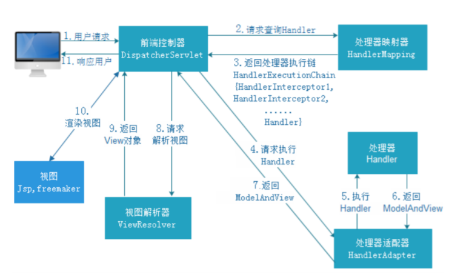

流程说明 

第⼀步：⽤户发送请求⾄前端控制器DispatcherServlet 

第⼆步：DispatcherServlet收到请求调⽤HandlerMapping处理器映射器 

第三步：处理器映射器根据请求Url找到具体的Handler（后端控制器），⽣成处理器对象及处理器拦截 器(如果 有则⽣成)⼀并返回DispatcherServlet 

第四步：DispatcherServlet调⽤HandlerAdapter处理器适配器去调⽤Handler

第五步：处理器适配器执⾏Handler 

第六步：Handler执⾏完成给处理器适配器返回ModelAndView 

第七步：处理器适配器向前端控制器返回 ModelAndView，ModelAndView 是SpringMVC 框架的⼀个 底层对 象，包括 Model 和 View 

第⼋步：前端控制器请求视图解析器去进⾏视图解析，根据逻辑视图名来解析真正的视图。 

第九步：视图解析器向前端控制器返回View 

第⼗步：前端控制器进⾏视图渲染，就是将模型数据（在 ModelAndView 对象中）填充到 request 域 

第⼗⼀步：前端控制器向⽤户响应结果

#### 2.2 Spring MVC 九⼤组件

- HandlerMapping（处理器映射器）

  HandlerMapping 是⽤来查找 Handler 的，也就是处理器，具体的表现形式可以是类，也可以是 ⽅法。⽐如，标注了@RequestMapping的每个⽅法都可以看成是⼀个Handler。Handler负责具 体实际的请求处理，在请求到达后，HandlerMapping 的作⽤便是找到请求相应的处理器 Handler 和 Interceptor.

- HandlerAdapter（处理器适配器）

  HandlerAdapter 是⼀个适配器。因为 Spring MVC 中 Handler 可以是任意形式的，只要能处理请 求即可。但是把请求交给 Servlet 的时候，由于 Servlet 的⽅法结构都是 doService(HttpServletRequest req,HttpServletResponse resp)形式的，要让固定的 Servlet 处理 ⽅法调⽤ Handler 来进⾏处理，便是 HandlerAdapter 的职责。

- HandlerExceptionResolver

  HandlerExceptionResolver ⽤于处理 Handler 产⽣的异常情况。它的作⽤是根据异常设置 ModelAndView，之后交给渲染⽅法进⾏渲染，渲染⽅法会将 ModelAndView 渲染成⻚⾯。

- ViewResolver

  ViewResolver即视图解析器，⽤于将String类型的视图名和Locale解析为View类型的视图，只有⼀ 个resolveViewName()⽅法。从⽅法的定义可以看出，Controller层返回的String类型视图名 viewName 最终会在这⾥被解析成为View。View是⽤来渲染⻚⾯的，也就是说，它会将程序返回 的参数和数据填⼊模板中，⽣成html⽂件。ViewResolver 在这个过程主要完成两件事情： ViewResolver 找到渲染所⽤的模板（第⼀件⼤事）和所⽤的技术（第⼆件⼤事，其实也就是找到 视图的类型，如JSP）并填⼊参数。默认情况下，Spring MVC会⾃动为我们配置⼀个 InternalResourceViewResolver,是针对 JSP 类型视图的。

- RequestToViewNameTranslator

  RequestToViewNameTranslator 组件的作⽤是从请求中获取 ViewName.因为 ViewResolver 根据 ViewName 查找 View，但有的 Handler 处理完成之后,没有设置 View，也没有设置 ViewName， 便要通过这个组件从请求中查找 ViewName。

- LocaleResolver

  ViewResolver 组件的 resolveViewName ⽅法需要两个参数，⼀个是视图名，⼀个是 Locale。 LocaleResolver ⽤于从请求中解析出 Locale，⽐如中国 Locale 是 zh-CN，⽤来表示⼀个区域。这 个组件也是 i18n 的基础。

- ThemeResolver

  ThemeResolver 组件是⽤来解析主题的。主题是样式、图⽚及它们所形成的显示效果的集合。 Spring MVC 中⼀套主题对应⼀个 properties⽂件，⾥⾯存放着与当前主题相关的所有资源，如图 ⽚、CSS样式等。创建主题⾮常简单，只需准备好资源，然后新建⼀个“主题名.properties”并将资 源设置进去，放在classpath下，之后便可以在⻚⾯中使⽤了。SpringMVC中与主题相关的类有 ThemeResolver、ThemeSource和Theme。ThemeResolver负责从请求中解析出主题名， ThemeSource根据主题名找到具体的主题，其抽象也就是Theme，可以通过Theme来获取主题和 具体的资源。

- MultipartResolver

  MultipartResolver ⽤于上传请求，通过将普通的请求包装成 MultipartHttpServletRequest 来实 现。MultipartHttpServletRequest 可以通过 getFile() ⽅法 直接获得⽂件。如果上传多个⽂件，还 可以调⽤ getFileMap()⽅法得到Map这样的结构，MultipartResolver 的作⽤就 是封装普通的请求，使其拥有⽂件上传的功能。

- FlashMapManager

  FlashMap ⽤于重定向时的参数传递，⽐如在处理⽤户订单时候，为了避免重复提交，可以处理完 post请求之后重定向到⼀个get请求，这个get请求可以⽤来显示订单详情之类的信息。这样做虽然 可以规避⽤户重新提交订单的问题，但是在这个⻚⾯上要显示订单的信息，这些数据从哪⾥来获得 呢？因为重定向时么有传递参数这⼀功能的，如果不想把参数写进URL（不推荐），那么就可以通 过FlashMap来传递。只需要在重定向之前将要传递的数据写⼊请求（可以通过ServletRequestAttributes.getRequest()⽅法获得）的属性OUTPUT_FLASH_MAP_ATTRIBUTE 中，这样在重定向之后的Handler中Spring就会⾃动将其设置到Model中，在显示订单信息的⻚⾯ 上就可以直接从Model中获取数据。FlashMapManager 就是⽤来管理 FalshMap 的。


### 第 3 节 请求参数绑定（串讲）

请求参数绑定：说⽩了SpringMVC如何接收请求参数 

http协议（超⽂本传输协议） 

原⽣servlet接收⼀个整型参数： 

1）String ageStr = request.getParameter("age"); 

2) Integer age = Integer.parseInt(ageStr); 

SpringMVC框架对Servlet的封装，简化了servlet的很多操作 

SpringMVC在接收整型参数的时候，直接在Handler⽅法中声明形参即可

```java
@RequestMapping("xxx")
public String handle(Integer age) {
    System.out.println(age);
}
```

参数绑定：取出参数值绑定到handler⽅法的形参上

- 默认⽀持 Servlet API 作为⽅法参数

  当需要使⽤HttpServletRequest、HttpServletResponse、HttpSession等原⽣servlet对象时，直 接在handler⽅法中形参声明使⽤即可。

  ```java
  /**
   *
   * SpringMVC 对原⽣servlet api的⽀持 url：/demo/handle02?id=1
   *
   * 如果要在SpringMVC中使⽤servlet原⽣对象，⽐如
  HttpServletRequest\HttpServletResponse\HttpSession，直接在Handler⽅法形参中声
  明使⽤即可
   *
   */
  @RequestMapping("/handle02")
  public ModelAndView handle02(HttpServletRequest request,
                               HttpServletResponse response,HttpSession session) {
      String id = request.getParameter("id");
      Date date = new Date();
      ModelAndView modelAndView = new ModelAndView();
      modelAndView.addObject("date",date);
      modelAndView.setViewName("success");
      return modelAndView;
  }  
  ```

  

- 绑定简单类型参数

  简单数据类型：⼋种基本数据类型及其包装类型 

  参数类型推荐使⽤包装数据类型，因为基础数据类型不可以为null 
  
  整型：Integer、int 
  
  字符串：String 
  
  单精度：Float、float 
  
  双精度：Double、double 
  
  布尔型：Boolean、boolean 
  
  说明：对于布尔类型的参数，请求的参数值为true或false。或者1或0 
  
  注意：绑定简单数据类型参数，只需要直接声明形参即可（形参参数名和传递的参数名要保持⼀ 致，建议 使⽤包装类型，当形参参数名和传递参数名不⼀致时可以使⽤@RequestParam注解进⾏ ⼿动映射）

```java
/*
 * SpringMVC 接收简单数据类型参数 url：/demo/handle03?id=1
 *
 * 注意：接收简单数据类型参数，直接在handler⽅法的形参中声明即可，框架会取出参数值
然后绑定到对应参数上
 * 要求：传递的参数名和声明的形参名称保持⼀致
 */
@RequestMapping("/handle03")
public ModelAndView handle03(@RequestParam("ids") Integer id,Boolean
                             flag) {
    Date date = new Date();
    ModelAndView modelAndView = new ModelAndView();
    modelAndView.addObject("date",date);
    modelAndView.setViewName("success");
    return modelAndView;
}
```

绑定Pojo类型参数

```java
/*
 * SpringMVC接收pojo类型参数 url：/demo/handle04?id=1&username=zhangsan
 *
 * 接收pojo类型参数，直接形参声明即可，类型就是Pojo的类型，形参名⽆所谓
 * 但是要求传递的参数名必须和Pojo的属性名保持⼀致
 */
@RequestMapping("/handle04")
public ModelAndView handle04(User user) {
    Date date = new Date();
    ModelAndView modelAndView = new ModelAndView();
    modelAndView.addObject("date",date);
    modelAndView.setViewName("success");
    return modelAndView;
}
```

- 绑定Pojo包装对象参数

  包装类型 QueryVo

```java
package com.lagou.edu.pojo;
/**
* @author 应癫
*/
public class QueryVo {
    private String mail;
    private String phone;
    // 嵌套了另外的Pojo对象
    private User user;
    public String getMail() {
        return mail;
    }
    public void setMail(String mail) {
        this.mail = mail;
    }
    public String getPhone() {
        return phone;
    }
    public void setPhone(String phone) {
        this.phone = phone;
    }
    public User getUser() {
        return user;
    }
    public void setUser(User user) {
        this.user = user;
    }
}
```

Handler⽅法

```java
/*
 * SpringMVC接收pojo包装类型参数 url：/demo/handle05?
user.id=1&user.username=zhangsan
 * 不管包装Pojo与否，它⾸先是⼀个pojo，那么就可以按照上述pojo的要求来
 * 1、绑定时候直接形参声明即可
 * 2、传参参数名和pojo属性保持⼀致，如果不能够定位数据项，那么通过属性名 + "." 的
⽅式进⼀步锁定数据
 *
 */
@RequestMapping("/handle05")
public ModelAndView handle05(QueryVo queryVo) {
    Date date = new Date();
    ModelAndView modelAndView = new ModelAndView();
    modelAndView.addObject("date",date);
    modelAndView.setViewName("success");
    return modelAndView;
}
```

- 绑定⽇期类型参数（需要配置⾃定义类型转换器）

  - 前端jsp

    ```java
    <fieldset>
        <p>测试⽤例：SpringMVC接收⽇期类型参数</p>
        <a href="/demo/handle06?birthday=2019-10-08">点击测试</a>
    </fieldset>
    ```

  - 后台Handler⽅法
  
    ```java
    /**
     * 绑定⽇期类型参数
     * 定义⼀个SpringMVC的类型转换器 接⼝，扩展实现接⼝接⼝，注册你的实现
     * @param birthday
     * @return
     */
    @RequestMapping("/handle06")
    public ModelAndView handle06(Date birthday) {
        Date date = new Date();ModelAndView modelAndView = new
            ModelAndView();
        modelAndView.addObject("date",date);
        modelAndView.setViewName("success");
        return modelAndView;
    }
    ```
  
  - ⾃定义类型转换器
  
    ```java
    package com.lagou.edu.converter;
    import org.springframework.core.convert.converter.Converter;
    import java.text.ParseException;
    import java.text.SimpleDateFormat;
    import java.util.Date;
    /**
    * @author 应癫
    * ⾃定义类型转换器
    * S：source，源类型
    * T：target：⽬标类型
    */
    public class DateConverter implements Converter<String, Date> {
        @Override
        public Date convert(String source) {
            // 完成字符串向⽇期的转换
            SimpleDateFormat simpleDateFormat = new
                SimpleDateFormat("yyyy-MM-dd");
            try {
                Date parse = simpleDateFormat.parse(source);
                return parse;
            } catch (ParseException e) {
                e.printStackTrace();
            }
            return null;
        }
    }
    ```
  
  - 注册⾃定义类型转换器
  ```xml
  <!--⾃动注册最合适的处理器映射器，处理器适配器(调⽤handler⽅法)-->
  <mvc:annotation-driven conversionservice="conversionServiceBean"/>
  <!--注册⾃定义类型转换器-->
  <bean id="conversionServiceBean"
        class="org.springframework.format.support.FormattingConversionServiceF
               actoryBean">
      <property name="converters">
          <set>
              <bean class="com.lagou.edu.converter.DateConverter">
              </bean>
          </set>
      </property>
  </bean>
  ```

### 第 4 节 对 Restful ⻛格请求⽀持

- rest⻛格请求是什么样的？ 

- springmvc对rest⻛格请求到底提供了怎样的⽀持 
- 是⼀个注解的使⽤@PathVariable，可以帮助我们从uri中取出参数


#### 4.1 什么是 RESTful

Restful 是⼀种 web 软件架构⻛格，它不是标准也不是协议，它倡导的是⼀个资源定位及资源操作的⻛ 格。

什么是 REST：

REST（英⽂：Representational State Transfer，简称 REST）描述了⼀个架构样式的⽹络系统， ⽐如 web 应⽤程序。它⾸次出现在 2000 年 Roy Fielding 的博⼠论⽂中，他是 HTTP 规范的主要编写者之 ⼀。在⽬前主流的三种 Web 服务交互⽅案中，REST 相⽐于 SOAP（Simple Object Access protocol， 简单对象访问协议）以及 XML-RPC 更加简单明了，⽆论是对 URL 的处理还是对 Payload 的编码， REST 都倾向于⽤更加简单轻量的⽅法设计和实现。值得注意的是 REST 并没有⼀个明确的标准，⽽更像 是⼀种设计的⻛格。

它本身并没有什么实⽤性，其核⼼价值在于如何设计出符合 REST ⻛格的⽹络接⼝。

资源 表现层 状态转移

Restful 的优点

它结构清晰、符合标准、易于理解、扩展⽅便，所以正得到越来越多⽹站的采⽤。

Restful 的特性

资源（Resources）：⽹络上的⼀个实体，或者说是⽹络上的⼀个具体信息。

它可以是⼀段⽂本、⼀张图⽚、⼀⾸歌曲、⼀种服务，总之就是⼀个具体的存在。可以⽤⼀个 URI（统 ⼀资源定位符）指向它，每种资源对应⼀个特定的 URI 。要获取这个资源，访问它的 URI 就可以，因此 URI 即为每⼀个资源的独⼀⽆⼆的识别符。

表现层（Representation）：把资源具体呈现出来的形式，叫做它的表现层 （Representation）。⽐ 如，⽂本可以⽤ txt 格式表现，也可以⽤ HTML 格式、XML 格式、JSON 格式表现，甚⾄可以采⽤⼆进 制格式。

状态转化（State Transfer）：每发出⼀个请求，就代表了客户端和服务器的⼀次交互过程。

HTTP 协议，是⼀个⽆状态协议，即所有的状态都保存在服务器端。因此，如果客户端想要操作服务 器， 必须通过某种⼿段，让服务器端发⽣“状态转化”（State Transfer）。⽽这种转化是建⽴在表现层 之上的，所以就是 “ 表现层状态转化” 。具体说， 就是 HTTP 协议⾥⾯，四个表示操作⽅式的动词： GET 、POST 、PUT 、DELETE 。它们分别对应四种基本操作：GET ⽤来获取资源，POST ⽤来新建资 源，PUT ⽤来更新资源，DELETE ⽤来删除资源。


RESTful 的示例：

rest是⼀个url请求的⻛格，基于这种⻛格设计请求的url 

没有rest的话，原有的url设计

http://localhost:8080/user/queryUserById.action?id=3 

url中定义了动作（操作），参数具体锁定到操作的是谁

有了rest⻛格之后 

rest中，认为互联⽹中的所有东⻄都是资源，既然是资源就会有⼀个唯⼀的uri标识它，代表它 

http://localhost:8080/user/3 

代表的是id为3的那个⽤户记录（资源） 

锁定资源之后如何操作它呢？常规操作就是增删改查 

根据请求⽅式不同，代表要做不同的操作 

get 查询，获取资源 

post 增加，新建资源 

put 更新 

delete 删除资源 

rest⻛格带来的直观体现：就是传递参数⽅式的变化，参数可以在uri中了

/account/1 HTTP GET ：得到 id = 1 的 account 

/account/1 HTTP DELETE：删除 id = 1 的 account 

/account/1 HTTP PUT：更新 id = 1 的 account 

URL：资源定位符，通过URL地址去定位互联⽹中的资源（抽象的概念，⽐如图⽚、视频、app服务 等）。 

RESTful ⻛格 URL：互联⽹所有的事物都是资源，要求URL中只有表示资源的名称，没有动词。 

RESTful⻛格资源操作：使⽤HTTP请求中的method⽅法put、delete、post、get来操作资源。分别对 应添加、删除、修改、查询。不过⼀般使⽤时还是 post 和 get。put 和 delete⼏乎不使⽤。 

RESTful ⻛格资源表述：可以根据需求对URL定位的资源返回不同的表述（也就是返回数据类型，⽐如 XML、JSON等数据格式）。 

Spring MVC ⽀持 RESTful ⻛格请求，具体讲的就是使⽤ @PathVariable 注解获取 RESTful ⻛格的请求 URL中的路径变量。

示例代码:

- 前端jsp⻚⾯

```html
<div>
    <h2>SpringMVC对Restful⻛格url的⽀持</h2>
    <fieldset>
        <p>测试⽤例：SpringMVC对Restful⻛格url的⽀持</p>
        <a href="/demo/handle/15">rest_get测试</a>
        <form method="post" action="/demo/handle">
            <input type="text" name="username"/>
            <input type="submit" value="提交rest_post请求"/>
        </form>
        <form method="post" action="/demo/handle/15/lisi">
            <input type="hidden" name="_method" value="put"/>
            <input type="submit" value="提交rest_put请求"/>
        </form>
        <form method="post" action="/demo/handle/15">
            <input type="hidden" name="_method" value="delete"/>
            <input type="submit" value="提交rest_delete请求"/>
        </form>
    </fieldset>
</div>
```

- 后台Handler⽅法

```java
/*
 * restful get /demo/handle/15
 */
@RequestMapping(value = "/handle/{id}",method =
                {RequestMethod.GET})
public ModelAndView handleGet(@PathVariable("id") Integer id) {
    Date date = new Date();
    ModelAndView modelAndView = new ModelAndView();
    modelAndView.addObject("date",date);
    modelAndView.setViewName("success");
    return modelAndView;
}
/*
 * restful post /demo/handle
 */
@RequestMapping(value = "/handle",method = {RequestMethod.POST})
public ModelAndView handlePost(String username) {
    Date date = new Date();
    ModelAndView modelAndView = new ModelAndView();
    modelAndView.addObject("date",date);
    modelAndView.setViewName("success");
    return modelAndView;
}
/*
 * restful put /demo/handle/15/lisi
 */
@RequestMapping(value = "/handle/{id}/{name}",method =
                {RequestMethod.PUT})
public ModelAndView handlePut(@PathVariable("id") Integer
                              id,@PathVariable("name") String username) {
    Date date = new Date();
    ModelAndView modelAndView = new ModelAndView();
    modelAndView.addObject("date",date);
    modelAndView.setViewName("success");
    return modelAndView;
}
/*
 * restful delete /demo/handle/15
 */
@RequestMapping(value = "/handle/{id}",method =
                {RequestMethod.DELETE})
public ModelAndView handleDelete(@PathVariable("id") Integer id) {
    Date date = new Date();
    ModelAndView modelAndView = new ModelAndView();
    modelAndView.addObject("date",date);
    modelAndView.setViewName("success");
    return modelAndView;
}
```


- web.xml中配置请求⽅式过滤器（将特定的post请求转换为put和delete请求）

```xml
<!--配置springmvc请求⽅式转换过滤器，会检查请求参数中是否有_method参数，如果有就
按照指定的请求⽅式进⾏转换-->
<filter>
    <filter-name>hiddenHttpMethodFilter</filter-name>
    <filterclass>org.springframework.web.filter.HiddenHttpMethodFilter</filterclass>
</filter>
<filter-mapping>
    <filter-name>encoding</filter-name>
    <url-pattern>/*</url-pattern>
</filter-mapping>
<filter-mapping>
    <filter-name>hiddenHttpMethodFilter</filter-name>
    <url-pattern>/*</url-pattern>
</filter-mapping>
```


### 第 5 节 Ajax Json交互


交互：两个⽅向 

1）前端到后台：前端ajax发送json格式字符串，后台直接接收为pojo参数，使⽤注解@RequstBody 

2）后台到前端：后台直接返回pojo对象，前端直接接收为json对象或者字符串，使⽤注解 @ResponseBody 

#### 5.1 什么是 Json 

Json是⼀种与语⾔⽆关的数据交互格式，就是⼀种字符串，只是⽤特殊符号{}内表示对象、[]内表示数 组、""内是属性或值、：表示后者是前者的值 

{"name": "Michael"}可以理解为是⼀个包含name为Michael的对象 

[{"name": "Michael"},{"name": "Jerry"}]就表示包含两个对象的数组 

#### 5.2 @ResponseBody注解 

@responseBody注解的作⽤是将controller的⽅法返回的对象通过适当的转换器转换为指定的格式之 后，写⼊到response对象的body区，通常⽤来返回JSON数据或者是XML数据。 注意：在使⽤此注解之 后不会再⾛视图处理器，⽽是直接将数据写⼊到输⼊流中，他的效果等同于通过response对象输出指定 格式的数据。


#### 5.3 分析Spring MVC 使⽤ Json 交互

所需jar包

```xml
<!--json数据交互所需jar，start-->
<dependency>
    <groupId>com.fasterxml.jackson.core</groupId>
    <artifactId>jackson-core</artifactId>
    <version>2.9.0</version>
</dependency>
<dependency>
    <groupId>com.fasterxml.jackson.core</groupId>
    <artifactId>jackson-databind</artifactId>
    <version>2.9.0</version>
</dependency>
<dependency>
    <groupId>com.fasterxml.jackson.core</groupId>
    <artifactId>jackson-annotations</artifactId>
    <version>2.9.0</version>
</dependency>
<!--json数据交互所需jar，end-->
```

示例代码:

- 前端jsp⻚⾯及js代码

```xml
<div>
    <h2>Ajax json交互</h2>
    <fieldset>
        <input type="button" id="ajaxBtn" value="ajax提交"/>
    </fieldset>
</div>
```

```js
$(function () {
    $("#ajaxBtn").bind("click",function () {
        // 发送ajax请求
        $.ajax({
            url: '/demo/handle07',
            type: 'POST',
            data: '{"id":"1","name":"李四"}',
            contentType: 'application/json;charset=utf-8',
            dataType: 'json',
            success: function (data) {
                alert(data.name);
            }
        })
    })
})
```

- 后台Handler⽅法

```java
@RequestMapping("/handle07")
// 添加@ResponseBody之后，不再⾛视图解析器那个流程，⽽是等同于response直接输出
数据
    public @ResponseBody User handle07(@RequestBody User user) {
    // 业务逻辑处理，修改name为张三丰
    user.setName("张三丰");
    return user;
}
```


## 第⼆部分 Spring MVC ⾼级技术

### 第 1 节 拦截器(Inteceptor)使⽤

#### 1.1 监听器、过滤器和拦截器对⽐

- Servlet：处理Request请求和Response响应 

- 过滤器（Filter）：对Request请求起到过滤的作⽤，作⽤在Servlet之前，如果配置为/*可以对所 有的资源访问（servlet、js/css静态资源等）进⾏过滤处理 

- 监听器（Listener）：实现了javax.servlet.ServletContextListener 接⼝的服务器端组件，它随 Web应⽤的启动⽽启动，只初始化⼀次，然后会⼀直运⾏监视，随Web应⽤的停⽌⽽销毁 

  作⽤⼀：做⼀些初始化⼯作，web应⽤中spring容器启动ContextLoaderListener 

  作⽤⼆：监听web中的特定事件，⽐如HttpSession,ServletRequest的创建和销毁；变量的创建、 销毁和修改等。可以在某些动作前后增加处理，实现监控，⽐如统计在线⼈数，利⽤ HttpSessionLisener等。 

- 拦截器（Interceptor）：是SpringMVC、Struts等表现层框架⾃⼰的，不会拦截 jsp/html/css/image的访问等，只会拦截访问的控制器⽅法（Handler）。 从配置的⻆度也能够总结发现：serlvet、filter、listener是配置在web.xml中的，⽽interceptor是 配置在表现层框架⾃⼰的配置⽂件中的 

  - 在Handler业务逻辑执⾏之前拦截⼀次 
  - 在Handler逻辑执⾏完毕但未跳转⻚⾯之前拦截⼀次 
  - 在跳转⻚⾯之后拦截⼀次

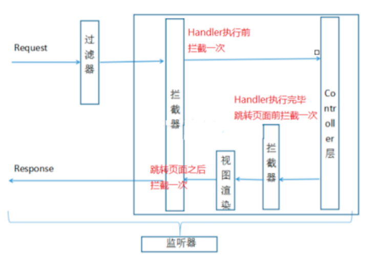

#### 1.2 拦截器的执⾏流程

在运⾏程序时，拦截器的执⾏是有⼀定顺序的，该顺序与配置⽂件中所定义的拦截器的顺序相关。 单个 拦截器，在程序中的执⾏流程如下图所示：

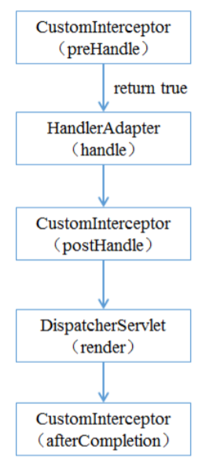

1）程序先执⾏preHandle()⽅法，如果该⽅法的返回值为true，则程序会继续向下执⾏处理器中的⽅ 法，否则将不再向下执⾏。 

2）在业务处理器（即控制器Controller类）处理完请求后，会执⾏postHandle()⽅法，然后会通过 DispatcherServlet向客户端返回响应。 

3）在DispatcherServlet处理完请求后，才会执⾏afterCompletion()⽅法。

#### 1.3 多个拦截器的执⾏流程

多个拦截器（假设有两个拦截器Interceptor1和Interceptor2，并且在配置⽂件中， Interceptor1拦截 器配置在前），在程序中的执⾏流程如下图所示：

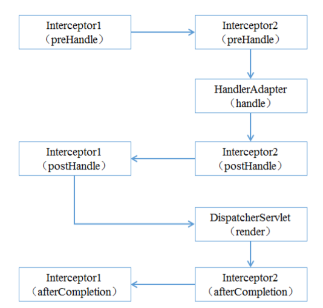


从图可以看出，当有多个拦截器同时⼯作时，它们的preHandle()⽅法会按照配置⽂件中拦截器的配置 顺序执⾏，⽽它们的postHandle()⽅法和afterCompletion()⽅法则会按照配置顺序的反序执⾏。

示例代码

⾃定义SpringMVC拦截器

```java
package com.lagou.edu.interceptor;
import org.springframework.web.servlet.HandlerInterceptor;
import org.springframework.web.servlet.ModelAndView;
import javax.servlet.http.HttpServletRequest;
import javax.servlet.http.HttpServletResponse;
/**
* ⾃定义springmvc拦截器
*/
public class MyIntercepter01 implements HandlerInterceptor {
    /**
 * 会在handler⽅法业务逻辑执⾏之前执⾏
 * 往往在这⾥完成权限校验⼯作
 * @param request
 * @param response
 * @param handler
 * @return 返回值boolean代表是否放⾏，true代表放⾏，false代表中⽌
 * @throws Exception
 */
    @Override
    public boolean preHandle(HttpServletRequest request, HttpServletResponse
                             response, Object handler) throws Exception {
        System.out.println("MyIntercepter01 preHandle......");
        return true;
    }
    /**
 * 会在handler⽅法业务逻辑执⾏之后尚未跳转⻚⾯时执⾏
 * @param request
 * @param response
 * @param handler
 * @param modelAndView 封装了视图和数据，此时尚未跳转⻚⾯呢，你可以在这⾥针对返回的
数据和视图信息进⾏修改
 * @throws Exception
 */
    @Override
    public void postHandle(HttpServletRequest request, HttpServletResponse
                           response, Object handler, ModelAndView modelAndView) throws Exception {
        System.out.println("MyIntercepter01 postHandle......");
    }
    /**
 * ⻚⾯已经跳转渲染完毕之后执⾏
 * @param request
 * @param response
 * @param handler
 * @param ex 可以在这⾥捕获异常
 * @throws Exception
 */
    @Override
    public void afterCompletion(HttpServletRequest request,
                                HttpServletResponse response, Object handler, Exception ex) throws Exception {
        System.out.println("MyIntercepter01 afterCompletion......");
    }
}
```

注册SpringMVC拦截器

```xml
<mvc:interceptors>
    <!--拦截所有handler-->
    <!--<bean class="com.lagou.edu.interceptor.MyIntercepter01"/>-->

    <mvc:interceptor>
        <!--配置当前拦截器的url拦截规则，**代表当前⽬录下及其⼦⽬录下的所有url-->
        <mvc:mapping path="/**"/>
        <!--exclude-mapping可以在mapping的基础上排除⼀些url拦截-->
        <!--<mvc:exclude-mapping path="/demo/**"/>-->
        <bean class="com.lagou.edu.interceptor.MyIntercepter01"/>
    </mvc:interceptor>
    <mvc:interceptor>
        <mvc:mapping path="/**"/>
        <bean class="com.lagou.edu.interceptor.MyIntercepter02"/>
    </mvc:interceptor>

</mvc:interceptors>
```

#### 第 2 节 处理multipart形式的数据

⽂件上传 

原⽣servlet处理上传的⽂件数据的，springmvc⼜是对serlvet的封装

所需jar包

```xml
<!--⽂件上传所需jar坐标-->
<dependency>
    <groupId>commons-fileupload</groupId>
    <artifactId>commons-fileupload</artifactId>
    <version>1.3.1</version>
</dependency>
```

配置⽂件上传解析器

```xml
<!--配置⽂件上传解析器，id是固定的multipartResolver-->
<bean id="multipartResolver"
      class="org.springframework.web.multipart.commons.CommonsMultipartResolver">
    <!--设置上传⼤⼩，单位字节-->
    <property name="maxUploadSize" value="1000000000"/>
</bean>
```

前端Form

```jsp
<%--
 1 method="post"
 2 enctype="multipart/form-data"
 3 type="file"
--%>
<form method="post" enctype="multipart/form-data" action="/demo/upload">
 <input type="file" name="uploadFile"/>
 <input type="submit" value="上传"/>
</form>
```

后台接收Handler

```java
@RequestMapping("upload")
public String upload(MultipartFile uploadFile, HttpServletRequest request)
    throws IOException {
    // ⽂件原名，如xxx.jpg
    String originalFilename = uploadFile.getOriginalFilename();
    // 获取⽂件的扩展名,如jpg
    String extendName =
        originalFilename.substring(originalFilename.lastIndexOf(".") + 1,
                                   originalFilename.length());
    String uuid = UUID.randomUUID().toString();
    // 新的⽂件名字
    String newName = uuid + "." + extendName;
    String realPath =
        request.getSession().getServletContext().getRealPath("/uploads");
    // 解决⽂件夹存放⽂件数量限制，按⽇期存放
    String datePath = new SimpleDateFormat("yyyy-MM-dd").format(new Date());
    File floder = new File(realPath + "/" + datePath);
    if(!floder.exists()) {
        floder.mkdirs();
    }
    uploadFile.transferTo(new File(floder,newName));
    return "success";
}
```

### 第 3 节 在控制器中处理异常

```java
package com.lagou.edu.controller;
import org.springframework.web.bind.annotation.ControllerAdvice;
import org.springframework.web.bind.annotation.ExceptionHandler;
import org.springframework.web.servlet.ModelAndView;
import javax.servlet.http.HttpServletResponse;
import java.io.IOException;
// 可以让我们优雅的捕获所有Controller对象handler⽅法抛出的异常
@ControllerAdvice
public class GlobalExceptionResolver {
    @ExceptionHandler(ArithmeticException.class)
    public ModelAndView handleException(ArithmeticException exception,
                                        HttpServletResponse response) {
        ModelAndView modelAndView = new ModelAndView();
        modelAndView.addObject("msg",exception.getMessage());
        modelAndView.setViewName("error");
        return modelAndView;
    }
}
```


### 第 4 节 基于Flash属性的跨重定向请求数据传递

重定向时请求参数会丢失，我们往往需要重新携带请求参数，我们可以进⾏⼿动参数拼接如下：

```java
return "redirect:handle01?name=" + name;
```

但是上述拼接参数的⽅法属于get请求，携带参数⻓度有限制，参数安全性也不⾼，此时，我们可以使 ⽤SpringMVC提供的flash属性机制，向上下⽂中添加flash属性，框架会在session中记录该属性值，当 跳转到⻚⾯之后框架会⾃动删除flash属性，不需要我们⼿动删除，通过这种⽅式进⾏重定向参数传递， 参数⻓度和安全性都得到了保障，如下：

```java
/**
 * SpringMVC 重定向时参数传递的问题
 * 转发：A 找 B 借钱400，B没有钱但是悄悄的找到C借了400块钱给A
 * url不会变,参数也不会丢失,⼀个请求
 * 重定向：A 找 B 借钱400，B 说我没有钱，你找别⼈借去，那么A ⼜带着400块的借钱需求找到
C
 * url会变,参数会丢失需要重新携带参数,两个请求
 */
@RequestMapping("/handleRedirect")
public String handleRedirect(String name,RedirectAttributes
                             redirectAttributes) {
    //return "redirect:handle01?name=" + name; // 拼接参数安全性、参数⻓度都有
    局限
        // addFlashAttribute⽅法设置了⼀个flash类型属性，该属性会被暂存到session中，在
        跳转到⻚⾯之后该属性销毁
        redirectAttributes.addFlashAttribute("name",name);
    return "redirect:handle01";
}
```


## 第三部分 ⼿写 MVC 框架

- 回顾SpringMVC执⾏的⼤致原理，后续根据这个模仿⼿写⾃⼰的mvc框架

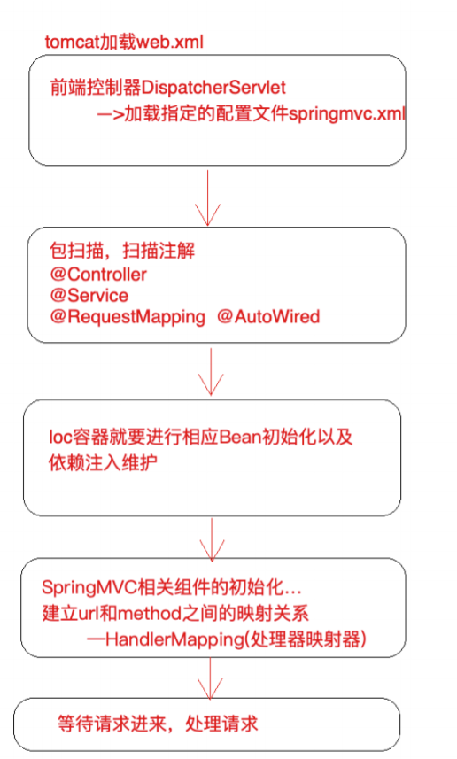


- ⼿写MVC框架之注解开发
  
  - LagouController
  
  ```java
  package com.lagou.edu.mvcframework.annotations;
  import java.lang.annotation.*;
  @Documented
  @Target(ElementType.TYPE)
  @Retention(RetentionPolicy.RUNTIME)
  public @interface LagouController {
      String value() default "";
  }
  ```
  
  - LagouService
  
  ```java
  package com.lagou.edu.mvcframework.annotations;
  import java.lang.annotation.*;
  @Documented
  @Target(ElementType.TYPE)
  @Retention(RetentionPolicy.RUNTIME)
  public @interface LagouService {
      String value() default "";
  }
  ```
  
  - LagouAutowired
  
  ```java
  package com.lagou.edu.mvcframework.annotations;
  import java.lang.annotation.*;
  @Documented
  @Target(ElementType.FIELD)
  @Retention(RetentionPolicy.RUNTIME)
  public @interface LagouAutowired {
      String value() default "";
  }
  ```
  
  - LagouRequestMapping
  
  ```java
  package com.lagou.edu.mvcframework.annotations;
  import java.lang.annotation.*;
  @Documented
  @Target({ElementType.TYPE,ElementType.METHOD})
  @Retention(RetentionPolicy.RUNTIME)
  public @interface LagouRequestMapping {
      String value() default "";
  }
  ```
  
- LgDispatcherServlet

```java
package com.lagou.edu.mvcframework.servlet;
import com.lagou.demo.service.IDemoService;
import com.lagou.edu.mvcframework.annotations.LagouAutowired;
import com.lagou.edu.mvcframework.annotations.LagouController;
import com.lagou.edu.mvcframework.annotations.LagouRequestMapping;
import com.lagou.edu.mvcframework.annotations.LagouService;
import com.lagou.edu.mvcframework.pojo.Handler;
import org.apache.commons.lang3.StringUtils;
import javax.servlet.ServletConfig;
import javax.servlet.ServletException;
import javax.servlet.http.HttpServlet;
import javax.servlet.http.HttpServletRequest;
import javax.servlet.http.HttpServletResponse;
import java.io.File;
import java.io.IOException;
import java.io.InputStream;
import java.lang.reflect.Field;
import java.lang.reflect.InvocationTargetException;
import java.lang.reflect.Method;
import java.lang.reflect.Parameter;
import java.util.*;
import java.util.regex.Matcher;
import java.util.regex.Pattern;
public class LgDispatcherServlet extends HttpServlet {
    private Properties properties = new Properties();
    private List<String> classNames = new ArrayList<>(); // 缓存扫描到的类的
    全限定类名
        // ioc容器
        private Map<String,Object> ioc = new HashMap<String,Object>();
    // handlerMapping
    //private Map<String,Method> handlerMapping = now HashMap<>(); // 存储
    url和Method之间的映射关系
        private List<Handler> handlerMapping = new ArrayList<>();
    @Override
    public void init(ServletConfig config) throws ServletException {
        // 1 加载配置⽂件 springmvc.properties
        String contextConfigLocation =
            config.getInitParameter("contextConfigLocation");
        doLoadConfig(contextConfigLocation);
        // 2 扫描相关的类，扫描注解
        doScan(properties.getProperty("scanPackage"));

        // 3 初始化bean对象（实现ioc容器，基于注解）
        doInstance();
        // 4 实现依赖注⼊
        doAutoWired();
        // 5 构造⼀个HandlerMapping处理器映射器，将配置好的url和Method建⽴映射关系
        initHandlerMapping();
        System.out.println("lagou mvc 初始化完成....");
        // 等待请求进⼊，处理请求
    }
    /*
 构造⼀个HandlerMapping处理器映射器
 最关键的环节
 ⽬的：将url和method建⽴关联
 */
    private void initHandlerMapping() {
        if(ioc.isEmpty()) {return;}
        for(Map.Entry<String,Object> entry: ioc.entrySet()) {
            // 获取ioc中当前遍历的对象的class类型
            Class<?> aClass = entry.getValue().getClass();
            if(!aClass.isAnnotationPresent(LagouController.class))
            {continue;}
            String baseUrl = "";
            if(aClass.isAnnotationPresent(LagouRequestMapping.class)) {
                LagouRequestMapping annotation =
                    aClass.getAnnotation(LagouRequestMapping.class);
                baseUrl = annotation.value(); // 等同于/demo
            }
            // 获取⽅法
            Method[] methods = aClass.getMethods();
            for (int i = 0; i < methods.length; i++) {
                Method method = methods[i];
                // ⽅法没有标识LagouRequestMapping，就不处理
                if(!method.isAnnotationPresent(LagouRequestMapping.class))
                {continue;}
                // 如果标识，就处理
                LagouRequestMapping annotation =
                    method.getAnnotation(LagouRequestMapping.class);
                String methodUrl = annotation.value(); // /query
                String url = baseUrl + methodUrl; // 计算出来的url
                /demo/query
                    // 把method所有信息及url封装为⼀个Handler
                    Handler handler = new Handler(entry.getValue(),method,
                                                  Pattern.compile(url));
                // 计算⽅法的参数位置信息 // query(HttpServletRequest
                request, HttpServletResponse response,String name)
                    Parameter[] parameters = method.getParameters();
                for (int j = 0; j < parameters.length; j++) {
                    Parameter parameter = parameters[j];
                    if(parameter.getType() == HttpServletRequest.class ||
                       parameter.getType() == HttpServletResponse.class) {
                        // 如果是request和response对象，那么参数名称写
                        HttpServletRequest和HttpServletResponse

                            handler.getParamIndexMapping().put(parameter.getType().getSimpleName(),j)
                            ;
                    }else{

                        handler.getParamIndexMapping().put(parameter.getName(),j); // <name,2>
                    }
                }
                // 建⽴url和method之间的映射关系（map缓存起来）
                handlerMapping.add(handler);
            }
        }
    }
    // 实现依赖注⼊
    private void doAutoWired() {
        if(ioc.isEmpty()) {return;}
        // 有对象，再进⾏依赖注⼊处理
        // 遍历ioc中所有对象，查看对象中的字段，是否有@LagouAutowired注解，如果有需
        要维护依赖注⼊关系
            for(Map.Entry<String,Object> entry: ioc.entrySet()) {
                // 获取bean对象中的字段信息
                Field[] declaredFields =
                    entry.getValue().getClass().getDeclaredFields();
                // 遍历判断处理
                for (int i = 0; i < declaredFields.length; i++) {
                    Field declaredField = declaredFields[i]; //
                    @LagouAutowired private IDemoService demoService;

                    if(!declaredField.isAnnotationPresent(LagouAutowired.class)) {
                        continue;
                    }
                    // 有该注解
                    LagouAutowired annotation =
                        declaredField.getAnnotation(LagouAutowired.class);
                    String beanName = annotation.value(); // 需要注⼊的bean的id
                    if("".equals(beanName.trim())) {
                        // 没有配置具体的bean id，那就需要根据当前字段类型注⼊（接⼝注
                        ⼊） IDemoService
                            beanName = declaredField.getType().getName();
                    }
                    // 开启赋值
                    declaredField.setAccessible(true);
                    try {
                        declaredField.set(entry.getValue(),ioc.get(beanName));
                    } catch (IllegalAccessException e) {
                        e.printStackTrace();
                    }
                }
            }
    }
    // ioc容器
    // 基于classNames缓存的类的全限定类名，以及反射技术，完成对象创建和管理
    private void doInstance() {

        if(classNames.size() == 0) return;
        try{
            for (int i = 0; i < classNames.size(); i++) {
                String className = classNames.get(i); //
                com.lagou.demo.controller.DemoController
                    // 反射
                    Class<?> aClass = Class.forName(className);
                // 区分controller，区分service'
                if(aClass.isAnnotationPresent(LagouController.class)) {
                    // controller的id此处不做过多处理，不取value了，就拿类的⾸字
                    ⺟⼩写作为id，保存到ioc中
                        String simpleName = aClass.getSimpleName();//
                    DemoController
                        String lowerFirstSimpleName = lowerFirst(simpleName);
                    // demoController
                    Object o = aClass.newInstance();
                    ioc.put(lowerFirstSimpleName,o);
                }else if(aClass.isAnnotationPresent(LagouService.class)) {
                    LagouService annotation =
                        aClass.getAnnotation(LagouService.class);
                    //获取注解value值
                    String beanName = annotation.value();
                    // 如果指定了id，就以指定的为准
                    if(!"".equals(beanName.trim())) {
                        ioc.put(beanName,aClass.newInstance());
                    }else{
                        // 如果没有指定，就以类名⾸字⺟⼩写
                        beanName = lowerFirst(aClass.getSimpleName());
                        ioc.put(beanName,aClass.newInstance());
                    }
                    // service层往往是有接⼝的，⾯向接⼝开发，此时再以接⼝名为id，
                    放⼊⼀份对象到ioc中，便于后期根据接⼝类型注⼊
                        Class<?>[] interfaces = aClass.getInterfaces();
                    for (int j = 0; j < interfaces.length; j++) {
                        Class<?> anInterface = interfaces[j];
                        // 以接⼝的全限定类名作为id放⼊

                        ioc.put(anInterface.getName(),aClass.newInstance());
                    }
                }else{
                    continue;
                }
            }
        }catch (Exception e) {
            e.printStackTrace();
        }
    }
    // ⾸字⺟⼩写⽅法
    public String lowerFirst(String str) {
        char[] chars = str.toCharArray();
        if('A' <= chars[0] && chars[0] <= 'Z') {
            chars[0] += 32;
        }
        return String.valueOf(chars);
    }
    // 扫描类
    // scanPackage: com.lagou.demo package----> 磁盘上的⽂件夹（File）
    com/lagou/demo
        private void doScan(String scanPackage) {
        String scanPackagePath =
            Thread.currentThread().getContextClassLoader().getResource("").getPath() +
            scanPackage.replaceAll("\\.", "/");
        File pack = new File(scanPackagePath);
        File[] files = pack.listFiles();
        for(File file: files) {
            if(file.isDirectory()) { // ⼦package
                // 递归
                doScan(scanPackage + "." + file.getName()); //
                com.lagou.demo.controller
            }else if(file.getName().endsWith(".class")) {
                String className = scanPackage + "." +
                    file.getName().replaceAll(".class", "");
                classNames.add(className);
            }

        }
    }
    // 加载配置⽂件
    private void doLoadConfig(String contextConfigLocation) {
        InputStream resourceAsStream =
            this.getClass().getClassLoader().getResourceAsStream(contextConfigLocation
                                                                );
        try {
            properties.load(resourceAsStream);
        } catch (IOException e) {
            e.printStackTrace();
        }
    }
    @Override
    protected void doGet(HttpServletRequest req, HttpServletResponse resp)
        throws ServletException, IOException {
        doPost(req,resp);
    }
    @Override
    protected void doPost(HttpServletRequest req, HttpServletResponse
                          resp) throws ServletException, IOException {
        // 处理请求：根据url，找到对应的Method⽅法，进⾏调⽤
        // 获取uri
        // String requestURI = req.getRequestURI();
        // Method method = handlerMapping.get(requestURI);// 获取到⼀个反射的
        ⽅法
            // 反射调⽤，需要传⼊对象，需要传⼊参数，此处⽆法完成调⽤，没有把对象缓存起来，
            也没有参数！！！！改造initHandlerMapping();
        // method.invoke() //
        // 根据uri获取到能够处理当前请求的hanlder（从handlermapping中（list））
        Handler handler = getHandler(req);
        if(handler == null) {
            resp.getWriter().write("404 not found");
            return;
        }
        // 参数绑定

        // 获取所有参数类型数组，这个数组的⻓度就是我们最后要传⼊的args数组的⻓度
        Class<?>[] parameterTypes =
            handler.getMethod().getParameterTypes();
        // 根据上述数组⻓度创建⼀个新的数组（参数数组，是要传⼊反射调⽤的）
        Object[] paraValues = new Object[parameterTypes.length];
        // 以下就是为了向参数数组中塞值，⽽且还得保证参数的顺序和⽅法中形参顺序⼀致
        Map<String, String[]> parameterMap = req.getParameterMap();
        // 遍历request中所有参数 （填充除了request，response之外的参数）
        for(Map.Entry<String,String[]> param: parameterMap.entrySet()) {
            // name=1&name=2 name [1,2]
            String value = StringUtils.join(param.getValue(), ","); // 如
            同 1,2
                // 如果参数和⽅法中的参数匹配上了，填充数据

                if(!handler.getParamIndexMapping().containsKey(param.getKey()))
                {continue;}
            // ⽅法形参确实有该参数，找到它的索引位置，对应的把参数值放⼊paraValues
            Integer index =
                handler.getParamIndexMapping().get(param.getKey());//name在第 2 个位置
            paraValues[index] = value; // 把前台传递过来的参数值填充到对应的位置
            去
        }
        int requestIndex =
            handler.getParamIndexMapping().get(HttpServletRequest.class.getSimpleName(
        )); // 0
        paraValues[requestIndex] = req;
        int responseIndex =
            handler.getParamIndexMapping().get(HttpServletResponse.class.getSimpleName
                                               ()); // 1
        paraValues[responseIndex] = resp;
        // 最终调⽤handler的method属性
        try {
            handler.getMethod().invoke(handler.getController(),paraValues);
        } catch (IllegalAccessException e) {
            e.printStackTrace();
        } catch (InvocationTargetException e) {
            e.printStackTrace();
        }
    }
    private Handler getHandler(HttpServletRequest req) {
        if(handlerMapping.isEmpty()){return null;}
        String url = req.getRequestURI();
        for(Handler handler: handlerMapping) {
            Matcher matcher = handler.getPattern().matcher(url);
            if(!matcher.matches()){continue;}
            return handler;
        }
        return null;
    }
}
```


- Pojo类Handler

```java
package com.lagou.edu.mvcframework.pojo;
import javax.sound.midi.MetaEventListener;
import java.lang.reflect.Method;
import java.util.HashMap;
import java.util.Map;
import java.util.regex.Pattern;
/**
* 封装handler⽅法相关的信息
*/
public class Handler {
    private Object controller; // method.invoke(obj,)
    private Method method;

    private Pattern pattern; // spring中url是⽀持正则的
    private Map<String,Integer> paramIndexMapping; // 参数顺序,是为了进⾏参数
    绑定，key是参数名，value代表是第⼏个参数 <name,2>
        public Handler(Object controller, Method method, Pattern pattern) {
        this.controller = controller;
        this.method = method;
        this.pattern = pattern;
        this.paramIndexMapping = new HashMap<>();
    }
    public Object getController() {
        return controller;
    }
    public void setController(Object controller) {
        this.controller = controller;
    }
    public Method getMethod() {
        return method;
    }
    public void setMethod(Method method) {
        this.method = method;
    }
    public Pattern getPattern() {
        return pattern;
    }
    public void setPattern(Pattern pattern) {
        this.pattern = pattern;
    }
    public Map<String, Integer> getParamIndexMapping() {
        return paramIndexMapping;
    }
    public void setParamIndexMapping(Map<String, Integer>
                                     paramIndexMapping) {
        this.paramIndexMapping = paramIndexMapping;
    }
}
```


- web.xml配置


```xml
<!DOCTYPE web-app PUBLIC
"-//Sun Microsystems, Inc.//DTD Web Application 2.3//EN"
"http://java.sun.com/dtd/web-app_2_3.dtd" >
<web-app>
    <display-name>Archetype Created Web Application</display-name>
    <servlet>
        <servlet-name>lgoumvc</servlet-name>
        <servletclass>com.lagou.edu.mvcframework.servlet.LgDispatcherServlet</servletclass>
        <init-param>
            <param-name>contextConfigLocation</param-name>
            <param-value>springmvc.properties</param-value>
        </init-param>
    </servlet>

    <servlet-mapping>
        <servlet-name>lgoumvc</servlet-name>
        <url-pattern>/*</url-pattern>
    </servlet-mapping>
</web-app>
```


## 第四部分 Spring MVC 源码深度剖析

### 第 1 节 前端控制器 DispatcherServlet 继承结构

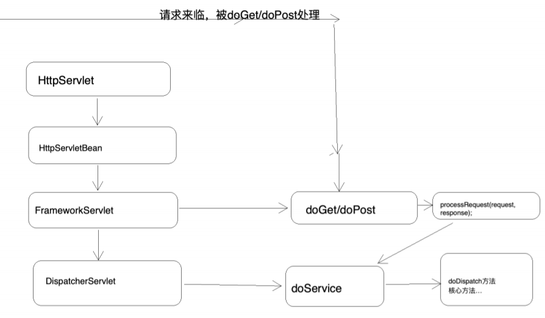


### 第 2 节 重要时机点分析

1）Handler⽅法的执⾏时机

打断点


观察调⽤栈


doDispathch⽅法中的1064⾏代码完成handler⽅法的调⽤

2）⻚⾯渲染时机（打断点并观察调⽤栈）


SpringMVC处理请求的流程即为 org.springframework.web.servlet.DispatcherServlet#doDispatch⽅法的执⾏过程，其中步骤 2、3、4、5是核⼼步骤

1）调⽤getHandler()获取到能够处理当前请求的执⾏链 HandlerExecutionChain（Handler+拦截 器）

但是如何去getHandler的？后⾯进⾏分析 

2）调⽤getHandlerAdapter()；获取能够执⾏1）中Handler的适配器 但是如何去getHandlerAdapter的？后⾯进⾏分析 

3）适配器调⽤Handler执⾏ha.handle（总会返回⼀个ModelAndView对象） 

4）调⽤processDispatchResult()⽅法完成视图渲染跳转

```java
protected void doDispatch(HttpServletRequest request, HttpServletResponse response) throws Exception {
		HttpServletRequest processedRequest = request;
		HandlerExecutionChain mappedHandler = null;
		boolean multipartRequestParsed = false;

		WebAsyncManager asyncManager = WebAsyncUtils.getAsyncManager(request);

		try {
			ModelAndView mv = null;
			Exception dispatchException = null;

			try {
				processedRequest = checkMultipart(request);
				multipartRequestParsed = (processedRequest != request);

				// Determine handler for the current request.
				mappedHandler = getHandler(processedRequest);
				if (mappedHandler == null) {
					noHandlerFound(processedRequest, response);
					return;
				}

				// Determine handler adapter for the current request.
				HandlerAdapter ha = getHandlerAdapter(mappedHandler.getHandler());

				// Process last-modified header, if supported by the handler.
				String method = request.getMethod();
				boolean isGet = "GET".equals(method);
				if (isGet || "HEAD".equals(method)) {
					long lastModified = ha.getLastModified(request, mappedHandler.getHandler());
					if (new ServletWebRequest(request, response).checkNotModified(lastModified) && isGet) {
						return;
					}
				}

				if (!mappedHandler.applyPreHandle(processedRequest, response)) {
					return;
				}

				// Actually invoke the handler.
				mv = ha.handle(processedRequest, response, mappedHandler.getHandler());

				if (asyncManager.isConcurrentHandlingStarted()) {
					return;
				}

				applyDefaultViewName(processedRequest, mv);
				mappedHandler.applyPostHandle(processedRequest, response, mv);
			}
			catch (Exception ex) {
				dispatchException = ex;
			}
			catch (Throwable err) {
				// As of 4.3, we're processing Errors thrown from handler methods as well,
				// making them available for @ExceptionHandler methods and other scenarios.
				dispatchException = new NestedServletException("Handler dispatch failed", err);
			}
			processDispatchResult(processedRequest, response, mappedHandler, mv, dispatchException);
		}
		catch (Exception ex) {
			triggerAfterCompletion(processedRequest, response, mappedHandler, ex);
		}
		catch (Throwable err) {
			triggerAfterCompletion(processedRequest, response, mappedHandler,
					new NestedServletException("Handler processing failed", err));
		}
		finally {
			if (asyncManager.isConcurrentHandlingStarted()) {
				// Instead of postHandle and afterCompletion
				if (mappedHandler != null) {
					mappedHandler.applyAfterConcurrentHandlingStarted(processedRequest, response);
				}
			}
			else {
				// Clean up any resources used by a multipart request.
				if (multipartRequestParsed) {
					cleanupMultipart(processedRequest);
				}
			}
		}
	}
```


### 第 3 节 核⼼步骤getHandler⽅法剖析

遍历两个HandlerMapping，试图获取能够处理当前请求的执⾏链

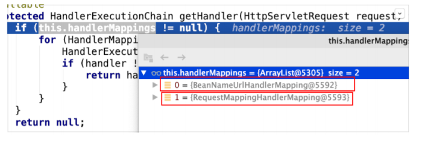

### 第 4 节 核⼼步骤getHandlerAdapter⽅法剖析

遍历各个HandlerAdapter，看哪个Adapter⽀持处理当前Handler

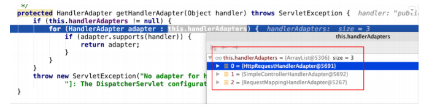

### 第 5 节 核⼼步骤ha.handle⽅法剖析

- ⼊⼝

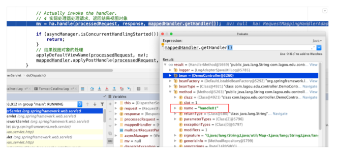

- 断点从⼊⼝进⼊

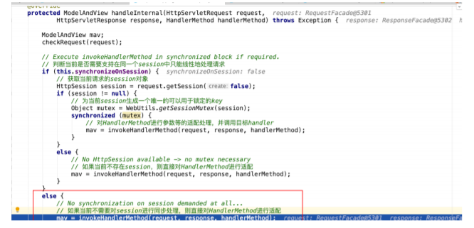


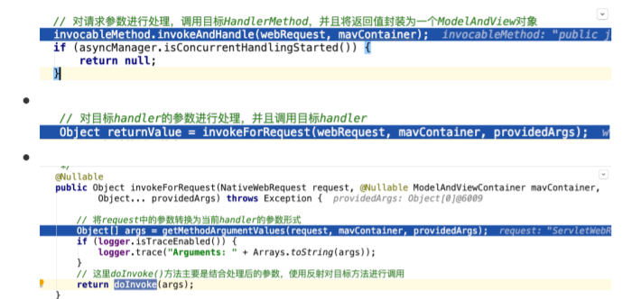


### 第 6 节 核⼼步骤processDispatchResult⽅法剖析

- render⽅法完成渲染


- 视图解析器解析出View视图对象

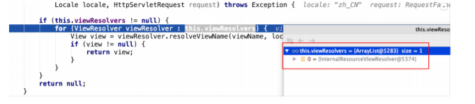


- 在解析出View视图对象的过程中会判断是否重定向、是否转发等，不同的情况封装的是不同的 View实现

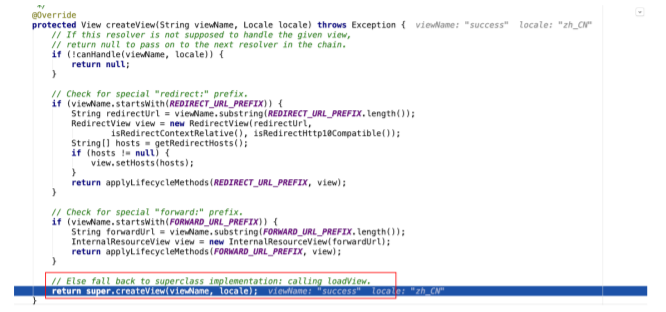

- 解析出View视图对象的过程中，要将逻辑视图名解析为物理视图名

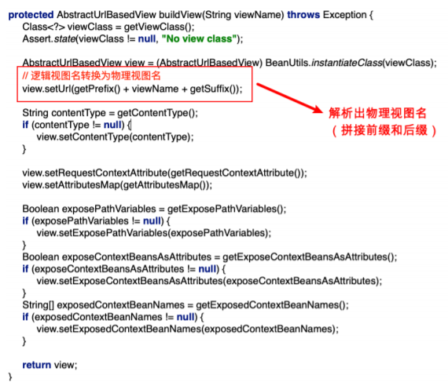


- 封装View视图对象之后，调⽤了view对象的render⽅法

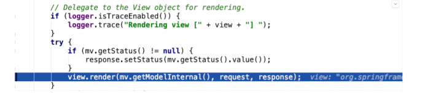


- 渲染数据

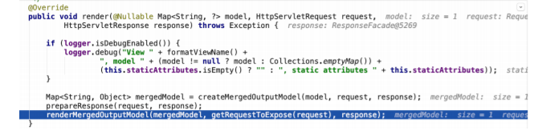

- 把modelMap中的数据暴露到request域中，这也是为什么后台model.add之后在jsp中可以从请求 域取出来的根本原因

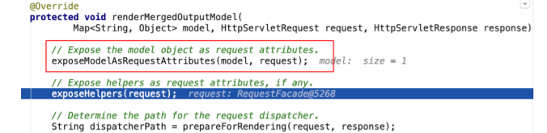

将数据设置到请求域中

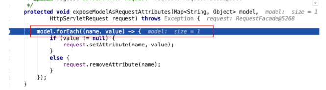


### 第 7 节 SpringMVC九⼤组件初始化

1）在DispatcherServlet中定义了九个属性，每⼀个属性都对应⼀种组件

```java
/** MultipartResolver used by this servlet. */
// 多部件解析器
@Nullable
private MultipartResolver multipartResolver;
/** LocaleResolver used by this servlet. */
// 区域化 国际化解析器
@Nullable
private LocaleResolver localeResolver;
/** ThemeResolver used by this servlet. */
// 主题解析器
@Nullable
private ThemeResolver themeResolver;
/** List of HandlerMappings used by this servlet. */
// 处理器映射器组件
@Nullable
private List<HandlerMapping> handlerMappings;
/** List of HandlerAdapters used by this servlet. */
// 处理器适配器组件
@Nullable
private List<HandlerAdapter> handlerAdapters;
/** List of HandlerExceptionResolvers used by this servlet. */
// 异常解析器组件
@Nullable
private List<HandlerExceptionResolver> handlerExceptionResolvers;
/** RequestToViewNameTranslator used by this servlet. */
// 默认视图名转换器组件
@Nullable
private RequestToViewNameTranslator viewNameTranslator;
/** FlashMapManager used by this servlet. */
// flash属性管理组件
@Nullable
private FlashMapManager flashMapManager;
/** List of ViewResolvers used by this servlet. */
// 视图解析器
@Nullable
private List<ViewResolver> viewResolvers;
```

九⼤组件都是定义了接⼝，接⼝其实就是定义了该组件的规范，⽐如ViewResolver、HandlerAdapter 等都是接⼝

2）九⼤组件的初始化时机

- DispatcherServlet中的onRefresh()，该⽅法中初始化了九⼤组件

```java
@Override
protected void onRefresh(ApplicationContext context) {

    // 初始化策略
    initStrategies(context);
}
```

- initStrategies⽅法

```java
/**
	 * Initialize the strategy objects that this servlet uses.
	 * <p>May be overridden in subclasses in order to initialize further strategy objects.
	 */
//初始化策略
protected void initStrategies(ApplicationContext context) {
    //多文件上传的组件
    initMultipartResolver(context);
    //初始化本地语言环境
    initLocaleResolver(context);
    //初始化模板处理器
    initThemeResolver(context);
    //handlerMapping
    initHandlerMappings(context);
    //初始化参数适配器
    initHandlerAdapters(context);
    //初始化异常拦截器
    initHandlerExceptionResolvers(context);
    //初始化视图预处理器
    initRequestToViewNameTranslator(context);
    //初始化视图转换器
    initViewResolvers(context);
    // 初始化FlashMap管理器
    initFlashMapManager(context);
}
```


- 观察其中的⼀个组件initHandlerMappings(context)

```java
/**
	 * Initialize the HandlerMappings used by this class.
	 * <p>If no HandlerMapping beans are defined in the BeanFactory for this namespace,
	 * we default to BeanNameUrlHandlerMapping.
	 */
private void initHandlerMappings(ApplicationContext context) {
    this.handlerMappings = null;

    if (this.detectAllHandlerMappings) {
        // Find all HandlerMappings in the ApplicationContext, including ancestor contexts.
        Map<String, HandlerMapping> matchingBeans =
            BeanFactoryUtils.beansOfTypeIncludingAncestors(context, HandlerMapping.class, true, false);
        if (!matchingBeans.isEmpty()) {
            this.handlerMappings = new ArrayList<>(matchingBeans.values());
            // We keep HandlerMappings in sorted order.
            AnnotationAwareOrderComparator.sort(this.handlerMappings);
        }
    }
    else {
        try {
            HandlerMapping hm = context.getBean(HANDLER_MAPPING_BEAN_NAME, HandlerMapping.class);
            this.handlerMappings = Collections.singletonList(hm);
        }
        catch (NoSuchBeanDefinitionException ex) {
            // Ignore, we'll add a default HandlerMapping later.
        }
    }

    // Ensure we have at least one HandlerMapping, by registering
    // a default HandlerMapping if no other mappings are found.
    if (this.handlerMappings == null) {
        // 走默认策略
        this.handlerMappings = getDefaultStrategies(context, HandlerMapping.class);
        if (logger.isDebugEnabled()) {
            logger.debug("No HandlerMappings found in servlet '" + getServletName() + "': using default");
        }
    }
}
```

如果按照类型和按照固定id从ioc容器中找不到对应组件，则会按照默认策略进⾏注册初始化，默 认策略在DispatcherServlet.properties⽂件中配置

```java
@SuppressWarnings("unchecked")
protected <T> List<T> getDefaultStrategies(ApplicationContext context, Class<T> strategyInterface) {
    String key = strategyInterface.getName();
    String value = defaultStrategies.getProperty(key);
    if (value != null) {
        String[] classNames = StringUtils.commaDelimitedListToStringArray(value);
        List<T> strategies = new ArrayList<>(classNames.length);
        for (String className : classNames) {
            try {
                Class<?> clazz = ClassUtils.forName(className, DispatcherServlet.class.getClassLoader());
                Object strategy = createDefaultStrategy(context, clazz);
                strategies.add((T) strategy);
            }
            catch (ClassNotFoundException ex) {
                throw new BeanInitializationException(
                    "Could not find DispatcherServlet's default strategy class [" + className +
                    "] for interface [" + key + "]", ex);
            }
            catch (LinkageError err) {
                throw new BeanInitializationException(
                    "Error loading DispatcherServlet's default strategy class [" + className +
                    "] for interface [" + key + "]: problem with class file or dependent class", err);
            }
        }
        return strategies;
    }
    else {
        return new LinkedList<>();
    }
}
```


org/springframework/web/servlet/DispatcherServlet.properties

```properties
# Default implementation classes for DispatcherServlet's strategy interfaces.
# Used as fallback when no matching beans are found in the DispatcherServlet context.
# Not meant to be customized by application developers.

org.springframework.web.servlet.LocaleResolver=org.springframework.web.servlet.i18n.AcceptHeaderLocaleResolver

org.springframework.web.servlet.ThemeResolver=org.springframework.web.servlet.theme.FixedThemeResolver

org.springframework.web.servlet.HandlerMapping=org.springframework.web.servlet.handler.BeanNameUrlHandlerMapping,\
	org.springframework.web.servlet.mvc.method.annotation.RequestMappingHandlerMapping

org.springframework.web.servlet.HandlerAdapter=org.springframework.web.servlet.mvc.HttpRequestHandlerAdapter,\
	org.springframework.web.servlet.mvc.SimpleControllerHandlerAdapter,\
	org.springframework.web.servlet.mvc.method.annotation.RequestMappingHandlerAdapter

org.springframework.web.servlet.HandlerExceptionResolver=org.springframework.web.servlet.mvc.method.annotation.ExceptionHandlerExceptionResolver,\
	org.springframework.web.servlet.mvc.annotation.ResponseStatusExceptionResolver,\
	org.springframework.web.servlet.mvc.support.DefaultHandlerExceptionResolver

org.springframework.web.servlet.RequestToViewNameTranslator=org.springframework.web.servlet.view.DefaultRequestToViewNameTranslator

org.springframework.web.servlet.ViewResolver=org.springframework.web.servlet.view.InternalResourceViewResolver

org.springframework.web.servlet.FlashMapManager=org.springframework.web.servlet.support.SessionFlashMapManager
```


注意：多部件解析器这样的的初始化必须按照id注册对象（multipartResolver）

```java
this.multipartResolver = context.getBean(MULTIPART_RESOLVER_BEAN_NAME, MultipartResolver.class);
```

```java
private void initMultipartResolver(ApplicationContext context) {
    try {
        this.multipartResolver = context.getBean(MULTIPART_RESOLVER_BEAN_NAME, MultipartResolver.class);
        if (logger.isDebugEnabled()) {
            logger.debug("Using MultipartResolver [" + this.multipartResolver + "]");
        }
    }
    catch (NoSuchBeanDefinitionException ex) {
        // Default is no multipart resolver.
        this.multipartResolver = null;
        if (logger.isDebugEnabled()) {
            logger.debug("Unable to locate MultipartResolver with name '" + MULTIPART_RESOLVER_BEAN_NAME +
                         "': no multipart request handling provided");
        }
    }
}
```

MULTIPART_RESOLVER_BEAN_NAME 在上面定义 

```java
public static final String MULTIPART_RESOLVER_BEAN_NAME = "multipartResolver";
```


## 第五部分 SSM 整合

### 第 1 节 整合策略 

SSM = Spring + SpringMVC + Mybatis = （Spring + Mybatis）+ SpringMVC 

先整合 Spring + Mybatis 

然后再整合 SpringMVC 

基于的需求：查询 Account 表的全部数据显示到⻚⾯

### 第 2 节 Mybatis整合Spring

- 整合⽬标 
  - 数据库连接池以及事务管理都交给Spring容器来完成 
  - SqlSessionFactory对象应该放到Spring容器中作为单例对象管理 
  - Mapper动态代理对象交给Spring管理，我们从Spring容器中直接获得Mapper的代理对象

- 整合所需 Jar 分析
  - Junit测试jar（4.12版本）
  - Mybatis的jar（3.4.5）
  - Spring相关jar（spring-context、spring-test、spring-jdbc、spring-tx、spring-aop、 aspectjweaver）
  - Mybatis/Spring整合包jar（mybatis-spring-xx.jar）
  - Mysql数据库驱动jar
  - Druid数据库连接池的jar
- 整合后的 Pom 坐标

```xml
<!--junit-->
<dependency>
 <groupId>junit</groupId>
 <artifactId>junit</artifactId>
 <version>4.12</version>
 <scope>test</scope>
</dependency>
<!--mybatis-->
<dependency>
 <groupId>org.mybatis</groupId>
 <artifactId>mybatis</artifactId>
 <version>3.4.5</version>
</dependency>
<!--spring相关-->
<dependency>
 <groupId>org.springframework</groupId>
 <artifactId>spring-context</artifactId>
 <version>5.1.12.RELEASE</version>
</dependency>
<dependency>
     <groupId>org.springframework</groupId>
 <artifactId>spring-test</artifactId>
 <version>5.1.12.RELEASE</version>
</dependency>
<dependency>
 <groupId>org.springframework</groupId>
 <artifactId>spring-jdbc</artifactId>
 <version>5.1.12.RELEASE</version>
</dependency>
<dependency>
 <groupId>org.springframework</groupId>
 <artifactId>spring-tx</artifactId>
 <version>5.1.12.RELEASE</version>
</dependency>
<dependency>
 <groupId>org.springframework</groupId>
 <artifactId>spring-aop</artifactId>
 <version>5.1.12.RELEASE</version>
</dependency>
<dependency>
 <groupId>org.aspectj</groupId>
 <artifactId>aspectjweaver</artifactId>
 <version>1.8.9</version>
</dependency>
<!--mybatis与spring的整合包-->
<dependency>
 <groupId>org.mybatis</groupId>
 <artifactId>mybatis-spring</artifactId>
 <version>2.0.3</version>
</dependency>
<!--数据库驱动jar-->
<dependency>
 <groupId>mysql</groupId>
 <artifactId>mysql-connector-java</artifactId>
 <version>5.1.46</version>
</dependency>
<!--druid连接池-->
<dependency>
 <groupId>com.alibaba</groupId>
 <artifactId>druid</artifactId>
 <version>1.1.21</version>
</dependency>
```

- jdbc.properties

```properties
jdbc.driver=com.mysql.jdbc.Driver
jdbc.url=jdbc:mysql://localhost:3306/bank
jdbc.username=root
jdbc.password=123456
```

- Spring 配置⽂件

applicationContext-dao.xml

```xml
<?xml version="1.0" encoding="UTF-8"?>
<beans xmlns="http://www.springframework.org/schema/beans"
 xmlns:context="http://www.springframework.org/schema/context"
 xmlns:tx="http://www.springframework.org/schema/tx"
 xmlns:xsi="http://www.w3.org/2001/XMLSchema-instance"
 xsi:schemaLocation="
 http://www.springframework.org/schema/beans
 http://www.springframework.org/schema/beans/spring-beans.xsd
 http://www.springframework.org/schema/context
 http://www.springframework.org/schema/context/spring-context.xsd
 http://www.springframework.org/schema/tx
 http://www.springframework.org/schema/tx/spring-tx.xsd
">
 <!--包扫描-->
 <context:component-scan base-package="com.lagou.edu.mapper"/>
 <!--数据库连接池以及事务管理都交给Spring容器来完成-->
 <!--引⼊外部资源⽂件-->
 <context:property-placeholder
location="classpath:jdbc.properties"/>
 <!--第三⽅jar中的bean定义在xml中-->
 <bean id="dataSource"
class="com.alibaba.druid.pool.DruidDataSource">
 <property name="driverClassName" value="${jdbc.driver}"/>
 <property name="url" value="${jdbc.url}"/>
 <property name="username" value="${jdbc.username}"/>
 <property name="password" value="${jdbc.password}"/>
 </bean>
 <!--SqlSessionFactory对象应该放到Spring容器中作为单例对象管理
 原来mybaits中sqlSessionFactory的构建是需要素材的：SqlMapConfig.xml中的内
容
 -->
 <bean id="sqlSessionFactory"
class="org.mybatis.spring.SqlSessionFactoryBean">
 <!--别名映射扫描-->
 <property name="typeAliasesPackage" value="com.lagou.edu.pojo"/>
 <!--数据源dataSource-->
 <property name="dataSource" ref="dataSource"/>
 </bean>
 <!--Mapper动态代理对象交给Spring管理，我们从Spring容器中直接获得Mapper的代理对
象-->
 <!--扫描mapper接⼝，⽣成代理对象，⽣成的代理对象会存储在ioc容器中-->
 <bean class="org.mybatis.spring.mapper.MapperScannerConfigurer">
 <!--mapper接⼝包路径配置-->
 <property name="basePackage" value="com.lagou.edu.mapper"/>
 <property name="sqlSessionFactoryBeanName"
value="sqlSessionFactory"/>
 </bean>
</beans>
```

applicationContext-service.xml

```xml
<?xml version="1.0" encoding="UTF-8"?>
<beans xmlns="http://www.springframework.org/schema/beans"
 xmlns:lgContext="http://www.springframework.org/schema/context"
 xmlns:tx="http://www.springframework.org/schema/tx"
 xmlns:xsi="http://www.w3.org/2001/XMLSchema-instance"
 xsi:schemaLocation="
 http://www.springframework.org/schema/beans
 http://www.springframework.org/schema/beans/spring-beans.xsd
 http://www.springframework.org/schema/context
 http://www.springframework.org/schema/context/spring-context.xsd
 http://www.springframework.org/schema/tx
 http://www.springframework.org/schema/tx/spring-tx.xsd
">
 <!--包扫描-->
 <lgContext:component-scan base-package="com.lagou.edu.service"/>
 <!--事务管理-->
 <bean id="transactionManager"
class="org.springframework.jdbc.datasource.DataSourceTransactionManager">
 <property name="dataSource" ref="dataSource"/>
 </bean>
   <!--事务管理注解驱动-->
 <tx:annotation-driven transaction-manager="transactionManager"/>
</beans> 
```


AccountMapper接⼝

```java
package com.lagou.edu.mapper;
import com.lagou.edu.pojo.Account;
import java.util.List;
public interface AccountMapper {
    // 定义dao层接⼝⽅法--> 查询account表所有数据
    List<Account> queryAccountList() throws Exception;
}
```

AccountMapper.xml

```xml
<!DOCTYPE mapper PUBLIC "-//mybatis.org//DTD Mapper 3.0//EN"
"http://mybatis.org/dtd/mybatis-3-mapper.dtd">
<mapper namespace="com.lagou.edu.mapper.AccountMapper">
    <select id="queryAccountList" resultType="com.lagou.edu.pojo.Account">
        select * from account
    </select>
</mapper>
```

测试程序

```java
import com.lagou.edu.pojo.Account;
import com.lagou.edu.service.AccountService;
import org.junit.Test;
import org.junit.runner.RunWith;
import org.springframework.beans.factory.annotation.Autowired;
import org.springframework.test.context.ContextConfiguration;
import org.springframework.test.context.junit4.SpringJUnit4ClassRunner;
import java.util.List;
@RunWith(SpringJUnit4ClassRunner.class)
@ContextConfiguration(locations = {"classpath*:application*.xml"})
public class MybatisSpringTest {
    // 希望测试ioc容器中的哪个对象你注⼊即可。
    @Autowired
    private AccountService accountService;
    @Test
    public void testMybatisSpring() throws Exception {
        List<Account> accounts = accountService.queryAccountList();
        for (int i = 0; i < accounts.size(); i++) {
            Account account = accounts.get(i);
            System.out.println(account);
        }
    }
}
```


### 第 3 节 整合SpringMVC

整合思路

把SpringMVC的⼊⻔案例整合进来即可（在已有⼯程基础之上开发⼀个SpringMVC⼊⻔案例）

引⼊pom坐标

```xml
<!--SpringMVC-->
<dependency>
 <groupId>org.springframework</groupId>
 <artifactId>spring-webmvc</artifactId>
 <version>5.1.12.RELEASE</version>
</dependency>
<!--jsp-api&servlet-api-->
<dependency>
 <groupId>javax.servlet</groupId>
 <artifactId>jsp-api</artifactId>
 <version>2.0</version>
 <scope>provided</scope>
</dependency>
<dependency>
 <groupId>javax.servlet</groupId>
 <artifactId>javax.servlet-api</artifactId>
 <version>3.1.0</version>
 <scope>provided</scope>
</dependency>
<!--⻚⾯使⽤jstl表达式-->
<dependency>
 <groupId>jstl</groupId>
 <artifactId>jstl</artifactId>
 <version>1.2</version>
</dependency>
<dependency>
 <groupId>taglibs</groupId>
 <artifactId>standard</artifactId>
 <version>1.1.2</version>
</dependency>
<!--json数据交互所需jar，start-->
<dependency>
 <groupId>com.fasterxml.jackson.core</groupId>
 <artifactId>jackson-core</artifactId>
 <version>2.9.0</version>
</dependency>
<dependency>
 <groupId>com.fasterxml.jackson.core</groupId>
 <artifactId>jackson-databind</artifactId>
 <version>2.9.0</version>
</dependency>
<dependency>
 <groupId>com.fasterxml.jackson.core</groupId>
 <artifactId>jackson-annotations</artifactId>
 <version>2.9.0</version>
</dependency>
<!--json数据交互所需jar，end-->
```


添加SpringMVC ⼊⻔案例

springmvc.xml

```xml
<?xml version="1.0" encoding="UTF-8"?>
<beans xmlns="http://www.springframework.org/schema/beans"
 xmlns:context="http://www.springframework.org/schema/context"
 xmlns:mvc="http://www.springframework.org/schema/mvc"
 xmlns:xsi="http://www.w3.org/2001/XMLSchema-instance"
 xsi:schemaLocation="http://www.springframework.org/schema/beans
 http://www.springframework.org/schema/beans/spring-beans.xsd
 http://www.springframework.org/schema/context
 http://www.springframework.org/schema/context/springcontext.xsd
 http://www.springframework.org/schema/mvc
 http://www.springframework.org/schema/mvc/spring-mvc.xsd
">
 <!--扫描controller-->
 <context:component-scan base-package="com.lagou.edu.controller"/>
 <mvc:annotation-driven/>
</beans>
```

Controller类

```java
package com.lagou.edu.controller;
import com.lagou.edu.pojo.Account;
import com.lagou.edu.service.AccountService;
import org.springframework.beans.factory.annotation.Autowired;
import org.springframework.stereotype.Controller;
import org.springframework.web.bind.annotation.RequestMapping;
import org.springframework.web.bind.annotation.ResponseBody;
import java.util.List;
@Controller
@RequestMapping("/account")
public class AccountController {
    /**
 * Spring容器和SpringMVC容器是有层次的（⽗⼦容器）
 * Spring容器：service对象+dao对象
 * SpringMVC容器：controller对象，，，，可以引⽤到Spring容器中的对象
 */
    @Autowired
    private AccountService accountService;
    @RequestMapping("/queryAll")
    @ResponseBody
    public List<Account> queryAll() throws Exception {
        return accountService.queryAccountList();
    }
}
```

web.xml

```xml
<!DOCTYPE web-app PUBLIC
"-//Sun Microsystems, Inc.//DTD Web Application 2.3//EN"
"http://java.sun.com/dtd/web-app_2_3.dtd" >
<web-app>
    <display-name>Archetype Created Web Application</display-name>
    <context-param>
        <param-name>contextConfigLocation</param-name>
        <param-value>classpath*:applicationContext*.xml</param-value>
    </context-param>
    <!--spring框架启动-->
    <listener>
        <listenerclass>org.springframework.web.context.ContextLoaderListener</listenerclass>
    </listener>
    <!--springmvc启动-->
    <servlet>
        <servlet-name>springmvc</servlet-name>
        <servletclass>org.springframework.web.servlet.DispatcherServlet</servletclass>
        <init-param>
            <param-name>contextConfigLocation</param-name>
            <param-value>classpath*:springmvc.xml</param-value>
        </init-param>
        <load-on-startup>1</load-on-startup>
    </servlet>

    <servlet-mapping>
        <servlet-name>springmvc</servlet-name>
        <url-pattern>/</url-pattern>
    </servlet-mapping>
</web-app>
```

## 第六部分 附录

### 附录⼀ 乱码问题解决

Post请求乱码，web.xml中加⼊过滤器

```xml
<!-- 解决post乱码问题 -->
<filter>
    <filter-name>encoding</filter-name>
    <filter-class>
        org.springframework.web.filter.CharacterEncodingFilter
    </filter-class>
    <!-- 设置编码参是UTF8 -->
    <init-param>
        <param-name>encoding</param-name>
        <param-value>UTF-8</param-value>
    </init-param>
    <init-param>
        <param-name>forceEncoding</param-name>
        <param-value>true</param-value>
    </init-param>
</filter>
<filter-mapping>
    <filter-name>encoding</filter-name>
    <url-pattern>/*</url-pattern>
</filter-mapping>
```

Get请求乱码（Get请求乱码需要修改tomcat下server.xml的配置）

```xml
<Connector URIEncoding="utf-8" connectionTimeout="20000" port="8080"
protocol="HTTP/1.1" redirectPort="8443"/>
```

### 附录⼆ 玩转Spring MVC 必备设计模式

说明：本部分设计模式作为直播扩展内容的⼀部分

1）策略模式

> 策略模式（Strategy），就是⼀个问题有多种解决⽅案，选择其中的⼀种使⽤，这种情况下我们 使⽤策略模式来实现灵活地选择，也能够⽅便地增加新的解决⽅案。⽐如做数学题，⼀个问题的 解法可能有多种；再⽐如商场的打折促销活动，打折⽅案也有很多种，有些商品是不参与折扣活 动要按照原价销售，有些商品打8.5折，有些打6折，有些是返现5元等。

- 结构

策略（Strategy） 

定义所有⽀持算法的公共接⼝。 Context 使⽤这个接⼝来调⽤某 ConcreteStrategy 定义的算法。 

策略实现（ConcreteStrategy） 实现了Strategy 接⼝的具体算法 

上下⽂（Context） 维护⼀个 Strategy 对象的引⽤ ⽤⼀个 ConcreteStrategy 对象来装配 

可定义⼀个接⼝⽅法让 Strategy 访问它的数据

示例 

假如现在有⼀个商场优惠活动，有的商品原价售卖，有的商品打8.5折，有的商品打6折，有的返现 5元

```java
package designpattern.strategy.old;
import java.text.MessageFormat;
public class BuyGoods {
    private String goods;
    private double price;

    private double finalPrice;
    private String desc;
    public BuyGoods(String goods, double price) {
        this.goods = goods;
        this.price = price;
    }
    public double calculate(String discountType) {
        if ("discount85".equals(discountType)) {
            finalPrice = price * 0.85;
            desc = "该商品可享受8.5折优惠";
        } else if ("discount6".equals(discountType)) {
            finalPrice = price * 0.6;
            desc = "该商品可享受6折优惠";
        } else if ("return5".equals(discountType)) {
            finalPrice = price >= 5 ? price - 5 : 0;
            desc = "该商品可返现5元";
        } else {
            finalPrice = price;
            desc = "对不起，该商品不参与优惠活动";
        }
        System.out.println(MessageFormat.format("您购买的商品为：{0}，原价为：{1}，{2}，最终售卖价格为：{3}", goods, price, desc, finalPrice));
        return finalPrice;
    }
}

```

测试

```java
package designpattern.strategy.old;
public class Test {
    public static void main(String[] args) {
        BuyGoods buyGoods1 = new BuyGoods("Java编程思想", 99.00);
        buyGoods1.calculate("discount85");
        BuyGoods buyGoods2 = new BuyGoods("罗技⿏标", 66 );
        buyGoods2.calculate("discount6");
        BuyGoods buyGoods3 = new BuyGoods("苹果笔记本", 15000.00);
        buyGoods3.calculate("return5");
        BuyGoods buyGoods4 = new BuyGoods("佳能相机", 1900);
        buyGoods4.calculate(null);
    }
}
```

上述代码可以解决问题，但是从代码设计的⻆度还是存在⼀些问题

- 增加或者修改打折⽅案时必须修改 BuyGoods 类源代码，违反了⾯向对象设计的 "开闭原 则"，代码的灵活性和扩展性较差。 
- 打折⽅案代码聚合在⼀起，如果其他项⽬需要重⽤某个打折⽅案的代码，只能复制粘贴对应 代码，⽆法以类组件的⽅式进⾏重⽤，代码的复⽤性差。 
- BuyGoods 类的 calculate() ⽅法随着优惠⽅案的增多会⾮常庞⼤，代码中会出现很多if分 ⽀，可维护性差。

此时，我们可以使⽤策略模式对 BuyGoods 类进⾏重构，将打折⽅案逻辑（算法）的定义和使⽤ 分离。 抽象策略类 AbstractDiscount，它是所有具体打折⽅案（算法）的⽗类，定义了⼀个 discount 抽象⽅法

```java
package designpattern.strategy.now.discount;
public abstract class AbstractDiscount {
    public double getFinalPrice() {
        return finalPrice;
    }
    public void setFinalPrice(double finalPrice) {
        this.finalPrice = finalPrice;
    }
    public String getDesc() {
        return desc;
    }
    public void setDesc(String desc) {
        this.desc = desc;
    }
    protected double finalPrice;
    protected String desc;
    public IDiscount(String desc) {
        this.desc = desc;
    }
    public abstract double discount(double price);
}
```

四种具体策略类，继承⾃抽象策略类 AbstractDiscount，并在 discount ⽅法中实现具体的打折 ⽅案（算法）

```java
package designpattern.strategy.now.discount.impl;
import designpattern.strategy.now.discount.AbstractDiscount;
public class Discount85 extends AbstractDiscount {
    public Discount85() {
        super("该商品可享受8.5折优惠");
    }
    @Override
    public double discount(double price) {
        finalPrice = price * 0.85;
        return finalPrice;
    }
}
package designpattern.strategy.now.discount.impl;
import designpattern.strategy.now.discount.AbstractDiscount;
public class Discount6 extends AbstractDiscount {
    public Discount6() {
        super("该商品可享受6折优惠");
    }
    @Override
    public double discount(double price) {
        finalPrice = price * 0.6;
        return finalPrice;
    }
}
package designpattern.strategy.now.discount.impl;
import designpattern.strategy.now.discount.AbstractDiscount;
public class Return5 extends AbstractDiscount {
    public Return5() {
        super("该商品可返现5元");
    }
    @Override
    public double discount(double price) {
        this.finalPrice = price >= 5 ? price - 5 : 0;
        return finalPrice;
    }
}
package designpattern.strategy.now.discount.impl;
import designpattern.strategy.now.discount.AbstractDiscount;
public class NoDiscount extends AbstractDiscount {
    public NoDiscount() {
        super("对不起，该商品不参与优惠活动");
    }
    @Override
    public double discount(double price) {
        finalPrice = price;
        return finalPrice;
    }
}

```

类 BuyGoods，维护了⼀个 AbstractDiscount 引⽤

```java
package designpattern.strategy.now;
import designpattern.strategy.now.discount.AbstractDiscount;
import java.text.MessageFormat;
public class BuyGoods {
    private String goods;
    private double price;
    private AbstractDiscount abstractDiscount;
    public BuyGoods(String goods, double price, AbstractDiscount
                    abstractDiscount) {
        this.goods = goods;
        this.price = price;
        this.abstractDiscount = abstractDiscount;
    }
    public double calculate() {
        double finalPrice = abstractDiscount.discount(this.price);
        String desc = abstractDiscount.getDesc();
        System.out.println(MessageFormat.format("商品：{0}，原价：{1}，{2}，最终价格为：{3}", goods, price, desc, finalPrice));
        return finalPrice;
    }
}
```

测试

```java
package designpattern.strategy.now;

import designpattern.strategy.now.discount.impl.*;
public class Test {
    public static void main(String[] args) {
        BuyGoods buyGoods1 = new BuyGoods("Java编程思想", 99.00, new
                                          Discount85());
        buyGoods1.calculate();
        BuyGoods buyGoods2 = new BuyGoods("罗技⿏标", 66, new Discount6());
        buyGoods2.calculate();
        BuyGoods buyGoods3 = new BuyGoods("苹果笔记本", 15000.00, new
                                          Return5());
        buyGoods3.calculate();
        BuyGoods buyGoods4 = new BuyGoods("佳能相机", 1900, new
                                          NoDiscount());
        buyGoods4.calculate();
    }
}

```

重构后： 

- 增加新的优惠⽅案时只需要继承抽象策略类即可，修改优惠⽅案时不需要修改BuyGoods类 源码； 
- 代码复⽤也变得简单，直接复⽤某⼀个具体策略类即可； 
- BuyGoods类的calculate变得简洁，没有了原本的if分⽀；


2）模板⽅法模式 

- 模板⽅法模式是指定义⼀个算法的⻣架，并允许⼦类为⼀个或者多个步骤提供实现。模板⽅法模式 使得⼦类可以在不改变算法结构的情况下，重新定义算法的某些步骤，属于⾏为型设计模式。 采⽤模板⽅法模式的核⼼思路是处理某个流程的代码已经具备，但其中某些节点的代码暂时不能确 定。此时可以使⽤模板⽅法。

- 示例

    ```java
    package com.lagou.edu;
    /**
    ```
* ⾯试⼤⼚流程类
*/
public abstract class Interview {
    private final void register() {
        System.out.println("⾯试登记");
    }
    protected abstract void communicate();
    private final void notifyResult() {
        System.out.println("HR⼩姐姐通知⾯试结果");
    }
    protected final void process() {
        this.register();
        this.communicate();
        this.notifyResult();
    }
}
  
    ```
  
    ```

Java岗位⾯试者

```java
package com.lagou.edu;
/**
* ⾯试⼈员1，它是来⾯试Java⼯程师的
*/
public class Interviewee1 extends Interview{
    public void communicate() {
        System.out.println("我是⾯试⼈员1，来⾯试Java⼯程师，我们聊的是Java相关内容");
    }
}
```

前端岗位⾯试者

```java
package com.lagou.edu;
/**
* ⾯试⼈员2，它是来⾯试前端⼯程师的
*/
public class Interviewee2 extends Interview{
    public void communicate() {
        System.out.println("我是⾯试⼈员2，来⾯试前端⼯程师，我们聊的是前端相关内容");
    }
}
```

客户端测试类

```java
package com.lagou.edu;
public class InterviewTest {
    public static void main(String[] args) {
        // ⾯试Java⼯程师
        Interview interviewee1 = new Interviewee1();
        interviewee1.process();
        // ⾯试前端⼯程师
        Interview interviewee2 = new Interviewee2();
        interviewee2.process();
    }
}
```

打印结果

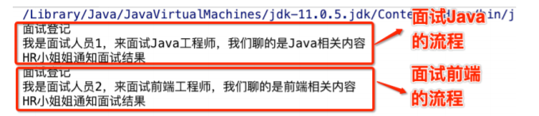

3）适配器模式

使得原本由于接⼝不兼容⽽不能⼀起⼯作、不能统⼀管理的那些类可以⼀起⼯作、可以进⾏统⼀管理

- 解决接⼝不兼容⽽不能⼀起⼯作问题，看下⾯⼀个⾮常经典的案例 在中国，⺠⽤电都是220v交流电，但是⼿机锂电池⽤的都是5v直流电。因此，我们给⼿机充电时 就需要使⽤电源适配器来进⾏转换。使⽤代码还原这个⽣活场景 创建AC220类，表示220v交流电

```java
package com.lagou.edu;
import com.sun.org.apache.bcel.internal.generic.RETURN;
public class AC220 {
    public int outputAC220V() {
        int output = 220;
        System.out.println("输出交流电" + output + "V");
        return output;
    }
}
```

创建DC5接⼝，表示5V直流电：

```java
package com.lagou.edu;
public interface DC5 {
    int outputDC5V();
}
```

创建电源适配器类 PowerAdapter

```java
package com.lagou.edu;
public class PowerAdapter implements DC5 {
    private AC220 ac220;
    public PowerAdapter(AC220 ac220) {
        this.ac220 = ac220;
    }
    public int outputDC5V() {
        int adapterInput = ac220.outputAC220V();
        // 变压器...
        int adapterOutput = adapterInput/44;
        System.out.println("使⽤ PowerAdapter 输⼊AC:" + adapterInput + "V输出DC:" + adapterOutput + "V");
        return adapterOutput;
    }
}
```


客户端测试代码

```java
package com.lagou.edu;
public class AdapterTest {
    public static void main(String[] args) {
        DC5 dc5 = new PowerAdapter(new AC220());
        dc5.outputDC5V();
    }
}
```

在上⾯的案例中，通过增加电源适配器类PowerAdapter实现了⼆者的兼容

- 解决不能统⼀管理的问题

SpringMVC中处理器适配器（HandlerAdapter）机制就是解决类统⼀管理问题⾮常经典的场景

其中 HandlerAdapter接⼝是处理器适配器的顶级接⼝，它有多个⼦类，包括 AbstractHandlerMethodAdapter、SimpleServletHandlerAdapter、 SimpleControllerHandlerAdapter、HttpRequestHandlerAdapter、 RequestMappingHandlerAdapter

其适配器调⽤的关键代码也在DispatcherServlet的doDispatch()⽅法中

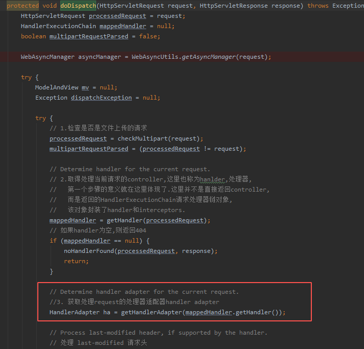

在 doDispatch() ⽅法中调⽤了 getHandlerAdapter() ⽅法

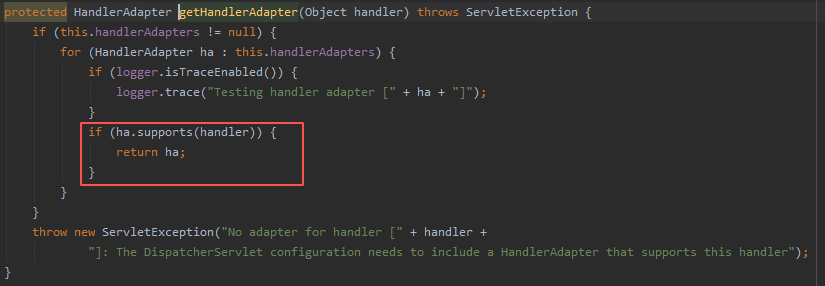

在 getHandlerAdapter() ⽅法中循环调⽤了 supports() ⽅法判断是否兼容，循环迭代集合中的 “Adapter” 在初始化时已经赋值。