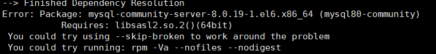

# MySQL


# MySQL 安装


## Linux 安装mysql

### 安装之前先彻底卸载

**使用以下命令查看当前安装mysql情况，查找以前是否装有mysql**

```
rpm -qa|grep -i mysql
```

可以看到存在安装的mysql,如下所示：

> MySQL-client-5.6.21-1.rhel5.x86_64
> MySQL-server-5.6.21-1.rhel5.x86_64
> MySQL-devel-5.6.21-1.rhel5.x86_64

**停止mysql服务、删除之前安装的mysql**

删除命令：`rpm -e –nodeps 包名`

```
rpm -ev MySQL-client-5.6.21-1.rhel5.x86_64
rpm -ev MySQL-server-5.6.21-1.rhel5.x86_64
rpm -ev MySQL-devel-5.6.21-1.rhel5.x86_64
```

如果提示依赖包错误，则使用以下命令尝试

```
rpm -ev MySQL-client-5.6.21-1.rhel5.x86_64 --nodeps
```

如果提示错误：`error: %preun(xxxxxx) scriptlet failed, exit status 1`

则用以下命令尝试：

```
rpm -e --noscripts MySQL-client-5.6.21-1.rhel5.x86_64
```

**查找之前老版本mysql的目录、并且删除老版本mysql的文件和库**

```
find / -name mysql
```

查找到如下结果：

> /var/lib/mysql
> /var/lib/mysql/mysql
> /run/lock/subsys/mysql
> /usr/lib64/mysql

删除对应的mysql目录

```
rm -rf /var/lib/mysql
rm -rf /var/lib/mysql/mysql
rm -rf /run/lock/subsys/mysql
rm -rf /usr/lib64/mysql
```

**注意：**卸载后/etc/my.cnf不会删除，需要进行手工删除

```
rm -rf /etc/my.cnf
```

再次查找机器是否安装mysql**

```
rpm -qa|grep -i mysql
```

**无结果，说明已经卸载彻底，接下来直接安装mysql即可。**


### yum 安装

```
wget http://repo.mysql.com/mysql-community-release-el7-5.noarch.rpm
rpm -ivh mysql-community-release-el7-5.noarch.rpm
yum update
yum install mysql-server
```

权限设置：

```
chown mysql:mysql -R /var/lib/mysql
```

初始化 MySQL：

```
mysqld --initialize
```

启动 MySQL：

```
systemctl start mysqld
```

查看 MySQL 运行状态：

```
systemctl status mysqld
```

## 验证 MySQL 安装

在成功安装 MySQL 后，一些基础表会表初始化，在服务器启动后，你可以通过简单的测试来验证 MySQL 是否工作正常。

使用 mysqladmin 工具来获取服务器状态：

使用 mysqladmin 命令来检查服务器的版本, 在 linux 上该二进制文件位于 /usr/bin 目录，在 Windows 上该二进制文件位于C:\mysql\bin 。

```
[root@host]# mysqladmin --version
```

linux上该命令将输出以下结果，该结果基于你的系统信息：

```
mysqladmin  Ver 8.23 Distrib 5.0.9-0, for redhat-linux-gnu on i386
```

如果以上命令执行后未输出任何信息，说明你的Mysql未安装成功。

------

## 使用 MySQL Client(Mysql客户端) 执行简单的SQL命令

你可以在 MySQL Client(Mysql客户端) 使用 mysql 命令连接到 MySQL 服务器上，默认情况下 MySQL 服务器的登录密码为空，所以本实例不需要输入密码。

命令如下：

```
[root@host]# mysql
```

以上命令执行后会输出 mysql>提示符，这说明你已经成功连接到Mysql服务器上，你可以在 mysql> 提示符执行SQL命令：

```
mysql> SHOW DATABASES;
+----------+
| Database |
+----------+
| mysql    |
| test     |
+----------+
2 rows in set (0.13 sec)
```

------

## Mysql安装后需要做的

Mysql安装成功后，默认的root用户密码为空，你可以使用以下命令来创建root用户的密码：

```
[root@host]# mysqladmin -u root password "new_password";
```

现在你可以通过以下命令来连接到Mysql服务器：

```
[root@host]# mysql -u root -p
Enter password:*******
```

**注意：**在输入密码时，密码是不会显示了，你正确输入即可。

### yum install mysql-community-server依赖关系错误

**该解决方案为卸载重装；如果看客不能卸载，请直接关闭**

系统：Centos 6.9
 MySQL 版本：MySQL 5.7

由于本人以前买了个 **Centos 6.9** 国外服务器玩并安装了mysql；后来因为忙所以就把服务器搁置了，最近闲下来又开始捣鼓起来。
 最开始忘记 mysql 的配置信息，所以想要更新下 mysql；按照网上的方式使用；但是再输入如下指令的
 `yum install mysql-community-server`
 结果报如下错误：



查询各种信息；基本确定是因为 mysql 的依赖问题；由于对本来说，最快的解决方案就是卸载重装.

## 卸载方法：

1.快速删除


```csharp
yum remove  mysql mysql-server mysql-libs mysql-server
```

2.查找残留文件


```undefined
rpm -qa | grep -i mysql
```

1. 将查询出来的文件逐个删除，如：


```css
yum remove mysql-community-common-5.7.20-1.el6.x86_64
```

4.查找残留目录


```undefined
whereis mysql
```

1. 逐条删除目录，如：


```undefined
rm –rf /usr/lib64/mysql
```

**上述做完后，最好重新查询相关内容，防止漏删**

## 安装：

转自[https://segmentfault.com/a/1190000003049498](https://link.jianshu.com?t=https%3A%2F%2Fsegmentfault.com%2Fa%2F1190000003049498)

1. 检测系统是否存在mysql


```cpp
yum list installed | grep mysql
```

1. 删除mysql依赖项


```csharp
yum -y remove mysql-libs.x86_64
```

3.给CentOS添加rpm源，并且选择较新的源


```bash
wget dev.mysql.com/get/mysql-community-release-el6-5.noarch.rpm
yum localinstall mysql-community-release-el6-5.noarch.rpm
yum repolist all | grep mysql
yum-config-manager --disable mysql55-community
yum-config-manager --disable mysql56-community
yum-config-manager --enable mysql57-community-dmr
yum repolist enabled | grep mysql
```

1. 安装mysql 服务器


```bash
# yum install mysql-community-server
```

**终于没有报错，可以继续了**


### mysql 修改密码

1.例1:给root加个密码ab12。首先在DOS下进入目录mysqlbin,然后键入以下命令 mysqladmin -uroot -password ab12 注:因为开始时root没有密码...

2.例2:再将root的密码改为djg345。 mysqladmin -uroot -pab12 password djg345


https://www.cnblogs.com/guo-rong/p/9692471.html


https://www.runoob.com/mysql/mysql-install.html

https://www.jianshu.com/p/7b8c4dea6829


# 常用命令


**mysql中如何查看和删除唯一索引**

查看唯一索引:

show index from mytable;//mytable 是表名

查询结果如下：

查询到唯一索引后，如何删除唯一索引呢，使用如下命令：

alter table mytable drop index mdl_tag_use_ix;//mdl_tag_use_ix是上表查出的索引名，key_name


# 数据库分库分表利器 ShardingSphere

官网地址：

http://shardingsphere.apache.org

官方文档4.x版本：

https://shardingsphere.apache.org/document/legacy/4.x/document/en/overview/


思维导图：


# 知识点扫盲

## MYSQL 之DDL、DML、DCL、TCL的区别

TCL （Transaction Control Language）：事务控制语言

DML（data manipulation language）： 它们是SELECT、UPDATE、INSERT、DELETE，这4条命令是用来对数据库里的数据进行操作的语言 


 DDL（data definition language）： DDL比DML要多，主要的命令有CREATE、ALTER、DROP等，DDL主要是用在定义或改变表（TABLE）的结构，数据类型，表之间的链接 和约束等初始化工作上，他们大多在建立表时使用 

 DCL（Data Control Language）： 是数据库控制功能。是用来设置或更改数据库用户或角色权限的语句，包括（grant,deny,revoke等）语句。在默认状态下，只有

sysadmin,dbcreator,db_owner或db_securityadmin等人员才有权力执行DCL