# JVM调优篇


JVM 是Java 虚拟机， 我们每天都在使用的开发底层，作为一名优秀的开发工程师，了解JVM必不可少， 这对排查线上问题非常有用。

# JVM前奏篇

本章分析就以JVM 8 为例

## 官网介绍

官网文档 : https://docs.oracle.com/javase/8/

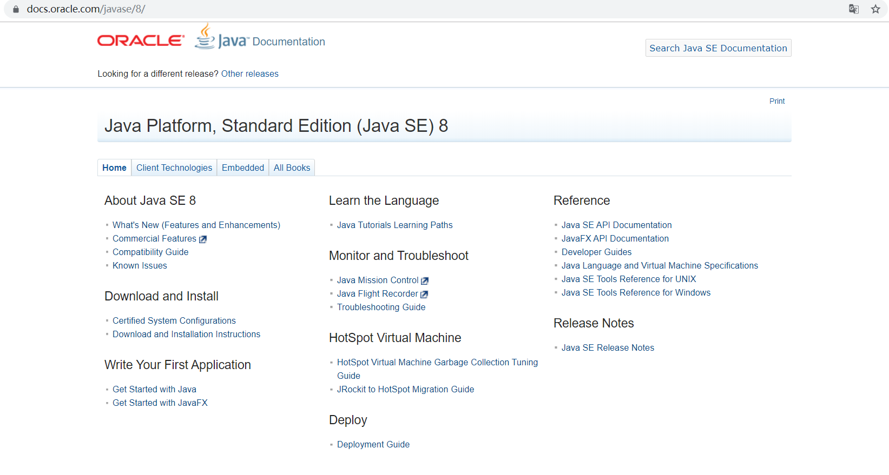

官方网站：[https://www.oracle.com](https://www.oracle.com/index.html)


https://developer.oracle.com/

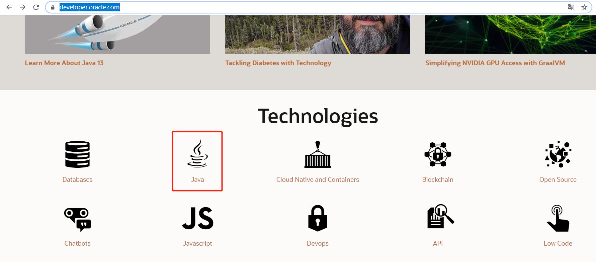

https://developer.oracle.com/java/

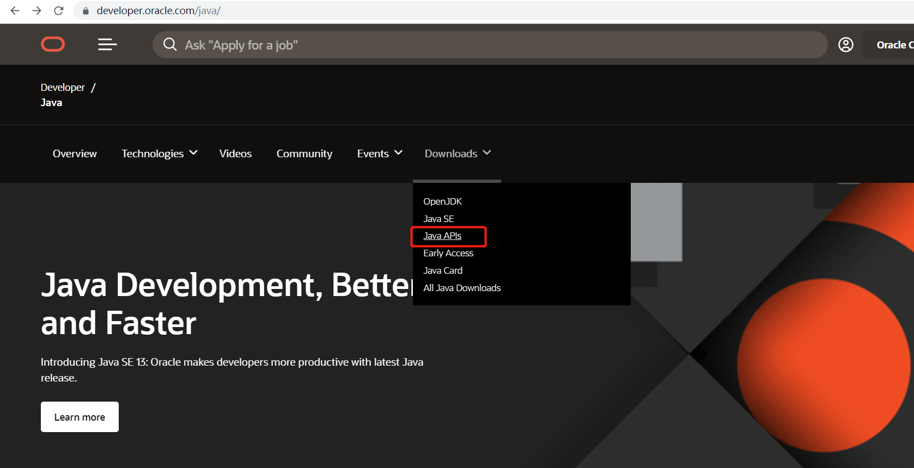

https://docs.oracle.com/en/java/javase/index.html

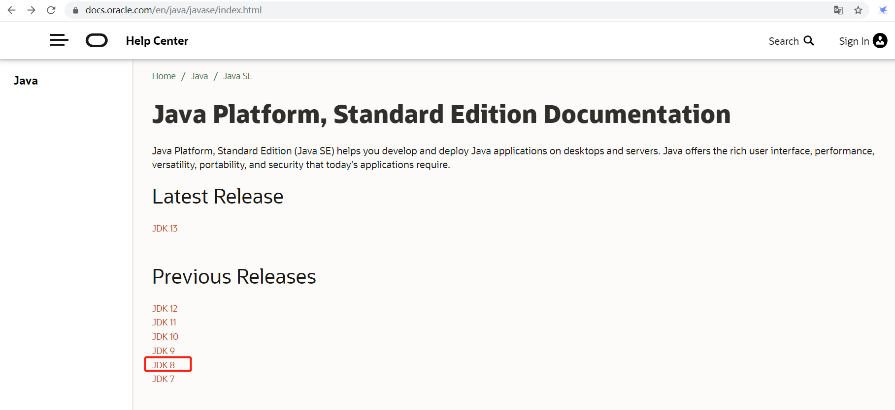

https://docs.oracle.com/javase/8/docs/index.html

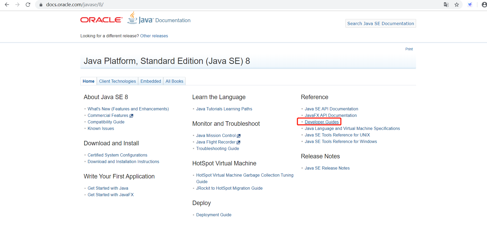


## The relation(关系) of JDK/JRE/JVM 

Reference -> Developer Guides -> 定位到:https://docs.oracle.com/javase/8/docs/index.html 

```txt
Oracle has two products that implement Java Platform Standard Edition (Java SE) 8: Java SE Development Kit (JDK) 8 and Java SE Runtime Environment (JRE) 8. JDK 8 is a superset of JRE 8, and contains everything that is in JRE 8, plus tools such as the compilers and debuggers necessary for developing applets and applications. JRE 8 provides the libraries, the Java Virtual Machine (JVM), and other components to run applets and applications written in the Java programming language. Note that the JRE includes components not required by the Java SE specification, including both standard and non-standard Java components.
```


The following conceptual diagram illustrates the components of Oracle's Java SE products:

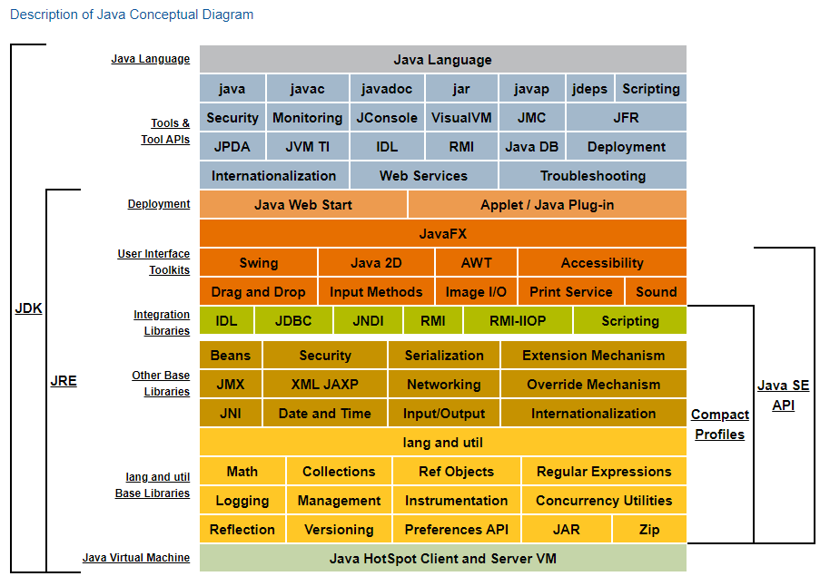

## 源码到类文件

### 源码

我们使用一个Person.java  演示一个java 文件的类加载过程：

```java
public class Person {
    private String name;
    private int age;
    private static String address;
    private final static String hobby = "Programming";
    public void say() {
        System.out.println("person say...");
    }
    public int calc(int op1, int op2) {
        return op1 + op2;
    }
}
```

编译：javac Person.java  ==>  Person.class


### 编译过程

Person.java -> 此法分析器 -> tokens流 -> 语法分析器 -> 语法树/抽象语法树 -> 语义分析器 -> 注解抽象语法树 -> 字节码生成器 -> Person.class文件

### 类文件（Class文件）

官网 The class File Format

加载 ==》验证 ==》 准备 ==》 解析 ==》初始化 ==》 使用 ==》 卸载

javac  **编译原理**

词法分析   语法分析 语法树  字节码生成 生成 Person.class

https://docs.oracle.com/javase/8/

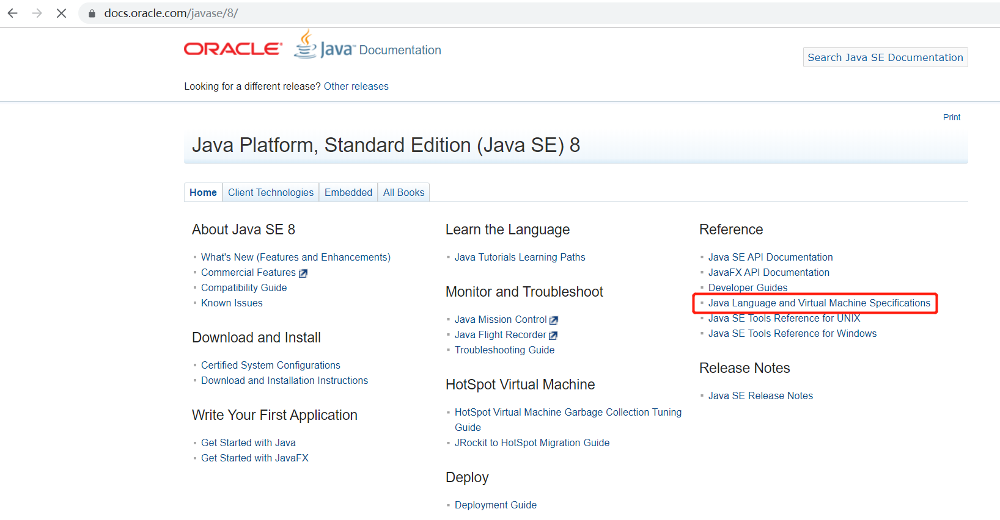

https://docs.oracle.com/javase/specs/index.html

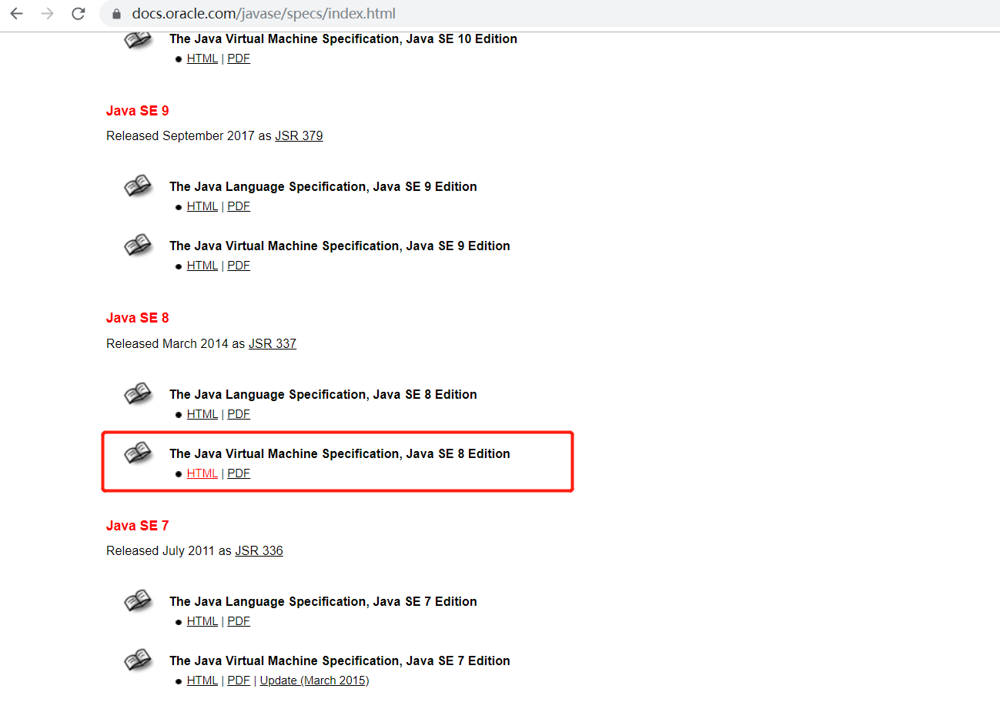

https://docs.oracle.com/javase/specs/jvms/se8/html/index.html

选择 ==》 **Chapter 4. The** **class** **File Format**

https://docs.oracle.com/javase/specs/jvms/se8/html/jvms-4.html

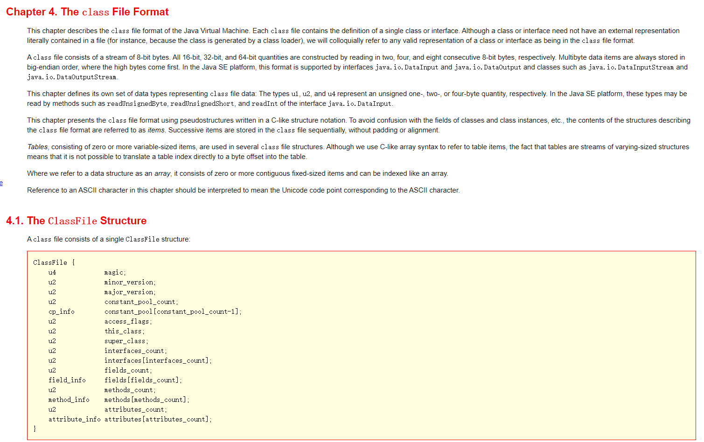

Sublime  打开Person.class是16进制的文件

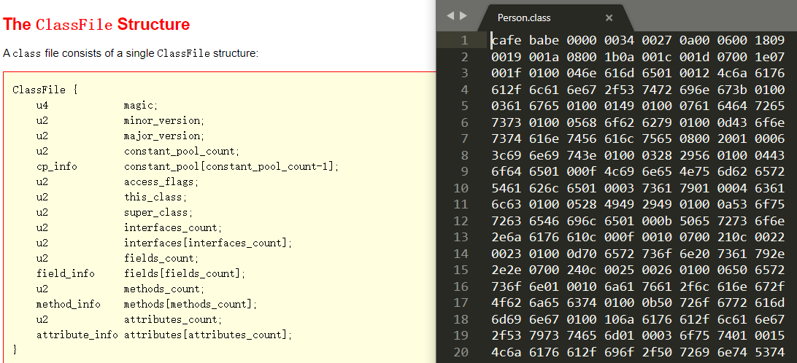


magic

The magic item supplies the magic number identifying the class file format; it has the value 0xCAFEBABE.

minor_version, major_version

The values of the minor_version and major_version items are the minor and major version numbers of this class file. Together, a major and a minor version number determine the version of the class file format. If a class file has major version number M and minor version number m, we denote the version of its class file format as M.m. Thus, class file format versions may be ordered lexicographically, for example, 1.5 < 2.0 < 2.1.

[其他的查看官网解释](https://docs.oracle.com/javase/specs/jvms/se8/html/jvms-4.html)

**类文件到虚拟机(类加载机制）**

使用和卸载不算是类加载过程中的阶段，只是画完整了一下

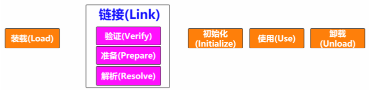


java 类加载机制

将class文件交给JVM

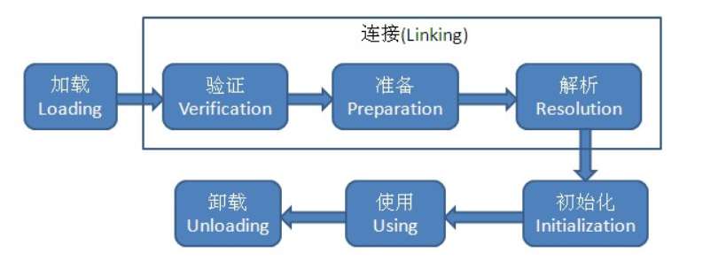

步骤：

**(1) 装载**

a.先找到类文件所在的位置 磁盘 类全路径  （类装载器 ClassLoader.find(String name)） 寻找类

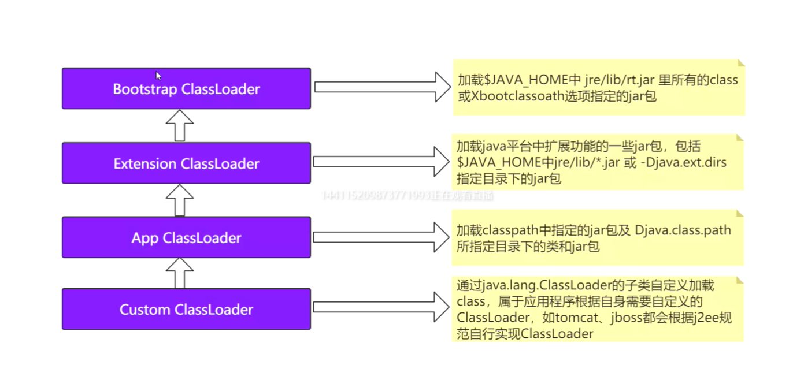

**装载机制： 双亲委派机制 （领导优先）**

父加载器不是父类，双亲委托：自下而上，先挨个找缓存，到了顶层缓存中还没有，就开始初始化，从各自对应负责的包路径下查找，有就创建，没有给就子加载器加载

java.lang.String 不能存在两份  双亲委派 为了类加载安全

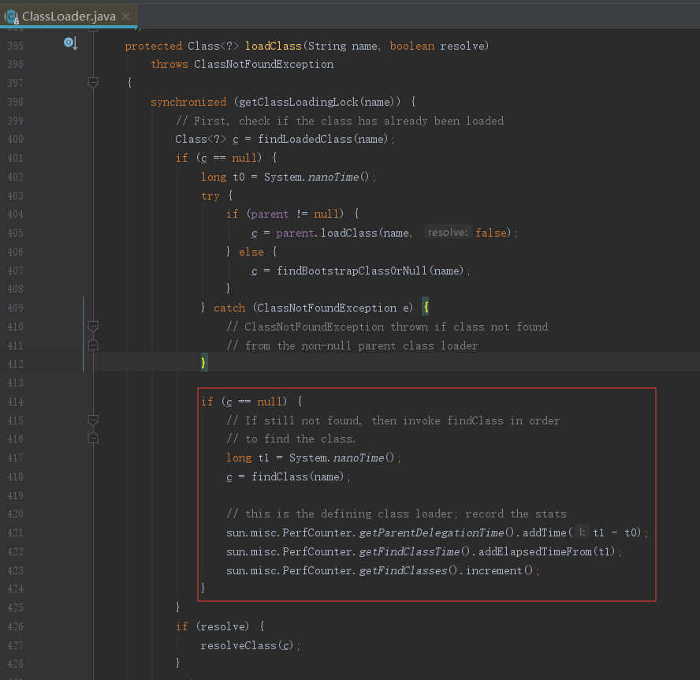

b.类文件的信息交给JVM  类文件字节流静态存储结构 JVM里面的方法区  Method Area

c.类文件所对应的对象Class 装载到JVM   堆Heap

核心方法： loadClass、 findLoadedClass、parent.loadClass、findBootStrapClass、findClass

**(2) 链接**

a.验证 

保证被加载的类信息正确

从上面类的生命周期一图中我们可以看出，验证是连接的第一步，这一阶段的目的主要是为了确保Class文件的字节流中包含的信息符合当前虚拟机的要求，从而不会危害虚拟机自身安全。也就是说，当加载阶段将字节流加载进方法区之后，JVM需要做的第一件事就是对字节流进行安全校验，以保证格式正确，使自己之后能正确的解析到数据并保证这些数据不会对自身造成危害。

验证阶段主要分成四个子阶段：

- 文件格式验证
- 元数据验证
- 字节码验证
- 符号引用验证

b.准备

  要为类的静态变量分配内存空间， 将其值初始化为默认值

c.解析

  将类的符号引用转化为直接引用， 符号引用？？

  String str = 的 地址是什么

首先来说**常量池**：在Class的文件结构中我们就花了大量的篇幅去介绍了常量池，我们再来总结一下：**常量池(constant pool)指的是在编译期被确定，并被保存在已编译的.class文件中的一些数据。它包括了关于类、方法、接口等中的常量，也包括字符串常量。**

然后这段话中的常量池指的就是存在于.class文件中的常量池，结果在运行期被JVM装载，并且可以扩充的存在于方法区中的**运行时常量池**。

然后来看**符号引用**：在Class文件中我们也讲述了什么是符号引用。总的来说就是常量池中存储的那些描述类、方法、接口的字面量，你可以简单的理解为就是那些所需要信息的全限定名，目的就是为了虚拟机在使用的时候可以定位到所需要的目标。

最后来看**直接引用**：直接指向目标的指针、相对偏移量或能间接定位到目标的句柄。

**(3) 初始化**

  为静态变量， 真正的值 a=10

### 运行时数据区

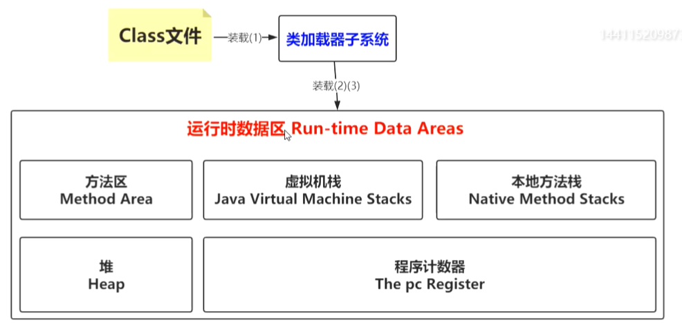

https://docs.oracle.com/javase/specs/jvms/se8/html/jvms-2.html#jvms-2.5


java 虚拟机栈

Each Java Virtual Machine thread has a private *Java Virtual Machine stack*, created at the same time as the thread. A Java Virtual Machine stack stores frames ([§2.6](https://docs.oracle.com/javase/specs/jvms/se8/html/jvms-2.html#jvms-2.6)). A Java Virtual Machine stack is analogous to the stack of a conventional language such as C: it holds local variables and partial results, and plays a part in method invocation and return. Because the Java Virtual Machine stack is never manipulated directly except to push and pop frames, frames may be heap allocated. The memory for a Java Virtual Machine stack does not need to be contiguous.

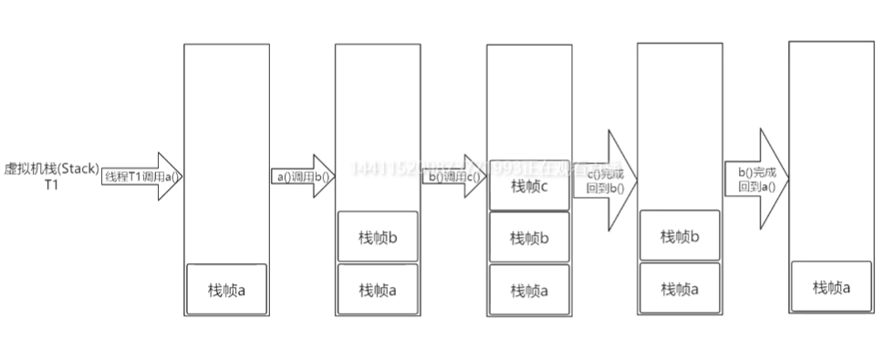

If the computation in a thread requires a larger Java Virtual Machine stack than is permitted, the Java Virtual Machine throws a StackOverflowError.

If Java Virtual Machine stacks can be dynamically expanded, and expansion is attempted but insufficient memory can be made available to effect the expansion, or if insufficient memory can be made available to create the initial Java Virtual Machine stack for a new thread, the Java Virtual Machine throws an OutOfMemoryError.


javap  反编译 查看字节码指令

Frame : 方法的执行


面试高频问题：


参考文档：

https://pan.baidu.com/s/10N1Cx_lAHXE2SVT_Cv-FNA


# JVM进行篇


## 理解虚拟机栈帧和方法

https://docs.oracle.com/javase/specs/jvms/se8/html/jvms-2.html#jvms-2.6

每个栈帧对应一个被调用的方法，可以理解为一个方法的运行空间。

每个栈帧中包括局部变量表(Local Variables)、操作数栈(Operand Stack)、指向运行时常量池的引用(A reference to the run-time constant pool)、方法返回地址(Return Address)和附加信息。

```tiki wiki
局部变量表:方法中定义的局部变量以及方法的参数存放在这张表中 局部变量表中的变量不可直接使用，如需要使用的话，必须通过相关指令将其加载至操作数栈中作为操作数使用。

操作数栈:以压栈和出栈的方式存储操作数的

动态链接:每个栈帧都包含一个指向运行时常量池中该栈帧所属方法的引用，持有这个引用是为了支持方法调用过程中的动态 连接(Dynamic Linking)。

方法返回地址:当一个方法开始执行后,只有两种方式可以退出，一种是遇到方法返回的字节码指令；一种是遇见异常，并且 这个异常没有在方法体内得到处理。
```

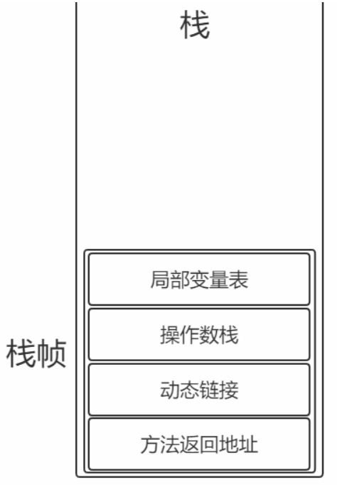

```java
class Person {
    private String name = "Jack";
    private int age;
    private final double salary = 100;
    private static String address;
    private final static String hobby = "Programming";

    public void say() {
        System.out.println("person say...");
    }

    public static int calc(int op1, int op2) {
        op1 = 3;
        int result = op1 + op2;
        return result;
    }

    public static void order() {
    }

    public static void main(String[] args) {
        calc(1, 2);
        order();
    }
}
```

jdk中的bin里面自带有反编译的程序，叫javap.exe,利用他可以从编译生成的.class查看出对应的字节码代码

``` 
javap -c -l Person
```

```java
Compiled from "Person.java"
class Person {
  Person();
    Code:
       0: aload_0
       1: invokespecial #1                  // Method java/lang/Object."<init>":()V
       4: aload_0
       5: ldc           #2                  // String Jack
       7: putfield      #3                  // Field name:Ljava/lang/String;
      10: aload_0
      11: ldc2_w        #4                  // double 100.0d
      14: putfield      #6                  // Field salary:D
      17: return
    LineNumberTable:
      line 7: 0
      line 8: 4
      line 10: 10
    LocalVariableTable:
      Start  Length  Slot  Name   Signature
          0      18     0  this   LPerson;

  public void say();
    Code:
       0: getstatic     #7                  // Field java/lang/System.out:Ljava/io/PrintStream;
       3: ldc           #8                  // String person say...
       5: invokevirtual #9                  // Method java/io/PrintStream.println:(Ljava/lang/String;)V
       8: return
    LineNumberTable:
      line 15: 0
      line 16: 8
    LocalVariableTable:
      Start  Length  Slot  Name   Signature
          0       9     0  this   LPerson;

  public static int calc(int, int);
    Code:
       0: iconst_3    //将int类型常量3压入[操作数栈]
       1: istore_0    //将int类型值存入[局部变量0]
       2: iload_0     //从[局部变量0]中装载int类型值入栈
       3: iload_1     //从[局部变量1]中装载int类型值入栈
       4: iadd        //将栈顶元素弹出栈，执行int类型的加法，结果入栈
       5: istore_2    //将栈顶int类型值保存到[局部变量2]中
       6: iload_2     //从[局部变量2]中装载int类型值入栈
       7: ireturn    //从方法中返回int类型的数据
    LineNumberTable:
      line 19: 0
      line 20: 2
      line 21: 6
    LocalVariableTable:
      Start  Length  Slot  Name   Signature
          0       8     0   op1   I
          0       8     1   op2   I
          6       2     2 result   I

  public static void order();
    Code:
       0: return
    LineNumberTable:
      line 25: 0

  public static void main(java.lang.String[]);
    Code:
       0: iconst_1
       1: iconst_2
       2: invokestatic  #10                 // Method calc:(II)I
       5: pop
       6: invokestatic  #11                 // Method order:()V
       9: return
    LineNumberTable:
      line 28: 0
      line 29: 6
      line 30: 9
    LocalVariableTable:
      Start  Length  Slot  Name   Signature
          0      10     0  args   [Ljava/lang/String;
}
```

此时你需要一个能够看懂反编译指令的宝典

比如官网的：https://docs.oracle.com/javase/specs/jvms/se8/html/index.html


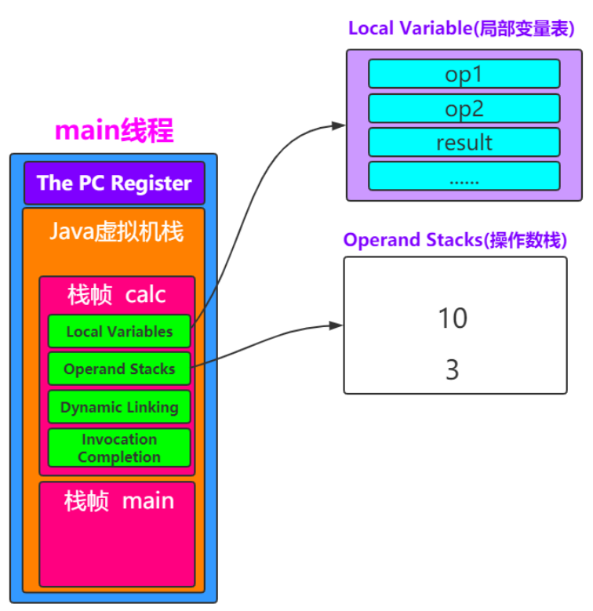

## 折腾一下

### 栈指向堆

如果在栈帧中有一个变量，类型为引用类型，比如Object obj=new Object()，这时候就是典型的栈中元素指向堆中的对象。

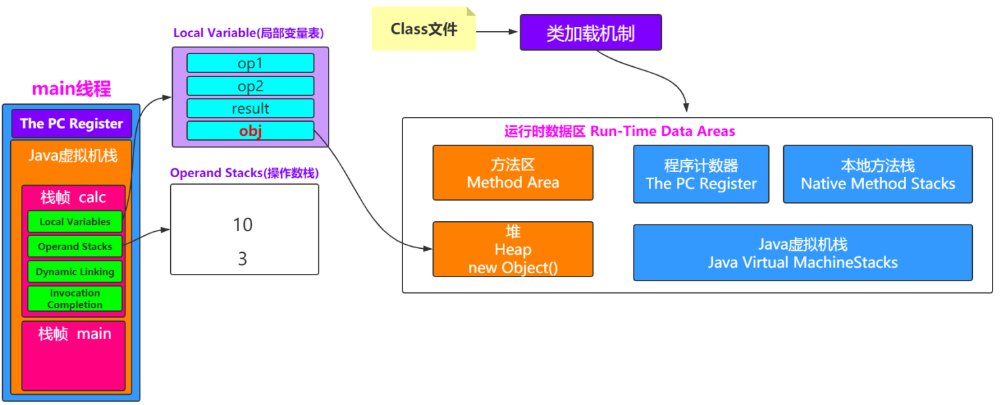

### 方法区指向堆

方法区中会存放静态变量，常量等数据。如果是下面这种情况，就是典型的方法区中元素指向堆中的对象。

```
private static Object obj=new Object();
```

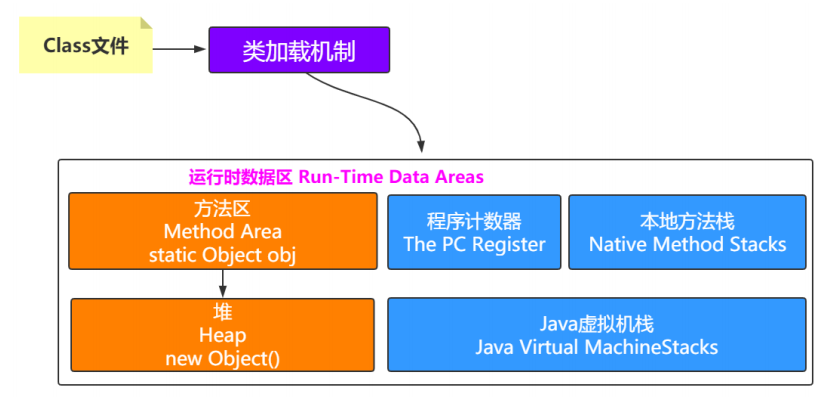

### 堆指向方法区

方法区中会包含类的信息，堆中会有对象，那怎么知道对象是哪个类创建的呢？

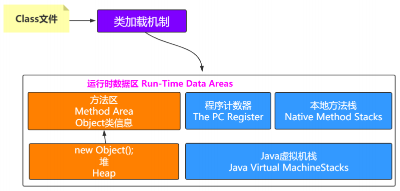

思考 ：一个对象怎么知道它是由哪个类创建出来的？怎么记录？这就需要了解一个Java对象的具体信息咯。

### Java对象内存布局

一个Java对象在内存中包括3个部分：对象头、实例数据和对齐填充

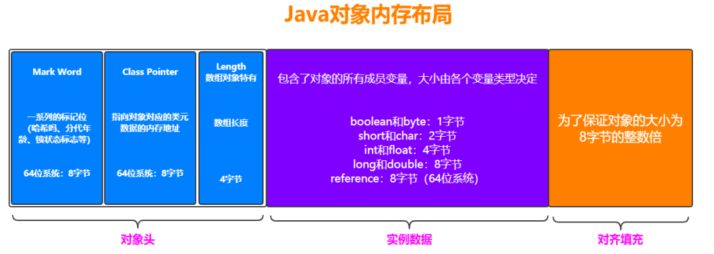


## 内存模型

### 图解

```
一块是非堆区，一块是堆区
堆区分为两大块，一个是Old区，一个是Young区。
Young区分为两大块，一个是Survivor区（S0+S1），一块是Eden区。 Eden:S0:S1=8:1:1
S0和S1一样大，也可以叫From和To。
```

画个图理解一下

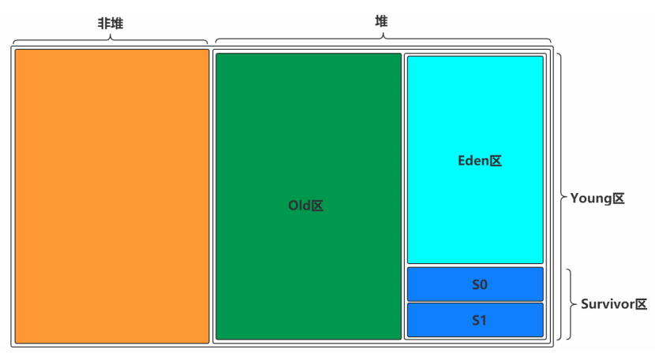

根据之前对于Heap的介绍可以知道，一般对象和数组的创建会在堆中分配内存空间，关键是堆中有这么多区域，那一个对象的创建到底在哪个区域呢？

### 对象创建所在区域

一般情况下，新创建的对象都会被分配到Eden区，一些特殊的大的对象会直接分配到Old区。

```
比如有对象A，B，C等创建在Eden区，但是Eden区的内存空间肯定有限，比如有100M，假如已经使用了
100M或者达到一个设定的临界值，这时候就需要对Eden内存空间进行清理，即垃圾收集(Garbage Collect)，这样的GC我们称之为Minor GC，Minor GC指得是Young区的GC。
经过GC之后，有些对象就会被清理掉，有些对象可能还存活着，对于存活着的对象需要将其复制到Survivor区，然后再清空Eden区中的这些对象。
```

### Survivor区详解

由图解可以看出，Survivor区分为两块S0和S1，也可以叫做From和To。

在同一个时间点上，S0和S1只能有一个区有数据，另外一个是空的。

```
接着上面的GC来说，比如一开始只有Eden区和From中有对象，To中是空的。
此时进行一次GC操作，From区中对象的年龄就会+1，我们知道Eden区中所有存活的对象会被复制到To区，From区中还能存活的对象会有两个去处。
若对象年龄达到之前设置好的年龄阈值，此时对象会被移动到Old区，没有达到阈值的对象会被复制到To区。
此时Eden区和From区已经被清空(被GC的对象肯定没了，没有被GC的对象都有了各自的去处)。
这时候From和To交换角色，之前的From变成了To，之前的To变成了From。
也就是说无论如何都要保证名为To的Survivor区域是空的。
Minor GC会一直重复这样的过程，知道To区被填满，然后会将所有对象复制到老年代中。
```

### Old区详解

从上面的分析可以看出，一般Old区都是年龄比较大的对象，或者相对超过了某个阈值的对象。

在Old区也会有GC的操作，Old区的GC我们称作为Major GC。

### **对象的一辈子理解**

```
我是一个普通的Java对象,我出生在Eden区,在Eden区我还看到和我长的很像的小兄弟,我们在Eden区中玩了挺长时间。有一天Eden区中的人实在是太多了,我就被迫去了Survivor区的“From”区,自从去了Survivor区,我就开始漂了,有时候在Survivor的“From”区,有时候在Survivor的“To”区,居无定所。直到我18岁的时候,爸爸说我成人了,该去社会上闯闯了。
于是我就去了年老代那边,年老代里,人很多,并且年龄都挺大的,我在这里也认识了很多人。在年老代里,我生活了20年(每次GC加一岁),然后被回收。
```

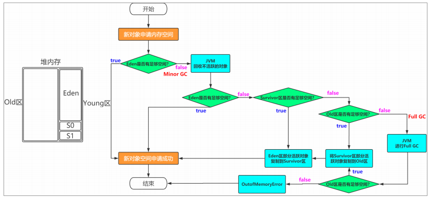

### **常见问题**

如何理解Minor/Major/Full GC

```
Minor GC:新生代
Major GC:老年代
Full GC:新生代+老年代
```

为什么需要Survivor区?只有Eden不行吗？

```
如果没有Survivor,Eden区每进行一次Minor GC,并且没有年龄限制的话，存活的对象就会被送到老年代。这样一来，老年代很快被填满,触发Major GC(因为Major GC一般伴随着Minor GC,也可以看做触发了Full GC)。
老年代的内存空间远大于新生代,进行一次Full GC消耗的时间比Minor GC长得多。
执行时间长有什么坏处?频发的Full GC消耗的时间很长,会影响大型程序的执行和响应速度。
可能你会说，那就对老年代的空间进行增加或者较少咯。
假如增加老年代空间，更多存活对象才能填满老年代。虽然降低Full GC频率，但是随着老年代空间加大,一旦发生Full GC,执行所需要的时间更长。假如减少老年代空间，虽然Full GC所需时间减少，但是老年代很快被存活对象填满,Full GC频率增加。
所以Survivor的存在意义,就是减少被送到老年代的对象,进而减少Full GC的发生,Survivor的预筛选保证,只有经历16次Minor GC还能在新生代中存活的对象,才会被送到老年代。
```

为什么需要两个Survivor区？

```
最大的好处就是解决了碎片化。也就是说为什么一个Survivor区不行?第一部分中,我们知道了必须设置Survivor区。假设现在只有一个Survivor区,我们来模拟一下流程:
刚刚新建的对象在Eden中,一旦Eden满了,触发一次Minor GC,Eden中的存活对象就会被移动到Survivor区。这样继续循环下去,下一次Eden满了的时候,问题来了,此时进行Minor GC,Eden和Survivor各有一些存活对象,如果此时把Eden区的存活对象硬放到Survivor区,很明显这两部分对象所占有的内存是不连续的,也就导致了内存碎片化。
永远有一个Survivor space是空的,另一个非空的Survivor space无碎片。
```

新生代中Eden:S1:S2为什么是8:1:1？

```
新生代中的可用内存：复制算法用来担保的内存为9：1
可用内存中Eden：S1区为8：1
即新生代中Eden:S1:S2 = 8：1：1
```

## 体验与验证

### 使用jvisualvm查看

visualgc插件下载链接 ：

https://visualvm.github.io/pluginscenters.html --->选择对应版本链接--->**Tools**--->Visual GC

若上述链接找不到合适的，大家也可以自己在网上下载对应的版本

当然，大家如果是jdk1.8的版本，也可以直接用我放到网盘中的：

**网盘/课程源码/com-sun-tools-visualvm-modules-visualgc.nbm**

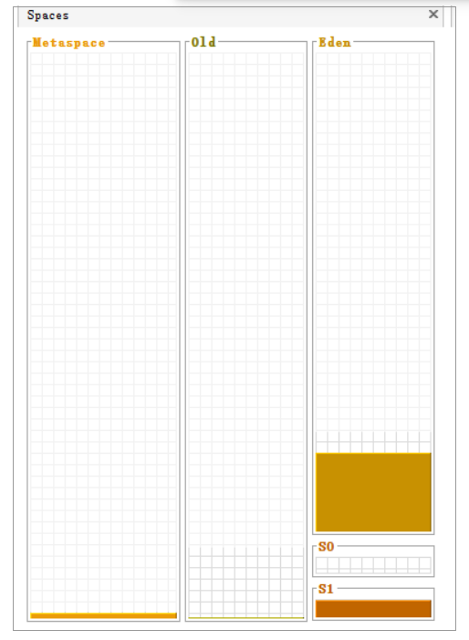


## 堆内存溢出

### **代码**

```java
@RestController
public class HeapController {
    List<Person> list = new ArrayList<Person>();
    @GetMapping("/heap")
    public String heap() throws Exception {
        while (true) {
            list.add(new Person());
            Thread.sleep(1);
        }
    }
}
```

记得设置参数比如-Xmx20M -Xms20M

### **运行结果**

访问->http://localhost:8080/heap

```
Exception in thread "http-nio-8080-exec-2" java.lang.OutOfMemoryError: GC overhead limit exceeded 
```

### **方法区内存溢出**

比如向方法区中添加Class的信息

#### asm依赖和Class代码

```xml
<dependency>
    <groupId>asm</groupId>
    <artifactId>asm</artifactId>
    <version>3.3.1</version>
</dependency>
```

```java
public class MyMetaspace extends ClassLoader {
    public static List<Class<?>> createClasses() {
        List<Class<?>> classes = new ArrayList<Class<?>>();
        for (int i = 0; i < 10000000; ++i) {
            ClassWriter cw = new ClassWriter(0);
            cw.visit(Opcodes.V1_1, Opcodes.ACC_PUBLIC, "Class" + i, null,                   "java/lang/Object", null);
            MethodVisitor mw = cw.visitMethod(Opcodes.ACC_PUBLIC, "<init>",                 "()V", null, null);
            mw.visitVarInsn(Opcodes.ALOAD, 0);
            mw.visitMethodInsn(Opcodes.INVOKESPECIAL, "java/lang/Object", "                 <init>", "()V");
            mw.visitInsn(Opcodes.RETURN);
            mw.visitMaxs(1, 1);
            mw.visitEnd();
            Metaspace test = new Metaspace();
            byte[] code = cw.toByteArray();
            Class<?> exampleClass = test.defineClass("Class" + i, code, 0,                   code.length);
            classes.add(exampleClass);
        }
        return classes;
    }
}
```

#### 代码

```java
@RestController
public class NonHeapController {
    List<Class<?>> list = new ArrayList<Class<?>>();

    @GetMapping("/nonheap")
    public String nonheap() throws Exception {
        while (true) {
            list.addAll(MyMetaspace.createClasses());
            Thread.sleep(5);
        }
    }
}
```

设置Metaspace的大小，比如-XX:MetaspaceSize=50M -XX:MaxMetaspaceSize=50M

### **运行结果**

访问->http://localhost:8080/nonheap

```
java.lang.OutOfMemoryError: Metaspace at java.lang.ClassLoader.defineClass1(Native Method) ~[na:1.8.0_191] at java.lang.ClassLoader.defineClass(ClassLoader.java:763) ~[na:1.8.0_191]
```

### **虚拟机栈**

#### 代码演示StackOverFlow

```java
public class StackDemo {
    public static long count = 0;
    public static void method(long i) {
        System.out.println(count++);
        method(i);
    }
    public static void main(String[] args) {
        method(1);
    }
}
```

### **运行结果**

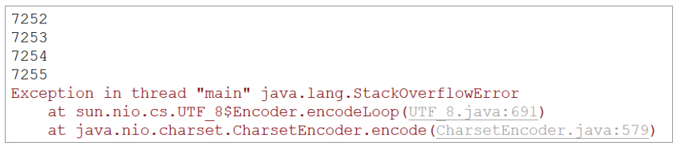

#### **理解和说明**

```
Stack Space用来做方法的递归调用时压入Stack Frame(栈帧)。所以当递归调用太深的时候，就有可能耗尽Stack Space，爆出StackOverflow的错误。

-Xss128k：设置每个线程的堆栈大小。JDK 5以后每个线程堆栈大小为1M，以前每个线程堆栈大小为256K。根据应用的线 程所需内存大小进行调整。在相同物理内存下，减小这个值能生成更多的线程。但是操作系统对一个进程内的线程数还是有 限制的，不能无限生成，经验值在3000~5000左右。 

线程栈的大小是个双刃剑，如果设置过小，可能会出现栈溢出，特别是在该线程内有递归、大的循环时出现溢出的可能性更 大，如果该值设置过大，就有影响到创建栈的数量，如果是多线程的应用，就会出现内存溢出的错误。
```


参考文档：

https://pan.baidu.com/s/1XtXaj5zYr2i8aNVsRBxC6w


# JVM升华篇

## Garbage Collect(**垃圾回收**)

### 如何确定一个对象是垃圾？

要想进行垃圾回收，得先知道什么样的对象是垃圾。

#### **引用计数法**

对于某个对象而言，只要应用程序中持有该对象的引用，就说明该对象不是垃圾，如果一个对象没有任何指针对其引用，它就是垃圾。

弊端 :如果AB相互持有引用，导致永远不能被回收。

#### **可达性分析**

通过GC Root的对象，开始向下寻找，看某个对象是否可达

能作为GC Root:类加载器、Thread、虚拟机栈的本地变量表、static成员、常量引用、本地方法

栈的变量等。

## 垃圾收集算法

> 已经能够确定一个对象为垃圾之后，接下来要考虑的就是回收，怎么回收呢？
>
> 得要有对应的算法，下面聊聊常见的垃圾回收算法。

###  标记清除(Mark-Sweep)

- 标记

找出内存中需要回收的对象，并且把它们标记出来

> 此时堆中所有的对象都会被扫描一遍，从而才能确定需要回收的对象，比较耗时

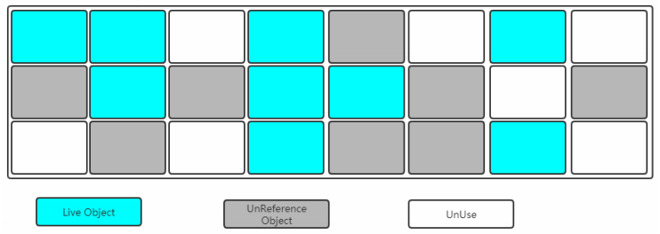

- 清除

> 清除掉被标记需要回收的对象，释放出对应的内存空间

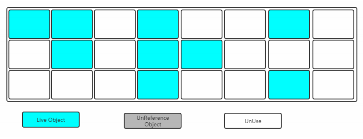

缺点:

```
标记清除之后会产生大量不连续的内存碎片，空间碎片太多可能会导致以后在程 序运行过程中需要分配较大对象时，无法找到足够的连续内存而不得不提前触发另一次垃圾收集动作。 
(1)标记和清除两个过程都比较耗时，效率不高 
(2)会产生大量不连续的内存碎片，空间碎片太多可能会导致以后在程序运行过程中需要分配较大对象时，无 法找到足够的连续内存而不得不提前触发另一次垃圾收集动作。
```

###  复制(Copying)

> 将内存划分为两块相等的区域，每次只使用其中一块，如下图所示:

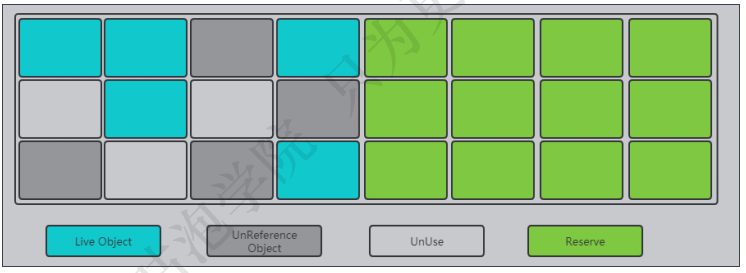

> 当其中一块内存使用完了，就将还存活的对象复制到另外一块上面，然后把已经使用过的内存空间一次清除掉。

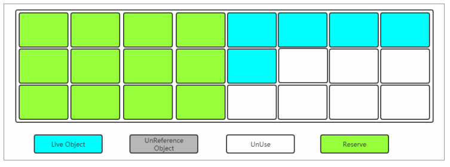

缺点:

```
 空间利用率降低。
```

### 标记-整理(Mark-Compact)

> 标记过程仍然与"标记-清除"算法一样，但是后续步骤不是直接对可回收对象进行清理，而是让所有存活的对象都向一端移动，然后直接清理掉端边界以外的内存。

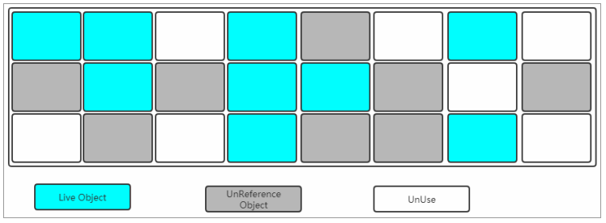

> 让所有存活的对象都向一端移动，清理掉边界意外的内存。

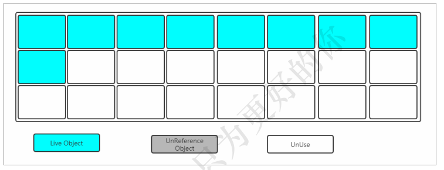

### 分代收集算法

> 既然上面介绍了3中垃圾收集算法，那么在堆内存中到底用哪一个呢？

Young区：复制算法(对象在被分配之后，可能生命周期比较短，Young区复制效率比较高)

Old区：标记清除或标记整理(Old区对象存活时间比较长，复制来复制去没必要，不如做个标记再清理)

## 垃圾收集器

> 如果说收集算法是内存回收的方法论，那么垃圾收集器就是内存回收的具体实现，说白了就是落地咯。

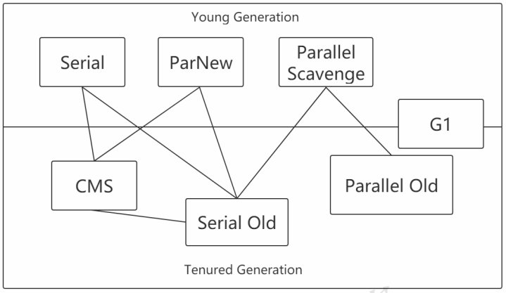

### Serial收集器

Serial收集器是最基本、发展历史最悠久的收集器，曾经（在JDK1.3.1之前）是虚拟机新生代收集的唯一选择。

它是一种单线程收集器，不仅仅意味着它只会使用一个CPU或者一条收集线程去完成垃圾收集工作，更重要的是其在进行垃圾收集的时候需要暂停其他线程.

```
优点：简单高效，拥有很高的单线程收集效率 
缺点：收集过程需要暂停所有线程 
算法：复制算法 
适用范围：新生代 
应用：Client模式下的默认新生代收集器
```

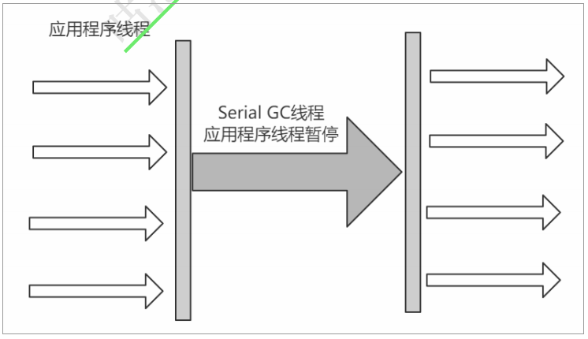

### ParNew收集器

可以把这个收集器理解为Serial收集器的多线程版本。

```
优点：在多CPU时，比Serial效率高。
缺点：收集过程暂停所有应用程序线程，单CPU时比Serial效率差。
算法：复制算法
适用范围：新生代
应用：运行在Server模式下的虚拟机中首选的新生代收集器
```

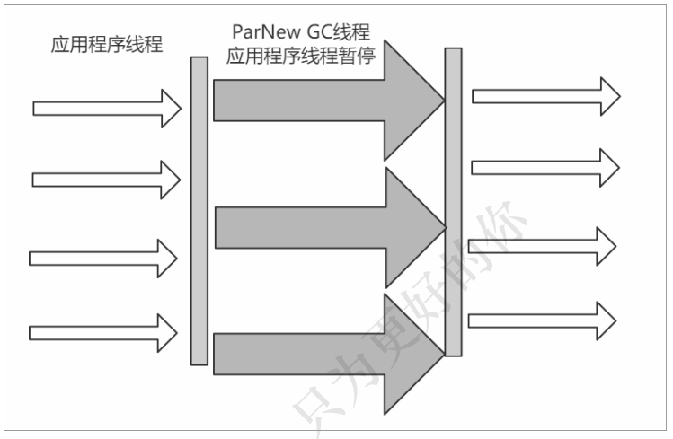

### Parallel Scavenge收集器

Parallel Scavenge收集器是一个新生代收集器，它也是使用复制算法的收集器，又是并行的多线程收集器，看上去和ParNew一样，但是Parallel Scanvenge更关注 系统的吞吐量 

> 吞吐量=运行用户代码的时间/(运行用户代码的时间+垃圾收集时间)
>
> 比如虚拟机总共运行了100分钟，垃圾收集时间用了1分钟，
>
> 吞吐量=(100-1)/100=99%。
>
> 若吞吐量越大，意味着垃圾收集的时间越短，则用户代码可以充分利用CPU资源，尽快完成程序的运算任务。

```
-XX:MaxGCPauseMillis控制最大的垃圾收集停顿时间，
-XX:GCTimeRatio直接设置吞吐量的大小。
```

### Serial Old收集器

Serial Old收集器是Serial收集器的老年代版本，也是一个单线程收集器，不同的是采用"标记-整理算法"，运行过程和Serial收集器一样。

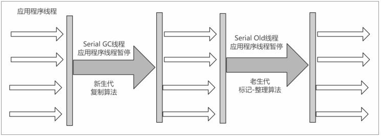

### Parallel Old收集器

Parallel Old收集器是Parallel Scavenge收集器的老年代版本，使用多线程和"标记-整理算法"进行垃圾回收。

吞吐量优先

### **CMS**收集器

CMS(Concurrent Mark Sweep)收集器是一种以获取 最短回收停顿时间 为目标的收集器。

采用的是"标记-清除算法",整个过程分为4步

```
(1)初始标记 CMS initial mark 标记GC Roots能关联到的对象 Stop The World--->速度很快 
(2)并发标记 CMS concurrent mark 进行GC Roots Tracing 
(3)重新标记 CMS remark 修改并发标记因用户程序变动的内容 Stop The World 
(4)并发清除 CMS concurrent sweep
```

> 由于整个过程中，并发标记和并发清除，收集器线程可以与用户线程一起工作，所以总体上来说，CMS收集器的内存回收过程是与用户线程一起并发地执行的。

```
优点：并发收集、低停顿 
缺点：产生大量空间碎咕泡学院 只为更好的你 片、并发阶段会降低吞吐量
```

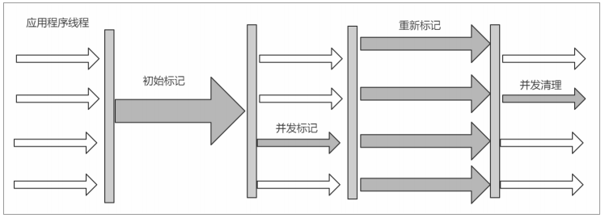

### G1收集器

G1特点

```
并行与并发 
分代收集（仍然保留了分代的概念） 
空间整合（整体上属于“标记-整理”算法，不会导致空间碎片） 
可预测的停顿（比CMS更先进的地方在于能让使用者明确指定一个长度为M毫秒的时间片段内，消耗在垃圾收集上的时间不得超过N毫秒）
```

> 使用G1收集器时，Java堆的内存布局与就与其他收集器有很大差别，它将整个Java堆划分为多个大小相等的独立区域（Region），虽然还保留有新生代和老年代的概念，但新生代和老年代不再是物理隔离的了，它们都是一部分Region（不需要连续）的集合。

工作过程可以分为如下几步

```
初始标记（Initial Marking） 标记一下GC Roots能够关联的对象，并且修改TAMS的值，需要暂 停用户线程 
并发标记（Concurrent Marking） 从GC Roots进行可达性分析，找出存活的对象，与用户线程并发 执行
最终标记（Final Marking） 修正在并发标记阶段因为用户程序的并发执行导致变动的数据，需 暂停用户线程 
筛选回收（Live Data Counting and Evacuation） 对各个Region的回收价值和成本进行排序，根据 用户所期望的GC停顿时间制定回收计划
```

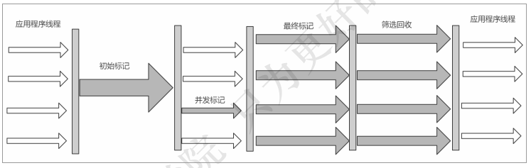

### 垃圾收集器分类

- 串行收集器->Serial和Serial Old

只能有一个垃圾回收线程执行，用户线程暂停。 适用于内存比较小的嵌入式设备 。

- 并行收集器[吞吐量优先]->Parallel Scanvenge、Parallel Old

多条垃圾收集线程并行工作，但此时用户线程仍然处于等待状态。 适用于科学计算、后台处理等若交互场景 。

- 并发收集器[停顿时间优先]->CMS、G1

用户线程和垃圾收集线程同时执行(但并不一定是并行的，可能是交替执行的)，垃圾收集线程在执行的时候不会停顿用户线程的运行。 适用于相对时间有要求的场景，比如Web

#### 理解吞吐量和停顿时间

- 停顿时间->垃圾收集器 进行 垃圾回收终端应用执行响应的时间

- 吞吐量->运行用户代码时间/(运行用户代码时间+垃圾收集时间) 

```
停顿时间越短就越适合需要和用户交互的程序，良好的响应速度能提升用户体验； 
高吞吐量则可以高效地利用CPU时间，尽快完成程序的运算任务，主要适合在后台运算而不需要太多交互的任务。
```

小结 :这两个指标也是评价垃圾回收器好处的标准，其实调优也就是在观察者两个变量。

#### **如何选择合适的垃圾收集器**

官网 ：https://docs.oracle.com/javase/8/docs/technotes/guides/vm/gctuning/collectors.html#sthref28

- 优先调整堆的大小让服务器自己来选择

- 如果内存小于100M，使用串行收集器

- 如果是单核，并且没有停顿时间要求，使用串行或JVM自己选

- 如果允许停顿时间超过1秒，选择并行或JVM自己选

- 如果响应时间最重要，并且不能超过1秒，使用并发收集器

- 对于G1收集

#### 再次理解G1

>  JDK 7开始使用，JDK 8非常成熟，JDK 9默认的垃圾收集器，适用于新老生代。

判断是否需要使用G1收集器？

```
（1）50%以上的堆被存活对象占用 
（2）对象分配和晋升的速度变化非常大 
（3）垃圾回收时间比较长
```

#### **如何开启需要的垃圾收集器**

> 这里JVM参数信息的设置大家先不用关心，下一章节会学习到。

```
（1）串行 
    -XX：+UseSerialGC 
    -XX：+UseSerialOldGC 
（2）并行(吞吐量优先)： 
    -XX：+UseParallelGC 
    -XX：+UseParallelOldGC 
（3）并发收集器(响应时间优先) 
    -XX：+UseConcMarkSweepGC 
    -XX：+UseG1G
```


参考文档：

https://pan.baidu.com/s/15RIqCmazkso6BkhXDS2OpA


# JVM实战篇

##  **JVM**参数

### **标准参数**

```
-version 
-help 
-server 
-cp
```

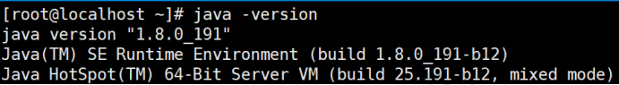

###  **-X**参数

> 非标准参数，也就是在JDK各个版本中可能会变动

```
-Xint 解释执行 
-Xcomp 第一次使用就编译成本地代码 
-Xmixed 混合模式，JVM自己来决定
```

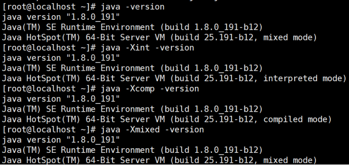

###  **-XX**参数

> **使用得最多的参数类型**
>
> 非标准化参数，相对不稳定，主要用于JVM调优和Debug

```
a.Boolean类型 
格式：-XX:[+-]<name> +或-表示启用或者禁用name属性 
比如：-XX:+UseConcMarkSweepGC 表示启用CMS类型的垃圾回收器 -XX:+UseG1GC 表示启用G1类型的垃圾回收器 
b.非Boolean类型 
格式：-XX<name>=<value>表示name属性的值是value 
比如：-XX:MaxGCPauseMillis=500
```

### **其他参数**

```
-Xms1000等价于-XX:InitialHeapSize=1000 
-Xmx1000等价于-XX:MaxHeapSize=1000 -Xss100等价于
-XX:ThreadStackSize=100
```

> 所以这块也相当于是-XX类型的参数

###  **查看参数**

> java -XX:+PrintFlagsFinal -version > flflags.txt

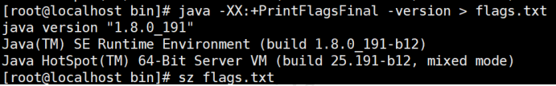

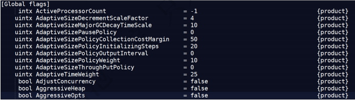

> 值得注意的是"="表示默认值，":="表示被用户或JVM修改后的值
>
> 要想查看某个进程具体参数的值，可以使用jinfo，这块后面聊
>
> 一般要设置参数，可以先查看一下当前参数是什么，然后进行修改

### **设置参数的方式**

- 开发工具中设置比如IDEA，eclipse

- 运行jar包的时候:java -XX:+UseG1GC xxx.jar

- web容器比如tomcat，可以在脚本中的进行设置

- 通过jinfo实时调整某个java进程的参数(参数只有被标记为manageable的flflags可以被实时修改)

### **实践和单位换算**

```
1Byte(字节)=8bit(位) 
1KB=1024Byte(字节) 
1MB=1024KB 
1GB=1024MB 
1TB=1024GB
```

```
(1)设置堆内存大小和参数打印 -Xmx100M -Xms100M -XX:+PrintFlagsFinal 
(2)查询  +PrintFlagsFinal的值 :=true 
(3)查询堆内存大小MaxHeapSize := 104857600 
(4)换算  104857600(Byte)/1024=102400(KB) 102400(KB)/1024=100(MB) 
(5)结论  104857600是字节单位 咕泡学院 只
```

###  **常用参数含义**

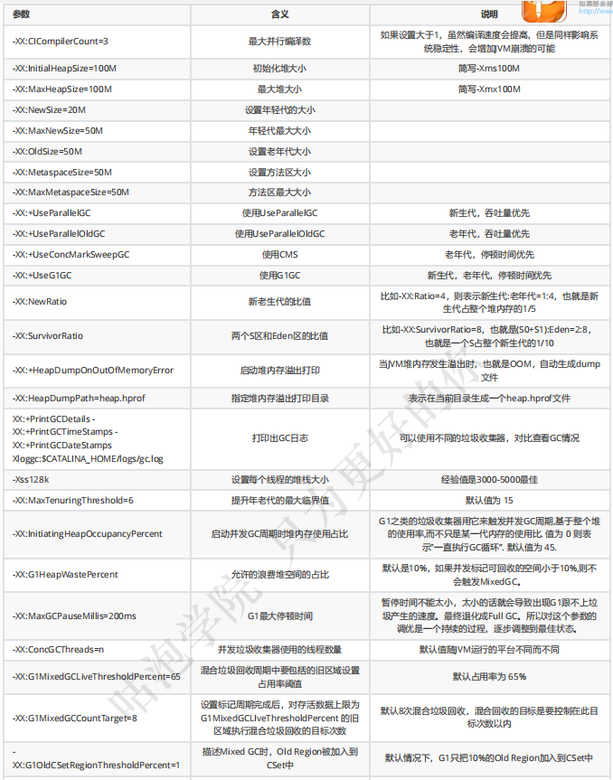

## **常用命令**

###  **jps**

> 查看java进程

```
The jps command lists the instrumented Java HotSpot VMs on the target system. 
The command is limited to reporting information on JVMs for which it has the 
access permissions.
```

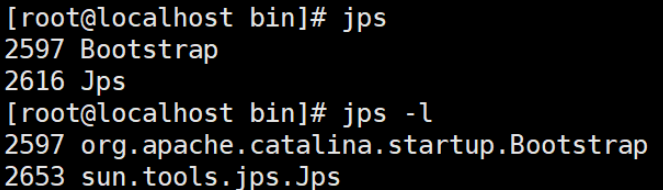

###  **jinfo**

> (1)实时查看和调整JVM配置参数

```
The jinfo command prints Java configuration information for a specified Java process or core file or a remote debug server. The configuration information includes Java system properties and Java Virtual Machine (JVM) command-line flags.
```

> (2)查看 jinfo -flflag name PID 查看某个java进程的name属性的值

```
jinfo -flag MaxHeapSize PID jinfo -flag UseG1GC PID
```

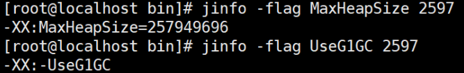

> (3)修改   参数只有被标记为 manageable 的 flflags 可以被实时修改
>
> jinfo -flflag [+|-] PID
>
> jinfo -flflag = PID

> (4)查看曾经赋过值的一些参数

```
jinfo -flags PID
```

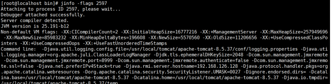

### **jstat**

> (1)查看虚拟机性能统计信息

```
The jstat command displays performance statistics for an instrumented Java HotSpot VM. The target JVM is identified by its virtual machine identifier, or vmid option.
```

> (2)查看类装载信息

```
jstat -class PID 1000 10 
查看某个java进程的类装载信息，每1000毫秒输出一次，共输出10 次
```

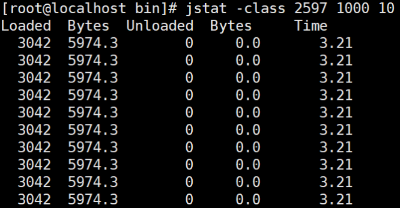

> (3)查看垃圾收集信息

```
jstat -gc PID 1000 10
```

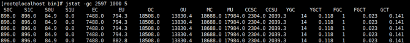

### **jstack**

> (1)查看线程堆栈信息

```
The jstack command prints Java stack traces of Java threads for a specified Java process, core file, or remote debug server.
```

> (2)用法

```
jstack PID
```

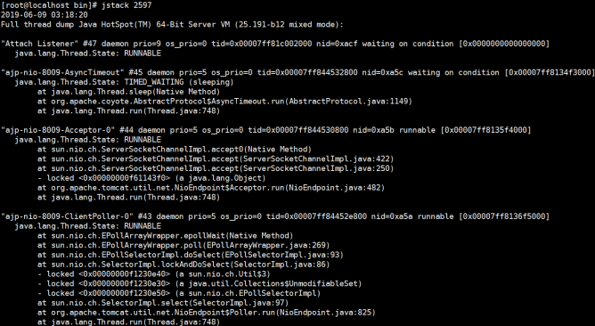

> (4)排查死锁案例

- DeadLockDemo

```java
//运行主类 
public class DeadLockDemo {
    public static void main(String[] args) {
        DeadLock d1 = new DeadLock(true);
        DeadLock d2 = new DeadLock(false);
        Thread t1 = new Thread(d1);
        Thread t2 = new Thread(d2);
        t1.start();
        t2.start();
    }
}//定义锁对象 

class MyLock {
    public static Object obj1 = new Object();
    public static Object obj2 = new Object();
}//死锁代码 

class DeadLock implements Runnable {
    private boolean flag;

    DeadLock(boolean flag) {
        this.flag = flag;
    }

    public void run() {
        if (flag) {
            while (true) {
                synchronized (MyLock.obj1) {
                    System.out.println(Thread.currentThread().getName() + "----if 获得obj1锁");
                    synchronized (MyLock.obj2) {
                        System.out.println(Thread.currentThread().getName() + "--- -if获得obj2锁");
                    }
                }
            }
        } else {
            while (true) {
                synchronized (MyLock.obj2) {
                    System.out.println(Thread.currentThread().getName() + "----否则 获得obj2锁");
                    synchronized (MyLock.obj1) {
                        System.out.println(Thread.currentThread().getName() + "--- -否则获得obj1锁");
                    }
                }
            }
        }
    }
}
```

- 运行结果

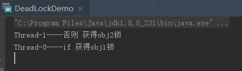

- jstack分析

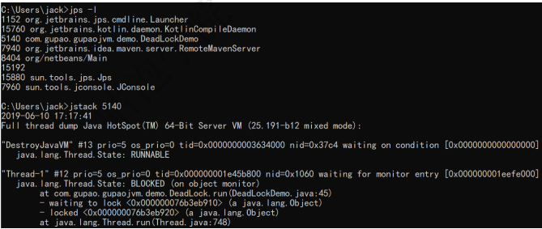

> 把打印信息拉到最后可以发现

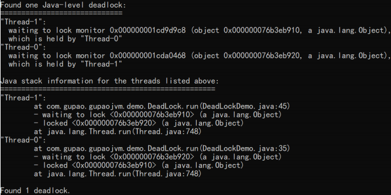

###  **jmap**

> (1)生成堆转储快照

```
The jmap command prints shared object memory maps or heap memory details of a specified process, core file, or remote debug server.
```

> (2)打印出堆内存相关信息

```
-XX:+PrintFlagsFinal -Xms300M -Xmx300M 
jmap -heap PID
```

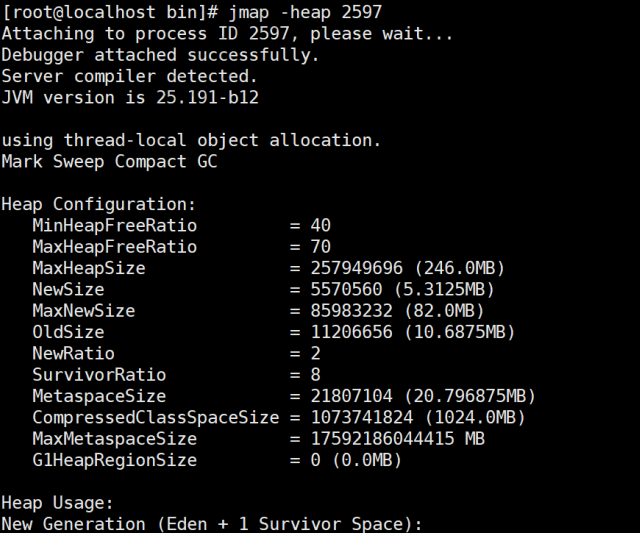

> (3)dump出堆内存相关信息
>
> jmap -dump:format=b,fifile=heap.hprof PID

```
jmap -dump:format=b,file=heap.hprof 44808
```

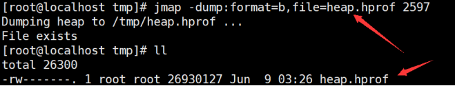

> (4)要是在发生堆内存溢出的时候，能自动dump出该文件就好了

一般在开发中，JVM参数可以加上下面两句，这样内存溢出时，会自动dump出该文件

-XX:+HeapDumpOnOutOfMemoryError -XX:HeapDumpPath=heap.hprof

```
设置堆内存大小: -Xms20M -Xmx20M 启动，然后访问localhost:9090/heap，使得堆内存溢出
```

> (5)关于dump下来的文件

一般dump下来的文件可以结合工具来分析，这块后面再说。

###  **常用工具**

> 参数也了解了，命令也知道了，关键是用起来不是很方便，要是有图形化的界面就好了。
>
> 一定会有好事之者来做这件事情

###  **jconsole**

JConsole工具是JDK自带的可视化监控工具。查看java应用程序的运行概况、监控堆信息、永久区使用情况、类加载情况等

> 命令行中输入：jconsole

###  **jvisualvm**

####  监控本地 Java 进程

可以监控本地的java进程的CPU，类，线程等

#### 监控远端 Java 进程

> 比如监控远端tomcat，演示部署在阿里云服务器上的tomcat

(1)在visualvm中选中“远程”，右击“添加”

(2)主机名上写服务器的ip地址，比如31.100.39.63，然后点击“确定”

(3)右击该主机“31.100.39.63”，添加“JMX”[也就是通过JMX技术具体监控远端服务器哪个Java进程]

(4)要想让服务器上的tomcat被连接，需要改一下 bin/catalina.sh 这个文件

> 注意下面的8998不要和服务器上其他端口冲突

```
JAVA_OPTS="$JAVA_OPTS -Dcom.sun.management.jmxremote - Djava.rmi.server.hostname=31.100.39.63 -Dcom.sun.management.jmxremote.port=8998 -Dcom.sun.management.jmxremote.ssl=false - Dcom.sun.management.jmxremote.authenticate=true - Dcom.sun.management.jmxremote.access.file=../conf/jmxremote.access - Dcom.sun.management.jmxremote.password.file=../conf/jmxremote.password
```

(5)在 ../conf 文件中添加两个文件jmxremote.access和jmxremote.password

> jmxremote.access 文件
>
> ```
> guest readonly 
> manager readwrite
> ```


> jmxremote.password 文件
>
> ```
> guest guest 
> manager manager
> ```

授予权限 : chmod 600 *jmxremot*

(6)将连接服务器地址改为公网ip地址

```
hostname -i 查看输出情况 
    172.26.225.240 172.17.0.1 
vim /etc/hosts 
    172.26.255.240 31.100.39.63
```

(7)设置上述端口对应的阿里云安全策略和防火墙策略

(8)启动tomcat，来到bin目录

```
./startup.sh
```

(9)查看tomcat启动日志以及端口监听

```
tail -f ../logs/catalina.out 
lsof -i tcp:8080
```

(10)查看8998监听情况，可以发现多开了几个端口

```
lsof -i:8998 得到PID 
netstat -antup | grep PID
```

(11)在刚才的JMX中输入8998端口，并且输入用户名和密码则登录成功

```
端口:8998 
用户名:manager 
密码:manager
```

###  **Arthas**

>  github ：https://github.com/alibaba/arthas

```
Arthas allows developers to troubleshoot production issues for Java applications without modifying code or restarting servers.
```

Arthas 是Alibaba开源的Java诊断工具，采用**命令行交互模式**，是排查jvm相关问题的利器。

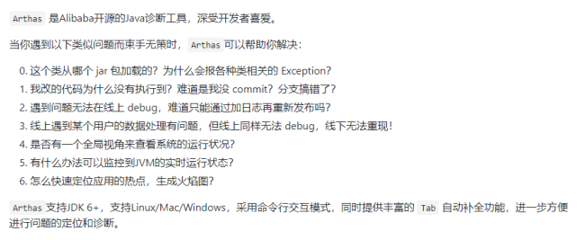

#### **下载安装**

```
curl -O https://alibaba.github.io/arthas/arthas-boot.jar 
java -jar arthas-boot.jar 
# 然后可以选择一个Java进程
```

**Print usage**

```
java -jar arthas-boot.jar -h
```

####  **常用命令**

> 具体每个命令怎么使用，大家可以自己查阅资料

```
version:查看arthas版本号 
help:查看命名帮助信息 
cls:清空屏幕 
session:查看当前会话信息 
quit:退出arthas客户端 
--- 
dashboard:当前进程的实时数据面板 
thread:当前JVM的线程堆栈信息 
jvm:查看当前JVM的信息 
sysprop:查看JVM的系统属性 
--- 
sc:查看JVM已经加载的类信息 
dump:dump已经加载类的byte code到特定目录 
jad:反编译指定已加载类的源码 
--- 
monitor:方法执行监控 
watch:方法执行数据观测 
trace:方法内部调用路径，并输出方法路径上的每个节点上耗时 
stack:输出当前方法被调用的调用路径 
......
```

### **MAT**

Java堆分析器，用于查找内存泄漏

Heap Dump，称为堆转储文件，是Java进程在某个时间内的快照

> 下载地址 ：https://www.eclipse.org/mat/downloads.php

#### Dump 信息包含的内容

- All Objects

Class, fifields, primitive values and references

- All Classes

Classloader, name, super class, static fifields

- Garbage Collection Roots

Objects defifined to be reachable by the JVM

- Thread Stacks and Local Variables

The call-stacks of threads at the moment of the snapshot, and per-frame information about local objects

#### 获取Dump文件

- 手动

```
jmap -dump:format=b,file=heap.hprof 44808
```

- 自动

```
-XX:+HeapDumpOnOutOfMemoryError -XX:HeapDumpPath=heap.hprof
```

**使用**

- Histogram

> Histogram可以列出内存中的对象，对象的个数及其大小

```
Class Name:类名称，java类名 
Objects:类的对象的数量，这个对象被创建了多少个
Shallow Heap:一个对象内存的消耗大小，不包含对其他对象的引用 
Retained Heap:是shallow Heap的总和，即该对象被GC之后所能回收到内存的总和
```

```
右击类名--->List Objects--->with incoming references--->列出该类的实例
```

```
右击Java对象名--->Merge Shortest Paths to GC Roots--->exclude all ...--->找到GC Root以及原因
```

- Leak Suspects

> 查找并分析内存泄漏的可能原因

```
Reports--->Leak Suspects--->Details
```

- Top Consumers

> 列出大对象

###  GC日志分析工具

> 要想分析日志的信息，得先拿到GC日志文件才行，所以得先配置一下
>
> 根据前面参数的学习，下面的配置很容易看懂

```
-XX:+PrintGCDetails -XX:+PrintGCTimeStamps -XX:+PrintGCDateStamps -Xloggc:gc.log
```

- 在线

http://gceasy.io

- GCViewer


参考文档：


https://pan.baidu.com/s/1P8RXagtvV9ykAYckw1JtDQ


# JVM终结篇

## 重新认知JVM

> 之前我们画过一张图，是从Class文件到类装载器，再到运行时数据区的过程。
>
> 现在咱们把这张图不妨丰富完善一下，展示了JVM的大体物理结构图

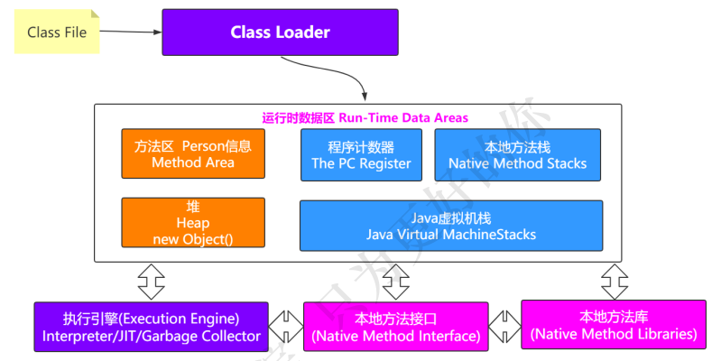


## GC优化

> 内存被使用了之后，难免会有不够用或者达到设定值的时候，就需要对内存空间进行垃圾回收。

### **垃圾收集发生的时机**

> GC是由JVM自动完成的，根据JVM系统环境而定，所以时机是不确定的。 当然，我们可以手动进行垃圾回收，
>
> 比如调用System.gc()方法通知JVM进行一次垃圾回收，但是具体什么时刻运行也无法控制。也就是说
>
> System.gc()只是通知要回收，什么时候回收由JVM决定。 但是不建议手动调用该方法，因为消耗的资源比较
>
> 大。
>
> **一般以下几种情况会发生垃圾回收**

```
（1）当Eden区或者S区不够用了 
（2）老年代空间不够用了 
（3）方法区空间不够用了 
（4）System.gc()
```

### **实验环境准备**

比如使用gp-jvm这个项目，然后配置对应的参数。

### GC日志文件

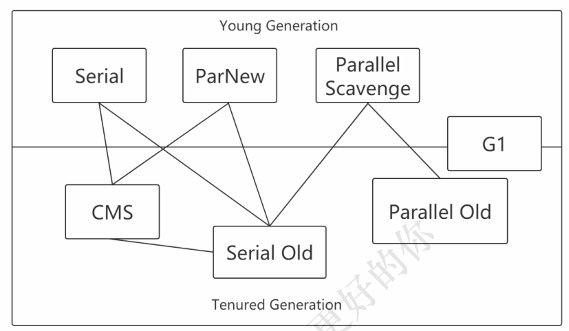

> 要想分析日志的信息，得先拿到GC日志文件才行，所以得先配置一下，之前也看过这些参数。
>
> ```
> -XX:+PrintGCDetails -XX:+PrintGCTimeStamps -XX:+PrintGCDateStamps -Xloggc:gc.log
> ```

然后启动项目

```
可以看到默认使用的是ParallelGC
```

#### Parallel GC日志

> 【吞吐量优先】
>
> ```
> 2019-06-10T23:21:53.305+0800: 1.303: [GC (Allocation Failure) [PSYoungGen: 65536K[Young区回收前]->10748K[Young区回收后] (76288K[Young区总大小])] 65536K[整个堆回收前]->15039K[整个堆回收后](251392K[整个堆总大小]), 0.0113277 secs] [Times: user=0.00 sys=0.00, real=0.01 secs]
> ```
>
> 注意 如果回收的差值中间有出入，说明这部分空间是Old区释放出来的

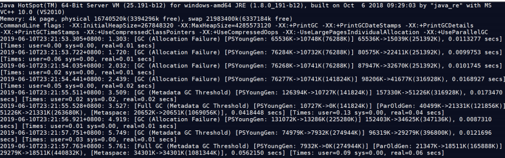


#### CMS日志

> 【停顿时间优先】
>
> 参数设置：-XX:+UseConcMarkSweepGC -Xloggc:cms-gc.log

####  G1日志

> 【停顿时间优先】
>
> 参数设置：-XX:+UseG1GC -Xloggc:g1-gc.log
>
> 理解G1日志格式：https://blogs.oracle.com/poonam/understanding-g1-gc-logs
>
> ```
> -XX:+UseG1GC # 使用了G1垃圾收集器 
> # 什么时候发生的GC，相对的时间刻，GC发生的区域young，总共花费的时间，0.00478s， 
> # It is a stop-the-world activity and all 
> # the application threads are stopped at a safepoint during this time. 2019-12-18T16:06:46.508+0800: 0.458: [GC pause (G1 Evacuation Pause) (young), 0.0047804 secs] 
> 
> # 多少个垃圾回收线程，并行的时间 
> [Parallel Time: 3.0 ms, GC Workers: 4] 
> 
> # GC线程开始相对于上面的0.458的时间刻 
> [GC Worker Start (ms): Min: 458.5, Avg: 458.5, Max: 458.5, Diff: 0.0] 
> 
> # This gives us the time spent by each worker thread scanning the roots 
> # (globals, registers, thread stacks and VM data structures). 
> [Ext Root Scanning (ms): Min: 0.2, Avg: 0.4, Max: 0.7, Diff: 0.5, Sum: 1.7] 
> 
> # Update RS gives us the time each thread spent in updating the Remembered Sets. [Update RS (ms): Min: 0.0, Avg: 0.0, Max: 0.0, Diff: 0.0, Sum: 0.0] 
> 
> ...
> ```


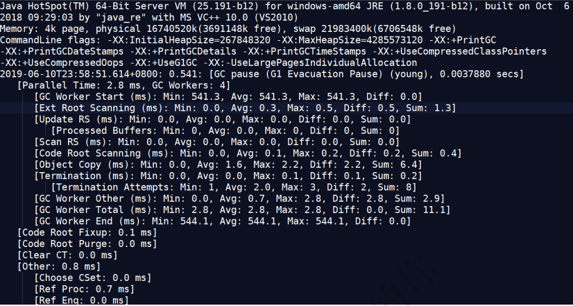

###  GC日志文件分析工具

#### gceasy

> 官网 ：https://gceasy.io
>
> 可以比较不同的垃圾收集器的吞吐量和停顿时间
>
> 比如打开cms-gc.log和g1-gc.log

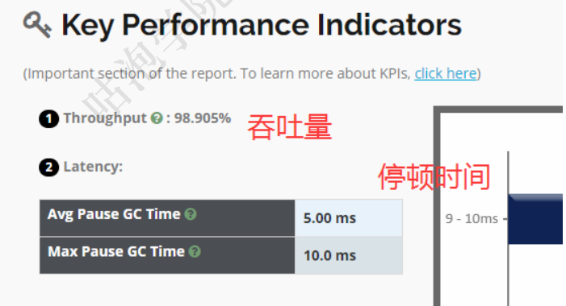

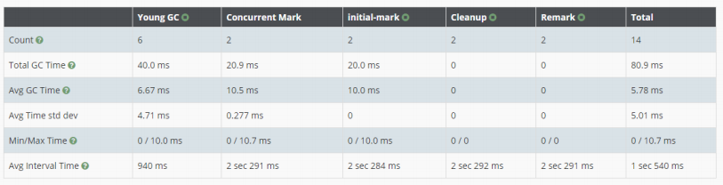

#### **GCViewer**

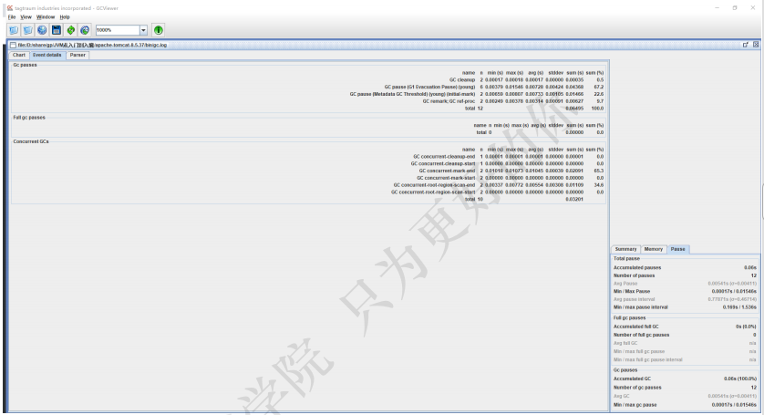

### G1 调优与最佳指南

#### **调优**

> 是否选用G1垃圾收集器的判断依据
>
> https://docs.oracle.com/javase/8/docs/technotes/guides/vm/G1.html#use_cases
>
> ```
> （1）50%以上的堆被存活对象占用 
> （2）对象分配和晋升的速度变化非常大 
> （3）垃圾回收时间比较长
> ```
>
> 思考 ：https://blogs.oracle.com/poonam/increased-heap-usage-with-g1-gc

(1) 使用G1GC垃圾收集器: -XX:+UseG1GC

修改配置参数，获取到gc日志，使用GCViewer分析吞吐量和响应时间

| Throughput | Min Pause | Max Pause | Avg Pause | GC count |
| ---------- | --------- | --------- | --------- | -------- |
| 99.16%     | 0.00016s  | 0.0137s   | 0.00559s  | 12       |

(2)调整内存大小再获取gc日志分析

```
-XX:MetaspaceSize=100M 
-Xms300M 
-Xmx300M
```

比如设置堆内存的大小，获取到gc日志，使用GCViewer分析吞吐量和响应时间

| Throughput | Min Pause | Max Pause | Avg Pause | GC count |
| ---------- | --------- | --------- | --------- | -------- |
| 98.89%     | 0.00021s  | 0.01531s  | 0.00538s  | 12       |

(3)调整最大停顿时间

```
-XX:MaxGCPauseMillis=20 设置最大GC停顿时间指标
```

比如设置最大停顿时间，获取到gc日志，使用GCViewer分析吞吐量和响应时间

| Throughput | Min Pause | Max Pause | Avg Pause | GC count |
| ---------- | --------- | --------- | --------- | -------- |
| 98.96%     | 0.00015s  | 0.01737s  | 0.00574s  | 12       |

(4)启动并发GC时堆内存占用百分比

```
-XX:InitiatingHeapOccupancyPercent=45 G1用它来触发并发GC周期,基于整个堆的使用率,而不只是某一代内存的 使用比例。值为 0 则表示“一直执行GC循环)'. 默认值为 45 (例如, 全部的 45% 或者使用了45%).
```

比如设置该百分比参数，获取到gc日志，使用GCViewer分析吞吐量和响应时间

| Throughput | Min Pause | Max Pause | Avg Pause | GC count |
| ---------- | --------- | --------- | --------- | -------- |
| 98.11%     | 0.00406s  | 0.00532s  | 0.00469s  | 12       |

#### **最佳指南**

官网建议 ：https://docs.oracle.com/javase/8/docs/technotes/guides/vm/gctuning/g1_gc_tuning.html#recommendations

(1)不要手动设置新生代和老年代的大小，只要设置整个堆的大小

```
G1收集器在运行过程中，会自己调整新生代和老年代的大小 
其实是通过adapt代的大小来调整对象晋升的速度和年龄，从而达到为收集器设置的暂停时间目标 
如果手动设置了大小就意味着放弃了G1的自动调优
```

(2)不断调优暂停时间目标

```
一般情况下这个值设置到100ms或者200ms都是可以的(不同情况下会不一样)，但如果设置成50ms就不太合理。暂停 时间设置的太短，就会导致出现G1跟不上垃圾产生的速度。最终退化成Full GC。所以对这个参数的调优是一个持续 的过程，逐步调整到最佳状态。暂停时间只是一个目标，并不能总是得到满足。
```

(3)使用-XX:ConcGCThreads=n来增加标记线程的数量

```
IHOP如果阀值设置过高，可能会遇到转移失败的风险，比如对象进行转移时空间不足。如果阀值设置过低，就会使标 记周期运行过于频繁，并且有可能混合收集期回收不到空间。 IHOP值如果设置合理，但是在并发周期时间过长时，可以尝试增加并发线程数，调高ConcGCThreads。
```

(4)MixedGC调优

```
-XX:InitiatingHeapOccupancyPercent 
-XX:G1MixedGCLiveThresholdPercent 
-XX:G1MixedGCCountTarger 
-XX:G1OldCSetRegionThresholdPercent
```

(5)适当增加堆内存大小

## **高并发场景分析**

> 以每秒3000笔订单为例

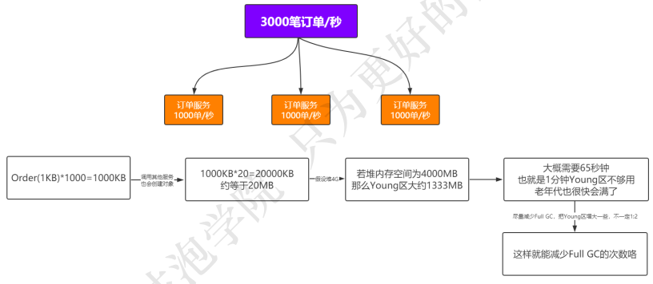


## JVM性能优化指南

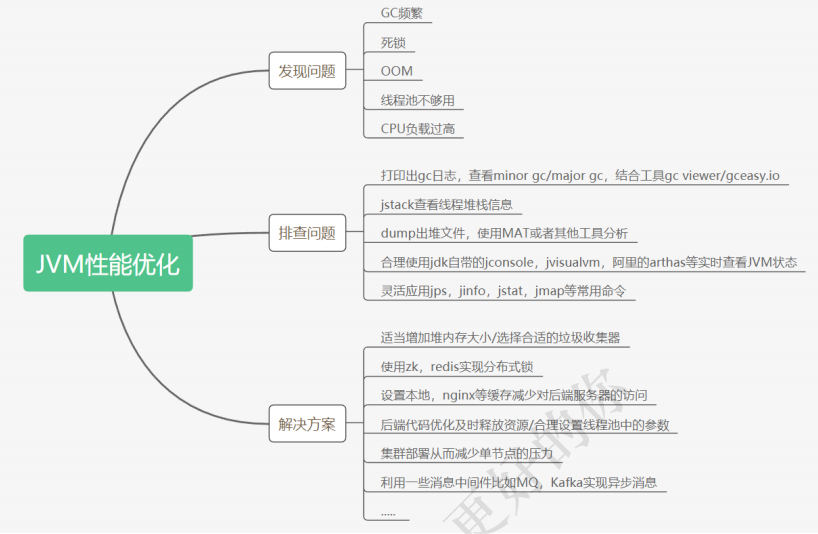


## **常见问题思考**


（1）内存泄漏与内存溢出的区别

内存泄漏：对象无法得到及时的回收，持续占用内存空间，从而造成内存空间的浪费。

内存溢出：内存泄漏到一定的程度就会导致内存溢出，但是内存溢出也有可能是大对象导致的。
（2）young gc会有stw吗？

不管什么 GC，都会有 stop-the-world，只是发生时间的长短。

（3）major gc和full gc的区别

major gc指的是老年代的gc，而full gc等于young+old+metaspace的gc。 

（4）G1与CMS的区别是什么

CMS 用于老年代的回收，而 G1 用于新生代和老年代的回收。

G1 使用了 Region 方式对堆内存进行了划分，且基于标记整理算法实现，整体减少了垃圾碎片的产生。

（5）什么是直接内存

直接内存是在java堆外的、直接向系统申请的内存空间。通常访问直接内存的速度会优于Java堆。因此出于性能的考

虑，读写频繁的场合可能会考虑使用直接内存。

（6）不可达的对象一定要被回收吗？

即使在可达性分析法中不可达的对象，也并非是“非死不可”的，这时候它们暂时处于“缓刑阶段”，要真正宣告一个对
象死亡，至少要经历两次标记过程；可达性分析法中不可达的对象被第一次标记并且进行一次筛选，筛选的条件是此
对象是否有必要执行 finalize 方法。当对象没有覆盖 finalize 方法，或 finalize 方法已经被虚拟机调用过时，虚拟机
将这两种情况视为没有必要执行。
被判定为需要执行的对象将会被放在一个队列中进行第二次标记，除非这个对象与引用链上的任何一个对象建立关
联，否则就会被真的回收。

（7）方法区中的无用类回收

方法区主要回收的是无用的类，那么如何判断一个类是无用的类的呢？
判定一个常量是否是“废弃常量”比较简单，而要判定一个类是否是“无用的类”的条件则相对苛刻许多。类需要同时满
足下面 3 个条件才能算是 “无用的类” ：
该类所有的实例都已经被回收，也就是 Java 堆中不存在该类的任何实例。
加载该类的 ClassLoader 已经被回收。
该类对应的 java.lang.Class 对象没有在任何地方被引用，无法在任何地方通过反射访问该类的方法。
虚拟机可以对满足上述 3 个条件的无用类进行回收，这里说的仅仅是“可以”，而并不是和对象一样不使用了就会必然
被回收。

（8）不同的引用

JDK1.2以后，Java对引用进行了扩充：强引用、软引用、弱引用和虚引用


参看文档

https://pan.baidu.com/s/1h82N5VyYd5fE1Sf_n822lQ

