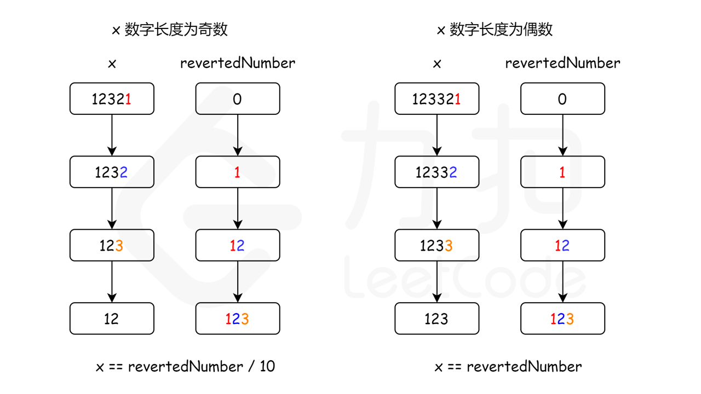
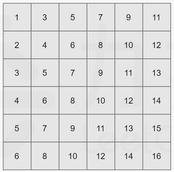
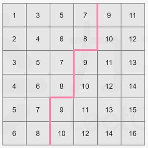
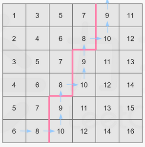

# leetcode算法


# 2020-06

## 2020-06-01 拥有最多糖果的孩子

https://leetcode-cn.com/problems/kids-with-the-greatest-number-of-candies/

给你一个数组 candies 和一个整数 extraCandies ，其中 candies[i] 代表第 i 个孩子拥有的糖果数目。

对每一个孩子，检查是否存在一种方案，将额外的 extraCandies 个糖果分配给孩子们之后，此孩子有 最多 的糖果。注意，允许有多个孩子同时拥有 最多 的糖果数目。

 

示例 1：

输入：candies = [2,3,5,1,3], extraCandies = 3
输出：[true,true,true,false,true] 
解释：
孩子 1 有 2 个糖果，如果他得到所有额外的糖果（3个），那么他总共有 5 个糖果，他将成为拥有最多糖果的孩子。
孩子 2 有 3 个糖果，如果他得到至少 2 个额外糖果，那么他将成为拥有最多糖果的孩子。
孩子 3 有 5 个糖果，他已经是拥有最多糖果的孩子。
孩子 4 有 1 个糖果，即使他得到所有额外的糖果，他也只有 4 个糖果，无法成为拥有糖果最多的孩子。
孩子 5 有 3 个糖果，如果他得到至少 2 个额外糖果，那么他将成为拥有最多糖果的孩子。

示例 2：

输入：candies = [4,2,1,1,2], extraCandies = 1
输出：[true,false,false,false,false] 
解释：只有 1 个额外糖果，所以不管额外糖果给谁，只有孩子 1 可以成为拥有糖果最多的孩子。

示例 3：

输入：candies = [12,1,12], extraCandies = 10
输出：[true,false,true]

 

提示：

    2 <= candies.length <= 100
    1 <= candies[i] <= 100
    1 <= extraCandies <= 50

方法一：枚举

思路

如果我们希望某个小朋友拥有的糖果最多，那么最优的方案当然是把额外的所有糖果都分给这个小朋友。因此，我们可以枚举每一个小朋友，并将额外的所有糖果都分给这个小朋友，然后再用 O(n)O(n)O(n) 的时间遍历其余的小朋友，就可以判断这个小朋友是否拥有最多的糖果。

上述方法的时间复杂度为 O(n2)O(n^2)O(n2)，然而我们可以将其优化为 O(n)O(n)O(n)。事实上，对于每一个小朋友，只要这个小朋友「拥有的糖果数目」加上「额外的糖果数目」大于等于所有小朋友拥有的糖果数目最大值，那么这个小朋友就可以拥有最多的糖果。

证明

设某个小朋友的糖果数为 xxx，其余小朋友拥有的糖果数目最大值为 yyy，额外的糖果数为 eee。这个小朋友可以拥有最多的糖果，当且仅当

```
x+e≥yx+e \geq y x+e≥y

由于 x+e≥xx+e \geq xx+e≥x 显然成立，那么我们有

x+e≥max⁡(x,y)x+e \geq \max(x, y) x+e≥max(x,y)

而 max⁡(x,y)\max(x, y)max(x,y) 就是所有小朋友拥有的糖果数目最大值。因此我们可以预处理出这个值，随后枚举每一个小朋友，只要这个小朋友「拥有的糖果数目」加上「额外的糖果数目」大于等于这个值，就可以满足要求。
```


```java
class Solution {
    public List<Boolean> kidsWithCandies(int[] candies, int extraCandies) {
        int n = candies.length;
        int maxCandies = 0;
        for (int i = 0; i < n; ++i) {
            maxCandies = Math.max(maxCandies, candies[i]);
        }
        List<Boolean> ret = new ArrayList<Boolean>();
        for (int i = 0; i < n; ++i) {
            ret.add(candies[i] + extraCandies >= maxCandies);
        }
        return ret;
    }
}
```

复杂度分析

假设小朋友的总数为 nnn。

    时间复杂度：我们首先使用 O(n)O(n)O(n) 的时间预处理出所有小朋友拥有的糖果数目最大值。对于每一个小朋友，我们需要 O(1)O(1)O(1) 的时间判断这个小朋友是否可以拥有最多的糖果，故渐进时间复杂度为 O(n)O(n)O(n)。
    
    空间复杂度：这里只用了常数个变量作为辅助空间，与 nnn 的规模无关，故渐进空间复杂度为 O(1)O(1)O(1)。


## 2020-06-02 剑指 Offer 64. 求1+2+…+n 

https://leetcode-cn.com/problems/qiu-12n-lcof/

求 1+2+...+n ，要求不能使用乘除法、for、while、if、else、switch、case等关键字及条件判断语句（A?B:C）。

 

示例 1：

输入: n = 3
输出: 6

示例 2：

输入: n = 9
输出: 45

 

限制：

    1 <= n <= 10000

首先我们梳理一下，这题要求我们不能使用乘除法、for、while、if、else、switch、case 等关键字及条件判断语句，因此我们手里能用的工具很少，列举出来发现只有加减法，赋值，位运算符以及逻辑运算符。
方法一：递归

思路和算法

试想一下如果不加限制地使用递归的方法来实现这道题，相信大家都能很容易地给出下面的实现

通常实现递归的时候我们都会利用条件判断语句来决定递归的出口，但由于题目的限制我们不能使用条件判断语句，那么我们是否能使用别的办法来确定递归出口呢？答案就是逻辑运算符的短路性质。

以逻辑运算符 && 为例，对于 A && B 这个表达式，如果 A 表达式返回 False\textit{False}False ，那么 A && B 已经确定为 False\textit{False}False ，此时不会去执行表达式 B。同理，对于逻辑运算符 ||， 对于 A || B 这个表达式，如果 A 表达式返回 True\textit{True}True ，那么 A || B 已经确定为 True\textit{True}True ，此时不会去执行表达式 B。

利用这一特性，我们可以将判断是否为递归的出口看作 A && B 表达式中的 A 部分，递归的主体函数看作 B 部分。如果不是递归出口，则返回 True\textit{True}True，并继续执行表达式 B 的部分，否则递归结束。当然，你也可以用逻辑运算符 || 给出类似的实现，这里我们只提供结合逻辑运算符 && 的递归实现。

```java
class Solution {
    public int sumNums(int n) {
        boolean flag = n > 0 && (n += sumNums(n - 1)) > 0;
        return n;
    }
}
```

复杂度分析

    时间复杂度：O(n)O(n)O(n)。递归函数递归 nnn 次，每次递归中计算时间复杂度为 O(1)O(1)O(1)，因此总时间复杂度为 O(n)O(n)O(n)。
    空间复杂度：O(n)O(n)O(n)。递归函数的空间复杂度取决于递归调用栈的深度，这里递归函数调用栈深度为 O(n)O(n)O(n)，因此空间复杂度为 O(n)O(n)O(n)。

方法二：快速乘

思路和算法

```
考虑 A 和 B 两数相乘的时候我们如何利用加法和位运算来模拟，其实就是将 B 二进制展开，如果 B 的二进制表示下第 iii 位为 1，那么这一位对最后结果的贡献就是 A∗(1<<i)A*(1<<i)A∗(1<<i) ，即 A<<iA<<iA<<i。我们遍历 B 二进制展开下的每一位，将所有贡献累加起来就是最后的答案，这个方法也被称作「俄罗斯农民乘法」，感兴趣的读者可以自行网上搜索相关资料。这个方法经常被用于两数相乘取模的场景，如果两数相乘已经超过数据范围，但取模后不会超过，我们就可以利用这个方法来拆位取模计算贡献，保证每次运算都在数据范围内。

回到本题，由等差数列求和公式我们可以知道 1+2+⋯+n1 + 2 + \cdots + n1+2+⋯+n 等价于 n(n+1)2\frac{n(n+1)}{2}2n(n+1)，对于除以 222 我们可以用右移操作符来模拟，那么等式变成了 n(n+1)>>1n(n+1)>>1n(n+1)>>1，剩下不符合题目要求的部分即为 n(n+1)n(n+1)n(n+1)，根据上文提及的快速乘，我们可以将两个数相乘用加法和位运算来模拟，但是可以看到上面的 C++ 实现里我们还是需要循环语句，有没有办法去掉这个循环语句呢？答案是有的，那就是自己手动展开，因为题目数据范围 nnn 为 [1,10000][1,10000][1,10000]，所以 nnn 二进制展开最多不会超过 141414 位，我们手动展开 141414 层代替循环即可，至此满足了题目的要求，具体实现可以参考下面给出的代码。
```


```java
class Solution {
    public int sumNums(int n) {
        int ans = 0, A = n, B = n + 1;
        boolean flag;

        flag = ((B & 1) > 0) && (ans += A) > 0;
        A <<= 1;
        B >>= 1;

        flag = ((B & 1) > 0) && (ans += A) > 0;
        A <<= 1;
        B >>= 1;

        flag = ((B & 1) > 0) && (ans += A) > 0;
        A <<= 1;
        B >>= 1;

        flag = ((B & 1) > 0) && (ans += A) > 0;
        A <<= 1;
        B >>= 1;

        flag = ((B & 1) > 0) && (ans += A) > 0;
        A <<= 1;
        B >>= 1;

        flag = ((B & 1) > 0) && (ans += A) > 0;
        A <<= 1;
        B >>= 1;

        flag = ((B & 1) > 0) && (ans += A) > 0;
        A <<= 1;
        B >>= 1;

        flag = ((B & 1) > 0) && (ans += A) > 0;
        A <<= 1;
        B >>= 1;

        flag = ((B & 1) > 0) && (ans += A) > 0;
        A <<= 1;
        B >>= 1;

        flag = ((B & 1) > 0) && (ans += A) > 0;
        A <<= 1;
        B >>= 1;

        flag = ((B & 1) > 0) && (ans += A) > 0;
        A <<= 1;
        B >>= 1;

        flag = ((B & 1) > 0) && (ans += A) > 0;
        A <<= 1;
        B >>= 1;

        flag = ((B & 1) > 0) && (ans += A) > 0;
        A <<= 1;
        B >>= 1;

        flag = ((B & 1) > 0) && (ans += A) > 0;
        A <<= 1;
        B >>= 1;

        return ans >> 1;
    }
}
```

复杂度分析

    时间复杂度：O(log⁡n)O(\log n)O(logn)。快速乘需要的时间复杂度为 O(log⁡n)O(\log n)O(logn)。
    空间复杂度：O(1)O(1)O(1)。只需要常数空间存放若干变量。


## 2020-06-03 新21点

https://leetcode-cn.com/problems/new-21-game/

爱丽丝参与一个大致基于纸牌游戏 “21点” 规则的游戏，描述如下：

爱丽丝以 0 分开始，并在她的得分少于 K 分时抽取数字。 抽取时，她从 [1, W] 的范围中随机获得一个整数作为分数进行累计，其中 W 是整数。 每次抽取都是独立的，其结果具有相同的概率。

当爱丽丝获得不少于 K 分时，她就停止抽取数字。 爱丽丝的分数不超过 N 的概率是多少？

 

示例 1：

输入：N = 10, K = 1, W = 10
输出：1.00000
说明：爱丽丝得到一张卡，然后停止。

示例 2：

输入：N = 6, K = 1, W = 10
输出：0.60000
说明：爱丽丝得到一张卡，然后停止。
在 W = 10 的 6 种可能下，她的得分不超过 N = 6 分。

示例 3：

输入：N = 21, K = 17, W = 10
输出：0.73278

 

提示：

    0 <= K <= N <= 10000
    1 <= W <= 10000
    如果答案与正确答案的误差不超过 10^-5，则该答案将被视为正确答案通过。
    此问题的判断限制时间已经减少。

方法一：动态规划

爱丽丝获胜的概率只和下一轮开始前的得分有关，因此根据得分计算概率。

```
令 dp[x]dp[x]dp[x] 表示从得分为 xxx 的情况开始游戏并且获胜的概率，目标是求 dp[0]dp[0]dp[0] 的值。

根据规则，当分数达到或超过 KKK 时游戏结束，游戏结束时，如果分数不超过 NNN 则获胜，如果分数超过 NNN 则失败。因此当 K≤x≤min⁡(N,K+W−1)K\leq x\leq \min(N, K+W-1)K≤x≤min(N,K+W−1) 时有 dp[x]=1dp[x]=1dp[x]=1，当 x>min⁡(N,K+W−1)x>\min(N, K+W-1)x>min(N,K+W−1) 时有 dp[x]=0dp[x]=0dp[x]=0。
```


    为什么分界线是 min⁡(N,K+W−1)\min(N, K+W-1)min(N,K+W−1)？首先，只有在分数不超过 NNN 时才算获胜；其次，可以达到的最大分数为 K+W−1K+W-1K+W−1，即在最后一次抽取数字之前的分数为 K−1K-1K−1，并且抽到了 WWW。

```
当 0≤x<K0\leq x < K0≤x<K 时，如何计算 dp[x]dp[x]dp[x] 的值？注意到每次在范围 [1,W][1, W][1,W] 内随机抽取一个整数，且每个整数被抽取到的概率相等，因此可以得到如下状态转移方程：

dp[x]=dp[x+1]+dp[x+2]+⋯+dp[x+W]Wdp[x]=\frac{dp[x+1]+dp[x+2]+\cdots+dp[x+W]}{W} dp[x]=Wdp[x+1]+dp[x+2]+⋯+dp[x+W]

根据状态转移方程，可以实现如下简单的动态规划：
```


```java
class Solution {
    public double new21Game(int N, int K, int W) {
        if (K == 0) {
            return 1.0;
        }
        double[] dp = new double[K + W];
        for (int i = K; i <= N && i < K + W; i++) {
            dp[i] = 1.0;
        }
        for (int i = K - 1; i >= 0; i--) {
            for (int j = 1; j <= W; j++) {
                dp[i] += dp[i + j] / W;
            }
        }
        return dp[0];
    }
}
```

```
上述解法的时间复杂度是 O(N+KW)O(N+KW)O(N+KW)，会超出时间限制，因此需要优化。

考虑对 dpdpdp 的相邻项计算差分，有如下结果：

dp[x]−dp[x+1]=dp[x+1]−dp[x+W+1]Wdp[x] - dp[x+1]=\frac{dp[x+1] - dp[x+W+1]}{W} dp[x]−dp[x+1]=Wdp[x+1]−dp[x+W+1]

其中 0≤x<K−10\leq x<K-10≤x<K−1。

因此可以得到新的状态转移方程：

dp[x]=dp[x+1]−dp[x+W+1]−dp[x+1]Wdp[x]=dp[x+1]-\frac{dp[x+W+1]-dp[x+1]}{W} dp[x]=dp[x+1]−Wdp[x+W+1]−dp[x+1]

其中 0≤x<K−10\leq x<K-10≤x<K−1。

注意到上述状态转移方程中 xxx 的取值范围，当 x=K−1x=K-1x=K−1 时不适用。因此对于 dp[K−1]dp[K-1]dp[K−1] 的值，需要通过

dp[K−1]=dp[K]+dp[K+1]+⋯+dp[K+W−1]Wdp[K-1]=\frac{dp[K]+dp[K+1]+\cdots+dp[K+W-1]}{W} dp[K−1]=Wdp[K]+dp[K+1]+⋯+dp[K+W−1]

计算得到。注意到只有当 K≤x≤min⁡(N,K+W−1)K\leq x\leq \min(N, K+W-1)K≤x≤min(N,K+W−1) 时才有 dp[x]=1dp[x]=1dp[x]=1，因此

dp[K−1]=min⁡(N,K+W−1)−K+1W=min⁡(N−K+1,W)Wdp[K-1]=\frac{\min(N, K+W-1) - K + 1}{W} = \frac{\min(N-K+1,W)}{W} dp[K−1]=Wmin(N,K+W−1)−K+1=Wmin(N−K+1,W)

可在 O(1)O(1)O(1) 时间内计算得到 dp[K−1]dp[K-1]dp[K−1] 的值。

对于 dp[K−2]dp[K-2]dp[K−2] 到 dp[0]dp[0]dp[0] 的值，则可通过新的状态转移方程得到。
```


```java
class Solution {
    public double new21Game(int N, int K, int W) {
        if (K == 0) {
            return 1.0;
        }
        double[] dp = new double[K + W];
        for (int i = K; i <= N && i < K + W; i++) {
            dp[i] = 1.0;
        }
        dp[K - 1] = 1.0 * Math.min(N - K + 1, W) / W;
        for (int i = K - 2; i >= 0; i--) {
            dp[i] = dp[i + 1] - (dp[i + W + 1] - dp[i + 1]) / W;
        }
        return dp[0];
    }
}
```

复杂度分析

    时间复杂度：O(min⁡(N,K+W))O(\min(N, K+W))O(min(N,K+W))。即需要计算的 dpdpdp 值的数量 min⁡(N,K+W−1)\min(N, K+W-1)min(N,K+W−1)。
    
    空间复杂度：O(K+W)O(K+W)O(K+W)。创建了一个长度为 K+WK+WK+W 的数组 dpdpdp。


## 2020-06-08 等式方程的可满足性

https://leetcode-cn.com/problems/satisfiability-of-equality-equations/

题目：

给定一个由表示变量之间关系的字符串方程组成的数组，每个字符串方程 equations[i] 的长度为 4，并采用两种不同的形式之一："a==b" 或 "a!=b"。在这里，a 和 b 是小写字母（不一定不同），表示单字母变量名。

只有当可以将整数分配给变量名，以便满足所有给定的方程时才返回 true，否则返回 false。 

 

示例 1：

输入：["a==b","b!=a"]
输出：false
解释：如果我们指定，a = 1 且 b = 1，那么可以满足第一个方程，但无法满足第二个方程。没有办法分配变量同时满足这两个方程。

示例 2：

输入：["b==a","a==b"]
输出：true
解释：我们可以指定 a = 1 且 b = 1 以满足满足这两个方程。

示例 3：

输入：["a==b","b==c","a==c"]
输出：true

示例 4：

输入：["a==b","b!=c","c==a"]
输出：false

示例 5：

输入：["c==c","b==d","x!=z"]
输出：true

 

提示：

    1 <= equations.length <= 500
    equations[i].length == 4
    equations[i][0] 和 equations[i][3] 是小写字母
    equations[i][1] 要么是 '='，要么是 '!'
    equations[i][2] 是 '='


方法一：并查集

我们可以将每一个变量看作图中的一个节点，把相等的关系 == 看作是连接两个节点的边，那么由于表示相等关系的等式方程具有传递性，即如果 a==b 和 b==c 成立，则 a==c 也成立。也就是说，所有相等的变量属于同一个连通分量。因此，我们可以使用并查集来维护这种连通分量的关系。

首先遍历所有的等式，构造并查集。同一个等式中的两个变量属于同一个连通分量，因此将两个变量进行合并。

然后遍历所有的不等式。同一个不等式中的两个变量不能属于同一个连通分量，因此对两个变量分别查找其所在的连通分量，如果两个变量在同一个连通分量中，则产生矛盾，返回 false。

如果遍历完所有的不等式没有发现矛盾，则返回 true。

fig1

具体实现方面，使用一个数组 parent 存储每个变量的连通分量信息，其中的每个元素表示当前变量所在的连通分量的父节点信息，如果父节点是自身，说明该变量为所在的连通分量的根节点。一开始所有变量的父节点都是它们自身。对于合并操作，我们将第一个变量的根节点的父节点指向第二个变量的根节点；对于查找操作，我们沿着当前变量的父节点一路向上查找，直到找到根节点。


```java
class Solution {
    public boolean equationsPossible(String[] equations) {

        int[] parent = new int[26];
        for (int i = 0; i < 26; i++) {
            parent[i] = i;
        }
        for (String str : equations) {
            if (str.charAt(1) == '=') {
                int index1 = str.charAt(0) - 'a';
                int index2 = str.charAt(3) - 'a';
                union(parent, index1, index2);
            }
        }
        for (String str : equations) {
            if (str.charAt(1) == '!') {
                int index1 = str.charAt(0) - 'a';
                int index2 = str.charAt(3) - 'a';
                if (find(parent, index1) == find(parent, index2)) {
                    return false;
                }
            }
        }
        return true;
    }

    public void union(int[] parent, int index1, int index2) {
        parent[find(parent, index1)] = find(parent, index2);
    }

    public int find(int[] parent, int index) {
        while (parent[index] != index) {
            parent[index] = parent[parent[index]];
            index = parent[index];
        }
        return index;
    }
}
```


## 2020-06-09 把数字翻译成字符串

https://leetcode-cn.com/problems/ba-shu-zi-fan-yi-cheng-zi-fu-chuan-lcof/

题目：

给定一个数字，我们按照如下规则把它翻译为字符串：0 翻译成 “a” ，1 翻译成 “b”，……，11 翻译成 “l”，……，25 翻译成 “z”。一个数字可能有多个翻译。请编程实现一个函数，用来计算一个数字有多少种不同的翻译方法。

 

示例 1:

输入: 12258
输出: 5
解释: 12258有5种不同的翻译，分别是"bccfi", "bwfi", "bczi", "mcfi"和"mzi"

 

方法一：动态规划

思路和算法

首先我们来通过一个例子理解一下这里「翻译」的过程：我们来尝试翻译「140214021402」。

分成两种情况：

    首先我们可以把每一位单独翻译，即 [1,4,0,2][1, 4, 0, 2][1,4,0,2]，翻译的结果是 beac
    然后我们考虑组合某些连续的两位：
        [14,0,2][14, 0, 2][14,0,2]，翻译的结果是 oac。
        [1,40,2][1, 40, 2][1,40,2]，这种情况是不合法的，因为 404040 不能翻译成任何字母。
        [1,4,02][1, 4, 02][1,4,02]，这种情况也是不合法的，含有前导零的两位数不在题目规定的翻译规则中，那么 [14,02][14, 02][14,02] 显然也是不合法的。

那么我们可以归纳出翻译的规则，字符串的第 iii 位置：

    可以单独作为一位来翻译
    如果第 i−1i - 1i−1 位和第 iii 位组成的数字在 101010 到 252525 之间，可以把这两位连起来翻译

到这里，我们发现它和「198. 打家劫舍」非常相似。我们可以用 f(i)f(i)f(i) 表示以第 iii 位结尾的前缀串翻译的方案数，考虑第 iii 位单独翻译和与前一位连接起来再翻译对 f(i)f(i)f(i) 的贡献。单独翻译对 f(i)f(i)f(i) 的贡献为 f(i−1)f(i - 1)f(i−1)；如果第 i−1i - 1i−1 位存在，并且第 i−1i - 1i−1 位和第 iii 位形成的数字 xxx 满足 10≤x≤2510 \leq x \leq 2510≤x≤25，那么就可以把第 i−1i - 1i−1 位和第 iii 位连起来一起翻译，对 f(i)f(i)f(i) 的贡献为 f(i−2)f(i - 2)f(i−2)，否则为 0。我们可以列出这样的动态规划转移方程：

f(i)=f(i−1)+f(i−2)[i−1≥0,10≤x≤25]f(i) = f(i - 1) + f(i - 2)[i - 1 \geq 0, 10 \leq x \leq 25] f(i)=f(i−1)+f(i−2)[i−1≥0,10≤x≤25]

边界条件是 f(−1)=0f(-1) = 0f(−1)=0，f(0)=1f(0) = 1f(0)=1。方程中 [c][c][c] 的意思是 ccc 为真的时候 [c]=1[c] = 1[c]=1，否则 [c]=0[c] = 0[c]=0。

有了这个方程我们不难给出一个时间复杂度为 O(n)O(n)O(n)，空间复杂度为 O(n)O(n)O(n) 的实现。考虑优化空间复杂度：这里的 f(i)f(i)f(i) 只和它的前两项 f(i−1)f(i - 1)f(i−1) 和 f(i−2)f(i - 2)f(i−2) 相关，我们可以运用「滚动数组」思想把 fff 数组压缩成三个变量，这样空间复杂度就变成了 O(1)O(1)O(1)。


```java
class Solution {
    public int translateNum(int num) {
        String src = String.valueOf(num);
        int p = 0, q = 0, r = 1;
        for (int i = 0; i < src.length(); ++i) {
            p = q;
            q = r;
            r = 0;
            r += q;
            if (i == 0) {
                continue;
            }
            String pre = src.substring(i - 1, i + 1);
            if (pre.compareTo("25") <= 0 && pre.compareTo("10") >= 0) {
                r += p;
            }
        }
        return r;
    }
}
```


## 2020-06-10 回文数

https://leetcode-cn.com/problems/palindrome-number/

题目：

判断一个整数是否是回文数。回文数是指正序（从左向右）和倒序（从右向左）读都是一样的整数。

示例 1:

输入: 121
输出: true

示例 2:

输入: -121
输出: false
解释: 从左向右读, 为 -121 。 从右向左读, 为 121- 。因此它不是一个回文数。

示例 3:

输入: 10
输出: false
解释: 从右向左读, 为 01 。因此它不是一个回文数。

进阶:

你能不将整数转为字符串来解决这个问题吗？


方法一：字符串

```java
class Solution {
    public boolean isPalindrome(int x) {
        if (x > 0 && x < 10) {
          return true;
        }
        String ss = String.valueOf(x);
        int len = ss.length();
        for (int i = 0; i < ss.length() / 2 ; i ++) {
            if(ss.charAt(i) != ss.charAt(len - 1 - i)) {
                return false;
            }
        }
        return true;
    }
}

```


方法二：反转一半数字

思路

映入脑海的第一个想法是将数字转换为字符串，并检查字符串是否为回文。但是，这需要额外的非常量空间来创建问题描述中所不允许的字符串。

第二个想法是将数字本身反转，然后将反转后的数字与原始数字进行比较，如果它们是相同的，那么这个数字就是回文。
但是，如果反转后的数字大于 int.MAX\text{int.MAX}int.MAX，我们将遇到整数溢出问题。

按照第二个想法，为了避免数字反转可能导致的溢出问题，为什么不考虑只反转 int\text{int}int 数字的一半？毕竟，如果该数字是回文，其后半部分反转后应该与原始数字的前半部分相同。

例如，输入 1221，我们可以将数字 “1221” 的后半部分从 “21” 反转为 “12”，并将其与前半部分 “12” 进行比较，因为二者相同，我们得知数字 1221 是回文。

算法

首先，我们应该处理一些临界情况。所有负数都不可能是回文，例如：-123 不是回文，因为 - 不等于 3。所以我们可以对所有负数返回 false。除了 0 以外，所有个位是 0 的数字不可能是回文，因为最高位不等于 0。所以我们可以对所有大于 0 且个位是 0 的数字返回 false。

现在，让我们来考虑如何反转后半部分的数字。

对于数字 1221，如果执行 1221 % 10，我们将得到最后一位数字 1，要得到倒数第二位数字，我们可以先通过除以 10 把最后一位数字从 1221 中移除，1221 / 10 = 122，再求出上一步结果除以 10 的余数，122 % 10 = 2，就可以得到倒数第二位数字。如果我们把最后一位数字乘以 10，再加上倒数第二位数字，1 * 10 + 2 = 12，就得到了我们想要的反转后的数字。如果继续这个过程，我们将得到更多位数的反转数字。

现在的问题是，我们如何知道反转数字的位数已经达到原始数字位数的一半？

由于整个过程我们不断将原始数字除以 10，然后给反转后的数字乘上 10，所以，当原始数字小于或等于反转后的数字时，就意味着我们已经处理了一半位数的数字了。



```java
class Solution {
    public boolean isPalindrome(int x) {
        // 特殊情况：
        // 如上所述，当 x < 0 时，x 不是回文数。
        // 同样地，如果数字的最后一位是 0，为了使该数字为回文，
        // 则其第一位数字也应该是 0
        // 只有 0 满足这一属性
        if (x < 0 || (x % 10 == 0 && x != 0)) {
            return false;
        }

        int revertedNumber = 0;
        while (x > revertedNumber) {
            revertedNumber = revertedNumber * 10 + x % 10;
            x /= 10;
        }

        // 当数字长度为奇数时，我们可以通过 revertedNumber/10 去除处于中位的数字。
        // 例如，当输入为 12321 时，在 while 循环的末尾我们可以得到 x = 12，revertedNumber = 123，
        // 由于处于中位的数字不影响回文（它总是与自己相等），所以我们可以简单地将其去除。
        return x == revertedNumber || x == revertedNumber / 10;
    }
}
```


## 2020-06-11 每日温度

https://leetcode-cn.com/problems/daily-temperatures/

题目:

根据每日 气温 列表，请重新生成一个列表，对应位置的输出是需要再等待多久温度才会升高超过该日的天数。如果之后都不会升高，请在该位置用 0 来代替。

例如，给定一个列表 temperatures = [73, 74, 75, 71, 69, 72, 76, 73]，你的输出应该是 [1, 1, 4, 2, 1, 1, 0, 0]。

提示：气温 列表长度的范围是 [1, 30000]。每个气温的值的均为华氏度，都是在 [30, 100] 范围内的整数。


```java
public class Solution {

    public static void main(String[] args) {

        int[] array = new int[]{73, 74, 75, 71, 69, 72, 76, 73};
        int[] result = new Solution().dailyTemperatures(array);
        System.out.println(Arrays.toString(result));
    }

    public int[] dailyTemperatures(int[] T) {

        int len = T.length;
        if (len == 1) {
            return new int[]{0};
        }
        int[] result = new int[len];
        for (int a = 0; a < len; a++) {
            int up = 0;
            boolean find = false;
            for (int b = a + 1; b < len; b++) {
                if (T[b] > T[a]) {
                    up++;
                    find = true;
                    break;
                }
                up++;
            }
            if (!find) {
                up = 0;
            }
            result[a] = up;
        }
        return result;
    }
}
```


方法一：暴力

对于温度列表中的每个元素 T[i]，需要找到最小的下标 j，使得 i < j 且 T[i] < T[j]。

由于温度范围在 [30, 100] 之内，因此可以维护一个数组 next 记录每个温度第一次出现的下标。数组 next 中的元素初始化为无穷大，在遍历温度列表的过程中更新 next 的值。

反向遍历温度列表。对于每个元素 T[i]，在数组 next 中找到从 T[i] + 1 到 100 中每个温度第一次出现的下标，将其中的最小下标记为 warmerIndex，则 warmerIndex 为下一次温度比当天高的下标。如果 warmerIndex 不为无穷大，则 warmerIndex - i 即为下一次温度比当天高的等待天数，最后令 next[T[i]] = i。

为什么上述做法可以保证正确呢？因为遍历温度列表的方向是反向，当遍历到元素 T[i] 时，只有 T[i] 后面的元素被访问过，即对于任意 t，当 next[t] 不为无穷大时，一定存在 j 使得 T[j] == t 且 i < j。又由于遍历到温度列表中的每个元素时都会更新数组 next 中的对应温度的元素值，因此对于任意 t，当 next[t] 不为无穷大时，令 j = next[t]，则 j 是满足 T[j] == t 且 i < j 的最小下标。

```java
class Solution {
    public int[] dailyTemperatures(int[] T) {
        int length = T.length;
        int[] ans = new int[length];
        int[] next = new int[101];
        Arrays.fill(next, Integer.MAX_VALUE);
        for (int i = length - 1; i >= 0; --i) {
            int warmerIndex = Integer.MAX_VALUE;
            for (int t = T[i] + 1; t <= 100; ++t) {
                if (next[t] < warmerIndex) {
                    warmerIndex = next[t];
                }
            }
            if (warmerIndex < Integer.MAX_VALUE) {
                ans[i] = warmerIndex - i;
            }
            next[T[i]] = i;
        }
        return ans;
    }
}
```


复杂度分析

    时间复杂度：O(nm)O(nm)O(nm)，其中 nnn 是温度列表的长度，mmm 是数组 next 的长度，在本题中温度不超过 100100100，所以 mmm 的值为 100100100。反向遍历温度列表一遍，对于温度列表中的每个值，都要遍历数组 next 一遍。
    
    空间复杂度：O(m)O(m)O(m)，其中 mmm 是数组 next 的长度。除了返回值以外，需要维护长度为 mmm 的数组 next 记录每个温度第一次出现的下标位置。

方法二：单调栈

可以维护一个存储下标的单调栈，从栈底到栈顶的下标对应的温度列表中的温度依次递减。如果一个下标在单调栈里，则表示尚未找到下一次温度更高的下标。

正向遍历温度列表。对于温度列表中的每个元素 T[i]，如果栈为空，则直接将 i 进栈，如果栈不为空，则比较栈顶元素 prevIndex 对应的温度 T[prevIndex] 和当前温度 T[i]，如果 T[i] > T[prevIndex]，则将 prevIndex 移除，并将 prevIndex 对应的等待天数赋为 i - prevIndex，重复上述操作直到栈为空或者栈顶元素对应的温度小于等于当前温度，然后将 i 进栈。

为什么可以在弹栈的时候更新 ans[prevIndex] 呢？因为在这种情况下，即将进栈的 i 对应的 T[i] 一定是 T[prevIndex] 右边第一个比它大的元素，试想如果 prevIndex 和 i 有比它大的元素，假设下标为 j，那么 prevIndex 一定会在下标 j 的那一轮被弹掉。

由于单调栈满足从栈底到栈顶元素对应的温度递减，因此每次有元素进栈时，会将温度更低的元素全部移除，并更新出栈元素对应的等待天数，这样可以确保等待天数一定是最小的。

以下用一个具体的例子帮助读者理解单调栈。对于温度列表 [73,74,75,71,69,72,76,73][73,74,75,71,69,72,76,73][73,74,75,71,69,72,76,73]，单调栈 stack\textit{stack}stack 的初始状态为空，答案 ans\textit{ans}ans 的初始状态是 [0,0,0,0,0,0,0,0][0,0,0,0,0,0,0,0][0,0,0,0,0,0,0,0]，按照以下步骤更新单调栈和答案，其中单调栈内的元素都是下标，括号内的数字表示下标在温度列表中对应的温度。

    当 i=0i=0i=0 时，单调栈为空，因此将 000 进栈。
    
        stack=[0(73)]\textit{stack}=[0(73)]stack=[0(73)]
    
        ans=[0,0,0,0,0,0,0,0]\textit{ans}=[0,0,0,0,0,0,0,0]ans=[0,0,0,0,0,0,0,0]
    
    当 i=1i=1i=1 时，由于 747474 大于 737373，因此移除栈顶元素 000，赋值 ans[0]:=1−0ans[0]:=1-0ans[0]:=1−0，将 111 进栈。
    
        stack=[1(74)]\textit{stack}=[1(74)]stack=[1(74)]
    
        ans=[1,0,0,0,0,0,0,0]\textit{ans}=[1,0,0,0,0,0,0,0]ans=[1,0,0,0,0,0,0,0]
    
    当 i=2i=2i=2 时，由于 757575 大于 747474，因此移除栈顶元素 111，赋值 ans[1]:=2−1ans[1]:=2-1ans[1]:=2−1，将 222 进栈。
    
        stack=[2(75)]\textit{stack}=[2(75)]stack=[2(75)]
    
        ans=[1,1,0,0,0,0,0,0]\textit{ans}=[1,1,0,0,0,0,0,0]ans=[1,1,0,0,0,0,0,0]
    
    当 i=3i=3i=3 时，由于 717171 小于 757575，因此将 333 进栈。
    
        stack=[2(75),3(71)]\textit{stack}=[2(75),3(71)]stack=[2(75),3(71)]
    
        ans=[1,1,0,0,0,0,0,0]\textit{ans}=[1,1,0,0,0,0,0,0]ans=[1,1,0,0,0,0,0,0]
    
    当 i=4i=4i=4 时，由于 696969 小于 717171，因此将 444 进栈。
    
        stack=[2(75),3(71),4(69)]\textit{stack}=[2(75),3(71),4(69)]stack=[2(75),3(71),4(69)]
    
        ans=[1,1,0,0,0,0,0,0]\textit{ans}=[1,1,0,0,0,0,0,0]ans=[1,1,0,0,0,0,0,0]
    
    当 i=5i=5i=5 时，由于 727272 大于 696969 和 717171，因此依次移除栈顶元素 444 和 333，赋值 ans[4]:=5−4ans[4]:=5-4ans[4]:=5−4 和 ans[3]:=5−3ans[3]:=5-3ans[3]:=5−3，将 555 进栈。
    
        stack=[2(75),5(72)]\textit{stack}=[2(75),5(72)]stack=[2(75),5(72)]
    
        ans=[1,1,0,2,1,0,0,0]\textit{ans}=[1,1,0,2,1,0,0,0]ans=[1,1,0,2,1,0,0,0]
    
    当 i=6i=6i=6 时，由于 767676 大于 727272 和 757575，因此依次移除栈顶元素 555 和 222，赋值 ans[5]:=6−5ans[5]:=6-5ans[5]:=6−5 和 ans[2]:=6−2ans[2]:=6-2ans[2]:=6−2，将 666 进栈。
    
        stack=[6(76)]\textit{stack}=[6(76)]stack=[6(76)]
    
        ans=[1,1,4,2,1,1,0,0]\textit{ans}=[1,1,4,2,1,1,0,0]ans=[1,1,4,2,1,1,0,0]
    
    当 i=7i=7i=7 时，由于 737373 小于 767676，因此将 777 进栈。
    
        stack=[6(76),7(73)]\textit{stack}=[6(76),7(73)]stack=[6(76),7(73)]
    
        ans=[1,1,4,2,1,1,0,0]\textit{ans}=[1,1,4,2,1,1,0,0]ans=[1,1,4,2,1,1,0,0]

```java
class Solution {
    public int[] dailyTemperatures(int[] T) {
        int length = T.length;
        int[] ans = new int[length];
        Deque<Integer> stack = new LinkedList<Integer>();
        for (int i = 0; i < length; i++) {
            int temperature = T[i];
            while (!stack.isEmpty() && temperature > T[stack.peek()]) {
                int prevIndex = stack.pop();
                ans[prevIndex] = i - prevIndex;
            }
            stack.push(i);
        }
        return ans;
    }
}
```


复杂度分析

    时间复杂度：O(n)O(n)O(n)，其中 nnn 是温度列表的长度。正向遍历温度列表一遍，对于温度列表中的每个下标，最多有一次进栈和出栈的操作。
    
    空间复杂度：O(n)O(n)O(n)，其中 nnn 是温度列表的长度。需要维护一个单调栈存储温度列表中的下标。


## 2020-06-12 三数之和

https://leetcode-cn.com/problems/3sum/


题目：

给你一个包含 n 个整数的数组 nums，判断 nums 中是否存在三个元素 a，b，c ，使得 a + b + c = 0 ？请你找出所有满足条件且不重复的三元组。

注意：答案中不可以包含重复的三元组。

 

示例：

给定数组 nums = [-1, 0, 1, 2, -1, -4]，

满足要求的三元组集合为：
[
  [-1, 0, 1],
  [-1, -1, 2]
]


方法一：排序 + 双指针


题目中要求找到所有「不重复」且和为 000 的三元组，这个「不重复」的要求使得我们无法简单地使用三重循环枚举所有的三元组。这是因为在最坏的情况下，数组中的元素全部为 000，即

[0, 0, 0, 0, 0, ..., 0, 0, 0]

任意一个三元组的和都为 000。如果我们直接使用三重循环枚举三元组，会得到 O(N3)O(N^3)O(N3) 个满足题目要求的三元组（其中 NNN 是数组的长度）时间复杂度至少为 O(N3)O(N^3)O(N3)。在这之后，我们还需要使用哈希表进行去重操作，得到不包含重复三元组的最终答案，又消耗了大量的空间。这个做法的时间复杂度和空间复杂度都很高，因此我们要换一种思路来考虑这个问题。

「不重复」的本质是什么？我们保持三重循环的大框架不变，只需要保证：

    第二重循环枚举到的元素不小于当前第一重循环枚举到的元素；
    
    第三重循环枚举到的元素不小于当前第二重循环枚举到的元素。

也就是说，我们枚举的三元组 (a,b,c)(a, b, c)(a,b,c) 满足 a≤b≤ca \leq b \leq ca≤b≤c，保证了只有 (a,b,c)(a, b, c)(a,b,c) 这个顺序会被枚举到，而 (b,a,c)(b, a, c)(b,a,c)、(c,b,a)(c, b, a)(c,b,a) 等等这些不会，这样就减少了重复。要实现这一点，我们可以将数组中的元素从小到大进行排序，随后使用普通的三重循环就可以满足上面的要求。

同时，对于每一重循环而言，相邻两次枚举的元素不能相同，否则也会造成重复。举个例子，如果排完序的数组为

[0, 1, 2, 2, 2, 3]
 ^  ^  ^

我们使用三重循环枚举到的第一个三元组为 (0,1,2)(0, 1, 2)(0,1,2)，如果第三重循环继续枚举下一个元素，那么仍然是三元组 (0,1,2)(0, 1, 2)(0,1,2)，产生了重复。因此我们需要将第三重循环「跳到」下一个不相同的元素，即数组中的最后一个元素 333，枚举三元组 (0,1,3)(0, 1, 3)(0,1,3)。

下面给出了改进的方法的伪代码实现：

```java
nums.sort()
for first = 0 .. n-1
    // 只有和上一次枚举的元素不相同，我们才会进行枚举
    if first == 0 or nums[first] != nums[first-1] then
        for second = first+1 .. n-1
            if second == first+1 or nums[second] != nums[second-1] then
                for third = second+1 .. n-1
                    if third == second+1 or nums[third] != nums[third-1] then
                        // 判断是否有 a+b+c==0
                        check(first, second, third)
```


这种方法的时间复杂度仍然为 O(N3)O(N^3)O(N3)，毕竟我们还是没有跳出三重循环的大框架。然而它是很容易继续优化的，可以发现，如果我们固定了前两重循环枚举到的元素 aaa 和 bbb，那么只有唯一的 ccc 满足 a+b+c=0a+b+c=0a+b+c=0。当第二重循环往后枚举一个元素 b′b'b′ 时，由于 b′>bb' > bb′>b，那么满足 a+b′+c′=0a+b'+c'=0a+b′+c′=0 的 c′c'c′ 一定有 c′<cc' < cc′<c，即 c′c'c′ 在数组中一定出现在 ccc 的左侧。也就是说，我们可以从小到大枚举 bbb，同时从大到小枚举 ccc，即第二重循环和第三重循环实际上是并列的关系。

有了这样的发现，我们就可以保持第二重循环不变，而将第三重循环变成一个从数组最右端开始向左移动的指针，从而得到下面的伪代码：

```java
nums.sort()
for first = 0 .. n-1
    if first == 0 or nums[first] != nums[first-1] then
        // 第三重循环对应的指针
        third = n-1
        for second = first+1 .. n-1
            if second == first+1 or nums[second] != nums[second-1] then
                // 向左移动指针，直到 a+b+c 不大于 0
                while nums[first]+nums[second]+nums[third] > 0
                    third = third-1
                // 判断是否有 a+b+c==0
                check(first, second, third)
```


这个方法就是我们常说的「双指针」，当我们需要枚举数组中的两个元素时，如果我们发现随着第一个元素的递增，第二个元素是递减的，那么就可以使用双指针的方法，将枚举的时间复杂度从 O(N2)O(N^2)O(N2) 减少至 O(N)O(N)O(N)。为什么是 O(N)O(N)O(N) 呢？这是因为在枚举的过程每一步中，「左指针」会向右移动一个位置（也就是题目中的 bbb），而「右指针」会向左移动若干个位置，这个与数组的元素有关，但我们知道它一共会移动的位置数为 O(N)O(N)O(N)，均摊下来，每次也向左移动一个位置，因此时间复杂度为 O(N)O(N)O(N)。

注意到我们的伪代码中还有第一重循环，时间复杂度为 O(N)O(N)O(N)，因此枚举的总时间复杂度为 O(N2)O(N^2)O(N2)。由于排序的时间复杂度为 O(Nlog⁡N)O(N \log N)O(NlogN)，在渐进意义下小于前者，因此算法的总时间复杂度为 O(N2)O(N^2)O(N2)。

上述的伪代码中还有一些细节需要补充，例如我们需要保持左指针一直在右指针的左侧（即满足 b≤cb \leq cb≤c），具体可以参考下面的代码，均给出了详细的注释。


```java
class Solution {
    public List<List<Integer>> threeSum(int[] nums) {
        int n = nums.length;
        Arrays.sort(nums);
        List<List<Integer>> ans = new ArrayList<List<Integer>>();
        // 枚举 a
        for (int first = 0; first < n; ++first) {
            // 需要和上一次枚举的数不相同
            if (first > 0 && nums[first] == nums[first - 1]) {
                continue;
            }
            // c 对应的指针初始指向数组的最右端
            int third = n - 1;
            int target = -nums[first];
            // 枚举 b
            for (int second = first + 1; second < n; ++second) {
                // 需要和上一次枚举的数不相同
                if (second > first + 1 && nums[second] == nums[second - 1]) {
                    continue;
                }
                // 需要保证 b 的指针在 c 的指针的左侧
                while (second < third && nums[second] + nums[third] > target) {
                    --third;
                }
                // 如果指针重合，随着 b 后续的增加
                // 就不会有满足 a+b+c=0 并且 b<c 的 c 了，可以退出循环
                if (second == third) {
                    break;
                }
                if (nums[second] + nums[third] == target) {
                    List<Integer> list = new ArrayList<Integer>();
                    list.add(nums[first]);
                    list.add(nums[second]);
                    list.add(nums[third]);
                    ans.add(list);
                }
            }
        }
        return ans;
    }
}
```


复杂度分析

    时间复杂度：O(N2)O(N^2)O(N2)，其中 NNN 是数组 nums\textit{nums}nums 的长度。
    
    空间复杂度：O(log⁡N)O(\log N)O(logN)。我们忽略存储答案的空间，额外的排序的空间复杂度为 O(log⁡N)O(\log N)O(logN)。然而我们修改了输入的数组 nums\textit{nums}nums，在实际情况下不一定允许，因此也可以看成使用了一个额外的数组存储了 nums\textit{nums}nums 的副本并进行排序，空间复杂度为 O(N)O(N)O(N)。


## 2020-06-17 最佳观光组合

https://leetcode-cn.com/problems/best-sightseeing-pair/

给定正整数数组 A，A[i] 表示第 i 个观光景点的评分，并且两个景点 i 和 j 之间的距离为 j - i。

一对景点（i < j）组成的观光组合的得分为（A[i] + A[j] + i - j）：景点的评分之和减去它们两者之间的距离。

返回一对观光景点能取得的最高分。

 

示例：

输入：[8,1,5,2,6]
输出：11
解释：i = 0, j = 2, A[i] + A[j] + i - j = 8 + 5 + 0 - 2 = 11

方法一：枚举

思路和算法

我们考虑从前往后枚举 jjj 来统计答案，对于每个观光景点 jjj 而言，我们需要遍历 [0,j−1][0,j-1][0,j−1] 的观光景点 iii 来计算组成观光组合 (i,j)(i,j)(i,j) 得分的最大值 cntj\textit{cnt}_jcntj 来作为第 jjj 个观光景点的值，那么最后的答案无疑就是所有观光景点值的最大值，即 max⁡j=0..n−1{cntj}\max_{j=0..n-1}\{cnt_j\}maxj=0..n−1{cntj}。但是枚举 jjj 需要 O(n)O(n)O(n) 的时间复杂度，遍历 [0,j−1][0,j-1][0,j−1] 的观光景点 iii 也需要 O(n)O(n)O(n) 的时间复杂度，因此该方法总复杂度为 O(n2)O(n^2)O(n2)，不能通过所有测试用例，我们需要进一步优化时间复杂度。

我们回过头来看得分公式，我们可以将其拆分成 A[i]+iA[i]+iA[i]+i 和 A[j]−jA[j]-jA[j]−j 两部分，这样对于统计景点 jjj 答案的时候，由于 A[j]−jA[j]-jA[j]−j 是固定不变的，因此最大化 A[i]+i+A[j]−jA[i]+i+A[j]-jA[i]+i+A[j]−j 的值其实就等价于求 [0,j−1][0,j-1][0,j−1] 中 A[i]+iA[i]+iA[i]+i 的最大值 mxmxmx，景点 jjj 的答案即为 mx+A[j]−jmx+A[j]-jmx+A[j]−j 。而 mxmxmx 的值我们只要从前往后枚举 jjj 的时候同时维护即可，这样每次枚举景点 jjj 的时候，寻找使得得分最大的 iii 就能从 O(n)O(n)O(n) 降至 O(1)O(1)O(1) 的时间复杂度，总时间复杂度就能从 O(n2)O(n^2)O(n2) 降至 O(n)O(n)O(n)。


```java
class Solution {
    public int maxScoreSightseeingPair(int[] A) {
        int ans = 0, mx = A[0] + 0;
        for (int j = 1; j < A.length; ++j) {
            ans = Math.max(ans, mx + A[j] - j);
            // 边遍历边维护
            mx = Math.max(mx, A[j] + j);
        }
        return ans;
    }
}
```

复杂度分析

    时间复杂度：O(n)O(n)O(n)，其中 nnn 为数组 AAA 的大小。我们只需要遍历一遍数组即可。
    空间复杂度：O(1)O(1)O(1)。我们只需要常数空间来存放若干变量。


## 2020-06-19 验证回文串

https://leetcode-cn.com/problems/valid-palindrome/


给定一个字符串，验证它是否是回文串，只考虑字母和数字字符，可以忽略字母的大小写。

说明：本题中，我们将空字符串定义为有效的回文串。

示例 1:

输入: "A man, a plan, a canal: Panama"
输出: true

示例 2:

输入: "race a car"
输出: false


方法一：筛选 + 判断

最简单的方法是对字符串 sss 进行一次遍历，并将其中的字母和数字字符进行保留，放在另一个字符串 sgood\textit{sgood}sgood 中。这样我们只需要判断 sgood\textit{sgood}sgood 是否是一个普通的回文串即可。

判断的方法有两种。第一种是使用语言中的字符串翻转 API 得到 sgood\textit{sgood}sgood 的逆序字符串 sgood_rev\textit{sgood\_rev}sgood_rev，只要这两个字符串相同，那么 sgood\textit{sgood}sgood 就是回文串。

```java
class Solution {
    public boolean isPalindrome(String s) {
         StringBuffer sgood = new StringBuffer();
        int length = s.length();
        for (int i = 0; i < length; i++) {
            char ch = s.charAt(i);
            if (Character.isLetterOrDigit(ch)) {
                sgood.append(Character.toLowerCase(ch));
            }
        }
        StringBuffer sgood_rev = new StringBuffer(sgood).reverse();
        return sgood.toString().equals(sgood_rev.toString());
    }
}
```

第二种是使用双指针。初始时，左右指针分别指向 sgood\textit{sgood}sgood 的两侧，随后我们不断地将这两个指针相向移动，每次移动一步，并判断这两个指针指向的字符是否相同。当这两个指针相遇时，就说明 sgood\textit{sgood}sgood 时回文串。


## 2020-06-21 二叉树中的最大路径和

https://leetcode-cn.com/problems/binary-tree-maximum-path-sum/)


给定一个非空二叉树，返回其最大路径和。

本题中，路径被定义为一条从树中任意节点出发，达到任意节点的序列。该路径至少包含一个节点，且不一定经过根节点。

示例 1:

    输入: [1,2,3]
    
       1
      / \
     2   3
     
    输出: 6

示例 2:

```
输入: [-10,9,20,null,null,15,7]

   -10
   / \
  9  20
    /  \
   15   7

输出: 42
```


方法一：递归

首先，考虑实现一个简化的函数 maxGain(node)，该函数计算二叉树中的一个节点的最大贡献值，具体而言，就是在以该节点为根节点的子树中寻找以该节点为起点的一条路径，使得该路径上的节点值之和最大。

具体而言，该函数的计算如下。

    空节点的最大贡献值等于 000。
    
    非空节点的最大贡献值等于节点值与其子节点中的最大贡献值之和（对于叶节点而言，最大贡献值等于节点值）。

例如，考虑如下二叉树。

   -10
   / \
  9  20
    /  \
   15   7

叶节点 999、151515、777 的最大贡献值分别为 999、151515、777。

得到叶节点的最大贡献值之后，再计算非叶节点的最大贡献值。节点 202020 的最大贡献值等于 20+max⁡(15,7)=3520+\max(15,7)=3520+max(15,7)=35，节点 −10-10−10 的最大贡献值等于 −10+max⁡(9,35)=25-10+\max(9,35)=25−10+max(9,35)=25。

上述计算过程是递归的过程，因此，对根节点调用函数 maxGain，即可得到每个节点的最大贡献值。

根据函数 maxGain 得到每个节点的最大贡献值之后，如何得到二叉树的最大路径和？对于二叉树中的一个节点，该节点的最大路径和取决于该节点的值与该节点的左右子节点的最大贡献值，如果子节点的最大贡献值为正，则计入该节点的最大路径和，否则不计入该节点的最大路径和。维护一个全局变量 maxSum 存储最大路径和，在递归过程中更新 maxSum 的值，最后得到的 maxSum 的值即为二叉树中的最大路径和。

```java
class Solution {
    int maxSum = Integer.MIN_VALUE;

    public int maxPathSum(TreeNode root) {
        maxGain(root);
        return maxSum;
    }

    public int maxGain(TreeNode node) {
        if (node == null) {
            return 0;
        }
        
        // 递归计算左右子节点的最大贡献值
        // 只有在最大贡献值大于 0 时，才会选取对应子节点
        int leftGain = Math.max(maxGain(node.left), 0);
        int rightGain = Math.max(maxGain(node.right), 0);

        // 节点的最大路径和取决于该节点的值与该节点的左右子节点的最大贡献值
        int priceNewpath = node.val + leftGain + rightGain;

        // 更新答案
        maxSum = Math.max(maxSum, priceNewpath);

        // 返回节点的最大贡献值
        return node.val + Math.max(leftGain, rightGain);
    }
}
```

复杂度分析

时间复杂度：O(N)O(N)O(N)，其中 NNN 是二叉树中的节点个数。对每个节点访问不超过 222 次。

空间复杂度：O(N)O(N)O(N)，其中 NNN 是二叉树中的节点个数。空间复杂度主要取决于递归调用层数，最大层数等于二叉树的高度，最坏情况下，二叉树的高度等于二叉树中的节点个数。


## 2020-06-22 模式匹配

https://leetcode-cn.com/problems/pattern-matching-lcci/

你有两个字符串，即pattern和value。 pattern字符串由字母"a"和"b"组成，用于描述字符串中的模式。例如，字符串"catcatgocatgo"匹配模式"aabab"（其中"cat"是"a"，"go"是"b"），该字符串也匹配像"a"、"ab"和"b"这样的模式。但需注意"a"和"b"不能同时表示相同的字符串。编写一个方法判断value字符串是否匹配pattern字符串。

示例 1：

输入： pattern = "abba", value = "dogcatcatdog"
输出： true

示例 2：

输入： pattern = "abba", value = "dogcatcatfish"
输出： false

示例 3：

输入： pattern = "aaaa", value = "dogcatcatdog"
输出： false

示例 4：

输入： pattern = "abba", value = "dogdogdogdog"
输出： true
解释： "a"="dogdog",b=""，反之也符合规则

提示：

    0 <= len(pattern) <= 1000
    0 <= len(value) <= 1000
    你可以假设pattern只包含字母"a"和"b"，value仅包含小写字母。

解题思路：

前言

本题的算法实现不难，但是细节较多。题目中给出的 pattern\textit{pattern}pattern 和 value\textit{value}value 的长度可以为 000，因此需要充分考虑边界情况。
方法一：枚举

思路与算法

我们设 pattern\textit{pattern}pattern 的长度为 ℓp\ell_pℓp，value\textit{value}value 的长度为 ℓv\ell_vℓv。根据题目描述，我们需要给字母 aaa 和 bbb 分配不同的字符串值（可以为空字符串），使得将 pattern\textit{pattern}pattern 中的字母替换成对应的字符串后，结果与 value\textit{value}value 相同。

在分配字符串之前，我们不妨先分配 aaa 和 bbb 对应字符串的长度。如果确定了长度，那么我们只要将 value\textit{value}value 按照 pattern\textit{pattern}pattern 中出现字母的顺序，划分成 ℓp\ell_pℓp 个子串，并判断其中 aaa 对应的子串是否相同，以及 bbb 对应的子串是否相同即可。具体地，假设 pattern\textit{pattern}pattern 中出现了 cac_aca 个 aaa 以及 ℓp−ca\ell_p - c_aℓp−ca 个 bbb，并且 aaa 和 bbb 对应字符串的长度分别为 ℓa\ell_aℓa 和 ℓb\ell_bℓb，那么必须要满足：

ca∗ℓa+(ℓp−ca)∗ℓb=ℓvc_a * \ell_a + (\ell_p - c_a) * \ell_b = \ell_v ca∗ℓa+(ℓp−ca)∗ℓb=ℓv

其中 cac_aca 是已知的常量，ℓa\ell_aℓa 和 ℓb\ell_bℓb 是未知数。这是一个二元一次方程，可能无解、有唯一解或者无数解。然而我们需要的仅仅是自然数解，也就是 ℓa\ell_aℓa 和 ℓb\ell_bℓb 都大于等于 000 的解，因此我们可以直接枚举 ℓa\ell_aℓa 的值，它必须是 [0,ℓvca][0, \frac{\ell_v}{c_a}][0,caℓv] 之间的自然数，否则 ℓb\ell_bℓb 就不会大于等于 000 了。在枚举 ℓa\ell_aℓa 之后，我们将其带入等式并解出 ℓb\ell_bℓb。如果 ℓb\ell_bℓb 是整数，我们就枚举了一组 aaa 和 bbb 的可能长度。

在枚举了长度之后，我们就可以根据 pattern\textit{pattern}pattern 来将 value\textit{value}value 划分成 ℓp\ell_pℓp 个子串。具体地，我们遍历 pattern\textit{pattern}pattern，并用一个指针 pos\textit{pos}pos 来帮助我们进行划分。当我们遍历到一个 aaa 时，我们取出从 pos\textit{pos}pos 开始，长度为 ℓa\ell_aℓa 的子串。如果这是我们第一次遇到字母 aaa，我们就得到了 aaa 应该对应的子串；否则，我们将取出的子串与 aaa 应该对应的子串进行比较，如果不相同，说明模式匹配失败。

同理，当我们遍历到一个 bbb 时，我们取出从 pos\textit{pos}pos 开始，长度为 ℓb\ell_bℓb 的子串，根据是否第一次遇到字母 bbb 来进行比较。在比较结束后，我们将 pos\textit{pos}pos 向后移动，进行下一个字母的匹配。

在遍历完成之后，如果匹配没有失败，我们还需要判断一下 aaa 和 bbb 是否对应了不同的子串。只有它们对应的子串不同时，才是一种满足题目要求的模式匹配。

细节

上面的算法看上去不是很复杂：我们只需要用一重循环枚举 ℓa\ell_aℓa，计算出 ℓb\ell_bℓb，再用一重循环遍历 pattern\textit{pattern}pattern 以及移动 pos\textit{pos}pos 即可。但就像我们在「前言」部分所说的，本题有非常多的细节需要考虑。

我们回到二元一次方程：

ca∗ℓa+(ℓp−ca)∗ℓb=ℓvc_a * \ell_a + (\ell_p - c_a) * \ell_b = \ell_v ca∗ℓa+(ℓp−ca)∗ℓb=ℓv

如果我们枚举 ℓa\ell_aℓa，那么必须要求 ca≠0c_a \neq 0ca\\=0，因为在 ca=0c_a = 0ca=0 的情况下，原方程如果有解，那么一定有无数解（因为 ℓa\ell_aℓa 可以取任意值）。因此如果 ca=0c_a = 0ca=0，我们就必须枚举 ℓb\ell_bℓb。这无疑增加了编码的复杂度，因为需要根据 cac_aca 的值选择对 ℓa\ell_aℓa 或 ℓb\ell_bℓb 进行枚举，失去了统一性。并且，如果 ℓp−ca\ell_p - c_aℓp−ca 也为 000，那么我们连 ℓb\ell_bℓb 都无法枚举。

因此，我们必须梳理一下判断的逻辑：

    如果 pattern\textit{pattern}pattern 为空，那么只有在 value\textit{value}value 也为空时，它们才能匹配；
    
    如果 value\textit{value}value 为空，那么如果 pattern\textit{pattern}pattern 也为空，就和第一条的情况相同；如果 pattern\textit{pattern}pattern 中只出现了一种字母，我们可以令该字母为空，另一没有出现的字母为任意非空串，就可以正确匹配；如果 pattern\textit{pattern}pattern 中出现了两种字母，那么就无法正确匹配，因为这两种字母都必须为空串，而题目描述中规定它们不能表示相同的字符串；
    
    如果 pattern\textit{pattern}pattern 和 value\textit{value}value 均非空，那么我们需要枚举 pattern\textit{pattern}pattern 中出现的那个字母（如果两个字母均出现，可以枚举任意一个）对应的长度，使用上面提到的算法进行判断。

对于上面的第三条，我们可以根据「对称性」减少代码的编写的复杂度：我们还是固定枚举 ℓa\ell_aℓa，但如果 ca<ℓp−cac_a < \ell_p - c_aca<ℓp−ca，即 aaa 出现的次数少于 bbb 出现的次数，那么我们就将 pattern\textit{pattern}pattern 中所有的 aaa 替换成 bbb，bbb 替换成 aaa。这样做就保证了 aaa 出现了至少一次（ca>0c_a > 0ca>0），枚举 ℓa\ell_aℓa 就不会有任何问题，同时不会影响答案的正确性。

这样一来，我们就可以优化判断的逻辑：

    我们首先保证 pattern\textit{pattern}pattern 中 aaa 出现的次数不少于 bbb 出现的次数。如果不满足，我们就将 aaa 和 bbb 互相替换；
    
    如果 value\textit{value}value 为空，那么要求 pattern\textit{pattern}pattern 也为空（ℓp=0\ell_p = 0ℓp=0）或者只出现了字母 aaa（ℓp−ca=0\ell_p - c_a = 0ℓp−ca=0），这两种情况均等同于 ℓp−ca=0\ell_p - c_a = 0ℓp−ca=0。在其余情况下，都无法匹配成功；
    
    如果 pattern\textit{pattern}pattern 为空且 value\textit{value}value 不为空，那么无法匹配成功；
    
    如果 pattern\textit{pattern}pattern 和 value\textit{value}value 均非空，我们就可以枚举 ℓa\ell_aℓa 并使用上面提到的算法进行判断。

下面给出的代码遵循了这样的逻辑。读者也可以尝试自己归纳出一套逻辑并编写代码。

```java
class Solution {
    public boolean patternMatching(String pattern, String value) {
        int count_a = 0, count_b = 0;
        for (char ch: pattern.toCharArray()) {
            if (ch == 'a') {
                ++count_a;
            } else {
                ++count_b;
            }
        }
        if (count_a < count_b) {
            int temp = count_a;
            count_a = count_b;
            count_b = temp;
            char[] array = pattern.toCharArray();
            for (int i = 0; i < array.length; i++) {
                array[i] = array[i] == 'a' ? 'b' : 'a';
            }
            pattern = new String(array);
        }
        if (value.length() == 0) {
            return count_b == 0;
        }
        if (pattern.length() == 0) {
            return false;
        }
        for (int len_a = 0; count_a * len_a <= value.length(); ++len_a) {
            int rest = value.length() - count_a * len_a;
            if ((count_b == 0 && rest == 0) || (count_b != 0 && rest % count_b == 0)) {
                int len_b = (count_b == 0 ? 0 : rest / count_b);
                int pos = 0;
                boolean correct = true;
                String value_a = "", value_b = "";
                for (char ch: pattern.toCharArray()) {
                    if (ch == 'a') {
                        String sub = value.substring(pos, pos + len_a);
                        if (value_a.length() == 0) {
                            value_a = sub;
                        } else if (!value_a.equals(sub)) {
                            correct = false;
                            break;
                        }
                        pos += len_a;
                    } else {
                        String sub = value.substring(pos, pos + len_b);
                        if (value_b.length() == 0) {
                            value_b = sub;
                        } else if (!value_b.equals(sub)) {
                            correct = false;
                            break;
                        }
                        pos += len_b;
                    }
                }
                if (correct && !value_a.equals(value_b)) {
                    return true;
                }
            }
        }
        return false;
    }
}
```

复杂度分析

本题的时空复杂度不易分析（因为涉及到二元一次方程解的个数），这里只近似地给出一个结果。

    时间复杂度：O(lv2)O(l_v^2)O(lv2)，其中 ℓp\ell_pℓp 和 ℓv\ell_vℓv 分别是 pattern\textit{pattern}pattern 和 value\textit{value}value 的长度。由于 ℓa\ell_aℓa 必须是 [0,ℓvca][0, \frac{\ell_v}{c_a}][0,caℓv] 中的自然数，并且 12lp≤ca≤lp\frac{1}{2}l_p \leq c_a \leq l_p21lp≤ca≤lp，因此方程解的个数为 O(lvlp)O(\frac{l_v}{l_p})O(lplv)。对于每一组解，我们需要 O(lp+lv)O(l_p + l_v)O(lp+lv) 的时间来进行判断，因此总时间复杂度为 O((lp+lv)lvlp)O((l_p + l_v)\frac{l_v}{l_p})O((lp+lv)lplv)。根据大 OOO 表示法的定义（渐进上界），可以看成 O(lv2)O(l_v^2)O(lv2)。
    
    空间复杂度：O(lv)O(l_v)O(lv)。我们需要存储 aaa 和 bbb 对应的子串，它们的长度之和不会超过 lvl_vlv。


## 2020-06-23 二进制求和

https://leetcode-cn.com/problems/add-binary

给你两个二进制字符串，返回它们的和（用二进制表示）。

输入为 非空 字符串且只包含数字 1 和 0。

 

示例 1:

输入: a = "11", b = "1"
输出: "100"

示例 2:

输入: a = "1010", b = "1011"
输出: "10101"

 

提示：

    每个字符串仅由字符 '0' 或 '1' 组成。
    1 <= a.length, b.length <= 10^4
    字符串如果不是 "0" ，就都不含前导零。


题目分析

考虑一个最朴素的方法：先将 aaa 和 bbb 转化成十进制数，求和后再转化为二进制数。利用 Python 和 Java 自带的高精度运算，我们可以很简单地写出这个程序：

class Solution:
    def addBinary(self, a, b) -> str:
        return '{0:b}'.format(int(a, 2) + int(b, 2))

如果 aaa 的位数是 nnn，bbb 的位数为 mmm，这个算法的渐进时间复杂度为 O(n+m)O(n + m)O(n+m)。但是这里非常简单的实现基于 Python 和 Java 本身的高精度功能，在其他的语言中可能并不适用，并且在 Java 中：

    如果字符串超过 333333 位，不能转化为 Integer
    如果字符串超过 656565 位，不能转化为 Long
    如果字符串超过 500000001500000001500000001 位，不能转化为 BigInteger

因此，为了适用于长度较大的字符串计算，我们应该使用更加健壮的算法。
方法一：模拟

思路和算法

我们可以借鉴「列竖式」的方法，末尾对齐，逐位相加。在十进制的计算中「逢十进一」，二进制中我们需要「逢二进一」。

```
具体的，我们可以取 n=max⁡{∣a∣,∣b∣}n = \max\{ |a|, |b| \}n=max{∣a∣,∣b∣}，循环 nnn 次，从最低位开始遍历。我们使用一个变量 carry\rm carrycarry 表示上一个位置的进位，初始值为 000。记当前位置对其的两个位为 aia_iai 和 bib_ibi，则每一位的答案为 (carry+ai+bi) mod 2({\rm carry} + a_i + b_i) \bmod{2}(carry+ai+bi)mod2，下一位的进位为 ⌊carry+ai+bi2⌋\lfloor \frac{{\rm carry} + a_i + b_i}{2} \rfloor⌊2carry+ai+bi⌋。重复上述步骤，直到数字 aaa 和 bbb 的每一位计算完毕。最后如果 carry\rm carrycarry 的最高位不为 000，则将最高位添加到计算结果的末尾。
```

注意，为了让各个位置对齐，你可以先反转这个代表二进制数字的字符串，然后低下标对应低位，高下标对应高位。当然你也可以直接把 aaa 和 bbb 中短的那一个补 000 直到和长的那个一样长，然后从高位向低位遍历，对应位置的答案按照顺序存入答案字符串内，最终将答案串反转。这里的代码给出第一种的实现。

代码

```java
class Solution {
    public String addBinary(String a, String b) {
        StringBuffer ans = new StringBuffer();

        int n = Math.max(a.length(), b.length()), carry = 0;
        for (int i = 0; i < n; ++i) {
            carry += i < a.length() ? (a.charAt(a.length() - 1 - i) - '0') : 0;
            carry += i < b.length() ? (b.charAt(b.length() - 1 - i) - '0') : 0;
            ans.append((char) (carry % 2 + '0'));
            carry /= 2;
        }

        if (carry > 0) {
            ans.append('1');
        }
        ans.reverse();

        return ans.toString();
    }
}
```


复杂度分析

假设 n=max⁡{∣a∣,∣b∣}n = \max\{ |a|, |b| \}n=max{∣a∣,∣b∣}。

    时间复杂度：O(n)O(n)O(n)，这里的时间复杂度来源于顺序遍历 aaa 和 bbb。
    空间复杂度：O(1)O(1)O(1)，除去答案所占用的空间，这里使用了常数个临时变量。

方法二：位运算

思路和算法

如果不允许使用加减乘除，则可以使用位运算替代上述运算中的一些加减乘除的操作。

如果不了解位运算，可以先了解位运算并尝试练习以下题目：

    只出现一次的数字 II
    只出现一次的数字 III
    数组中两个数的最大异或值
    重复的DNA序列
    最大单词长度乘积

我们可以设计这样的算法来计算：

    把 aaa 和 bbb 转换成整型数字 xxx 和 yyy，在接下来的过程中，xxx 保存结果，yyy 保存进位。
    当进位不为 000 时
        计算当前 xxx 和 yyy 的无进位相加结果：answer = x ^ y
        计算当前 xxx 和 yyy 的进位：carry = (x & y) << 1
        完成本次循环，更新 x = answer，y = carry
    返回 xxx 的二进制形式

为什么这个方法是可行的呢？在第一轮计算中，answer 的最后一位是 xxx 和 yyy 相加之后的结果，carry 的倒数第二位是 xxx 和 yyy 最后一位相加的进位。接着每一轮中，由于 carry 是由 xxx 和 yyy 按位与并且左移得到的，那么最后会补零，所以在下面计算的过程中后面的数位不受影响，而每一轮都可以得到一个低 iii 位的答案和它向低 i+1i + 1i+1 位的进位，也就模拟了加法的过程。

代码

```python
class Solution:
    def addBinary(self, a, b) -> str:
        x, y = int(a, 2), int(b, 2)
        while y:
            answer = x ^ y
            carry = (x & y) << 1
            x, y = answer, carry
        return bin(x)[2:]
```


复杂度分析

    时间复杂度：O(∣a∣+∣b∣+X⋅max⁡(∣a∣+∣b∣))O(|a| + |b| + X \cdot \max ({|a| + |b|}))O(∣a∣+∣b∣+X⋅max(∣a∣+∣b∣))，字符串转化成数字需要的时间代价为 O(∣a∣+∣b∣)O(|a| + |b|)O(∣a∣+∣b∣)，计算的时间代价为 O(max⁡{∣a∣,∣b∣})O(\max \{ |a|, |b| \})O(max{∣a∣,∣b∣})，XXX 为位运算所需的时间，因为这里用到了高精度计算，所以位运算的时间不一定为 O(1)O(1)O(1)。
    空间复杂度：这里使用了 xxx 和 yyy 来保存 aaa 和 bbb 的整数形式，如果用 Python 实现，这里用到了 Python 的高精度功能，实际的空间代价是 O(∣a∣+∣b∣)O(|a| + |b|)O(∣a∣+∣b∣)。


## 2020-06-24 最接近的三数之和

https://leetcode-cn.com/problems/3sum-closest/

给定一个包括 n 个整数的数组 nums 和 一个目标值 target。找出 nums 中的三个整数，使得它们的和与 target 最接近。返回这三个数的和。假定每组输入只存在唯一答案。

 

示例：

输入：nums = [-1,2,1,-4], target = 1
输出：2
解释：与 target 最接近的和是 2 (-1 + 2 + 1 = 2) 。

 

提示：

    3 <= nums.length <= 10^3
    -10^3 <= nums[i] <= 10^3
    -10^4 <= target <= 10^4


前言

本题与 15. 三数之和 非常类似，可以使用「双指针」的方法来解决。但基于题解的独立性，这里还是会从零开始讲解。
方法一：排序 + 双指针

思路与算法

题目要求找到与目标值 target\textit{target}target 最接近的三元组，这里的「最接近」即为差值的绝对值最小。我们可以考虑直接使用三重循环枚举三元组，找出与目标值最接近的作为答案，时间复杂度为 O(N3)O(N^3)O(N3)。然而本题的 NNN 最大为 100010001000，会超出时间限制。

那么如何进行优化呢？我们首先考虑枚举第一个元素 aaa，对于剩下的两个元素 bbb 和 ccc，我们希望它们的和最接近 target−a\textit{target} - atarget−a。对于 bbb 和 ccc，如果它们在原数组中枚举的范围（既包括下标的范围，也包括元素值的范围）没有任何规律可言，那么我们还是只能使用两重循环来枚举所有的可能情况。因此，我们可以考虑对整个数组进行升序排序，这样一来：

    假设数组的长度为 nnn，我们先枚举 aaa，它在数组中的位置为 iii；
    
    为了防止重复枚举，我们在位置 [i+1,n)[i+1, n)[i+1,n) 的范围内枚举 bbb 和 ccc。

当我们知道了 bbb 和 ccc 可以枚举的下标范围，并且知道这一范围对应的数组元素是有序（升序）的，那么我们是否可以对枚举的过程进行优化呢？

答案是可以的。借助双指针，我们就可以对枚举的过程进行优化。我们用 pbp_bpb 和 pcp_cpc 分别表示指向 bbb 和 ccc 的指针，初始时，pbp_bpb 指向位置 i+1i+1i+1，即左边界；pcp_cpc 指向位置 n−1n-1n−1，即右边界。在每一步枚举的过程中，我们用 a+b+ca+b+ca+b+c 来更新答案，并且：

    如果 a+b+c≥targeta+b+c \geq \textit{target}a+b+c≥target，那么就将 pcp_cpc 向左移动一个位置；
    
    如果 a+b+c<targeta+b+c < \textit{target}a+b+c<target，那么就将 pbp_bpb 向右移动一个位置。

这是为什么呢？我们对 a+b+c≥targeta+b+c \geq \textit{target}a+b+c≥target 的情况进行一个详细的分析：

    如果 a+b+c≥targeta+b+c \geq \textit{target}a+b+c≥target，并且我们知道 pbp_bpb 到 pcp_cpc 这个范围内的所有数是按照升序排序的，那么如果 pcp_cpc 不变而 pbp_bpb 向右移动，那么 a+b+ca+b+ca+b+c 的值就会不断地增加，显然就不会成为最接近 target\textit{target}target 的值了。因此，我们可以知道在固定了 pcp_cpc 的情况下，此时的 pbp_bpb 就可以得到一个最接近 target\textit{target}target 的值，那么我们以后就不用再考虑 pcp_cpc 了，就可以将 pcp_cpc 向左移动一个位置。

同样地，在 a+b+c<targeta+b+c < \textit{target}a+b+c<target 时：

    如果 a+b+c<targeta+b+c < \textit{target}a+b+c<target，并且我们知道 pbp_bpb 到 pcp_cpc 这个范围内的所有数是按照升序排序的，那么如果 pbp_bpb 不变而 pcp_cpc 向左移动，那么 a+b+ca+b+ca+b+c 的值就会不断地减小，显然就不会成为最接近 target\textit{target}target 的值了。因此，我们可以知道在固定了 pbp_bpb 的情况下，此时的 pcp_cpc 就可以得到一个最接近 target\textit{target}target 的值，那么我们以后就不用再考虑 pbp_bpb 了，就可以将 pbp_bpb 向右移动一个位置。

实际上，pbp_bpb 和 pcp_cpc 就表示了我们当前可以选择的数的范围，而每一次枚举的过程中，我们尝试边界上的两个元素，根据它们与 target\textit{target}target 的值的关系，选择「抛弃」左边界的元素还是右边界的元素，从而减少了枚举的范围。这种思路与 11. 盛最多水的容器 中的双指针解法也是类似的。

小优化

本题也有一些可以减少运行时间（但不会减少时间复杂度）的小优化。当我们枚举到恰好等于 target\textit{target}target 的 a+b+ca+b+ca+b+c 时，可以直接返回 target\textit{target}target 作为答案，因为不会有再比这个更接近的值了。

另一个优化与 15. 三数之和的官方题解 中提到的类似。当我们枚举 a,b,ca, b, ca,b,c 中任意元素并移动指针时，可以直接将其移动到下一个与这次枚举到的不相同的元素，减少枚举的次数。

```java
class Solution {
    public int threeSumClosest(int[] nums, int target) {
        Arrays.sort(nums);
        int n = nums.length;
        int best = 10000000;

        // 枚举 a
        for (int i = 0; i < n; ++i) {
            // 保证和上一次枚举的元素不相等
            if (i > 0 && nums[i] == nums[i - 1]) {
                continue;
            }
            // 使用双指针枚举 b 和 c
            int j = i + 1, k = n - 1;
            while (j < k) {
                int sum = nums[i] + nums[j] + nums[k];
                // 如果和为 target 直接返回答案
                if (sum == target) {
                    return target;
                }
                // 根据差值的绝对值来更新答案
                if (Math.abs(sum - target) < Math.abs(best - target)) {
                    best = sum;
                }
                if (sum > target) {
                    // 如果和大于 target，移动 c 对应的指针
                    int k0 = k - 1;
                    // 移动到下一个不相等的元素
                    while (j < k0 && nums[k0] == nums[k]) {
                        --k0;
                    }
                    k = k0;
                } else {
                    // 如果和小于 target，移动 b 对应的指针
                    int j0 = j + 1;
                    // 移动到下一个不相等的元素
                    while (j0 < k && nums[j0] == nums[j]) {
                        ++j0;
                    }
                    j = j0;
                }
            }
        }
        return best;
    }
}
```


复杂度分析

    时间复杂度：O(N2)O(N^2)O(N2)，其中 NNN 是数组 nums\textit{nums}nums 的长度。我们首先需要 O(Nlog⁡N)O(N \log N)O(NlogN) 的时间对数组进行排序，随后在枚举的过程中，使用一重循环 O(N)O(N)O(N) 枚举 aaa，双指针 O(N)O(N)O(N) 枚举 bbb 和 ccc，故一共是 O(N2)O(N^2)O(N2)。
    
    空间复杂度：O(log⁡N)O(\log N)O(logN)。排序需要使用 O(log⁡N)O(\log N)O(logN) 的空间。然而我们修改了输入的数组 nums\textit{nums}nums，在实际情况下不一定允许，因此也可以看成使用了一个额外的数组存储了 nums\textit{nums}nums 的副本并进行排序，此时空间复杂度为 O(N)O(N)O(N)。


## 2020-06-28 长度最小的子数组

https://leetcode-cn.com/problems/minimum-size-subarray-sum/

方法一：暴力法

暴力法是最直观的方法。初始化子数组的最小长度为无穷大，枚举数组 nums\text{nums}nums 中的每个下标作为子数组的开始下标，对于每个开始下标 iii，需要找到大于或等于 iii 的最小下标 jjj，使得从 nums[i]\text{nums}[i]nums[i] 到 nums[j]\text{nums}[j]nums[j] 的元素和大于或等于 sss，并更新子数组的最小长度（此时子数组的长度是 j−i+1j-i+1j−i+1）。

```java
class Solution {
    public int minSubArrayLen(int s, int[] nums) {
        int n = nums.length;
        if (n == 0) {
            return 0;
        }
        int ans = Integer.MAX_VALUE;
        for (int i = 0; i < n; i++) {
            int sum = 0;
            for (int j = i; j < n; j++) {
                sum += nums[j];
                if (sum >= s) {
                    ans = Math.min(ans, j - i + 1);
                    break;
                }
            }
        }
        return ans == Integer.MAX_VALUE ? 0 : ans;
    }
}
```

复杂度分析

    时间复杂度：O(n2)O(n^2)O(n2)，其中 nnn 是数组的长度。需要遍历每个下标作为子数组的开始下标，对于每个开始下标，需要遍历其后面的下标得到长度最小的子数组。
    
    空间复杂度：O(1)O(1)O(1)。

方法二：前缀和 + 二分查找

方法一的时间复杂度是 O(n2)O(n^2)O(n2)，因为在确定每个子数组的开始下标后，找到长度最小的子数组需要 O(n)O(n)O(n) 的时间。如果使用二分查找，则可以将时间优化到 O(log⁡n)O(\log n)O(logn)。

为了使用二分查找，需要额外创建一个数组 sums\text{sums}sums 用于存储数组 nums\text{nums}nums 的前缀和，其中 sums[i]\text{sums}[i]sums[i] 表示从 nums[0]\text{nums}[0]nums[0] 到 nums[i−1]\text{nums}[i-1]nums[i−1] 的元素和。得到前缀和之后，对于每个开始下标 iii，可通过二分查找得到大于或等于 iii 的最小下标 bound\textit{bound}bound，使得 sums[bound]−sums[i−1]≥s\text{sums}[\textit{bound}]-\text{sums}[i-1] \ge ssums[bound]−sums[i−1]≥s，并更新子数组的最小长度（此时子数组的长度是 bound−(i−1)\textit{bound}-(i-1)bound−(i−1)）。

因为这道题保证了数组中每个元素都为正，所以前缀和一定是递增的，这一点保证了二分的正确性。如果题目没有说明数组中每个元素都为正，这里就不能使用二分来查找这个位置了。

在很多语言中，都有现成的库和函数来为我们实现这里二分查找大于等于某个数的第一个位置的功能，比如 C++ 的 lower_bound，Java 中的 Arrays.binarySearch，C# 中的 Array.BinarySearch，Python 中的 bisect.bisect_left。但是有时面试官可能会让我们自己实现一个这样的二分查找函数，这里给出一个 C# 的版本，供读者参考：

```java
class Solution {
    public int minSubArrayLen(int s, int[] nums) {
        int n = nums.length;
        if (n == 0) {
            return 0;
        }
        int ans = Integer.MAX_VALUE;
        int[] sums = new int[n + 1]; 
        // 为了方便计算，令 size = n + 1 
        // sums[0] = 0 意味着前 0 个元素的前缀和为 0
        // sums[1] = A[0] 前 1 个元素的前缀和为 A[0]
        // 以此类推
        for (int i = 1; i <= n; i++) {
            sums[i] = sums[i - 1] + nums[i - 1];
        }
        for (int i = 1; i <= n; i++) {
            int target = s + sums[i - 1];
            int bound = Arrays.binarySearch(sums, target);
            if (bound < 0) {
                bound = -bound - 1;
            }
            if (bound <= n) {
                ans = Math.min(ans, bound - (i - 1));
            }
        }
        return ans == Integer.MAX_VALUE ? 0 : ans;
    }
}
```

复杂度分析

    时间复杂度：O(nlog⁡n)O(n \log n)O(nlogn)，其中 nnn 是数组的长度。需要遍历每个下标作为子数组的开始下标，遍历的时间复杂度是 O(n)O(n)O(n)，对于每个开始下标，需要通过二分查找得到长度最小的子数组，二分查找得时间复杂度是 O(log⁡n)O(\log n)O(logn)，因此总时间复杂度是 O(nlog⁡n)O(n \log n)O(nlogn)。
    
    空间复杂度：O(n)O(n)O(n)，其中 nnn 是数组的长度。额外创建数组 sums\text{sums}sums 存储前缀和。

方法三：双指针

在方法一和方法二中，都是每次确定子数组的开始下标，然后得到长度最小的子数组，因此时间复杂度较高。为了降低时间复杂度，可以使用双指针的方法。

定义两个指针 start\textit{start}start 和 end\textit{end}end 分别表示子数组的开始位置和结束位置，维护变量 sum\textit{sum}sum 存储子数组中的元素和（即从 nums[start]\text{nums}[\textit{start}]nums[start] 到 nums[end]\text{nums}[\textit{end}]nums[end] 的元素和）。

初始状态下，start\textit{start}start 和 end\textit{end}end 都指向下标 000，sum\textit{sum}sum 的值为 000。

每一轮迭代，将 nums[end]\text{nums}[end]nums[end] 加到 sum\textit{sum}sum，如果 sum≥s\textit{sum} \ge ssum≥s，则更新子数组的最小长度（此时子数组的长度是 end−start+1\textit{end}-\textit{start}+1end−start+1），然后将 nums[start]\text{nums}[start]nums[start] 从 sum\textit{sum}sum 中减去并将 start\textit{start}start 右移，直到 sum<s\textit{sum} < ssum<s，在此过程中同样更新子数组的最小长度。在每一轮迭代的最后，将 end\textit{end}end 右移。

```java
class Solution {
    public int minSubArrayLen(int s, int[] nums) {
        int n = nums.length;
        if (n == 0) {
            return 0;
        }
        int ans = Integer.MAX_VALUE;
        int start = 0, end = 0;
        int sum = 0;
        while (end < n) {
            sum += nums[end];
            while (sum >= s) {
                ans = Math.min(ans, end - start + 1);
                sum -= nums[start];
                start++;
            }
            end++;
        }
        return ans == Integer.MAX_VALUE ? 0 : ans;
    }
}
```

复杂度分析

    时间复杂度：O(n)O(n)O(n)，其中 nnn 是数组的长度。指针 start\textit{start}start 和 end\textit{end}end 最多各移动 nnn 次。
    
    空间复杂度：O(1)O(1)O(1)。


## 2020-06-29 数组中的第K个最大元素

https://leetcode-cn.com/problems/kth-largest-element-in-an-array/


在未排序的数组中找到第 k 个最大的元素。请注意，你需要找的是数组排序后的第 k 个最大的元素，而不是第 k 个不同的元素。

示例 1:

输入: [3,2,1,5,6,4] 和 k = 2
输出: 5

示例 2:

输入: [3,2,3,1,2,4,5,5,6] 和 k = 4
输出: 4

说明:

你可以假设 k 总是有效的，且 1 ≤ k ≤ 数组的长度。

```java
class Solution {
    public int findKthLargest(int[] nums, int k) {
        Arrays.sort(nums);
        int len = nums.length;
        if (len == 1) {
            return nums[0];
        }
        for (int i = len - 1; i >= 0 ; i --) {
            k --;
            if (k == 0) {
                return nums[i];
            }
        }
        return 0;
    }
}
```


## 2020-06-30 用两个栈实现队列

https://leetcode-cn.com/problems/yong-liang-ge-zhan-shi-xian-dui-lie-lcof/

用两个栈实现一个队列。队列的声明如下，请实现它的两个函数 appendTail 和 deleteHead ，分别完成在队列尾部插入整数和在队列头部删除整数的功能。(若队列中没有元素，deleteHead 操作返回 -1 )

 

示例 1：

输入：
["CQueue","appendTail","deleteHead","deleteHead"]
[[],[3],[],[]]
输出：[null,null,3,-1]

示例 2：

输入：
["CQueue","deleteHead","appendTail","appendTail","deleteHead","deleteHead"]
[[],[],[5],[2],[],[]]
输出：[null,-1,null,null,5,2]

提示：

    1 <= values <= 10000
    最多会对 appendTail、deleteHead 进行 10000 次调用


方法一：双栈

思路和算法

维护两个栈，第一个栈支持插入操作，第二个栈支持删除操作。

根据栈先进后出的特性，我们每次往第一个栈里插入元素后，第一个栈的底部元素是最后插入的元素，第一个栈的顶部元素是下一个待删除的元素。为了维护队列先进先出的特性，我们引入第二个栈，用第二个栈维护待删除的元素，在执行删除操作的时候我们首先看下第二个栈是否为空。如果为空，我们将第一个栈里的元素一个个弹出插入到第二个栈里，这样第二个栈里元素的顺序就是待删除的元素的顺序，要执行删除操作的时候我们直接弹出第二个栈的元素返回即可。

成员变量

    维护两个栈 stack1 和 stack2，其中 stack1 支持插入操作，stack2 支持删除操作

构造方法

    初始化 stack1 和 stack2 为空

插入元素

插入元素对应方法 appendTail

    stack1 直接插入元素

删除元素

删除元素对应方法 deleteHead

    如果 stack2 为空，则将 stack1 里的所有元素弹出插入到 stack2 里
    如果 stack2 仍为空，则返回 -1，否则从 stack2 弹出一个元素并返回

```java
class CQueue {
    Deque<Integer> stack1;
    Deque<Integer> stack2;
    
    public CQueue() {
        stack1 = new LinkedList<Integer>();
        stack2 = new LinkedList<Integer>();
    }
    
    public void appendTail(int value) {
        stack1.push(value);
    }
    
    public int deleteHead() {
        // 如果第二个栈为空
        if (stack2.isEmpty()) {
            while (!stack1.isEmpty()) {
                stack2.push(stack1.pop());
            }
        } 
        if (stack2.isEmpty()) {
            return -1;
        } else {
            int deleteItem = stack2.pop();
            return deleteItem;
        }
    }
}
```

复杂度分析

    时间复杂度：对于插入和删除操作，时间复杂度均为 O(1)O(1)O(1)。插入不多说，对于删除操作，虽然看起来是 O(n)O(n)O(n) 的时间复杂度，但是仔细考虑下每个元素只会「至多被插入和弹出 stack2 一次」，因此均摊下来每个元素被删除的时间复杂度仍为 O(1)O(1)O(1)。
    
    空间复杂度：O(n)O(n)O(n)。需要使用两个栈存储已有的元素。


# 2020-07

## 2020-07-01 最长重复子数组

https://leetcode-cn.com/problems/maximum-length-of-repeated-subarray/


给两个整数数组 A 和 B ，返回两个数组中公共的、长度最长的子数组的长度。

示例 1:

输入:
A: [1,2,3,2,1]
B: [3,2,1,4,7]
输出: 3
解释: 
长度最长的公共子数组是 [3, 2, 1]。

说明:

    1 <= len(A), len(B) <= 1000
    0 <= A[i], B[i] < 100

本题要求我们计算两个数组的最长公共子数组。需要注意到数组长度不超过 100010001000，且子数组在原数组中连续。

容易想到一个暴力解法，即枚举数组 A 中的起始位置 i 与数组 B 中的起始位置 j，然后计算 A[i:] 与 B[j:] 的最长公共前缀 k。最终答案即为所有的最长公共前缀的最大值。

方法一：动态规划

思路及算法

暴力解法的过程中，我们发现最坏情况下对于任意 i 与 j ，A[i] 与 B[j] 比较了 min⁡(i+1,j+1)\min(i + 1, j + 1)min(i+1,j+1) 次。这也是导致了该暴力解法时间复杂度过高的根本原因。

不妨设 A 数组为 [1, 2, 3]，B 两数组为为 [1, 2, 4] ，那么在暴力解法中 A[2] 与 B[2] 被比较了三次。这三次比较分别是我们计算 A[0:] 与 B[0:] 最长公共前缀、 A[1:] 与 B[1:] 最长公共前缀以及 A[2:] 与 B[2:] 最长公共前缀时产生的。

我们希望优化这一过程，使得任意一对 A[i] 和 B[j] 都只被比较一次。这样我们自然而然想到利用这一次的比较结果。如果 A[i] == B[j]，那么我们知道 A[i:] 与 B[j:] 的最长公共前缀为 A[i + 1:] 与 B[j + 1:] 的最长公共前缀的长度加一，否则我们知道 A[i:] 与 B[j:] 的最长公共前缀为零。

这样我们就可以提出动态规划的解法：令 dp[i][j] 表示 A[i:] 和 B[j:] 的最长公共前缀，那么答案即为所有 dp[i][j] 中的最大值。如果 A[i] == B[j]，那么 dp[i][j] = dp[i + 1][j + 1] + 1，否则 dp[i][j] = 0。

考虑到这里 dp[i][j] 的值从 dp[i + 1][j + 1] 转移得到，所以我们需要倒过来，首先计算 dp[len(A) - 1][len(B) - 1]，最后计算 dp[0][0]。

```java
class Solution {
    public int findLength(int[] A, int[] B) {
        int n = A.length;
        int m = B.length;
        int[][] dp = new int[m + 1][m + 1];
        int aus = 0;
        for (int i = n - 1; i >=0; i--) {
            for (int j = m - 1; j >=0; j--) {
                dp[i][j] = A[i] == B[j] ? dp[i + 1][j + 1] + 1 : 0;
                aus = Math.max(aus, dp[i][j]);
            }
        }
        return aus;
    }
}
```


## 2020-07-02 有序矩阵中第K小的元素

https://leetcode-cn.com/problems/kth-smallest-element-in-a-sorted-matrix/

给定一个 *`n x n`* 矩阵，其中每行和每列元素均按升序排序，找到矩阵中第 `k` 小的元素。
 请注意，它是排序后的第 `k` 小元素，而不是第 `k` 个不同的元素。

示例：

matrix = [
   [ 1,  5,  9],
   [10, 11, 13],
   [12, 13, 15]
],
k = 8,

返回 13。

提示：
你可以假设 k 的值永远是有效的，1 ≤ k ≤ n2 。


暴力破解法

```java
class Solution {
    public int kthSmallest(int[][] matrix, int k) {
        int[] array = new int[matrix.length * matrix.length] ;
        int  index = 0;
        for (int i = 0; i < matrix.length; i ++) {
            for (int j = 0; j < matrix.length; j ++) {
                array[index++] = matrix[i][j];
            }
        }
        Arrays.sort(array);
        return array[k-1];
    }
}
```


方法一：直接排序

思路及算法

最直接的做法是将这个二维数组另存为为一维数组，并对该一维数组进行排序。最后这个一维数组中的第 kkk 个数即为答案。

代码

```java
class Solution {
    public int kthSmallest(int[][] matrix, int k) {
        int rows = matrix.length, columns = matrix[0].length;
        int[] sorted = new int[rows * columns];
        int index = 0;
        for (int[] row : matrix) {
            for (int num : row) {
                sorted[index++] = num;
            }
        }
        Arrays.sort(sorted);
        return sorted[k - 1];
    }
}
```


复杂度分析

    时间复杂度：O(n2log⁡n)O(n^2\log{n})O(n2logn)，对 n2n^2n2 个数排序。
    
    空间复杂度：O(n2)O(n^2)O(n2)，一维数组需要存储这 n2n^2n2 个数。

方法二：归并排序

思路及算法

由题目给出的性质可知，这个矩阵的每一行均为一个有序数组。问题即转化为从这 nnn 个有序数组中找第 kkk 大的数，可以想到利用归并排序的做法，归并到第 kkk 个数即可停止。

一般归并排序是两个数组归并，而本题是 nnn 个数组归并，所以需要用小根堆维护，以优化时间复杂度。

具体如何归并，可以参考力扣 23. 合并K个排序链表。

代码

```java
class Solution {
    public int kthSmallest(int[][] matrix, int k) {
        PriorityQueue<int[]> pq = new PriorityQueue<int[]>(new Comparator<int[]>() {
            public int compare(int[] a, int[] b) {
                return a[0] - b[0];
            }
        });
        int n = matrix.length;
        for (int i = 0; i < n; i++) {
            pq.offer(new int[]{matrix[i][0], i, 0});
        }
        for (int i = 0; i < k - 1; i++) {
            int[] now = pq.poll();
            if (now[2] != n - 1) {
                pq.offer(new int[]{matrix[now[1]][now[2] + 1], now[1], now[2] + 1});
            }
        }
        return pq.poll()[0];
    }
}
```


复杂度分析

    时间复杂度：O(klog⁡n)O(k\log{n})O(klogn)，归并 kkk 次，每次堆中插入和弹出的操作时间复杂度均为 log⁡n\log{n}logn。
    
    空间复杂度：O(n)O(n)O(n)，堆的大小始终为 nnn。
    
    需要注意的是，kkk 在最坏情况下是 n2n^2n2，因此该解法最坏时间复杂度为 O(n2log⁡n)O(n^2\log{n})O(n2logn)。

方法三：二分查找

思路及算法

由题目给出的性质可知，这个矩阵内的元素是从左上到右下递增的（假设矩阵左上角为 matrix[0][0]matrix[0][0]matrix[0][0]）。以下图为例：



我们知道整个二维数组中 matrix[0][0]matrix[0][0]matrix[0][0] 为最小值，matrix[n−1][n−1]matrix[n - 1][n - 1]matrix[n−1][n−1] 为最大值，现在我们将其分别记作 lll 和 rrr。

可以发现一个性质：任取一个数 midmidmid 满足 l≤mid≤rl\leq mid \leq rl≤mid≤r，那么矩阵中不大于 midmidmid 的数，肯定全部分布在矩阵的左上角。

例如下图，取 mid=8mid=8mid=8：



我们可以看到，矩阵中大于 midmidmid 的数就和不大于 midmidmid 的数分别形成了两个板块，沿着一条锯齿线将这个矩形分开。其中左上角板块的大小即为矩阵中不大于 midmidmid 的数的数量。

读者也可以自己取一些 midmidmid 值，通过画图以加深理解。

我们只要沿着这条锯齿线走一遍即可计算出这两个板块的大小，也自然就统计出了这个矩阵中不大于 midmidmid 的数的个数了。

走法演示如下，依然取 mid=8mid=8mid=8：



可以这样描述走法：

    初始位置在 matrix[n−1][0]matrix[n - 1][0]matrix[n−1][0]（即左下角）；
    
    设当前位置为 matrix[i][j]matrix[i][j]matrix[i][j]。若 matrix[i][j]≤midmatrix[i][j] \leq midmatrix[i][j]≤mid，则将当前所在列的不大于 midmidmid 的数的数量（即 i+1i + 1i+1）累加到答案中，并向右移动，否则向上移动；
    
    不断移动直到走出格子为止。

我们发现这样的走法时间复杂度为 O(n)O(n)O(n)，即我们可以线性计算对于任意一个 midmidmid，矩阵中有多少数不小于它。这满足了二分答案的性质。

不妨假设答案为 xxx，那么可以知道 l≤x≤rl\leq x\leq rl≤x≤r，这样就确定了二分答案的上下界。

每次对于「猜测」的答案 midmidmid，计算矩阵中有多少数不大于 midmidmid ：

    如果数量不多于 kkk，那么说明最终答案 xxx 不小于 midmidmid；
    如果数量少于 kkk，那么说明最终答案 xxx 大于 midmidmid。

这样我们就可以计算出最终的结果 xxx 了。

代码

```java
class Solution {
    public int kthSmallest(int[][] matrix, int k) {
        int n = matrix.length;
        int left = matrix[0][0];
        int right = matrix[n - 1][n - 1];
        while (left < right) {
            int mid = left + ((right - left) >> 1);
            if (check(matrix, mid, k, n)) {
                right = mid;
            } else {
                left = mid + 1;
            }
        }
        return left;
    }
    public boolean check(int[][] matrix, int mid, int k, int n) {
        int i = n - 1;
        int j = 0;
        int num = 0;
        while (i >= 0 && j < n) {
            if (matrix[i][j] <= mid) {
                num += i + 1;
                j++;
            } else {
                i--;
            }
        }
        return num >= k;
    }
}
```

复杂度分析

    时间复杂度：O(nlog⁡(r−l))O(n\log(r-l))O(nlog(r−l))，二分查找进行次数为 O(log⁡(r−l))O(\log(r-l))O(log(r−l))，每次操作时间复杂度为 O(n)O(n)O(n)。
    
    空间复杂度：O(1)O(1)O(1)。

写在最后

上述三种解法，第一种没有利用矩阵的性质，所以时间复杂度最差；第二种解法只利用了一部分性质（每一列是一个有序数列，而忽视了行之间的关系）；第三种解法则利用了全部性质，所以时间复杂度最佳。

这也启示我们要认真把握题目中的条件与性质，更有利于我们解题。


# 2020-10

## 2020-10-15 两数相加

https://leetcode-cn.com/problems/add-two-numbers


**题目**

给出两个 非空 的链表用来表示两个非负的整数。其中，它们各自的位数是按照 逆序 的方式存储的，并且它们的每个节点只能存储 一位 数字。

如果，我们将这两个数相加起来，则会返回一个新的链表来表示它们的和。

您可以假设除了数字 0 之外，这两个数都不会以 0 开头。

示例：

输入：(2 -> 4 -> 3) + (5 -> 6 -> 4)
输出：7 -> 0 -> 8
原因：342 + 465 = 807


**方法一：模拟**

思路与算法

```
由于输入的两个链表都是逆序存储数字的位数的，因此两个链表中同一位置的数字可以直接相加。

我们同时遍历两个链表，逐位计算它们的和，并与当前位置的进位值相加。具体而言，如果当前两个链表处相应位置的数字为 n1,n2n1,n2n1,n2，进位值为 carry\textit{carry}carry，则它们的和为 n1+n2+carryn1+n2+\textit{carry}n1+n2+carry；其中，答案链表处相应位置的数字为 (n1+n2+carry)%10(n1+n2+\textit{carry}) \% 10(n1+n2+carry)%10，而新的进位值为 ⌊n1+n2+carry10⌋\lfloor\frac{n1+n2+\textit{carry}}{10}\rfloor⌊10n1+n2+carry​⌋。

如果两个链表的长度不同，则可以认为长度短的链表的后面有若干个 000 。

此外，如果链表遍历结束后，有 carry>0\textit{carry} > 0carry>0，还需要在答案链表的后面附加一个节点，节点的值为 carry\textit{carry}carry。


```


```java
public class Solution {

    public ListNode addTwoNumbers(ListNode l1, ListNode l2) {
        ListNode head = null, tail = null;
        int carry = 0;
        while (l1 != null || l2 != null) {
            int n1 = l1 != null ? l1.val : 0;
            int n2 = l2 != null ? l2.val : 0;
            int sum = n1 + n2 + carry;
            if (head == null) {
                head = tail = new ListNode(sum % 10);
            } else {
                tail.next = new ListNode(sum % 10);
                tail = tail.next;
            }
            carry = sum / 10;
            if (l1 != null) {
                l1 = l1.next;
            }
            if (l2 != null) {
                l2 = l2.next;
            }
        }
        if (carry > 0) {
            tail.next = new ListNode(carry);
        }
        return head;
    }
}
```


