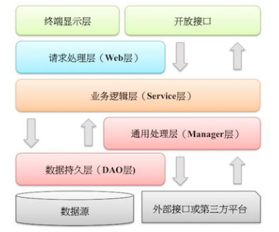

# Java开发手册-V1.5.0 华山版


官网地址：https://edu.aliyun.com/course/417


# 前言


​		《Java 开发手册》是阿里巴巴集团技术团队的集体智慧结晶和经验总结，经历了多次大规模一线实战的检验及不断完善，公开到业界后，众多社区开发者踊跃参与，共同打磨完善，系统化地整理成册。现代软件行业的高速发展对开发者的综合素质要求越来越高，因为不仅是编程知识点，其它维度的知识点也会影响到软件的最终交付质量。比如：数据库的表结构和索引设计缺陷可能带 来软件上的架构缺陷或性能风险；工程结构混乱导致后续维护艰难；没有鉴权的漏洞代码易被黑客攻击等等。所以本手册以 Java 开发者为中心视角，划分为**编程规约、异常日志、单元测试、安全规约、MySQL 数据库、工程结构、设计规约**七个维度，再根据内容特征，细分成若干二级子目录。另外，依据约束力强弱及故障敏感性，规约依次分为强制、推荐、参考三大类。在延伸信息中， “说明”对规约做了适当扩展和解释；“正例”提倡什么样的编码和实现方式；“反例”说明需要提防的雷区，以及真实的错误案例。

​		手册的愿景是**码出高效，码出质量**。现代软件架构的复杂性需要协同开发完成，如何高效地协同呢？无规矩不成方圆，无规范难以协同，比如，制订交通法规表面上是要限制行车权，实际上是保障公众的人身安全，试想如果没有限速，没有红绿灯，谁还敢上路行驶？对软件来说，适当的规范和标准绝不是消灭代码内容的创造性、优雅性，而是限制过度个性化，以一种普遍认可的统一方式一起做事，提升协作效率，降低沟通成本。代码的字里行间流淌的是软件系统的血液，质量的提升是尽可能少踩坑，杜绝踩重复的坑，切实提升系统稳定性，码出质量。

​		我们已经在 2017 杭州云栖大会上发布了配套的 Java 开发规约 IDE 插件，阿里云效也集成了代码规约扫描引擎。次年，发布 36 万字的配套详解图书**《码出高效》**，本书秉持“图胜于表，表胜于言”的理念，深入浅出地将计算机基础、面向对象思想、JVM 探源、数据结构与集合、并发与多线程、单元测试等知识客观、立体地呈现出来。紧扣学以致用、学以精进的目标，结合阿里巴巴实践经验和故障案例，与底层源码解析融会贯通，娓娓道来。此书所得收入均捐赠公益事情，希望用技术情怀帮助更多的人。


# 一、编程规约


## (一) 命名风格

1.【强制】代码中的命名均不能以下划线或美元符号开始，也不能以下划线或美元符号结束。

反例：_name / __name / $name / name_ / name$ / name__

2.【强制】代码中的命名严禁使用拼音与英文混合的方式，更不允许直接使用中文的方式。

说明：正确的英文拼写和语法可以让阅读者易于理解，避免歧义。注意，纯拼音命名方式更要避免采用。

正例：renminbi / alibaba / taobao / youku / hangzhou 等国际通用的名称，可视同英文。

反例：DaZhePromotion [打折] / getPingfenByName() [评分] / int 某变量 = 3

3.【强制】类名使用 UpperCamelCase 风格，但以下情形例外：DO / BO / DTO / VO / AO/ PO / UID 等。

正例：JavaServerlessPlatform / UserDO / XmlService / TcpUdpDeal / TaPromotion

反例：javaserverlessplatform / UserDo / XMLService / TCPUDPDeal / TAPromotion

4.【强制】方法名、参数名、成员变量、局部变量都统一使用 lowerCamelCase 风格，必须遵从驼峰形式。

正例： localValue / getHttpMessage() / inputUserId

5.【强制】常量命名全部大写，单词间用下划线隔开，力求语义表达完整清楚，不要嫌名字长。

正例：MAX_STOCK_COUNT / CACHE_EXPIRED_TIME

反例：MAX_COUNT / EXPIRED_TIME

6.【强制】抽象类命名使用 Abstract 或 Base 开头；异常类命名使用 Exception 结尾；测试类命名以它要测试的类的名称开始，以 Test 结尾。

7.【强制】类型与中括号紧挨相连来表示数组。

正例：定义整形数组 int[] arrayDemo;

反例：在 main 参数中，使用 String args[]来定义。

8.【强制】POJO 类中布尔类型变量都不要加 is 前缀，否则部分框架解析会引起序列化错误。

说明：在本文 MySQL 规约中的建表约定第一条，表达是与否的值采用 is_xxx 的命名方式，所以，需要在 <resultMap>设置从 is_xxx 到 xxx 的映射关系。

反例：定义为基本数据类型 Boolean isDeleted 的属性，它的方法也是 isDeleted()，RPC 框架在反向解析的时候，“误以为”对应的属性名称是 deleted，导致属性获取不到，进而抛出异常。

9.【强制】包名统一使用小写，点分隔符之间有且仅有一个自然语义的英语单词。包名统一使用单数形式，但是类名如果有复数含义，类名可以使用复数形式。

正例：应用工具类包名为 com.alibaba.ai.util、类名为 MessageUtils（此规则参考 spring 的框架结构）

10.【强制】避免在子父类的成员变量之间、或者不同代码块的局部变量之间采用完全相同的命名，使可读性降低。

说明：子类、父类成员变量名相同，即使是 public 类型的变量也是能够通过编译，而局部变量在同一方法内的不同代码块中同名也是合法的，但是要避免使用。对于非 setter/getter 的参数名称也要避免与成员变量名称相同。

反例：

```java
public class ConfusingName {
    public int age;
    // 非 setter/getter 的参数名称，不允许与本类成员变量同名
    public void getData(String alibaba) {
        if(condition) {
            final int money = 531;
            // ...
        }
        for (int i = 0; i < 10; i++) {
            // 在同一方法体中，不允许与其它代码块中的 money 命名相同
            final int money = 615;
            // ...
        }
    } 
}

class Son extends ConfusingName {
    // 不允许与父类的成员变量名称相同
    public int age; 
}
```

11.【强制】杜绝完全不规范的缩写，避免望文不知义。

反例：AbstractClass“缩写”命名成 AbsClass；condition“缩写”命名成 condi，此类随意缩写严重降低了代码的可阅读性。

12.【推荐】为了达到代码自解释的目标，任何自定义编程元素在命名时，使用尽量完整的单词组合来表达其意。

正例：在 JDK 中，表达原子更新的类名为：AtomicReferenceFieldUpdater。

反例：int a 的随意命名方式。

13.【推荐】在常量与变量的命名时，表示类型的名词放在词尾，以提升辨识度。

正例：startTime / workQueue / nameList / TERMINATED_THREAD_COUNT

反例：startedAt / QueueOfWork / listName / COUNT_TERMINATED_THREAD

14.【推荐】如果模块、接口、类、方法使用了设计模式，在命名时需体现出具体模式。

说明：将设计模式体现在名字中，有利于阅读者快速理解架构设计理念。

正例： 

```java
public class OrderFactory;

public class LoginProxy;

public class ResourceObserver;
```

15.【推荐】接口类中的方法和属性不要加任何修饰符号（public 也不要加），保持代码的简洁性，并加上有效的 Javadoc 注释。尽量不要在接口里定义变量，如果一定要定义变量，肯定是与接口方法相关，并且是整个应用的基础常量。

正例：接口方法签名 void commit();

接口基础常量 String COMPANY = "alibaba";

反例：接口方法定义 public abstract void f();

说明：JDK8 中接口允许有默认实现，那么这个 default 方法，是对所有实现类都有价值的默认实现。

16.接口和实现类的命名有两套规则：

1）【强制】对于 Service 和 DAO 类，基于 SOA 的理念，暴露出来的服务一定是接口，内部的实现类用Impl 的后缀与接口区别。

正例：CacheServiceImpl 实现 CacheService 接口。

2）【推荐】如果是形容能力的接口名称，取对应的形容词为接口名（通常是–able 的形容词）。

正例：AbstractTranslator 实现 Translatable 接口。

17.【参考】枚举类名带上 Enum 后缀，枚举成员名称需要全大写，单词间用下划线隔开。

说明：枚举其实就是特殊的类，域成员均为常量，且构造方法被默认强制是私有。

正例：枚举名字为 ProcessStatusEnum 的成员名称：SUCCESS / UNKNOWN_REASON。

18.【参考】各层命名规约：

A) Service/DAO 层方法命名规约

1） 获取单个对象的方法用 get 做前缀。

2） 获取多个对象的方法用 list 做前缀，复数形式结尾如：listObjects。 

3） 获取统计值的方法用 count 做前缀。 

4） 插入的方法用 save/insert 做前缀。

5） 删除的方法用 remove/delete 做前缀。

6） 修改的方法用 update 做前缀。

B) 领域模型命名规约

1） 数据对象：xxxDO，xxx 即为数据表名。

2） 数据传输对象：xxxDTO，xxx 为业务领域相关的名称。

3） 展示对象：xxxVO，xxx 一般为网页名称。

4） POJO 是 DO/DTO/BO/VO 的统称，禁止命名成 xxxPOJO。


## (二) 常量定义

1.【强制】不允许任何魔法值（即未经预先定义的常量）直接出现在代码中。

反例：

```java
String key = "Id#taobao_" + tradeId;
cache.put(key, value);
// 缓存 get 时，由于在代码复制时，漏掉下划线，导致缓存击穿而出现问题
```

2.【强制】在 long 或者 Long 赋值时，数值后使用大写的 L，不能是小写的 l，小写容易跟数字 1 混淆，造成误解。

说明：Long a = 2l; 写的是数字的 21，还是 Long 型的 2。

3.【推荐】不要使用一个常量类维护所有常量，要按常量功能进行归类，分开维护。

说明：大而全的常量类，杂乱无章，使用查找功能才能定位到修改的常量，不利于理解和维护。

正例：缓存相关常量放在类 CacheConsts 下；系统配置相关常量放在类 ConfigConsts 下。

4.【推荐】常量的复用层次有五层：跨应用共享常量、应用内共享常量、子工程内共享常量、包内共享常量、类内共享常量。

1） 跨应用共享常量：放置在二方库中，通常是 client.jar 中的 constant 目录下。

2） 应用内共享常量：放置在一方库中，通常是子模块中的 constant 目录下。

反例：易懂变量也要统一定义成应用内共享常量，两位工程师在两个类中分别定义了“YES”的变量：

类 A 中：public static final String YES = "yes";

类 B 中：public static final String YES = "y";

A.YES.equals(B.YES)，预期是 true，但实际返回为 false，导致线上问题。

3） 子工程内部共享常量：即在当前子工程的 constant 目录下。

4） 包内共享常量：即在当前包下单独的 constant 目录下。

5） 类内共享常量：直接在类内部 private static final 定义。

5.【推荐】如果变量值仅在一个固定范围内变化用 enum 类型来定义。

说明：如果存在名称之外的延伸属性应使用 enum 类型，下面正例中的数字就是延伸信息，表示一年中的第几个季节。

正例：

```java
public enum SeasonEnum {
    SPRING(1), SUMMER(2), AUTUMN(3), WINTER(4);
    private int seq;
    SeasonEnum(int seq) {
        this.seq = seq;
    }
    public int getSeq() {
        return seq;
    } 
}
```


## (三) 代码格式

1.【强制】如果是大括号内为空，则简洁地写成{}即可，大括号中间无需换行和空格；如果是非空代码块则： 

1） 左大括号前不换行。

2） 左大括号后换行。

3） 右大括号前换行。

4） 右大括号后还有 else 等代码则不换行；表示终止的右大括号后必须换行。

2.【强制】左小括号和字符之间不出现空格；同样，右小括号和字符之间也不出现空格；而左大括号前需要空格。详见第 5 条下方正例提示。

反例：if (空格 a == b 空格)

3.【强制】if/for/while/switch/do 等保留字与括号之间都必须加空格。

4.【强制】任何二目、三目运算符的左右两边都需要加一个空格。

说明：运算符包括赋值运算符=、逻辑运算符&&、加减乘除符号等。

5.【强制】采用 4 个空格缩进，禁止使用 tab 字符。

说明：如果使用 tab 缩进，必须设置 1 个 tab 为 4 个空格。IDEA 设置 tab 为 4 个空格时，请勿勾选 Use tab character；而在 eclipse 中，必须勾选 insert spaces for tabs。

正例： （涉及 1-5 点）

```java
public static void main(String[] args) { 
    // 缩进 4 个空格 
    String say = "hello"; 
    // 运算符的左右必须有一个空格 
    int flag = 0; 
    // 关键词 if 与括号之间必须有一个空格，括号内的 f 与左括号，0 与右括号不需要空格 
    if (flag == 0) { 
        System.out.println(say); 
    } 

    // 左大括号前加空格且不换行；左大括号后换行 
    if (flag == 1) { 
        System.out.println("world"); 
        // 右大括号前换行，右大括号后有 else，不用换行 
    } else { 
        System.out.println("ok"); 
        // 在右大括号后直接结束，则必须换行 
    } 
}
```

6.【强制】注释的双斜线与注释内容之间有且仅有一个空格。

正例：

```java
// 这是示例注释，请注意在双斜线之后有一个空格
String param = new String();
```

7.【强制】在进行类型强制转换时，右括号与强制转换值之间不需要任何空格隔开。

正例：

```java
long first = 1000000000000L;
int second = (int)first + 2;
```

8.【强制】单行字符数限制不超过 120 个，超出需要换行，换行时遵循如下原则：

1）第二行相对第一行缩进 4 个空格，从第三行开始，不再继续缩进，参考示例。

2）运算符与下文一起换行。

3）方法调用的点符号与下文一起换行。

4）方法调用中的多个参数需要换行时，在逗号后进行。 

5）在括号前不要换行，见反例。

正例：

```java
StringBuilder sb = new StringBuilder(); 
// 超过 120 个字符的情况下，换行缩进 4 个空格，点号和方法名称一起换行
sb.append("Jack").append("Ma")... 
.append("alibaba")... 
.append("alibaba")... 
.append("alibaba");
```

反例：

```java
StringBuilder sb = new StringBuilder(); 
// 超过 120 个字符的情况下，不要在括号前换行
sb.append("Jack").append("Ma")...append 
    ("alibaba"); 
// 参数很多的方法调用可能超过 120 个字符，不要在逗号前换行
method(args1, args2, args3, ... 
       , argsX);
```

9.【强制】方法参数在定义和传入时，多个参数逗号后边必须加空格。

正例：下例中实参的 args1，后边必须要有一个空格。

```java
method(Object args1, Object args2, Object args3); 
```

10.【强制】IDE 的 text file encoding 设置为 UTF-8; IDE 中文件的换行符使用 Unix 格式，不要使用 Windows 格式。

11.【推荐】单个方法的总行数不超过 80 行。

说明：除注释之外的方法签名、左右大括号、方法内代码、空行、回车及任何不可见字符的总行数不超过80 行。

正例：代码逻辑分清红花和绿叶，个性和共性，绿叶逻辑单独出来成为额外方法，使主干代码更加清晰；共性逻辑抽取成为共性方法，便于复用和维护。

12.【推荐】没有必要增加若干空格来使变量的赋值等号与上一行对应位置的等号对齐。

正例：

```java
int one = 1; 
long two = 2L; 
float three = 3F; 
StringBuilder sb = new StringBuilder();
```

说明：增加 sb 这个变量，如果需要对齐，则给 one、two、three 都要增加几个空格，在变量比较多的情况下，是非常累赘的事情。

13.【推荐】不同逻辑、不同语义、不同业务的代码之间插入一个空行分隔开来以提升可读性。

说明：任何情形，没有必要插入多个空行进行隔开。


## (四) OOP 规约

1.【强制】避免通过一个类的对象引用访问此类的静态变量或静态方法，无谓增加编译器解析成本，直接用类名来访问即可。

2.【强制】所有的覆写方法，必须加@Override 注解。

说明：getObject()与 get0bject()的问题。一个是字母的 O，一个是数字的 0，加@Override 可以准确判断是否覆盖成功。另外，如果在抽象类中对方法签名进行修改，其实现类会马上编译报错。

3.【强制】相同参数类型，相同业务含义，才可以使用 Java 的可变参数，避免使用 Object。

说明：可变参数必须放置在参数列表的最后。（提倡同学们尽量不用可变参数编程）

正例：

```java
public List<User> listUsers(String type, Long... ids) {...}
```

4.【强制】外部正在调用或者二方库依赖的接口，不允许修改方法签名，避免对接口调用方产生影响。接口过时必须加@Deprecated 注解，并清晰地说明采用的新接口或者新服务是什么。

5.【强制】不能使用过时的类或方法。

说明：java.net.URLDecoder 中的方法 decode(String encodeStr) 这个方法已经过时，应该使用双参数decode(String source, String encode)。接口提供方既然明确是过时接口，那么有义务同时提供新的接口；作为调用方来说，有义务去考证过时方法的新实现是什么。

6.【强制】Object 的 equals 方法容易抛空指针异常，应使用常量或确定有值的对象来调用equals。

正例："test".equals(object);

反例：object.equals("test");

说明：推荐使用 java.util.Objects#equals（JDK7 引入的工具类）。

7.【强制】所有整型包装类对象之间值的比较，全部使用 equals 方法比较。

说明：对于 Integer var = ? 在-128 至 127 范围内的赋值，Integer 对象是在 IntegerCache.cache 产生，会复用已有对象，这个区间内的 Integer 值可以直接使用==进行判断，但是这个区间之外的所有数据，都会在堆上产生，并不会复用已有对象，这是一个大坑，推荐使用 equals 方法进行判断。 

8.【强制】浮点数之间的等值判断，基本数据类型不能用==来比较，包装数据类型不能用equals 来判断。

说明：浮点数采用“尾数+阶码”的编码方式，类似于科学计数法的“有效数字+指数”的表示方式。二进制无法精确表示大部分的十进制小数，具体原理参考《码出高效》。

反例：

```java
float a = 1.0f - 0.9f;
float b = 0.9f - 0.8f;
if (a == b) {
    // 预期进入此代码快，执行其它业务逻辑
    // 但事实上 a==b 的结果为 false
}
Float x = Float.valueOf(a);
Float y = Float.valueOf(b);
if (x.equals(y)) {
    // 预期进入此代码快，执行其它业务逻辑
    // 但事实上 equals 的结果为 false
}
```

正例：

(1) 指定一个误差范围，两个浮点数的差值在此范围之内，则认为是相等的。

```java
float a = 1.0f - 0.9f;
float b = 0.9f - 0.8f;
float diff = 1e-6f;

if (Math.abs(a - b) < diff) {
    System.out.println("true");
}
```

(2) 使用 BigDecimal 来定义值，再进行浮点数的运算操作。

```java
BigDecimal a = new BigDecimal("1.0");
BigDecimal b = new BigDecimal("0.9");
BigDecimal c = new BigDecimal("0.8");

BigDecimal x = a.subtract(b);
BigDecimal y = b.subtract(c);

if (x.equals(y)) {
    System.out.println("true");
}
```

9.【强制】定义数据对象 DO 类时，属性类型要与数据库字段类型相匹配。

正例：数据库字段的 bigint 必须与类属性的 Long 类型相对应。

反例：某个案例的数据库表 id 字段定义类型 bigint unsigned，实际类对象属性为 Integer，随着 id 越来越大，超过 Integer 的表示范围而溢出成为负数。

10.【强制】为了防止精度损失，禁止使用构造方法 BigDecimal(double)的方式把 double 值转化为 BigDecimal 对象。

说明：BigDecimal(double)存在精度损失风险，在精确计算或值比较的场景中可能会导致业务逻辑异常。

如：BigDecimal g = new BigDecimal(0.1f); 实际的存储值为：0.10000000149

正例：优先推荐入参为 String 的构造方法，或使用 BigDecimal 的 valueOf 方法，此方法内部其实执行了Double 的 toString，而 Double 的 toString 按 double 的实际能表达的精度对尾数进行了截断。

```java
BigDecimal recommend1 = new BigDecimal("0.1");
BigDecimal recommend2 = BigDecimal.valueOf(0.1)
```

11. 关于基本数据类型与包装数据类型的使用标准如下：

1） 【强制】所有的 POJO 类属性必须使用包装数据类型。

2） 【强制】RPC 方法的返回值和参数必须使用包装数据类型。

3） 【推荐】所有的局部变量使用基本数据类型。

说明：POJO 类属性没有初值是提醒使用者在需要使用时，必须自己显式地进行赋值，任何 NPE 问题，或者入库检查，都由使用者来保证。

正例：数据库的查询结果可能是 null，因为自动拆箱，用基本数据类型接收有 NPE 风险。

反例：比如显示成交总额涨跌情况，即正负 x%，x 为基本数据类型，调用的 RPC 服务，调用不成功时，返回的是默认值，页面显示为 0%，这是不合理的，应该显示成中划线。所以包装数据类型的 null 值，能够表示额外的信息，如：远程调用失败，异常退出。

12.【强制】定义 DO/DTO/VO 等 POJO 类时，不要设定任何属性默认值。

反例：POJO 类的 createTime 默认值为 new Date()，但是这个属性在数据提取时并没有置入具体值，在更新其它字段时又附带更新了此字段，导致创建时间被修改成当前时间。

13.【强制】序列化类新增属性时，请不要修改 serialVersionUID 字段，避免反序列失败；如果完全不兼容升级，避免反序列化混乱，那么请修改 serialVersionUID 值。

说明：注意 serialVersionUID 不一致会抛出序列化运行时异常。

14.【强制】构造方法里面禁止加入任何业务逻辑，如果有初始化逻辑，请放在 init 方法中。

15.【强制】POJO 类必须写 toString 方法。使用 IDE 中的工具：source> generate toString时，如果继承了另一个 POJO 类，注意在前面加一下 super.toString。

说明：在方法执行抛出异常时，可以直接调用 POJO 的 toString()方法打印其属性值，便于排查问题。

16.【强制】禁止在 POJO 类中，同时存在对应属性 xxx 的 isXxx()和 getXxx()方法。

说明：框架在调用属性 xxx 的提取方法时，并不能确定哪个方法一定是被优先调用到。

17.【推荐】使用索引访问用 String 的 split 方法得到的数组时，需做最后一个分隔符后有无内容的检查，否则会有抛 IndexOutOfBoundsException 的风险。

说明：

```java
String str = "a,b,c,,"; 
String[] ary = str.split(","); 
// 预期大于 3，结果是 3
System.out.println(ary.length);
```

18.【推荐】当一个类有多个构造方法，或者多个同名方法，这些方法应该按顺序放置在一起，便于阅读，此条规则优先于下一条。

19.【推荐】 类内方法定义的顺序依次是：公有方法或保护方法 > 私有方法 > getter / setter

方法。

说明：公有方法是类的调用者和维护者最关心的方法，首屏展示最好；保护方法虽然只是子类关心，也可能是“模板设计模式”下的核心方法；而私有方法外部一般不需要特别关心，是一个黑盒实现；因为承载的信息价值较低，所有 Service 和 DAO 的 getter/setter 方法放在类体最后。

20. 【推荐】setter 方法中，参数名称与类成员变量名称一致，this.成员名 = 参数名。在getter/setter 方法中，不要增加业务逻辑，增加排查问题的难度。

反例：

```java
public Integer getData() { 
    if (condition) { 
        return this.data + 100; 
    } else {
        return this.data - 100;
    } 
}
```

21.【推荐】循环体内，字符串的连接方式，使用 StringBuilder 的 append 方法进行扩展。

说明：下例中，反编译出的字节码文件显示每次循环都会 new 出一个 StringBuilder 对象，然后进行append 操作，最后通过 toString 方法返回 String 对象，造成内存资源浪费。

反例：

```java
String str = "start"; 
for (int i = 0; i < 100; i++) { 
    str = str + "hello"; 
}
```

22.【推荐】final 可以声明类、成员变量、方法、以及本地变量，下列情况使用 final 关键字：

1） 不允许被继承的类，如：String 类。

2） 不允许修改引用的域对象。

3） 不允许被覆写的方法，如：POJO 类的 setter 方法。

4） 不允许运行过程中重新赋值的局部变量。

5） 避免上下文重复使用一个变量，使用 final 可以强制重新定义一个变量，方便更好地进行重构。

23.【推荐】慎用 Object 的 clone 方法来拷贝对象。

说明：对象 clone 方法默认是浅拷贝，若想实现深拷贝需覆写 clone 方法实现域对象的深度遍历式拷贝。

24.【推荐】类成员与方法访问控制从严：

1） 如果不允许外部直接通过 new 来创建对象，那么构造方法必须是 private。 

2） 工具类不允许有 public 或 default 构造方法。

3） 类非 static 成员变量并且与子类共享，必须是 protected。 

4） 类非 static 成员变量并且仅在本类使用，必须是 private。 

5） 类 static 成员变量如果仅在本类使用，必须是 private。 

6） 若是 static 成员变量，考虑是否为 final。 

7） 类成员方法只供类内部调用，必须是 private。 

8） 类成员方法只对继承类公开，那么限制为 protected。

说明：任何类、方法、参数、变量，严控访问范围。过于宽泛的访问范围，不利于模块解耦。思考：如果是一个 private 的方法，想删除就删除，可是一个 public 的 service 成员方法或成员变量，删除一下，不得手心冒点汗吗？变量像自己的小孩，尽量在自己的视线内，变量作用域太大，无限制的到处跑，那么你会担心的。


## (五) 集合处理

1.【强制】关于 hashCode 和 equals 的处理，遵循如下规则：

1）只要覆写 equals，就必须覆写 hashCode。 

2）因为 Set 存储的是不重复的对象，依据 hashCode 和 equals 进行判断，所以 Set 存储的对象必须覆写这两个方法。

3）如果自定义对象作为 Map 的键，那么必须覆写 hashCode 和 equals。

说明：String 已覆写 hashCode 和 equals 方法，所以我们可以愉快地使用 String 对象作为 key 来使用。

2.【强制】ArrayList 的 subList 结果不可强转成 ArrayList，否则会抛出 ClassCastException 异常，即 java.util.RandomAccessSubList cannot be cast to java.util.ArrayList。

说明：subList 返回的是 ArrayList 的内部类 SubList，并不是 ArrayList 而是 ArrayList 的一个视图，对于 SubList 子列表的所有操作最终会反映到原列表上。

3.【强制】使用 Map 的方法 keySet()/values()/entrySet()返回集合对象时，不可以对其进行添加元素操作，否则会抛出 UnsupportedOperationException 异常。

4.【强制】Collections 类返回的对象，如：emptyList()/singletonList()等都是 immutable list，不可对其进行添加或者删除元素的操作。

反例：如果查询无结果，返回 Collections.emptyList()空集合对象，调用方一旦进行了添加元素的操作，就会触发 UnsupportedOperationException 异常。

5.【强制】在 subList 场景中，高度注意对原集合元素的增加或删除，均会导致子列表的遍历、增加、删除产生 ConcurrentModificationException 异常。

6.【强制】使用集合转数组的方法，必须使用集合的 toArray(T[] array)，传入的是类型完全一致、长度为 0 的空数组。

反例：直接使用 toArray 无参方法存在问题，此方法返回值只能是 Object[]类，若强转其它类型数组将出现 ClassCastException 错误。

正例：

```java
List<String> list = new ArrayList<>(2);
list.add("guan");
list.add("bao");
String[] array = list.toArray(new String[0]);
```

 说明：使用 toArray 带参方法，数组空间大小的 length： 

1） 等于 0，动态创建与 size 相同的数组，性能最好。

2） 大于 0 但小于 size，重新创建大小等于 size 的数组，增加 GC 负担。

3） 等于 size，在高并发情况下，数组创建完成之后，size 正在变大的情况下，负面影响与上相同。

4） 大于 size，空间浪费，且在 size 处插入 null 值，存在 NPE 隐患。

7.【强制】在使用 Collection 接口任何实现类的 addAll()方法时，都要对输入的集合参数进行NPE 判断。

说明：在 ArrayList#addAll 方法的第一行代码即 Object[] a = c.toArray(); 其中 c 为输入集合参数，如果为 null，则直接抛出异常。

8.【强制】使用工具类 Arrays.asList()把数组转换成集合时，不能使用其修改集合相关的方法，它的 add/remove/clear 方法会抛出 UnsupportedOperationException 异常。

说明：asList 的返回对象是一个 Arrays 内部类，并没有实现集合的修改方法。Arrays.asList 体现的是适配器模式，只是转换接口，后台的数据仍是数组。

```java
String[] str = new String[] { "yang", "hao" };
List list = Arrays.asList(str);
```

第一种情况：list.add("yangguanbao"); 运行时异常。

第二种情况：str[0] = "changed"; 也会随之修改，反之亦然。

9.【强制】泛型通配符<? extends T>来接收返回的数据，此写法的泛型集合不能使用 add 方 法，而<? super T>不能使用 get 方法，作为接口调用赋值时易出错。

说明：扩展说一下 PECS(Producer Extends Consumer Super)原则：第一、频繁往外读取内容的，适合用<? extends T>。第二、经常往里插入的，适合用<? super T>

10.【强制】在无泛型限制定义的集合赋值给泛型限制的集合时，在使用集合元素时，需要进行instanceof 判断，避免抛出 ClassCastException 异常。

说明：毕竟泛型是在 JDK5 后才出现，考虑到向前兼容，编译器是允许非泛型集合与泛型集合互相赋值。

反例：

```java
List<String> generics = null;
List notGenerics = new ArrayList(10);
notGenerics.add(new Object());
notGenerics.add(new Integer(1));
generics = notGenerics;
// 此处抛出 ClassCastException 异常
String string = generics.get(0);
```

11.【强制】不要在 foreach 循环里进行元素的 remove/add 操作。remove 元素请使用Iterator 方式，如果并发操作，需要对 Iterator 对象加锁。

正例：

```java
List<String> list = new ArrayList<>(); 
list.add("1"); 
list.add("2"); 
Iterator<String> iterator = list.iterator(); 
while (iterator.hasNext()) { 
    String item = iterator.next(); 
    if (删除元素的条件) {
        iterator.remove(); 
    } 
}
```

反例：

```java
for (String item : list) { 
    if ("1".equals(item)) { 
        list.remove(item); 
    } 
}
```

说明：以上代码的执行结果肯定会出乎大家的意料，那么试一下把“1”换成“2”，会是同样的结果吗？

12.【强制】在 JDK7 版本及以上，Comparator 实现类要满足如下三个条件，不然 Arrays.sort，Collections.sort 会抛 IllegalArgumentException 异常。

说明：三个条件如下 

1） x，y 的比较结果和 y，x 的比较结果相反。

2） x>y，y>z，则 x>z。 

3） x=y，则 x，z 比较结果和 y，z 比较结果相同。

反例：下例中没有处理相等的情况，交换两个对象判断结果并不互反，不符合第一个条件，在实际使用中可能会出现异常。

```java
new Comparator<Student>() { 
    @Override 
    public int compare(Student o1, Student o2) { 
        return o1.getId() > o2.getId() ? 1 : -1; 
    } 
};
```

13.【推荐】集合泛型定义时，在 JDK7 及以上，使用 diamond 语法或全省略。

说明：菱形泛型，即 diamond，直接使用<>来指代前边已经指定的类型。

正例：

```java
// diamond 方式，即<>
HashMap<String, String> userCache = new HashMap<>(16);
// 全省略方式
ArrayList<User> users = new ArrayList(10); 
```

14.【推荐】集合初始化时，指定集合初始值大小。

说明：HashMap 使用 HashMap(int initialCapacity) 初始化。

正例：initialCapacity = (需要存储的元素个数 / 负载因子) + 1。注意负载因子（即 loader factor）默认为 0.75，如果暂时无法确定初始值大小，请设置为 16（即默认值）。

反例：HashMap 需要放置 1024 个元素，由于没有设置容量初始大小，随着元素不断增加，容量 7 次被迫扩大，resize 需要重建 hash 表，严重影响性能。

15.【推荐】使用 entrySet 遍历 Map 类集合 KV，而不是 keySet 方式进行遍历。

说明：keySet 其实是遍历了 2 次，一次是转为 Iterator 对象，另一次是从 hashMap 中取出 key 所对应的 value。而 entrySet 只是遍历了一次就把 key 和 value 都放到了 entry 中，效率更高。如果是 JDK8，使用 Map.forEach 方法。

正例：values()返回的是 V 值集合，是一个 list 集合对象；keySet()返回的是 K 值集合，是一个 Set 集合对象；entrySet()返回的是 K-V 值组合集合。

16.【推荐】高度注意 Map 类集合 K/V 能不能存储 null 值的情况，如下表格：

| 集合类            | key          | value        | super       | 说明                   |
| ----------------- | ------------ | ------------ | :---------- | ---------------------- |
| Hashtable         | 不允许为null | 不允许为null | Dictonary   | 线程安全               |
| ConcurrentHashMap | 不允许为null | 不允许为null | AbstractMap | 锁分段技术（JDK8:CAS） |
| TreeMap           | 不允许为null | 允许为null   | AbstractMap | 线程不安全             |
| HashMap           | 允许为null   | 允许为null   | AbstractMap | 线程不安全             |

反例：由于 HashMap 的干扰，很多人认为 ConcurrentHashMap 是可以置入 null 值，而事实上，存储null 值时会抛出 NPE 异常。

17.【参考】合理利用好集合的有序性(sort)和稳定性(order)，避免集合的无序性(unsort)和不稳定性(unorder)带来的负面影响。

说明：有序性是指遍历的结果是按某种比较规则依次排列的。稳定性指集合每次遍历的元素次序是一定的。如：ArrayList 是 order/unsort；HashMap 是 unorder/unsort；TreeSet 是 order/sort。

18.【参考】利用 Set 元素唯一的特性，可以快速对一个集合进行去重操作，避免使用 List 的

contains 方法进行遍历、对比、去重操作。


## (六) 并发处理

1.【强制】获取单例对象需要保证线程安全，其中的方法也要保证线程安全。

说明：资源驱动类、工具类、单例工厂类都需要注意。

2.【强制】创建线程或线程池时请指定有意义的线程名称，方便出错时回溯。

正例：自定义线程工厂，并且根据外部特征进行分组，比如机房信息。

```java
public class UserThreadFactory implements ThreadFactory {
    private final String namePrefix;
    private final AtomicInteger nextId = new AtomicInteger(1);
    // 定义线程组名称，在 jstack 问题排查时，非常有帮助
    UserThreadFactory(String whatFeaturOfGroup) {
        namePrefix = "From UserThreadFactory's " + whatFeaturOfGroup + "-Worker-"; }
    @Override
    public Thread newThread(Runnable task) {
        String name = namePrefix + nextId.getAndIncrement();
        Thread thread = new Thread(null, task, name, 0, false);
        System.out.println(thread.getName());
        return thread; 
    } 
}
```

3.【强制】线程资源必须通过线程池提供，不允许在应用中自行显式创建线程。

说明：线程池的好处是减少在创建和销毁线程上所消耗的时间以及系统资源的开销，解决资源不足的问题。如果不使用线程池，有可能造成系统创建大量同类线程而导致消耗完内存或者“过度切换”的问题。

4.【强制】线程池不允许使用 Executors 去创建，而是通过 ThreadPoolExecutor 的方式，这样的处理方式让写的同学更加明确线程池的运行规则，规避资源耗尽的风险。

说明：Executors 返回的线程池对象的弊端如下： 

1） FixedThreadPool 和 SingleThreadPool：

允许的请求队列长度为 Integer.MAX_VALUE，可能会堆积大量的请求，从而导致 OOM。 

2） CachedThreadPool：

允许的创建线程数量为 Integer.MAX_VALUE，可能会创建大量的线程，从而导致 OOM。

5.【强制】SimpleDateFormat 是线程不安全的类，一般不要定义为 static 变量，如果定义为static，必须加锁，或者使用 DateUtils 工具类。

正例：注意线程安全，使用 DateUtils。亦推荐如下处理：

```java
private static final ThreadLocal<DateFormat> df = new ThreadLocal<DateFormat>() { 
    @Override 
    protected DateFormat initialValue() { 
        return new SimpleDateFormat("yyyy-MM-dd"); 
    } 
};
```

说明：如果是 JDK8 的应用，可以使用 Instant 代替 Date，LocalDateTime 代替 Calendar，DateTimeFormatter 代替SimpleDateFormat，官方给出的解释：simple beautiful strong immutable thread-safe。

6.【强制】必须回收自定义的 ThreadLocal 变量，尤其在线程池场景下，线程经常会被复用，如果不清理自定义的 ThreadLocal 变量，可能会影响后续业务逻辑和造成内存泄露等问题。尽量在代理中使用 try-finally 块进行回收。

正例：

```java
objectThreadLocal.set(userInfo);
try {
    // ...
} finally {
    objectThreadLocal.remove();
}
```

7.【强制】高并发时，同步调用应该去考量锁的性能损耗。能用无锁数据结构，就不要用锁；能锁区块，就不要锁整个方法体；能用对象锁，就不要用类锁。

说明：尽可能使加锁的代码块工作量尽可能的小，避免在锁代码块中调用 RPC 方法。

8.【强制】对多个资源、数据库表、对象同时加锁时，需要保持一致的加锁顺序，否则可能会造成死锁。

说明：线程一需要对表 A、B、C 依次全部加锁后才可以进行更新操作，那么线程二的加锁顺序也必须是A、B、C，否则可能出现死锁。

9.【强制】在使用阻塞等待获取锁的方式中，必须在 try 代码块之外，并且在加锁方法与 try 代码块之间没有任何可能抛出异常的方法调用，避免加锁成功后，在 finally 中无法解锁。

说明一：如果在 lock 方法与 try 代码块之间的方法调用抛出异常，那么无法解锁，造成其它线程无法成功获取锁。

说明二：如果 lock 方法在 try 代码块之内，可能由于其它方法抛出异常，导致在 finally 代码块中，unlock 对未加锁的对象解锁，它会调用 AQS 的 tryRelease 方法（取决于具体实现类），抛出IllegalMonitorStateException 异常。

说明三：在 Lock 对象的 lock 方法实现中可能抛出 unchecked 异常，产生的后果与说明二相同。

正例：

```java
Lock lock = new XxxLock();
// ...
lock.lock();
try {
    doSomething();
    doOthers();
} finally {
    lock.unlock();
}
```

反例：

```java
Lock lock = new XxxLock();
// ...
try {
    // 如果此处抛出异常，则直接执行 finally 代码块
    doSomething();
    // 无论加锁是否成功，finally 代码块都会执行
    lock.lock();
    doOthers();
} finally {
    lock.unlock();
}
```

10.【强制】在使用尝试机制来获取锁的方式中，进入业务代码块之前，必须先判断当前线程是否持有锁。锁的释放规则与锁的阻塞等待方式相同。

说明：Lock 对象的 unlock 方法在执行时，它会调用 AQS 的 tryRelease 方法（取决于具体实现类），如果当前线程不持有锁，则抛出 IllegalMonitorStateException 异常。

正例：

```java
Lock lock = new XxxLock();
// ...
boolean isLocked = lock.tryLock();
if (isLocked) {
    try {
        doSomething();
        doOthers();
    } finally {
        lock.unlock();
    } 
}
```

11.【强制】并发修改同一记录时，避免更新丢失，需要加锁。要么在应用层加锁，要么在缓存加锁，要么在数据库层使用乐观锁，使用 version 作为更新依据。

说明：如果每次访问冲突概率小于 20%，推荐使用乐观锁，否则使用悲观锁。乐观锁的重试次数不得小于

3 次。

12.【强制】多线程并行处理定时任务时，Timer 运行多个 TimeTask 时，只要其中之一没有捕获抛出的异常，其它任务便会自动终止运行，如果在处理定时任务时使用ScheduledExecutorService 则没有这个问题。

13.【推荐】资金相关的金融敏感信息，使用悲观锁策略。

说明：乐观锁在获得锁的同时已经完成了更新操作，校验逻辑容易出现漏洞，另外，乐观锁对冲突的解决策略有较复杂的要求，处理不当容易造成系统压力或数据异常，所以资金相关的金融敏感信息不建议使用乐观锁更新。

14.【推荐】使用 CountDownLatch 进行异步转同步操作，每个线程退出前必须调用 countDown方法，线程执行代码注意 catch 异常，确保 countDown 方法被执行到，避免主线程无法执行至 await 方法，直到超时才返回结果。

说明：注意，子线程抛出异常堆栈，不能在主线程 try-catch 到。

15.【推荐】避免 Random 实例被多线程使用，虽然共享该实例是线程安全的，但会因竞争同一seed 导致的性能下降。

说明：Random 实例包括 java.util.Random 的实例或者 Math.random()的方式。

正例：在 JDK7 之后，可以直接使用 API ThreadLocalRandom，而在 JDK7 之前，需要编码保证每个线程持有一个实例。

16.【推荐】在并发场景下，通过双重检查锁（double-checked locking）实现延迟初始化的优化问题隐患(可参考 The "Double-Checked Locking is Broken" Declaration)，推荐解决方案中较为简单一种（适用于 JDK5 及以上版本），将目标属性声明为 volatile 型。

反例：

```java
public class LazyInitDemo { 
    private Helper helper = null; 
    public Helper getHelper() { 
        if (helper == null) synchronized(this) { 
            if (helper == null) 
                helper = new Helper(); 
        } 
        return helper; 
    } 
    // other methods and fields... 
}
```

17.【参考】volatile 解决多线程内存不可见问题。对于一写多读，是可以解决变量同步问题，但是如果多写，同样无法解决线程安全问题。

说明：如果是 count++操作，使用如下类实现：AtomicInteger count = new AtomicInteger(); count.addAndGet(1); 如果是 JDK8，推荐使用 LongAdder 对象，比 AtomicLong 性能更好（减少乐观锁的重试次数）。

18.【参考】HashMap 在容量不够进行 resize 时由于高并发可能出现死链，导致 CPU 飙升，在开发过程中可以使用其它数据结构或加锁来规避此风险。

19.【参考】ThreadLocal 对象使用 static 修饰，ThreadLocal 无法解决共享对象的更新问题。

说明：这个变量是针对一个线程内所有操作共享的，所以设置为静态变量，所有此类实例共享此静态变量，也就是说在类第一次被使用时装载，只分配一块存储空间，所有此类的对象(只要是这个线程内定义的)都可以操控这个变量。 


## (七) 控制语句

1.【强制】在一个 switch 块内，每个 case 要么通过 continue/break/return 等来终止，要么注释说明程序将继续执行到哪一个 case 为止；在一个 switch 块内，都必须包含一个default 语句并且放在最后，即使它什么代码也没有。

说明：注意 break 是退出 switch 语句块，而 return 是退出方法体。

2.【强制】当 switch 括号内的变量类型为 String 并且此变量为外部参数时，必须先进行 null判断。

反例：猜猜下面的代码输出是什么？

```java
public class SwitchString {
    public static void main(String[] args) {
        method(null);
    }
    public static void method(String param) {
        switch (param) {
                // 肯定不是进入这里
            case "sth":
                System.out.println("it's sth");
                break;
                // 也不是进入这里
            case "null":
                System.out.println("it's null");
                break;
                // 也不是进入这里
            default:
                System.out.println("default");
        }
    } 
}
```

3.【强制】在 if/else/for/while/do 语句中必须使用大括号。

说明：即使只有一行代码，避免采用单行的编码方式：if (condition) statements; 

4.【强制】在高并发场景中，避免使用”等于”判断作为中断或退出的条件。

说明：如果并发控制没有处理好，容易产生等值判断被“击穿”的情况，使用大于或小于的区间判断条件来代替。

反例：判断剩余奖品数量等于 0 时，终止发放奖品，但因为并发处理错误导致奖品数量瞬间变成了负数，这样的话，活动无法终止。

5.【推荐】表达异常的分支时，少用 if-else 方式，这种方式可以改写成：

```java
if (condition) { 
    ... 
        return obj; 
} 
// 接着写 else 的业务逻辑代码;
```

说明：如果非使用 if()...else if()...else...方式表达逻辑，避免后续代码维护困难，【强制】请勿超过 3 层。

正例：超过 3 层的 if-else 的逻辑判断代码可以使用卫语句、策略模式、状态模式等来实现，其中卫语句即代码逻辑先考虑失败、异常、中断、退出等直接返回的情况，以方法多个出口的方式，解决代码中判断分支嵌套的问题，这是逆向思维的体现。

示例如下：

```java
public void findBoyfriend(Man man) {
    if (man.isUgly()) {
        System.out.println("本姑娘是外貌协会的资深会员");
        return;
    }
    if (man.isPoor()) {
        System.out.println("贫贱夫妻百事哀");
        return;
    }
    if (man.isBadTemper()) {
        System.out.println("银河有多远，你就给我滚多远");
        return;
    }
    System.out.println("可以先交往一段时间看看");
}
```

6.【推荐】除常用方法（如 getXxx/isXxx）等外，不要在条件判断中执行其它复杂的语句，将复杂逻辑判断的结果赋值给一个有意义的布尔变量名，以提高可读性。

说明：很多 if 语句内的逻辑表达式相当复杂，与、或、取反混合运算，甚至各种方法纵深调用，理解成本非常高。如果赋值一个非常好理解的布尔变量名字，则是件令人爽心悦目的事情。

正例：

```java
// 伪代码如下
final boolean existed = (file.open(fileName, "w") != null) && (...) || (...);
if (existed) {
 ...
}
```

反例：

```java
public final void acquire(long arg) {
    if (!tryAcquire(arg) &&
        acquireQueued(addWaiter(Node.EXCLUSIVE), arg)) {
        selfInterrupt();
    } 
}
```

7.【推荐】不要在其它表达式（尤其是条件表达式）中，插入赋值语句。

说明：赋值点类似于人体的穴位，对于代码的理解至关重要，所以赋值语句需要清晰地单独成为一行。

反例：

```java
public Lock getLock(boolean fair) {
    // 算术表达式中出现赋值操作，容易忽略 count 值已经被改变
    threshold = (count = Integer.MAX_VALUE) - 1;
    // 条件表达式中出现赋值操作，容易误认为是 sync==fair
    return (sync = fair) ? new FairSync() : new NonfairSync();
}
```

8.【推荐】循环体中的语句要考量性能，以下操作尽量移至循环体外处理，如定义对象、变量、获取数据库连接，进行不必要的 try-catch 操作（这个 try-catch 是否可以移至循环体外）。

9.【推荐】避免采用取反逻辑运算符。

说明：取反逻辑不利于快速理解，并且取反逻辑写法必然存在对应的正向逻辑写法。

正例：使用 if (x < 628) 来表达 x 小于 628。

反例：使用 if (!(x >= 628)) 来表达 x 小于 628。

10.【推荐】接口入参保护，这种场景常见的是用作批量操作的接口。

11.【参考】下列情形，需要进行参数校验： 

1） 调用频次低的方法。

2） 执行时间开销很大的方法。此情形中，参数校验时间几乎可以忽略不计，但如果因为参数错误导致 中间执行回退，或者错误，那得不偿失。

3） 需要极高稳定性和可用性的方法。

4） 对外提供的开放接口，不管是 RPC/API/HTTP 接口。

5） 敏感权限入口。

12.【参考】下列情形，不需要进行参数校验： 

1） 极有可能被循环调用的方法。但在方法说明里必须注明外部参数检查要求。 

2） 底层调用频度比较高的方法。毕竟是像纯净水过滤的最后一道，参数错误不太可能到底层才会暴露问题。一般 DAO 层与 Service 层都在同一个应用中，部署在同一台服务器中，所以 DAO 的参数校验，可以省略。

3） 被声明成 private 只会被自己代码所调用的方法，如果能够确定调用方法的代码传入参数已经做过检查或者肯定不会有问题，此时可以不校验参数。


## (八) 注释规约

1.【强制】类、类属性、类方法的注释必须使用 Javadoc 规范，使用/**内容*/格式，不得使用 // xxx 方式。

说明：在 IDE 编辑窗口中，Javadoc 方式会提示相关注释，生成 Javadoc 可以正确输出相应注释；在 IDE中，工程调用方法时，不进入方法即可悬浮提示方法、参数、返回值的意义，提高阅读效率。

2.【强制】所有的抽象方法（包括接口中的方法）必须要用 Javadoc 注释、除了返回值、参数、异常说明外，还必须指出该方法做什么事情，实现什么功能。

说明：对子类的实现要求，或者调用注意事项，请一并说明。

3.【强制】所有的类都必须添加创建者和创建日期。

4.【强制】方法内部单行注释，在被注释语句上方另起一行，使用//注释。方法内部多行注释使用/* */注释，注意与代码对齐。

5.【强制】所有的枚举类型字段必须要有注释，说明每个数据项的用途。

6.【推荐】与其“半吊子”英文来注释，不如用中文注释把问题说清楚。专有名词与关键字保持英文原文即可。

反例：“TCP 连接超时”解释成“传输控制协议连接超时”，理解反而费脑筋。

7.【推荐】代码修改的同时，注释也要进行相应的修改，尤其是参数、返回值、异常、核心逻辑等的修改。

说明：代码与注释更新不同步，就像路网与导航软件更新不同步一样，如果导航软件严重滞后，就失去了导航的意义。

8.【参考】谨慎注释掉代码。在上方详细说明，而不是简单地注释掉。如果无用，则删除。

说明：代码被注释掉有两种可能性：1）后续会恢复此段代码逻辑。2）永久不用。前者如果没有备注信息，难以知晓注释动机。后者建议直接删掉（代码仓库已然保存了历史代码）。

9.【参考】对于注释的要求：第一、能够准确反映设计思想和代码逻辑；第二、能够描述业务含义，使别的程序员能够迅速了解到代码背后的信息。完全没有注释的大段代码对于阅读者形同天书，注释是给自己看的，即使隔很长时间，也能清晰理解当时的思路；注释也是给继任者看的，使其能够快速接替自己的工作。

10.【参考】好的命名、代码结构是自解释的，注释力求精简准确、表达到位。避免出现注释的一个极端：过多过滥的注释，代码的逻辑一旦修改，修改注释是相当大的负担。

反例：

```java
// put elephant into fridge 
put(elephant, fridge);
```

方法名 put，加上两个有意义的变量名 elephant 和 fridge，已经说明了这是在干什么，语义清晰的代码不需要额外的注释。

11.【参考】特殊注释标记，请注明标记人与标记时间。注意及时处理这些标记，通过标记扫描，经常清理此类标记。线上故障有时候就是来源于这些标记处的代码。

1） 待办事宜（TODO）:（标记人，标记时间，[预计处理时间]）表示需要实现，但目前还未实现的功能。这实际上是一个 Javadoc 的标签，目前的 Javadoc 还没有实现，但已经被广泛使用。只能应用于类，接口和方法（因为它是一个 Javadoc 标签）。

2） 错误，不能工作（FIXME）:（标记人，标记时间，[预计处理时间]）在注释中用 FIXME 标记某代码是错误的，而且不能工作，需要及时纠正的情况。


## (九) 其它

1.【强制】在使用正则表达式时，利用好其预编译功能，可以有效加快正则匹配速度。

说明：不要在方法体内定义：Pattern pattern = Pattern.compile(“规则”);

2.【强制】velocity 调用 POJO 类的属性时，直接使用属性名取值即可，模板引擎会自动按规范调用 POJO 的 getXxx()，如果是 boolean 基本数据类型变量（boolean 命名不需要加 is 前 缀），会自动调用 isXxx()方法。

说明：注意如果是 Boolean 包装类对象，优先调用 getXxx()的方法。

3.【强制】后台输送给页面的变量必须加$!{var}——中间的感叹号。

说明：如果 var 等于 null 或者不存在，那么${var}会直接显示在页面上。

4.【强制】注意 Math.random() 这个方法返回是 double 类型，注意取值的范围 0≤x<1（能够取到零值，注意除零异常），如果想获取整数类型的随机数，不要将 x 放大 10 的若干倍然后取整，直接使用 Random 对象的 nextInt 或者 nextLong 方法。

5.【强制】获取当前毫秒数 System.currentTimeMillis(); 而不是 new Date().getTime();

说明：如果想获取更加精确的纳秒级时间值，使用 System.nanoTime()的方式。在 JDK8 中，针对统计时间等场景，推荐使用 Instant 类。

6.【强制】日期格式化时，传入 pattern 中表示年份统一使用小写的 y。

说明：日期格式化时，yyyy 表示当天所在的年，而大写的 YYYY 代表是 week in which year（JDK7 之后引入的概念），意思是当天所在的周属于的年份，一周从周日开始，周六结束，只要本周跨年，返回的 YYYY 就是下一年。另外需要注意：

-  表示月份是大写的 M

-  表示分钟则是小写的 m 

-  24 小时制的是大写的 H 

-  12 小时制的则是小写的 h

正例：表示日期和时间的格式如下所示：

```java
new SimpleDateFormat("yyyy-MM-dd HH:mm:ss");
```

7.【推荐】不要在视图模板中加入任何复杂的逻辑。

说明：根据 MVC 理论，视图的职责是展示，不要抢模型和控制器的活。

8.【推荐】任何数据结构的构造或初始化，都应指定大小，避免数据结构无限增长吃光内存。

9.【推荐】及时清理不再使用的代码段或配置信息。

说明：对于垃圾代码或过时配置，坚决清理干净，避免程序过度臃肿，代码冗余。

正例：对于暂时被注释掉，后续可能恢复使用的代码片断，在注释代码上方，统一规定使用三个斜杠(///)来说明注释掉代码的理由。


# 二、异常日志


## (一) 异常处理

1.【强制】Java 类库中定义的可以通过预检查方式规避的 RuntimeException 异常不应该通过 catch 的方式来处理，比如：NullPointerException，IndexOutOfBoundsException 等等。

说明：无法通过预检查的异常除外，比如，在解析字符串形式的数字时，可能存在数字格式错误，不得不

通过 catch NumberFormatException 来实现。

正例：if (obj != null) {...}

反例：try { obj.method(); } catch (NullPointerException e) {…}

2.【强制】异常不要用来做流程控制，条件控制。

说明：异常设计的初衷是解决程序运行中的各种意外情况，且异常的处理效率比条件判断方式要低很多。

3.【强制】catch 时请分清稳定代码和非稳定代码，稳定代码指的是无论如何不会出错的代码。对于非稳定代码的 catch 尽可能进行区分异常类型，再做对应的异常处理。

说明：对大段代码进行 try-catch，使程序无法根据不同的异常做出正确的应激反应，也不利于定位问题，这是一种不负责任的表现。

正例：用户注册的场景中，如果用户输入非法字符，或用户名称已存在，或用户输入密码过于简单，在程序上作出分门别类的判断，并提示给用户。

4.【强制】捕获异常是为了处理它，不要捕获了却什么都不处理而抛弃之，如果不想处理它，请将该异常抛给它的调用者。最外层的业务使用者，必须处理异常，将其转化为用户可以理解的内容。

5.【强制】有 try 块放到了事务代码中，catch 异常后，如果需要回滚事务，一定要注意手动回滚事务。

6.【强制】finally 块必须对资源对象、流对象进行关闭，有异常也要做 try-catch。

说明：如果 JDK7 及以上，可以使用 try-with-resources 方式。

7.【强制】不要在 finally 块中使用 return。

说明：try 块中的 return 语句执行成功后，并不马上返回，而是继续执行 finally 块中的语句，如果此处存在 return 语句，则在此直接返回，无情丢弃掉 try 块中的返回点。

反例：

```java
private int x = 0;
public int checkReturn() {
    try {
        // x 等于 1，此处不返回
        return ++x;
    } finally {
        // 返回的结果是 2
        return ++x;
    } 
}
```

8.【强制】捕获异常与抛异常，必须是完全匹配，或者捕获异常是抛异常的父类。

说明：如果预期对方抛的是绣球，实际接到的是铅球，就会产生意外情况。

9.【强制】在调用 RPC、二方包、或动态生成类的相关方法时，捕捉异常必须使用 Throwable类来进行拦截。

说明：通过反射机制来调用方法，如果找不到方法，抛出 NoSuchMethodException。什么情况会抛出NoSuchMethodError 呢？二方包在类冲突时，仲裁机制可能导致引入非预期的版本使类的方法签名不匹配，或者在字节码修改框架（比如：ASM）动态创建或修改类时，修改了相应的方法签名。这些情况，即使代码编译期是正确的，但在代码运行期时，会抛出 NoSuchMethodError。

10.【推荐】方法的返回值可以为 null，不强制返回空集合，或者空对象等，必须添加注释充分说明什么情况下会返回 null 值。

说明：本手册明确防止 NPE 是调用者的责任。即使被调用方法返回空集合或者空对象，对调用者来说，也并非高枕无忧，必须考虑到远程调用失败、序列化失败、运行时异常等场景返回 null 的情况。

11.【推荐】防止 NPE，是程序员的基本修养，注意 NPE 产生的场景：

1） 返回类型为基本数据类型，return 包装数据类型的对象时，自动拆箱有可能产生 NPE。

 反例：public int f() { return Integer 对象}， 如果为 null，自动解箱抛 NPE。 

2） 数据库的查询结果可能为 null。 

3） 集合里的元素即使 isNotEmpty，取出的数据元素也可能为 null。 

4） 远程调用返回对象时，一律要求进行空指针判断，防止 NPE。 

5） 对于 Session 中获取的数据，建议进行 NPE 检查，避免空指针。

6） 级联调用 obj.getA().getB().getC()；一连串调用，易产生 NPE。

正例：使用 JDK8 的 Optional 类来防止 NPE 问题。

12.【推荐】定义时区分 unchecked / checked 异常，避免直接抛出 new RuntimeException()，更不允许抛出 Exception 或者 Throwable，应使用有业务含义的自定义异常。推荐业界已定义过的自定义异常，如：DAOException / ServiceException 等。

13.【参考】对于公司外的 http/api 开放接口必须使用“错误码”；而应用内部推荐异常抛出；跨应用间 RPC 调用优先考虑使用 Result 方式，封装 isSuccess()方法、“错误码”、“错误简短信息”。

说明：关于 RPC 方法返回方式使用 Result 方式的理由：

1）使用抛异常返回方式，调用方如果没有捕获到就会产生运行时错误。

2）如果不加栈信息，只是 new 自定义异常，加入自己的理解的 error message，对于调用端解决问题的帮助不会太多。如果加了栈信息，在频繁调用出错的情况下，数据序列化和传输的性能损耗也是问题。

14.【参考】避免出现重复的代码（Don't Repeat Yourself），即 DRY 原则。

说明：随意复制和粘贴代码，必然会导致代码的重复，在以后需要修改时，需要修改所有的副本，容易遗漏。必要时抽取共性方法，或者抽象公共类，甚至是组件化。

正例：一个类中有多个 public 方法，都需要进行数行相同的参数校验操作，这个时候请抽取：

```java
private boolean checkParam(DTO dto) {...} 
```

## (二) 日志规约

1.【强制】应用中不可直接使用日志系统（Log4j、Logback）中的 API，而应依赖使用日志框架SLF4J 中的 API，使用门面模式的日志框架，有利于维护和各个类的日志处理方式统一。

```java
import org.slf4j.Logger; 
import org.slf4j.LoggerFactory;
private static final Logger logger = LoggerFactory.getLogger(Test.class); 
```

2.【强制】所有日志文件至少保存 15 天，因为有些异常具备以“周”为频次发生的特点。网络运行状态、安全相关信息、系统监测、管理后台操作、用户敏感操作需要留存相关的网络日志不少于 6 个月。

3.【强制】应用中的扩展日志（如打点、临时监控、访问日志等）命名方式：appName_logType_logName.log。logType:日志类型，如 stats/monitor/access 等；logName:日志描述。这种命名的好处：通过文件名就可知道日志文件属于什么应用，什么类型，什么目的，也有利于归类查找。

说明：推荐对日志进行分类，如将错误日志和业务日志分开存放，便于开发人员查看，也便于通过日志对系统进行及时监控。

正例：force-web 应用中单独监控时区转换异常，如：force_web_timeZoneConvert.log

4.【强制】在日志输出时，字符串变量之间的拼接使用占位符的方式。

说明：因为 String 字符串的拼接会使用 StringBuilder 的 append()方式，有一定的性能损耗。使用占位符仅是替换动作，可以有效提升性能。

正例：logger.debug("Processing trade with id: {} and symbol: {}", id, symbol);

5.【强制】对于 trace/debug/info 级别的日志输出，必须进行日志级别的开关判断。

说明：虽然在 debug(参数)的方法体内第一行代码 isDisabled(Level.DEBUG_INT)为真时（Slf4j 的常见实现 Log4j 和 Logback），就直接 return，但是参数可能会进行字符串拼接运算。此外，如果debug(getName())这种参数内有 getName()方法调用，无谓浪费方法调用的开销。

正例：

```java
// 如果判断为真，那么可以输出 trace 和 debug 级别的日志
if (logger.isDebugEnabled()) {
    logger.debug("Current ID is: {} and name is: {}", id, getName());
}
```

6.【强制】避免重复打印日志，浪费磁盘空间，务必在 log4j.xml 中设置 additivity=false。

正例：<logger name="com.taobao.dubbo.config" additivity="false"> 

7.【强制】异常信息应该包括两类信息：案发现场信息和异常堆栈信息。如果不处理，那么通 过关键字 throws 往上抛出。

正例：logger.error(各类参数或者对象 toString() + "_" + e.getMessage(), e);

8.【推荐】谨慎地记录日志。生产环境禁止输出 debug 日志；有选择地输出 info 日志；如果使用 warn 来记录刚上线时的业务行为信息，一定要注意日志输出量的问题，避免把服务器磁盘撑爆，并记得及时删除这些观察日志。

说明：大量地输出无效日志，不利于系统性能提升，也不利于快速定位错误点。记录日志时请思考：这些日志真的有人看吗？看到这条日志你能做什么？能不能给问题排查带来好处？

9.【推荐】可以使用 warn 日志级别来记录用户输入参数错误的情况，避免用户投诉时，无所适从。如非必要，请不要在此场景打出 error 级别，避免频繁报警。

说明：注意日志输出的级别，error 级别只记录系统逻辑出错、异常或者重要的错误信息。

10.【推荐】尽量用英文来描述日志错误信息，如果日志中的错误信息用英文描述不清楚的话使用中文描述即可，否则容易产生歧义。【强制】国际化团队或海外部署的服务器由于字符集问题，使用全英文来注释和描述日志错误信息。


# 三、单元测试

1.【强制】好的单元测试必须遵守 AIR 原则。

说明：单元测试在线上运行时，感觉像空气（AIR）一样并不存在，但在测试质量的保障上，却是非常关键的。好的单元测试宏观上来说，具有自动化、独立性、可重复执行的特点。

-  A：Automatic（自动化）

-  I：Independent（独立性）

-  R：Repeatable（可重复）

2.【强制】单元测试应该是全自动执行的，并且非交互式的。测试用例通常是被定期执行的，执行过程必须完全自动化才有意义。输出结果需要人工检查的测试不是一个好的单元测试。单元测试中不准使用 System.out 来进行人肉验证，必须使用 assert 来验证。

3.【强制】保持单元测试的独立性。为了保证单元测试稳定可靠且便于维护，单元测试用例之间决不能互相调用，也不能依赖执行的先后次序。

反例：method2 需要依赖 method1 的执行，将执行结果作为 method2 的输入。

4.【强制】单元测试是可以重复执行的，不能受到外界环境的影响。

说明：单元测试通常会被放到持续集成中，每次有代码 check in 时单元测试都会被执行。如果单测对外部环境（网络、服务、中间件等）有依赖，容易导致持续集成机制的不可用。

正例：为了不受外界环境影响，要求设计代码时就把 SUT 的依赖改成注入，在测试时用 spring 这样的 DI框架注入一个本地（内存）实现或者 Mock 实现。

5.【强制】对于单元测试，要保证测试粒度足够小，有助于精确定位问题。单测粒度至多是类级别，一般是方法级别。

说明：只有测试粒度小才能在出错时尽快定位到出错位置。单测不负责检查跨类或者跨系统的交互逻辑，那是集成测试的领域。

6.【强制】核心业务、核心应用、核心模块的增量代码确保单元测试通过。

说明：新增代码及时补充单元测试，如果新增代码影响了原有单元测试，请及时修正。

7.【强制】单元测试代码必须写在如下工程目录：src/test/java，不允许写在业务代码目录下。

说明：源码编译时会跳过此目录，而单元测试框架默认是扫描此目录。

8.【推荐】单元测试的基本目标：语句覆盖率达到 70%；核心模块的语句覆盖率和分支覆盖率都要达到 100%

说明：在工程规约的应用分层中提到的 DAO 层，Manager 层，可重用度高的 Service，都应该进行单元测试。

9.【推荐】编写单元测试代码遵守 BCDE 原则，以保证被测试模块的交付质量。

-  B：Border，边界值测试，包括循环边界、特殊取值、特殊时间点、数据顺序等。

-  C：Correct，正确的输入，并得到预期的结果。

-  D：Design，与设计文档相结合，来编写单元测试。

-  E：Error，强制错误信息输入（如：非法数据、异常流程、业务允许外等），并得到预期的结果。

10.【推荐】对于数据库相关的查询，更新，删除等操作，不能假设数据库里的数据是存在的，或者直接操作数据库把数据插入进去，请使用程序插入或者导入数据的方式来准备数据。

反例：删除某一行数据的单元测试，在数据库中，先直接手动增加一行作为删除目标，但是这一行新增数据并不符合业务插入规则，导致测试结果异常。

11.【推荐】和数据库相关的单元测试，可以设定自动回滚机制，不给数据库造成脏数据。或者对单元测试产生的数据有明确的前后缀标识。

正例：在企业智能事业部的内部单元测试中，使用 *ENTERPRISE_INTELLIGENCE _UNIT_TEST_*的前缀来标识单元测试相关代码。

12.【推荐】对于不可测的代码在适当的时机做必要的重构，使代码变得可测，避免为了达到测试要求而书写不规范测试代码。

13.【推荐】在设计评审阶段，开发人员需要和测试人员一起确定单元测试范围，单元测试最好覆盖所有测试用例。

14.【推荐】单元测试作为一种质量保障手段，在项目提测前完成单元测试，不建议项目发布后补充单元测试用例。

15.【参考】为了更方便地进行单元测试，业务代码应避免以下情况：

-  构造方法中做的事情过多。

-  存在过多的全局变量和静态方法。

-  存在过多的外部依赖。

-  存在过多的条件语句。

说明：多层条件语句建议使用卫语句、策略模式、状态模式等方式重构。

16.【参考】不要对单元测试存在如下误解：

-  那是测试同学干的事情。本文是开发手册，凡是本文内容都是与开发同学强相关的。

-  单元测试代码是多余的。系统的整体功能与各单元部件的测试正常与否是强相关的。

-  单元测试代码不需要维护。一年半载后，那么单元测试几乎处于废弃状态。

-  单元测试与线上故障没有辩证关系。好的单元测试能够最大限度地规避线上故障。


# 四、安全规约


1.【强制】隶属于用户个人的页面或者功能必须进行权限控制校验。

说明：防止没有做水平权限校验就可随意访问、修改、删除别人的数据，比如查看他人的私信内容、修改他人的订单。

2.【强制】用户敏感数据禁止直接展示，必须对展示数据进行脱敏。

说明：中国大陆个人手机号码显示为:137****0969，隐藏中间 4 位，防止隐私泄露。

3.【强制】用户输入的 SQL 参数严格使用参数绑定或者 METADATA 字段值限定，防止 SQL 注入，禁止字符串拼接 SQL 访问数据库。

4.【强制】用户请求传入的任何参数必须做有效性验证。

说明：忽略参数校验可能导致：

-  page size 过大导致内存溢出

-  恶意 order by 导致数据库慢查询

-  任意重定向

-  SQL 注入

-  反序列化注入

-  正则输入源串拒绝服务 ReDoS

说明：Java 代码用正则来验证客户端的输入，有些正则写法验证普通用户输入没有问题，但是如果攻击人员使用的是特殊构造的字符串来验证，有可能导致死循环的结果。

5.【强制】禁止向 HTML 页面输出未经安全过滤或未正确转义的用户数据。

6.【强制】表单、AJAX 提交必须执行 CSRF 安全验证。

说明：CSRF(Cross-site request forgery)跨站请求伪造是一类常见编程漏洞。对于存在 CSRF 漏洞的应用网站，攻击者可以事先构造好 URL，只要受害者用户一访问，后台便在用户不知情的情况下对数据库中用户参数进行相应修改。

7.【强制】在使用平台资源，譬如短信、邮件、电话、下单、支付，必须实现正确的防重放的 机制，如数量限制、疲劳度控制、验证码校验，避免被滥刷而导致资损。

说明：如注册时发送验证码到手机，如果没有限制次数和频率，那么可以利用此功能骚扰到其它用户，并造成短信平台资源浪费。

8.【推荐】发贴、评论、发送即时消息等用户生成内容的场景必须实现防刷、文本内容违禁词过滤等风控策略。


# 五、MySQL数据库

## (一) 建表规约

1.【强制】表达是与否概念的字段，必须使用 is_xxx 的方式命名，数据类型是 unsigned tinyint（1 表示是，0 表示否）。

说明：任何字段如果为非负数，必须是 unsigned。

注意：POJO 类中的任何布尔类型的变量，都不要加 is 前缀，所以，需要在<resultMap>设置从 is_xxx 到 Xxx 的映射关系。数据库表示是与否的值，使用 tinyint 类型，坚持 is_xxx 的命名方式是为了明确其取值含义与取值范围。

正例：表达逻辑删除的字段名 is_deleted，1 表示删除，0 表示未删除。

2.【强制】表名、字段名必须使用小写字母或数字，禁止出现数字开头，禁止两个下划线中间只出现数字。数据库字段名的修改代价很大，因为无法进行预发布，所以字段名称需要慎重考虑。

说明：MySQL 在 Windows 下不区分大小写，但在 Linux 下默认是区分大小写。因此，数据库名、表名、字段名，都不允许出现任何大写字母，避免节外生枝。

正例：aliyun_admin，rdc_config，level3_name

反例：AliyunAdmin，rdcConfig，level_3_name

3.【强制】表名不使用复数名词。

说明：表名应该仅仅表示表里面的实体内容，不应该表示实体数量，对应于 DO 类名也是单数形式，符合表达习惯。

4.【强制】禁用保留字，如 desc、range、match、delayed 等，请参考 MySQL 官方保留字。

5.【强制】主键索引名为 pk_字段名；唯一索引名为 uk_字段名；普通索引名则为 idx_字段名。

说明：pk_ 即 primary key；uk_ 即 unique key；idx_ 即 index 的简称。

6.【强制】小数类型为 decimal，禁止使用 float 和 double。

说明：在存储的时候，float 和 double 都存在精度损失的问题，很可能在比较值的时候，得到不正确的结果。如果存储的数据范围超过 decimal 的范围，建议将数据拆成整数和小数并分开存储。

7.【强制】如果存储的字符串长度几乎相等，使用 char 定长字符串类型。

8.【强制】varchar 是可变长字符串，不预先分配存储空间，长度不要超过 5000，如果存储长度大于此值，定义字段类型为 text，独立出来一张表，用主键来对应，避免影响其它字段索引效率。

9.【强制】表必备三字段：id, create_time, update_time。

说明：其中 id 必为主键，类型为 bigint unsigned、单表时自增、步长为 1。create_time, update_time的类型均为 datetime 类型。

10.【推荐】表的命名最好是遵循“业务名称_表的作用”。

正例：alipay_task / force_project / trade_config

11.【推荐】库名与应用名称尽量一致。

12.【推荐】如果修改字段含义或对字段表示的状态追加时，需要及时更新字段注释。

13.【推荐】字段允许适当冗余，以提高查询性能，但必须考虑数据一致。冗余字段应遵循：

1） 不是频繁修改的字段。

2） 不是 varchar 超长字段，更不能是 text 字段。

 3） 不是唯一索引的字段。

正例：商品类目名称使用频率高，字段长度短，名称基本一不变，可在相关联的表中冗余存储类目名称，避免关联查询。

14.【推荐】单表行数超过 500 万行或者单表容量超过 2GB，才推荐进行分库分表。

说明：如果预计三年后的数据量根本达不到这个级别，请不要在创建表时就分库分表。

15.【参考】合适的字符存储长度，不但节约数据库表空间、节约索引存储，更重要的是提升检索速度。

正例：如下表，其中无符号值可以避免误存负数，且扩大了表示范围。

| 对象     | 年龄区间   | 类型              | 字节 | 表示范围                       |
| -------- | ---------- | ----------------- | ---- | ------------------------------ |
| 人       | 150 岁之内 | tinyint unsigned  | 1    | 无符号值：0 到 255             |
| 龟       | 数百岁     | smallint unsigned | 2    | 无符号值：0 到 65535           |
| 恐龙化石 | 数千万年   | int unsigned      | 4    | 无符号值：0 到约 42.9 亿       |
| 太阳     | 约 50 亿年 | bigint unsigned   | 8    | 无符号值：0 到约 10 的 19 次方 |


## (二) 索引规约

1.【强制】业务上具有唯一特性的字段，即使是多个字段的组合，也必须建成唯一索引。

说明：不要以为唯一索引影响了 insert 速度，这个速度损耗可以忽略，但提高查找速度是明显的；另外，即使在应用层做了非常完善的校验控制，只要没有唯一索引，根据墨菲定律，必然有脏数据产生。

2.【强制】超过三个表禁止 join。需要 join 的字段，数据类型必须绝对一致；多表关联查询时，保证被关联的字段需要有索引。

说明：即使双表 join 也要注意表索引、SQL 性能。

3.【强制】在 varchar 字段上建立索引时，必须指定索引长度，没必要对全字段建立索引，根据实际文本区分度决定索引长度即可。

说明：索引的长度与区分度是一对矛盾体，一般对字符串类型数据，长度为 20 的索引，区分度会高达90%以上，可以使用 count(distinct left(列名, 索引长度))/count(*)的区分度来确定。

4.【强制】页面搜索严禁左模糊或者全模糊，如果需要请走搜索引擎来解决。

说明：索引文件具有 B-Tree 的最左前缀匹配特性，如果左边的值未确定，那么无法使用此索引。

5.【推荐】如果有 order by 的场景，请注意利用索引的有序性。order by 最后的字段是组合索引的一部分，并且放在索引组合顺序的最后，避免出现 file_sort 的情况，影响查询性能。

正例：where a=? and b=? order by c; 索引：a_b_c

反例：索引如果存在范围查询，那么索引有序性无法利用，如：WHERE a>10 ORDER BY b; 索引 a_b 无法排序。

6.【推荐】利用覆盖索引来进行查询操作，避免回表。

说明：如果一本书需要知道第 11 章是什么标题，会翻开第 11 章对应的那一页吗？目录浏览一下就好，这个目录就是起到覆盖索引的作用。

正例：能够建立索引的种类分为主键索引、唯一索引、普通索引三种，而覆盖索引只是一种查询的一种效果，用 explain 的结果，extra 列会出现：using index。

7.【推荐】利用延迟关联或者子查询优化超多分页场景。

说明：MySQL 并不是跳过 offset 行，而是取 offset+N 行，然后返回放弃前 offset 行，返回 N 行，那当offset 特别大的时候，效率就非常的低下，要么控制返回的总页数，要么对超过特定阈值的页数进行 SQL改写。

正例：先快速定位需要获取的 id 段，然后再关联：

 SELECT a.* FROM 表 1 a, (select id from 表 1 where 条件 LIMIT 100000,20 ) b where a.id=b.id

8.【推荐】SQL 性能优化的目标：至少要达到 range 级别，要求是 ref 级别，如果可以是consts 最好。

说明：

1） consts 单表中最多只有一个匹配行（主键或者唯一索引），在优化阶段即可读取到数据。

2） ref 指的是使用普通的索引（normal index）。 

3） range 对索引进行范围检索。

反例：explain 表的结果，type=index，索引物理文件全扫描，速度非常慢，这个 index 级别比较 range还低，与全表扫描是小巫见大巫。

9.【推荐】建组合索引的时候，区分度最高的在最左边。

正例：如果 where a=? and b=? ，如果 a 列的几乎接近于唯一值，那么只需要单建 idx_a 索引即可。

说明：存在非等号和等号混合时，在建索引时，请把等号条件的列前置。如：where c>? and d=? 那么即使 c 的区分度更高，也必须把 d 放在索引的最前列，即索引 idx_d_c。

10.【推荐】防止因字段类型不同造成的隐式转换，导致索引失效。

11.【参考】创建索引时避免有如下极端误解：

1） 宁滥勿缺。认为一个查询就需要建一个索引。

2） 宁缺勿滥。认为索引会消耗空间、严重拖慢记录的更新以及行的新增速度。

3） 抵制惟一索引。认为业务的惟一性一律需要在应用层通过“先查后插”方式解决。

12.【参考】我司内部索引名称规范

1）二级索引以“idx_”为前缀，唯一索引以“uniq_”为前缀；

2）临时表以"tmp_"为前缀，以时间（例20200212）为后缀；备份表以"bak_"为前缀，以时间（例20200212）为后缀；


## (三) SQL 语句


1.【强制】不要使用 count(列名)或 count(常量)来替代 count(*)，count(*)是 SQL92 定义的标准统计行数的语法，跟数据库无关，跟 NULL 和非 NULL 无关。

说明：count(*)会统计值为 NULL 的行，而 count(列名)不会统计此列为 NULL 值的行。

2.【强制】count(distinct col) 计算该列除 NULL 之外的不重复行数，注意 count(distinct col1, col2) 如果其中一列全为 NULL，那么即使另一列有不同的值，也返回为 0。

3.【强制】当某一列的值全是 NULL 时，count(col)的返回结果为 0，但 sum(col)的返回结果为 NULL，因此使用 sum()时需注意 NPE 问题。

正例：使用如下方式来避免 sum 的 NPE 问题：SELECT IFNULL(SUM(column), 0) FROM table;

4.【强制】使用 ISNULL()来判断是否为 NULL 值。

说明：NULL 与任何值的直接比较都为 NULL。 

1） NULL<>NULL 的返回结果是 NULL，而不是 false。 

2） NULL=NULL 的返回结果是 NULL，而不是 true。 

3） NULL<>1 的返回结果是 NULL，而不是 true。

5.【强制】代码中写分页查询逻辑时，若 count 为 0 应直接返回，避免执行后面的分页语句。

6.【强制】不得使用外键与级联，一切外键概念必须在应用层解决。

说明：以学生和成绩的关系为例，学生表中的 student_id 是主键，那么成绩表中的 student_id 则为外键。如果更新学生表中的 student_id，同时触发成绩表中的 student_id 更新，即为级联更新。外键与级联更新适用于单机低并发，不适合分布式、高并发集群；级联更新是强阻塞，存在数据库更新风暴的风险；外键影响数据库的插入速度。

7.【强制】禁止使用存储过程，存储过程难以调试和扩展，更没有移植性。

8.【强制】数据订正（特别是删除、修改记录操作）时，要先 select，避免出现误删除，确认无误才能执行更新语句。

9.【推荐】in 操作能避免则避免，若实在避免不了，需要仔细评估 in 后边的集合元素数量，控制在 1000 个之内。

10.【参考】如果有国际化需要，所有的字符存储与表示，均以 utf-8 编码，注意字符统计函数的区别。

 说明：

 SELECT LENGTH("轻松工作")； 返回为 12

 SELECT CHARACTER_LENGTH("轻松工作")； 返回为 4

 如果需要存储表情，那么选择 utf8mb4 来进行存储，注意它与 utf-8 编码的区别。

11.【参考】TRUNCATE TABLE 比 DELETE 速度快，且使用的系统和事务日志资源少，但TRUNCATE 无事务且不触发 trigger，有可能造成事故，故不建议在开发代码中使用此语句。

说明：TRUNCATE TABLE 在功能上与不带 WHERE 子句的 DELETE 语句相同。


## (四) ORM 映射

1.【强制】在表查询中，一律不要使用 * 作为查询的字段列表，需要哪些字段必须明确写明。

说明：1）增加查询分析器解析成本。2）增减字段容易与 resultMap 配置不一致。3）无用字段增加网络消耗，尤其是 text 类型的字段。

2.【强制】POJO 类的布尔属性不能加 is，而数据库字段必须加 is_，要求在 resultMap 中进行字段与属性之间的映射。

说明：参见定义 POJO 类以及数据库字段定义规定，在<resultMap>中增加映射，是必须的。在MyBatis Generator 生成的代码中，需要进行对应的修改。

3.【强制】不要用 resultClass 当返回参数，即使所有类属性名与数据库字段一一对应，也需要定义；反过来，每一个表也必然有一个 POJO 类与之对应。

说明：配置映射关系，使字段与 DO 类解耦，方便维护。

4.【强制】sql.xml 配置参数使用：#{}，#param# 不要使用${} 此种方式容易出现 SQL 注入。

5.【强制】iBATIS 自带的 queryForList(String statementName,int start,int size)不推荐使用。

说明：其实现方式是在数据库取到 statementName 对应的 SQL 语句的所有记录，再通过 subList 取start,size 的子集合。

正例：

```java
Map<String, Object> map = new HashMap<>(); 
map.put("start", start); 
map.put("size", size); 
```

6.【强制】不允许直接拿 HashMap 与 Hashtable 作为查询结果集的输出。

说明：resultClass=”Hashtable”，会置入字段名和属性值，但是值的类型不可控。

7.【强制】更新数据表记录时，必须同时更新记录对应的 gmt_modified 字段值为当前时间。

8.【推荐】不要写一个大而全的数据更新接口。传入为 POJO 类，不管是不是自己的目标更新字段，都进行 update table set c1=value1,c2=value2,c3=value3; 这是不对的。执行 SQL时，不要更新无改动的字段，一是易出错；二是效率低；三是增加 binlog 存储。

9.【参考】@Transactional 事务不要滥用。事务会影响数据库的 QPS，另外使用事务的地方需要考虑各方面的回滚方案，包括缓存回滚、搜索引擎回滚、消息补偿、统计修正等。

10.【参考】<isEqual>中的 compareValue 是与属性值对比的常量，一般是数字，表示相等时带上此条件；<isNotEmpty>表示不为空且不为 null 时执行；<isNotNull>表示不为 null 值时执行。 


# 六、工程结构

## (一) 应用分层

1.【推荐】图中默认上层依赖于下层，箭头关系表示可直接依赖，如：开放接口层可以依赖于Web 层，也可以直接依赖于 Service 层，依此类推：



- 开放接口层：可直接封装 Service 方法暴露成 RPC 接口；通过 Web 封装成 http 接口；进行网关安 全控制、流量控制等。 

- 终端显示层：各个端的模板渲染并执行显示的层。当前主要是 velocity 渲染，JS 渲染，JSP 渲染，移动端展示等。 

- Web 层：主要是对访问控制进行转发，各类基本参数校验，或者不复用的业务简单处理等。 

- Service 层：相对具体的业务逻辑服务层。 

- Manager 层：通用业务处理层，它有如下特征：

1） 对第三方平台封装的层，预处理返回结果及转化异常信息。 

2） 对 Service 层通用能力的下沉，如缓存方案、中间件通用处理。 

3） 与 DAO 层交互，对多个 DAO 的组合复用。 

- DAO 层：数据访问层，与底层 MySQL、Oracle、Hbase 等进行数据交互。 

- 外部接口或第三方平台：包括其它部门 RPC 开放接口，基础平台，其它公司的 HTTP 接口。

2.【参考】（分层异常处理规约）在 DAO 层，产生的异常类型有很多，无法用细粒度的异常进行 catch，使用 catch(Exception e)方式，并 throw new DAOException(e)，不需要打印日志，因为日志在 Manager/Service 层一定需要捕获并打印到日志文件中去，如果同台服务器再打日志，浪费性能和存储。在 Service 层出现异常时，必须记录出错日志到磁盘，尽可能带上参数信息，相当于保护案发现场。如果 Manager 层与 Service 同机部署，日志方式与 DAO 层处理一致，如果是单独部署，则采用与 Service 一致的处理方式。Web 层绝不应该继续往上抛异常，因为已经处于顶层，如果意识到这个异常将导致页面无法正常渲染，那么就应该直接跳转到友好错误页面，加上用户容易理解的错误提示信息。开放接口层要将异常处理成错误码和错误信息方式返回。

3.【参考】分层领域模型规约：

- DO（Data Object）：此对象与数据库表结构一一对应，通过 DAO 层向上传输数据源对象。 

- DTO（Data Transfer Object）：数据传输对象，Service 或 Manager 向外传输的对象。 

- BO（Business Object）：业务对象，由 Service 层输出的封装业务逻辑的对象。 

- AO（Application Object）：应用对象，在 Web 层与 Service 层之间抽象的复用对象模型，极为贴近展示层，复用度不高。 

- VO（View Object）：显示层对象，通常是 Web 向模板渲染引擎层传输的对象。

- Query：数据查询对象，各层接收上层的查询请求。注意超过 2 个参数的查询封装，禁止使用 Map 类来传输。

  

## (二) 二方库依赖

1.【强制】定义 GAV 遵从以下规则：

1） GroupID 格式：com.{公司/BU }.业务线 [.子业务线]，最多 4 级。

说明：{公司/BU} 例如：alibaba/taobao/tmall/aliexpress 等 BU 一级；子业务线可选。

正例：com.taobao.jstorm 或 com.alibaba.dubbo.register

2） ArtifactID 格式：产品线名-模块名。语义不重复不遗漏，先到中央仓库去查证一下。

正例：dubbo-client / fastjson-api / jstorm-tool

3） Version：详细规定参考下方。

2.【强制】二方库版本号命名方式：主版本号.次版本号.修订号

1）主版本号：产品方向改变，或者大规模 API 不兼容，或者架构不兼容升级。 

2） 次版本号：保持相对兼容性，增加主要功能特性，影响范围极小的 API 不兼容修改。

3） 修订号：保持完全兼容性，修复 BUG、新增次要功能特性等。

说明：注意起始版本号必须为：1.0.0，而不是 0.0.1，正式发布的类库必须先去中央仓库进行查证，使版本号有延续性，正式版本号不允许覆盖升级。如当前版本：1.3.3，那么下一个合理的版本号：1.3.4 或1.4.0 或 2.0.0

3.【强制】线上应用不要依赖 SNAPSHOT 版本（安全包除外）。

说明：不依赖 SNAPSHOT 版本是保证应用发布的幂等性。另外，也可以加快编译时的打包构建。

4.【强制】二方库的新增或升级，保持除功能点之外的其它 jar 包仲裁结果不变。如果有改变，必须明确评估和验证。

说明：在升级时，进行 dependency:resolve 前后信息比对，如果仲裁结果完全不一致，那么通过dependency:tree 命令，找出差异点，进行<exclude>排除 jar 包。

5.【强制】二方库里可以定义枚举类型，参数可以使用枚举类型，但是接口返回值不允许使用枚举类型或者包含枚举类型的 POJO 对象。

6.【强制】依赖于一个二方库群时，必须定义一个统一的版本变量，避免版本号不一致。

说明：依赖 springframework-core,-context,-beans，它们都是同一个版本，可以定义一个变量来保存

版本：${spring.version}，定义依赖的时候，引用该版本。

7.【强制】禁止在子项目的 pom 依赖中出现相同的 GroupId，相同的 ArtifactId，但是不同的Version。

说明：在本地调试时会使用各子项目指定的版本号，但是合并成一个 war，只能有一个版本号出现在最后的 lib 目录中。可能出现线下调试是正确的，发布到线上却出故障的问题。

8.【推荐】底层基础技术框架、核心数据管理平台、或近硬件端系统谨慎引入第三方实现。

9.【推荐】所有 pom 文件中的依赖声明放在<dependencies>语句块中，所有版本仲裁放在<dependencyManagement>语句块中。

说明：<dependencyManagement>里只是声明版本，并不实现引入，因此子项目需要显式的声明依赖，version 和 scope 都读取自父 pom。而<dependencies>所有声明在主 pom 的<dependencies>里的依赖都会自动引入，并默认被所有的子项目继承。

10.【推荐】二方库不要有配置项，最低限度不要再增加配置项。

11.【参考】为避免应用二方库的依赖冲突问题，二方库发布者应当遵循以下原则：

1）**精简可控原则**。移除一切不必要的 API 和依赖，只包含 Service API、必要的领域模型对象、Utils类、常量、枚举等。如果依赖其它二方库，尽量是 provided 引入，让二方库使用者去依赖具体版本号； 无 log 具体实现，只依赖日志框架。

2）**稳定可追溯原则**。每个版本的变化应该被记录，二方库由谁维护，源码在哪里，都需要能方便查到。除非用户主动升级版本，否则公共二方库的行为不应该发生变化。


## (三) 服务器

1.【推荐】高并发服务器建议调小 TCP 协议的 time_wait 超时时间。

说明：操作系统默认 240 秒后，才会关闭处于 time_wait 状态的连接，在高并发访问下，服务器端会因为处于 time_wait 的连接数太多，可能无法建立新的连接，所以需要在服务器上调小此等待值。

正例：在 linux 服务器上请通过变更/etc/sysctl.conf 文件去修改该缺省值（秒）：net.ipv4.tcp_fin_timeout = 30

2.【推荐】调大服务器所支持的最大文件句柄数（File Descriptor，简写为 fd）。

说明：主流操作系统的设计是将 TCP/UDP 连接采用与文件一样的方式去管理，即一个连接对应于一个fd。主流的 linux 服务器默认所支持最大 fd 数量为 1024，当并发连接数很大时很容易因为 fd 不足而出现“open too many files”错误，导致新的连接无法建立。建议将 linux 服务器所支持的最大句柄数调高数倍（与服务器的内存数量相关）。

3.【推荐】给 JVM 环境参数设置-XX:+HeapDumpOnOutOfMemoryError 参数，让 JVM 碰到OOM 场景时输出 dump 信息。

说明：OOM 的发生是有概率的，甚至相隔数月才出现一例，出错时的堆内信息对解决问题非常有帮助。

4.【推荐】在线上生产环境，JVM 的 Xms 和 Xmx 设置一样大小的内存容量，避免在 GC 后调整堆大小带来的压力。

5.【参考】服务器内部重定向使用 forward；外部重定向地址使用 URL 拼装工具类来生成，否则会带来 URL 维护不一致的问题和潜在的安全风险。


# 七、设计规约

1.【强制】存储方案和底层数据结构的设计获得评审一致通过，并沉淀成为文档。

说明：有缺陷的底层数据结构容易导致系统风险上升，可扩展性下降，重构成本也会因历史数据迁移和系统平滑过渡而陡然增加，所以，存储方案和数据结构需要认真地进行设计和评审，生产环境提交执行后，需要进行 double check。

正例：评审内容包括存储介质选型、表结构设计能否满足技术方案、存取性能和存储空间能否满足业务发展、表或字段之间的辩证关系、字段名称、字段类型、索引等；数据结构变更（如在原有表中新增字段）也需要进行评审通过后上线。

2.【强制】在需求分析阶段，如果与系统交互的 User 超过一类并且相关的 User Case 超过 5 个，使用用例图来表达更加清晰的结构化需求。

3.【强制】如果某个业务对象的状态超过 3 个，使用状态图来表达并且明确状态变化的各个触发条件。

说明：状态图的核心是对象状态，首先明确对象有多少种状态，然后明确两两状态之间是否存在直接转换关系，再明确触发状态转换的条件是什么。

正例：淘宝订单状态有已下单、待付款、已付款、待发货、已发货、已收货等。比如已下单与已收货这两种状态之间是不可能有直接转换关系的。

4.【强制】如果系统中某个功能的调用链路上的涉及对象超过 3 个，使用时序图来表达并且明确各调用环节的输入与输出。

说明：时序图反映了一系列对象间的交互与协作关系，清晰立体地反映系统的调用纵深链路。

5.【强制】如果系统中模型类超过 5 个，并且存在复杂的依赖关系，使用类图来表达并且明确类之间的关系。

说明：类图像建筑领域的施工图，如果搭平房，可能不需要，但如果建造蚂蚁 Z 空间大楼，肯定需要详细的施工图。

6.【强制】如果系统中超过 2 个对象之间存在协作关系，并且需要表示复杂的处理流程，使用活动图来表示。

说明：活动图是流程图的扩展，增加了能够体现协作关系的对象泳道，支持表示并发等。

7.【推荐】需求分析与系统设计在考虑主干功能的同时，需要充分评估异常流程与业务边界。

反例：用户在淘宝付款过程中，银行扣款成功，发送给用户扣款成功短信，但是支付宝入款时由于断网演练产生异常，淘宝订单页面依然显示未付款，导致用户投诉。

8.【推荐】类在设计与实现时要符合单一原则。

说明：单一原则最易理解却是最难实现的一条规则，随着系统演进，很多时候，忘记了类设计的初衷。

9.【推荐】谨慎使用继承的方式来进行扩展，优先使用聚合/组合的方式来实现。

说明：不得已使用继承的话，必须符合里氏代换原则，此原则说父类能够出现的地方子类一定能够出现，比如，“把钱交出来”，钱的子类美元、欧元、人民币等都可以出现。

10.【推荐】系统设计时，根据依赖倒置原则，尽量依赖抽象类与接口，有利于扩展与维护。

说明：低层次模块依赖于高层次模块的抽象，方便系统间的解耦。

11.【推荐】系统设计时，注意对扩展开放，对修改闭合。

说明：极端情况下，交付线上生产环境的代码都是不可修改的，同一业务域内的需求变化，通过模块或类的扩展来实现。

12.【推荐】系统设计阶段，共性业务或公共行为抽取出来公共模块、公共配置、公共类、公共方法等，避免出现重复代码或重复配置的情况。

说明：随着代码的重复次数不断增加，维护成本指数级上升。

13.【推荐】避免如下误解：敏捷开发 = 讲故事 + 编码 + 发布。

说明：敏捷开发是快速交付迭代可用的系统，省略多余的设计方案，摒弃传统的审批流程，但核心关键点上的必要设计和文档沉淀是需要的。

反例：某团队为了业务快速发展，敏捷成了产品经理催进度的借口，系统中均是勉强能运行但像面条一样的代码，可维护性和可扩展性极差，一年之后，不得不进行大规模重构，得不偿失。

14.【参考】系统设计主要目的是明确需求、理顺逻辑、后期维护，次要目的用于指导编码。

说明：避免为了设计而设计，系统设计文档有助于后期的系统维护和重构，所以设计结果需要进行分类归档保存。

15.【参考】设计的本质就是识别和表达系统难点，找到系统的变化点，并隔离变化点。

说明：世间众多设计模式目的是相同的，即隔离系统变化点。

16.【参考】系统架构设计的目的：

-  确定系统边界。确定系统在技术层面上的做与不做。

-  确定系统内模块之间的关系。确定模块之间的依赖关系及模块的宏观输入与输出。

-  确定指导后续设计与演化的原则。使后续的子系统或模块设计在规定的框架内继续演化。

-  确定非功能性需求。非功能性需求是指安全性、可用性、可扩展性等。

17.【参考】在做无障碍产品设计时，需要考虑到：

-  所有可交互的控件元素必须能被 tab 键聚焦，并且焦点顺序需符合自然操作逻辑。 

-  用于登陆校验和请求拦截的验证码均需提供图形验证以外的其它方式。 

-  自定义的控件类型需明确交互方式。


# 附录


## 附 1：版本历史

| 版本号 | 版本名 | 更新日期   | 备注                                                         |
| ------ | ------ | ---------- | ------------------------------------------------------------ |
| 1.5.0  | 华山版 | 2019.06.19 | 1）鉴于本手册是社区开发者集体智慧的结晶，本版本移除阿里巴巴 Java 开发手册的限定词“阿里巴巴”。2）新增 **21 条**新规约。比如，switch 的 NPE 问题、浮点数的比.. |
|        |        |            |                                                              |


## 附 2：专有名词解释

1.POJO（Plain Ordinary Java Object）: 在本手册中，POJO 专指只有 setter / getter / toString 的简单类，包括 DO/DTO/BO/VO 等。

2.GAV（GroupId、ArtifactctId、Version）: Maven 坐标，是用来唯一标识 jar 包。

3.OOP（Object Oriented Programming）: 本手册泛指类、对象的编程处理方式。

4.ORM（Object Relation Mapping）: 对象关系映射，对象领域模型与底层数据之间的转换，本文泛指 iBATIS, mybatis 等框架。

5.NPE（java.lang.NullPointerException）: 空指针异常。

6.SOA（Service-Oriented Architecture）: 面向服务架构，它可以根据需求通过网络对松散耦合的粗粒度应用组件进行分布式部署、组合和使用，有利于提升组件可重用性，可维护性。

7.IDE（Integrated Development Environment）: 用于提供程序开发环境的应用程序，一般包括代码编辑器、编译器、调试器和图形用户界面等工具，本《手册》泛指 IntelliJ IDEA 和eclipse。

8.OOM（Out Of Memory）: 源于 java.lang.OutOfMemoryError，当 JVM 没有足够的内存来为对象分配空间并且垃圾回收器也无法回收空间时，系统出现的严重状况。

9.一方库：本工程内部子项目模块依赖的库（jar 包）。

10.二方库：公司内部发布到中央仓库，可供公司内部其它应用依赖的库（jar 包）。

11.三方库：公司之外的开源库（jar 包）。


# 阿里巴巴编码规范(Java)题库


## 测试题

1.如何处理单元测试产生的数据，下列哪些说法是正确的？【ABC】多选

 A .测试数据入库时加特殊前缀标识。  （正确，和业务数据可以很好的区分开来）

 B .测试数据使用独立的测试库。   （正确，独立数据库和正式数据不干扰 AIR 原则）

 C .自动回滚单元测试产生的脏数据。 （正确， 可以使用数据库自动回滚方式 回滚测试产生的数据）

 D .无须区别，统一在业务代码中进行判断和识别。（错误， 业务代码怎么判断识别呢？？？）

 

2.关于并发处理，下列哪些说法符合《阿里巴巴Java开发手册》：【ABC】

 A .线程资源必须通过线程池提供，不允许在应用中自行显式创建线程。（正确， 频繁没有限制的创建线程导致系统CPU内存不可控制导致OOM）

 B .同步处理时，能锁部分代码区块的情况下不要锁整个方法；高并发时，同步调用应该考虑到性能损耗。

(正确， 锁的颗粒度要足够小，高并发情况下应该考虑无锁化实现)

 C .创建线程或线程池时，推荐给线程指定一个有意义的名称，方便出错时回溯。

（正确，线程应该值得一个有意义的名字）

 D .推荐使用Executors.newFixedThreadPool(int x)生成指定大小的线程池。

(错误，线程池不允许使用 Executors 去创建，newFixedThreadPool 的队列大小是Integer.MAX 。而是通过 ThreadPoolExecutor 的方式)

 

3.下列哪些说法符合《阿里巴巴Java开发手册》：【ACD】

 A .对于“明确停止使用的代码和配置”，如方法、变量、类、配置文件、动态配置属性等要坚决从程序中清理出去，避免造成过多垃圾。（正确， 没用的代码及时清除，有利于后期维护）

 B .永久弃用的代码段注释掉即可，即不用加任何注释。

（错误，永久弃用的代码必须及时清除，有利于后期维护）

 C .对于暂时被注释掉，后续可能恢复使用的代码片断，在注释代码上方，统一规定使用三 个斜杠(///)来说明注释掉代码的理由。

（正确， 三个斜杠是阿里巴巴代码规范， 后续可能用的代码被注释要加详细说明理由）

 D .不要在视图模板中加入任何复杂的逻辑。

（正确，视图模板只负责显示，逻辑代码应该放到service层）

 

4.关于分页查询，下列哪些说法符合《阿里巴巴Java开发手册》：【ABC】

 A .分页查询，当统计的count为0时，应该直接返回，不要再执行分页查询语句。

（正确，没有必要的查询还查它干嘛）

 B .iBATIS自带的queryForList(String statementName,int start,int size)分页接口有性能隐患，不允许使用。

（正确，没有限制的接口不可以直接使用）

 C .定义明确的sql查询语句，通过传入参数start和size来实现分页逻辑。//易错

（正确，）

 D .可使用存储过程写分页逻辑，提高效率。

（错误， 分页干嘛还要使用过程存储， 效率低）

 

5.根据《阿里巴巴Java开发手册》，以下功能必须进行水平权限控制校验的有【ABCD】

 A .订单详情页面。

（正确， 安全规约有说明， 订单属于敏感个人信息）

 B .类目管理后台。

（正确， 安全规约有说明）

 C .店铺装修后台。

（正确， 安全规约有说明）

 D .订单付款页面。

（正确， 安全规约有说明）

 

6.关于数据库中NULL的描述，下列哪些说法符合《阿里巴巴Java开发手册》：【BD】

 A .NULL=NULL的返回结果为true。

（错误， ）

 B .NULL与任何值的比较结果都为NULL。

（正确， NULL与任何值的比较结果都为NULL）

 C .NULL<>1的返回结果为true。

（错误， ）

 D .当某一列的值全是NULL时，sum(col)的返回结果为NULL。

（正确， 所以避免sum(col), 应该判空 sum (if(col == null)  0 ）

提示：count(col1,col2) 如果其中有一列为空则返回 0，那么count(col)也是一样的！

 

7.关于接口使用抛异常还是返回错误码，下列哪些说法符合《阿里巴巴Java开发手册》：【ABCD】

 A .向公司外部提供的http/api接口，推荐使用“错误码”方式返回异常或者错误信息。

（正确， 采用统一的错误码 错误信息返回方式）

 B .对于应用内部的方法调用，推荐使用“抛出异常”的方式处理异常或者错误信息。

（正确， ）

 C .跨应用的RPC调用，推荐使用将“错误码”和“错误简短信息”封装成Result的方式进行返回。

（正确，避免一堆异常输出）

 D .对外提供的接口，一定要保证逻辑健壮性：尽量避免空指针等技术类异常；对于业务类异常要做好错误码或者异常信息的封装。

（正确，说的很对啊）

 

8.关于类的序列化，下列说法哪些是正确的：【D】单选

 A .类的序列化与serialVersionUID毫无关系。

（错误， 有关系serialVersionUID变化了会导致RPC不可用）

 B .如果完全不兼容升级，不需要修改serialVersionUID值。

（错误， 如果完全不兼容升级应该修改serialVersionUID值）

 C .POJO类的serialVersionUID不一致会编译出错。

（错误， 不会编译出错， 但是序列化和反序列化的时候就会有问题）

 D .POJO类的serialVersionUID不一致会抛出序列化运行时异常。

（正确， 没啥可解释的）

 

9.关于Java的接口描述，下列哪些说法符合《阿里巴巴Java开发手册》：【BCD】 

 A .在接口类中的方法和属性使用public修饰符。

（错误，接口不需要public 字段修饰方法， 多余）

 B .对于Service类，内部的实现类加Impl的后缀与接口区别。例如：ProductServiceImpl实现ProductService接口。

（正确， 我们一直都是这么做的）

 C .对于Service类，基于SOA的理念，是以接口方式暴露服务。

（正确）

 D .尽量不在接口里定义变量，如果一定要定义变量，肯定是与接口方法相关，而且是整个应用的基础常量。

（正确）

 

10.集合在遍历过程中，有时需要对符合一定条件的元素进行删除，下列哪些说法是正确的：【B】单选 

 A .在 foreach 循环里进行元素的 remove操作。

（错误， 会抛异常哦）

 B .使用Iterator方式，如果有并发，需要对Iterator对象加锁。

（正确，）

 C .Iterator进行元素的删除操作，绝对是线程安全的。

（错误， 是线程不安全的）

 D .Java无法实现在遍历时，进行删除元素操作。

（错误，可以实现，Iterator就可以的）

 

 

11.关于基本数据类型与包装数据类型的使用标准，下列哪些说法符合《阿里巴巴Java开发手册》：【ABD】 

 A .所有的POJO类属性必须使用包装数据类型。

（正确）

 B .RPC方法的返回值和参数必须使用包装数据类型。

（正确， 返回值null  也可能代表特殊含义， int a  的默认是0）

 C .因为JAVA的自动装箱与拆箱机制，不需要根据场景来区分数据类型。//容易选错

（错误， 需要的吧， 题目意思没理解？？？）

 D .所有的局部变量推荐使用基本数据类型。

（正确， 推荐使用）


12.关于索引的设计，下列哪些说法符合《阿里巴巴Java开发手册》：【ACD】 

 A .对varchar类型的字段建立索引，必须指定索引长度。

（正确，索引一般20个就可以分辨90%以上了， 索引太长浪费）

 B .对varchar类型的字段建立索引，不需要指定索引长度，这样索引区分度最好。

（错误， ）

 C .业务上具有唯一特性的字段（含组合字段），必须指定唯一索引。

（正确， 唯一特性必须指定唯一索引，迪米特法则）

 D .建复合索引时，一般选择区分度高的字段放在最左列。

（正确，查询效率高）

 

13.关于二方库版本号的命名方式，下列哪些说法符合《阿里巴巴Java开发手册》：【ABCD】

 A .版本号命名格式：主版本号.次版本号.修订号。

（正确）

 B .主版本号:产品方向改变，或者大规模API不兼容，或者架构不兼容升级。

（正确）

 C .次版本号:保持相对兼容性，增加主要功能特性，影响范围极小的API不兼容修改。

（正确）

 D .修订号:保持完全兼容性，修复BUG、新增次要功能特性等。

（正确）

 

14.关于索引的使用，下列哪些说法是正确的：【BCD】 

 A .查询语句 WHERE a+1 = 5 可以利用a索引。

（错误， 不可以）

 B .查询语句WHERE date_format(gmt_create, '%Y-%m-%d') = '2016-11-11'无法利用gmt_create索引。

(正确， 这怎么使用索引呢？？？)

 C .当 c 列类型为 char 时，查询语句 WHERE c = 5 无法利用c索引。

（正确， 但是我不知道为什么？？？）

 D .索引字段使用时不能进行函数运算。

（正确，范围查询会导致索引失效）

 

15.关于生产环境的日志文件，下列哪些说法符合《阿里巴巴Java开发手册》：【ABCD】 

 A .异常信息应该包括两类信息：案发现场信息和异常堆栈信息。

（正确）

 B .日志文件推荐至少保存15天，因为有些异常具备以“周”为频次发生的特点。

（正确）

 C .避免重复打印日志，浪费磁盘空间，务必在log4j.xml中设置additivity=false。

（正确）

 D .错误日志和业务日志尽量分开存放。

（正确）

 

16.关于代码注释，下列哪些说法符合《阿里巴巴Java开发手册》：【ABD】 

 A .特殊注释标记，请注明标记人与标记时间。

（正确）

 B .待办事宜（TODO）:（ [标记人，标记时间，[预计处理时间]）

（正确）

 C .在注释中用FIXME标记某代码虽然实现了功能，但是实现的方法有待商榷，希望将来能改进。 // XXX

```
TODO 表示需要实现，但目前还未实现的功能
XXX 勉强可以工作，但是性能差等原因
FIXME 代码是错误的，不能工作，需要修复
```

 D .在注释中用FIXME标记某代码是错误的，而且不能工作，需要及时纠正的情况

（正确）

提示：FIXME可以看成fix me修理我，有错误才处理，对吧！

   TODO：代做如果代码中有该注释，说明在该注释处有功能代码待编写，待实现的功能在说明中会简略说明。 

 

17.关于MySQL性能优化的描述，下列哪些说法是正确的：【ABCD】 

 A .主键查询优先于二级索引查询。

 B .表连接有一定的代价，故表连接数量越少越好。

 C .一般情况下，二级索引扫描优先于全表扫描。

 D .可以使用通过索引避免排序代价。

注意：这四条都要好好理解，对于索引优化都很有好处的。二级索引可以学习一下！

 

18.关于索引的设计和使用，下列哪些说法是正确的：【ABCD】

 A .若查询条件中不包含索引的最左列，则无法使用索引。

 B .对于范围查询，只能利用索引的最左列。

 C .对于order by A或group by A语句，在A上建立索引，可以避免排序。// 易错

 D .对于多列排序，需要所有所有列排序方向一致，才能利用索引。

 

注意：组合索引有一个特性：做做前缀匹配，即(A,B,C)相当于(A),(A,B),(A,B,C)

索引使用规则：

若查询条件中不包含索引的最左列，无法使用索引

对于范围查询，只能利用索引的最左列

对于order by A语句或group by A语句，在A上建立索引，可以避免排序

对于多列排序，需要所有所有列排序方向一致，才能利用索引。

 

19.关于类命名，下列哪些说法符合《阿里巴巴Java开发手册》：【ABCD】 

 A .抽象类命名使用Abstract或Base开头。

 B .异常类命名使用Exception结尾。

 C .测试类命名以它要测试的类的名称开始，以Test结尾。

 D .如果使用到了设计模式，建议在类名中体现出具体模式。例如代理模式的类命名：LoginProxy；观察者模式命名：ResourceObserver。

 

20.关于数据库模糊检索的描述下列哪些说法符合《阿里巴巴Java开发手册》：【ABD】 

 A .绝对禁止左模糊。

 B .绝对禁止全模糊。

 C .绝对禁止右模糊。

 D .全模糊或左模糊查询需求，优先使用搜索引擎。

 

21.关于代码注释，下列哪些说法符合《阿里巴巴Java开发手册》：ACD多选

 A .所有的抽象方法（包括接口中的方法）必须要用javadoc注释。

 B .所有的方法，包括私有方法，最好都增加注释，有总比没有强。

 C .过多过滥的注释，代码的逻辑一旦修改，修改注释是相当大的负担。

 D .我的命名和代码结构非常好，可以减少注释的内容。

 

22.关于checked/unchecked exception，下列哪些说法是正确的：BCD多选

 A .继承java.lang.Error的类属于checked exception。

 B .checked异常继承java.lang.Exception类。

 C .unchecked异常继承java.lang.RuntimeException类。

 D .NullPointerException , IllegalArgumentException属于unchecked exception。

 

23.关于Map类型集合的遍历方式，下列哪些说法是正确的：【D】单选 

 A .Map类型的实现类都同时实现了Iterator接口。

 B .使用foreach进行遍历。

 C .推荐使用keySet进行遍历。

 D .推荐使用entrySet进行遍历。

 

24.关于变量、方法名包的命名下列哪些说法符合《阿里巴巴Java开发手册》：【ABCD】 

 A .POJO类中的任何布尔类型的变量，都不要加is，因为部分框架解析时有可能会出现序列化错误。

 B .包名统一使用单数形式，如：com.alibaba.mpp.util。

 C .中括号是数组类型的一部分，数组定义如下：String[] args; 不要误写为String args[]；

 D .Service/DAO层方法命名可以参考规约，例如：删除的方法推荐使用remove或delete做前缀。

 

25.关于常量定义，下列哪些说法符合《阿里巴巴Java开发手册》：【AC】 

 A .不允许出现任何魔法值（即未经预先定义的常量）直接出现在代码中。

 B .魔法值是指程序中随意定义并赋值的变量值，如果代码编写者明白变量值意义是可以任意使用的，例如在代码中写if(status == 3) return error;符合规范。

 C .如果变量值仅在一个范围内变化推荐用Enum类。

 D .在程序中，一律禁止使用枚举类型。

 

26.关于maven依赖、仲裁、规则，下列哪些说法是正确的：【ACD】 

 A .<dependencies>的依赖会默认传递给子项目。

 B .<dependencies>的依赖绝对不会传递给子项目。

 C .在<dependencyManagement>中指定版本号。

 D .避免在不同的子项目，声明同一个二方库的不同版本号。

注意：<dependencyManagement>，不会传给子项目。

 

27.关于二方库升级，下列哪些说法是正确的：【B】单选 

 A .升级二方库只是改个版本号，不需要关联功能的回归。

 B .升级二方库需要比对仲裁结果的差异，谨慎评估。

 C .升级二方库，绝对不会影响到其它二方库的版本号。

 D .只要此二方库负责人保证说不会有任何影响，即可大胆升级，直接发布上线。

 

28.关于表字段和索引，下列哪些说法符合《阿里巴巴Java开发手册》：【ABD】 

 A .表字段注释，如果修改字段含义或对字段表示的状态追加时，需要及时更新。

 B .合适的字符存储长度，不但节约数据库表空间、节约索引存储，更重要的是提升检索速度。

 C .针对表的每个字段都增加索引，加快查询速度。

 D .字段的区分度越高，索引的查找速度越快。

 

创建表的时候写注释

create table test1 (

field_name int comment ‘字段的注释’

)comment=‘表的注释’;

修改表的注释

alter table test1 comment ‘修改后的表的注释’;

修改字段的注释

alter table test1 modify column field_name int comment ‘修改后的字段注释’;

 

29.关于测试代码的覆盖率，下列哪些说法是正确的？【B】单选 

 A .路径覆盖是最强覆盖，符合路径覆盖且测试全部通过，程序绝对没有问题。

 B .语句覆盖度是最弱的覆盖度量方式。

 C .分支覆盖与条件覆盖其实是一回事。

 D .判定条件覆盖与路径覆盖其实是一回事。

注意：路径覆盖完全，也不能保证百分百不出错！

 

30.Hashtable，HashMap, ConcurrentHashMap都是Map的实现类，它们在处理null值的存储上有细微的区别，下列哪些说法是正确的：【ABD】 

 A .Hashtable的KV都不可以为null。

 B .HashMap的KV都可以为null。

 C .HashMap的K不可以为null，V可以为null。

 D .ConcurrentHashMap的KV都不可以为null。

 

 

31.关于数据库命名规则，下列哪些说法符合《阿里巴巴Java开发手册》：【BCD】 

 A .数据库库名和表名没有规定，可任意取名，只要方便记忆即可。

 B .库名应该尽量与应用名称保持一致，表的命名最好是业务名称_表名的方式。

 C .无论是库名还是表名都禁用保留字，如desc、match、range等。

 D .表名、字段名必须使用小写字母或数字。

 

32.关于异常的处理方式，下列哪些说法是正确的：【BD】 

 A .为防止obj对象本身空指针异常，书写代码时应该注意加异常捕获处理，例如：try { obj.method() } catch(NullPointerException e){……} 。

 B .方法签名中，抛给调用者的关键字为throws

 C .方法内部，抛出异常实例对象为throws

 D .自定义异常要做到“认知对等”，即：抛出者和接收者要保持对自定义异常的认知统一，接收方需要知道这种异常的含义和对应的处理方案。

 

33.数组使用Arrays.asList转化为集合，下列说法哪些正确的：【ACD】 

 A .数组元素的修改，会影响到转化过来的集合。

 B .数组元素的修改，不会影响到转化过来的集合。

C. 对于转换过来的集合，它的 add/remove/clear 方法会抛出: 

UnsupportedOperationException。

 D .Arrays.asList 体现的是适配器模式，只是转换接口，后台的数据仍是数组。

 

34.关于文件编码和格式的设定，下列哪些说法符合《阿里巴巴Java开发手册》：【BC】 

 A .IDE的text file encoding设置为GBK格式。

 B .IDE的text file encoding设置为UTF-8格式。

 C .IDE中文件的换行符使用unix格式。

 D .IDE中文件的换行符使用windows格式。

 

35.关于数据库是与否概念的列的命名方式，下列哪些说法符合《阿里巴巴Java开发手册》：【BD】 

 A .对于是与否概念的列名，必须使用can_abc 来表示。

 B .对于是与否概念的列名，必须使用is_abc 来表示。

 C .数据类型是varchar(1)（ Y表示是，N表示否）。

 D .数据类型是unsigned tiny int.（ 1表示是，0表示否）。

 

36.以下关于格式规约的说法，正确的有哪些：【AD】 

 A .代码块缩进4个空格，如果使用tab缩进，请设置成1个tab为4个空格；

 B .代码块缩进5个空格，如果使用tab缩进，请设置成1个tab为5个空格。

 C .为了保持代码美观，《手册》强烈推荐增加若干空格，使某一行的变量与相邻对应位置的变量对齐。

 D .方法体内的执行语句组、变量的定义语句组、不同的业务逻辑之间或者不同的语义之间推荐插入一个空行；相同业务逻辑和语义之间不需要插入空行。

 

37.通过集合A.subList()获取子集合B，下列说法哪些是正确的：【ABD】 

 A .返回的集合B没有实现Serializable接口，不能被序列化，所以不能应用于RPC场景。

 B .在B集合中添加某个元素，那么A集合也会添加进去此元素。

 C .集合A中元素的修改不会影响到集合B的任何操作。

 D .对A元素个数的修改，会导致集合B的遍历产生ConcurrentModificationException 异常。

 

38.关于捕获异常和抛异常，下列哪些说法符合《阿里巴巴Java开发手册》：【BCD】 

 A .如果需要捕获不同类型异常，为了方便处理，可以使用catch(Exception e){...}。

 B .不要捕获异常后不处理，丢弃异常信息。

 C .捕获异常与抛异常，必须是完全匹配，或者捕获异常是抛异常的父类。

 D .异常定义时区分unchecked / checked 异常，避免直接使用RuntimeException抛出。

 

39.关于线程安全，下列哪些说法是正确的：【ACD】 

 A .SimpleDateFormat 是线程不安全的类。

 B .SimpleDateFormat 是线程安全的类。

 C .一般不要定义SimpleDateFormat的static变量，如果定义为static，必须保证线程安全。

 D .推荐使用Apache封装好的DateUtils和DateFormatUtils工具类，来处理时间日期转换问题。

 

40.为了更方便地进行单元测试，被测试的业务代码应避免以下哪些情况？【ABCD】 

 A .构造方法中做的事情过多。

 B .存在过多的全局变量和静态方法。

 C .存在过多的外部依赖。

 D .存在过多的条件语句。

 

41.关于控制语句，下列哪些说法符合《阿里巴巴Java开发手册》：【ABD】 

 A .推荐 if-else的方式可以改写成卫语句的形式。

 B .尽量减少try-catch 块内的逻辑，定义对象、变量、获取数据库连接等操作可以移到try-catch块外处理

 C .if ( condition) statements; 单行语句不需要使用大括号。

 D .在一个switch块内，都必须包含一个default语句并且放在最后，即使它什么代码也没有。

 

42.关于参数有效性验证，下列哪些说法符合《阿里巴巴Java开发手册》：【ABCD】 

 A .防止page size过大导致内存溢出。

 B .防止正则输入源串拒绝服务ReDOS。

 C .防止任意重定向。

 D .预防 SQL 注入。

43.关于变量和常量定义，下列哪些符合《阿里巴巴Java开发手册》：【AD】 

 A .Long a=2L；//大写的L

 B .Long a=2l; //小写的l

 C .常量只定义一次，不再赋值，所以不需要命名规范。

 D .不要使用一个常量类维护所有常量，应该按常量功能进行归类，分开维护。

 

44.在定义DO/DTO/VO/等POJO类时，对属性默认值的设定，下列哪些说法符合《阿里巴巴Java开发手册》：【D】单选 

 A .String类型的默认值设定为空字符串。

 B .Date类型的默认值设定为new Date()。

 C .集合类型的默认值设定为Collections.EMPTY_LIST。

 D .不要设定任何属性默认值。

 

45.关于二方库依赖的解析命令，下列哪些说法是正确的：【ABC】 

 A .mvn dependency:resolve 打印出已仲裁依赖的列表。

 B .mvn dependency:tree 打印工程整个的依赖树结构。

 C .mvn dependency:tree -Dverbose -Dincludes=commons-lang 打印出与commons-lang相关的详细依赖。

 D .mvn clean install 打印工程整个的依赖树结构，并部署到本地仓库中。

 

46.KV结构的集合，在处理null值的存储上有细微的区别，下列哪些说法是正确的：【A】单选 

 A .TreeMap的key不可以为null

 B .TreeMap的key可以为null

 C .ConcurrentHashMap的key可以为null

 D .ConcurrentHashMap的value可以为null

 

47.关于数据库中表相关的命名，下列哪些说法符合《阿里巴巴Java开发手册》：【ABD】 

 A .表名、字段名禁止出现数字开头，禁止两个下划线中间只出现数字。

 B .表名不使用复数名词。

 C .表必备三字段命名：id, gmt_create, gmt_modify。

 D .表必备三字段命名：id, gmt_create, gmt_modified。

 

48.关于【多线程并行处理定时任务】的情况，下列哪些说法符合《阿里巴巴Java开发手册》：【BCD】

 A .推荐使用Timer方式处理。

 B .推荐使用ScheduledExecutorService方式处理。

 C .Timer运行多个TimeTask时，只要其中之一没有捕获抛出的异常，其它任务便会自动终止运行。

 D .ScheduledExecutorService并发运行多个定时任务时，其中某线程抛出异常，不会影响到其它线程的继续运行。//好好理解

 

49.关于Java代码的设计和开发注意事项下列哪些说法符合《集合开发规约》：【ABCD】

 A .禁止将URL、文件名、系统参数、数据库连接地址、业务规则的可变参数，硬编码在工程中。

 B .long或者Long初始赋值时，必须是大写的L，不能小写。

 C .当一个类有多个构造方法，或是多个同名方法，这些方法应该按顺序放置在一起，便于阅读。

 D .相同参数类型，同等业务含义，才可以使用Java的可变参数，参数的类型尽量避免使用Object。// 避免强制转换引起RuntimeException的ClassCastException

 

50.关于数据库索引的命名，下列哪些说法符合《阿里巴巴Java开发手册》：【ACD】

 A .主键索引(primary key)，字段类型为unsigned bigint、单表时推荐自增、步长为1。

 B .主键索引(primary key)，字段类型为unsigned bigint、单表时推荐自增、步长为2。

 C .唯一索引（unique key），命名规则为uk_字段名（如果多个字段继续下划线）。

 D .普通索引(normal index)，标记成idx_字段名（如果多个继续下划线）。

 

## 追加最新题型（2019-11）

1、利用索引进行排序,下列哪些说法是正确的:多选【AB】

A.查询语句 WHERE a = 10 ORDER BY b,可以利用素引(a，b)来进行索引排序。

B.查询语句WHERE a > 10 ORDER BY b,不可以利用素引(a，b)进行索引排序。

C.查询语句WHERE a IN (10, 11) ODER BY b.可以利用索引(a，b)来进行索引排序。

D.查询语句WHER a>10 AND b=20 ORDER BY a,可以利用索引(b，a)来进行素引排序。

解析：--where a in(...) order by b,c (对于排序来说，多个等于条件，也是范围查询)。又因为：比如索引中有范围查找，那么索引有序性无法利用。

 

2、sort表示元素在存入集合时进行了排序,数据遍历的结果是按某个排序规则输出的;而order表示每次遍历的序列都是一样的,元素前后关系每次遍历都是确定的,那么下列哪些集合既是sort,又是order的：单选 D
A、HashSet
B、LinkedList
C、HashMap
D、TreeMap

 

3、关于类和方法,下列哪些符合《阿里巴巴Java开发手册》: ABC

A.任何类、方法、严控访问范围。因为过宽泛的访问范围,不利于模块解耦。

B.对外暴露的接口签名,原则上不允许修改,宁可新增,避免对依赖端产生影响。

C.如果新增一个功能完全相同的新接口,过时接口必须加@deprecated注释。

D. 所有过时的类与方法不得使用。

根据：文档的：对外暴露的接口签名， 原则上不允许修改方法签名，避免对接口调用方产生影响。接口过时必须加@Deprecated 注解，并清晰地说明采用的新接口或者新服务是什么。

 

4、关于异常处理的注意事项,下列哪些说法符合《阿里巴巴Java开发手册》: AB

A、事务场景中,抛出异常核catch后,如果需要回滚,一定要手动回滚事务。

B、在finally对文件流进行关闭。

C、推荐在finally使用return语句。

D、在try块内,可以不用对可能为null的对象做非空判断,因为如果抛掷NPE,会被catch块捕获井处理

文档：【强制】不要捕获 Java 类库中定义的继承自 RuntimeException 的运行时异常类，如： 

IndexOutOfBoundsException / NullPointerException，这类异常由程序员预检查来规避，保证程序健壮性。 

 

5、关于日志的条件输出和占位符的方式,下列哪些说法是正确的: AD

A. 对trace/debug/info级别的日志输出,必须使用条件输出形式或者使用占位符的方式

B.条件输出方式可以避免log参数中字符串拼接的开销。

C.占位符输出格式可以和条件输出一样避免参数中字符串拼接开销。

D.因为设置了日志输出级别,所以无需使用条件输出方式。

文档：【强制】对 trace/debug/info 级别的日志输出，必须使用条件输出形式或者使用占位符的方式。

Trace >debug >info > error

说明：logger.debug("Processing trade with id: " + id + " symbol: " + symbol); 如果日志级别是 warn，上述日志不会打印，但是会执行字符串拼接操作，如果 symbol 是对象，会执行 toString()方法，浪费了系统资源，执行了上述操作，最终日志却没有打印。 

正例：（条件） 

if (logger.isDebugEnabled()) { 

logger.debug("Processing trade with id: " + id + " symbol: " + symbol); 

} 

正例：（占位符）*// ★使用{}占位符。避免字符串连接操作，减少String对象（不可变）带来的内存开销\**\***

logger.debug("Processing trade with id: {} and symbol : {} ", id, symbol); 

【强制】异常信息应该包括两类信息：案发现场信息和异常堆栈信息。如果不处理，那么往上抛。 

正例：logger.error(各类参数或者对象 toString + "_" + e.getMessage(), e); 

 

6、关于代码书写格式,下列哪些说法符合《阿里巴巴Java开发手册》：BCD
A.换行时相对上一行缩进2个空格。
B.运算符与下文一起换行,方法调用的点符号与下文一起换行。
C.在多个参数超长,逗号后进行换行。

D在括号前不要换行。

 

文档：【强制】单行字符数限制不超过 120 个，超出需要换行，换行时，遵循如下原则： 

1） 换行时相对上一行缩进 4 个空格。 

2） 运算符与下文一起换行。 

3） 方法调用的点符号与下文一起换行。 

4） 在多个参数超长，逗号后进行换行。 

5） 在括号前不要换行，见反例。 

 

7、关于枚举类型,以下描述符合规范的是：BC

A.只要是常量,就使用校举值.

B.如果变量值在一个范围内变化,而且还带有名称之外的延伸属性,必须使用Enum类,如: publc enum MonthEnm( JANUARY(1),FEBRARY(2),MCAC （I） 3， APA14DDEME 12）

C.枚举名命名建议带上Enum,枚举成员名称需要全大写,单词用"_"分割。

D.定义星期一至星期日这种范围固定的信息,不推荐使用校举类型。

 

文档：【推荐】如果变量值仅在一个范围内变化用 Enum 类。如果还带有名称之外的延伸属性，必须 

使用 Enum 类，下面正例中的数字就是延伸信息，表示星期几。 

正例：public Enum{ MONDAY(1), TUESDAY(2), WEDNESDAY(3), THURSDAY(4), FRIDAY(5), 

SATURDAY(6), SUNDAY(7);}

 

8、关于参数校验,下列哪些说法符合《阿里巴巴Java开发手册》：ABCD

A.批量处理接口必须做好接口入参保护

B.需要极高稳定性和可用性的方法需要对参数进行校验

C.底层的方法,在上层调用中参数多半已经被校验过,可以考虑不校验。

D.对外提供的开放接口,都要进行参数检验。

文档：【推荐】接口入参保护，这种场景常见的是用于做批量操作的接口。 

【参考】方法中需要进行参数校验的场景： 

1） 调用频次低的方法。 

2） 执行时间开销很大的方法，参数校验时间几乎可以忽略不计，但如果因为参数错误导致中间执行回退，或者错误，那得不偿失。 

3） 需要极高稳定性和可用性的方法。 

4） 对外提供的开放接口，不管是 RPC/API/HTTP 接口。 

【参考】方法中不需要参数校验的场景： 

1） 极有可能被循环调用的方法，不建议对参数进行校验。但在方法说明里必须注明外部参数检查。 

2） 底层的方法调用频度都比较高，一般不校验。毕竟是像纯净水过滤的最后一道，参数错误不太可能到底层才会暴露问题。一般 DAO 层与 Service 层都在同一个应用中，部署在同一台服务器中，所以 DAO 的参数校验，可以省略。 

3） 被声明成 private 只会被自己代码所调用的方法，如果能够确定调用方法的代码传入参数已经做过检查或者肯定不会有问题，此时可以不校验参数。 

 

9、根据《阿里巴巴Java开发手册》 ,数据库的表设计允许适当冗余,以提升SQL查询的性能,避免表的关联查询,下列哪些字段不允许几余：【CD】

A、文本类型的字段。

B、基本固定不变的类目名称。

C、 varchar(2500)的字段

D、需要频繁修改的字段

.【推荐】字段允许适当冗余，以提高性能，但是必须考虑数据同步的情况。冗余字段应遵循： 

1）不是频繁修改的字段。 

2）不是 varchar 超长字段，更不能是 text 字段。 

 

短连接：短连接操作步骤是：

连接-》数据传输-》关闭连接；

长连接：长时间保持客户端与服务端的连接状态。

连接-》数据传输-》保持连接-》数据传输-》保持连接-》…………-》关闭连接；

要求：长连接在没有数据通信时，定时发送数据包，以维持连接状态；短连接在没有数据传输时直接关闭就行了


