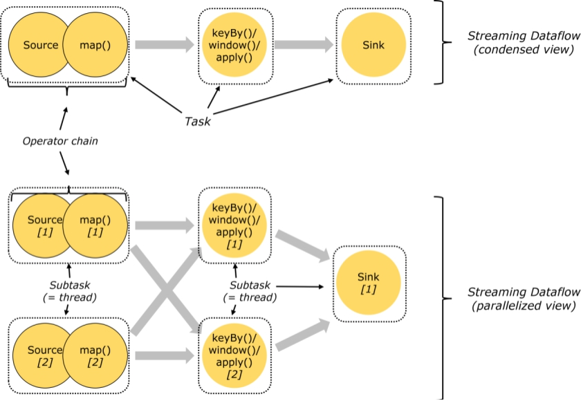
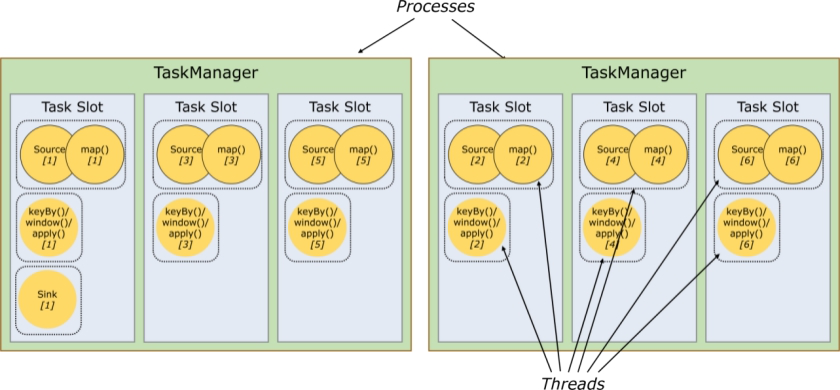

# Flink流处理框架课程笔记（讲师：lucas）

## 第一部分 Flink 概述 

### 第 1 节 什么是 Flink

​		Apache Flink是一个框架和分布式处理引擎，用于对无界和有界数据流进行有状态计算。Flink被设计在所有常见的集群环境中运行，以内存执行速度和任意规模来执行计算。

* Flink起源于2008年柏林理工大学的研究性项目Stratosphere

* 2014年该项目被捐赠给了Apache软件基金会

* Flink一跃成为Apache软件基金会的顶级项目之一

  **Flink的Logo**

  

  **Apache的Logo**

  

  ```
  在德语中，Flink一词表示快速和灵巧，项目采用一只松鼠的彩色图案作为logo，这不仅是因为松鼠具有快速和灵巧的特点，还因为柏林的松鼠有一种迷人的红棕色，而Flink的松鼠logo拥有可爱的尾巴，尾巴的颜色与Apache软件基金会的logo颜色相呼应，也就是说，这是一只Apache风格的松鼠。
  ```

### 第 2 节 Flink 特点

Flink 是一个开源的流处理框架，它具有以下特点

* 批流一体：统一批处理、流处理

* 分布式：Flink程序可以运行在多台机器上
* 高性能：处理性能比较高
* 高可用：Flink支持高可用性（HA）
* 准确：Flink可以保证数据处理的准确性

### 第 2 节 Flink 应用场景

​		**Flink主要应用于流式数据分析场景**

* 实时ETL

  集成流计算现有的诸多数据通道和SQL灵活的加工能力，对流式数据进行实时清晰、归并和结构化处理；同时，对离线数仓进行有效的补充和优化，并为数据实时传输提供可计算通道。

* 实时报表

  实时化采集、加工流式数据存储；实时监控和展现业务、客户各类指标，让数据化运营实时化。

* 监控预警

  对系统和用户行为进行实时监测和分析，以便及时发现危险行为

* 在线系统

  实时计算各类数据指标，并利用实时结果及时调整在线系统的相关策略，在各类内容投放、智能推送领域有大量的应用

### 第 4 节 Flink 核心组成及生态发展

**Flink核心组成**


* Deploy层：
  * 可以启动单个JVM，让Flink以Local模式运行
  * Flink也可以以Standalone 集群模式运行，同时也支持Flink ON YARN，Flink应用直接提交到YARN上面运行
  * Flink还可以运行在GCE（谷歌云服务）和EC2（亚马逊云服务）
* Core层（Runtime）：在Runtime之上提供了两套核心的API，DataStream API（流处理）和DataSet API（批处理）
* APIs & Libraries层：核心API之上又扩展了一些高阶的库和API
  * CEP流处理
  * Table API和SQL
  * Flink ML机器学习库
  * Gelly图计算

**Flink生态发展**


* **中间部分主要内容在上面Flink核心组成中已经提到**

* **输入Connectors（左侧部分）**

  流处理方式：包含Kafka（消息队列）、AWS kinesis（实时数据流服务）、RabbitMQ（消息队列）、NIFI（数据管道）、Twitter（API）

  批处理方式：包含HDFS（分布式文件系统）、HBase（分布式列式数据库）、Amazon S3（文件系统）、MapR FS（文件系统）、ALLuxio（基于内存分布式文件系统）

* **输出Connectors（右侧部分）**

  流处理方式：包含Kafka（消息队列）、AWS kinesis（实时数据流服务）、RabbitMQ（消息队列）、NIFI（数据管道）、Cassandra（NOSQL数据库）、ElasticSearch（全文检索）、HDFS rolling file（滚动文件）

  批处理方式：包含HBase（分布式列式数据库）、HDFS（分布式文件系统）

### 第 5 节 Flink 处理模型：流处理与批处理

​		Flink 专注于无限流处理，有限流处理是无限流处理的一种特殊情况

**无限流处理：**

* 输入的数据没有尽头，像水流一样源源不断
* 数据处理从当前或者过去的某一个时间 点开始，持续不停地进行

**有限流处理：**

* 从某一个时间点开始处理数据，然后在另一个时间点结束

* 输入数据可能本身是有限的（即输入数据集并不会随着时间增长），也可能出于分析的目的被人为地设定为有限集（即只分析某一个时间段内的事件）

  Flink封装了DataStream API进行流处理，封装了DataSet API进行批处理。

  同时，Flink也是一个批流一体的处理引擎，提供了Table API / SQL统一了批处理和流处理

### 第 6 节 流处理引擎的技术选型

​		市面上的流处理引擎不止Flink一种，其他的比如Storm、SparkStreaming、Trident等，实际应用时如何进行选型，给大家一些建议参考

* 流数据要进行状态管理，选择使用Trident、Spark Streaming或者Flink
* 消息投递需要保证At-least-once（至少一次）或者Exactly-once（仅一次）不能选择Storm
* 对于小型独立项目，有低延迟要求，可以选择使用Storm，更简单
* 如果项目已经引入了大框架Spark，实时处理需求可以满足的话，建议直接使用Spark中的Spark Streaming
* 消息投递要满足Exactly-once（仅一次），数据量大、有高吞吐、低延迟要求，要进行状态管理或窗口统计，建议使用Flink

## 第二部分 Flink快速应用

​		通过一个单词统计的案例，快速上手应用Flink，进行流处理（Streaming）和批处理（Batch）

### 第 1 节 单词统计案例（批数据）

#### 1.1 需求

​		统计一个文件中各个单词出现的次数，把统计结果输出到文件

#### 1.2 代码实现

  * 引入依赖

    ```xml
    
    <!--flink核心包-->
    <dependency>
        <groupId>org.apache.flink</groupId>
        <artifactId>flink-java</artifactId>
        <version>1.7.2</version>
    </dependency>
    <!--flink流处理包-->
    <dependency>
        <groupId>org.apache.flink</groupId>
        <artifactId>flink-streaming-java_2.12</artifactId>
        <version>1.7.2</version>
        <scope>provided</scope>
    </dependency>	
    ```

  * Java程序

    ```java
    package com.lagou.edu.batch;
    
    import org.apache.flink.api.common.functions.FlatMapFunction;
    import org.apache.flink.api.java.DataSet;
    import org.apache.flink.api.java.ExecutionEnvironment;
    import org.apache.flink.api.java.tuple.Tuple2;
    import org.apache.flink.util.Collector;
    
    /**
     * 单词统计（批数据处理）
     */
    public class WordCount {
        public static void main(String[] args) throws Exception {
            // 输入路径和出入路径通过参数传入，约定第一个参数为输入路径，第二个参数为输出路径
            String inPath = args[0];
            String outPath = args[1];
            // 获取Flink批处理执行环境
            ExecutionEnvironment executionEnvironment = ExecutionEnvironment.getExecutionEnvironment();
            // 获取文件中内容
            DataSet<String> text = executionEnvironment.readTextFile(inPath);
            // 对数据进行处理
            DataSet<Tuple2<String, Integer>> dataSet = text.flatMap(new LineSplitter()).groupBy(0).sum(1);
            dataSet.writeAsCsv(outputFile,"\n","").setParallelism(1);
            // 触发执行程序
            executionEnvironment.execute("wordcount batch process");
        }
    
    
        static class LineSplitter implements FlatMapFunction<String, Tuple2<String,Integer>> {
            @Override
            public void flatMap(String line, Collector<Tuple2<String, Integer>> collector) throws Exception {
                for (String word:line.split(" ")) {
                    collector.collect(new Tuple2<>(word,1));
                }
            }
        }
    }
    ```


```
<properties>    <project.build.sourceEncoding>UTF-8</project.build.sourceEncoding>    <maven.compiler.source>11</maven.compiler.source>    <maven.compiler.target>11</maven.compiler.target></properties>
```

### 第 2 节 单词统计案例（流数据）

nc

 netcat:

#### 2.1 需求

​		Socket模拟实时发送单词，使用Flink实时接收数据，对指定时间窗口内（如5s）的数据进行聚合统计，每隔1s汇总计算一次，并且把时间窗口内计算结果打印出来。

#### 2.2 代码实现

```java
package com.lagou.edu.stream;

import org.apache.flink.api.common.functions.FlatMapFunction;
import org.apache.flink.api.java.tuple.Tuple2;
import org.apache.flink.streaming.api.datastream.DataStreamSource;
import org.apache.flink.streaming.api.datastream.SingleOutputStreamOperator;
import org.apache.flink.streaming.api.environment.StreamExecutionEnvironment;
import org.apache.flink.streaming.api.windowing.time.Time;
import org.apache.flink.util.Collector;

/**
 * 	Socket模拟实时发送单词，使用Flink实时接收数据，对指定时间窗口内（如5s）的数据进行聚合统计，每隔1s汇总计算一次，并且把时间窗口内计算结果打印出来。
 teacher2 ip : 113.31.105.128
 */
public class WordCount {

    public static void main(String[] args) throws Exception {
        // 监听的ip和端口号，以main参数形式传入，约定第一个参数为ip，第二个参数为端口
        String ip = args[0];
        int port = Integer.parseInt(args[1]);
        // 获取Flink流执行环境
        StreamExecutionEnvironment streamExecutionEnvironment = StreamExecutionEnvironment.getExecutionEnvironment();
        // 获取socket输入数据
        DataStreamSource<String> textStream = streamExecutionEnvironment.socketTextStream(ip, port, "\n");

        SingleOutputStreamOperator<Tuple2<String, Long>> tuple2SingleOutputStreamOperator = textStream.flatMap(new FlatMapFunction<String, Tuple2<String, Long>>() {
            @Override
            public void flatMap(String s, Collector<Tuple2<String, Long>> collector) throws Exception {
                String[] splits = s.split("\\s");
                for (String word : splits) {
                    collector.collect(Tuple2.of(word, 1l));
                }
            }
        });

        SingleOutputStreamOperator<Tuple2<String, Long>> word = tuple2SingleOutputStreamOperator.keyBy("word")
                .timeWindow(Time.seconds(2), Time.seconds(1))
                .sum(1);
        // 打印数据
        word.print();
        // 触发任务执行
        streamExecutionEnvironment.execute("wordcount stream process");

    }
}
```

​	  Flink程序开发的流程总结如下：

1）获得一个执行环境

2）加载/创建初始化数据

3）指定数据操作的算子

4）指定结果数据存放位置

5）调用execute()触发执行程序

**注意：Flink程序是延迟计算的，只有最后调用execute()方法的时候才会真正触发执行程序**

## 第三部分 Flink体系结构

### 第 1 节 Flink的重要角色


​		Flink是非常经典的Master/Slave结构实现，JobManager是Master，TaskManager是Slave。

* JobManager处理器（Master）
  * 协调分布式执行，它们用来调度task，协调检查点(CheckPoint)，协调失败时恢复等
  
  task：任务。同一个阶段的多个SubTask的集合
  
    SubTask：
  
    电商：
  
  * Flink运行时至少存在一个master处理器，如果配置高可用模式则会存在多个master处理器，它们其中有一个是leader，而其他的都是standby。
  
* TaskManager处理器（Slave）

  ​		也称之为Worker

  * 主要职责是从JobManager处接收任务, 并部署和启动任务, 接收上游的数据并处理
  * Task Manager 是在 JVM 中的一个或多个线程中执行任务的工作节点

### 第 2 节 Flink运行架构

#### 2.1 Flink程序结构

​		Flink程序的基本构建块是**流**和**转换**（请注意，Flink的DataSet API中使用的DataSet也是内部流 ）。从概念上讲，流是（可能永无止境的）数据记录流，而转换是将一个或多个流输入，并产生一个或多个输出流。


​		上图表述了Flink的应用程序结构，有Source（源头）、Transformation（转换）、Sink（接收器）三个重要组成部分

* Source

  ​		数据源，定义Flink从哪里加载数据，Flink 在流处理和批处理上的 source 大概有 4 类：基于本地集合的 source、基于文件的 source、基于网络套接字的 source、自定义的 source。自定义的 source 常见的有 Apache kafka、RabbitMQ 等。

* Transformation

  ​		数据转换的各种操作，也称之为算子，有 Map / FlatMap / Filter / KeyBy / Reduce  / Window等，可以将数据转换计算成你想要的数据。

* Sink

  ​		接收器，Flink 将转换计算后的数据发送的地点 ，定义了结果数据的输出方向，Flink 常见的 Sink 大概有如下几类：写入文件、打印出来、写入 socket 、自定义的 sink 。自定义的 sink 常见的有 Apache kafka、RabbitMQ、MySQL、ElasticSearch、Apache Cassandra、HDFS等。	

#### 2.2 Task和SubTask

* Task 是一个阶段多个功能相同 SubTask 的集合，类似于 Spark 中的 TaskSet。

* SubTask（子任务）

  ​		SubTask 是 Flink 中任务最小执行单元，是一个 Java 类的实例，这个 Java 类中有属性和方法，完成具体的计算逻辑

  ​		比如一个执行操作map，分布式的场景下会在多个线程中同时执行，每个线程中执行的都叫做一个SubTask（在2.3节的图中也能够体现）

#### 2.3 Operator chain(操作器链)

​		Flink的所有操作都称之为Operator，客户端在提交任务的时候会对Operator进行优化操作，能进行合并的Operator会被合并为一个Operator，合并后的Operator称为Operator chain，实际上就是一个执行链，每个执行链会在TaskManager上一个独立的线程中执行。shuffle



#### 2.5 任务槽和槽共享

​		任务槽也叫做task-slot、槽共享也叫做slot sharing


·		每个TaskManager是一个JVM的进程, 可以在不同的线程中执行一个或多个子任务。 

​		为了控制一个worker能接收多少个task。worker通过task slot来进行控制（一个worker至少有一个task slot）

* 任务槽

  ​		每个task slot表示TaskManager拥有资源的一个固定大小的子集。 一般来说:我们分配槽的个数都是和CPU的核数相等,比如6核,那么就分配6个槽.

  ​		Flink将进程的内存进行了划分到多个Slot中。假设一个TaskManager机器有3个slot，那么每个slot占有1/3的内存（平分）。

  ​		内存被划分到不同的slot之后可以获得如下好处: 

  * TaskManager最多能同时并发执行的任务是可以控制的，那就是3个，因为不能超过slot的数量
  * slot有独占的内存空间，这样在一个TaskManager中可以运行多个不同的作业，作业之间不受影响

* 槽共享

  ​		默认情况下，Flink允许子任务subtast（map[1]  map[2] keyby[1]  keyby[2] 共享插槽，即使它们是不同任务的子任务，只要它们来自同一个作业。结果是一个槽可以保存作业的整个管道。

  

## 第四部分 Flink安装和部署

​		Flink支持多种安装模式

*  local（本地）：单机模式，一般本地开发调试使用
*  StandAlone 独立模式：Flink自带集群，自己管理资源调度，生产环境也会有所应用
*  Yarn模式：计算资源统一由Hadoop YARN管理，生产环境应用较多

### 第 1 节 环境准备工作

#### 1.1 基础环境

* jdk1.8及以上【配置JAVA_HOME环境变量】

* ssh免密码登录【集群内节点之间免密登录】

#### 1.2 安装包下载

配套资料文件夹中提供，使用Flink1.7.2版本

 #### 1.3 集群规划

| teacher1               | teacher2    | teacher3    |
| ---------------------- | ----------- | ----------- |
| JobManager+TaskManager | TaskManager | TaskManager |

#### 1.4 StandAlone模式部署

Step1、Flink安装包上传到teacher1对应目录并解压

Step2、修改 flink/conf/flink-conf.yaml 文件

```shell
 jobmanager.rpc.address: teacher1
 taskmanager.numberOfTaskSlots: 2
```

Step3、修改 /conf/slave文件

```shell
teacher1
teacher2
teacher3
```

Step4、standalone模式启动

```
bin目录下执行./start-cluster.sh
```

Step5、jps进程查看核实

```
3857 TaskManagerRunner
3411 StandaloneSessionClusterEntrypoint
3914 Jps
```

Step6、查看Flink的web页面   ip:8081/#/overview


Step7、集群模式下运行example测试

```
./flink run ../examples/streaming/WordCount.jar
```

Step8、查看结果文件

**注意：集群搭建完毕后，Flink程序就可以达成Jar，在集群环境下类似于Step7中一样提交执行计算任务**

**打jar包插件：**

```
<build>
        <plugins>
            <!-- 打jar插件 -->
            <plugin>
                <groupId>org.apache.maven.plugins</groupId>
                <artifactId>maven-shade-plugin</artifactId>
                <version>2.4.3</version>
                <executions>
                    <execution>
                        <phase>package</phase>
                        <goals>
                            <goal>shade</goal>
                        </goals>
                        <configuration>
                            <filters>
                                <filter>
                                    <artifact>*:*</artifact>
                                    <excludes>
                                        <exclude>META-INF/*.SF</exclude>
                                        <exclude>META-INF/*.DSA</exclude>
                                        <exclude>META-INF/*.RSA</exclude>
                                    </excludes>
                                </filter>
                            </filters>
                        </configuration>
                    </execution>
                </executions>
            </plugin>

        </plugins>
    </build>
```

#### 1.4 StandAlone模式部署

(1)启动一个YARN session(Start a long-running Flink cluster on YARN)；

配置文件 yarn-site.xml

```
<property>
    <name>yarn.nodemanager.pmem-check-enabled</name>
    <value>false</value>
</property>
<property>
    <name>yarn.nodemanager.vmem-check-enabled</name>
    <value>false</value>
</property>
  <property>
    <name>yarn.resourcemanager.address</name>
    <value>teacher2:8032</value>
  </property>
  <property>
    <name>yarn.resourcemanager.scheduler.address</name>
    <value>teacher2:8030</value>
  </property>
  <property>
    <name>yarn.resourcemanager.resource-tracker.address</name>
    <value>teacher2:8031</value>
  </property>
```

注意：yarn-site的修改需要在集群的每一台机器上执行

启动hadoop （hdfs-yarn)

 /export/servers/flink/bin/yarn-session.sh -n 2 -tm 800 -s 1 -d

  申请2个CPU、1600M内存

  bin/yarn-session.sh -n 2 -tm 800 -s 1 -d

\# -n 表示申请2个容器，这里指的就是多少个taskmanager

\# -s 表示每个TaskManager的slots数量

\# -tm 表示每个TaskManager的内存大小

\# -d 表示以后台程序方式运行

l 解释

上面的命令的意思是，同时向Yarn申请3个container

(即便只申请了两个，因为ApplicationMaster和Job Manager有一个额外的容器。一旦将Flink部署到YARN群集中，它就会显示Job Manager的连接详细信息)

 2 个 Container 启动 TaskManager -n 2，每个 TaskManager 拥有1个 Task Slot -s 1，并且向每个 TaskManager 的 Container 申请 800M 的内存，以及一个ApplicationMaster--Job Manager。

如果不想让Flink YARN客户端始终运行，那么也可以启动分离的 YARN会话。该参数被称为-d或--detached。在这种情况下，Flink YARN客户端只会将Flink提交给集群，然后关闭它自己

 yarn-session.sh(开辟资源) + flink run(提交任务)

\- 使用Flink中的yarn-session(yarn客户端)，会启动两个必要服务JobManager和TaskManager

\- 客户端通过flink run提交作业

\- yarn-session会一直启动，不停地接收客户端提交的作业

\- 如果有大量的小作业/任务比较小，或者工作时间短，适合使用这种方式，减少资源创建的时间.

(2)直接在YARN上提交运行Flink作业(Run a Flink job on YARN)


bin/flink run -m yarn-cluster -yn 2 -yjm 1024 -ytm 1024 /export/servers/flink/examples/batch/WordCount.jar

\# -m  jobmanager的地址

\# -yn 表示TaskManager的个数 

  

停止yarn-cluster：

yarn application -kill application_1527077715040_0003

 

rm -rf /tmp/.yarn-properties-root

## 第五部分 Flink常用API详解

### 第 1 节 Flink DataStream常用API

​		DataStream API主要分为3块：DataSource、Transformation、Sink

* DataSource是程序的数据源输入，可以通过StreamExecutionEnvironment.addSource(sourceFuntion)为程序添加一个数据源
* Transformation是具体的操作，它对一个或多个输入数据源进行计算处理，比如Map、FlatMap和Filter等操作
* Sink是程序的输出，它可以把Transformation处理之后的数据输出到指定的存储介质中。

#### 1.1 DataSource

​		Flink针对DataStream提供了大量已经实现的DataSource（数据源接口），比如如下4种

1）基于文件

​		readTextFile(path)

读取文本文件，文件遵循TextInputFormat逐行读取规则并返回

tip:本地Idea读hdfs需要：

a、System.setProperty("HADOOP_USER_NAME","...");

b、Window配置hadoop

c、依赖：

```
 <dependency>
            <groupId>org.apache.flink</groupId>
            <artifactId>flink-hadoop-compatibility_2.11</artifactId>
            <version>1.7.2</version>
        </dependency>
        <dependency>
            <groupId>org.apache.hadoop</groupId>
            <artifactId>hadoop-common</artifactId>
            <version>2.7.2</version>
        </dependency>
        <dependency>
            <groupId>org.apache.hadoop</groupId>
            <artifactId>hadoop-hdfs</artifactId>
            <version>2.7.2</version>
        </dependency>
        <dependency>
            <groupId>org.apache.hadoop</groupId>
            <artifactId>hadoop-client</artifactId>
            <version>2.7.2</version>
        </dependency>
```

2）基于Socket

​		socketTextStream

从Socket中读取数据，元素可以通过一个分隔符分开

3）基于集合

​		fromCollection(Collection)

通过Java的Collection集合创建一个数据流，集合中的所有元素必须是相同类型的


如果满足以下条件，Flink将数据类型识别为POJO类型（并允许“按名称”字段引用）：

- 该类是共有且独立的（没有非静态内部类）
- 该类有共有的无参构造方法
- 类（及父类）中所有的不被static、transient修饰的属性要么有公有的（且不被final修饰），要么是包含共有的getter和setter方法，这些方法遵循java bean命名规范。

实例：

```java
package com.lagou.edu.streamsource;

import org.apache.flink.api.common.functions.FilterFunction;
import org.apache.flink.streaming.api.datastream.DataStreamSource;
import org.apache.flink.streaming.api.datastream.SingleOutputStreamOperator;
import org.apache.flink.streaming.api.environment.StreamExecutionEnvironment;

import java.util.ArrayList;

public class StreamFromCollection {
    public static void main(String[] args) throws Exception {
        StreamExecutionEnvironment env = StreamExecutionEnvironment.getExecutionEnvironment();
//        DataStreamSource<String> data = env.fromElements("spark", "flink");
        ArrayList<People> peopleList = new ArrayList<People>();
        peopleList.add(new People("lucas", 18));
        peopleList.add(new People("jack", 30));
        peopleList.add(new People("jack", 40));
        DataStreamSource<People> data = env.fromCollection(peopleList);
//        DataStreamSource<People> data = env.fromElements(new People("lucas", 18), new People("jack", 30), new People("jack", 40));
        SingleOutputStreamOperator<People> filtered = data.filter(new FilterFunction<People>() {
            public boolean filter(People people) throws Exception {
                return people.age > 20;
            }
        });
        filtered.print();
        env.execute();


    }

    public static class People{
        public String name;
        public Integer age;

        public People(String name, Integer age) {
            this.name = name;
            this.age = age;
        }

        public String getName() {
            return name;
        }

        public void setName(String name) {
            this.name = name;
        }

        public Integer getAge() {
            return age;
        }

        public void setAge(Integer age) {
            this.age = age;
        }

        @Override
        public String toString() {
            return "People{" +
                    "name='" + name + '\'' +
                    ", age=" + age +
                    '}';
        }
    }
}

```

4）自定义输入

​		addSource可以实现读取第三方数据源的数据

​		Flink也提供了一批内置的Connector（连接器），如下表列了几个主要的

| 连接器               | 是否提供Source支持 | 是否提供Sink支持 |
| -------------------- | ------------------ | ---------------- |
| Apache Kafka         | 是                 | 是               |
| ElasticSearch        | 否                 | 是               |
| HDFS                 | 否                 | 是               |
| Twitter Streaming PI | 是                 | 否               |

Kafka连接器

a、依赖：

```
<dependency>
            <groupId>org.apache.flink</groupId>
            <artifactId>flink-connector-kafka_2.11</artifactId>
            <version>1.7.2</version>
        </dependency>
```

b、代码：

```
import org.apache.flink.api.java.tuple.Tuple2;
import org.apache.flink.streaming.api.datastream.DataStreamSource;
import org.apache.flink.streaming.api.datastream.SingleOutputStreamOperator;
import org.apache.flink.streaming.api.environment.StreamExecutionEnvironment;
import org.apache.flink.streaming.connectors.kafka.FlinkKafkaConsumer;
import org.apache.flink.util.Collector;

import java.util.Properties;

public class StreamFromKafka {
    public static void main(String[] args) throws Exception {
        StreamExecutionEnvironment env = StreamExecutionEnvironment.getExecutionEnvironment();
        Properties properties = new Properties();
        properties.setProperty("bootstrap.servers","teacher2:9092");
        FlinkKafkaConsumer<String> consumer = new FlinkKafkaConsumer<String>("mytopic2", new SimpleStringSchema(), properties);
        DataStreamSource<String> data = env.addSource(consumer);
        SingleOutputStreamOperator<Tuple2<String, Integer>> wordAndOne = data.flatMap(new FlatMapFunction<String, Tuple2<String, Integer>>() {
            public void flatMap(String s, Collector<Tuple2<String, Integer>> collector) throws Exception {
                for (String word : s.split(" ")) {
                    collector.collect(Tuple2.of(word, 1));
                }
            }
        });
        SingleOutputStreamOperator<Tuple2<String, Integer>> result = wordAndOne.keyBy(0).sum(1);
        result.print();
        env.execute();
    }
}
```

c、启动kafka

./kafka-server-start.sh -daemon ../config/server.properties

d、创建topic

bin/kafka-topics.sh --create --zookeepper teacher1:2181 --replication-factor 1 --partitions 1 --topic mytopic2

e、启动控制台kafka生产者

bin/kafka-console-producer.sh --broker-list teacher2:9092 --topic mytopic2

#### 1.2 Transformation

Flink针对DataStream提供了大量的已经实现的算子

* Map：输入一个元素，然后返回一个元素，中间可以进行清洗转换等操作

* FlatMap：输入一个元素，可以返回0个、1个或者多个元素

* Filter：过滤函数，对传入的数据进行判断，符合条件的数据会被留下

* KeyBy：根据指定的Key进行分组，Key相同的数据会进入同一个分区

  KeyBy有两种典型用法

  （1）DataStream.keyBy("someKey")指定对象中的someKey字段作为分组Key

  （2）DataStream.keyBy(0)指定Tuple中的第一个元素作为分组Key

* Reduce：对数据进行聚合操作，结合当前元素和上一次Reduce返回的值进行聚合操作，然后返回一个新的值

* Aggregations：sum()、min()、max()等

案例：

思路：

创建自定义数据源（流）   1秒钟产生一个新数据

​	-----实现SourceFunction<>接口，tip:SourceFuntion和SourceContext需要指明泛型，否则报InvalidTypesException异常

创建自定义分区，奇偶分区

​	-----实现Partitioner<>接口

#### 1.3 Sink

Flink针对DataStream提供了大量的已经实现的数据目的地（Sink），具体如下所示

* writeAsText()：讲元素以字符串形式逐行写入，这些字符串通过调用每个元素的toString()方法来获取

* print()/printToErr()：打印每个元素的toString()方法的值到标准输出或者标准错误输出流中

* 自定义输出：addSink可以实现把数据输出到第三方存储介质中

  Flink提供了一批内置的Connector，其中有的Connector会提供对应的Sink支持，如1.1节中表所示

案例：将流数据下沉到redis中

1、依赖：

```
        <dependency>
            <groupId>org.apache.flink</groupId>
            <artifactId>flink-connector-redis_2.11</artifactId>
            <version>1.1.5</version>
        </dependency>
```

2、关键代码：

```java
//封装
        SingleOutputStreamOperator<Tuple2<String, String>> l_wordsData = data.map(new MapFunction<String, Tuple2<String, String>>() {
            @Override
            public Tuple2<String, String> map(String value) throws Exception {
                return new Tuple2<>("l_words", value);
            }
        });

        FlinkJedisPoolConfig conf = new FlinkJedisPoolConfig.Builder().setHost("teacher2").setPort(6379).build();

        RedisSink<Tuple2<String, String>> redisSink = new RedisSink<>(conf, new MyRedisMapper());
        l_wordsData.addSink(redisSink);
```

```java
 public static class MyMapper implements RedisMapper<Tuple2<String,String>> {

        @Override
        public RedisCommandDescription getCommandDescription() {
            return new RedisCommandDescription(RedisCommand.LPUSH);
        }

        @Override
        public String getKeyFromData(Tuple2<String,String> data) {
            return data.f0;
        }

        @Override
        public String getValueFromData(Tuple2<String,String> data) {
            return data.f1;
        }
    }
```


### 第 2 节 Flink DataSet常用API

​		DataSet API同DataStream API一样有三个组成部分，各部分作用对应一致，此处不再赘述

#### 2.1 DataSource

对DataSet批处理而言，较为频繁的操作是读取HDFS中的文件数据，因为这里主要介绍两个DataSource组件

* 基于集合

  fromCollection(Collection)，主要是为了方便测试使用

* 基于文件

  readTextFile(path)，基于HDFS中的数据进行计算分析

#### 2.2 Transformation

​		Flink针对DataSet也提供了大量的已经实现的算子，和DataStream计算很类似

* Map：输入一个元素，然后返回一个元素，中间可以进行清洗转换等操作
* FlatMap：输入一个元素，可以返回0个、1个或者多个元素
  * Filter：过滤函数，对传入的数据进行判断，符合条件的数据会被留下
  * Reduce：对数据进行聚合操作，结合当前元素和上一次Reduce返回的值进行聚合操作，然后返回一个新的值
  * Aggregations：sum()、min()、max()等

#### 2.3 Sink

​		Flink针对DataStream提供了大量的已经实现的数据目的地（Sink），具体如下所示

* writeAsText()：将元素以字符串形式逐行写入，这些字符串通过调用每个元素的toString()方法来获取

* writeAsCsv()：将元组以逗号分隔写入文件中，行及字段之间的分隔是可配置的，每个字段的值来自对象的toString()方法

* print()/pringToErr()：打印每个元素的toString()方法的值到标准输出或者标准错误输出流中

  Flink提供了一批内置的Connector，其中有的Connector会提供对应的Sink支持，如1.1节中表所示

## 第六部分 Flink Window窗口机制

​		**Flink Window 背景**

​		Flink认为Batch是Streaming的一个特例，因此Flink底层引擎是一个流式引擎，在上面实现了流处理和批处理。而Window就是从Streaming到Batch的桥梁。

​		通俗讲，Window是用来对一个无限的流设置一个有限的集合，从而在有界的数据集上进行操作的一种机制。流上的集合由Window来划定范围，比如“计算过去10分钟”或者“最后50个元素的和”。

​		Window可以由时间（Time Window）（比如每30s）或者数据（Count Window）（如每100个元素）驱动。DataStream API提供了Time和Count的Window。

​		**Flink Window 总览**

- Window 是flink处理无限流的核心,Windows将流拆分为有限大小的“桶”，我们可以在其上应用计算。
- Flink 认为 Batch 是 Streaming 的一个特例，所以 Flink 底层引擎是一个流式引擎，在上面实现了流处理和批处理。
- 而窗口（window）就是从 Streaming 到 Batch 的一个桥梁。
- Flink 提供了非常完善的窗口机制。
- 在流处理应用中，数据是连续不断的，因此我们不可能等到所有数据都到了才开始处理。
- 当然我们可以每来一个消息就处理一次，但是有时我们需要做一些聚合类的处理，例如：在过去的1分钟内有多少用户点击了我们的网页。
- 在这种情况下，我们必须定义一个窗口，用来收集最近一分钟内的数据，并对这个窗口内的数据进行计算。
- 窗口可以是基于时间驱动的（Time Window，例如：每30秒钟）
- 也可以是基于数据驱动的（Count Window，例如：每一百个元素）
- 同时基于不同事件驱动的窗口又可以分成以下几类：
  - 翻滚窗口 (Tumbling Window, 无重叠)
  - 滑动窗口 (Sliding Window, 有重叠)
  - 会话窗口 (Session Window, 活动间隙)
  - 全局窗口 (略)
- Flink要操作窗口，先得将StreamSource 转成WindowedStream

步骤：

1、获取流数据源

2、获取窗口

3、操作窗口数据

4、输出窗口数据

### 第 1 节 时间窗口（TimeWindow） 

#### 1.1 滚动时间窗口（Tumbling Window）


​		将数据依据固定的窗口长度对数据进行切分

​		特点：时间对齐，窗口长度固定，没有重叠

​		**代码示例**

```java
package com.lagou.edu.flink.window;

import org.apache.flink.api.common.functions.MapFunction;
import org.apache.flink.api.java.tuple.Tuple;
import org.apache.flink.api.java.tuple.Tuple2;
import org.apache.flink.streaming.api.datastream.DataStreamSource;
import org.apache.flink.streaming.api.datastream.KeyedStream;
import org.apache.flink.streaming.api.datastream.SingleOutputStreamOperator;
import org.apache.flink.streaming.api.datastream.WindowedStream;
import org.apache.flink.streaming.api.environment.StreamExecutionEnvironment;
import org.apache.flink.streaming.api.windowing.time.Time;
import org.apache.flink.streaming.api.windowing.windows.GlobalWindow;
import org.apache.flink.streaming.api.windowing.windows.TimeWindow;

import java.text.SimpleDateFormat;
import java.util.Random;

/**
 * 翻滚窗口：窗口不重叠
 * 1、基于时间驱动
 * 2、基于事件驱动
 */
public class TumblingWindow {

    public static void main(String[] args) {
    //设置执行环境，类似spark中初始化sparkContext
        StreamExecutionEnvironment env = StreamExecutionEnvironment.getExecutionEnvironment();
        
        env.setParallelism(1);

        DataStreamSource<String> dataStreamSource = env.socketTextStream("teache2", 7777);

        SingleOutputStreamOperator<Tuple2<String, Integer>> mapStream = dataStreamSource.map(new MapFunction<String, Tuple2<String, Integer>>() {
            @Override
            public Tuple2<String, Integer> map(String value) throws Exception {

                SimpleDateFormat format = new SimpleDateFormat("yyyy-MM-dd HH:mm:ss.SSS");

                long timeMillis = System.currentTimeMillis();

                int random = new Random().nextInt(10);

                System.out.println("value: " + value + " random: " + random + "timestamp: " + timeMillis + "|" + format.format(timeMillis));

                return new Tuple2<String, Integer>(value, random);
            }
        });

        KeyedStream<Tuple2<String, Integer>, Tuple> keyedStream = mapStream.keyBy(0);


        // 基于时间驱动，每隔10s划分一个窗口
        WindowedStream<Tuple2<String, Integer>, Tuple, TimeWindow> timeWindow = keyedStream.timeWindow(Time.seconds(10));

        // 基于事件驱动, 每相隔3个事件(即三个相同key的数据), 划分一个窗口进行计算
        // WindowedStream<Tuple2<String, Integer>, Tuple, GlobalWindow> countWindow = keyedStream.countWindow(3);

        // apply是窗口的应用函数，即apply里的函数将应用在此窗口的数据上。
        timeWindow.apply(new MyTimeWindowFunction()).print();
        // countWindow.apply(new MyCountWindowFunction()).print();

        try {
            // 转换算子都是lazy init的, 最后要显式调用 执行程序
            env.execute();
        } catch (Exception e) {
            e.printStackTrace();
        }

    }
}
```

##### 1.2.1 基于时间驱动

​		场景：我们需要统计每一分钟中用户购买的商品的总数，需要将用户的行为事件按每一分钟进行切分，这种切分被成为翻滚时间窗口（Tumbling Time Window）

```java
package com.lagou.edu.flink.window;

import org.apache.flink.api.java.tuple.Tuple;
import org.apache.flink.api.java.tuple.Tuple2;
import org.apache.flink.streaming.api.functions.windowing.WindowFunction;
import org.apache.flink.streaming.api.windowing.windows.TimeWindow;
import org.apache.flink.util.Collector;

import java.text.SimpleDateFormat;

public class MyTimeWindowFunction implements WindowFunction<Tuple2<String,Integer>, String, Tuple, TimeWindow> {

    @Override
    public void apply(Tuple tuple, TimeWindow window, Iterable<Tuple2<String, Integer>> input, Collector<String> out) throws Exception {
        SimpleDateFormat format = new SimpleDateFormat("yyyy-MM-dd HH:mm:ss.SSS");

        int sum = 0;

        for(Tuple2<String,Integer> tuple2 : input){
            sum +=tuple2.f1;
        }

        long start = window.getStart();
        long end = window.getEnd();

        out.collect("key:" + tuple.getField(0) + " value: " + sum + "| window_start :"
                + format.format(start) + "  window_end :" + format.format(end)
        );

    }
}
```

##### 1.2.2 基于事件驱动

​		场景：当我们想要每100个用户的购买行为作为驱动，那么每当窗口中填满100个”相同”元素了，就会对窗口进行计算。

```java
package com.lagou.edu.flink.window;

import org.apache.flink.api.java.tuple.Tuple;
import org.apache.flink.api.java.tuple.Tuple2;
import org.apache.flink.streaming.api.functions.windowing.WindowFunction;
import org.apache.flink.streaming.api.windowing.windows.GlobalWindow;
import org.apache.flink.util.Collector;

import java.text.SimpleDateFormat;

public class MyCountWindowFunction implements WindowFunction<Tuple2<String, Integer>, String, Tuple, GlobalWindow> {

    @Override
    public void apply(Tuple tuple, GlobalWindow window, Iterable<Tuple2<String, Integer>> input, Collector<String> out) throws Exception {
        SimpleDateFormat format = new SimpleDateFormat("yyyy-MM-dd HH:mm:ss.SSS");

        int sum = 0;

        for (Tuple2<String, Integer> tuple2 : input){
            sum += tuple2.f1;
        }
        //无用的时间戳，默认值为： Long.MAX_VALUE,因为基于事件计数的情况下，不关心时间。
        long maxTimestamp = window.maxTimestamp();

        out.collect("key:" + tuple.getField(0) + " value: " + sum + "| maxTimeStamp :"
                + maxTimestamp + "," + format.format(maxTimestamp)
        );
    }
}
```

#### 1.2 滑动时间窗口（Sliding Window）


​		滑动窗口是固定窗口的更广义的一种形式，滑动窗口由固定的窗口长度和滑动间隔组成

​		特点：窗口长度固定，可以有重叠

##### 1.2.1 基于时间的滑动窗口

​		场景: 我们可以每30秒计算一次最近一分钟用户购买的商品总数

##### 1.2.2 基于事件的滑动窗口

​		场景: 每10个 “相同”元素计算一次最近100个元素的总和

​		**代码实现**

```java
package com.lagou.edu.flink.window;

import org.apache.flink.api.common.functions.MapFunction;
import org.apache.flink.api.java.tuple.Tuple;
import org.apache.flink.api.java.tuple.Tuple2;
import org.apache.flink.streaming.api.datastream.DataStreamSource;
import org.apache.flink.streaming.api.datastream.KeyedStream;
import org.apache.flink.streaming.api.datastream.SingleOutputStreamOperator;
import org.apache.flink.streaming.api.datastream.WindowedStream;
import org.apache.flink.streaming.api.environment.StreamExecutionEnvironment;
import org.apache.flink.streaming.api.windowing.time.Time;
import org.apache.flink.streaming.api.windowing.windows.GlobalWindow;
import org.apache.flink.streaming.api.windowing.windows.TimeWindow;

import java.text.SimpleDateFormat;
import java.util.Random;

/**
 * 滑动窗口：窗口可重叠
 * 1、基于时间驱动
 * 2、基于事件驱动
 */
public class SlidingWindow {

    public static void main(String[] args) {
        // 设置执行环境, 类似spark中初始化SparkContext
        StreamExecutionEnvironment env = StreamExecutionEnvironment.getExecutionEnvironment();
        
        env.setParallelism(1);

        DataStreamSource<String> dataStreamSource = env.socketTextStream("teacher2", 7777);

        SingleOutputStreamOperator<Tuple2<String, Integer>> mapStream = dataStreamSource.map(new MapFunction<String, Tuple2<String, Integer>>() {
            @Override
            public Tuple2<String, Integer> map(String value) throws Exception {
                SimpleDateFormat format = new SimpleDateFormat("yyyy-MM-dd HH:mm:ss.SSS");
                long timeMillis = System.currentTimeMillis();

                int random = new Random().nextInt(10);
                System.err.println("value : " + value + " random : " + random + " timestamp : " + timeMillis + "|" + format.format(timeMillis));

                return new Tuple2<String, Integer>(value, random);
            }
        });
        KeyedStream<Tuple2<String, Integer>, Tuple> keyedStream = mapStream.keyBy(0);

        //基于时间驱动，每隔5s计算一下最近10s的数据
     //   WindowedStream<Tuple2<String, Integer>, Tuple, TimeWindow> timeWindow = keyedStream.timeWindow(Time.seconds(10), Time.seconds(5));
        //基于事件驱动，每隔2个事件，触发一次计算，本次窗口的大小为3，代表窗口里的每种事件最多为3个
        WindowedStream<Tuple2<String, Integer>, Tuple, GlobalWindow> countWindow = keyedStream.countWindow(3, 2);

     //   timeWindow.sum(1).print();

        countWindow.sum(1).print();

     //   timeWindow.apply(new MyTimeWindowFunction()).print();

        try {
            env.execute();
        } catch (Exception e) {
            e.printStackTrace();
        }
    }
}

```


#### 1.3 会话窗口（Session Window）


​       由一系列事件组合一个指定时间长度的timeout间隙组成，类似于web应用的session，也就是一段时间没有接收到新数据就会生成新的窗口。

session窗口分配器通过session活动来对元素进行分组，session窗口跟滚动窗口和滑动窗口相比，不会有重叠和固定的开始时间和结束时间的情况

session窗口在一个固定的时间周期内不再收到元素，即非活动间隔产生，那么这个窗口就会关闭。

一个session窗口通过一个session间隔来配置，这个session间隔定义了非活跃周期的长度，当这个非活跃周期产生，那么当前的session将关闭并且后续的元素将被分配到新的session窗口中去。

​       **特点**

​	   会话窗口不重叠，没有固定的开始和结束时间

​	   与翻滚窗口和滑动窗口相反, 当会话窗口在一段时间内没有接收到元素时会关闭会话窗口。

​		后续的元素将会被分配给新的会话窗口

​		**案例描述**

​		计算每个用户在活跃期间总共购买的商品数量，如果用户30秒没有活动则视为会话断开

​		**代码实现**

```java
package com.lagou.edu.flink.window;

import org.apache.flink.api.common.functions.MapFunction;
import org.apache.flink.api.java.tuple.Tuple;
import org.apache.flink.api.java.tuple.Tuple2;
import org.apache.flink.streaming.api.datastream.DataStreamSource;
import org.apache.flink.streaming.api.datastream.KeyedStream;
import org.apache.flink.streaming.api.datastream.SingleOutputStreamOperator;
import org.apache.flink.streaming.api.datastream.WindowedStream;
import org.apache.flink.streaming.api.environment.StreamExecutionEnvironment;
import org.apache.flink.streaming.api.windowing.assigners.ProcessingTimeSessionWindows;
import org.apache.flink.streaming.api.windowing.time.Time;
import org.apache.flink.streaming.api.windowing.windows.TimeWindow;

import java.text.SimpleDateFormat;
import java.util.Random;

public class SessionWindow {

    public static void main(String[] args) {

        // 设置执行环境, 类似spark中初始化sparkContext

        StreamExecutionEnvironment env = StreamExecutionEnvironment.getExecutionEnvironment();

        env.setParallelism(1);

        DataStreamSource<String> dataStreamSource = env.socketTextStream("teacher2", 7777);

        SingleOutputStreamOperator<Tuple2<String, Integer>> mapStream = dataStreamSource.map(new MapFunction<String, Tuple2<String, Integer>>() {
            @Override
            public Tuple2<String, Integer> map(String value) throws Exception {
                SimpleDateFormat format = new SimpleDateFormat("yyyy-MM-dd HH:mm:ss.SSS");
                long timeMillis = System.currentTimeMillis();

                int random = new Random().nextInt(10);

                System.err.println("value : " + value + " random : " + random + " timestamp : " + timeMillis + "|" + format.format(timeMillis));

                return new Tuple2<String, Integer>(value, random);
            }
        });
        KeyedStream<Tuple2<String, Integer>, Tuple> keyedStream = mapStream.keyBy(0);

        //如果连续10s内，没有数据进来，则会话窗口断开。
        WindowedStream<Tuple2<String, Integer>, Tuple, TimeWindow> window = keyedStream.window(ProcessingTimeSessionWindows.withGap(Time.seconds(10)));

        // window.sum(1).print();
        
        window.apply(new MyTimeWindowFunction()).print();

        try {
            env.execute();
        } catch (Exception e) {
            e.printStackTrace();
        }
    }
}
```


### 第七部分 Flink Time

## 1.1 Time

在Flink的流式处理中，会涉及到时间的不同概念，如下图所示：


\- EventTime[事件时间]

 事件发生的时间，例如：点击网站上的某个链接的时间，每一条日志都会记录自己的生成时间

如果以EventTime为基准来定义时间窗口那将形成EventTimeWindow,要求消息本身就应该携带EventTime

\- IngestionTime[摄入时间]

 数据进入Flink的时间，如某个Flink节点的source operator接收到数据的时间，例如：某个source消费到kafka中的数据

如果以IngesingtTime为基准来定义时间窗口那将形成IngestingTimeWindow,以source的systemTime为准

\- ProcessingTime[处理时间]

 某个Flink节点执行某个operation的时间，例如：timeWindow处理数据时的系统时间，默认的时间属性就是Processing Time

如果以ProcessingTime基准来定义时间窗口那将形成ProcessingTimeWindow，以operator的systemTime为准

 

在Flink的流式处理中，绝大部分的业务都会使用EventTime，一般只在EventTime无法使用时，才会被迫使用ProcessingTime或者IngestionTime。

如果要使用EventTime，那么需要引入EventTime的时间属性，引入方式如下所示：

env.setStreamTimeCharacteristic(TimeCharacteristic.EventTime) //设置使用事件时间

### 1.2.数据延迟产生的问题

l 示例1

现在假设，你正在去往地下停车场的路上，并且打算用手机点一份外卖。

选好了外卖后，你就用在线支付功能付款了，这个时候是11点50分。恰好这时，你走进了地下停车库，而这里并没有手机信号。因此外卖的在线支付并没有立刻成功，而支付系统一直在Retry重试“支付”这个操作。

当你找到自己的车并且开出地下停车场的时候，已经是12点05分了。这个时候手机重新有了信号，手机上的支付数据成功发到了外卖在线支付系统，支付完成。

在上面这个场景中你可以看到，支付数据的事件时间是11点50分，而支付数据的处理时间是12点05分

一般在实际开发中会以事件时间作为计算标准

l 示例2


一条日志进入Flink的时间为2019-08-12 10:00:01，摄入时间

到达Window的系统时间为2019-08-12 10:00:02，处理时间

日志的内容为：2019-08-12 09:58:02 INFO Fail over to rm2 ,事件时间

对于业务来说，要统计1h内的故障日志个数，哪个时间是最有意义的？---事件时间

EventTime，因为我们要根据日志的生成时间进行统计。

l 示例3

某 App 会记录用户的所有点击行为，并回传日志（在网络不好的情况下，先保存在本地，延后回传）。

A 用户在 11:02 对 App 进行操作，B 用户在 11:03 操作了 App，

但是 A 用户的网络不太稳定，回传日志延迟了，导致我们在服务端先接受到 B 用户 11:03 的消息，然后再接受到 A 用户 11:02 的消息，消息乱序了。

 

 

l 示例4

在实际环境中，经常会出现，因为网络原因，数据有可能会延迟一会才到达Flink实时处理系统。

我们先来设想一下下面这个场景:


1. 使用时间窗口来统计10分钟内的用户流量

2. 有一个时间窗口

  \- 开始时间为：2017-03-19 10:00:00

  \- 结束时间为：2017-03-19 10:10:00

3. 有一个数据，因为网络延迟

  \- 事件发生的时间为：2017-03-19 10:10:00

  \- 但进入到窗口的时间为：2017-03-19 10:10:02，延迟了2秒中

4. 时间窗口并没有将59这个数据计算进来，导致数据统计不正确

 

 

这种处理方式，根据消息进入到window时间，来进行计算。在网络有延迟的时候，会引起计算误差。

如何解决?---使用水印解决网络延迟问题	

 

 

通过上面的例子,我们知道,在进行数据处理的时候应该按照事件时间进行处理,也就是窗口应该要考虑到事件时间

但是窗口不能无限的一直等到延迟数据的到来,需要有一个触发窗口计算的机制

也就是我们接下来要学的watermaker水位线/水印机制

### **1.3** ***使用Watermark解决***

水印(watermark)就是一个时间戳，Flink可以给数据流添加水印，

可以理解为：收到一条消息后，额外给这个消息添加了一个时间字段，这就是添加水印。

\- 水印并不会影响原有Eventtime事件时间

\- 当数据流添加水印后，会按照水印时间来触发窗口计算

也就是说watermark水印是用来触发窗口计算的

\- 一般会设置水印时间，比事件时间小几秒钟,表示最大允许数据延迟达到多久

(即水印时间 = 事件时间 - 允许延迟时间)10:09:57 =  10:10:00  - 3s   

\- 当接收到的 水印时间 >= 窗口结束时间，则触发计算 如等到一条数据的水印时间为10:10:00 >= 10:10:00 才触发计算,也就是要等到事件时间为10:10:03的数据到来才触发计算

(即事件时间 - 允许延迟时间 >= 窗口结束时间  或  事件时间 >= 窗口结束时间 + 允许延迟时间)


总结:watermaker是用来解决延迟数据的问题

如窗口10:00:00~10:10:00

而数据到达的顺序是: A 10:10:00  ,B 10:09:58

如果没有watermaker,那么A数据将会触发窗口计算,B数据来了窗口已经关闭,则该数据丢失

那么如果有了watermaker,设置允许数据迟到的阈值为3s

那么该窗口的结束条件则为 水印时间>=窗口结束时间10:10:00,也就是需要有一条数据的水印时间= 10:10:00

而水印时间10:10:00= 事件时间- 延迟时间3s

也就是需要有一条事件时间为10:10:03的数据到来,才会真正的触发窗口计算

而上面的 A 10:10:00  ,B 10:09:58都不会触发计算,也就是会被窗口包含,直到10:10:03的数据到来才会计算窗口10:00:00~10:10:00的数据

 ***Watermark案例***

**步骤**：

1、获取数据源

2、转化

3、声明水印（watermark）

4、分组聚合，调用window的操作

5、保存处理结果

**注意：**

当使用EventTimeWindow时，所有的Window在EventTime的时间轴上进行划分，

也就是说，在Window启动后，会根据初始的EventTime时间每隔一段时间划分一个窗口，

如果Window大小是3秒，那么1分钟内会把Window划分为如下的形式：

[00:00:00,00:00:03)

[00:00:03,00:00:06)

[00:00:03,00:00:09)

[00:00:03,00:00:12)

[00:00:03,00:00:15)

[00:00:03,00:00:18)

[00:00:03,00:00:21)

[00:00:03,00:00:24)


...

[00:00:57,00:00:42)

[00:00:57,00:00:45)

[00:00:57,00:00:48)

...

如果Window大小是10秒，则Window会被分为如下的形式：

[00:00:00,00:00:10)

[00:00:10,00:00:20)

...

[00:00:50,00:01:00)

 

l 注意:

1.窗口是左闭右开的，形式为：[window_start_time,window_end_time)。

2.Window的设定基于第一条消息的事件时间，也就是说，Window会一直按照指定的时间间隔进行划分，不论这个Window中有没有数据，EventTime在这个Window期间的数据会进入这个Window。

3.Window会不断产生，属于这个Window范围的数据会被不断加入到Window中，所有未被触发的Window都会等待触发，只要Window还没触发，属于这个Window范围的数据就会一直被加入到Window中，直到Window被触发才会停止数据的追加，而当Window触发之后才接受到的属于被触发Window的数据会被丢弃。

4.Window会在以下的条件满足时被触发执行：

(1)在[window_start_time,window_end_time)窗口中有数据存在

(2)watermark时间 >= window_end_time；

5.一般会设置水印时间，比事件时间小几秒钟,表示最大允许数据延迟达到多久

(即水印时间 = 事件时间 - 允许延迟时间)

当接收到的 水印时间 >= 窗口结束时间且窗口内有数据，则触发计算

(即事件时间 - 允许延迟时间 >= 窗口结束时间  或  事件时间 >= 窗口结束时间 + 允许延迟时间)

### **1.3.** ***API***


 

 


 

定期生成是现实时间驱动的，这里的“定期生成”主要是指 watermark（因为 timestamp 是每一条数据都需要有的），即定期会调用生成逻辑去产生一个 watermark。

根据特殊记录生成是数据驱动的，即是否生成 watermark 不是由现实时间来决定，而是当看到一些特殊的记录就表示接下来可能不会有符合条件的数据再发过来了，这个时候相当于每一次分配 Timestamp 之后都会调用用户实现的 watermark 生成方法，用户需要在生成方法中去实现 watermark 的生成逻辑。

所以一般都是使用定期生成。

数据源：

01,1586489566000    
01,1586489567000
01,1586489568000
01,1586489569000
01,1586489570000
01,1586489571000
01,1586489572000
01,1586489573000

2020-04-10 11:32:46
2020-04-10 11:32:47
2020-04-10 11:32:48
2020-04-10 11:32:49
2020-04-10 11:32:50

代码：

```java
package com.lagou.Time;

import org.apache.commons.math3.fitting.leastsquares.EvaluationRmsChecker;
import org.apache.flink.api.common.functions.MapFunction;
import org.apache.flink.api.java.tuple.Tuple;
import org.apache.flink.api.java.tuple.Tuple2;
import org.apache.flink.streaming.api.TimeCharacteristic;
import org.apache.flink.streaming.api.datastream.DataStreamSource;
import org.apache.flink.streaming.api.datastream.SingleOutputStreamOperator;
import org.apache.flink.streaming.api.environment.StreamExecutionEnvironment;
import org.apache.flink.streaming.api.functions.AssignerWithPeriodicWatermarks;
import org.apache.flink.streaming.api.functions.windowing.WindowFunction;
import org.apache.flink.streaming.api.watermark.Watermark;
import org.apache.flink.streaming.api.windowing.assigners.TumblingEventTimeWindows;
import org.apache.flink.streaming.api.windowing.time.Time;
import org.apache.flink.streaming.api.windowing.windows.TimeWindow;
import org.apache.flink.util.Collector;
import sun.nio.cs.StreamEncoder;

import javax.annotation.Nullable;
import java.text.SimpleDateFormat;
import java.util.ArrayList;
import java.util.Collection;
import java.util.Collections;
import java.util.Iterator;

public class WaterDemo {
    public static void main(String[] args) throws Exception {
        StreamExecutionEnvironment env = StreamExecutionEnvironment.getExecutionEnvironment();
        env.setParallelism(1);
        env.setStreamTimeCharacteristic(TimeCharacteristic.EventTime);
        DataStreamSource<String> data = env.socketTextStream("teacher2", 7777);
        SingleOutputStreamOperator<Tuple2<String, Long>> maped = data.map(new MapFunction<String, Tuple2<String, Long>>() {
            @Override
            public Tuple2<String, Long> map(String value) throws Exception {
                String[] split = value.split(",");
                return new Tuple2<>(split[0], Long.valueOf(split[1]));
            }
        });
        SingleOutputStreamOperator<Tuple2<String, Long>> watermarks = maped.assignTimestampsAndWatermarks(new AssignerWithPeriodicWatermarks<Tuple2<String, Long>>() {
            Long currentMaxTimestamp = 0l;
            final Long maxOutOfOrderness = 10000l;
            SimpleDateFormat sdf = new SimpleDateFormat("yyyy-MM-dd HH:mm:ss.SSS");

            @Nullable
            @Override
            public Watermark getCurrentWatermark() {
                return new Watermark(currentMaxTimestamp - maxOutOfOrderness);
            }

            @Override
            public long extractTimestamp(Tuple2<String, Long> element, long previousElementTimestamp) {
                long timestamp = element.f1;
//                System.out.println("timestamp:" + timestamp + "..." );
//                System.out.println("..." +  sdf.format(timestamp));

                currentMaxTimestamp = Math.max(timestamp, currentMaxTimestamp);
                System.out.println("key:" + element.f0
                        + "...eventtime:[" + element.f1 + "|" + sdf.format(element.f1)
                        /*+ "],currentMaxTimestamp:[" + currentMaxTimestamp + "|" + sdf.format(currentMaxTimestamp)*/
                        /*+ "],watermark:[" + getCurrentWatermark().getTimestamp() + "| " + sdf.format(getCurrentWatermark().getTimestamp() + "]")*/);
                System.out.println("currentMaxTimestamp" + currentMaxTimestamp + "..." + sdf.format(currentMaxTimestamp));
                System.out.println("watermark:" + getCurrentWatermark().getTimestamp() + "..." + sdf.format(getCurrentWatermark().getTimestamp()));
                return timestamp;
            }
        });
        SingleOutputStreamOperator<String> res = watermarks.keyBy(0).window(TumblingEventTimeWindows.of(Time.seconds(3))).apply(new WindowFunction<Tuple2<String, Long>, String, Tuple, TimeWindow>() {
            @Override
            public void apply(Tuple tuple, TimeWindow window, Iterable<Tuple2<String, Long>> input, Collector<String> out) throws Exception {
                String key = tuple.toString();
                ArrayList<Long> list = new ArrayList<>();
                Iterator<Tuple2<String, Long>> it = input.iterator();
                while (it.hasNext()) {
                    Tuple2<String, Long> next = it.next();
                    list.add(next.f1);
                }
                Collections.sort(list);
                SimpleDateFormat sdf = new SimpleDateFormat("yyyy-MM-dd HH:mm:ss.SSS");
                String result = key + "," + list.size() + "," + sdf.format(list.get(0)) + "," + sdf.format(list.get(list.size() - 1)) + "," + sdf.format(window.getStart()) + "," + sdf.format(window.getEnd());
                out.collect(result);
            }
        });
        res.print();
        env.execute();
    }
}

```


## 第八部分：关于并行度的设置

一个Flink程序由多个Operator组成(source、transformation和 sink)。

 一个Operator由多个并行的Task(线程)来执行， 一个Operator的并行Task(线程)数目就被称为该Operator(任务)的并行度(Parallel)

 

l 并行度可以有如下几种指定方式

1.Operator Level（算子级别）(可以使用)

一个算子、数据源和sink的并行度可以通过调用 setParallelism()方法来指定


 

2.Execution Environment Level（Env级别）(可以使用)

执行环境(任务)的默认并行度可以通过调用setParallelism()方法指定。为了以并行度3来执行所有的算子、数据源和data sink， 可以通过如下的方式设置执行环境的并行度：

执行环境的并行度可以通过显式设置算子的并行度而被重写


 

3.Client Level(客户端级别,推荐使用)(可以使用)

并行度可以在客户端将job提交到Flink时设定。

对于CLI客户端，可以通过-p参数指定并行度

./bin/flink run -p 10 WordCount-java.jar

 

4.System Level（系统默认级别,尽量不使用）

在系统级可以通过设置flink-conf.yaml文件中的parallelism.default属性来指定所有执行环境的默认并行度

 

l 示例

 

 


Example1

在fink-conf.yaml中 taskmanager.numberOfTaskSlots 默认值为1，即每个Task Manager上只有一个Slot ，此处是3

Example1中，WordCount程序设置了并行度为1，意味着程序 Source、Reduce、Sink在一个Slot中，占用一个Slot

Example2

通过设置并行度为2后，将占用2个Slot

Example3

通过设置并行度为9，将占用9个Slot

Example4

通过设置并行度为9，并且设置sink的并行度为1，则Source、Reduce将占用9个Slot，但是Sink只占用1个Slot

 

 

l 注意

1.并行度的优先级：算子级别 > env级别 > Client级别 > 系统默认级别 (越靠前具体的代码并行度的优先级越高)

2.如果source不可以被并行执行，即使指定了并行度为多个，也不会生效

3.尽可能的规避算子的并行度的设置，因为并行度的改变会造成task的重新划分，带来shuffle问题，

4.推荐使用任务提交的时候动态的指定并行度

5.slot是静态的概念，是指taskmanager具有的并发执行能力; parallelism是动态的概念，是指程序运行时实际使用的并发能力

## 第九部分：Flink-Kafka-Connector

### 第一节：源码理解

Flink-Kafka-Consumer:

```java
package com.lagou.source;

import org.apache.flink.api.common.serialization.SimpleStringSchema;
import org.apache.flink.streaming.api.datastream.DataStream;
import org.apache.flink.streaming.api.environment.StreamExecutionEnvironment;
import org.apache.flink.streaming.connectors.kafka.FlinkKafkaConsumer;

import java.util.Properties;

public class FromKafka {
    public static void main(String[] args) throws Exception {
            StreamExecutionEnvironment env = StreamExecutionEnvironment.getExecutionEnvironment();
            Properties properties = new Properties();
            properties.setProperty("bootstrap.servers", "teacher2:9092");

            FlinkKafkaConsumer<String> consumer = new FlinkKafkaConsumer<>("mytopic", new SimpleStringSchema(), properties);
            //从最早开始消费
            consumer.setStartFromEarliest();
            DataStream<String> stream = env.addSource(consumer);
            stream.print();
            //stream.map();
            env.execute();


    }
}
```


 flink-kafka 是如何消费的？以及如何分区分配等 

open方法源码：

```
@Override
	public void open(Configuration configuration) throws Exception {
		// determine the offset commit mode 
		// 指定offset的提交模式：   DISABLED、 ON_CHECKPOINTS 、KAFKA_PERIODIC
		this.offsetCommitMode = OffsetCommitModes.fromConfiguration(
				getIsAutoCommitEnabled(),
				enableCommitOnCheckpoints,
				((StreamingRuntimeContext) getRuntimeContext()).isCheckpointingEnabled());

		// create the partition discoverer
		//  创建一个分区发现器
		this.partitionDiscoverer = createPartitionDiscoverer(
				topicsDescriptor,
				getRuntimeContext().getIndexOfThisSubtask(),
				getRuntimeContext().getNumberOfParallelSubtasks());
		// 实例化出 consumer对象
		this.partitionDiscoverer.open();

		// 已经订阅的分区列表
		subscribedPartitionsToStartOffsets = new HashMap<>();
		// 获取kafka中的所有分区
		final List<KafkaTopicPartition> allPartitions = partitionDiscoverer.discoverPartitions();
		if (restoredState != null) {
			//restoredState: 快照  consumer是从快照中恢复的方式创建
			for (KafkaTopicPartition partition : allPartitions) {
				if (!restoredState.containsKey(partition)) {
					restoredState.put(partition, KafkaTopicPartitionStateSentinel.EARLIEST_OFFSET);
				}
			}

			for (Map.Entry<KafkaTopicPartition, Long> restoredStateEntry : restoredState.entrySet()) {
				if (!restoredFromOldState) {
					// seed the partition discoverer with the union state while filtering out
					// restored partitions that should not be subscribed by this subtask
					// 过滤一下和当前的subTask没有关系的分区数据
					if (KafkaTopicPartitionAssigner.assign(
						restoredStateEntry.getKey(), getRuntimeContext().getNumberOfParallelSubtasks())
						== getRuntimeContext().getIndexOfThisSubtask()){
						subscribedPartitionsToStartOffsets.put(restoredStateEntry.getKey(), restoredStateEntry.getValue());
					}
				} else {
					// when restoring from older 1.1 / 1.2 state, the restored state would not be the union state;
					// in this case, just use the restored state as the subscribed partitions
					subscribedPartitionsToStartOffsets.put(restoredStateEntry.getKey(), restoredStateEntry.getValue());
				}
			}

			LOG.info("Consumer subtask {} will start reading {} partitions with offsets in restored state: {}",
				getRuntimeContext().getIndexOfThisSubtask(), subscribedPartitionsToStartOffsets.size(), subscribedPartitionsToStartOffsets);
		} else {
			//重新创建一个新的consumer
			// use the partition discoverer to fetch the initial seed partitions,
			// and set their initial offsets depending on the startup mode.
			// for SPECIFIC_OFFSETS and TIMESTAMP modes, we set the specific offsets now;
			// for other modes (EARLIEST, LATEST, and GROUP_OFFSETS), the offset is lazily determined
			// when the partition is actually read.
			switch (startupMode) {
			//startupMode : consumer的消费策略
				case SPECIFIC_OFFSETS:
					if (specificStartupOffsets == null) {
						throw new IllegalStateException(
							"Startup mode for the consumer set to " + StartupMode.SPECIFIC_OFFSETS +
								", but no specific offsets were specified.");
					}

					for (KafkaTopicPartition seedPartition : allPartitions) {
						Long specificOffset = specificStartupOffsets.get(seedPartition);
						if (specificOffset != null) {
							// since the specified offsets represent the next record to read, we subtract
							// it by one so that the initial state of the consumer will be correct
							subscribedPartitionsToStartOffsets.put(seedPartition, specificOffset - 1);
						} else {
							// default to group offset behaviour if the user-provided specific offsets
							// do not contain a value for this partition
							subscribedPartitionsToStartOffsets.put(seedPartition, KafkaTopicPartitionStateSentinel.GROUP_OFFSET);
						}
					}

					break;
				case TIMESTAMP:
					if (startupOffsetsTimestamp == null) {
						throw new IllegalStateException(
							"Startup mode for the consumer set to " + StartupMode.TIMESTAMP +
								", but no startup timestamp was specified.");
					}

					for (Map.Entry<KafkaTopicPartition, Long> partitionToOffset
						: fetchOffsetsWithTimestamp(allPartitions, startupOffsetsTimestamp).entrySet()) {
						subscribedPartitionsToStartOffsets.put(
							partitionToOffset.getKey(),
							(partitionToOffset.getValue() == null)
								// if an offset cannot be retrieved for a partition with the given timestamp,
								// we default to using the latest offset for the partition
								? KafkaTopicPartitionStateSentinel.LATEST_OFFSET
								// since the specified offsets represent the next record to read, we subtract
								// it by one so that the initial state of the consumer will be correct
								: partitionToOffset.getValue() - 1);
					}

					break;
				default:
					for (KafkaTopicPartition seedPartition : allPartitions) {
						subscribedPartitionsToStartOffsets.put(seedPartition, startupMode.getStateSentinel());
					}
			}

			if (!subscribedPartitionsToStartOffsets.isEmpty()) {
				switch (startupMode) {
					case EARLIEST:
						LOG.info("Consumer subtask {} will start reading the following {} partitions from the earliest offsets: {}",
							getRuntimeContext().getIndexOfThisSubtask(),
							subscribedPartitionsToStartOffsets.size(),
							subscribedPartitionsToStartOffsets.keySet());
						break;
					case LATEST:
						LOG.info("Consumer subtask {} will start reading the following {} partitions from the latest offsets: {}",
							getRuntimeContext().getIndexOfThisSubtask(),
							subscribedPartitionsToStartOffsets.size(),
							subscribedPartitionsToStartOffsets.keySet());
						break;
					case TIMESTAMP:
						LOG.info("Consumer subtask {} will start reading the following {} partitions from timestamp {}: {}",
							getRuntimeContext().getIndexOfThisSubtask(),
							subscribedPartitionsToStartOffsets.size(),
							startupOffsetsTimestamp,
							subscribedPartitionsToStartOffsets.keySet());
						break;
					case SPECIFIC_OFFSETS:
						LOG.info("Consumer subtask {} will start reading the following {} partitions from the specified startup offsets {}: {}",
							getRuntimeContext().getIndexOfThisSubtask(),
							subscribedPartitionsToStartOffsets.size(),
							specificStartupOffsets,
							subscribedPartitionsToStartOffsets.keySet());

						List<KafkaTopicPartition> partitionsDefaultedToGroupOffsets = new ArrayList<>(subscribedPartitionsToStartOffsets.size());
						for (Map.Entry<KafkaTopicPartition, Long> subscribedPartition : subscribedPartitionsToStartOffsets.entrySet()) {
							if (subscribedPartition.getValue() == KafkaTopicPartitionStateSentinel.GROUP_OFFSET) {
								partitionsDefaultedToGroupOffsets.add(subscribedPartition.getKey());
							}
						}

						if (partitionsDefaultedToGroupOffsets.size() > 0) {
							LOG.warn("Consumer subtask {} cannot find offsets for the following {} partitions in the specified startup offsets: {}" +
									"; their startup offsets will be defaulted to their committed group offsets in Kafka.",
								getRuntimeContext().getIndexOfThisSubtask(),
								partitionsDefaultedToGroupOffsets.size(),
								partitionsDefaultedToGroupOffsets);
						}
						break;
					case GROUP_OFFSETS:
						LOG.info("Consumer subtask {} will start reading the following {} partitions from the committed group offsets in Kafka: {}",
							getRuntimeContext().getIndexOfThisSubtask(),
							subscribedPartitionsToStartOffsets.size(),
							subscribedPartitionsToStartOffsets.keySet());
				}
			} else {
				LOG.info("Consumer subtask {} initially has no partitions to read from.",
					getRuntimeContext().getIndexOfThisSubtask());
			}
		}
	}
```

 该方法包含的内容为`FlinkKafkaConsumer`的初始化逻辑。 

 首先设置提交offset的模式。 

 接下来创建和启动分区发现工具。 

 `subscribedPartitionsToStartOffsets` 为已订阅的分区列表，这里将它初始化。 

run:

kafka-console-producer.sh --broker-list teacher2:9092 --topic mytopic

### 1.1 消费策略

- setStartFromGroupOffsets()【默认消费策略】

  默认读取上次保存的offset信息
   如果是应用第一次启动，读取不到上次的offset信息，则会根据这个参数auto.offset.reset的值来进行消费数据

- setStartFromEarliest()
   从最早的数据开始进行消费，忽略存储的offset信息

- setStartFromLatest()
   从最新的数据进行消费，忽略存储的offset信息

- setStartFromSpecificOffsets(Map<KafkaTopicPartition, Long>)
   从指定位置进行消费
- 当checkpoint机制开启的时候，KafkaConsumer会定期把kafka的offset信息还有其他operator的状态信息一块保存起来。当job失败重启的时候，Flink会从最近一次的checkpoint中进行恢复数据，重新消费kafka中的数据。

- 为了能够使用支持容错的kafka Consumer，需要开启checkpoint
   env.enableCheckpointing(5000); // 每5s checkpoint一次

1.2 Kafka consumer offset自动提交：

kafka consumer offset自动提交的配置需要根据job是否开启checkpoint来区分

checkpoint关闭时：

checkpoint开启时:

如果启用了checkpoint，并且启用了checkpoint完成时提交offset，返回ON_CHECKPOINTS。

如果未启用checkpoint，但是启用了自动提交，返回KAFKA_PERIODIC。

其他情况都返回DISABLED。

`OffsetCommitMode`是一个枚举类型，具有如下三个值：

- DISABLED：完全禁用offset提交。
- ON_CHECKPOINTS：当checkpoint完成的时候再提交offset。
- KAFKA_PERIODIC：周期性提交offset。


**Flink kafka Producer**

nc 

代码接受nc 

把接收到的nc的数据，给到kafka    flink  kafka  producer

代码：

```
package com.lagou.sink;

import org.apache.flink.api.common.serialization.SimpleStringSchema;
import org.apache.flink.streaming.api.datastream.DataStreamSource;
import org.apache.flink.streaming.api.environment.StreamExecutionEnvironment;
import org.apache.flink.streaming.connectors.kafka.FlinkKafkaProducer;

import java.util.Properties;

public class SinkToKafka {
    public static void main(String[] args) throws Exception {
        StreamExecutionEnvironment env = StreamExecutionEnvironment.getExecutionEnvironment();
        DataStreamSource<String> data = env.socketTextStream("teacher2", 7777);
        Properties properties = new Properties();
        properties.setProperty("bootstrap.servers","teacher2:9092");
        FlinkKafkaProducer producer = new FlinkKafkaProducer("teacher2:9092", "mytopic2", new SimpleStringSchema());
        data.addSink(producer);
        env.execute();
    }
}
```


## 第十部分：Flink实战项目(实时ETL)

#### 1.1  需求分析

 抽取（extract）、转换（transform）、加载（load） 

{"dt":"2020-08-12 17:19:40","countryCode":"SA","data":[{"type":"s2","score":0.1,"level":"A+"},{"type":"s5","score":0.5,"level":"C"}]}   

areass AREA_US US
areass AREA_CT TW,HK
areass AREA_AR PK,KW,SA
areass AREA_IN IN        

​    dt， 区域（亚洲区) ,data[]

{"area":"AREA_AR","dt":"2020-08-12 17:20:25","score":0.8,"level":"C","type":"s5"}

#### 1.2  项目架构

实现思路：

1、产生数据源

2、将区域和国家的对应关系数据进行保存----Redis

3、通过代码，将redis中的映射关系数据取出，并保存到HashMap中

4、将数据源中的每一条数据发送到Kafka上保存，allData这个Topic

5、通过Flink的消费者Consumer，从allData这个Topic上去拉取数据

6、通过Flink的自定义数据源，从Redis中拉取映射关系的数据

7、在Flink中转化数据源

8、将转化好的数据进行保存 -- kafka allDataDone这个topic


分析：

- flume采集数据
- 将flume采集到的数据发送到Kafaka的名为：AllData的Topic上
- 通过flink读取kafka上alldata的数据，进行实时转换
- 数据解析完成后，通过FlinkKafkaProducer将数据写到Kafka的alldataclean中
- 为了后期的离线操作，通过Flume对数据进行分类落盘操作

1.3  项目实现代码：

1.3.1 flume的配置文件：file-kafka-allData.conf

```
agent1.sources = source1
 
agent1.sinks = sink1
 
agent1.channels = channel1
 
 
# Describe/configure tail -F source1
 
agent1.sources.source1.type = exec
 
agent1.sources.source1.command = tail -F /data/log/allData.log
 
agent1.sources.source1.channels = channel1
 
 
#configure host for source
 
agent1.sources.source1.interceptors = i1
 
agent1.sources.source1.interceptors.i1.type = host
 
agent1.sources.source1.interceptors.i1.hostHeader = hostname
 
 
# Describe sink1
 
# sink
a1.sinks.k1.type = org.apache.flume.sink.kafka.KafkaSink
a1.sinks.k1.kafka.bootstrap.servers = teacher1:9092,teacher2:9092,teacher3:9092
a1.sinks.k1.kafka.topic = allData 
a1.sinks.k1.kafka.flumeBatchSize = 20 
a1.sinks.k1.kafka.producer.acks = 1
a1.sinks.k1.kafka.producer.linger.ms = 1
a1.sinks.k1.kafka.producer.compression.type = snappy
 
# Use a channel which buffers events in memory
 
agent1.channels.channel1.type = memory
 
agent1.channels.channel1.keep-alive = 120
 
agent1.channels.channel1.capacity = 500000
 
agent1.channels.channel1.transactionCapacity = 600
 
 
# Bind the source and sink to the channel
 
agent1.sources.source1.channels = channel1
 
agent1.sinks.sink1.channel = channel1
```


1.3.2 自定义RedisSource，从Redis中读（国家和大区）数据，并把大区和国家的对应关系组装成java的hashmap

自定义数据源，实现SourceFunction接口，重写run和cancel两个方法

run方法中获取数据

cancel：释放资源

```java
package com.lagou.anli;


import org.apache.flink.streaming.api.functions.source.SourceFunction;
import org.slf4j.Logger;
import org.slf4j.LoggerFactory;
import redis.clients.jedis.Jedis;
import redis.clients.jedis.exceptions.JedisConnectionException;

import java.util.HashMap;
import java.util.Map;

/**
 *
 * redis中进行数据初始化
 *
 * hset areas AREA_US US
 * hset areas AREA_CT TW,HK
 * hset areas AREA_AR PK,KW,SA
 * hset areas AREA_IN IN
 *
 * 在redis中保存的有国家和大区的关系
 *
 * 需要把大区和国家的对应关系组装成java的hashmap
 *
 */
public class MyRedisSource implements SourceFunction<HashMap<String,String>> {
    private Logger logger = LoggerFactory.getLogger(MyRedisSource.class);

    private final long SLEEP_MILLION = 60000;

    private boolean isRunning = true;
    private Jedis jedis = null;

    public void run(SourceContext<HashMap<String, String>> ctx) throws Exception {

        this.jedis = new Jedis("teacher2", 6379);
        //存储所有国家和大区的对应关系
        HashMap<String, String> keyValueMap = new HashMap<String, String>();
        while (isRunning){
            try{
                keyValueMap.clear();
                Map<String, String> areas = jedis.hgetAll("areas");
                for (Map.Entry<String,String> entry: areas.entrySet()) {
                    String key = entry.getKey();
                    String value = entry.getValue();
                    String[] splits = value.split(",");
                    for (String split: splits) {
                        keyValueMap.put(split,key);
                    }
                }
                if(keyValueMap.size()>0){
                    ctx.collect(keyValueMap);
                }else{
                    logger.warn("从redis中获取的数据为空！！！");
                }
                Thread.sleep(SLEEP_MILLION);
            }catch (JedisConnectionException e){
                logger.error("redis链接异常，重新获取链接",e.getCause());
                jedis = new Jedis("teacher2", 6379);
            }catch (Exception e){
                logger.error("source 数据源异常",e.getCause());
            }

        }

    }

    public void cancel() {
        isRunning = false;
        if(jedis!=null){
            jedis.close();
        }
    }
}


```


1.3.3 Flink数据转换

bin/kafka-topics.sh --create --zookeeper teacher1:2181 --replication-factor 1 --partitions 1 --topic allData

bin/kafka-topics.sh --create --zookeeper teacher1:2181 --replication-factor 1 --partitions 1 --topic allDataClen


代码：

```
{"dt":"2018-01-01 10:11:11","countryCode":"US","data":[{"type":"s1","score":0.3,"level":"A"},{"type":"s2","score":0.2,"level":"B"}]}
```

```java
package com.lagou.anli;

import com.alibaba.fastjson.JSONArray;
import com.alibaba.fastjson.JSONObject;
import org.apache.flink.api.common.serialization.SimpleStringSchema;
import org.apache.flink.streaming.api.CheckpointingMode;
import org.apache.flink.streaming.api.datastream.DataStream;
import org.apache.flink.streaming.api.datastream.DataStreamSource;
import org.apache.flink.streaming.api.environment.CheckpointConfig;
import org.apache.flink.streaming.api.environment.StreamExecutionEnvironment;
import org.apache.flink.streaming.api.functions.co.CoFlatMapFunction;
import org.apache.flink.streaming.connectors.kafka.FlinkKafkaConsumer;
import org.apache.flink.streaming.connectors.kafka.FlinkKafkaProducer;
import org.apache.flink.streaming.util.serialization.KeyedSerializationSchemaWrapper;
import org.apache.flink.util.Collector;

import java.util.HashMap;
import java.util.Properties;

/**
 *
 * 创建kafka topic的命令
 * bin/kafka-topics.sh  --create --topic allData --zookeeper localhost:2181 --partitions 5 --replication-factor 1
 * bin/kafka-topics.sh  --create --topic allDataClean --zookeeper localhost:2181 --partitions 5 --replication-factor 1
 *
 *
 * 数据清洗需求
 *
 * 组装代码
 *
 */
public class DataClean {

    public static void main(String[] args) throws Exception{

        StreamExecutionEnvironment env = StreamExecutionEnvironment.getExecutionEnvironment();

        //修改并行度
        env.setParallelism(5);

        //checkpoint配置
        env.enableCheckpointing(60000);
        env.getCheckpointConfig().setCheckpointingMode(CheckpointingMode.EXACTLY_ONCE);
        env.getCheckpointConfig().setMinPauseBetweenCheckpoints(30000);
        env.getCheckpointConfig().setCheckpointTimeout(10000);
        env.getCheckpointConfig().setMaxConcurrentCheckpoints(1);
        env.getCheckpointConfig().enableExternalizedCheckpoints(CheckpointConfig.ExternalizedCheckpointCleanup.RETAIN_ON_CANCELLATION);

        //设置statebackend

        //env.setStateBackend(new RocksDBStateBackend("hdfs://hadoop100:9000/flink/checkpoints",true));


        //指定kafkasource
        String topic = "allData";
        Properties prop = new Properties();
        prop.setProperty("bootstrap.servers","teacher2:9092");
        prop.setProperty("group.id","con1");
        FlinkKafkaConsumer<String> myConsumer = new FlinkKafkaConsumer<String>(topic, new SimpleStringSchema(), prop);

        //获取kafka中的数据
        //{"dt":"2018-01-01 11:11:11","countryCode":"US","data":[{"type":"s1","score":0.3,"level":"A"},{"type":"s2","score":0.1,"level":"B"}]}
        DataStreamSource<String> data = env.addSource(myConsumer);

//        data.print();
        //最新的国家码和大区的映射关系
        DataStream<HashMap<String, String>> mapData = env.addSource(new MyRedisSource()).broadcast();//可以把数据发送到后面算子的所有并行实例中

        DataStream<String> resData = data.connect(mapData).flatMap(new CoFlatMapFunction<String, HashMap<String, String>, String>() {


            //存储国家和大区的映射关系
            private HashMap<String, String> allMap = new HashMap<String, String>();

            //flatmap1处理的是kafka中的数据
            public void flatMap1(String value, Collector<String> out) throws Exception {
                JSONObject jsonObject = JSONObject.parseObject(value);
                String dt = jsonObject.getString("dt");
                String countryCode = jsonObject.getString("countryCode");
                //获取大区
                String area = allMap.get(countryCode);

                JSONArray jsonArray = jsonObject.getJSONArray("data");
                for (int i = 0; i < jsonArray.size(); i++) {
                    JSONObject jsonObject1 = jsonArray.getJSONObject(i);
                    System.out.println("area:----"+area+"--------------");
                    jsonObject1.put("area", area);
                    jsonObject1.put("dt", dt);
                    out.collect(jsonObject1.toJSONString());
                }
            }

            //flatmap2处理的是redis返回的map类型的数据
            public void flatMap2(HashMap<String, String> value, Collector<String> out) throws Exception {
                this.allMap = value;
            }
        });
//        resData.print();

        String outTopic = "allDataClean";
        Properties outprop = new Properties();
        outprop.setProperty("bootstrap.servers","teacher2:9092");
        //第一种解决方案，设置FlinkKafkaProducer011里面的事务超时时间
        //设置事务超时时间
        prop.setProperty("transaction.timeout.ms",60000*15+"");

        //第二种解决方案，设置kafka的最大事务超时时间

//        FlinkKafkaProducer<String> myProducer = new FlinkKafkaProducer<String>(outTopic, new KeyedSerializationSchemaWrapper<String>(new SimpleStringSchema()), outprop, FlinkKafkaProducer.Semantic.EXACTLY_ONCE);
//        resData.addSink(myProducer);

        FlinkKafkaProducer myProducer = new FlinkKafkaProducer("teacher2:9092", outTopic, new SimpleStringSchema());
        resData.addSink(myProducer);


        env.execute("DataClean");

    }


}

```


1.3.4 模拟产生流数据源


```java
package com.lagou.anli;

import org.apache.kafka.clients.producer.KafkaProducer;
import org.apache.kafka.clients.producer.ProducerRecord;
import org.apache.kafka.common.serialization.StringSerializer;

import java.text.SimpleDateFormat;
import java.util.Date;
import java.util.Properties;
import java.util.Random;

public class KafkaProducerDemo {
    public static void main(String[] args) throws Exception{
        Properties prop = new Properties();
        //指定kafka broker地址
        prop.put("bootstrap.servers", "teacher2:9092");
        //指定key value的序列化方式
        prop.put("key.serializer", StringSerializer.class.getName());
        prop.put("value.serializer", StringSerializer.class.getName());
        //指定topic名称
        String topic = "allData";

        //创建producer链接
        KafkaProducer<String, String> producer = new KafkaProducer<String,String>(prop);

        //{"dt":"2018-01-01 10:11:11","countryCode":"US","data":[{"type":"s1","score":0.3,"level":"A"},{"type":"s2","score":0.2,"level":"B"}]}

        //生产消息
        while(true){
            String message = "{\"dt\":\""+getCurrentTime()+"\",\"countryCode\":\""+getCountryCode()+"\",\"data\":[{\"type\":\""+getRandomType()+"\",\"score\":"+getRandomScore()+",\"level\":\""+getRandomLevel()+"\"},{\"type\":\""+getRandomType()+"\",\"score\":"+getRandomScore()+",\"level\":\""+getRandomLevel()+"\"}]}";
            System.out.println(message);
            producer.send(new ProducerRecord<String, String>(topic,message));
            Thread.sleep(2000);
        }
        //关闭链接
        //producer.close();
    }

    public static String getCurrentTime(){
        SimpleDateFormat sdf = new SimpleDateFormat("YYYY-MM-dd HH:mm:ss");
        return sdf.format(new Date());
    }

    public static String getCountryCode(){
        String[] types = {"US","TW","HK","PK","KW","SA","IN"};
        Random random = new Random();
        int i = random.nextInt(types.length);
        return types[i];
    }


    public static String getRandomType(){
        String[] types = {"s1","s2","s3","s4","s5"};
        Random random = new Random();
        int i = random.nextInt(types.length);
        return types[i];
    }

    public static double getRandomScore(){
        double[] types = {0.3,0.2,0.1,0.5,0.8};
        Random random = new Random();
        int i = random.nextInt(types.length);
        return types[i];
    }

    public static String getRandomLevel(){
        String[] types = {"A","A+","B","C","D"};
        Random random = new Random();
        int i = random.nextInt(types.length);
        return types[i];
    }

}

```


/kafka-console-consumer.sh --bootstrap-server teacher2:9092 --from-beginning --topic allData


