# 分布式集群架构场景化解决方案


## 主要课程内容

- 第一部分：一致性Hash算法
- 第二部分：集群时钟同步问题
- 第三部分：分布式ID解决方案
  数据表A（ID），A的数据量很大的情况下，我们会进行分表操作，A（ID）表拆分成了A1表
  （ID）+A2表(ID)，需要一种在分布式集群架构中能够产生全局唯一ID的方案

- 第四部分：分布式调度问题（定时任务的分布式）
- 第五部分：Session共享（一致性）问题

浏览器—>Nginx—>Tomcat1（Session中记录用户信息）

—>Tomcat2

—>Tomcat3

** 分布式和集群 **

分布式和集群是不一样的，分布式一定是集群，但是集群不一定是分布式（因为集群就是多个实例一起工作，分布式将一个系统拆分之后那就是多个实例；集群并不一定是分布式，因为复制型的集群不是拆分而是复制）


# 第一部分 一致性Hash算法

Hash算法，比如说在安全加密领域MD5、SHA等加密算法，在数据存储和查找方面有Hash表等,   以上都应用到了Hash算法。

为什么需要使用Hash?

Hash算法较多的应用在数据存储和查找领域，最经典的就是Hash表，它的查询效率非常之高，其中的    哈希算法如果设计的比较ok的话，那么Hash表的数据查询时间复杂度可以接近于O(1)，示例

需求：提供一组数据   1,5,7,6,3,4,8，对这组数据进行存储，然后随便给定一个数n，请你判断n是否存在于刚才的数据集中？

```java
list:List[1,5,7,6,3,4,8]
// 通过循环判断来实现
for(int element: list) { 
    if(element == n) {
    	如果相等，说明n存在于数据集中
    }
}
```

以上这种方法叫做顺序查找法 ：这种方式我们是通过循环来完成，比较原始，效率也不高

二分查找：排序之后折半查找，相对于顺序查找法会提高一些效率，但是效率也并不是特别好。我能否不循环！不二分！而是通过一次查询就把数据n从数据集中查询出来？？？可以！

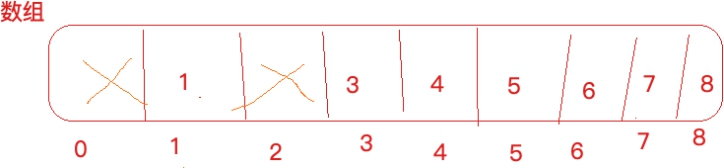


定义一个数组，数组长度大于等于数据集长度，此处长度为9，数据1就存储在下标为1的位置，3就存储在下标为3的元素位置，依次类推。

这个时候，我想看下5存在与否，只需要判断list.get(5)  array[5]  是否为空，如果为空，代表5不存在于数据集，如果不为空代表5在数据集当中，通过一次查找就达到了目的，时间复杂度为O(1)。

这种方式叫做“直接寻址法”：直接把数据和数组的下标绑定到一起，查找的时候，直接array[n]就取出了数据

优点：速度快，一次查找得到结果

缺点：

1）浪费空间，比如 1,5,7,6,3,4,8,12306 ，最大值12306 ，按照上述方式需要定义一个比如长度为 12307的数组，但是只存储零星的几个数据，其他位置空间都浪费着

2）数据如：1,5,7,6,3,4,8,1,2,1,2,1,2,1,2,1,2,1,2,1,2,1,2,1,2,1,2,1,2最大值12，比如开辟13个空间，存储不了这么多内容

现在，换一种设计，如果数据是3，5，7，12306，一共4个数据，我们开辟任意个空间，比如5个，那么具体数据存储到哪个位置呢，我们可以对数据进行求模（对空间位置数5），根据求模余数确定存储   位置的下标，比如3%5=3，就可以把3这个数据放到下标为3的位置上，12306%5=1，就把12306这个   数据存储到下标为1的位置上

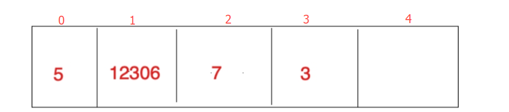


上面对数据求模 （数据%空间位置数） 他就是一个hash算法，只不过这是一种比较普通又简单的hash 算法，这种构造Hash算法的方式叫做除留余数法

如果数据是1，6，7，8，把这4个数据存储到上面的数组中

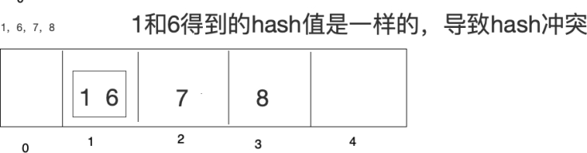

在此基础上采用开放寻址法（了解）

开放寻址法：1放进去了，6再来的时候，向前或者向后找空闲位置存放，不好的地方，如果数组长度定义好了比如10，长度不能扩展，来了11个数据，不管Hash冲突不冲突，肯定存不下这么多数据

拉链法：数据长度定义好了，怎么存储更多内容呢，算好Hash值，在数组元素存储位置放了一个链表


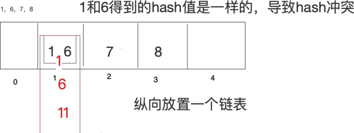 

 

如果Hash算法设计的比较好的话，那么查询效率会更接近于O(1)，如果Hash算法设计的比较low，那么查询效率就会很低了


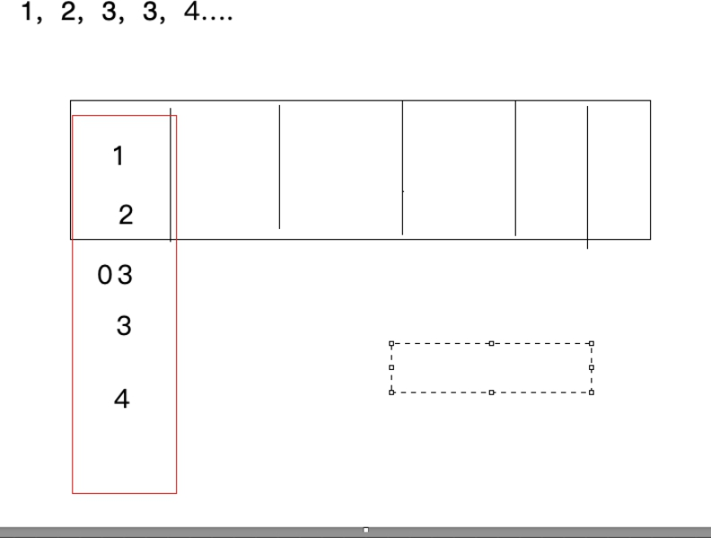


所以，Hash表的查询效率高不高取决于Hash算法，hash算法能够让数据平均分布，既能够节省空间又能提高查询效率。Hash算法的研究是很深的一门学问，比较复杂，长久以来，Hash表内部的Hash算法    也一直在更新，很多数学家也在研究。

除留余数法    3%5

线性构造Hash算法

直接寻址法也是一种构造Hash的方式，只不过更简单，表达式：H(key)=key

比如H(key)=a*key + b(a,b是常量)

hashcode其实也是通过一个Hash算法得来的


## 第 1 节 Hash算法应用场景

Hash算法在分布式集群架构中的应用场景

Hash算法在很多分布式集群产品中都有应用，比如分布式集群架构Redis、Hadoop、ElasticSearch， Mysql分库分表，Nginx负载均衡等

主要的应用场景归纳起来两个

- 请求的负载均衡（比如nginx的ip_hash策略）

Nginx的IP_hash策略可以在客户端ip不变的情况下，将其发出的请求始终路由到同一个目标服务器上，实现会话粘滞，避免处理session共享问题

如果没有IP_hash策略，那么如何实现会话粘滞？

可以维护一张映射表，存储客户端IP或者sessionid与具体目标服务器的映射关系

<ip,tomcat1>

缺点

1） 那么，在客户端很多的情况下，映射表非常大，浪费内存空间

2） 客户端上下线，目标服务器上下线，都会导致重新维护映射表，映射表维护成本很大

如果使用哈希算法，事情就简单很多，我们可以对ip地址或者sessionid进行计算哈希值，哈希值与服务器数量进行取模运算，得到的值就是当前请求应该被路由到的服务器编号，如此，同一个客户端ip发送过来的请求就可以路由到同一个目标服务器，实现会话粘滞。

- 分布式存储

以分布式内存数据库Redis为例,集群中有redis1，redis2，redis3 三台Redis服务器

那么,在进行数据存储时,<key1,value1>数据存储到哪个服务器当中呢？针对key进行hash处理

hash(key1)%3=index, 使用余数index锁定存储的具体服务器节点

## 第 2 节 普通Hash算法存在的问题

普通Hash算法存在一个问题，以ip_hash为例，假定下载用户ip固定没有发生改变，现在tomcat3出现了问题，down机了，服务器数量由3个变为了2个，之前所有的求模都需要重新计算。


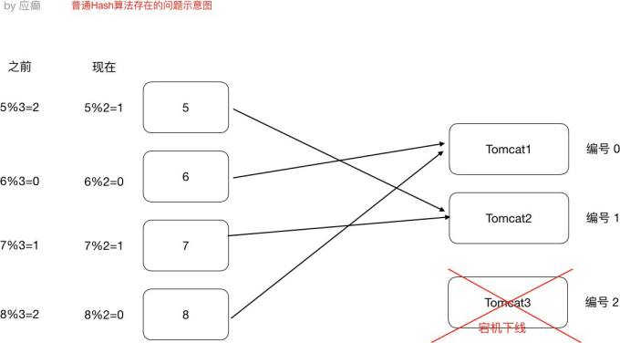 


如果在真实生产情况下，后台服务器很多台，客户端也有很多，那么影响是很大的，缩容和扩容都会存在这样的问题，大量用户的请求会被路由到其他的目标服务器处理，用户在原来服务器中的会话都会丢失。

## 第 3 节 一致性Hash算法

一致性哈希算法思路如下：


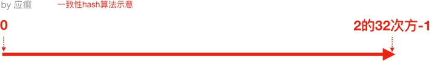

⾸先有一条直线，直线开头和结尾分别定为为1和2的32次方减1，这相当于一个地址，对于这样一条线，弯过来构成一个圆环形成闭环，这样的一个圆环称为hash环。我们把服务器的ip或者主机名求hash值然后对应到hash环上，那么针对客户端用户，也根据它的ip进行hash求值，对应到环上某个位置，然后如何确定一个客户端路由到哪个服务器处理呢？按照顺时针方向找最近的服务器节点


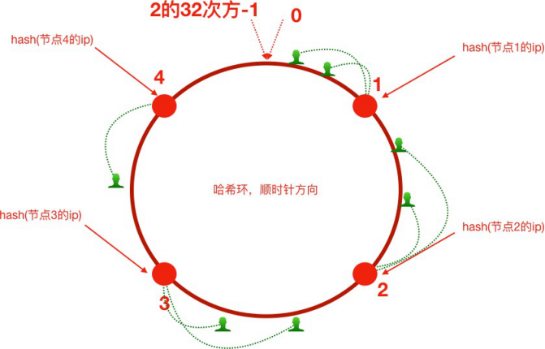 


假如将服务器3下线，服务器3下线后，原来路由到3的客户端重新路由到服务器4，对于其他客户端没有影响只是这一小部分受影响（请求的迁移达到了最小，这样的算法对分布式集群来说非常合适的，避免了大量请求迁移 ）


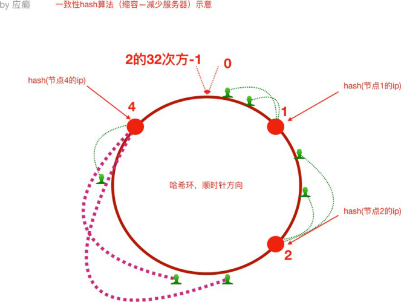


增加服务器5之后，原来路由到3的部分客户端路由到新增服务器5上，对于其他客户端没有影响只是这一小部分受影响（请求的迁移达到了最小，这样的算法对分布式集群来说非常合适的，避免了大量请求迁移 ）


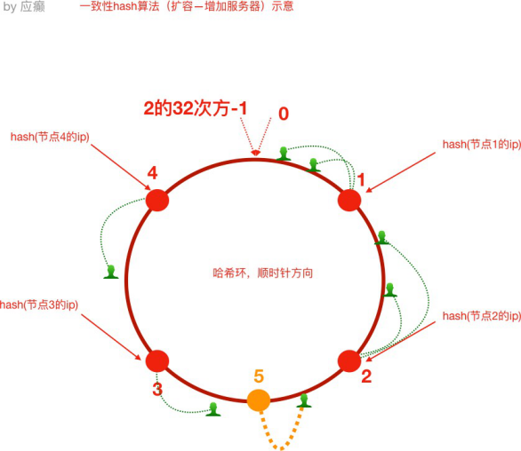 


1） 如前所述，每一台服务器负责一段，一致性哈希算法对于节点的增减都只需重定位环空间中的一小部分数据，具有较好的容错性和可扩展性。

但是，一致性哈希算法在服务节点太少时，容易因为节点分部不均匀而造成数据倾斜问题。例如系统中只有两台服务器，其环分布如下，节点2只能负责非常小的一段，大量的客户端

请求落在了节点1上，这就是数据（请求）倾斜问题

2） 为了解决这种数据倾斜问题，一致性哈希算法引⼊了虚拟节点机制，即对每一个服务节点计算多个哈希，每个计算结果位置都放置一个此服务节点，称为虚拟节点。

具体做法可以在服务器ip或主机名的后面增加编号来实现。比如，可以为每台服务器计算三个虚拟节点，于是可以分别计算 “节点1的ip#1”、“节点1的ip#2”、“节点1的ip#3”、“节点2的ip#1”、“节点2的ip#2”、“节点2的ip#3”的哈希值，于是形成六个虚拟节点，当客户端被路由到虚拟节点的时候其实是被    路由到该虚拟节点所对应的真实节点


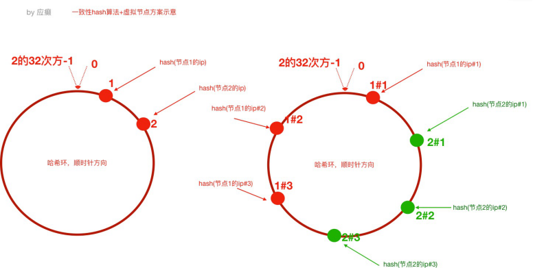 


## 第 4 节 ⼿写实现一致性Hash算法

- 普通Hash算法实现

```java
/**
* 普通Hash算法实现
*/
public class GeneralHash {
    public static void main(String[] args) {
        // 定义客户端IP
        String[] clients = new String[]
        {"10.78.12.3","113.25.63.1","126.12.3.8"};

        // 定义服务器数量
        int serverCount = 5;// (编号对应0，1，2)
        // hash(ip)%node_counts=index
        // 根据index锁定应该路由到的tomcat服务器
        for(String client: clients) {
            int hash = Math.abs(client.hashCode()); int index = hash%serverCount;
            System.out.println("客户端：" + client + " 被路由到服务器编号为：" + index);
        }
    }
}
```

- 一致性Hash算法实现（不含虚拟节点）


```java
import java.util.SortedMap; 
import java.util.TreeMap;

public class ConsistentHashNoVirtual {

    public static void main(String[] args) {
        //step1 初始化：把服务器节点IP的哈希值对应到哈希环上
        // 定义服务器ip
        String[] tomcatServers = new String[]
        {"123.111.0.0","123.101.3.1","111.20.35.2","123.98.26.3"};

        SortedMap<Integer,String> hashServerMap = new TreeMap<>();

        for(String tomcatServer: tomcatServers) {
            // 求出每⼀个ip的hash值，对应到hash环上，存储hash值与ip的对应关系
            int serverHash = Math.abs(tomcatServer.hashCode());
            // 存储hash值与ip的对应关系
            hashServerMap.put(serverHash,tomcatServer);

        }

        //step2 针对客户端IP求出hash值
        // 定义客户端IP
        String[] clients = new String[]
        {"10.78.12.3","113.25.63.1","126.12.3.8"};
        for(String client : clients) {
            int clientHash = Math.abs(client.hashCode());
            //step3 针对客户端,找到能够处理当前客户端请求的服务器（哈希环上顺时针最
            近）
                // 根据客户端ip的哈希值去找出哪⼀个服务器节点能够处理（）
                SortedMap<Integer, String> integerStringSortedMap =
                hashServerMap.tailMap(clientHash);
            if(integerStringSortedMap.isEmpty()) {
                // 取哈希环上的顺时针第⼀台服务器
                Integer firstKey = hashServerMap.firstKey();
                System.out.println("==========>>>>客户端：" + client + " 被路由到服务器：" + hashServerMap.get(firstKey));
            }else{
                Integer firstKey = integerStringSortedMap.firstKey();
                System.out.println("==========>>>>客户端：" + client + " 被路由到服务器：" + hashServerMap.get(firstKey));
            }
        }
    }
}

```

- 一致性Hash算法实现（含虚拟节点）

```java
import java.util.SortedMap; 
import java.util.TreeMap;

public class ConsistentHashWithVirtual {

    public static void main(String[] args) {
        //step1 初始化：把服务器节点IP的哈希值对应到哈希环上
        // 定义服务器ip
        String[] tomcatServers = new String[]
        {"123.111.0.0","123.101.3.1","111.20.35.2","123.98.26.3"};

        SortedMap<Integer,String> hashServerMap = new TreeMap<>();

        // 定义针对每个真实服务器虚拟出来⼏个节点
        int virtaulCount = 3;

        for(String tomcatServer: tomcatServers) {
            // 求出每⼀个ip的hash值，对应到hash环上，存储hash值与ip的对应关系
            int serverHash = Math.abs(tomcatServer.hashCode());
            // 存储hash值与ip的对应关系
            hashServerMap.put(serverHash,tomcatServer);

            // 处理虚拟节点
            for(int i = 0; i < virtaulCount; i++) {
                int virtualHash = Math.abs((tomcatServer + "#" +i).hashCode());
                hashServerMap.put(virtualHash,"----由虚拟节点"+ i + "映射过来的请求："+ tomcatServer);
            }
        }

        //step2 针对客户端IP求出hash值
        // 定义客户端IP
        String[] clients = new String[]
        {"10.78.12.3","113.25.63.1","126.12.3.8"};
        for(String client : clients) {
            int clientHash = Math.abs(client.hashCode());
            //step3 针对客户端,找到能够处理当前客户端请求的服务器（哈希环上顺时针最
            近）
                // 根据客户端ip的哈希值去找出哪⼀个服务器节点能够处理（）
                SortedMap<Integer, String> integerStringSortedMap = hashServerMap.tailMap(clientHash);
            if(integerStringSortedMap.isEmpty()) {
                // 取哈希环上的顺时针第⼀台服务器
                Integer firstKey = hashServerMap.firstKey();
                System.out.println("==========>>>>客户端：" + client + " 被路由到服务器：" + hashServerMap.get(firstKey));
            }else{
                Integer firstKey = integerStringSortedMap.firstKey();
                System.out.println("==========>>>>客户端：" + client + " 被路由到服务器：" + hashServerMap.get(firstKey));
            }
        }
    }
}
```


## 第 5 节 Nginx 配置一致性Hash负载均衡策略

ngx_http_upstream_consistent_hash   模块是一个负载均衡器，使用一个内部一致性hash算法来选择合适的后端节点。

该模块可以根据配置参数采取不同的方式将请求均匀映射到后端机器， 

consistent_hash $remote_addr：可以根据客户端ip映射

consistent_hash $request_uri：根据客户端请求的uri映射

consistent_hash $args：根据客户端携带的参数进行映

ngx_http_upstream_consistent_hash 模块是一个第三方模块，需要我们下载安装后使用

1）github下载nginx一致性hash负载均衡模块 https://github.com/replay/ngx_http_consistent_hash


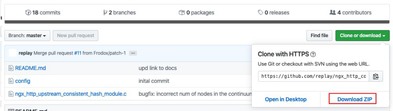


2） 将下载的压缩包上传到nginx服务器，并解压

3） 我们已经编译安装过nginx，此时进⼊当时nginx的源码目录，执行如下命令

```
./configure —add-module=/root/ngx_http_consistent_hash-master 
make
make install
```

4）Nginx就可以使用啦，在nginx.conf⽂件中配置

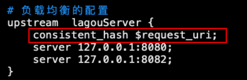


# 第二部分 集群时钟同步问题


## 第 1 节 时钟不同步导致的问题

时钟此处指服务器时间，如果集群中各个服务器时钟不一致势必导致一系列问题，试想   “集群是各个服务器一起团队化作战，大家工作都不在一个点上，岂不乱了套！”

举一个例⼦，电商⽹站业务中，新增一条订单，那么势必会在订单表中增加了一条记录，该条记录中应    该会有“下单时间”这样的字段，往往我们会在程序中获取当前系统时间插⼊到数据库或者直接从数据库    服务器获取时间。那我们的订单⼦系统是集群化部署，或者我们的数据库也是分库分表的集群化部署，    然而他们的系统时钟缺不一致，比如有一台服务器的时间是昨天，那么这个时候下单时间就成了昨天，    那我们的数据将会混乱！如下

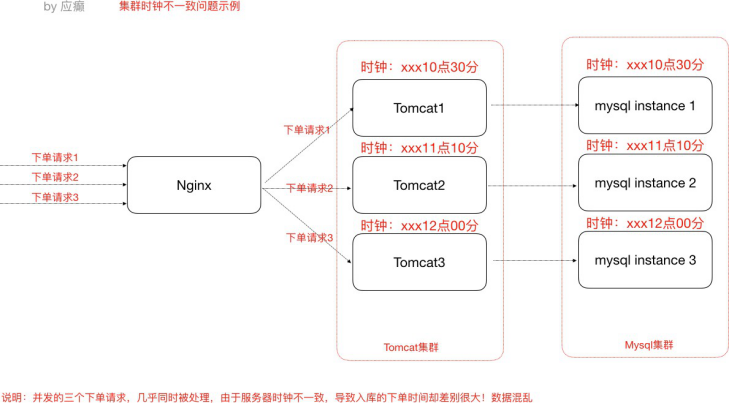

 

## 第 2 节 集群时钟同步配置

- 集群时钟同步思路

  - 分布式集群中各个服务器节点都可以连接互联网
  思路：


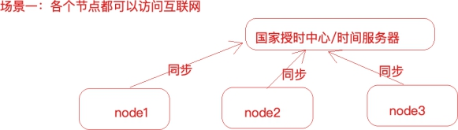 

 

操作方式：

```
#使⽤ ntpdate ⽹络时间同步命令
ntpdate -u ntp.api.bz	#从⼀个时间服务器同步时间
```

windows有计划任务

Linux也有定时任务，crond，可以使用linux的定时任务，每隔10分钟执行一次ntpdate命令   

分布式集群中某一个服务器节点可以访问互联⽹或者所有节点都不能够访问互联⽹

X思路：

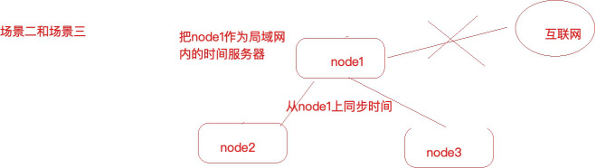


操作方式：

1）选取集群中的一个服务器节点A(172.17.0.17)作为时间服务器（整个集群时间从这台服务    器同步，如果这台服务器能够访问互联⽹，可以让这台服务器和⽹络时间保持同步，如果不   能就⼿动设置一个时间）

  - 首先设置好A的时间

  - 把A配置为时间服务器（修改/etc/ntp.conf⽂件）

```
1、如果有 restrict default ignore，注释掉它
2、添加如下⼏⾏内容
    restrict 172.17.0.0 mask 255.255.255.0 nomodify notrap	
    # 放开局域⽹同步功能,172.17.0.0是你的局域⽹⽹段
    server 127.127.1.0 # local clock 
    fudge 127.127.1.0 stratum 10
3、重启⽣效并配置ntpd服务开机⾃启动
    service ntpd restart 
    chkconfig ntpd on
```


集群中其他节点就可以从A服务器同步时间了

```
ntpdate 172.17.0.17
```

 

# 第三部分 分布式ID解决方案


为什么需要分布式ID(分布式集群环境下的全局唯一ID)

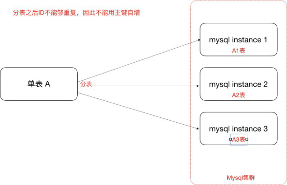


- UUID(可以用)

  UUID 是指Universally Unique Identifier，翻译为中⽂是通用唯一识别码产生重复 UUID 并造成错误的情况非常低，是故大可不必考虑此问题。Java中得到一个UUID，可以使用java.util包提供的方法

```java
public class MyTest {
    public static void main(String[] args) { 
        System.out.println(java.util.UUID.randomUUID().toString());
        // 特点是生成的ID 特别长， 没什么规律， 作为主键对效率比较差
    }
}
```

- 独立数据库的自增ID

  比如A表分表为A1表和A2表，那么肯定不能让A1表和A2表的ID⾃增，那么ID怎么获取呢？我们可   以单独的创建一个Mysql数据库，在这个数据库中创建一张表，这张表的ID设置为⾃增，其他地方   需要全局唯一ID的时候，就模拟向这个Mysql数据库的这张表中模拟插⼊一条记录，此时ID会⾃增，然后我们可以通过Mysql的select last_insert_id() 获取到刚刚这张表中⾃增生成的ID.

比如，我们创建了一个数据库实例global_id_generator，在其中创建了一个数据表，表结构如   下：

```sql
-- ----------------------------
-- Table structure for DISTRIBUTE_ID
-- ----------------------------
DROP TABLE IF EXISTS `DISTRIBUTE_ID`; CREATE TABLE `DISTRIBUTE_ID` (
    `id` bigint(32) NOT NULL AUTO_INCREMENT COMMENT '主键',
    `createtime` datetime DEFAULT NULL, PRIMARY KEY (`id`)
) ENGINE=InnoDB DEFAULT CHARSET=utf8;
```


当分布式集群环境中哪个应用需要获取一个全局唯一的分布式ID的时候，就可以使用代码连接这个   数据库实例，执行如下sql语句即可。

```sql
insert into DISTRIBUTE_ID(createtime) values(NOW()); 
select LAST_INSERT_ID()；
```

注意：

1） 这⾥的createtime字段⽆实际意义，是为了随便插⼊一条数据以⾄于能够⾃增id。

2） 使用独⽴的Mysql实例生成分布式id，虽然可行，但是性能和可靠性都不够好，因为你需要代    码连接到数据库才能获取到id，性能⽆法保障，另外mysql数据库实例挂掉了，那么就⽆法获取分    布式id了。

3） 有一些开发者又针对上述的情况将用于生成分布式id的mysql数据库设计成了一个集群架构，   那么其实这种方式现在基本不用，因为过于麻烦了。

- SnowFlake 雪花算法（可以用，推荐）

雪花算法是Twitter推出的一个用于生成分布式ID的策略。

雪花算法是一个算法，基于这个算法可以生成ID，生成的ID是一个long型，那么在Java中一个long   型是8个字节，算下来是64bit，如下是使用雪花算法生成的一个ID的二进制形式示意：


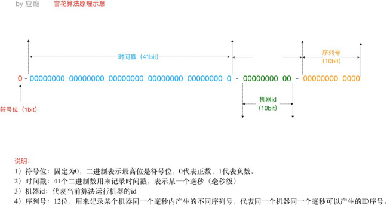 


另外，一切互联⽹公司也基于上述的方案封装了一些分布式ID生成器，比如滴滴的tinyid（基于数    据库实现）、百度的uidgenerator（基于SnowFlake）和美团的leaf（基于数据库和SnowFlake）   等，他们在。

- 借助Redis的Incr命令获取全局唯一ID（推荐）

Redis Incr 命令将 key 中储存的数字值增一。如果 key 不存在，那么 key 的值会先被初始化为 0，然后再执行 INCR 操作。

```
<key,value>
<id,>
.incr(id) 1 2 3 4
```

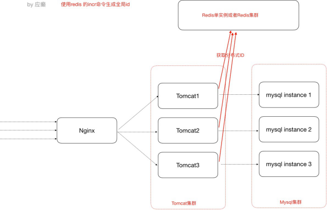


- Redis安装（示意，我们这⾥安装单节点使用一下，具体Redis⾃身的内容在后续分布式缓存   课程中详细讲解）

（1）官⽹下载redis-3.2.10.tar.gz

（2）上传到linux服务器解压 tar -zxvf redis-3.2.10.tar.gz 

（3）cd 解压⽂件目录，对解压的redis进行编译  make

（4）然后cd 进⼊src目录，执行make install

（5）修改解压目录中的配置⽂件redis.conf，关掉保护模式


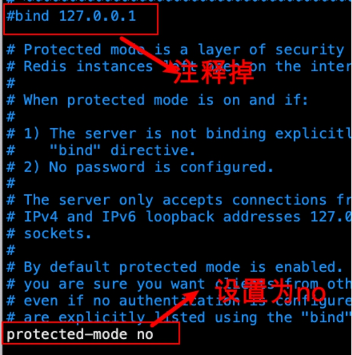


在src目录下执行 ./redis-server ../redis.conf 启动redis服务

Java代码中使用Jedis客户端调用Reids的incr命令获得一个全局的id

引⼊jedis客户端jar

```xml
<dependency>
    <groupId>redis.clients</groupId>
    <artifactId>jedis</artifactId>
    <version>2.9.0</version>
</dependency>
```

Java代码（此处我们就是连接单节点，也不使用连接池）

```java
Jedis jedis = new Jedis("127.0.0.1",6379); try {
    long id = jedis.incr("id");
    System.out.println("从redis中获取的分布式id为：" + id);
} finally {
    if (null != jedis) { 
        jedis.close();
    }
}
```


# 第四部分 分布式调度问题


调度—>定时任务，分布式调度—>在分布式集群环境下定时任务这件事

Elastic-job（当当⽹开源的分布式调度框架）

## 第 1 节 定时任务的场景

定时任务形式：每隔一定时间/特定某一时刻执行例如：

- 订单审核、出库
- 订单超时⾃动取消、⽀付退款
- 礼券同步、生成、发放作业
- 物流信息推送、抓取作业、退换货处理作业
- 数据积压监控、⽇志监控、服务可用性探测作业
- 定时备份数据
- ⾦融系统每天的定时结算
- 数据归档、清理作业
- 报表、离线数据分析作业

## 第 2 节 什么是分布式调度

什么是分布式任务调度？有两层含义

1） 运行在分布式集群环境下的调度任务（同一个定时任务程序部署多份，只应该有一个定时任务在执行）

2） 分布式调度—>定时任务的分布式—>定时任务的拆分（即为把一个大的作业任务拆分为多个小的作业任务，同时执行）


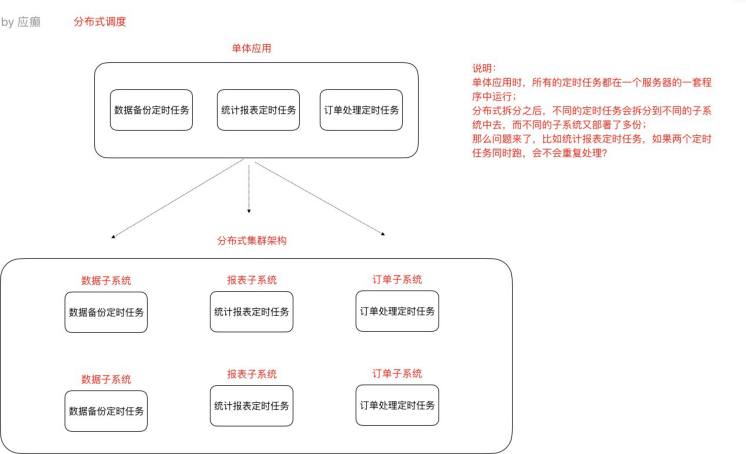 

 

## 第 3 节 定时任务与消息队列的区别

- 共同点

（1）异步处理

    比如注册、下单事件
（2）应用解耦

不管定时任务作业还是MQ都可以作为两个应用之间的⻮轮实现应用解耦，这个⻮轮可以中转    数据，当然单体服务不需要考虑这些，服务拆分的时候往往都会考虑

（3）流量削峰 

双⼗一的时候，任务作业和MQ都可以用来扛流量，后端系统根据服务能⼒定时处理订单或者    从MQ抓取订单抓取到一个订单到来事件的话触发处理，对于前端用户来说看到的结果是已经    下单成功了，下单是不受任何影响的

- 本质不同

定时任务作业是时间驱动，而MQ是事件驱动；

时间驱动是不可代替的，比如⾦融系统每⽇的利息结算，不是说利息来一条（利息到来事件）就算一下，而往往是通过定时任务批量计算；

所以，定时任务作业更倾向于批处理，MQ倾向于逐条处理；

## 第 4 节 定时任务的实现方式

定时任务的实现方式有多种。早期没有定时任务框架的时候，我们会使用JDK中的Timer机制和多线程机    制（Runnable+线程休眠）来实现定时或者间隔一段时间执行某一段程序；后来有了定时任务框架，比    如大名鼎鼎的Quartz任务调度框架，使用时间表达式（包括：秒、分、时、⽇、周、年）配置某一个任   务什么时间去执行：

任务调度框架Quartz回顾示意(我们课程主要内容不是Quartz)


- 引⼊jar

```xml
<!--任务调度框架quartz-->
<!-- https://mvnrepository.com/artifact/org.quartz-scheduler/quartz -->
<dependency>
    <groupId>org.quartz-scheduler</groupId>
    <artifactId>quartz</artifactId>
    <version>2.3.2</version>
</dependency>
```

- 定时任务作业主调度程序


```java
package quartz;


import org.quartz.*;
import org.quartz.impl.StdSchedulerFactory; public class QuartzMain {
    // 创建作业任务调度器（类似于公交调度站）
    public static Scheduler createScheduler() throws SchedulerException {
        SchedulerFactory schedulerFactory = new StdSchedulerFactory(); 
        Scheduler scheduler = schedulerFactory.getScheduler();
        return scheduler;
    }


    // 创建⼀个作业任务（类似于⼀辆公交⻋）
    public static	JobDetail createJob()	{
        JobBuilder jobBuilder = JobBuilder.newJob(DemoJob.class); 		
        jobBuilder.withIdentity("jobName","myJob");
        JobDetail jobDetail = jobBuilder.build(); return jobDetail;
    }

    /**
    *创建作业任务时间触发器（类似于公交⻋出⻋时间表）
    *cron表达式由七个位置组成，空格分隔
    *1、Seconds（秒）	0~59
    *2、Minutes（分）	0~59
    *3、Hours（⼩时）	0~23
    *4、Day of Month（天）1~31,注意有的⽉份不⾜31天
    *5、Month（⽉）   0~11,或者
    JAN,FEB,MAR,APR,MAY,JUN,JUL,AUG,SEP,OCT,NOV,DEC
    *6、Day of Week(周)	1~7,1=SUN或者	SUN,MON,TUE,WEB,THU,FRI,SAT
    * 7、Year（年）1970~2099	可选项
    *示例：
    *0 0 11 * * ? 每天的11点触发执⾏⼀次
    *0 30 10 1 * ? 每⽉1号上午10点半触发执⾏⼀次
    */
    public static	Trigger createTrigger() {
        // 创建时间触发器，按⽇历调度
        CronTrigger trigger = TriggerBuilder.newTrigger()
            .withIdentity("triggerName","myTrigger")
            .startNow()
            .withSchedule(CronScheduleBuilder.cronSchedule("0/2 * * * * ?")).build();
            // 创建触发器，按简单间隔调度
            /*SimpleTrigger trigger1 = TriggerBuilder.newTrigger()
            .withIdentity("triggerName","myTrigger")
            .startNow()
            .withSchedule(SimpleScheduleBuilder
            .simpleSchedule()
            .withIntervalInSeconds(3)
            .repeatForever())
            .build();*/ 
        return trigger;
	}

    // 定时任务作业主调度程序
    public static void main(String[] args) throws SchedulerException {
        // 创建⼀个作业任务调度器（类似于公交调度站）
        Scheduler scheduler = QuartzMain.createScheduler();
        // 创建⼀个作业任务（类似于⼀辆公交⻋）
        JobDetail job = QuartzMain.createJob();
        // 创建⼀个作业任务时间触发器（类似于公交⻋出⻋时间表）
        Trigger trigger = QuartzMain.createTrigger();
        // 使⽤调度器按照时间触发器执⾏这个作业任务scheduler.scheduleJob(job,trigger); scheduler.start();

    }
}

```

- 定义一个job，需实现Job接⼝


```java
package quartz;
import org.quartz.Job;
import org.quartz.JobExecutionContext; 
import org.quartz.JobExecutionException;
public class DemoJob implements Job {
    public void execute(JobExecutionContext jobExecutionContext) throws JobExecutionException {
        System.out.println("我是⼀个定时任务逻辑");
    }
}
```

以上，是回顾一下任务调度框架Quartz的大致用法，那么在分布式架构环境中使用Quartz已经不能更好    的满⾜我们需求，我们可以使用专业的分布式调度框架，这⾥我们推荐使用Elastic-job。

## 第 5 节 分布式调度框架Elastic-Job

### 5.1 Elastic-Job介绍

Elastic-Job是当当⽹开源的一个分布式调度解决方案，基于Quartz二次开发的，由两个相互独⽴的子项

目Elastic-Job-Lite和Elastic-Job-Cloud组成。我们要学习的是 Elastic-Job-Lite，它定位为轻量级⽆中心化解决方案，使用Jar包的形式提供分布式任务的协调服务，而Elastic-Job-Cloud⼦项目需要结合Mesos   以及Docker在云环境下使用。

Elastic-Job的github地址：https://github.com/elasticjob

#### 主要功能介绍

- 分布式调度协调

  在分布式环境中，任务能够按指定的调度策略执行，并且能够避免同一任务多实例重复执行 
  
- 丰富的调度策略 基于成熟的定时任务作业框架Quartz cron表达式执行定时任务

- 弹性扩容缩容   当集群中增加某一个实例，它应当也能够被选举并执行任务；当集群减少一个实例时，它所执行的任务能被转移到别的实例来执行。

- 失效转移 某实例在任务执行失败后，会被转移到其他实例执行

- 错过执行作业重触发   若因某种原因导致作业错过执行，⾃动记录错过执行的作业，并在上次作业完成后⾃动触发。

- 支持并行调度   ⽀持任务分片，任务分片是指将一个任务分为多个小任务项在多个实例同时执行。作业分片一致性 当任务被分片后，保证同一分片在分布式环境中仅一个执行实例。

### 5.2 Elastic-Job-Lite应用

jar包（API） + 安装zk软件

Elastic-Job依赖于Zookeeper进行分布式协调，所以需要安装Zookeeper软件（3.4.6版本以上），关于Zookeeper，此处我们不做详解，在阶段三会有深度学习，我们此处需要明⽩Zookeeper的本质功能：    存储+通知。


- 安装Zookeeper（此处单例配置）

1）我们使用3.4.10版本，在linux平台解压下载的zookeeper-3.4.10.tar.gz 

2）进⼊conf目录，cp zoo_sample.cfg zoo.cfg

3) 进⼊bin目录，启动zk服务

启动 ./zkServer.sh start

停止 ./zkServer.sh stop

查看状态 ./zkServer.sh status

#### Zookeeper的树形节点结构图

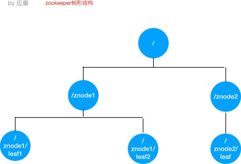


- 引⼊Jar包

```xml
<!-- https://mvnrepository.com/artifact/com.dangdang/elastic-job-lite-core
-->
<dependency>
<groupId>com.dangdang</groupId>
<artifactId>elastic-job-lite-core</artifactId>
<version>2.1.5</version>
</dependency>
```

- 定时任务实例

    需求：每隔两秒钟执行一次定时任务（resume表中未归档的数据归档到resume_bak表中，   每次归档1条记录）

1） resume_bak和resume表结构完全一样

2） resume表中数据归档之后不删除，只将state置为"已归档"

    数据表结构

```sql
-- ----------------------------
-- Table structure for resume
-- ----------------------------
DROP TABLE IF EXISTS `resume`;
CREATE TABLE `resume` (
    `id` bigint(20) NOT NULL AUTO_INCREMENT,
    `name` varchar(255) DEFAULT NULL,
    `sex` varchar(255) DEFAULT NULL,
    `phone` varchar(255) DEFAULT NULL,
    `address` varchar(255) DEFAULT NULL,
    `education` varchar(255) DEFAULT NULL,
    `state` varchar(255) DEFAULT NULL, PRIMARY KEY (`id`)
) ENGINE=InnoDB AUTO_INCREMENT=1001 DEFAULT CHARSET=utf8;
SET FOREIGN_KEY_CHECKS = 1;
```

- 程序开发

  - 定时任务类

```java
package elasticjob;
import com.dangdang.ddframe.job.api.ShardingContext;
import com.dangdang.ddframe.job.api.simple.SimpleJob; 
import util.JdbcUtil;

import java.sql.Connection;
import java.sql.PreparedStatement; import java.sql.ResultSet;
import java.util.List;
import java.util.Map;

public class BackupJob implements SimpleJob {

    // 定时任务每执⾏⼀次都会执⾏如下的逻辑
    @Override
    public void execute(ShardingContext shardingContext) {
        /*
从resume数据表查找1条未归档的数据，将其归档到resume_bak 表，并更新状态为已归档（不删除原数据）
*/

        // 查询出⼀条数据
        String selectSql = "select * from resume where state='未归档' limit 1";
        List<Map<String, Object>> list =
            JdbcUtil.executeQuery(selectSql);
        if(list == null || list.size() == 0) {
            return;
        }
        Map<String, Object> stringObjectMap = list.get(0); long id = (long) stringObjectMap.get("id");
        String name = (String) stringObjectMap.get("name"); String education = (String)
            stringObjectMap.get("education");

        // 打印出这条记录
        System.out.println("======>>>id：" + id + " name：" + name + " education：" + education);

        // 更改状态
        String updateSql = "update resume set state='已归档'
            where id=?";
            JdbcUtil.executeUpdate(updateSql,id);
        // 归档这条记录
        String insertSql = "insert into resume_bak	select * from resume where id=?";
        JdbcUtil.executeUpdate(insertSql,id);
    }
}

```

- 主类

```java
package elasticjob;

import com.dangdang.ddframe.job.config.JobCoreConfiguration; 
import com.dangdang.ddframe.job.config.simple.SimpleJobConfiguration; import com.dangdang.ddframe.job.lite.api.JobScheduler;
import com.dangdang.ddframe.job.lite.config.LiteJobConfiguration; import com.dangdang.ddframe.job.reg.base.CoordinatorRegistryCenter; import com.dangdang.ddframe.job.reg.zookeeper.ZookeeperConfiguration; import com.dangdang.ddframe.job.reg.zookeeper.ZookeeperRegistryCenter;

public class ElasticJobMain {
    public static void main(String[] args) {
        // 配置注册中心zookeeper，zookeeper协调调度，不能让任务重复执⾏， 通过命名空间分类管理任务，对应到zookeeper的⽬录
        ZookeeperConfiguration zookeeperConfiguration = new ZookeeperConfiguration("localhost:2181","data-archive-job");
        CoordinatorRegistryCenter coordinatorRegistryCenter = new ZookeeperRegistryCenter(zookeeperConfiguration);
        coordinatorRegistryCenter.init();

        // 配置任务
        JobCoreConfiguration jobCoreConfiguration = JobCoreConfiguration
            .newBuilder("archive-job","*/2 * * * ?",1).build();
        SimpleJobConfiguration simpleJobConfiguration = new SimpleJobConfiguration(jobCoreConfiguration,BackupJob.class.getNam e());
        // 启动任务
        new JobScheduler(coordinatorRegistryCenter, LiteJobConfiguration.newBuilder(simpleJobConfiguration).build()).i nit();
    }
}
```

- JdbcUtil工具类


```java
package util;
import java.sql.*;
import java.util.ArrayList; 
import java.util.HashMap; 
import java.util.List; 
import java.util.Map;

public class JdbcUtil {
    //url
    private static String url = "jdbc:mysql://localhost:3306/job? characterEncoding=utf8&useSSL=false";
    //user
    private static String user = "root";
    //password
    private static String password = "123456";
    //驱动程序类
    private static String driver = "com.mysql.jdbc.Driver";

    static {
        try {
            Class.forName(driver);
        } catch (ClassNotFoundException e) {
            // TODO Auto-generated catch block e.printStackTrace();
        }
    }
    public static Connection getConnection() {
        try {
            return DriverManager.getConnection(url, user,password);

        } catch (SQLException e) {
            // TODO Auto-generated catch block e.printStackTrace();
        }
        return null;

    }
    public static void close(ResultSet rs, PreparedStatement ps, Connection con){
        if (rs != null) { 
            try {
                rs.close();
            } catch (SQLException e) {
                // TODO Auto-generated catch block e.printStackTrace();
            } finally {
                if (ps != null) { 
                    try {
                        ps.close();
                    } catch (SQLException e) {
                        // TODO Auto-generated catch block e.printStackTrace();
                    } finally {
                        if (con != null) { 
                            try {
                                con.close();
                            } catch (SQLException e) {
                                // TODO Auto-generated catch block e.printStackTrace();
                            }
                        }
                    }
                }
            }
        }
    }
    public static void executeUpdate(String sql,Object...obj) { 
        Connection con = getConnection();
        PreparedStatement ps = null; try {
            ps = con.prepareStatement(sql);
            for (int i = 0; i < obj.length; i++) { 
                ps.setObject(i + 1, obj[i]);
            }
            ps.executeUpdate();
        } catch (SQLException e) {
            // TODO Auto-generated catch block e.printStackTrace();
        } finally {
            close(null, ps, con);
        }
    }

    public static List<Map<String,Object>> executeQuery(String sql, Object...obj) {

        Connection con = getConnection(); 
        ResultSet rs = null; 
        PreparedStatement ps = null;
        try {
            ps = con.prepareStatement(sql);
            for (int i = 0; i < obj.length; i++) { 
                ps.setObject(i + 1, obj[i]);                            
            }
            rs = ps.executeQuery();
            List<Map<String, Object>> list = new ArrayList<>(); 
            int count = rs.getMetaData().getColumnCount(); 
            while (rs.next()) {
                Map<String, Object> map = new HashMap<String, Object>();
                for (int i = 0; i < count; i++) { 
                    Object ob = rs.getObject(i + 1);
                    String key = rs.getMetaData().getColumnName(i + 1);
                    map.put(key, ob);
                }
                list.add(map);
            }
            return list;
        } catch (SQLException e) {
            // TODO Auto-generated catch block e.printStackTrace();
        } finally {
            close(rs, ps, con);
        }
        return null;
    }
}

```


- 测试

1） 可先启动一个进程，然后再启动一个进程（两个进程模拟分布式环境下，通一个定时任务   部署了两份在工作）

2） 两个进程逐个启动，观察现象

3）关闭其中执行的进程，观察现象

- Leader节点选举机制

  每个Elastic-Job的任务执行实例App作为Zookeeper的客户端来操作ZooKeeper的znode

（1） 多个实例同时创建/leader节点

（2） /leader节点只能创建一个，后创建的会失败，创建成功的实例会被选为leader节点， 执行任务

### 5.4 Elastic-Job-Lite轻量级去中心化的特点

如何理解轻量级和去中心化？

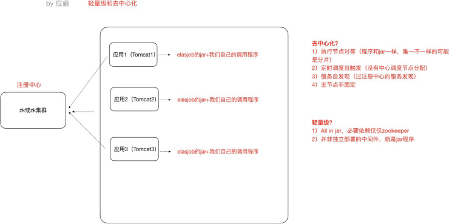

 

### 5.5 任务分片

一个大的非常耗时的作业Job，比如：一次要处理一亿的数据，那这一亿的数据存储在数据库中，如果用一个作业节点处理一亿数据要很久，在互联⽹领域是不太能接受的，互联⽹领域更希望机器的增加去   横向扩展处理能⼒。所以，ElasticJob可以把作业分为多个的task（每一个task就是一个任务分片），每一个task交给具体的一个机器实例去处理（一个机器实例是可以处理多个task的），但是具体每个task   执行什么逻辑由我们⾃⼰来指定。


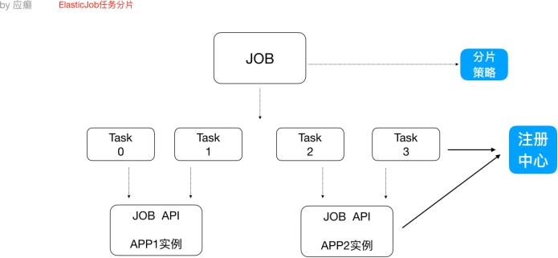 


Strategy策略定义这些分片项怎么去分配到各个机器上去，默认是平均去分，可以定制，比如某一个机器负载   比较高或者预配置比较高，那么就可以写策略。分片和作业本身是通过一个注册中心协调的，因为在分布式环境下，状态数据肯定集中到一点，才可以在分布式中沟通。

**分片代码**


5.6  弹性扩容

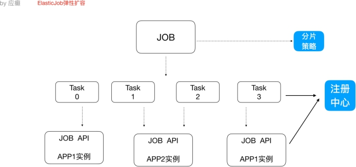 


新增加一个运行实例app3，它会⾃动注册到注册中心，注册中心发现新的服务上线，注册中心会通知ElasticJob 进行重新分片，那么总得分片项有多少，那么就可以搞多少个实例机器，比如完全可以分1000片

最多就可以有多少app实例，机器能成的主，完全可以分1000片  

那么就可以搞1000台机器一起执行作业

注意：

1） 分片项也是一个JOB配置，修改配置，重新分片，在下一次定时运行之前会重新调用分片算法，那么    这个分片算法的结果就是：哪台机器运行哪一个一片，这个结果存储到zk中的，主节点会把分片给分好   放到注册中心去，然后执行节点从注册中心获取信息(执行节点在定时任务开启的时候获取相应的分片)。

2） 如果所有的节点挂掉值剩下一个节点，所有分片都会指向剩下的一个节点，这也是ElasticJob的高可用。

 

# 第五部分 Session共享问题


Session共享及Session保持或者叫做Session一致性


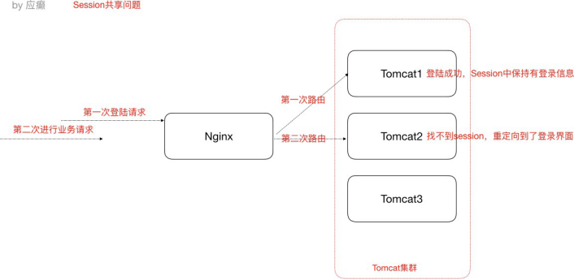 

 

### 第 1 节 Session问题原因分析

出现这个问题的原因，从根本上来说是因为Http协议是⽆状态的协议。客户端和服务端在某次会话中产生的数据不会被保留下来，所以第二次请求服务端⽆法认识到你曾经来过，   Http为什么要设计为⽆状态协议？早期都是静态⻚面⽆所谓有⽆状态，后来有动态的内容更丰富，就需要有状态，出现了两种用于    保持Http状态的技术，那就是Cookie和Session。而出现上述不停让登录的问题，分析如下图：

场景：nginx默认轮询策略


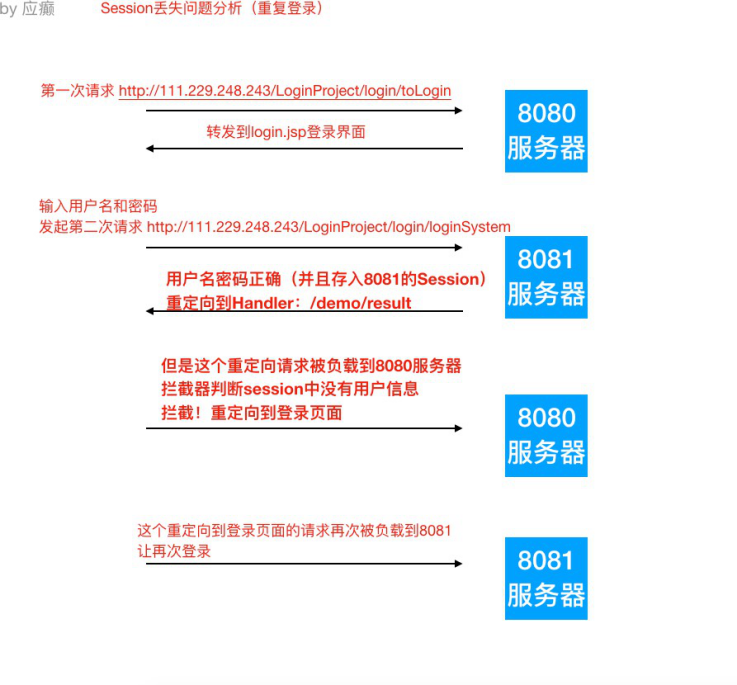 

 

### 第 2 节 解决Session一致性的方案

- Nginx的 IP_Hash 策略（可以使用）

同一个客户端IP的请求都会被路由到同一个目标服务器，也叫做会话粘滞  

优点：

  配置简单，不⼊侵应用，不需要额外修改代码

缺点：

  服务器重启Session丢失

  存在单点负载高的风险

  单点故障问题

- Session复制（不推荐）

  也即，多个tomcat之间通过修改配置⽂件，达到Session之间的复制


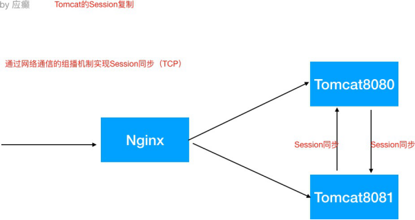 


优点：

```
不⼊侵应用
便于服务器⽔平扩展
能适应各种负载均衡策略
服务器重启或者宕机不会造成Session丢失
```

缺点：

```
性能低
内存消耗
不能存储太多数据，否则数据越多越影响性能
延迟性
```

- Session共享，Session集中存储（推荐）

Session的本质就是缓存，那Session数据为什么不交给专业的缓存中间件呢？比如Redis

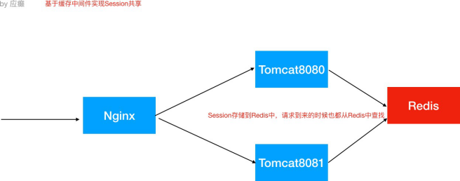


优点:

```
能适应各种负载均衡策略
服务器重启或者宕机不会造成Session丢失
扩展能力强
适合大集群数量使用
```


缺点：

```
对应用有⼊侵，引⼊了和Redis的交互代码
```


**Spring Session使得基于Redis的Session共享应用起来非常之简单**

1） 引⼊Jar

```xml
<dependency>
    <groupId>org.springframework.boot</groupId>
    <artifactId>spring-boot-starter-data-redis</artifactId>
</dependency>
<dependency>
    <groupId>org.springframework.session</groupId>
    <artifactId>spring-session-data-redis</artifactId>
</dependency>
```


2） 配置redis

```
spring.redis.database=0
spring.redis.host=127.0.0.1
spring.redis.port=6379
```

 

3） 添加注解

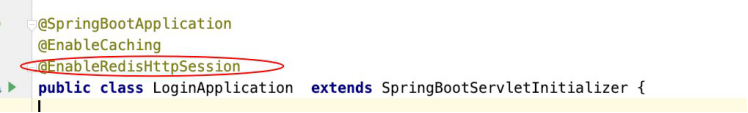

 源码示意（了解）

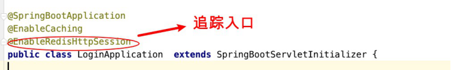

该注解可以创建一个过滤器使得SpringSession替代HttpSession发挥作用，找到那个过滤器！

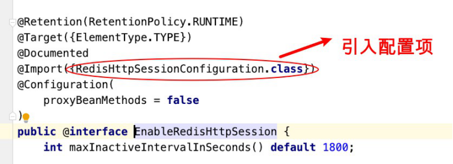 

观察其⽗类，⽗类中有Filter


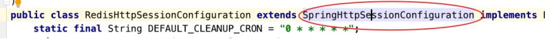 


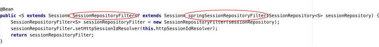


这个Filter就是SpringSession最核心的地方


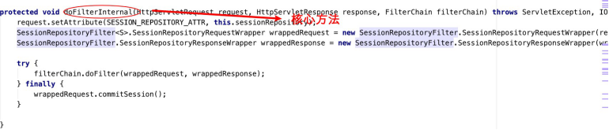


在过滤器中将HttpServletRequest包装


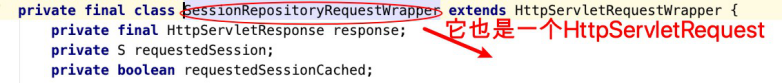


本质就是一个HtppRequest，拥有同样的方法，找getSession

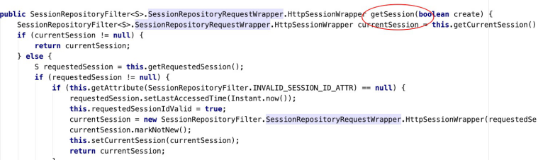 


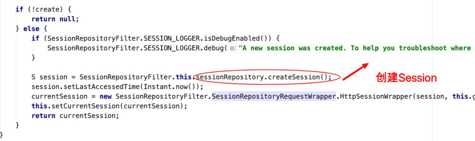


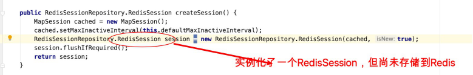 


回到SessionRepositoryFilter的doFilterInternal方法


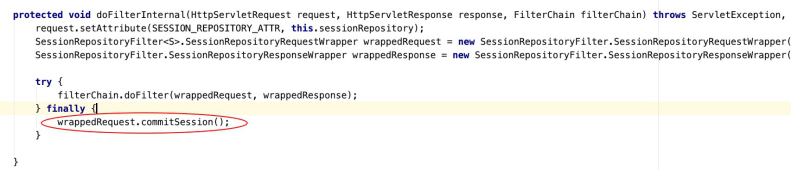 


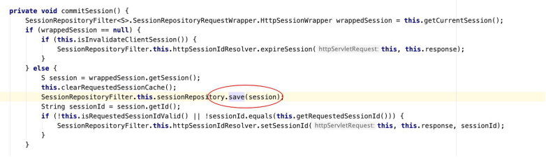


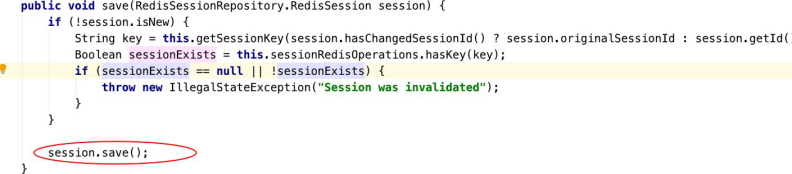

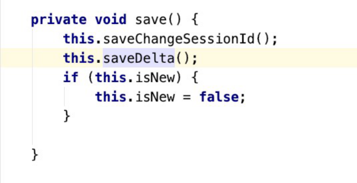 


#### 原理示意（了解）


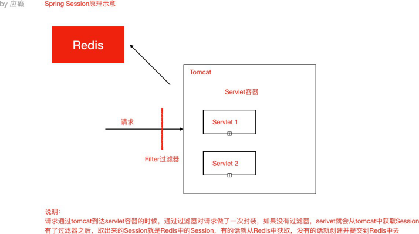 